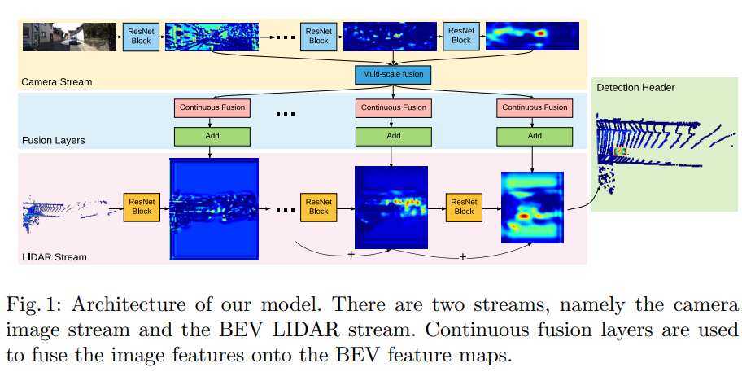
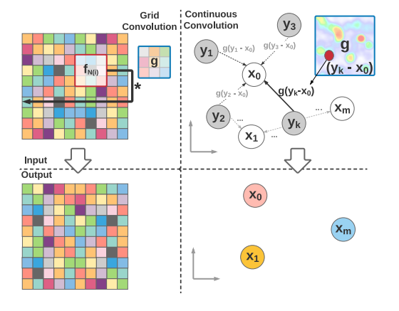
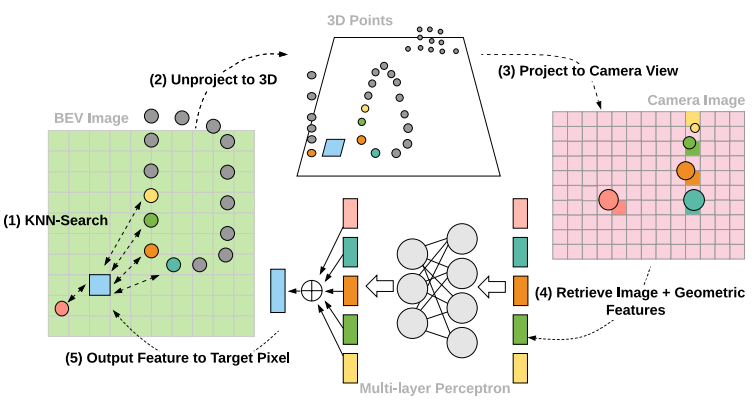
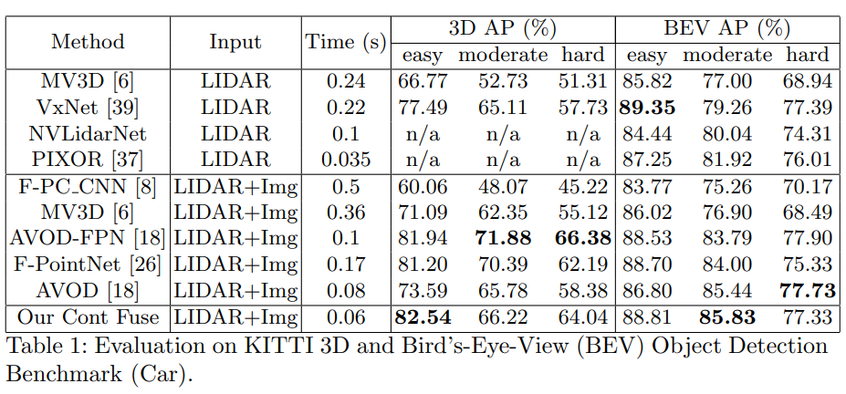
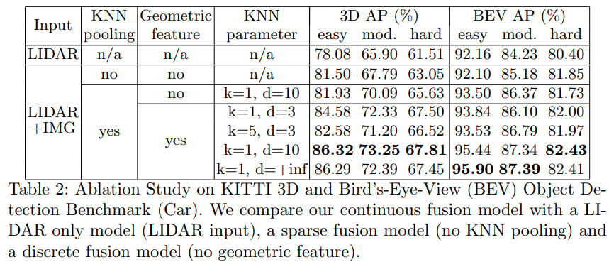
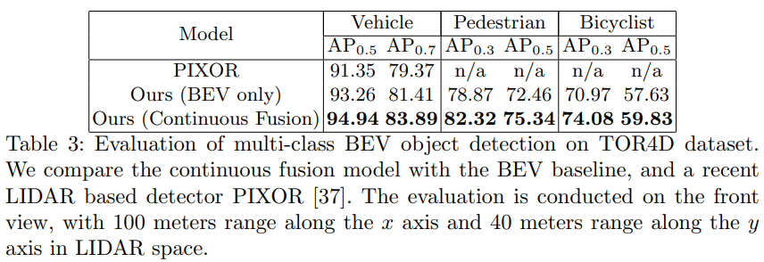

# ContFuse

ContFuse利用双流网络结构在多尺度、多传感器下对点云和图像进行深度连续融合，实现了高精度的三维空间物体检测定位

首先分别在图像流和点云流(BEV)使用ResNet18提取特征，然后将图像特征进行多尺度融合并利用pccn将其“投影”到BEV map上(类似于插值过程)，融合了图像特征以及空间位置信息，最后与点云流特征进一步融合并实现3D检测

PCCN与传统卷积(Grid Conv)不同的是，它主要是为非网格结构数据 如点云而设计，这与Graph CNN有一些相似。对比示意图如下，左边为传统卷积，右边为continuous conv, 可以看到continuous conv输入和输出维度可以不一样的。在ContFuse中，PCCN聚合了离散的image feature并形成新的BEV feature, 以构建dense BEV map.

ContFuse将image feature由前视图(FV)转换到俯视图(BEV), 然后再与点云数据对应的BEV feature进行continuous fusion, 这与之前大部分的融合方式是不同的。

FV到BEV的转换

根据FV特征计算BEV某一处的特征(图三左下中的浅蓝色方块)，首先根据K近邻在2D BEV平面中找到与之距离最近的k个点(图中五个彩色小圆圈)，然后反投影到3D空间内，再将这k个点投影到FV中，并找到每一个点所对应的image feature(图中与小圆圈颜色对应相同的方块)，最后将这些image feature和3D offset合并到一起feed到MLP，输出BEV中对应位置的目标特征。

点云BEV feature map中并不是所有的位置都有特征响应(比如图七中左下的BEV feature)，即存在一定的稀疏性，因此FV feature没有必要全部转换为稠密图层，可以根据BEV feature map的特征分布去“指导”FV中哪些位置的特征需要进行视角转换，以此提高系统的运行效率。并且，经过多层卷积后BEV feature map已经能够较好地表示物体特征，因此可以在这一步先提取proposal, 然后再在FV中这些proposal的对应区域进行视角转换与融合，这样能进一步提高检测的速度。

骨干网络采用轻量化的ResNet18，使用4个连续融合层将多尺度图像特征融合到BEV网络中。检测结果处每个锚点的输出包括每个像素类的置信度及其相关框的中心位置、大小和方向。基于结果图的非最大抑制（NMS）层用来生成最终目标框。

实验

> 更新: 2023-05-05 14:04:29  
> 原文: <https://3dcv.yuque.com/org-wiki-3dcv-mm1l0t/ysgfp9/hudgoq_zqxvgh>