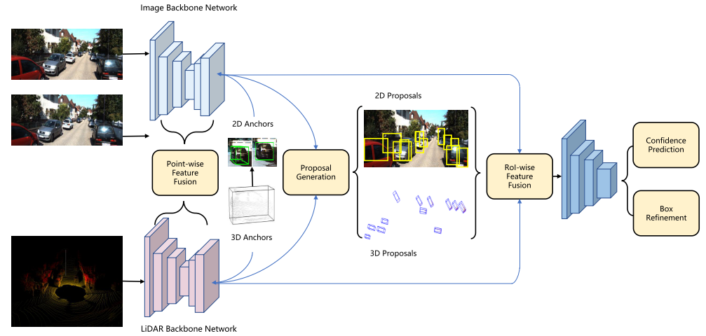
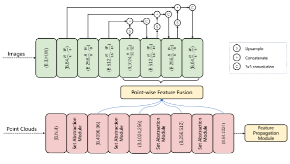
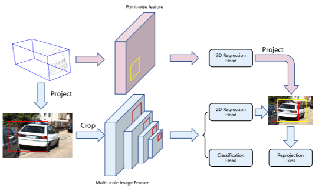
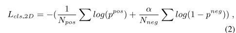
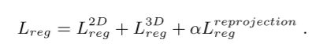
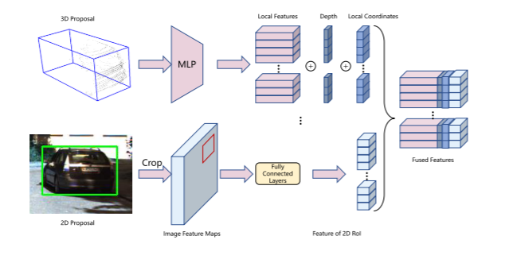
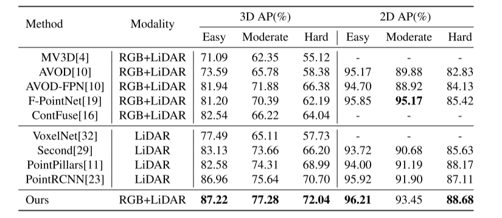

# Cross-modality

论文名称：Cross-Modality 3D Object Detection

论文下载：[https://arxiv.org/pdf/2008.10436.pdf](https://arxiv.org/pdf/2008.10436.pdf)

单位 | 上海交通大学；NEC Laboratories America   2021 WACV

探讨了图像和点云的融合在三维目标检测中的应用。

以双目图像和原始点云为输入，提出了一种新颖的两级多模态融合网络用于三维目标检测，整个网路结构便于两级融合。通过点特征融合，可以使双目图像中的每个点具有丰富的语义信息。通过ROI-wise的融合，使得产生的proposal更鲁棒。利用联合anchor机制，我们可以很好地约束3d bbox回归。此外，我们还提出使用伪激光雷达点云来增强GT点云的稀疏性，自适应地裁剪伪激光雷达点，并添加到GT点云中作为一种数据增强方法。

图片和点云的融合，认为两者模态可以很好的互补，图片有更多的语义信息，而点云专用于遥感。本文是个两阶段的多模态融合网络，使用了双目图像和原始点云作为输入

第一阶段主要目的是通过稀疏点云的特征融合产生3D候选框，第二阶段主要融合2D和3D候选框区域的密集特征，还提出了一种数据增强方法来增强点云密度，防止遥远的目标因过少的点而导致识别遗漏。数据集是KITTI。

网络框架

图 1. 我们提出的网络架构。 它由两个阶段组成：区域提议阶段和框细化阶段。 第一阶段旨在通过应用逐点特征融合和 2D-3D 耦合锚来生成准确的建议。 第二阶段进行 RoI-wise 特征融合以学习更稳健的表示并预测最终置信度和框细化。

阶段一： 对于image：利用modified ResNet-50 + FPN 提取双目images feature；对于点云：利用pointnet++提取点云特征，同时增加分类分支以预测每个点的置信度；将3D anchor 投影到2D平面，得到2D anchor，建立3D-2D anchor pairs，进行分类和回归计算。

point-to-pixel fusion模块的做法：

在不同level 特征图上进行fusion。即：将4个不同size group的点云XYZ坐标投影到对应尺寸image特征图。如：对于group size=1024的点云坐标，将其投影到image feature map size=（1024，H/32, w/32）；同理，group size=（4096,256,63）投影到（B，1024，H/32, w/32），（B，256，H/32, w/32），（B，64，H/32, w/32），以形成point-to-pixel fusion。

阶段二 ：对于2D和3D proposal进行RoI-wise fusion ，进行最终refine。

proposal模块重点在于建立3D-2D anchor pairs，进一步提出**reprojection loss**，从而对二者一起优化，如下图所示：

利用上述point-to-pixel fusion模块生成的特征，进行点云分割；再从前景点生成3D proposal。对于每个3D anchor（尺寸为：L=3.9,W=1.6,H=1.5），将其投影到2D image，以生成2D anchor，以建立2D-3D联系。

对于分类部分：强制2D-3D anchor pairs共享同一个置信度分数。利用上述生成的2D anchor，进行2D 分类预测。2D 分割损失为binary cross entropy loss，3D 分割损失为 focal loss：

对于回归部分：对于3D anchor，计算其中心偏移量、预定义尺寸偏移和角度；对于2D anchor，计算其中心偏移量和预定义尺寸偏移。对回归后3D anchor和2D anchor，将回归的3D anchor投影到2D image上生成新的2D anchor，reprojection loss即回归的2D anchor和新生成2D anchor间的损失，从而将2D/3D box紧密联系。最终的回归损失：

Refine

上述的fusion仅仅是point-to-pixel level fusion，这种fusion方式对于学习每个proposal的局部特征依然非常sparse。因此作者进一步提出RoI-wise feature fusion以学习密集特征表示，是region-to-region level，或者说决策级的fusion。

先将3D proposal的点云转换到标准坐标系，再通过几个MLP编码3D local point feature；

将每个点到传感器的距离作为损失的深度信息的补充；

对于2D proposal，直接从multi-scale feature的最后一层提取image feature，对再通过FC layer将其编码到与3D local point feature相同维度，作为2D region feature；

局部点云坐标。

最后将3D local point feature、局部点云坐标、深度信息和2D region feature 四个信息concatenate，形成Fused features。

对于上述fused feature和3D proposal，利用light-weight pointnet进行refine，生成最终检测结果。

Pseudo-LiDAR fusion

对于双目图像，可以通过立体匹配来预测像素视差，再通过逆投影得到每个像素对应的pseudo lidar point。

举个例子：对于高度遮挡或者远距离的3D物体，其像素大小为10*10，但仅有10个点云，我们可以通过预测pixel-wise的深度来产生100个pseudo lidar point进行补充。

训练阶段，仅fuse 2D GT box内的pseudo point；inference阶段，fuse 2D 预测box内的pseudo point。

但是，由于深度估计的误差，生成的pseudo point通常不准确，包括 long tails 和 local misalignment问题：

针对 long tails问题，通过设计点云统计滤波器去除异常点；

针对local misalignment问题，利用GT 点云纠正pseudo 点云，即：对于每个预测2D Bbox，提取对应的GT点云和pseudo点云，然后计算每个pseudo点云到最近K个 GT点云的平均距离D，再将整体点云作为一个整体移动一定距离使得所有平均距离D的和最小，以实现深度矫正。

实验

> 更新: 2023-05-05 14:04:52  
> 原文: <https://3dcv.yuque.com/org-wiki-3dcv-mm1l0t/ysgfp9/tprsgf_lxd1q9>