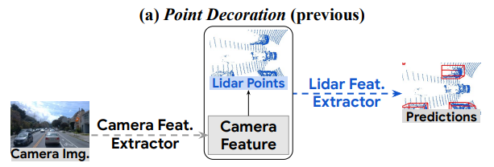
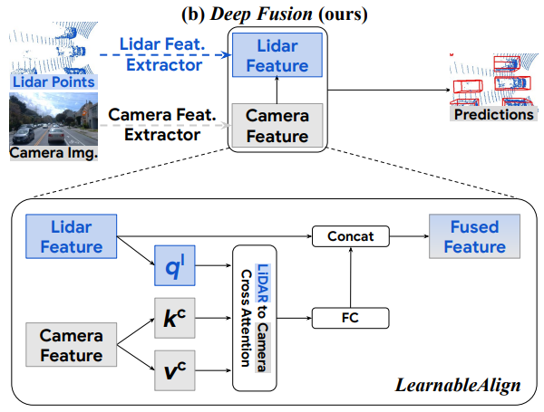
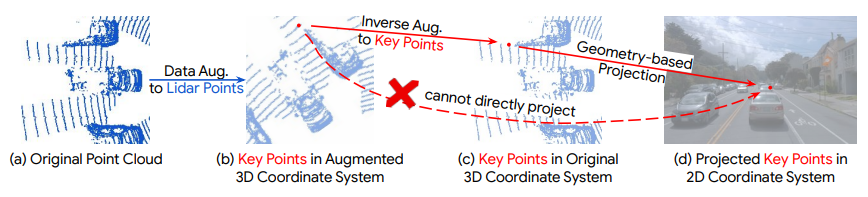
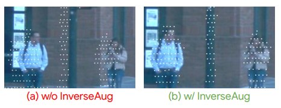
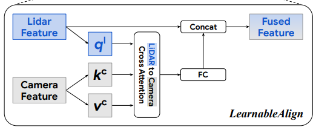
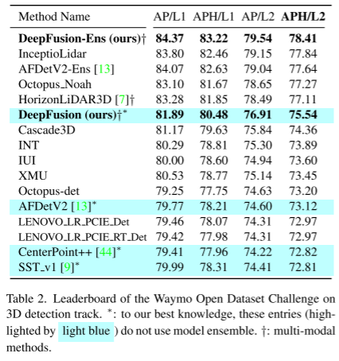
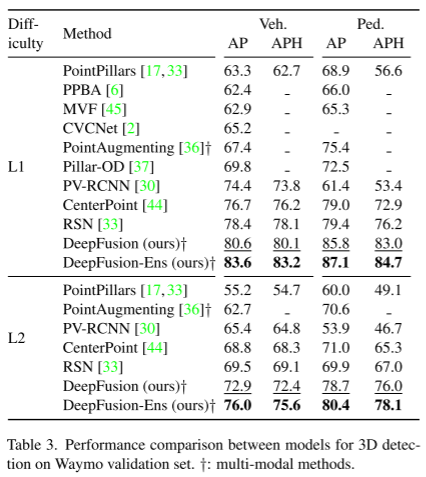
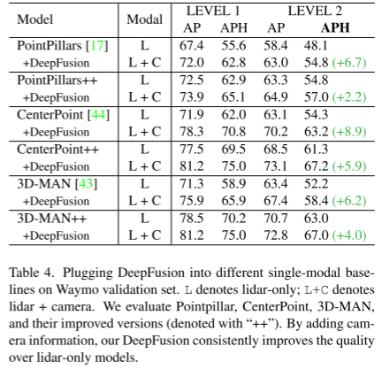
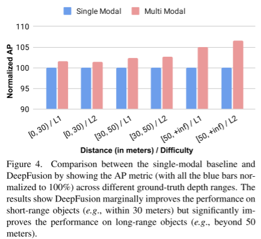

# Deepfusion

论文名称  DeepFusion: Lidar-Camera Deep Fusion for Multi-Modal 3D Object Detection    2022 CVPR  

作者单位：约翰霍普金斯大学，谷歌

论文：[https://arxiv.org/abs/2203.08195v1](https://arxiv.org/abs/2203.08195v1)

代码：[https://github.com/tensorflow/lingvo/tree/master/lingvo](https://github.com/tensorflow/lingvo/tree/master/lingvo)

动机：目前多模态方法只是简单地用相机特征装饰原始激光雷达点云（图像特征提取后拼到对应的原始点云上），并将它们直接输入现有的3D检测模型，但我们的研究表明，融合相机特征与深激光雷达特征，而不是原始点，可以获得更好的性能。融合特征的话就要考虑到特征对齐的问题，还有多模态中普遍存在的数据增广问题。分别提出了LearnableAlign和InverseAug解决特征融合时候对齐（权重）和数据增广后的物理对齐。

PointPainting等工作使用一个训练好的检测器或者分割模型作为Img的特征提取器。比如PointPainting采用的Deeplabv3+，生成逐像素分割标签作为相机特征。然后，利用提取的相机特征装饰原始激光雷达点。最后，将相机特征装饰的激光雷达点输入到三维点云目标检测框架中。

改进的。首先，相机的特征被输入到几个专门设计用于处理点云数据的模块中。例如，如果采用PointPillars作为3D检测框架，则需要将相机特征与原始点云一起进行体素化，构建鸟瞰图伪图像。然而，体素化模块并不是为处理相机信息而设计的。其次，相机特征提取器是从其他独立任务(如二维检测或分割)中学习来的，这可能会导致(1)域间隙，(2)标注工作，(3)额外的计算成本，更重要的是，(4)次优特征提取，因为特征是启发式选择的，而不是端到端学习的方式。

为了解决上述两个问题，提出了一个深度特征融合管道。第一个问题，我们融合了相机和激光雷达更深维度特征，而不是在输入级装饰原始激光雷达点，这样相机信号就不会经过为点云设计的模块。第二个问题，我们使用卷积层提取相机特征，并将这些卷积层与网络的其他组件端到端进行训练。综上所述，我们提出的深度特征融合管道如下图所示。

激光雷达点云被输入现有的激光雷达特征提取器(例如，Pillar Feature Net from PointPillars)获取激光雷达特征(例如，来自PointPillars[16]的pseudo image);将摄像机图像送入2D图像特征提取器(如ResNet)获取摄像机特征;然后，将摄像机特征与激光雷达特征融合;最后，将所选激光雷达检测框架的剩余分量(如Pointpillars中的Backbone和detection Head)进行融合特征处理，得到检测结果。

方法有两个优点:(1)高分辨率的相机功能，具有丰富的上下文信息，不需要错误的体素化，然后从透视视图转换为鸟瞰视图。(2)通过端到端训练，减轻了域差距和标注问题，可以获得更好的相机特征。然而，其缺点也很明显:与输入级装饰相比，将相机功能与激光雷达信号对齐在深层次特征层面上变得不那么直接。

InverseAug （针对数据增广）解决几何相关数据增加引起的对齐问题

InverseAug 的管道。 提出的 InverseAug 的目标是将数据增强阶段之后获得的关键点，即 (a) → (b) 投影到 2D 相机坐标系。 关键点是一个通用概念，可以是任何 3D 坐标，例如激光雷达点或体素中心。 为简单起见，我们在这里使用激光雷达点来说明这个想法。 通过使用相机和激光雷达参数直接将关键点从增强的 3D 坐标系投影到 2D 相机坐标系，即直接从 (b) 到 (d)，精度较低。 在这里，我们建议首先通过将所有数据增强反向应用到 3D 关键点来找到原始坐标中的所有关键点，即 (b) → (c)。 然后，可以使用激光雷达和相机参数将 3D 关键点投影到相机特征，即 (c) → (d)。  InverseAug 显着提高了对齐质量，如图 所示。

LearnableAlign 比如使用体素方法，特征对齐融合的时候，一个体素对应的是一个像素块，这个时候如何进行对齐。一个简单的方法是平均所有像素对应于给定的体素。然而，从直观上看，并由我们的可视化结果支持，这些像素并不同等重要，因为来自激光雷达深度特征的信息不平等地对准每个相机像素。例如，一些像素可能包含检测的关键信息，如要检测的目标对象，而另一些可能信息较少，包括背景，如道路、植物、遮挡器等

LearnableAlign

输入包含一个体素，以及它所对应的N个像素特征。LearnableAlign使用三个全连接层分别将体素转换为查询ql，将相机功能转换为键kc和值vc。然后就是注意力机制，通过softmax算子归一化，将注意力矩阵用于对包含摄像机信息的值vc进行加权和聚合。聚合后的相机信息被一个全连接层处理，最后与原始的激光雷达特征连接。输出最终被输入任何标准的3D检测框架。

实验

表 2. Waymo 开放数据集挑战赛在 3D 检测轨道上的排行榜。  *：据我们所知，这些条目（以浅蓝色突出显示）不使用模型集成。  †：多模式方法。

表 3. Waymo 验证集上 3D 检测模型之间的性能比较。  †：多模式方法。

表 4. 在 Waymo 验证集上将 DeepFusion 插入不同的单模态基线。  L 表示仅激光雷达；  L+C 表示激光雷达+相机。 我们评估 Pointpillar、CenterPoint、3D-MAN 及其改进版本（用“++”表示）。 通过添加摄像头信息，我们的 DeepFusion 不断提高仅激光雷达模型的质量。

图 4. 通过显示不同真实深度范围内的 AP 指标（所有蓝色条均归一化为 100%），比较单模态基线和 DeepFusion。 结果表明，DeepFusion 略微提高了短距离物体（例如，30 米内）的性能，但显着提高了远距离物体（例如，超过 50 米）的性能。

> 更新: 2023-05-05 14:04:37  
> 原文: <https://3dcv.yuque.com/org-wiki-3dcv-mm1l0t/ysgfp9/aohigv_msmsid>