# EPNet

论文名称：EPNet: Enhancing Point Features with Image Semantics for 3D Object Detection

论文下载：[https://arxiv.org/pdf/2007.08856.pdf](https://arxiv.org/pdf/2007.08856.pdf)

代码：[https://github.com/happinesslz/EPNet](https://github.com/happinesslz/EPNet)

单位：华中科技大学    2020 ECCV

主要解决3D目标检测中的两个重要问题，包括多传感器融合的使用和定位和分类的置信度的不一致问题。所以我们提出了一个新的融合单元，用逐点的方式使用语义图像特征来提高点的特征，并且不需要任何图像标注（也就是2D检测框）。另外，一个一致性强制损失被用来更好的促进定位和分类置信度的一致性。

图像信息经常包含大量的语义信息（颜色，纹理），但缺失深度信息。

激光雷达的点云可以提供深度和几何信息，但是激光雷达的点云经常比较稀疏，无序，分布不均匀。

下图展示了图像的语义信息的重要性，图中的白色和黄色椅子因为几何信息很像，所以光通过lidar很难辨别，表现出来就是检测框的检测结果不准确。在这种情况下，使用颜色信息去定位就很关键，所以需要高效的融合单元。

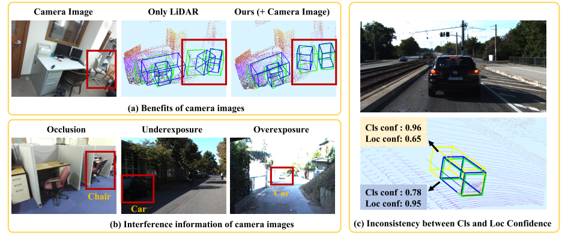

图 1. 相机图像的 (a) 收益和 (b) 潜在干扰信息示意图。  (c) 展示了分类置信度和定位置信度的不一致。 绿色框表示基本事实。 蓝色和黄色框是预测的边界框。

融合并不是一个简单的问题，作者给出以下两点原因：

1.他们拥有很不同的数据特征。

2.相机照片对光照和遮挡很敏感，从而可能引入对3D对象检测任务有害的干扰信息。

之前的工作在融合时需要图像标注（也就是2D检测框）的帮助。之前的融合的工作大致可以分为两类：

1.级联的方法，在不同的步中使用不同的传感器。

2.对多传感器输入进行联合推理的融合方法

这些方法虽然高效，但都有所限制，级联的方法不能利用不同传感器之间的互补性，他们的表现在每一步中仍被限制。第二种方法需要视角投影去产生BEV数据，或者需要体素化，这些都导致信息的损失。此外，它们只能近似地在体素特征和语义图像特征之间建立相对粗略的对应关系。我们提出了LiDAR-guided Im- age Fusion (LI-Fusion) module去解决上面两个问题，这个单元用逐点的方式建立了点云原始图像和相机照片之间的联系，并且自适应地估计图像语义特征的重要性。这样做，可以使得有用的图像特征被用来增强点的特征，同时抑制干扰图像的特征，我们的解决方案有四个主要优点：

1.通过更简单的网络实现激光雷达和相机图像数据之间的细粒度的逐点对应，而无需复杂的BEV数据生成的过程。

2.可以保持原始的几何信息而不需要信息损失。

3.解决摄像机图像可能带来的干扰信息的问题。

4.不再需要图像标注，即2D检测框。

除此之外要解决的是定位和分类的置信度的不一致问题，也就是一个物体是否存在于检测框中，以及它与真实框有多少重叠。下图中，有很高分类置信度的检测框，其定位置信度很低。

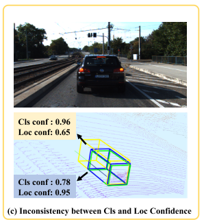

EPNet由一个用来产生建议双流RPN（two- stream RPN）和一个用来细化检测框的细化网络（refinement network）组成，并且可以端到端训练。网络结构

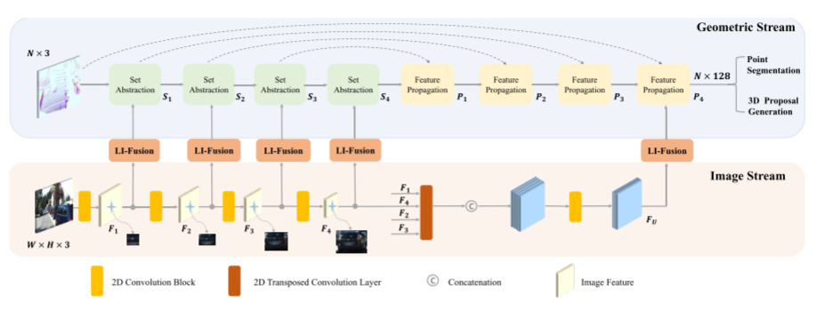

双流RPN由几何流和图像流组成，它们分别产生点特征和语义图像特征。我们使用了多个LI-Fusion模块，在不同的比例上用语义图像特征来提高对应的点特征，从而得到了更多的可辩别特征的表示。

Image Stream

用相机图像作为输入，用了一系列卷积操作提取语义图像信息。采用了简单的网络结构，由四个轻量级的

卷积快组成，每个卷积块由：两个3×3卷积层+一个批量标准化层+ReLU激活函数。其中的第二个卷积层

使用步幅为2来扩大感受野并节约GPU内存。用Fi (i=1,2,3,4)表示每个卷积块的输出，如图中所示，Fi在不同的比例上提供了充足的图像语义信息来丰富激光雷达的点的信息。之后又采用了四个不同步长的平行的反卷积层来恢复图像的分辨率，从而得到与原始图像一样大的特征图。之后将这四张拼接起来得到FU，之后也要用FU提高激光雷达点的特征。

Geometric Stream

用激光雷达点云作为输入，产生3D建议。包含了4个成对的Set Abstraction (SA) （来自 Pointnet++）和Feature Propogation (FP)（来自 Pointnet++）层来提取特征。将它们分别表示为Si 和 Pi (i=1,2,3,4)。如图中所示，我们使用LI-Fusion模块来结合点的特征Si和语义图像特征Fi。除此之外，FU也加到P4上，之后用其做前景点的分割和3D建议的产生。

LI-Fusion Module

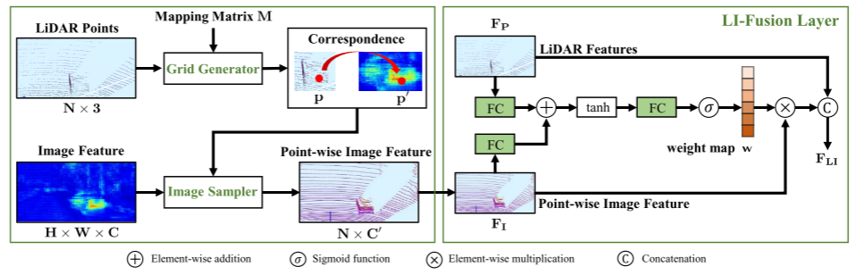

包括一个网格生成器（grid generator），一个图像采样器（image sampler），一个LI-Fusion layer层。如图中所示，LI-Fusion module可以分为两个部分，逐点对应生成器和激光雷达引导的融合。具体地说，我们把激光雷达的点投影到相机图片上，将映射矩阵表示为M。网格生成器将激光雷达点云和映射矩阵M作为输入，输出在不同分辨率下激光雷达点和相机图片的对应关系。更具体地说，对于点云中的某一个点p(x, y, z) ，我们可以得到它在相机图片中对应的位置p'(x’, y') ，公式可以写成  p' = M X p'

在建立了对应关系以后，我们使用图像采样器得到每个点对应的语义特征表示。具体地讲，我们的图像采样器使用取样位置p’和图像特征图F作为输入，对每一个采样位置产生一个逐点的图像特征表示V。考虑到采样位置可能落在相邻像素之间，我们使用双线性插值来获得连续坐标下的图像特征，其公式如下

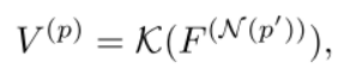其中V(p)是点p对应的图像特征，K表示双线性插值函数，F(N(p))表示采样位置p的相邻像素的图像特征。

融合激光雷达特征和逐点图像特征并不容易，因为相机图像回受到很多因素的挑战，包括光照等影响。在这些情况下，逐点图像特征将引入干涉信息。为了解决这个问题，我们引入了LiDAR-guided fusion层，它使用逐点的方式去使用激光雷达特征去自适应地评估图像特征的重要性。如图中所示，FP和FI先经过全连接层并且映射它们到相同的通道。然后将它们相加来形成一个更紧密的特征表示，然后将他们以一个通道通过另一个全连接层从而被压缩成一个权重图w。我们又使用了sigmoid激活函数将权重图w正则化到【0，1】之间。公式如下

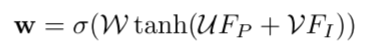其中 W、U、V 表示我们的 LI-Fusion 层中的可学习权重矩阵。  σ 表示 sigmoid 激活函数。在得到权重图w后，我们将激光雷达特征FP与语义图像特征FI拼接在一起，可表示为

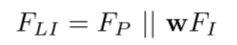

使用NMS来保留高质量的建议框，并将它们送入细化网络。对于每个输入建议，我们通过在我们的双流RPN的最后一个SA层顶部的检测框中随机选择512个点来生成其特征描述符。对于小于512点的建议框，我们只需用0填充描述符。细化网络由三个SA层组成，用来提取紧凑的全局描述，两个级联的子网络1×1卷积层分别进行分类和回归。

实验

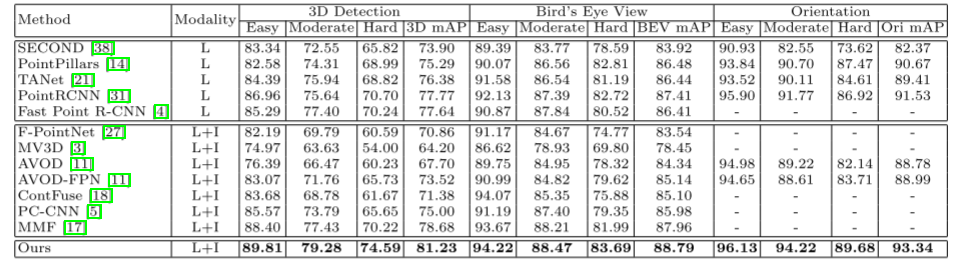

表 5. 在 KITTI 数据集（汽车）的测试集上与最先进方法的比较。  L 和 I 代表 LiDAR 点云和相机图像。

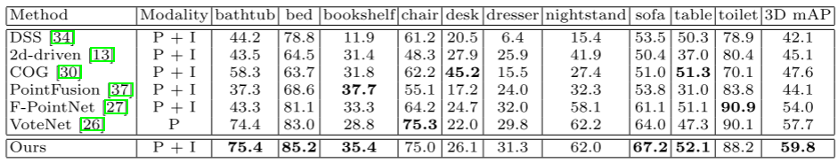

表 6. 与 SUNRGBD 测试集上最先进方法的定量比较。  P 和 I 代表点云和相机图像。

EPNet++

论文标题：EPNet++: Cascade Bi-directional Fusion for Multi-Modal 3D Object Detection

论文下载：[https://arxiv.org/pdf/2112.11088.pdf](https://arxiv.org/pdf/2112.11088.pdf)

作者单位：Huazhong University of Science and Technology

2021  

当前基于多传感信息融合的框架主要存在两点问题：

基于级联（Cascade）思路的多传感器特征融合不能充分利用不同模态数据的互补信息，因为这些框架往往只是在单一层级上使用单一模态数据

基于融合（Fusion）思路的框架往往会将特征映射到俯视图上，因此不可避免地存在特征映射误差的问题，并且难以保证不同模态信息间的一致性

EPNet++）LiDAR-based method主要存在两点问题：

容易存在误检结果，尤其是形似目标的背景物体；

容易漏检远距离或者小目标物体，主要原因是这些物体包含的点云数量太有限，不足以支撑准确的检测结果；

与EPNet相比，EPNet++主要增加的点在于：

作者认为原本的FI-Fusion模块太过于直接，不利于有效提取多模态的互补特征，因此提出了CB-Fusion模块。

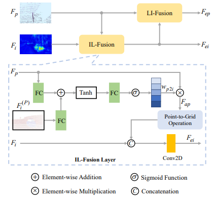如上图所示，其实相比于LI-Fusion，CB-Fusion增加了一个逆向模块，也就是IL-Fusion。作者认为原始点云由于环境干扰往往也不是完全真实可靠的，因此先通过camera image对原始点云进行筛选，再用筛选后的点云提取更精准的图像特征。

作者引入了Modal Consistency loss （MS Loss）用于保证多模态信息的一致性。作者认为对于同一个物体而言，其映射到图像上的点和原始点云上的点应该具有一致性；

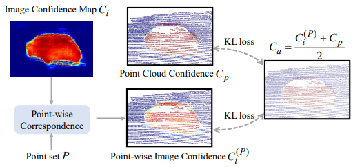

如上图所示，作者求取了两种模态置信度分别为point confidence（ 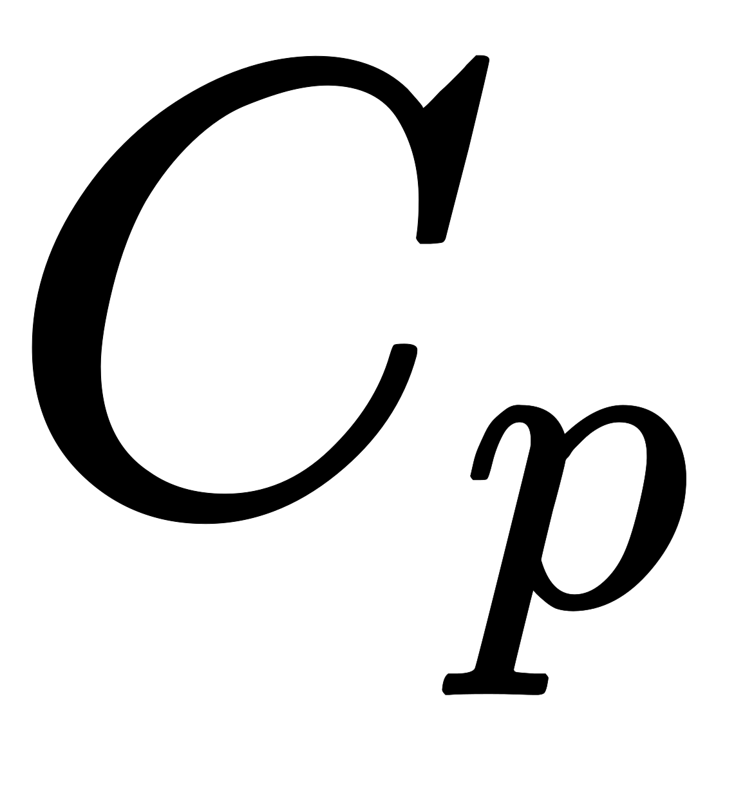 ）和image confidence（ 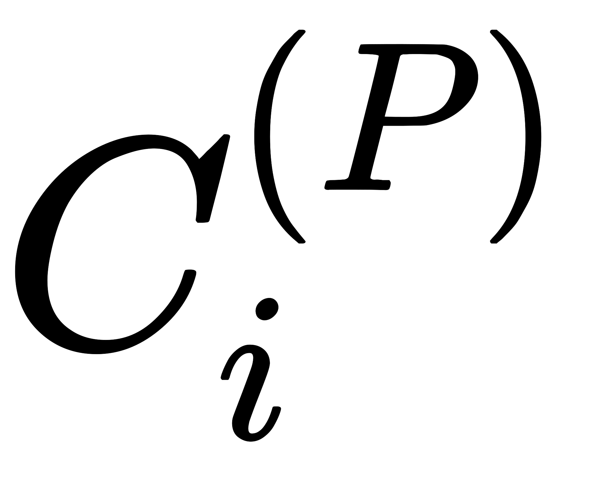 ），并计算其平均置信度 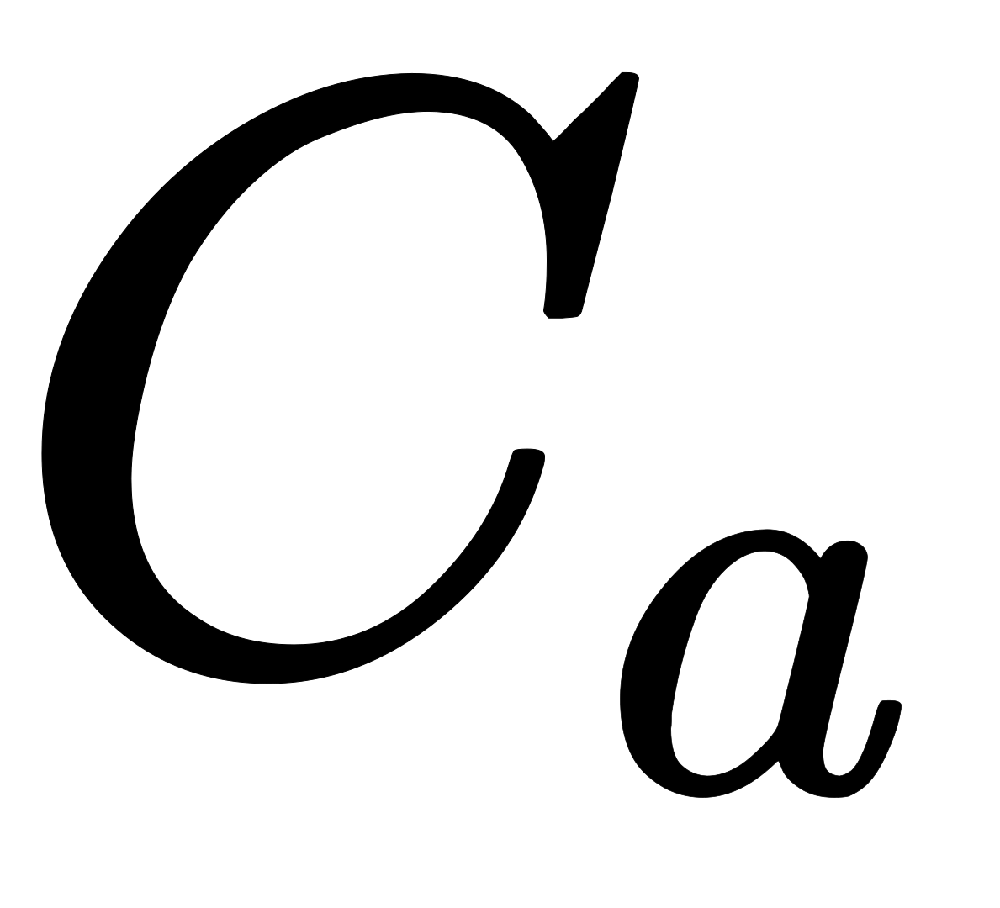 。分别计算两种模态与平均置信度之间的KL Loss。

实验

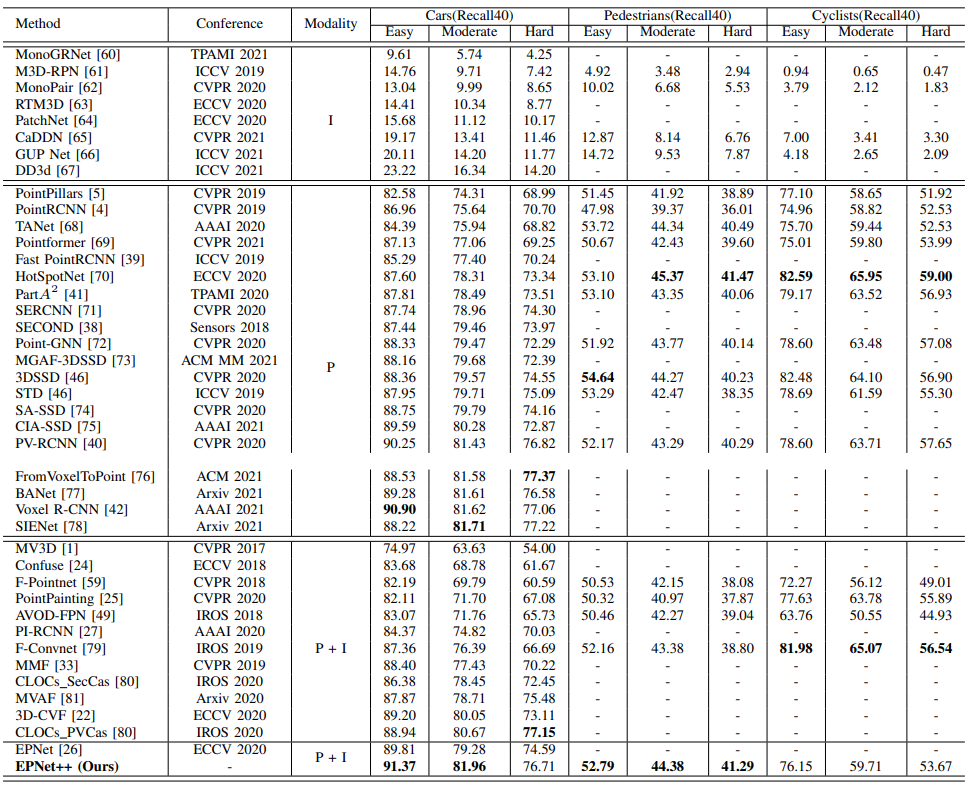

  
 

> 更新: 2023-05-05 14:04:51  
> 原文: <https://3dcv.yuque.com/org-wiki-3dcv-mm1l0t/ysgfp9/fzvgz1_pimxba>