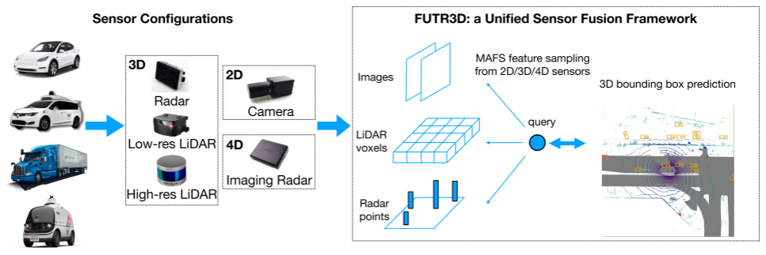
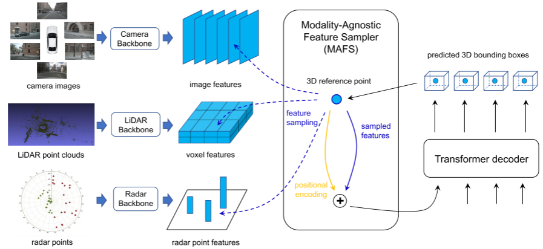
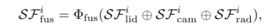
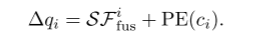
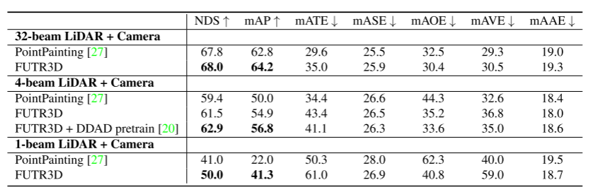

# FUTR3D

论文名称：FUTR3D: A Unified Sensor Fusion Framework for 3D Detection

论文下载：[https://arxiv.org/abs/2203.10642](https://arxiv.org/abs/2203.10642)

单位：复旦、CMU、MIT、Stanford（李想汽车工作）和清华  

arXiv论文

3D检测、端到端传感器融合框架FUTR3D，它可以用于（几乎）任何传感器配置。FUTR3D采用了一个基于查询的不可知模态特征采样器（Modality-Agnostic Feature Sampler，MAFS），以及一个具有用于3D检测的集合-集合损失函数的transformer解码器，从而避免后融合的启发式方法和后处理等。在摄像机、低分辨率激光雷达、高分辨率激光雷达和雷达的各种组合上验证了该框架的有效性。FUTR3D通过不同的传感器配置实现了极大的灵活性，并实现了低成本的自动驾驶

FUTR3D的主要贡献如下：

通用框架。FUTR3D是第一个通用的可适应各种不同传感器的端到端的三维目标检测框架。

有效性。它在Camera, LiDAR, Camera+LiDAR , Camera+Radar等不同的传感器组合情况下都能实现领先效果。

低成本。FUTR3D在Camera+4线LiDAR的情况下能够超过32线LiDAR的结果，因此能够促进低成本的自动驾驶系统。

如图所示：FUTR3D可用于任何传感器配置，包括2D摄像机、3D激光雷达、3D雷达和4D成像雷达。

如图是FUTR3D的概述：每个传感器模态使用模态特定的特征编码器在其自身坐标中单独编码。然后，基于查询的MAFS根据每个查询的3D参考点从所有可用模态中提取特征。最后，transformer解码器根据查询预测3D边框。预测框可以迭代地反馈到MAFS和transformer解码器中，以优化预测。

FUTR3D主要包括Modality-Specific Feature Extractor, Modality-Agnostic Feature Sampler和Loss。

Modality-Specific Feature Extractor(模态特定特征提取器)

对于不同的传感器输入数据，我们根据它们各自的模态形式分别用不同的backbone去提取它们的特征。

对于camera images，采用ResNet50/101和FPN来对每张图片提取多尺度的特征图。

对于LiDAR point clouds，用PointPillar或者VoxelNet来提取点云的特征。

对于Radar point clouds，用3层MLP来提取每个Radar point的特征。

Modality-Agnostic Feature Sampler(模态无关的特征采样器)

模态无关的特征采样器，下面简称MAFS，是FUTR3D的detection head与各个模态的特征进行交互的部分。

类似于DETR3D，MAFS含有600个object query，每个query会经过一个全连接网络预测出在BEV下的3D reference points。

对于camera部分，我们依照DETR3D的做法，利用相机的内外参数将reference points投影到image上采集feature，得到  。具体做法可以参看上篇文章，这里就不详细展开。

对于LiDAR部分，我们按照reference points在3D空间中的坐标，投影到LiDAR BEV特征上去采集它在LiDAR feature map上对应位置的feature，得到  。

对于Radar部分，根据每个reference points的位置，选取离它最近的10个Radar points的特征，并聚合在一起得到  。

采集得到各个模态的对应特征之后，将它们concatenate到一起，并经过一个MLP网络投射到一个共同的特征空间中。

之后再利用  以及reference points的位置编码去更新object query的信息。

在FUTR3D中，我们同样有6层decoder layer，在每层decoder layer中，用object query之间的self attention和MAFS去更新object query的信息，并且每个query会去通过MLP网络去预测得到bounding box的参数和reference points的offsets去迭代更新每一层的预测结果。

Loss

在loss部分，我们先利用Hungarian算法来将每个object query预测得到的bbox去和ground-truth box进行二分图匹配，得到最优的matching方案，然后对匹配成功的box计算regression L1 loss和classification focal loss，没有匹配到gt box的predicted box就只计算classification loss。

实验

表 1. Camera-LiDAR 融合结果。 在 nuScenes 验证集上，FUTR3D 在 LiDAR 和相机的所有不同配置下都优于最先进的模型 PointPainting。 在相机 + 4-beam LiDAR 设置和预训练下，FUTR3D 达到 56.8 mAP，与最先进的 LiDAR 探测器 CenterPoint-Voxel 和 32-beam LiDAR (56.6 mAP) 相当。 我们使用 0.1 米体素大小的 VoxelNet 作为所有方法的点云主干。

> 更新: 2023-05-05 14:04:53  
> 原文: <https://3dcv.yuque.com/org-wiki-3dcv-mm1l0t/ysgfp9/tq5398_kabtdq>