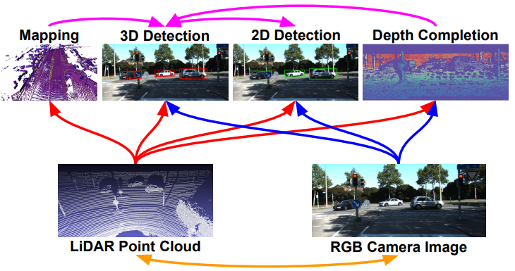
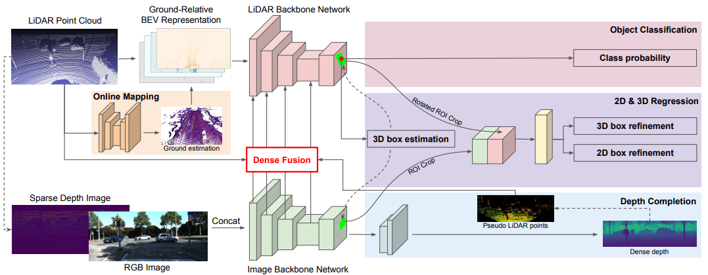
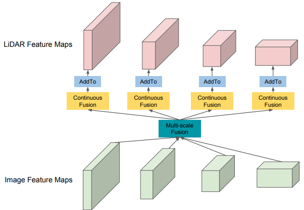
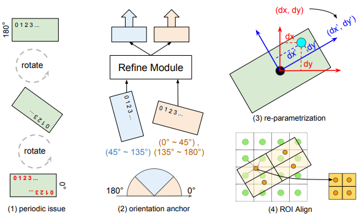
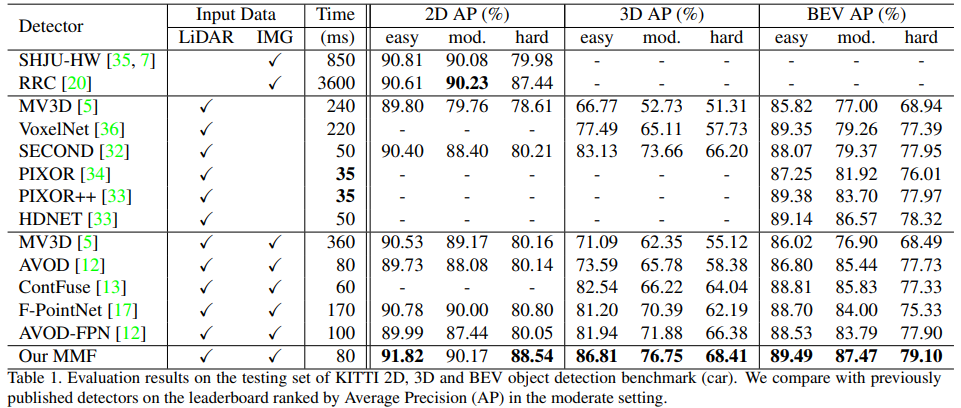
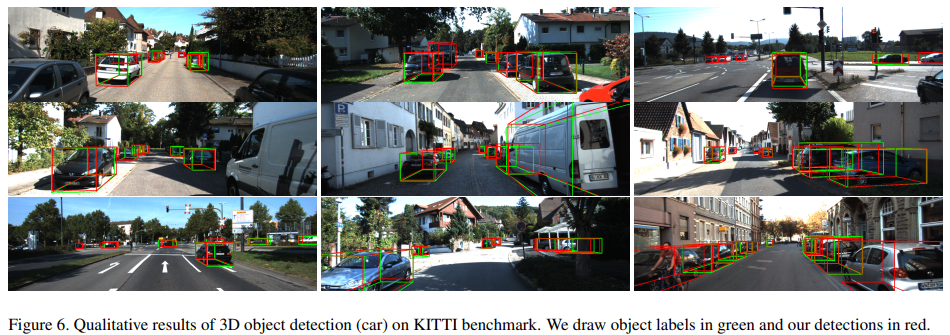

# MMF

单一的传感器成像各自有各自的优缺点，如何合理的融合各个传感器的优点，达到相辅相成的效果，一直是一个challenge。比如，相机难以捕捉到精细的3D信息（depth），而LiDAR在长远距离上只提供了一个十分稀疏的数据（LiDAR points become extremely spares at long range）。有的方法将LiDAR数据看成一个feature map，与图像数据中的pixel对应，但是LiDAR数据的稀疏性，使得不得不使用最邻近插值来米芾那些由于稀疏性而无法找到对应点的pixels。也有的方法在ROI（Region of Interest）阶段进行融合，但是这样的方法就会继承ROI算法的一个固有的缺点：时间消耗大并且不精确。

MMF同时利用了2个传感器(LiDAR+Camera)，同时进行4个任务（2D detection, Ground estimation, Depth Completion, 3D detection）最终得到3D物体检测结果。

不同的传感器的信息互补，LiDAR数据中的包含depth信息可以用来给RGB图像构成伪RGB-D（pseudo RGB-D）图像，来完成Image上的3D检测；采用pixel-wise 和ROI-wise 融合又可以提高2D 检测的accuracy。为了弥补因为Point Cloud 数据的稀疏性导致的point misalignment

网络结构图

有一个single-shot detector能够提供少量的高质量的3D检测结果；

利用ROI-wise的特征融合得到更精细的2D跟3D box regression；

另外，还有两个辅助任务能够进一步提供一些额外有用的信息：

Ground estimation：能够拟合道路的几何结构信息，为点云提供一些先验(地面高度)；

Depth completion：能够学到更好的多传感器特征并且实现dense point-wise的特征融合；

雷达和图像融合

有两个backbone的分支，分别提取image跟LiDAR BEV的feature maps；

将不同scale下的image feature跟LiDAR BEV feature分别进行Point-wise的特征层融合；

融合后的BEV feature map通过2d conv能够对每个BEV voxel预测很多3D检测结果；

经过NMS跟分值过滤之后，能够得到少量(KITTI测试集上少于20个)的高质量的3D检测框以及相应的2D检测框；

再利用ROI-wise fusion，将image ROIs跟BEV oriented ROIs进行特征融合，得到更精确的2D跟3D检测框；

点云：将点云转换成BEV来处理。由于点云的稀疏性，转换的时候需要将点云进行插值体素化(voxelization)

图像： 直接利用RGB image作为输入进行特征提取；另外，由于后面还增加了一个Depth completion的任务，所以这边还需要增加一个Sparse depth image 作为输入，就是把LiDAR投影到图像坐标系下。

Point-wise feature fusion

将不同scale下的image feature跟LiDAR BEV feature分别进行Point-wise的特征层融合。需要LiDAR BEV跟Image之间pixel-wise的相关关系：

对于BEV feature map上的每一个pixel，找到跟它最近的LiDAR point；将这个LiDAR point投影到图像坐标系下，得到相应的image feature；计算BEV pixel 跟LiDAR point的距离，作为geometric feature；将image feature+geometric feature输入到MLP中，得到output；将output与BEV feature map进行element-wise的相加；

ROI-wise feature fusion

ROI-wise fusion 的目的就是要进一步优化box的regression，得到高质量的2d跟3d的detection通过将3D detection分别投影到image跟BEV feature maps上，我们能够得到axis-aligned image ROI以及oriented BEV ROI。image ROI特征提取通过ROIAlign来得到相应的image feature    BEV ROI特征提取时在边界容易导致ROI特征出现180度反转的问题。解决的方法就是给oriented ROI分配一个orientation anchor (0或者90度)，每一种anchor都会有固定的特征提取顺序；    当ROI是有角度的时候，它的中心点其实也会有offset。解决的方法就是得到旋转之后的ROI，并且将它分成n*n的grid，grid中的每个点都采用双线性插值得到特征；

实验

> 更新: 2023-05-05 14:04:31  
> 原文: <https://3dcv.yuque.com/org-wiki-3dcv-mm1l0t/ysgfp9/cflpyu_cuxoy2>