# MV3D

[论文下载](https://arxiv.org/abs/1611.07759)

MV3D将点云数据和图片数据映射到三个不同的维度进行特征融合，然后进行物体的定位和识别。

这三个维度分别为：点云的俯视图、点云的前视图以及图片。融合了点云数据和图片数据，是一个多模态融合的问题。

MV3D的点云处理

MV3D将点云和图片数据映射到三个维度进行融合，从而获得更准确的定位和检测的结果。这三个维度分别为点云的俯视图、点云的前视图以及图片**，**如下图所示。

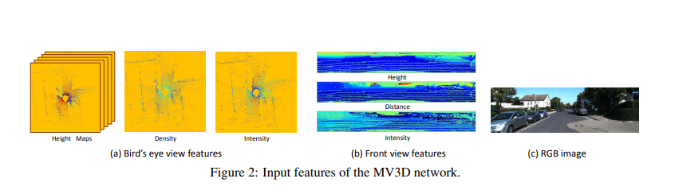

点云俯视图

点云俯视图由高度、强度、密度组成。

高度图的获取方式为：作者将点云数据投影到分辨率为0.1的二维网格中，将每个网格中所有点高度的最大值记做高度特征。为了编码更多的高度特征，将点云被分为M块，每一个块都计算相应的高度图，从而获得了M个高度图。

强度图的获取方式为：仍然是分辨率为0.1的二维网格中，找到每个网络中具有最大高度的点云的反射强度，构成1个强度图。

密度图的获取方式为：统计每个单元中点云的个数，并且按照公式

$ 

 $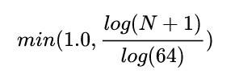

进行标准化，其中N为单元中的点云个数，构成1个密度图。

那么点云俯视图的维度为 （M+2, W, H）

注：在BEV视图提取主要特征， 并生成候选框, 因为这个视图方向的特征保存的最完整划分BEV视图时, 将三维的点转换为二维, 每个点带有M+2个通道的特征, M代表的是将高度划分为M份, M个通道装有不同高度下的点的信息, 从一个截面来看就是一张张高度信息图, 2代表的是密度和强度, 都是取每个点高度方向上最高的点的密度和强度特征

点云前视图

前视图表示。 前视图表示为鸟瞰图表示提供了补充信息。 由于激光雷达点云非常稀疏，将其投影到图像平面会产生稀疏的 2D 点图。 相反，我们将其投影到圆柱平面以生成密集的前视图，给定一个 3D 点 p = (x, y, z)，它在前视图地图中的坐标 pfv = (r, c) 

如果直接将点云的前视图映射到图像平面，会非常稀疏。因此作者将三维点 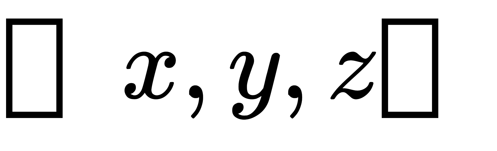 映射到一个柱平面 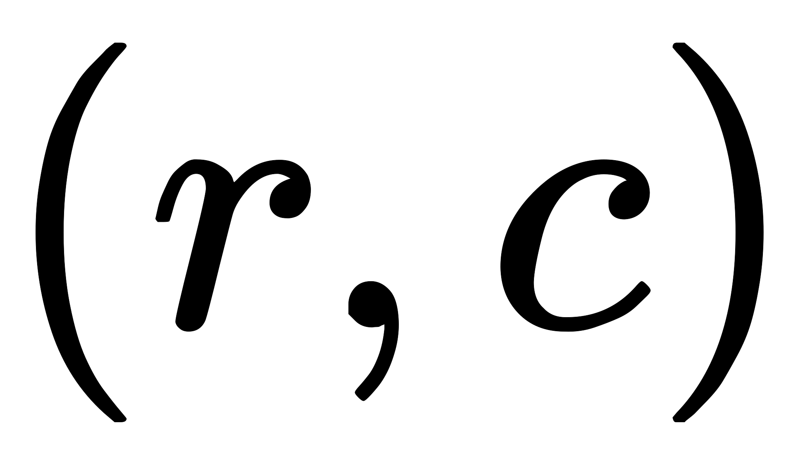 上。计算公式如下：

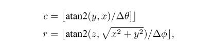

其中 Δθ 和 Δφ 分别是激光束的水平和垂直分辨率。 我们用三通道特征对前视图图进行编码，这些特征是高度、距离和强度。

计算原始点云到front view的投影坐标, 其实就是将原始点云投影到一个圆柱面上, 包含高度, 距离, 强度信息

提取RGB视图的特征使用VGG16网络

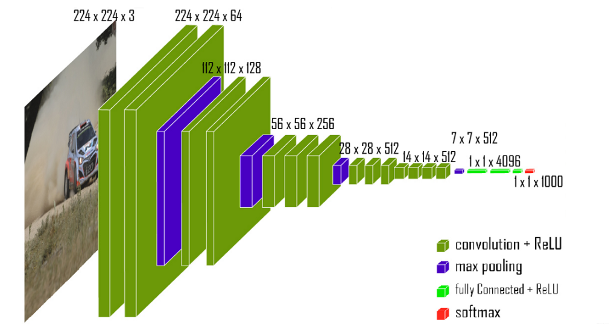

网络结构图

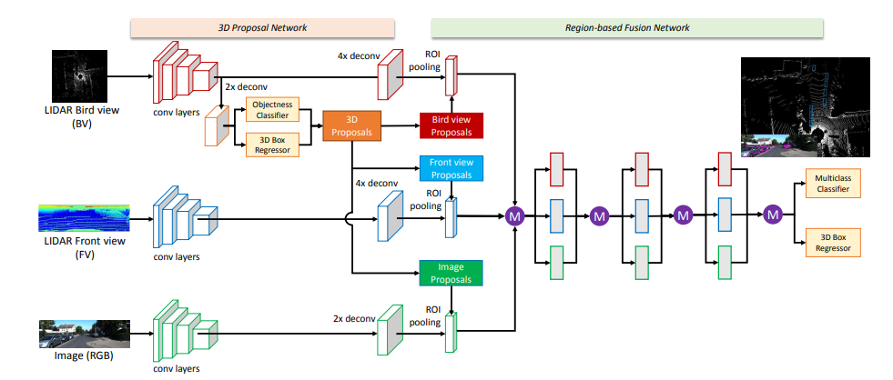

网络有三个输入分支，分别以上面提到的点云的俯视图、点云的前视图以及图片为输入，通过VGG网络获得三个特征图  
与另外两个分支不同的是，作者从以俯视图为输入的特征图中获取了3D proposal。从俯视图为输入获得的特征图中进行3D proposal有三点原因。简单来说，就是 1，保持了物理形状  2，不会发生遮挡和重叠   3，获得的3D检测框更准。

BEV视角只能获取二维的检测框**，**也就是三维检测框的高度其实就根据物体高度（二维检测框内最高点云对应的高度）与相机高度求解获得，实际上应该是两者相加即可。

接下来的3D proposal过程和FasterRCNN中的RPN类似，从2D proposal升级到了3D proposal，主要分为物体分类（应该是分前景和背景）以及3D BBox回归两个过程

3D BBox回归结合了一些预先设定的3D Prior Boxes（也就是Anchor），然后进行回归学习。学习的参数从3D Prior Boxes到GT-BBoxes的变换过程，也就是八个变化参数

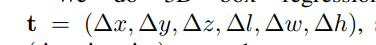

前三个为中心点的偏移值，后三个为长度比的对数。

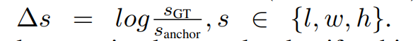

俯视图计算候选区域  ，候选区域网络是RPN，RPN网络的任务是找到proposals。输入：feature map。输出：proposal。

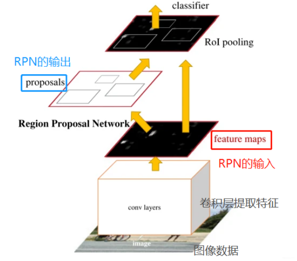

RPN总体流程：生成anchors -> softmax分类器提取positvie anchors -> bbox reg回归positive anchors -> Proposal Layer生成proposals。

红框为positive anchors，绿框为真实框GT。anchor和GT的梯度可以有dx, dy, dw, dh四个变换表示，bounding box regression通过线性回归学习到这个四个梯度，使anchor不断逼近GT，从而获得更精确的proposal。

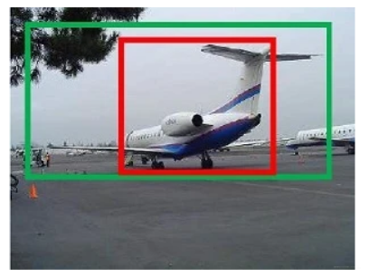

基于区域的融合网络

3个不同视角的proposal了。作者用这3个不同视角的proposal分别从俯视图、前视图和图片中获得相应的ROI区域。为了更好地融合来自不同视角的ROI，作者将所有获得的ROI通过ROI pooling得到表示，。

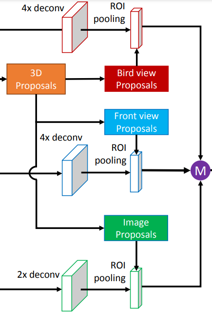

获得不同视角的ROI后，进行特征融合。

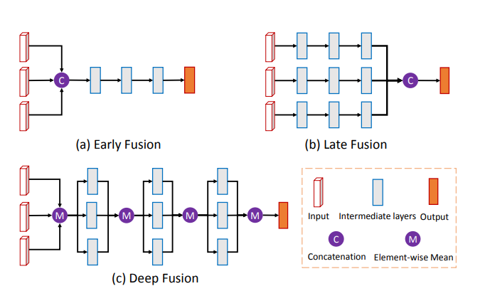

紫色圆圈中M是表示 ：基于元素的均值。C是表示：串接

损失函数   用交叉熵用于分类任务，smooth L1用于回归任务。

正负样本

MV3D是双阶段的目标检测方法，有两个分类任务（RPN的前景背景分类，以及网络最后的类别分类）和两个回归任务。

这里很多解析类文章都没有注意到一点的是，作者在正负样本的设置上还有点技巧。

在RPN中Anchor的正负性设置

从俯视角度看，IOU大于0.7的Anchor被视为positive，低于0.5视为negative；Anchor的正负性用来决定该Anchor是否参与RPN回归任务损失函数的计算。

在网络最后回归层中3D proposal 的正负性设置

从俯视角度看，IOU大于0.5的3D proposal 被视为positive，低于0.5视为negative；3D proposal的正负性用来决定该3D proposal是否参与网络最后回归任务损失函数的计算。

实验

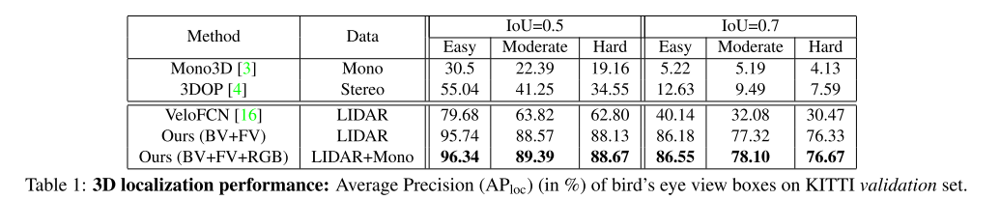

3D 定位性能：KITTI 验证集上鸟瞰框的平均精度 (APloc) (%)。

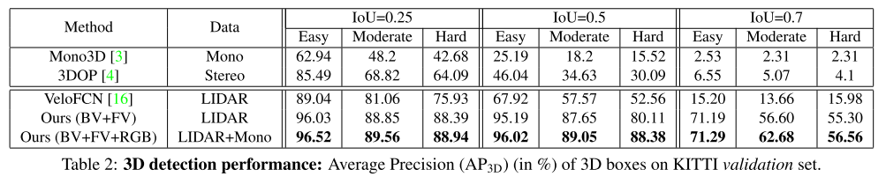

表2：3D检测性能：Kitti验证集上3 D框的平均精度（AP3D）（%）。  
 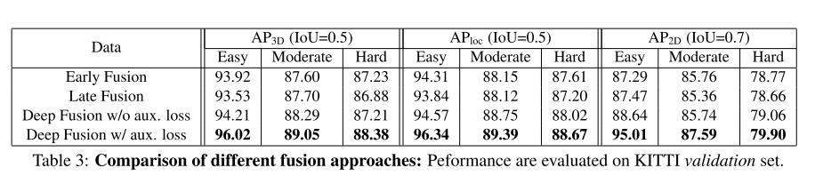

表 3：不同融合方法的比较：在 KITTI 验证集上评估性能。

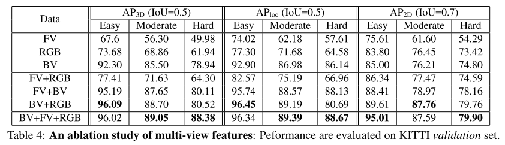

表 4：多视图特征的消融研究：在 KITTI 验证集上评估性能。

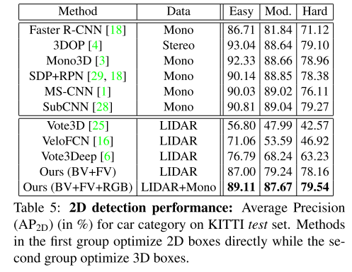

表 5：2D 检测性能：KITTI 测试集上汽车类别的平均精度 (AP2D) (%)。 第一组方法直接优化 2D 框，而第二组优化 3D 框。

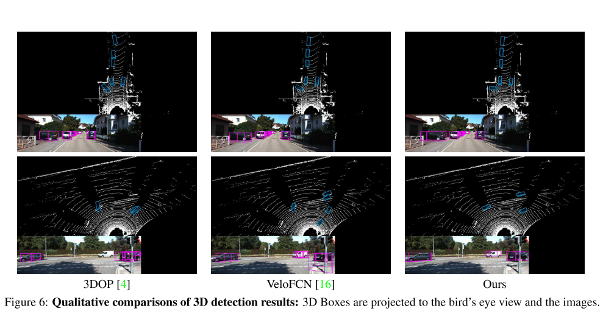

3D检测结果的定性比较：将3D Boxes投影到鸟瞰图和图像上。

> 更新: 2023-05-05 14:04:22  
> 原文: <https://3dcv.yuque.com/org-wiki-3dcv-mm1l0t/ysgfp9/deghng_yl73ik>