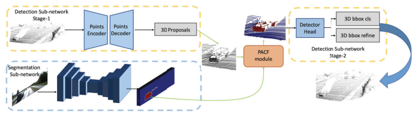
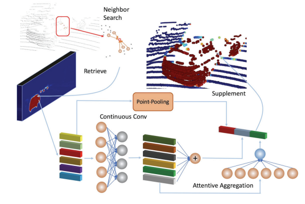
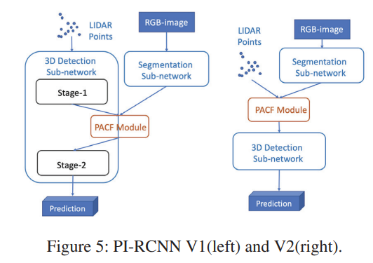
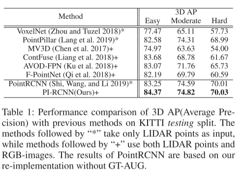
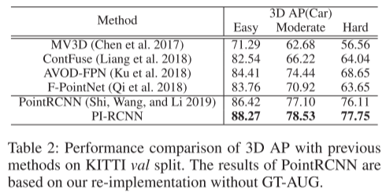

# PI-RCNN

论文名称：PI-RCNN: An Efficient Multi-sensor 3D Object Detector with Point-based Attentive Cont-conv Fusion Module

论文连接：[https://arxiv.org/pdf/1911.06084v1.pdf](https://arxiv.org/pdf/1911.06084v1.pdf)

浙大联合阿里，2020 AAAI

基于BEV视图或体素网格格式的融合方法并不精确。本文中提出了Point-based Attentive Cont-conv Fusion(PACF) ，一种新的fusion方法，可以直接在3D点云上融合多传感器的特征。除连续卷积外，还添加了“Point-Pooling”和“ Attentive Aggregation”以使融合特征更具表现力。此外，基于PACF模块，提出了一个称为Point cloud Image RCNN（PI-RCNN）的3D多传感器多任务网络，该网络可处理图像分割和3D目标检测任务。 PI-RCNN使用分割子网络从图像中提取全分辨率语义特征图，然后通过PACF模块融合多传感器特征。

PI-RCNN源于2个观察：

2D 图像中可以得到分割mask，进一步得到图像上物体的2D位置和边界框；

3D空间中物体间互相没有交集，通过3D目标的标签就可以得到LIDAR点分割结果。

PI-RCNN由2个子网络组成：图像分割子网络和point-based的3D检测子网络。分割子网络是一个轻量级的全卷积网络，输出是与原始图像大小相同的预测mask；检测子网络是以原始点云为输入的3D检测器。PACF模块连接2个子网络，并结合图像和LIDAR点云特征，以提高3D检测精度。

图 2：我们提出的 PI-RCNN 的主要架构。 首先，图像分割子网络从 RGB 图像中提取语义特征。 同时，检测子网络的第一阶段从原始激光雷达点生成 3D 提议。 然后，将 3D 点和语义特征图输入 PACF 模块进行逐点融合并补充点的特征。 最后，检测子网络的第 2 阶段将从图像语义中增强的逐点特征作为输入，以获得 3D 边界框的最终预测。

PACF直接在3D点云上进行point-wise连续卷积，并应用Point-Pooling和Attentive Aggregation使得fusion更加鲁棒。PI-RCNN网络结构如上图所示，包括2个子网络：

图像分割子网络：输入RGB图像，输入语义特征，是一个轻量级的全卷积网络，本文选用的是UNet；

Point-based的3D检测网络：从原始3D点云中生成和refine 3D proposals，本文选的是PointRCNN。

多传感器数据融合：BEV格式仅是3D点云的量化，存在精度损失，因此BEV上的邻近点搜索和融合不准确。

PACF模块

图3:我们提出的插图PACF模块。PACF模块对原始三维点和检索图像进行融合功能与更大的分辨率和语义特征图谱信息。此外,我们添加两个额外的操作:沿着pointaxis Point-Pooling池邻居的特征点;一个细心的聚合的聚合特征邻居通过一组可学的参数。

输入RGB图像和原始LIDAR点中提取的特征图，PACF模块输出一组离散的3D点，其特征包含来自RGB图像的语义信息。PACF包括5步：

为每个3D点搜索距离范围为d（默认为d = +∞）的k个最近的邻近点；

将相邻点投影到通过相机校准的2D图像平面提取的特征图上；

从图像中检索相应的语义特征，并将图像特征与3D点的几何偏移相结合；

利用注意力连续卷积融合k个近邻点的语义+几何特征；

对步骤3的输出执行Point-Pooling操作，并将它们与目标点的最终特征的步骤4的输出连接起来。

PACF模块的输出是以下三部分的concate：

连续卷积的输出ycc：将语义特征和点云特征相连接，再与目标点到邻近点的偏移量CONCAT，输入MLP（近似与连续卷积）

Point-Pooling：沿着point-axis执行Max-pooling操作，获取最具表征力的特征；

Attentive Aggregation：结合注意力机制，使用一个新的MLP聚合特征

融合策略

PI-RCNN V1（左边）：在middle-way中融合了多个传感器的特征，来自图像的语义特征是对第一阶段检测子网络输出的3D点云特征的补充。

PI-RCNN V2（右边）：在一开始进行融合，获得分割子网络输出之后，将图像特征与原始LIDAR点连接起来，作为检测子网络的输入。这种融合策略，可以将检测子网络与任意格式输入的其他3D检测器交替使用。例如，当利用基于BEV图或体素的格式的3D检测算法时，语义特征可以充当LIDAR点的额外特征。

实验

表1：3 D AP（平均精度）与以前Kitti测试分裂方法的性能比较。后跟“*”的方法仅将激光雷达点作为输入，而后跟“+”的方法同时使用激光雷达点和RGB图像。PointRCNN的结果基于我们在没有GT-AUG的情况下重新实施的结果。

表 2：3D AP 与之前 KITTI val split 方法的性能比较。  PointRCNN 的结果是基于我们在没有 GT-AUG 的情况下重新实现的。

> 更新: 2023-05-05 14:04:49  
> 原文: <https://3dcv.yuque.com/org-wiki-3dcv-mm1l0t/ysgfp9/cepgsq_pnplms>