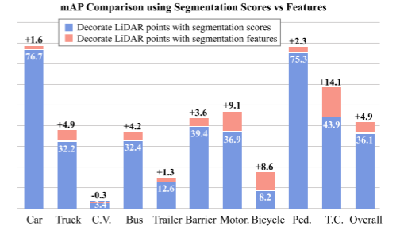
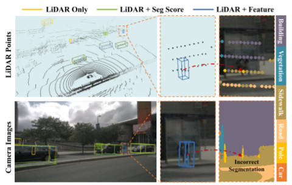
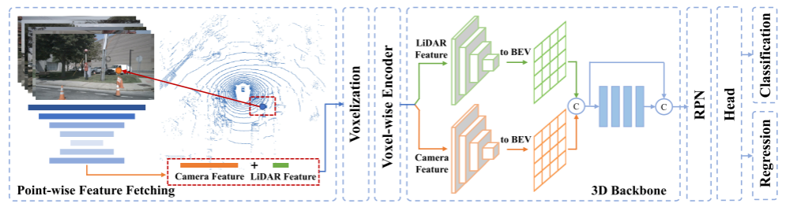
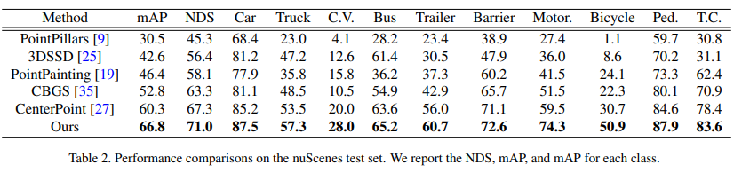
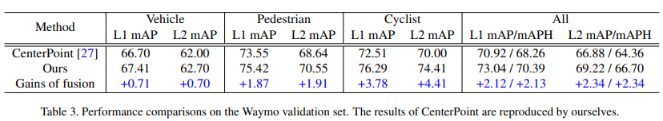
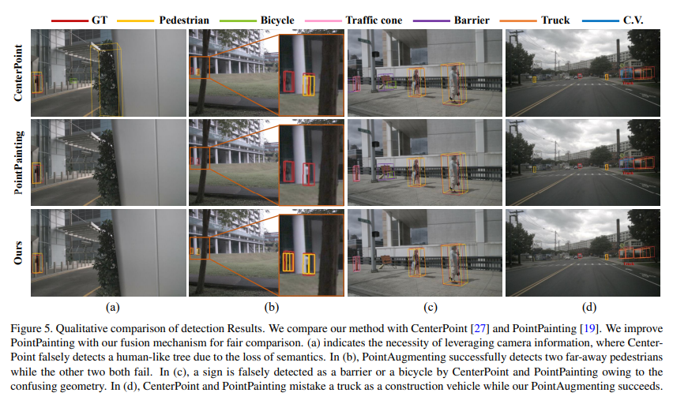

# PointAugmenting

论文标题：PointAugmenting: Cross-Modal Augmentation for 3D Object Detection

作者单位：MoE Key Lab of Artificial Intelligence, AI Institute, Shanghai Jiao Tong University

论文下载：[https://vision.sjtu.edu.cn/files/cvpr21_pointaugmenting.pdf](https://vision.sjtu.edu.cn/files/cvpr21_pointaugmenting.pdf)

CVPR 2021

PointAugmenting使用由预训练的二维检测模型提取的相应的像素级卷积神经网络特征来装饰点云，然后在经过编码的点云上进行三维物体检测。与高度抽象的语义分割分数相比，来自2D目标检测检测网络的卷积神经网络特征能够自适应物体的出现位置的变化，检测性能实现了显著的提升。

图 1. 使用分割分数和 CNN 特征融合 LiDAR 点进行 3D 对象检测的性能比较。 我们将 PointPainting [19] 中的分割分数替换为从同一分割网络 [20] 中提取的中间 CNN 特征。 我们使用仅 LiDAR 检测器 CenterPoint [27] 作为基线。  1/8 nuScenes 数据集上 +4.9% mAP 的改进表明来自图像的 CNN 特征更擅长与点云融合。 缩写代表工程车辆 (C.V.)、摩托车 (Motor.)、行人 (Ped.) 和交通锥 (T.C.)。

以前的论文已经探索了各种跨模型的传感器融合方案，这些方案可分为三类：决策级融合、建议级融合和像素级融合。决策级融合方法[13,21]采用现成的二维物体检测器，因此它们的性能受限于二维检测器的上限值。建议级融合方法，如MV3D[3]和AVOD[8]，在区域建议层面进行融合，导致沉重的计算负荷。最近的方法[11,10,29,16,7,19]试图通过将点云投射到图像平面上来获取点状的图像特征。[11,10,29]在提取图像特征之前，构建了鸟瞰图（BEV）摄像机特征，然后与激光雷达鸟瞰图特征相融合，来解决视角不一致的问题。然而，跨视角的转换很容易导致特征模糊。相反，MVX-Net[16]、EPNet[7]和PointPainting[19]直接利用点与点之间的对应关系，用CNN特征来增强每个LiDAR点的CNN特征或图像分割分数。我们注意到PointPainting之前的融合策略具有有限的普遍性与性能，如同PointPainting总结的那样：“尽管近期有很多有关融合策略的研究，但在KITTI排行榜上排名靠前的顶级方法只是激光雷达

图 2. 不同检测器的比较。 由于点云稀疏，仅使用 LiDAR 的基线检测器会错过场景中远处的行人。  PointPainting 也会因小对象的分割失败而失败。 受益于图像特征提供的丰富语义，我们的方法成功地检测到了行人。

图 3. PointAugmenting 概览。 该架构由两个阶段组成。  (1) 逐点特征提取：将激光雷达点投影到图像平面上，然后附加提取的逐点 CNN 特征。  (2) 3D 检测：我们使用额外的 3D 稀疏卷积流扩展 CenterPoint 以用于相机特征，并通过 BEV 地图中的简单跳过和连接方法融合不同的模态。

在SECOND[22]中，提出了一个稀疏的卷积操作来解析紧密的点云数据。CenterPoint[27]用基于关键点的检测器取代了一般的基于锚点的检测器。对于基于点的方法，PointRCNN[15]和STD[26]应用PointNet[14]来分割前景并为每个点生成建议。3DSSD[25]是一个单阶段的检测器。为了提高计算效率，它将所有的上采样层和细化模块都处理掉了。与基于网格的方法相比，基于点的方法需要很高的计算负荷，从而  
导致在大规模数据集上进行耗时的训练，如nuScenes[2]和Waymo[18]数据集。  
基于融合的3D目标检测 最近，多传感器融合  
已显示出巨大的优势。F-PointNet[13] 在二维检测结果的基础上生成三维边界框。AVOD[8]  
和MV3D[3]通过ROI对物体建议进行融合。研究人员[11,10,29]试图将前视摄像机的特征转化为BEV图。ContFuse[11]引入了一个新的连续融合层，而3D-CVF[29]采用了自动校准的投影法来构建平滑的BEV特征图。尽管取得了很好的结果，但存在特征模糊的问题。相反，其他方法[7,16,19] 以点为单位探索融合机制。MVX-Net[16]和PointPainting[19]分别从摄像机图像中获取特征图和分割分数，并在这两个点上应用简单的串联。对这两个点进行简单的连接。EPNet[7]设计了一个LI-Fusion模块，用于建立一个更精细的点与点之间的对应关系。在我们的工作中。我们探索了一种更好的图像表示和融合机制，以促进跨模式的点对点数据融合。  
数据增强 点云的数据增强在三维物体检测中至关重要。原始的GT-Paste增强将虚拟物体粘贴到当前训练场景中。这一操作不仅加速了网络收敛而且还缓解了恼人的类不平衡问题。然而，它对跨模态数据没有适应性。对于二维  
数据增强，基于块的方法[17,31,28]可以在训练中选择丢弃或粘贴块，有利于一个更稳健的网络学习。Cutmix[31]使用一个从另一幅图像上剪下的补丁来重覆盖一个区域，[1]将其调整为二维检测任务，它适用于二维检测任务。受Cutmix的启发， 我们对跨模式的三维增强的策略是同时将物体点和图像补丁粘贴到场景中，同时保持传感器之间的一致性。

三维物体检测的PointAugmenting方法。我们采用CenterPoint作为我们的LiDAR基线通过一个跨模式的融合机制以及有效的数据增强来扩展它。图3展示了我们的跨模态网络结构

在CenterPoint[27]的基础上构建了我们的方法，它是一个单阶段和无锚的LiDAR-only 3D检测器。在Center-Point中的点云首先被送入一个三维编码器，该编码器经过级联后被称为三维编码器，通过体素化、体素特征编码器和三维主干网络，产生平坦的紧凑的二维BEV特征图。最后，一个二维CNN将这些特征广播给多头，进行多头预测物体中心、三维尺寸和方向。像素级特征提取 检测器PointPainting[19]的成功启发了我们使用相机图像的语义来装饰LiDAR点。

高维的

CNN特征比分割分数表现得更好。因此，我们选择图像的CNN特征来进行点的解码。为了提取点状的图像特征，我们使用了一个为二维网络训练的现成网络，用于二维物体检测而不是语义分割。其原因在于三个方面。首先，二维和三维物体检测是互补的任务，它们关注的是物体的不同粒度水平。它们彼此受益。第二，二维检测标签是随时可以从三维投影中获得的，而分割标签则是昂贵的，而且通常无法获得。

分割标签是昂贵的，而且通常无法获得。最后，正如[1]所建议的那样，检测网络比分割网络对数据的扩展更友好。具体来说，我们把CenterNet[33,32]的DLA34[30]的输出激活

作为图像特征，其中特征图的通道数为64，其比例系数为4。为了获取相应的点状图像特征，我们通过同构变换将LiDAR点投射到图像平面上来建立对应关系。然后，LiDAR点被附加到所获取的基于点的图像特征上，作为网络输入来执行。识别的图像特征作为网络输入来进行检测。

3D检测 每个LiDAR点在nuScenes和Waymo数据集上分别的定义是(x, y, z, r, t)和(x, y, z, r)，其中x、y、z是位置坐标，r表示反射率，t表示相对时间。我们设定fi为64D图像特征。融合后的LiDAR点可以用(x, y, z, r, (t), fi)表示。考虑到LiDAR和相机之间的模态差距和不同的数据特征，与PointPainting使用的像素级的连接不同，我们采用了一种晚期融合机制。如图3所示，在体素特征编码器之后，我们使用两个独立的三维稀疏卷积分支来处理LiDAR和相机的图像。之后，我们将两个下采样的三维图像卷平铺为二维BEV图，每个通道的编号为256。然后，这两个BEV图被连接起来，再送入四个二维卷积块进行特征聚合。每个卷积块由两个3×3卷积层组成，然后是批量归一化层和一个ReLU激活函数。第一个块将通道数从512缩小到256。最后，我们在聚合的特征与先前的相机和之前的相机和LiDAR BEV特征之间添加一个跳过连接然后再转发到区域建议网络

跨模型数据增强

提出了一个有效的数据扩充方案，以使GT-Paste在训练我们的跨模态时适用。受最近的图像增强方案的启发，我们试图在粘贴LiDAR点到当前3D场景时，同时将图像补丁附加到图像上。主要挑战在于如何保持相机和激光雷达数据之间的一致性。如图4所示，从观察者的角度来看，被粘贴的自行车部分地被原始三维场景中的汽车遮挡住了，导致摄像机图像上出现重叠。如果我们直接将虚拟物体补丁粘贴到图像上，在重叠区域内投影的物体的点可能会获取不匹配的特征。此外， 投射到虚拟补丁中的地面点也会捕捉到不正确的信息。为了解决这个问题，我们确定前景物体之间的遮挡关系并  
从观察者的角度过滤那些被遮挡的LiDAR点。  
对于相机图像，我们将虚拟物体和原始物体都取出来，并将它们的补丁附在相机上，并通过远到近的轨道将它们的斑块连接起来。  
点云增强 我们将LiDAR点(x, y, z)转换为LiDAR球面坐标系(r,θ,φ)，用θ和φ的范围来表示物体的视角，其中θ和φ的最小和最大是由其地面实况框的八个角得到的。在选择虚拟对象时，原始的GT-Paste要求避免物体的碰撞。我们的方法还限制了物体之间的透视重叠，以避免过滤掉太多的前景点。然后，被选中的虚拟物体被粘贴到当前的的场景中，我们从观察者的角度过滤被遮挡的点。具体来说，给定当前场景中的原始和粘贴的虚拟物体，我们按照从近到远的顺序处理每个物体。如果一个原始物体被取走了，我们只丢弃那些被遮挡的物体。如果处理的是一个被粘贴的物体，所有比这个物体更远的遮挡点都将被此外。  
我们在这个虚拟对象的视角下过滤背景点。  
实物的角度过滤背景点。这是因为原始对象只遮蔽了远处的虚拟物体，而粘贴的虚拟物体则包括所有远处的物体和背景点。我们的遮挡感知的点过滤的详细过程在算法1中说明。  
摄像机图像增强 为了匹配LiDAR和相机之间的一致性，对于每个粘贴到LiDAR场景中的虚拟物体，我们在一个二维边界框内将其对应的补丁附加到图像上。该二维边界框是由三维地面实景投影获得的。为了确定粘贴的位置，我们注意到，虽然虚拟点是在LiDAR场景中的原始位置上粘贴的，但虚拟块并不是在LiDAR场景中的原始位置上。由于相机外部参数的抖动，  
我们需要通过当前的摄像机外部标定重新计算二维边界框的位置，然后通过平移和转换原始块，然后通过平移和缩放对原始补丁进行转换。此外，我们不是直接粘贴虚拟补丁，我们掌握了虚拟对象和原始对象的补丁，并按从远到近的顺序粘贴。通过这种方式，在图像中，背景物体被前景物体遮挡这与LiDAR场景中物

实验

> 更新: 2023-05-05 14:04:48  
> 原文: <https://3dcv.yuque.com/org-wiki-3dcv-mm1l0t/ysgfp9/by6vzg_ngqppc>