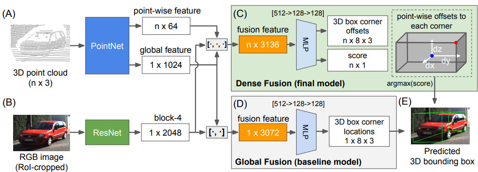
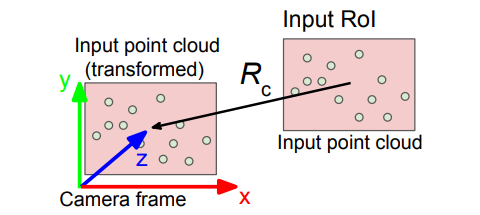
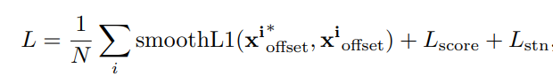
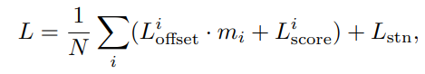
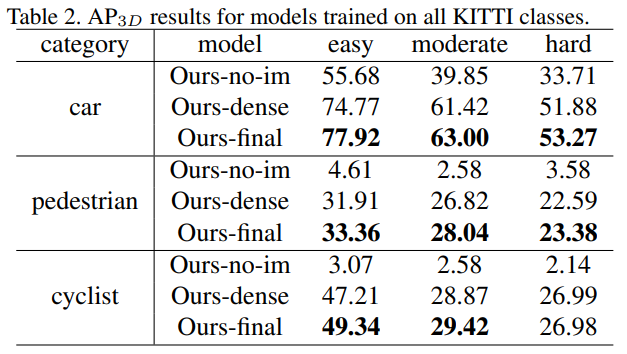
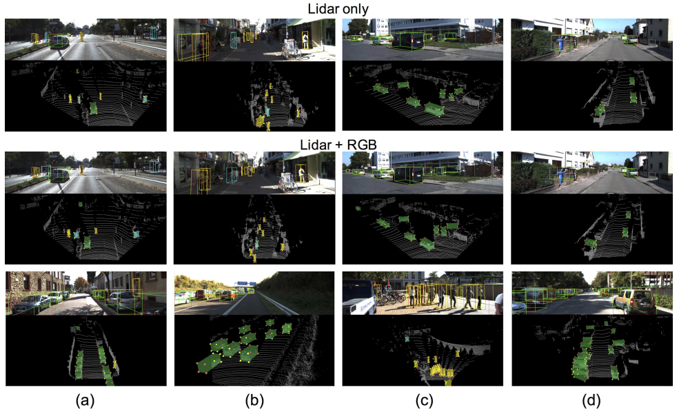

# PointFusion

PointFusion同时使用RGB图像和三维点云，采用Early Fusion策略进行物体3D Box Estimation

核心思路总结：输入RGB image crop和与之相对应的raw 3D point cloud，分别通过ResNet和PointNet提取特征，然后对两类特征进行fusion并进一步抽象，最后将3D points视为spatial anchors并进行dense prediction以得到物体的3D bounding box。PointFusion网络结构如图所示。

网络结构：

PointFusion结构流程。PointFusion有两个特征提取器：一个是PointNet变体用来处理原始点云数据（A），另一个是CNN用来从图像上提取视觉特征（B）。

提出两种融合网络架构：一种是普通的全局架构（Global Fusion），直接从特征回归出box角点位置（D）；第二个是提出一种新的逐点判断的稠密结构（Dense Fusion含义可参考CV中的dense prediction的意思），预测8个角点相对于输入点云的的空间偏置（C），每个点会有一个评分，最后选择得分最高到作为最后到预测结果（E）。

其中红色点为角点，蓝色点为输入点云，白色箭头表示角点到输入点到空间偏置。

结合了AVOD与F-PointNet各自的优势

AVOD将RGB和BEV图像经过特征提取后进行fusion，结合了颜色信息与空间分布信息，但是使用的BEV是经过点云投影得到，存在空间信息的损失；F-PointNet使用raw point cloud提取空间几何特征，没有任何信息的损失，但是没有充分利用RGB信息。而PointFusion权衡了二者的利弊，使用raw point cloud的同时辅以颜色信息

PointFusion对PointNet进行了一些修改。去掉了所有的batch normalization，文中提到bn层会一定程度上降低3D box estimation的性能，二 根据相机参数计算旋转矩阵以代替PointNet中的T-Net，对RoI对应部分的点云进行归一化处理，示意图如下。

两种的融合。第一个为全局融合，结合了RGB图像的全局特征(1x2048)和点云的全局特征(1x1024)，经过若干层全连接层后直接回归出3D box的八个顶点坐标(1x8x3)；第二个为密集融合，也是最终采用的版本。在全局融合的基础之上加入了逐点特征(nx64)，处理方式类似PointNet中segmentation部分，经过若干层全连接层后预测每一个点相对box center的偏移值以及得分，最后选取得分最高的点为预测结果。PointFusion没有直接回归3D box的八个顶点，而是预测每个点的相对偏移值，具备更好的场景扩展性

PointFusion提出了监督与无监督两类loss function

     

监督要求最佳预测点是在target bounding box之内的，而无监督则没有这一约束，将高置信度赋给那些可能是好的预测的点

实验

实验结果显示无监督方式优于有监督方式，如下表所示，其中ours-dense和ours-final分别采用的是有监督和无监督学习。

> 更新: 2023-05-05 14:04:36  
> 原文: <https://3dcv.yuque.com/org-wiki-3dcv-mm1l0t/ysgfp9/glt11q_zq5qeo>