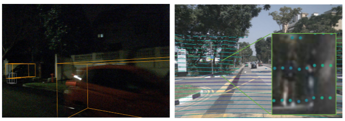
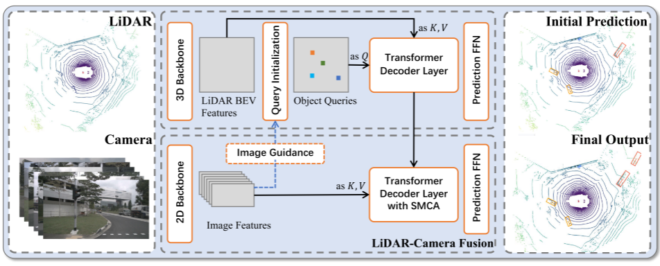
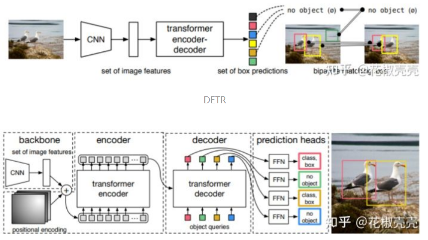
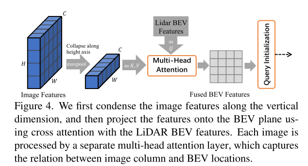
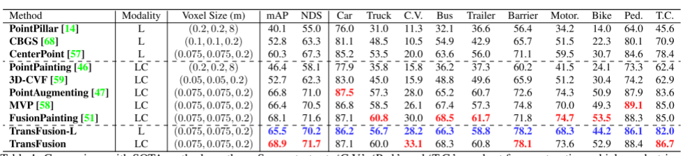
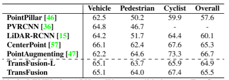

# TransFusion

论文标题：TransFusion: Robust LiDAR-Camera Fusion for 3D Object Detection with Transformers

作者单位：香港科技大学,华为IAS BU

论文：[https://arxiv.org/abs/2203.11496](https://arxiv.org/abs/2203.11496)

代码：[https://github.com/XuyangBai/TransFusion/](https://github.com/XuyangBai/TransFusion/)   

2022 CVPR

具体的过程为：

（1）3D点云输入3D backbones获得BEV特征图

（2）初始化Object query按照下图左边的Transformer架构输出初始的边界框预测。

（3）上一步中的3D边界框预测投影到2D图像上，并将FFN之前的特征作为新的query features通过SMCA选择2D特征进行融合。

（4）输出最终的BBOX

（5）为了利用高分辨率的图像，提高对小物体检测的鲁棒性，增加了图像引导的Object query初始化。对步骤    （2）进行增强

 TransFusion，以LiDAR-camera融合与软关联机制，以处理低劣的图像条件。具体来说，我们的TransFusion由卷积骨干和基于Transformers解码器的检测头组成。解码器的第一层使用稀疏的object queries集预测来自LiDAR点云的初始边界框，其第二层解码器自适应地将object queries与有用的图像特征融合，充分利用空间和上下文关系。Transformers的注意力机制使我们的模型能够自适应地决定从图像中获取什么信息和从什么位置获取信息，从而形成一个鲁棒和有效的融合策略。此外，我们还设计了一种图像引导的query初始化策略来处理点云中难以检测的对象。

目前的融合方法粗略分为3类：结果级、提案级和点级。

result-level：FPointNet，RoarNet等。

proposal-level：MV3D，AVOD等。由于感兴趣区域通常含有大量的背景噪声，这些粗粒度融合方法的结果并不理想。

point-level ：分割分数：PointPainting，FusionPainting，CNN特征：EPNet，MVXNet，PointAugmenting等。

尽管有了令人印象深刻的改进，这些点级融合方法仍存在两个主要问题：首先，它们通过元素级联或相加将激光雷达特征与图像特征融合，在图像特征质量较低的情况下，性能严重下降。其次，寻找稀疏的LiDAR点与密集的图像像素之间的硬关联，不仅浪费了大量具有丰富语义信息的图像特征，而且严重依赖于两个传感器之间的高质量校准，而由于固有的时空偏差，这种校准往往难以获得。总的来说就是两个问题：（1）图像特征的质量无法保证（2）传感器外参不准，很小的误差会造成对齐失败。

图 1. 左：照明条件不佳的示例。 右图：由于点云的稀疏性，基于硬关联的融合方法浪费了很多图像特征，并且对传感器校准很敏感，因为投影点可能由于校准误差小而落在物体之外。

用两个Transformers解码器层作为检测头的顺序融合方法。我们的第一个解码器层利用稀疏的object queries集来根据LiDAR特性生成初始的边界框。使对象查询具有输入依赖性和类别感知性，从而使查询具有更好的位置和类别信息。接下来，第二个变压器解码器层自适应融合对象查询与有用的图像特征相关的空间和上下文关系。我们利用局域诱导偏差，在初始边界框周围对交叉注意进行空间约束，以帮助网络更好地访问相关位置。我们的融合模块不仅为目标查询提供了丰富的语义信息，而且由于激光雷达点与图像像素之间的关联是一种软的、自适应的方式，因此对较差的图像条件具有更强的鲁棒性。最后，针对点云中难以检测的对象，引入了图像引导的查询初始化模块，在查询初始化阶段引入了图像引导

1. 用类似CenterPoint的方式在LiDAR feature map上出一个heatmap预测一堆中心，用这堆中心作为query的初始化。
2. 用这堆query去和LiDAR feature map做cross attention，query自己做self attention。然后每个query出一个粗预测。
3. 用粗预测的中心投影到图像上，和图像的feature周围做cross attention，并且加了一个gaussian mask使得不关注到太远的地方。和图像的attention做完之后每个query输出一个最终的预测框。
4. 上述的query initialization是完全从LiDAR信息来的，为了在query的初始化的时候就用上图像信息来提高query的召回率。作者把image feature 提升到了BEV 空间下输出了一个完全基于图像信息的heatmap，和LiDAR的heatmap共同作为query的初始化。

给定一个LiDAR BEV feature map和image feature map，我们的基于Transformer的检测头首先利用LiDAR信息将Object query解码为初始的边界框预测，然后通过注意力机制将Object query与有用的图像特征融合，进行LiDAR-camera融合。

Transformer for 2D Detection

从DETR开始，Transformer开始被大量用到目标检测中。DETR使用了一个CNN提取图像特征，并使用Transformer架构将一小组学习到的embeddings(称为object queries)转换为一组预测。后续有一些方法给object queries进一步加入了位置信息。在我们的工作中，每个object queries包含一个提供对象定位的query position和一个query feature 编码实例信息，如框的大小、方向等。

query position作为网络参数随机生成或学习，而与输入的数据无关。这种独立于输入的query position需要额外的阶段(解码器层)来为他们的模型[2,71]学习向真实对象中心移动的过程。最近，在二维目标检测[57]中发现，通过更好的object queries初始化，可以弥补1层结构和6层结构之间的差距。受此启发，我们提出了一种基于center heatmap的输入相关初始化策略，以实现仅使用一个解码层的竞争性能。

具体而已，给定一个XYD的LiDAR BEV特征，我们首先预测一个特定类的热图，X*Y*K,XY是特征图的尺寸，K是种类数量。然后，我们将热图看作X × Y × K对象候选，并选择所有类别的前n个候选对象作为我们的初始object queries。为了避免空间过于封闭的查询，在[66]之后，我们选择局部最大元素作为我们的对象查询，其值大于或等于它们的8个连接的邻居。否则，需要大量queries覆盖BEV平面。所选候选对象的位置和特征用于初始化query positions 和 query features。这样，我们的初始对象查询将位于或接近潜在的对象中心，消除多个解码器层来细化位置的需要。

BEV平面上的物体均为绝对尺度，同一类别之间的尺度方差较小。为了利用这些属性更好地进行多类检测，我们通过为每个object queries类别嵌入，使object queries具有类别感知性。具体地说，使用每个被选中候选的类别(例如Sˆijk属于第k个类别)，我们通过将一个热门类别向量线性投影到Rd向量产生的类别嵌入，明智地对查询特征进行元素求和。类别嵌入具有两个方面的优点:一方面，它可以作为建模自注意模块中对象-对象关系和交叉注意模块中对象-上下文关系的有用边信息;另一方面，在预测时，它可以传递对象有价值的先验知识，使网络关注于类别内的方差，从而有利于属性预测。

解码结构遵循DETR，object queries与特征映射(点云或图像)之间的交叉注意将相关上下文聚集到候选对象上，而object queries之间的自注意导致了不同候选对象之间的成对关系。query positions通过多层感知器(MLP)嵌入到d维位置编码中，并根据查询特征逐一的地进行元素求和。这使得网络能够同时对上下文和位置进行推理。

N个包含丰富实例信息的object queries被前馈网络(FFN)独立地解码为方框和类标签。从object queries预测的有中心点偏移，log（l）,log（w）,log（h）.偏航角sin(α), cos(α) ,x,y方向的速度，我们还预测了一个类概率。每个属性由一个单独的两层1×1卷积计算。通过并行地将每个object queries解码为预测，我们得到一组预测{ˆbt, pˆt}N t作为输出，其中ˆbt是第i个查询的预测边界框。类似3DETR，我们采用了辅助解码机制，在每个解码器层后增加了FFN和监督（即每一个解码层算一个LOSS）。因此，我们可以从第一解码器层得到初始的边界盒预测

保留所有图像特征FC∈RNv×H×W ×d作为我们的存储库，并利用Transformer解码器中的交叉注意机制，以稀疏密集、自适应的方式进行特征融合。

空间调制交叉注意(SMCA)模块，该模块通过一个二维圆形高斯掩模来衡量交叉注意，该模块围绕着每个查询的投影2D中心（仅利用点云的预测结果根据外参投影到图像上）。二维高斯权值掩码M的生成方法与CenterNet类似。然后这个权重图与所有注意力头之间的交叉注意图相乘。这样，每个object queries只关注投影2D框周围的相关区域，这样网络就可以根据输入的LiDAR特征更好更快地学习到选择哪些图像特征

该网络通常倾向于关注接近对象中心的前景像素，忽略无关像素，为对象分类和边界框回归提供了有价值的语义信息。在SMCA之后，我们使用另一个FFN，使用包含LiDAR和图像信息的object queries来产生ffinal bound box预测。

为了进一步利用高分辨率图像的能力来检测小目标，并使我们的算法在稀疏情况下更鲁棒激光雷达点云，我们提出了一个图像引导查询初始化策略。利用LiDAR和相机信息选择object queries

图 4. 我们首先沿垂直维度压缩图像特征，然后使用与 LiDAR BEV 特征的交叉注意力将特征投影到 BEV 平面上。 每个图像都由一个单独的多头注意力层处理，该层捕获图像列和 BEV 位置之间的关系。

实验

表 1. nuScenes 测试集上与 SOTA 方法的比较。 “C.V.”、“Ped.”和“T.C.”分别是施工车辆、行人和交通锥的缩写。 “L”和“C”分别代表 LiDAR 和相机。 最佳结果以粗体显示（仅 LiDAR 的最佳结果标记为蓝色，最佳 LC 结果标记为红色）。 对于 FusionPainting [51]，我们在 nuScenes 网站上报告了结果，这比他们在论文中报告的要好。 请注意，CenterPoint [57] 和 PointAugmenting [47] 使用双翻转测试，而我们不使用任何测试时间增加。

表 2. Waymo 验证集上的 LEVEL 2 mAPH。 对于 CenterPoint，我们报告了在 36 个 epoch 中训练的单帧单阶段模型的性能。

> 更新: 2023-05-05 14:04:43  
> 原文: <https://3dcv.yuque.com/org-wiki-3dcv-mm1l0t/ysgfp9/ono425_pwdp5q>