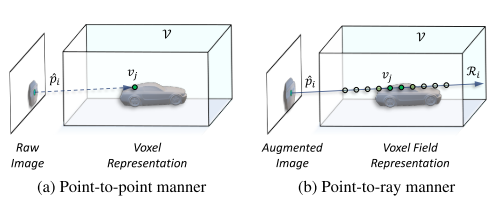
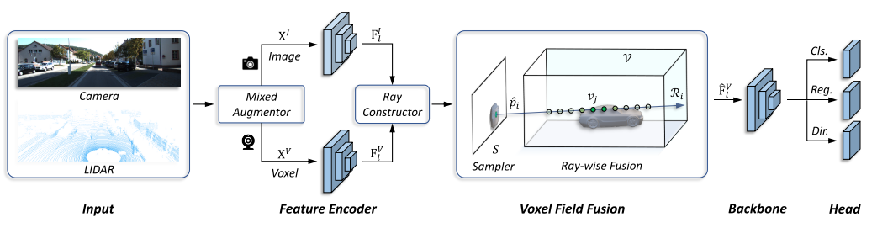
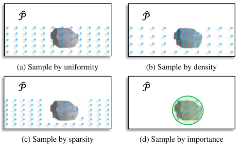
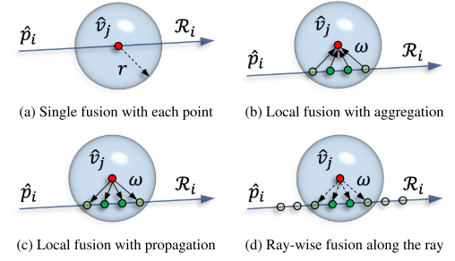
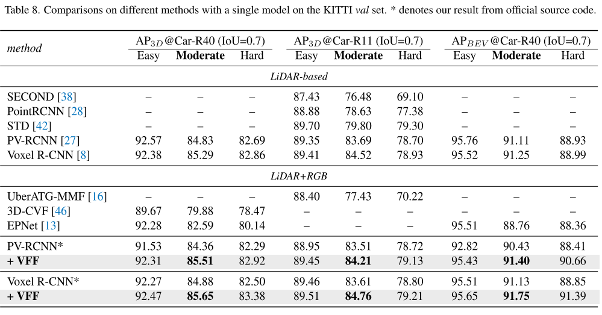

# Voxel

论文名称：Voxel Field Fusion for 3D Object Detection 

论文下载：

[https://openaccess.thecvf.com/content/CVPR2022/papers/Li_Voxel_Field_Fusion_for_3D_Object_Detection_CVPR_2022_paper.pdf](https://openaccess.thecvf.com/content/CVPR2022/papers/Li_Voxel_Field_Fusion_for_3D_Object_Detection_CVPR_2022_paper.pdf)

代码：[https://github.com/dvlab-research/VFF](https://github.com/dvlab-research/VFF)

跨模态 3D 对象检测框架，称为体素场融合。 所提出的方法旨在通过将增强图像特征表示和融合为体素场中的射线来保持跨模态一致性。 为此，可学习采样器首先设计用于从图像平面采样以点对射线方式投影到体素网格的重要特征，从而保持特征表示与空间上下文的一致性。 此外，进行射线融合以将特征与构建的体素场中的补充上下文融合。 我们进一步开发了混合增强器来对齐特征变体转换，从而弥合了数据增强中的模态差距。

图 1. 与 1a 中先前的工作 [17,50] 将特征从原始图像投影到体素并以点对点的方式表示，1b 中提出的方法将特征从增强图像投影到体素场并以 点对射线方式。 虚线和实线箭头表示点和射线水平投影。

在图1 a中以点对点的方式表示图像特征，其在受点云稀疏性约束的每个单点中进行融合。在这种情况下，来自图像的丰富上下文线索不能被充分利用，因为在3D空间中不能保证图像平面中的邻接。同时，传统的方法 [17，50] 在给定增强点云的情况下，通常保持原始图像不变，并在点云中进行反向变换以实现成对的对应。然而，由于二维卷积中的翻转和缩放方差，异步增强带来了交叉模态失准和不稳定。

体素场融合 (VFF)。 两种模式的混合增强首先应用于数据级预处理。 如图 1b 所示，VFF 将增强的图像特征投影到体素网格并以点对射线的方式表示，称为体素场，类似于神经渲染中的体素场 [19, 20]。 通过这种方式，两种模式的表示都很好地对齐，并且在体素场中补充了周围的空间上下文。 简而言之，VFF 的关键思想是通过将增强图像特征表示和融合为体素场中的一条射线来保持模态一致性。

图像到体素的密集渲染通常是资源密集型的，或者需要额外的模型来进行深度预测 [25, 47]。 为了促进这一过程，我们从神经渲染 [19, 20, 48] 的最新进展中汲取灵感，并提出了一种可学习的采样器和光线方式融合，以实现高效的光线构建和跨模态融合。 特别是，可学习采样器不是随机采样 [20]，而是设计用于选择图像特征以在激活区域内以高响应进行交互，其中特征以如上所述的点对射线方式表示。 然后，根据每个体素沿射线的预测得分，在体素场中进行射线融合。 对于增强中的未对齐，进一步提出了混合增强器通过在图像级别对齐特征变量增强（翻转和缩放）来弥补这一差距。

VFF 有两个方面的区别。 首先，它以点对射线的方式投射图像特征，并在体素场中表示和融合它们，从而消除模态差距并提供准确的 3D 上下文来检测困难案例。 其次，它有效地从增强图像中采样高响应特征，这使网络能够动态构建每条光线。整个框架在概念上很简单：混合增强器旨在跨模态对齐数据增强； 引入可学习的采样器以有效地选择交互的关键特征； 并且提出了ray-wise fusion来融合和组合沿射线的特征

图 2. 使用体素场融合进行 3D 对象检测的框架。 特别是，具有不同模态的输入首先使用仅用于训练的混合增强器进行处理。 然后，在特征编码器中分别提取两种模态的特征，在射线构造器中建立对应关系。 在体素场融合中，使用设计的采样器选择交互的重要图像特征。 然后沿每条射线使用高响应特征进行射线融合。 利用体素领域中融合和新生成的特征，应用以下检测主干和头部来预测最终的 3D 提议。

图 3. 不同采样方法的示例。 蓝色点表示光线交互的采样像素。 与启发式方式相比，我们提出的 3d 可学习采样器仅考虑具有高响应的重要绿色区域。

图 4. 不同融合方法的玩具示例。 红点 v^j 表示带有 LiDAR 点的锚体素。  Ri 中的绿点表示半径为 r 的球内的体素箱 vj。  4d 中的虚线表示为训练分配的存在概率。

表 8. KITTI 验证集上单个模型的不同方法的比较。  * 表示我们来自官方源代码的结果。

> 更新: 2023-05-05 14:05:00  
> 原文: <https://3dcv.yuque.com/org-wiki-3dcv-mm1l0t/ysgfp9/kkvysq_edzwu7>