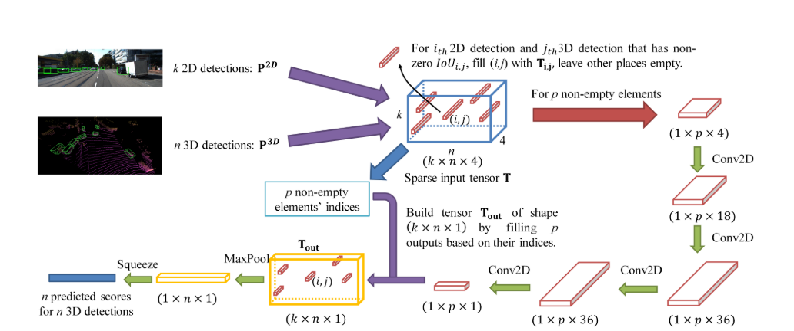

# CLOCs

[论文下载](https://ieeexplore.ieee.org/abstract/document/9341791)：CLOCs: Camera-LiDAR Object Candidates Fusion for 3D Object Detection

摄像机-激光雷达目标候选融合的三维目标检测（2020 IEEE/RSJ International Conference on Intelligent Robots and Systems (IROS) 2020.）

代码下载：[https://github.com/pangsu0613/CLOCs](https://github.com/pangsu0613/CLOCs)

# 摘要
目前的3D目标检测的工作，基于融合（多模态）的方法很难取得比单模态更好的效果。CLOCS提供了一个low-complexity multi-modal fusion，这个网络可以显著提高单模态检测器的表现。

在3D目标检测领域，目前的fusion普遍都是deep fusion，效果不如只基于lidar的方法。本文选择使用之前不常用的late fusion。就是将来自不同2D和3D检测器的结果做一个deep fusion，并且fusion处理的的是一个稀疏的向量。

# 引言
仍然强调了LiDAR-only based methods outperform most of the fusion based methods.

Fusion可分为三类： early fusion，deep fusion，late fusion，它们各有利弊。

尽管early和deep fusion 有很大的潜力去利用跨模态信息 ，但他们对数据对齐很敏感，并且经常包括了很复杂的网络结构，并且需要传感器数据像素级别的对应。

late fusion的结构更简单因为他们包含提前训练好的不需要改变的单模态检测器，仅仅需要在决策层的联系。

Versatility & Modularity:可以随意使用任意的2D或者3D的检测器，因为不需要重新训练。

Probabilistic-driven Learning-based Fusion:

Speed and Memory:速度较快，占用内存少。

Detection Performance:在KITTI中，是使用融合的方法中精度最高的。

# 框架

CLOCS融合网络体系结构。 首先，将单个二维和三维检测候选者转换为一组一致的联合检测候选者（稀疏张量，蓝盒）； 然后利用二维CNN对稀疏输入张量中的非空元素进行处理； 最后，通过MaxPooling将处理后的张量映射到期望的学习目标，即概率得分图。 

> 更新: 2023-05-05 14:04:56  
> 原文: <https://3dcv.yuque.com/org-wiki-3dcv-mm1l0t/ysgfp9/igxyaq_md020q>