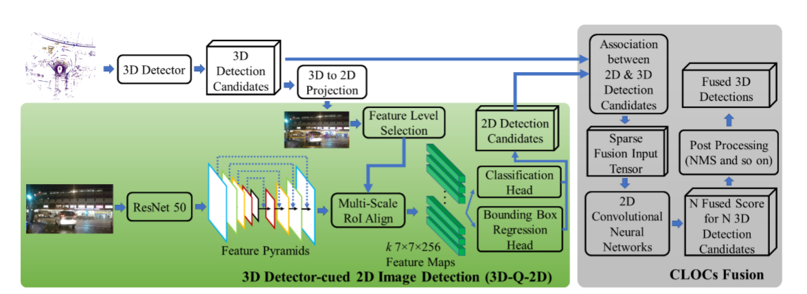

# Fast-CLOCs

[论文下载：](https://openaccess.thecvf.com/content/WACV2022/html/Pang_Fast-CLOCs_Fast_Camera-LiDAR_Object_Candidates_Fusion_for_3D_Object_Detection_WACV_2022_paper.html)Fast-CLOCs：Fast Camera-LiDAR Object Candidates Fusion for 3D Object Detection

# 摘要
与单一模态方法相比，基于FUSION的目标检测方法往往需要更复杂的模型来集成异构传感器数据，并使用更多的GPU内存和计算资源。 对于基于相机-激光雷达的多模态融合尤其如此，这可能需要三个单独的深度学习网络或处理管道，这些网络或处理管道被指定用于视觉数据、激光雷达数据以及某种形式的FA融合框架。 本文提出了一种快速摄像机-激光雷达目标候选（FAST-CLOCS）融合网络，该网络能够在接近实时的情况下运行高精度的基于融合的三维目标检测。 FAST-CLOCS对任何3D检测器的非最大抑制(NMS)前的输出候选进行操作，并添加了一个轻量级的3D检测器提示的2D图像检测器(3D-Q-2D)，从图像域中提取视觉特征，以显著提高3D检测效果。 在3DQ-2D图像检测器中共享了三维候选检测器，从而大大降低了网络的复杂度。 在具有挑战性的Kitti和Nuscenes数据集上，我们的FAST-CLOCs的优异实验结果表明，我们的FAST-CLOCs优于目前最先进的基于融合的三维目标检测方法。

# 主要贡献
FAST-CLOCS使用任何3D检测器，无需重新训练。

在FAST-CLOCS中提出的3D-Q-2D图像检测器在2D目标检测方面优于最先进的基于图像的检测器(SOTA)。

FAST-CLOCS比SOTA融合方法具有更高的内存和计算效率，并且可以在单个桌面级GPU上近乎实时地运行。 FAST-CLOCS改进了KITTI和NUSCENES数据集上的SOTA激光雷达-相机融合性能。 

# 系统架构

 该系统主要由三个部分组成：（1）三维物体检测器； (2)3D检测器引导的二维图像检测器(3D-Q-2D)； （3）原始CLOCs融合。 与原来的CLOCs相比，我们提出利用一个轻量级的3D-Q-2D检测器（绿色块）来代替单独的完整的2D图像检测器，以显著降低GPU内存和计算成本。 

> 更新: 2023-05-05 14:04:57  
> 原文: <https://3dcv.yuque.com/org-wiki-3dcv-mm1l0t/ysgfp9/ux5sxo_fggbxm>