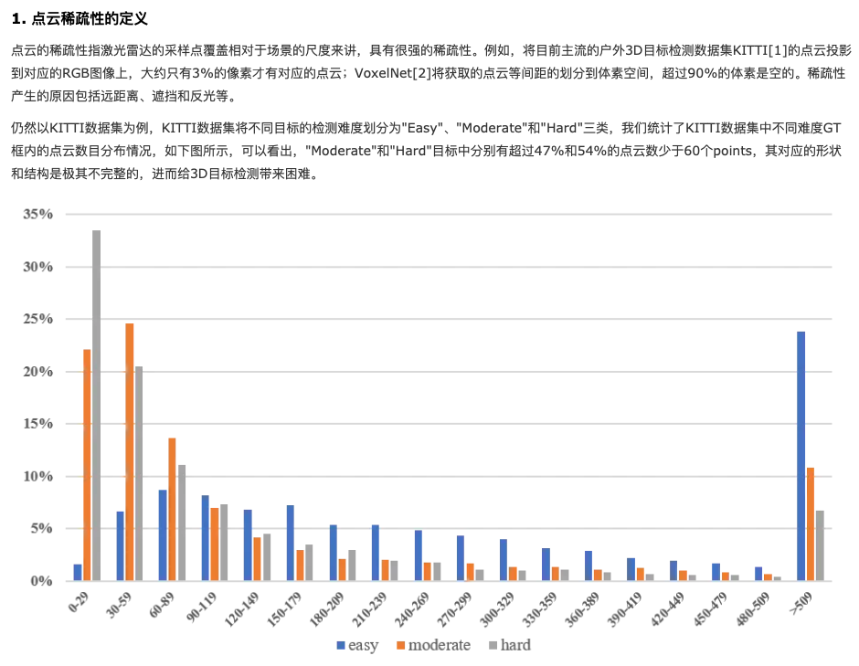
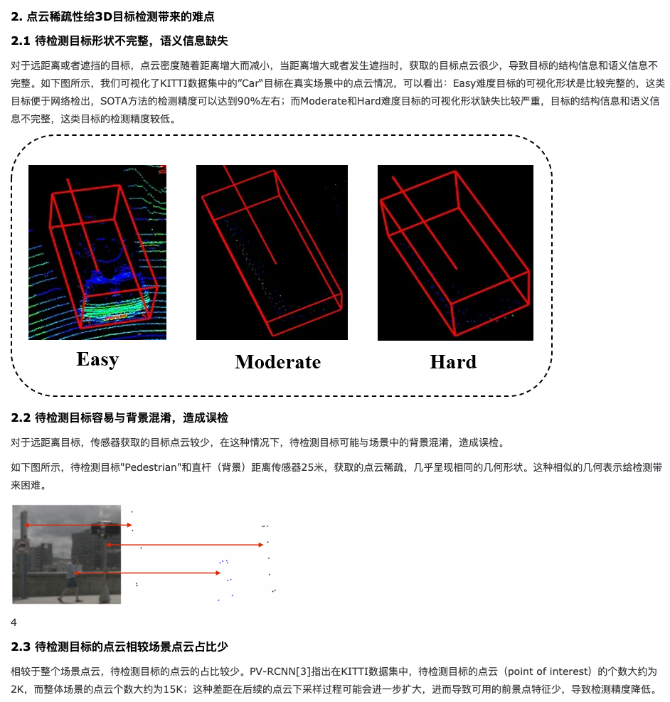
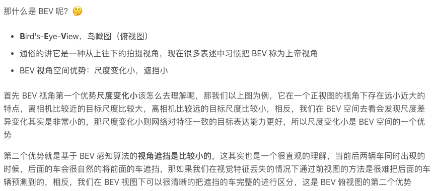
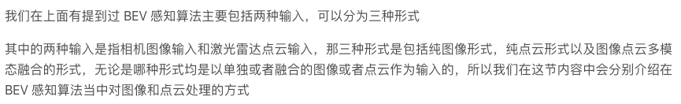
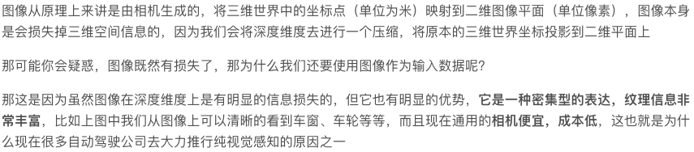
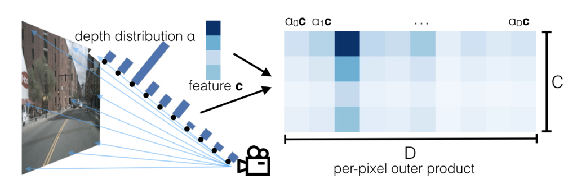
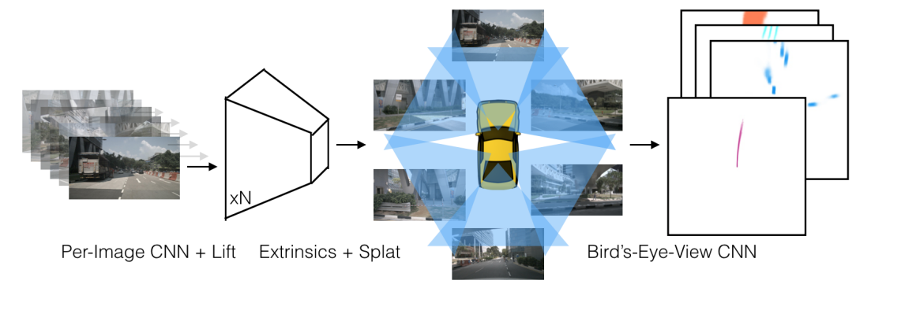
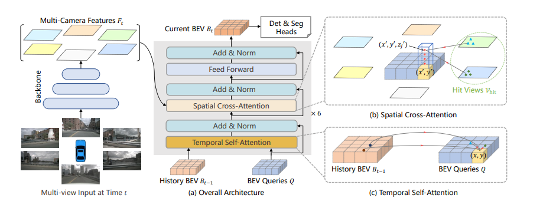
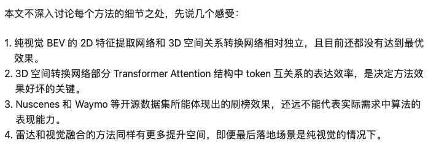
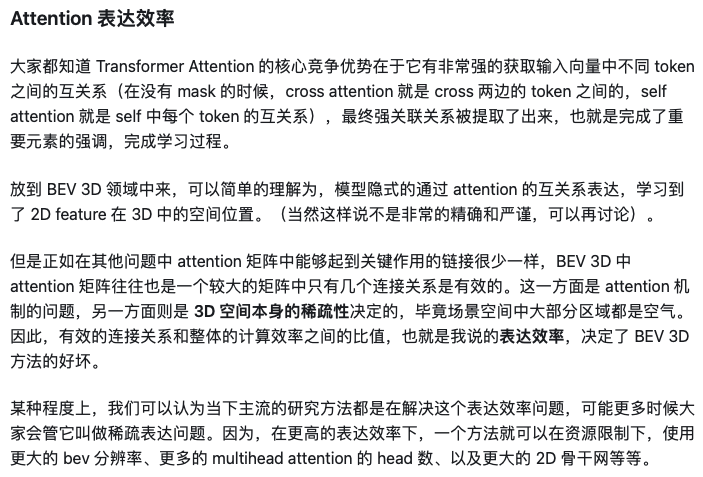

# 3.6 BEV入门探索（入门必读）

BEV方法已经成为了自动驾驶感知算法中最主要的门类。对于刚入门的人来说，看新论文过程中，很多约定俗成的东西已经不再去解释了，因此看的云里雾里。这里记录一下很多相关概念的出处和解释。放的内容都是网页上摘出来的。


## 点云的稀疏性：为什么点云是“稀疏”的？相对而言图像是“稠密”的？（这个问题在BEV多模态融合过程中是必要的）
[https://mp.weixin.qq.com/s?__biz=MzU2NjU3OTc5NA==&mid=2247562187&idx=2&sn=0e0d137b5fbf4b0808d8d459b1c22b17&chksm=fca9f4f6cbde7de097e1ad435fefec0ac00d45fe5f4befed2c3d4390fd8363e61704f5780312&scene=27](https://mp.weixin.qq.com/s?__biz=MzU2NjU3OTc5NA==&mid=2247562187&idx=2&sn=0e0d137b5fbf4b0808d8d459b1c22b17&chksm=fca9f4f6cbde7de097e1ad435fefec0ac00d45fe5f4befed2c3d4390fd8363e61704f5780312&scene=27)

[https://www.cnblogs.com/wxkang/p/17163068.html](https://www.cnblogs.com/wxkang/p/17163068.html)

（两个链接内容是一样的）



## BEV相关概念
### 什么是BEV/BEV算法的输入形式
[https://blog.csdn.net/qq_40672115/article/details/134628252](https://blog.csdn.net/qq_40672115/article/details/134628252)





### BEV综述：BEV的必要性/优势/核心问题/在不同模态上的做法
《<font style="color:rgb(25, 27, 31);">Delving into the Devils of Bird’s-eye-view Perception: A Review, Evaluation and Recipe</font>》，pami，[https://arxiv.org/abs/2209.05324](https://arxiv.org/abs/2209.05324)

+ **<font style="color:rgb(25, 27, 31);">bev的必要性</font>**<font style="color:rgb(25, 27, 31);">：学术界：sensor的配置更加复杂，</font>**<u><font style="color:rgb(25, 27, 31);">组合多元的信息特征的表达需在统一的表达下</font></u>**<font style="color:rgb(25, 27, 31);">，为了让camera的算法超越lidar的方法，最重要的是理解从2d的apperance input到3d的geometry output的转换。如何把2d图像和lidar点云转换成3d geometry对学术界有重要影响；工业界：</font>**<font style="color:rgb(25, 27, 31);">为了缩减成本，尽可能替代lidar，所以使用camera</font>**<font style="color:rgb(25, 27, 31);">。而且camera的好处是可以detect到far range的物体。</font>
+ **<font style="color:rgb(25, 27, 31);">bev优势</font>**<font style="color:rgb(25, 27, 31);">：1）fusion-friendly 2）在bev下表达物体，有利于规划控制模块的开发与部署</font>
+ **<font style="color:rgb(25, 27, 31);">bev核心问题</font>**<font style="color:rgb(25, 27, 31);">：1）如何重建出在视角转换中丢失的3d信息 2）如何获得bev grid的annotation 3）如何组建pipeline来incorporate多个view和source的特征 4）当sensor在不同场景下配置不同时，如何调整和泛化算法</font>
+ **<font style="color:rgb(25, 27, 31);">bev在不同模态的做法</font>**<font style="color:rgb(25, 27, 31);">：原文按照camera/LiDAR/fusion/Industrial Design进行的叙述</font>

## 纯视觉BEV最核心工作：LSS
录制：贾飞阳分享LSS原理和EA-LSS

日期：2024-04-19 20:18:24

录制文件：[https://meeting.tencent.com/v2/cloud-record/share?id=3493c112-176f-4928-a02d-47b6f97556f6&from=3&record_type=2](https://meeting.tencent.com/v2/cloud-record/share?id=3493c112-176f-4928-a02d-47b6f97556f6&from=3&record_type=2)

（EA-LSS是个多模态方法，上面分享涉及到的主要是与LSS的区别）

## 综述中经常提到的两种路线：2D to 3D && 3D to 2D
[https://baijiahao.baidu.com/s?id=1780905494906870714&wfr=spider&for=pc](https://baijiahao.baidu.com/s?id=1780905494906870714&wfr=spider&for=pc)

（这里面给了两个系列的前进路线，都是经典文章）

（当然这只是最通俗的说法，很多综述在分类上更加细化了，说法也变得更多，参考宋博TITS2024的综述）

（这里纯看概念我个人之前是看不懂的，看这里之前应该先去看一下每个门类的经典文章和代码，比如LSS主要讲了frustum是怎么来的）

### 2D to 3D
```plain
指的是BEV特征的生成过程中，将2D 图像上的特征向3D 空间投影。最早的工作是Lift，Splat，Shoot。它的核心思想，是将图像上的每个点看作是一条射线。这条射线在3D空间中具体位置可以根据相机内外参获得，在这条射线上会去采样很多点，对于每个点去估计一个深度的置信度（即这个深度位置有物体的概率）。射线整体上的深度置信度，通过softmax可以规划为1。我们将图像上这个点的特征乘上射线上每个点的置信度，就可以获得射线上每个点的特征。
```

LSS（纯视觉，看2）、BEVDet（BEVPool算子）、BEVDepth（使用稀疏LiDAR点云进行显式监督）、BEVStereo（融合前后帧，看做是双目模式）、其他的多帧时许融合方法


 Lift-Splat-Shoot （LLS）顾名思义分为三个步骤，大抵上是首先由2D图像生成3D特征表示，然后将3D特征表示投射到BEV特征图上，最后再进行相关下游操作，原文中实现的是目标分割。

lift：旨在恢复图像中的深度信息。在此过程中，2D图像的每个特征点通过深度假设生成一系列点，称为“视锥点云”。首先，每个特征点被分配一系列可能深度（如4m到44m之间的离散深度），构成一个以相机为顶点的视锥体。接着，视锥点云的每个点都通过预测获得语义特征（context）和深度分布概率，生成带有语义信息的HxWxD视锥点云。



splat：利用视锥点云的空间位置，将每个点的特征映射到BEV网格的适当位置，构成BEV特征图。BEV网格由200x200个网格单元（BEV Pillar）组成，每个单元代表0.5m x 0.5m的物理区域。不同相机视角或同一图像的多个特征点可能投影到同一个BEV Pillar，因此通过sum-pooling来整合这些特征，最终形成200x200xC维的BEV特征图。



### 3D to 2D
```plain
这类方法中，我们先会设定3D空间中的一系列点。比如，将BEV空间中地面的某个点，根据相机内外参投影到多视角图像上，再去采样对应的特征作为3D空间点的特征表示。这类方法里面最有代表性的方法是基于IPM的BEV方法 。IPM，我个人认为是一个最简单快速的BEV算法。它的做法是将每个BEV Grid看作所有物体在地面上，把BEV Grid的地面道路上的点投影到图像上去，获得BEV Grid的特征。可以看出，IPM依赖的一个前提是所有物体都在地面高度上，但实际场景中的高于地面的物体其实是不符合假设的，会存在很多的特征畸变。如果大家开车的时候会看360影像，会对这一点非常熟悉。因为360影像其实就是比较小范围的基于IPM的BEV。
```

IPM、BEVFormer


BEVFormer 3D-2D method   通过多角度2D图像生成BEV2D特征图

 BEV特征图的生成可以先通过将相机的内外参数投影到预设的BEV网格中， 再通过Transformer进行时空特征的融合。时间上就是上一个时间的BEV特征图输入到自注意力模块当中，然后将每个BEV网格中的点作为查询点，通过3D到2D的投影定位到各相机图像的2D位置，然后通过可变形注意力机制对该位置周围的关键特征点进行采样，以获得该点的注意力权重和BEV网格对应点的特征。将其和原先特征按权重融合，这也是为什么在那篇总结bev必要性的论文中通过将其称为3D-2D method的原因吧。然后上面这个过程总共要重复6次。最后到效果是通过多角度2D图像生成BEV2D特征图。




### 3D to 2D的一些问题和变体思想
```plain
需要感知的目标在三维空间中通常是十分稀疏的，存在着非常多的无效区域。而从图像空间到BEV空间转换，是一个稠密特征到稠密特征的重新排列组合。它计算量非常大，而且计算量与图像尺寸以及BEV的图像尺寸是成正相关的，这使得BEV模型的感知范围、感知精度以及计算效率其实是非常难平衡的。
在我们常用的nuScenes数据集中，一般感知范围会设置为长宽 [-50m, +50m] 的方形区域，但在实际场景中，我们通常会需要达到单向100米，甚至200米的感知距离。如果说我们想要保持BEV Grid的分辨率不变，那么就需要去增加BEV特征图的尺寸，这会使得端上的计算负担和带宽负担都非常重。如果要保持BEV特征图的尺寸不变，就需要更加粗粒度的BEV Grid，那么它的感知精度就会下降。因此在车端有限的算力以及带宽条件下，BEV方案的一个常见难点是比较难以实现远距离感知与高分辨率感知的平衡。
```

业界一个比较常见的做法是补充一个或者若干个前视或者前视窄角模型，比如2D模型，专门去做特别远距离的感知。但是这又带来一个问题，如果有好几个3D检测的感知来源，就还得再去做后融合，这使得模型又变得复杂起来了，没有真正消除掉后融合，也很难真正去做到端到端。

（在网络里引入额外的2D信息是一个常见的做法，比如：Far3D，2024 AAAI，远距离感知；Enhancing 3D Object Detection with 2D Detection-Guided Query Anchors，2024 cvpr，引入Visual Prompts来生成2D结果，并指导后续的3D检测，后续组会讲讲这一套）

```plain
另外一个问题是BEV空间是一个压缩高度信息的三维空间，这使得它对于一些高度方向上敏感的任务比较难完成。一类任务是标志牌、红绿灯检测。好在标志灯、标志牌、红绿灯检测可以通过2D任务来解决。另外一类，比如异形车，它不同高度，形状不一样，用拍扁的方式，很多时候不一定能够很好地解决。
那么，与这种生成密集特征相对应的就是我们称之为稀疏感知方法
```

DETR3D：**<u>它的稀疏体现在，并没有像BEV一样对BEV 3D空间中所有点都去转换特征，而是只对我们感兴趣的目标进行了3D特征的转换和融合</u>**，主要流程包括以下几步：

+ 和大部分方法一样，也是提取多视角的特征；
+ 初始化Query，用特征编码方式初始化若干的Object Queries；
+ 将Query特征通过MLP映射到3D空间的参考点坐标，将这个点通过相机内外参投影到图像平面上，并去采样多尺度特征，融合后采样特征来作为Query的特征更新；
+ 通过更新后的特征，迭代式地去更新Query的信息，并去预测目标框信息；最后用二分匹配方式去跟真值进行关联，再进行训练。

PETR系列：与DETR3D的一个最大区别在于：PETR里面Query特征是通过Cross Attention直接和所有的图像特征进行交互，而非类似Deformable Attention这种基于采样的方式与图像中的特征进行稀疏性的交互。在PETR这种形式下，关键的问题在于：如何将图像特征跟3D的信息关联上？PETR的方法是将相机的视锥射线基于内外参投影到3D的自车坐标系下，基于这些点的坐标进行编码，得到3D的位置编码，然后加到图像特征上去做。


## 有用的博客（主要是意识流的内容）
###  [https://zhuanlan.zhihu.com/p/633624413](https://zhuanlan.zhihu.com/p/633624413)





> 更新: 2026-01-23 00:18:54  
> 原文: <https://3dcv.yuque.com/org-wiki-3dcv-mm1l0t/ysgfp9/wr1brh7k94yn2d7o>