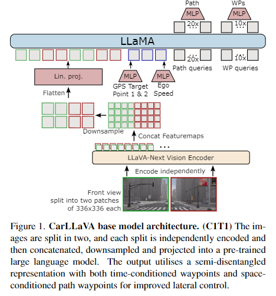
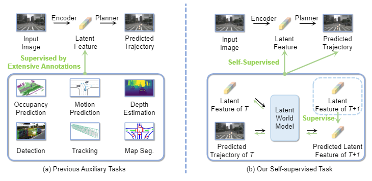

# 闭环论文梳理

##### Think Twice before Driving:
CVPR 2023.

动机：当前端到端Encoder和Decoder量级不匹配，"头重脚轻"。

解决方案: 将规划模块由原来的单一MLP或者GRU替换为类似DETR多层解耦格式的解码器。

对比方法：Transfuser 2022, LAV 2022, TCP 2022, Interfuser 2023

测试BenchMark：（CARLA）Town05 Long，Longest6

##### LMDrive:
CVPR 2024.

动机：为当前的端到端自动驾驶模型注入大语言模型的先验知识。

解决方案: 将对当前驾驶场景的描述语句输入到大语言模型中，将得到的token和视觉token结合并输入到规划模型中。

对比方法: 由于结合了大预言模型，故没有对比的方法

测试BenchMark：(Carla) LangAuto 个人制作

##### Euro NCAP
NIPS 2024

动机：当前的闭环模拟仿真器难以仿真出真实世界的高清数据，构建了一个新的闭环模拟器，参考NuPlan。场景设计来自于欧洲车辆测试标准，并完全针对于极端驾驶场景中的碰撞场景

解决方案: 首先，在给定自我车辆的状态和相机校准的情况下渲染高质量的相机输入。渲染器由驾驶车辆的日志构建。其次，端到端规划器在给定渲染的相机输入和自我车辆状态的情况下预测未来的自我车辆轨迹。第三，控制器将计划的轨迹转换为一组控制输入。第四，车辆模型在给定控制输入的情况下及时向前传播自我状态

对比方法: UniAD, VAD

证明的结果: 当前的端到端方法在面对，容易发生碰撞的场景中，甚至不如之前的rule-based方法。

##### Exploring 3D
NIPS 2024

动机：系统地探究出，端到端模型中各个元素对于最终驾驶性能地影响，例如: 命令、目标点、当前速度、先前速度、障碍物、停车标志和红绿灯。

对比的方法：Transfuser（2022），VAD （2023），ThinkTwice（2023），Interfuser （2022）, DriveAdapter（2023）

测试BenchMark：(Carla) Town05 Long，Town05 short

##### M2DA:
Arxiv 2024

动机：1）有效地整合来自多模态传感器的数据;2)在交通场景中有效地定位和预测关键的危险代理。

解决方案: 利用驾驶员注意力（他人工作）预测图像中人类感兴趣的部分，并转换为图像的掩码来增强对应位置的特征。

对比的方法：Transfuser（2022), Interfuser（2022），DriveAdapter (2023), ThinkTwice(2023)

测试BenchMark：(Carla) Town05 Long and Longest6 （训练集和对比方法不一致）

##### PlanKD:
动机：端到端模型压缩

略

##### CarLLaVA:
arxiv 2024

动机: 将视觉大模型的知识迁移到端到端领域中

对比方法：暂无

测试BenchMark：(Carla) Town05 Long and Longest6

##### EE3D:
arxiv 2024

动机: 训练数据标注困难，例如：大部分数据虽然没有辅助任务的标注，但是具有路径航点的标注，因此作者希望将没有辅助任务标注的数据用于模型的训练，从而增加模型学习的数据量。（作者去除了所有的辅助任务）

解决方案:  训练一个预测模型利用当前T时刻的数据预测T+1时刻的特征令牌，并利用T+1时刻的真实数据进行监督。如果模型预测能力足够优秀，那么即使没有辅助任务的监督。所提取的特征令牌也足够plan任务所使用。

对比方法：Transfuser 2022, LAV 2022, TCP 2022, Interfuser 2023，DriveAdapter （2024），MILE（2022），TCP（2022）。

对比的Benchmark：Town05 Long

> 更新: 2024-12-09 20:50:58  
> 原文: <https://3dcv.yuque.com/org-wiki-3dcv-mm1l0t/ysgfp9/nr79uql51iu5v3uv>