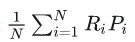
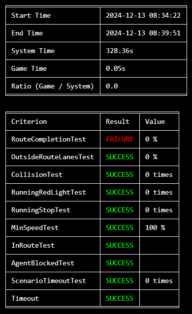

# 闭环评价体系

**（1）Route Completion**

路线完成比率：即为智能体完成的驾驶路线/测评路线总体，因为智能体在一定条件下会中止测评，例如:

```plain
路线偏移 — 智能体偏离指定路线超过 30 m
智能体被停止 — 智能体在180s（仿真时间）内没有采取任何行动会被停止
仿真超时 —在 60 s内不能建立客户端-服务端的通讯
路线超时 — 仿真中路线的用时超过 0.8*route_distance_in_meters s
```

**（2）Route Completion**

<font style="color:rgb(29, 33, 41);">违规分数：</font><font style="color:rgb(25, 27, 31);">将智能体触发的违规次数汇总为一个序列。智能体从一个理想的1.0基本分数开始，每出现一次这些情况就会将分数乘以一个惩罚系数。CARLA排行榜提供了一系列违规行为的个别指标。每种违规行为都有一个惩罚系数，每次发生时都会适用。按严重程度排序，这些违规行为如下:</font>

```plain
和行人碰撞 — 0.50.
和其他汽车相撞 — 0.60.
和静态物体相撞 — 0.65.
闯红灯— 0.70.
在有停止站牌的情况下前行 — 0.80.
```

**（3）****<font style="color:rgb(25, 27, 31);">Driving score</font>**

<font style="color:rgb(25, 27, 31);">驾驶分数: 由第一项和第二项联合组成:</font>

其中, <font style="color:rgb(25, 27, 31);">作为平均路线完成图和交通违章数量的总和，其中 N 表示路线的数量， Ri 表示第i条路线完成的百分比， Pi 表示第i条路线的平均碰撞惩罚。</font>

<font style="color:rgb(25, 27, 31);">测试评价截图：</font>



<font style="color:rgb(25, 27, 31);"></font>


> 更新: 2024-12-13 16:49:41  
> 原文: <https://3dcv.yuque.com/org-wiki-3dcv-mm1l0t/ysgfp9/gsaifbakvkl1n3v1>