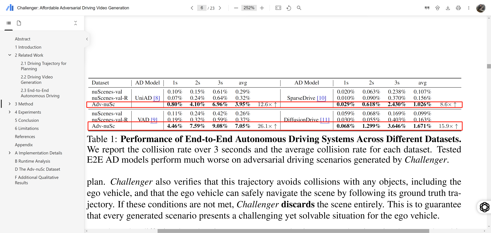
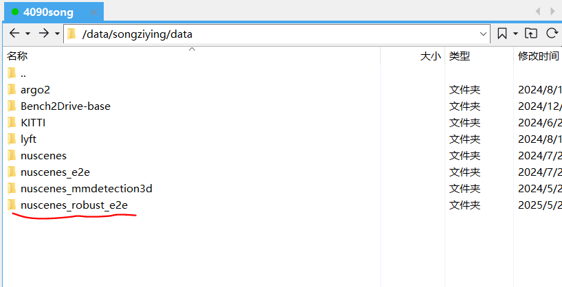
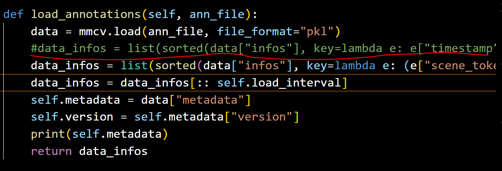
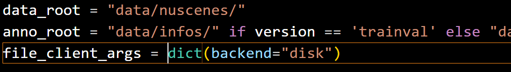
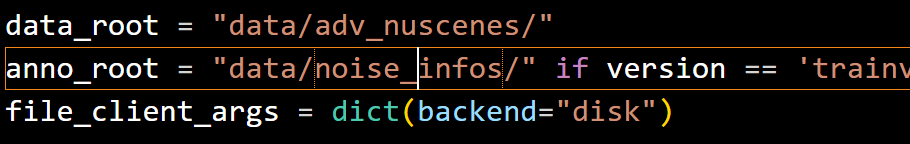

# 4.12碰撞鲁棒数据集复现

数据集来源：[https://arxiv.org/pdf/2505.15880#page=4.92](https://arxiv.org/pdf/2505.15880#page=4.92) [Challenger: Affordable Adversarial Driving Video Generation]

所测试数据集为Adv-nuSc



### 数据集位置
目前仅在4090上进行复现，如需在其他数据集上复现，请自由拷贝



### 创建软连接
将数据集link到自己的代码文件数据集目录下，

ln -s /data/songziying/data/nuscenes_robust_e2e/advnusc    ./data

随后将自己代码目录下的advnusc数据集，重命名为adv_nuscenes文件夹

### 创建数据集缓存文件
找到SparseDrive/projects/mmdet3d_plugin/datasets/nuscenes_3d_dataset.py文件，找到红线代码并替换为下方代码块的代码



```plain
# data_infos = list(sorted(data['infos'], key=lambda e: e['timestamp']))
data_infos = list(sorted(data["infos"], key=lambda e: (e["scene_token"], e["timestamp"])))
```

执行 sh ./scripts/create_data.sh，注意注释掉create_data.sh原来的代码，替换为

```plain
python tools/data_converter/nuscenes_converter.py nuscenes \
    --root-path ./data/adv_nuscenes \
    --canbus ./data/adv_nuscenes \
    --out-dir ./data/infos/ \
    --extra-tag nuscenes \
    --version v1.0
```

之后会得到infos文件夹，并将infos文件夹重命名为noise_infos文件夹


### 测试
修改模型的数据集配置文件。SparseDrive/projects/configs/sparsedrive_small_stage2.py

将



替换为




> 更新: 2025-05-25 17:20:38  
> 原文: <https://3dcv.yuque.com/org-wiki-3dcv-mm1l0t/ysgfp9/yb0brlvpc3pkqygm>