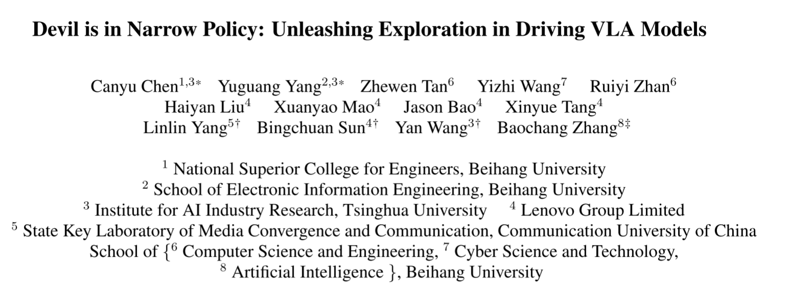
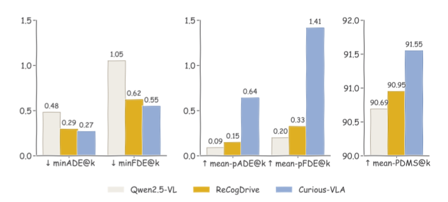

# 01 Devil is in Narrow Policy: Unleashing Exploration in Driving VLA Models

+ **论文链接**：[https://arxiv.org/pdf/2603.06049](https://link.zhihu.com/?target=https%3A//arxiv.org/pdf/2603.06049)
+ **代码开源**：[https://github.com/Mashiroln/curious_vla.git](https://link.zhihu.com/?target=https%3A//github.com/Mashiroln/curious_vla.git)

## **1.VLA的概念**
**VLA**通常指 **Vision-Language-Action（视觉-语言-动作）模型**。它是一类近两年在机器人和自动驾驶领域非常热门的 **多模态大模型**。简单理解：

**VLA = 能看 + 能理解语言 + 能做动作 的 AI 模型。**

**图像 + 语言 + 历史信息**

**          ↓**

**        VLA模型**

**          ↓**

**      直接输出驾驶动作**

## 2.论文的关注点
这篇论文主要关注一个问题：

**为什么自动驾驶的 VLA 模型探索能力很差？（正如论文的标题Narrow Policy-- 狭窄策略  ）**

意思是：

**模型只会做一种驾驶方式，不会探索其他合理的驾驶行为。  
**例如一个路口可以左转右转和直行，模型训练后只会过度偏向gt，预测一种轨迹

论文的实验发现：

+ **轨迹 ****多样性很低**
+ **轨迹 质量也不高**

**  
**这会带来问题：**  
****自动驾驶不够灵活**

**强化学习阶段无法继续提升性能  **

## **3.论文的动机**
 现在很多 VLA 自动驾驶模型的训练流程是：  

**第一阶段：模仿学习（IL）**

**第二阶段：强化学习（RL）**

 论文发现问题出在这里。  

**问题1：模仿学习太“死板”  （模型往往只学到正确答案之一）**

**问题2：强化学习无法探索  **

强化学习需要：不同策略+不同轨迹+不同结果

而IL学到唯一轨迹导致奖励几乎一样，梯度几乎为0，RL效果很差，学不动！

论文称这种现象为：

**Exploration Collapse（探索崩溃）**

所以作者的动机是：

**让 VLA 模型学会探索多种驾驶策略。**

**同一时期的相关工作：**

（1）VLA 分成两类 ： VLA-Planner（planner-based）与 VLA-Token（token-based），二者现有方法架构不同，但本质上都在做同一件事：让 VLA 学会驾驶规划  。但它们都容易受到 Narrow Policy 的影响，本质原因是 explore-exploit（利用-探索）失衡，尤其是缺少多样性。  

（2）大模型强化学习 ： 在通用 LLM/VLM 强化学习里，大家已经开始重视 **优势估计、稳定性、探索、多样性、curiosity** 这些问题。但 **VLA 中的 RL 探索仍然受限**，奖励机制也还需要改进。  

## 4.论文的方法
论文提出一个框架：

**Curious-VLA**

核心思想：

**增加探索能力**

它主要做了两件事：

**1 训练数据更丰富（IL阶段）  
****2 强化学习更鼓励探索（RL阶段）**

### **方法1：Feasible Trajectory Expansion（FTE）  **
一张图 → 一条GT轨迹      变成      一张图 → 多条可行轨迹

实际上：GT轨迹+ 生成轨迹1+ 生成轨迹2+ 生成轨迹3

论文用 diffusion planner 生成这些轨迹。  

### 方法2：Chain-of-Thought驾驶推理  
推理步骤：

1 识别关键物体  
2 解释当前交通情况  
3 选择驾驶行为  
4 预测轨迹

例如：

看到红灯  
→ 前方有车  
→ 减速  
→ 停车轨迹

### 方法3：Step-wise Normalization  
预测未来轨迹时：  远距离误差 >> 近距离误差（对误差的贡献度不一致）

导致模型更关注远处，而忽略：转向精度  
作者对每个时间步进行单独归一化，让训练更加稳定

### 方法4：Diversity-Aware RL  
 在强化学习阶段，论文做了两件事：  

**1. ADAS（多样性采样） ** 

只选择产生不同轨迹的场景来训练

对模型总是产生同一条轨迹的场景选择丢弃

**2.SDR（新的奖励函数）**

重新设计奖励函数让奖励差距变大

## 5.论文的结果
Navsim自动驾驶基准测试+nuScenes基准进行开环评估+勘探分析
得到：**自动驾驶综合评分提升，探索水平提升**

这篇论文的核心贡献是：

发现自动驾驶 VLA 模型存在 **Narrow Policy（只会一种驾驶策略）的问题**，并提出 **Curious-VLA** 通过 **数据扩展 + 多样性强化学习** 提升模型的探索能力。

> 更新: 2026-03-13 17:30:38  
> 原文: <https://3dcv.yuque.com/org-wiki-3dcv-mm1l0t/ysgfp9/tr3zws9o7nywb94m>
