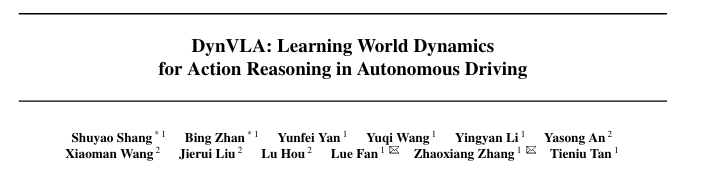
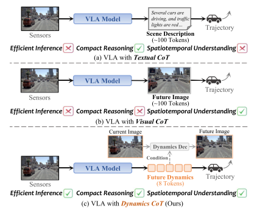
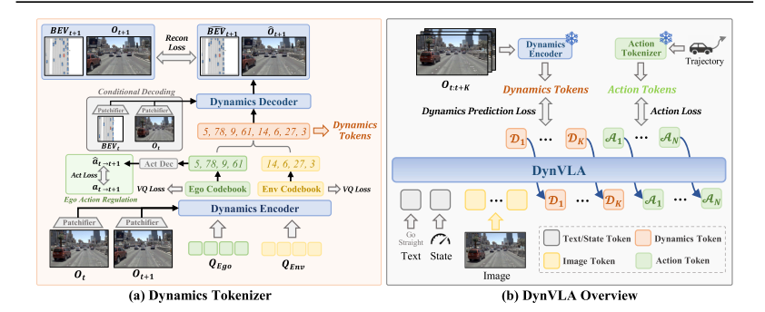
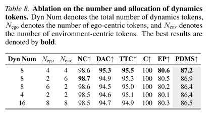

# 02 DynVLA: Learning World Dynamics for Action Reasoning in Autonomous Driving

论文链接：[https://arxiv.org/abs/2603.11041v1](https://arxiv.org/abs/2603.11041v1)

## 1.论文的关注点
这篇论文关注的是一个核心问题：

**自动驾驶模型在做决策之前，应该如何“思考未来”？**

 目前主流方法有两种“思考方式”，但都有问题：  

### 1 文本思考（Textual CoT）
模型先用语言解释：

“前方有红灯，所以应该减速”

问题：

+ 语言 **不擅长表达空间和时间关系**
+ 对驾驶场景不够精确

### 2 图像思考（Visual CoT）
模型先生成未来画面：

预测未来几帧视频

问题：

+ 生成图片 **非常耗算力**
+ 很多无用细节（天空、树、纹理）

## 2.论文的动机
作者提出一个很重要的想法：

**驾驶决策真正需要的不是图像或语言，而是“动态变化”。**

例如：

自动驾驶真正关心的是：

+ 谁在移动
+ 谁会停
+ 谁会变道
+ 自己的车在怎么运动

而不是：

+ 树长什么样
+ 天空什么颜色

因此作者认为：

**只需要预测“世界的动态变化”就够了**

于是提出一种新的推理方式：

**Dynamics Chain-of-Thought**

**相关的工作：  
**端到端的工作证明VL模型和cot适合驾驶任务**  
**基于VLA的自动驾驶有文本思考和图像思考，各有缺点，所以提出**Dynamics Chain-of-Thought**

## **3.论文的方法**
### 方法1：Dynamics Tokenizer（动态编码器）  
 作者把未来动态压缩成几个小 token。   论文只用 **8个token** 表示未来动态  

### 方法2： 把动态拆成两部分  
 驾驶动态分成：   自车动态（ego） 和 环境动态（env）  ， 模型分别学习  。

### 方法3：先预测动态，再生成动作  
模型训练时学习这种顺序：  

输入：图像 + 指令

输出：Dynamics Tokens→→→Action Tokens

通过Dynamics Tokenizer生成标签供DynVLA去学习预测

## 4.论文的结果
主要结论：

**DynVLA比之前方法更好、更快、更安全。**

** NAVSIM数据集  --- 动态推理能明显提高驾驶质量  **

** Bench2Drive  --- 复杂驾驶任务也更好**

** 推理速度  --- 动态推理又快又准  **

### ** 这篇论文提出：自动驾驶应该预测“未来动态”，而不是生成文字或图像。  **

## 5.几个有意思的问题
### 为什么要分 ego / env dynamics  ？
不拆分会出现“物理歧义”：如模型看到前车变远？是自车减速还是前车加速呢？

拆分后更符合驾驶决策 ：预测or控制更好区分

避免 tokenizer collapse

### 为什么只用 8 个 token 就够了 ？
实验发现8个token最好，token多了冗余，少了信息不完全。

> 更新: 2026-03-13 20:39:39  
> 原文: <https://3dcv.yuque.com/org-wiki-3dcv-mm1l0t/ysgfp9/lxlqpzwiwoh2eou6>