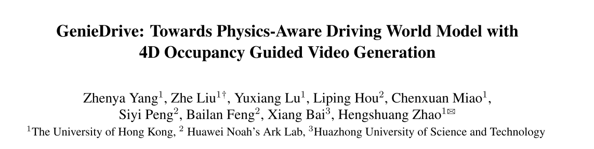
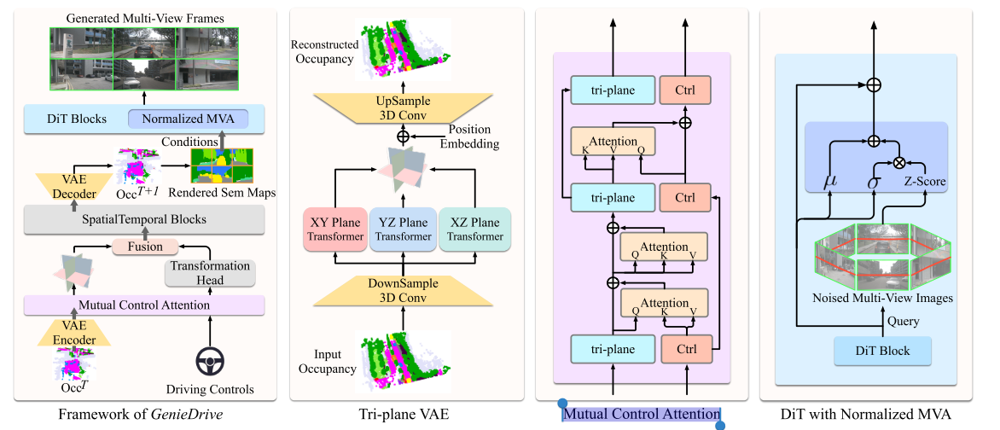

# 03 GenieDrive: Towards Physics-Aware Driving World Model with 4D Occupancy Guided Video Generatio

论文链接：[https://arxiv.org/abs/2512.12751](https://arxiv.org/abs/2512.12751)

## 1.论文的关注点
给定当前的自动驾驶场景 + 驾驶操作（比如左转、右转），AI能不能预测未来并生成合理的视频？  

现有方法通常是：

驾驶控制 → 扩散模型 → 视频

这种方式的问题：   

**黑盒** ： 模型只是在模仿数据，没有理解物理结构。  

**数据偏差严重**： 例如很多数据都是直行，所以模型更容易生成直行。  

**没有3D结构理解**  

## 2.论文的动机
同时期工作：

### **（1）直接生成驾驶视频 **
比如 Vista、Epona，以及一些多视角驾驶视频生成方法。论文认为它们大多是： 输入控制条件，直接输出视频。  

**问题1：它太“黑盒”了 **

模型学的是：

+ **什么控制经常对应什么画面**
+ **什么视频模式最常见、**

 所以一旦数据里“直行”特别多，模型就容易学偏。  

### （2） 做 occupancy world model  
另一类是预测未来 occupancy，也就是预测未来3D占据空间。像 OccWorld、DOME、COME、I2-World 这些，重点是：

+ 预测未来场景的3D结构
+ 强调物理一致性和时序预测能力 

这类方法比“直接出视频”更接近物理世界

**问题2： 它们通常只停在 occupancy 预测  **

** 这类方法的物理性强，但视觉生成能力不够完整。  **

## 3.论文的方法

第一步：预测4D Occupancy（ 一个3D世界随时间变化  ）

第二步：用 Occupancy 生成视频  

###  方法1： Tri-plane VAE（压缩3D场景）  
4D occupancy非常大  

论文用：

**Tri-plane VAE，**把3D数据压缩成XY，XZ，YZ三个平面

优点：

+ 保留3D信息
+ 数据量减少

### 方法2： Mutual Control Attention（控制建模）  
 让控制信息和场景表示互相注意

 这样模型能理解：  动作如何影响未来

### 方法3： Multi-View Attention（多摄像头视频）  
 普通视频生成模型：   只生成 **单视角**

** Multi-View Attention   让不同摄像头之间：  共享信息**

** 同一辆车在不同视角一致。  **

## **4.论文的结果**
 Occupancy预测效果 （ mIoU  ） ： 小模型 + 高性能  

 视频生成效果  （ FVD  ）： 视频更真实  

 控制能力  （对比试验）： 模型真正理解了控制  

这篇论文做的事情其实可以理解为：

**先预测未来3D世界，再把这个世界拍成视频。**

> 更新: 2026-03-14 17:23:51  
> 原文: <https://3dcv.yuque.com/org-wiki-3dcv-mm1l0t/ysgfp9/zll6slsexpkm6guk>