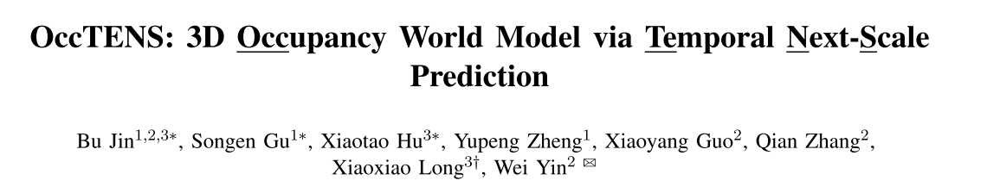
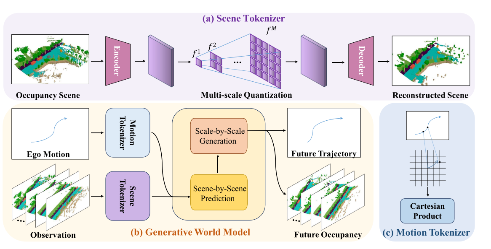

# 04 OccTENS: 3D Occupancy World Model via Temporal Next-Scale Prediction

论文链接：[https://ieeexplore.ieee.org/abstract/document/11358403](https://ieeexplore.ieee.org/abstract/document/11358403)

## 1.论文的关注点
 这篇论文主要关注 **自动驾驶中的“世界模型（World Model）”问题**。 ---- 自动驾驶不仅要看到当前环境，还要 **预测未来几秒环境会变成什么样**。  

 为此，研究者使用一种表示方法叫 **3D Occupancy（3D占据表示）**

输入：

+ **历史几帧环境**

**输出：**

+ **未来几秒的 3D场景变化**

## 2.论文的动机
同时期论文分为两类：

### 自回归（AR）路线
代表：

+ **OccWorld**
+ **OccLLaMA**
+ **Occ-LLM**

这类方法的想法是：

把未来 occupancy 当成 token 序列，一个一个往后生成。

缺点：

+ **长时间生成会退化**
+ **token 越积越多，推理慢**
+ **可控性不足，尤其是很难稳定地按给定 pose / trajectory 来生成**。

###  扩散（Diffusion）路线  
代表：

+ **OccSora**
+ **Dome**

这类方法更像“逐步去噪生成未来 occupancy”。

 它们通常依赖未来轨迹这类条件输入，所以更像“给定未来路径后生成场景”，不太适合真正的下游 motion planning。  

作者希望设计一个模型：

既能

+ **高质量预测未来3D场景**
+ **长时间预测稳定**
+ **速度快**
+ **可以控制车辆轨迹**

## 3.论文的方法
** OccTENS    
**

### 方法1：Scene Tokenizer（场景编码）
 把3D场景变成“token”   

 Occupancy Scene（输入）  ： 当前自动驾驶看到的3D环境  

 Encoder（编码器）  ： 把复杂3D场景压缩成一个特征图  

 Multi-scale Quantization（多尺度量化）  ：  
粗尺度 token  →  描述整体结构

细尺度 token  →  描述细节

 Decoder（解码器）  ： 验证 token 是否能还原场景  

### 方法2： Motion Tokenizer（运动编码）  
 把 **车辆运动信息变成token**。  ego motion→token

### 方法3： TENSFormer（核心模型）  
 OccTENS的核心  ：**Generative World Model**

**根据历史 → 预测未来世界**

** 输入：  过去几帧场景+ 车辆运动**

** 输出：  未来 occupancy+ 未来轨迹**

** 这里有两个关键模块。  **

#### **01  Scene-by-Scene Prediction（时间预测）  ： 时间序列建模  **
#### 02 Scale-by-Scale Generation（尺度生成）  ： 在同一帧内部生成细节。  粗结构→细节

## 4.论文的结果
实验主要在：

**nuScenes 自动驾驶数据集**

** Occupancy预测结果  -- 预测更准确  **

** 长时间预测效果  --**

+ **场景更真实**
+ **长时间稳定**

** 运动规划  -- 同时理解环境 + 规划路径  **

** 推理效率  --fast**

> 更新: 2026-03-14 19:55:51  
> 原文: <https://3dcv.yuque.com/org-wiki-3dcv-mm1l0t/ysgfp9/lq726b9gxltzoiuf>