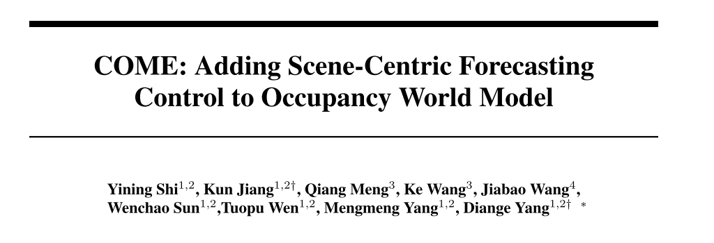
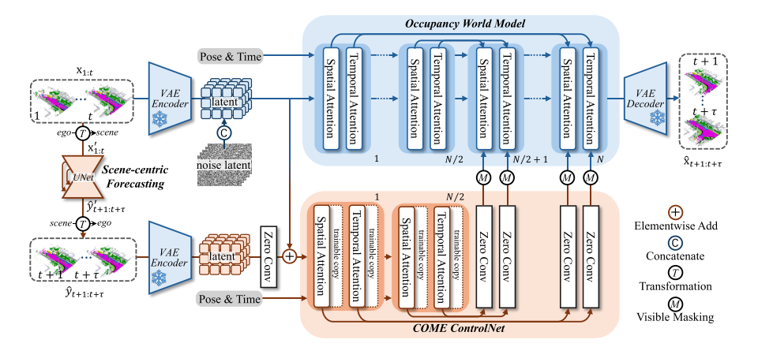

# 05 COME: Adding Scene-Centric Forecasting Control to Occupancy World Model

论文链接：[https://arxiv.org/abs/2506.13260](https://arxiv.org/abs/2506.13260)

代码和视频：[https://github.com/synsin0/COME.](https://github.com/synsin0/COME.)

## 1.论文的关注点
这篇论文属于 **自动驾驶中的“世界模型（World Model）”研究**。  

什么是世界模型（World Model） ？

根据当前环境 → 预测未来环境  

论文中主要预测的是 **3D Occupancy（占据网格）**： 未来几秒内，空间中每个位置会不会被占据  

论文发现一个核心问题：

世界模型的预测会混淆两件事情：

**① 自车运动（ego motion）**  
比如车向前开，视角变了。

**② 场景变化（scene evolution）**

** 大多数模型把这两个变化混在一起学习。  **

结果是：

**预测出来的场景 ****不稳定、不一致****。**

**论文举了一个例子：**

**如果用 ego 视角预测：**

**预测准确率 ****mIoU = 27.10**

**如果用 ****scene-centric（场景坐标）****：**

**准确率可以到 39.12。 **

**提升 ****44%****。**

**所以作者意识到：**

**必须把 “自车运动” 和 “场景变化” 分开建模**

## 2.论文的动机
与同时期方法相比，COME 不是单纯依靠更大的模型或更多外部信息取胜，而是提出了一个更合理的建模框架：先在 scene-centric 坐标系下预测世界本身的演化，再通过 ControlNet 把这种稳定的场景先验注入 diffusion world model。  
它相对 DOME、OccWorld、UniScene、OccVAR、OccLLaMA、Occ-LLM、DFIT-OccWorld 等方法的主要优势，在于更好地解耦了 ego motion 和 scene evolution，因此在空间一致性、长时预测稳定性以及多种输入配置下的综合性能上更强。

**它比 DOME（baseline） 更强：因为它多了一条“稳定的场景预测支路”**

DOME 已经是很强的 diffusion occupancy world model，但它主要还是靠生成模型自己去学未来。  
COME 在 DOME 这类生成模型之上，额外加了一条：

**scene-centric forecasting branch**

这条支路先预测“世界本身会怎么变化”，再通过 ControlNet 变成控制特征，注入 world model。

## 3.论文的方法
###   
 模块一：Occupancy World Model（蓝色部分）  
输入：

+ 历史 occupancy
+ 自车未来轨迹
+ 时间信息

输出：

未来 occupancy

###  模块二：Scene-centric Forecasting  
它的作用是：

**先预测“世界本身会怎么变化”。**

**历史 occupancy**

**      ↓**

**坐标变换（ego → scene）**

**      ↓**

**UNet**

**      ↓**

**未来 occupancy 预测**

### ** 模块三：COME ControlNet（橙色部分）  **
Scene-centric Forecasting 虽然稳定，

但 **不擅长生成复杂未来**。

把 scene-centric 预测变成“控制信号”，去指导 world model。

###  Visible Mask  
作者发现：

Scene-centric 预测在 **看不到的地方容易错**。

例如：

+ 被遮挡的区域
+ 历史没看到的地方

所以加入 **visible mask**：

**可见区域 → 使用控制信息  
****不可见区域 → 不使用**

这样能避免错误预测影响生成。

## 4.论文的结果
 mIoU  + 对比实验 证明：

+ 场景结构更稳定
+ 预测更一致
+ 物体不会突然消失

## 5.几个有趣的小问题
###  为什么 **COME ControlNet** 只在 **N/2 之后** 才给 **World Model** 提供控制信号，而不是一开始就控制？  
COME ControlNet 只在 World Model 的后半部分（N/2 之后）提供控制信号，因为前半部分主要负责提取基础特征，而后半部分负责生成最终结果。  
这种设计既可以保留原始 world model 的生成能力，又可以利用 scene-centric 预测提供的结构信息来指导最终生成。  

###  什么是 UNet？  
UNet 是一种常见的神经网络结构。

特点是：

+ 能看到整体结构
+ 同时保留细节

特别适合：

+ 图像分割
+ 场景预测

论文发现：

在 scene-centric 坐标系下，

**简单 UNet 就能做得很好。**

****

> 更新: 2026-03-15 20:46:40  
> 原文: <https://3dcv.yuque.com/org-wiki-3dcv-mm1l0t/ysgfp9/eecorx7mencf6vtm>