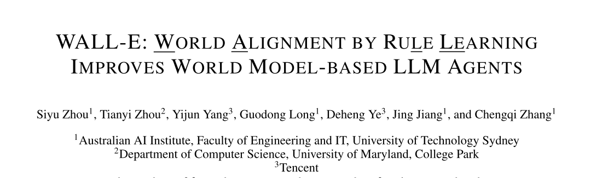
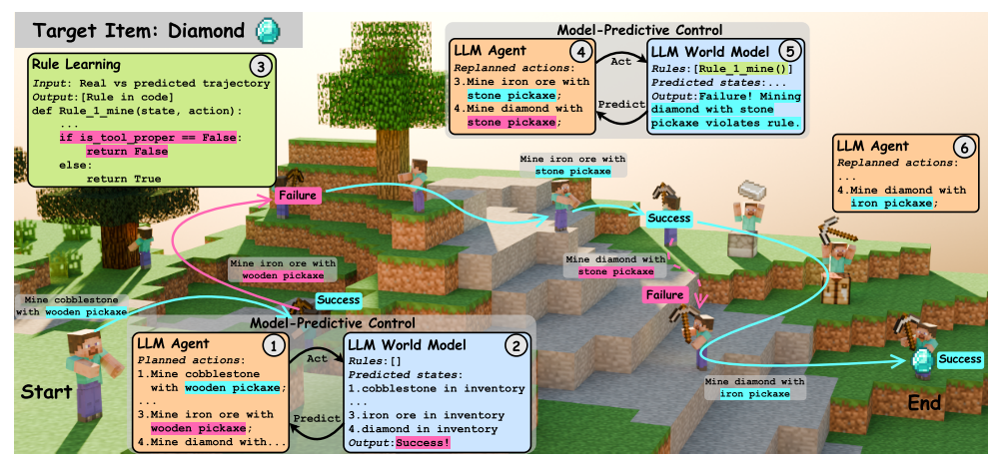
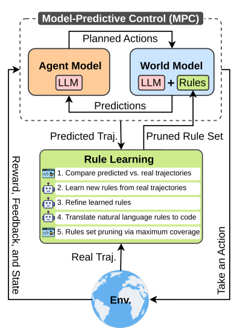

# 06 WALL-E: WORLD ALIGNMENT BY RULE LEARNING IMPROVES WORLD MODEL-BASED LLM

论文链接：[https://arxiv.org/pdf/2410.07484](https://arxiv.org/pdf/2410.07484)

项目链接：[https://github.com/elated-sawyer/WALL-E](https://github.com/elated-sawyer/WALL-E)

## 1.论文的关注点
 大语言模型（LLM）能不能作为“世界模型（world model）”，帮助智能体在复杂环境里做决策？  

在 **Minecraft** 里挖钻石：  

正确流程是：  

木镐 → 挖石头 → 做石镐

石镐 → 挖铁矿 → 做铁镐

铁镐 → 挖钻石

但如果 LLM 不知道这个规则，可能会做出错误计划：  

木镐 → 挖铁矿 → 挖钻石

这种问题叫：

**LLM 与环境动态不一致（world misalignment）**

所以论文关注的核心问题是：

**如何让 LLM 学会环境的真实规则？**

## 2.论文的动机
作者发现现在的 LLM Agent 有几个明显问题：

### 1 LLM不了解具体环境规则
LLM训练数据来自互联网，不是 Minecraft 的真实规则。

### 2 现有方法很低效
现在常见方法：

#### 方法1：强化学习微调
问题：

+ 训练成本高
+ 需要大量数据

#### 方法2：把历史轨迹放进prompt
问题：

+ token成本高
+ 上下文很长
+ 推理慢

### 3 许多LLM Agent没有“世界模型”
因此作者提出一个核心想法：

**只要补充少量规则，就可以让LLM理解环境。**

**通过自动学习规则，让LLM对环境“对齐”（world alignment）  
****从而成为更好的世界模型。  **

## 3.论文的方法

论文提出一个系统：

**WALL-E**

### **方法核心一：Model Predictive Control（MPC）**
**论文用 MPC 做规划。**

**预测未来**

**→ 评估奖励**

**→ 选择最好动作**

### **方法核心二：规则学习（Rule Learning）  **
 第一步：比较真实轨迹 vs 预测轨迹  

 第二步：LLM自动生成规则  

 第三步：规则优化  

 第四步：规则转成代码  

 第五步：规则筛选（最大覆盖）  

## 4.论文的结果
论文在两个环境测试：

Minecraft  
ALFWorld

论文证明：

LLM可以做世界模型  
但必须进行 **world alignment**  
只需要 **少量规则** 就能对齐  
LLM+规则效果最好

最终结论：

通过规则学习对齐环境，可以显著提升LLM Agent的规划能力。

## 5.论文的辩证看法
这篇论文不是传统的world model

这里的world model看起来更像LLM+rule

> 更新: 2026-03-15 21:30:01  
> 原文: <https://3dcv.yuque.com/org-wiki-3dcv-mm1l0t/ysgfp9/rrgsbnzofkqwg42t>