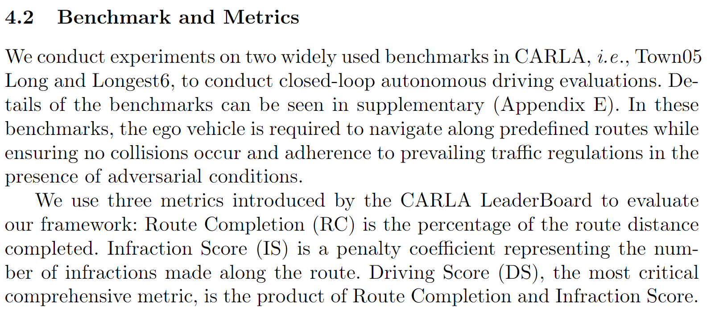

# 4.2 数据集

**闭环数据集**  
由于CARAL 生成环境问题，直接收集了相关数据集，也可以自己生成。  
CARLA【Town05 Long and Longest6】  
适用方法[https://github.com/opendilab/InterFuser](https://github.com/opendilab/InterFuser)  
  
数据集链接如下：

链接：[https://pan.baidu.com/s/1NOBprxMyOMBhDmxAVTSx0Q?pwd=wk3c](https://pan.baidu.com/s/1NOBprxMyOMBhDmxAVTSx0Q?pwd=wk3c) 

提取码：wk3c 

> 更新: 2024-07-15 15:48:42  
> 原文: <https://3dcv.yuque.com/org-wiki-3dcv-mm1l0t/ysgfp9/guvhr6aicp6ng1o5>