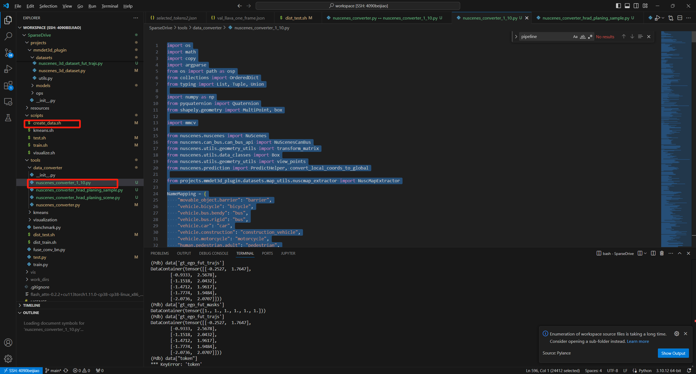
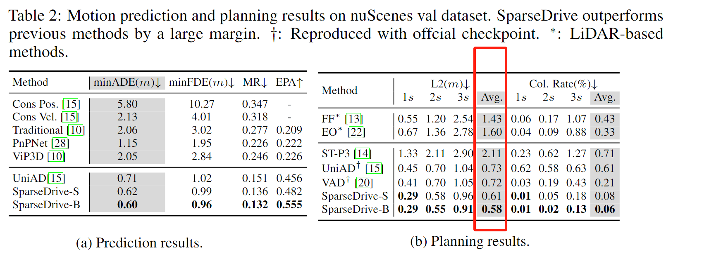
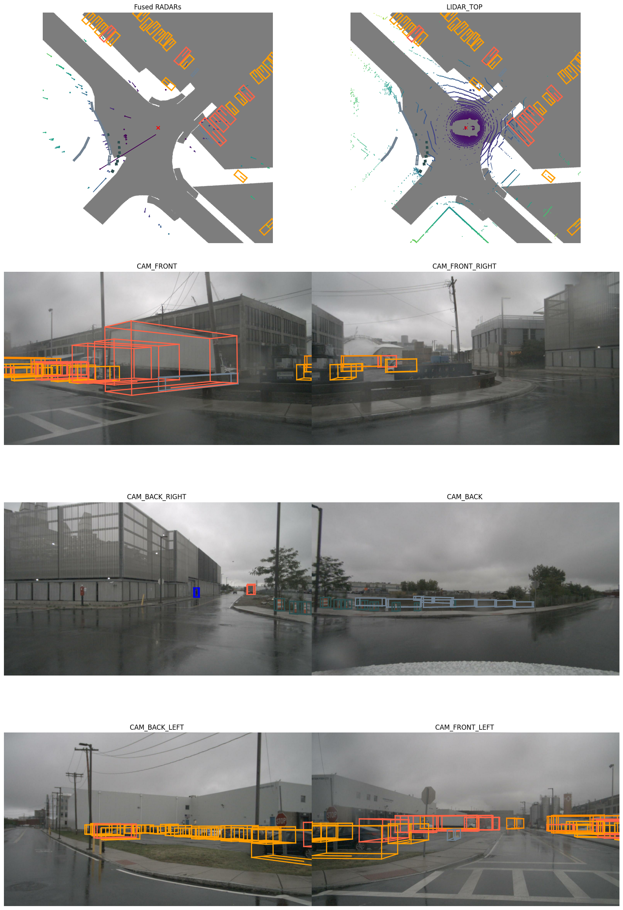
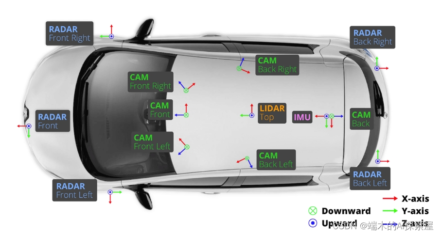
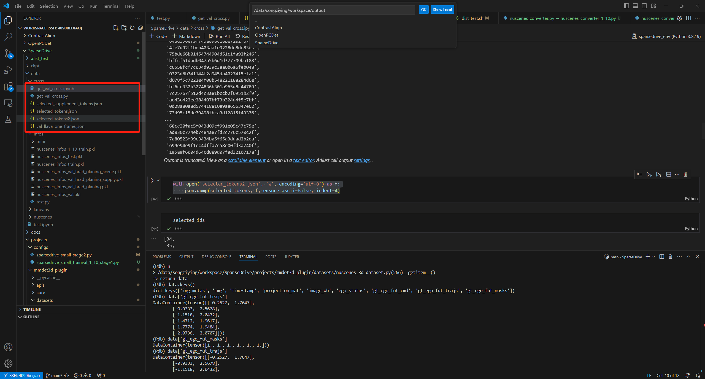

# 4.3SparseDrive（端到端）

## **1.数据集处理**
### **1.1train数据集划分（宋子盈）**
目的：数据集的划分，按照场景划分小规模数据集，<font style="color:#DF2A3F;">快速训练</font>

涉及以下俩个脚本  
nuscenes_converter_1_10.py  
create_data.sh




create_data.sh修改为以下

```plain
export PYTHONPATH="$(dirname $0)/..":$PYTHONPATH

# python tools/data_converter/nuscenes_converter.py nuscenes \
#     --root-path ./data/nuscenes \
#     --canbus ./data/nuscenes \
#     --out-dir ./data/infos/ \
#     --extra-tag nuscenes \
#     --version v1.0-mini

# python tools/data_converter/nuscenes_converter.py nuscenes \
#     --root-path ./data/nuscenes \
#     --canbus ./data/nuscenes \
#     --out-dir ./data/infos/ \
#     --extra-tag nuscenes \
#     --version v1.0

python tools/data_converter/nuscenes_converter_hrad_planing_scene.py nuscenes \
    --root-path ./data/nuscenes \
    --canbus ./data/nuscenes \
    --out-dir ./data/infos/ \
    --extra-tag nuscenes \
    --version v1.0
```


nuscenes_converter_1_10.py修改为以下：

```python
import os
import math
import copy
import argparse
from os import path as osp
from collections import OrderedDict
from typing import List, Tuple, Union

import numpy as np
from pyquaternion import Quaternion
from shapely.geometry import MultiPoint, box

import mmcv

from nuscenes.nuscenes import NuScenes
from nuscenes.can_bus.can_bus_api import NuScenesCanBus
from nuscenes.utils.geometry_utils import transform_matrix
from nuscenes.utils.data_classes import Box
from nuscenes.utils.geometry_utils import view_points
from nuscenes.prediction import PredictHelper, convert_local_coords_to_global

from projects.mmdet3d_plugin.datasets.map_utils.nuscmap_extractor import NuscMapExtractor

NameMapping = {
    "movable_object.barrier": "barrier",
    "vehicle.bicycle": "bicycle",
    "vehicle.bus.bendy": "bus",
    "vehicle.bus.rigid": "bus",
    "vehicle.car": "car",
    "vehicle.construction": "construction_vehicle",
    "vehicle.motorcycle": "motorcycle",
    "human.pedestrian.adult": "pedestrian",
    "human.pedestrian.child": "pedestrian",
    "human.pedestrian.construction_worker": "pedestrian",
    "human.pedestrian.police_officer": "pedestrian",
    "movable_object.trafficcone": "traffic_cone",
    "vehicle.trailer": "trailer",
    "vehicle.truck": "truck",
}

def quart_to_rpy(qua):
    x, y, z, w = qua
    roll = math.atan2(2 * (w * x + y * z), 1 - 2 * (x * x + y * y))
    pitch = math.asin(2 * (w * y - x * z))
    yaw = math.atan2(2 * (w * z + x * y), 1 - 2 * (z * z + y * y))
    return roll, pitch, yaw

def locate_message(utimes, utime):
    i = np.searchsorted(utimes, utime)
    if i == len(utimes) or (i > 0 and utime - utimes[i-1] < utimes[i] - utime):
        i -= 1
    return i

def geom2anno(map_geoms):
    MAP_CLASSES = (
        'ped_crossing',
        'divider',
        'boundary',
    )
    vectors = {}
    for cls, geom_list in map_geoms.items():
        if cls in MAP_CLASSES:
            label = MAP_CLASSES.index(cls)
            vectors[label] = []
            for geom in geom_list:
                line = np.array(geom.coords)
                vectors[label].append(line)
    return vectors

def create_nuscenes_infos(root_path,
                          out_path,
                          can_bus_root_path,
                          info_prefix,
                          version='v1.0-trainval',
                          max_sweeps=10,
                          roi_size=(30, 60),):
    """Create info file of nuscene dataset.

    Given the raw data, generate its related info file in pkl format.

    Args:
        root_path (str): Path of the data root.
        info_prefix (str): Prefix of the info file to be generated.
        version (str): Version of the data.
            Default: 'v1.0-trainval'
        max_sweeps (int): Max number of sweeps.
            Default: 10
    """
    print(version, root_path)
    nusc = NuScenes(version=version, dataroot=root_path, verbose=True)
    nusc_map_extractor = NuscMapExtractor(root_path, roi_size)
    nusc_can_bus = NuScenesCanBus(dataroot=can_bus_root_path)
    from nuscenes.utils import splits
    available_vers = ['v1.0-trainval', 'v1.0-test', 'v1.0-mini']
    assert version in available_vers
    if version == 'v1.0-trainval':
        train_scenes = splits.train
       
        import random
        random.shuffle(train_scenes)
        train_scenes = train_scenes[:int(len(train_scenes)*0.1)] # 0.2 为 1/5；0.5为 1/2 以此类推
    
        val_scenes = splits.val
    elif version == 'v1.0-test':
        train_scenes = splits.test
        val_scenes = []
    elif version == 'v1.0-mini':
        train_scenes = splits.mini_train
        val_scenes = splits.mini_val
        out_path = osp.join(out_path, 'mini')
    else:
        raise ValueError('unknown')
    os.makedirs(out_path, exist_ok=True)

    # filter existing scenes.
    available_scenes = get_available_scenes(nusc)
    available_scene_names = [s['name'] for s in available_scenes]
    train_scenes = list(
        filter(lambda x: x in available_scene_names, train_scenes))
    val_scenes = list(filter(lambda x: x in available_scene_names, val_scenes))
    train_scenes = set([
        available_scenes[available_scene_names.index(s)]['token']
        for s in train_scenes
    ])
    val_scenes = set([
        available_scenes[available_scene_names.index(s)]['token']
        for s in val_scenes
    ])
    # import pdb; pdb.set_trace()
    test = 'test' in version
    if test:
        print('test scene: {}'.format(len(train_scenes)))
    else:
        print('train scene: {}, val scene: {}'.format(
            len(train_scenes), len(val_scenes)))

    train_nusc_infos, val_nusc_infos = _fill_trainval_infos(
        nusc, nusc_map_extractor, nusc_can_bus, train_scenes, val_scenes, test, max_sweeps=max_sweeps)

    metadata = dict(version=version)
    if test:
        pass
        # print('test sample: {}'.format(len(train_nusc_infos)))
        # data = dict(infos=train_nusc_infos, metadata=metadata)
        # info_path = osp.join(out_path,
        #                      '{}_infos_test.pkl'.format(info_prefix))
        # mmcv.dump(data, info_path)
    else:
        print('train sample: {}, val sample: {}'.format(
            len(train_nusc_infos), len(val_nusc_infos)))
        data = dict(infos=train_nusc_infos, metadata=metadata)
        info_path = osp.join(out_path,
                             '{}_infos_1_10_train.pkl'.format(info_prefix))
        mmcv.dump(data, info_path)
        # data['infos'] = val_nusc_infos
        # info_val_path = osp.join(out_path,
        #                          '{}_infos_val.pkl'.format(info_prefix))
        # mmcv.dump(data, info_val_path)

def get_available_scenes(nusc):
    """Get available scenes from the input nuscenes class.

    Given the raw data, get the information of available scenes for
    further info generation.

    Args:
        nusc (class): Dataset class in the nuScenes dataset.

    Returns:
        available_scenes (list[dict]): List of basic information for the
            available scenes.
    """
    available_scenes = []
    print('total scene num: {}'.format(len(nusc.scene)))
    for scene in nusc.scene:
        scene_token = scene['token']
        scene_rec = nusc.get('scene', scene_token)
        sample_rec = nusc.get('sample', scene_rec['first_sample_token'])
        sd_rec = nusc.get('sample_data', sample_rec['data']['LIDAR_TOP'])
        has_more_frames = True
        scene_not_exist = False
        while has_more_frames:
            lidar_path, boxes, _ = nusc.get_sample_data(sd_rec['token'])
            lidar_path = str(lidar_path)
            if os.getcwd() in lidar_path:
                # path from lyftdataset is absolute path
                lidar_path = lidar_path.split(f'{os.getcwd()}/')[-1]
                # relative path
            if not mmcv.is_filepath(lidar_path):
                scene_not_exist = True
                break
            else:
                break
        if scene_not_exist:
            continue
        available_scenes.append(scene)
    print('exist scene num: {}'.format(len(available_scenes)))
    return available_scenes

def _fill_trainval_infos(nusc,
                         nusc_map_extractor,
                         nusc_can_bus,
                         train_scenes,
                         val_scenes,
                         test=False,
                         max_sweeps=10,
                         fut_ts=12,
                         ego_fut_ts=6):
    """Generate the train/val infos from the raw data.

    Args:
        nusc (:obj:`NuScenes`): Dataset class in the nuScenes dataset.
        train_scenes (list[str]): Basic information of training scenes.
        val_scenes (list[str]): Basic information of validation scenes.
        test (bool): Whether use the test mode. In the test mode, no
            annotations can be accessed. Default: False.
        max_sweeps (int): Max number of sweeps. Default: 10.

    Returns:
        tuple[list[dict]]: Information of training set and validation set
            that will be saved to the info file.
    """
    train_nusc_infos = []
    val_nusc_infos = []
    cat2idx = {}
    for idx, dic in enumerate(nusc.category):
        cat2idx[dic['name']] = idx
    # import pdb; pdb.set_trace()
    predict_helper = PredictHelper(nusc)
    trainval_samples=[]
    for sample in mmcv.track_iter_progress(nusc.sample):
        if sample['scene_token'] in train_scenes:
            trainval_samples.append(sample)
    # import pdb; pdb.set_trace()
    for sample in mmcv.track_iter_progress(trainval_samples):
        
        map_location = nusc.get('log', nusc.get('scene', sample['scene_token'])['log_token'])['location']
        lidar_token = sample['data']['LIDAR_TOP']
        sd_rec = nusc.get('sample_data', lidar_token)
        cs_record = nusc.get('calibrated_sensor',
                             sd_rec['calibrated_sensor_token'])
        pose_record = nusc.get('ego_pose', sd_rec['ego_pose_token'])
        lidar_path, boxes, _ = nusc.get_sample_data(lidar_token)
        mmcv.check_file_exist(lidar_path)

        info = {
            'lidar_path': lidar_path,
            'token': sample['token'],
            'sweeps': [],
            'cams': dict(),
            'scene_token': sample['scene_token'],
            'lidar2ego_translation': cs_record['translation'],
            'lidar2ego_rotation': cs_record['rotation'],
            'ego2global_translation': pose_record['translation'],
            'ego2global_rotation': pose_record['rotation'],
            'timestamp': sample['timestamp'],
            'map_location': map_location,
        }

        l2e_r = info['lidar2ego_rotation']
        l2e_t = info['lidar2ego_translation']
        e2g_r = info['ego2global_rotation']
        e2g_t = info['ego2global_translation']
        l2e_r_mat = Quaternion(l2e_r).rotation_matrix
        e2g_r_mat = Quaternion(e2g_r).rotation_matrix

        # extract map annos
        lidar2ego = np.eye(4)
        lidar2ego[:3, :3] = Quaternion(
            info["lidar2ego_rotation"]
        ).rotation_matrix
        lidar2ego[:3, 3] = np.array(info["lidar2ego_translation"])
        ego2global = np.eye(4)
        ego2global[:3, :3] = Quaternion(
            info["ego2global_rotation"]
        ).rotation_matrix
        ego2global[:3, 3] = np.array(info["ego2global_translation"])
        lidar2global = ego2global @ lidar2ego

        translation = list(lidar2global[:3, 3])
        rotation = list(Quaternion(matrix=lidar2global).q)
        map_geoms = nusc_map_extractor.get_map_geom(map_location, translation, rotation)
        map_annos = geom2anno(map_geoms)
        info['map_annos'] = map_annos

        # obtain 6 image's information per frame
        camera_types = [
            'CAM_FRONT',
            'CAM_FRONT_RIGHT',
            'CAM_FRONT_LEFT',
            'CAM_BACK',
            'CAM_BACK_LEFT',
            'CAM_BACK_RIGHT',
        ]
        for cam in camera_types:
            cam_token = sample['data'][cam]
            cam_path, _, cam_intrinsic = nusc.get_sample_data(cam_token)
            cam_info = obtain_sensor2top(nusc, cam_token, l2e_t, l2e_r_mat,
                                         e2g_t, e2g_r_mat, cam)
            cam_info.update(cam_intrinsic=cam_intrinsic)
            info['cams'].update({cam: cam_info})

        # obtain sweeps for a single key-frame
        sd_rec = nusc.get('sample_data', sample['data']['LIDAR_TOP'])
        sweeps = []
        while len(sweeps) < max_sweeps:
            if not sd_rec['prev'] == '':
                sweep = obtain_sensor2top(nusc, sd_rec['prev'], l2e_t,
                                          l2e_r_mat, e2g_t, e2g_r_mat, 'lidar')
                sweeps.append(sweep)
                sd_rec = nusc.get('sample_data', sd_rec['prev'])
            else:
                break
        info['sweeps'] = sweeps
        # obtain annotation
        if not test:
            # object detection annos: boxes (locs, dims, yaw, velocity), names and valid flags
            annotations = [
                nusc.get('sample_annotation', token)
                for token in sample['anns']
            ]
            locs = np.array([b.center for b in boxes]).reshape(-1, 3)
            dims = np.array([b.wlh for b in boxes]).reshape(-1, 3)
            rots = np.array([b.orientation.yaw_pitch_roll[0]
                             for b in boxes]).reshape(-1, 1)
            velocity = np.array(
                [nusc.box_velocity(token)[:2] for token in sample['anns']])
            # convert velo from global to lidar
            for i in range(len(boxes)):
                velo = np.array([*velocity[i], 0.0])
                velo = velo @ np.linalg.inv(e2g_r_mat).T @ np.linalg.inv(
                    l2e_r_mat).T
                velocity[i] = velo[:2]
            names = [b.name for b in boxes]
            for i in range(len(names)):
                if names[i] in NameMapping:
                    names[i] = NameMapping[names[i]]
            names = np.array(names)
            valid_flag = np.array(
                [(anno['num_lidar_pts'] + anno['num_radar_pts']) > 0
                 for anno in annotations],
                dtype=bool).reshape(-1)  ## TODO update valid flag for tracking
            # we need to convert box size to
            # the format of our lidar coordinate system
            # which is x_size, y_size, z_size (corresponding to l, w, h)
            gt_boxes = np.concatenate([locs, dims[:, [1, 0, 2]], rots], axis=1)
            assert len(gt_boxes) == len(
                annotations), f'{len(gt_boxes)}, {len(annotations)}'
            
            # object tracking annos: instance_ids
            instance_inds = [nusc.getind('instance', anno['instance_token'])
                             for anno in annotations]

            # motion prediction annos: future trajectories offset in lidar frame and valid mask
            num_box = len(boxes)
            gt_fut_trajs = np.zeros((num_box, fut_ts, 2))
            gt_fut_masks = np.zeros((num_box, fut_ts))
            for i, anno in enumerate(annotations):
                instance_token = anno['instance_token']
                fut_traj_local = predict_helper.get_future_for_agent(
                    instance_token, 
                    sample['token'], 
                    seconds=fut_ts/2, 
                    in_agent_frame=True
                )
                if fut_traj_local.shape[0] > 0:
                    box = boxes[i]
                    trans = box.center
                    rot = Quaternion(matrix=box.rotation_matrix)
                    fut_traj_scene = convert_local_coords_to_global(fut_traj_local, trans, rot)
                    valid_step = fut_traj_scene.shape[0]
                    gt_fut_trajs[i, 0] = fut_traj_scene[0] - box.center[:2]
                    gt_fut_trajs[i, 1:valid_step] = fut_traj_scene[1:] - fut_traj_scene[:-1]
                    gt_fut_masks[i, :valid_step] = 1

            # motion planning annos: future trajectories offset in lidar frame and valid mask
            ego_fut_trajs = np.zeros((ego_fut_ts + 1, 3))
            ego_fut_masks = np.zeros((ego_fut_ts + 1))
            sample_cur = sample
            ego_status = get_ego_status(nusc, nusc_can_bus, sample_cur)
            for i in range(ego_fut_ts + 1):
                pose_mat = get_global_sensor_pose(sample_cur, nusc)
                ego_fut_trajs[i] = pose_mat[:3, 3]
                ego_fut_masks[i] = 1
                if sample_cur['next'] == '':
                    ego_fut_trajs[i+1:] = ego_fut_trajs[i]
                    break
                else:
                    sample_cur = nusc.get('sample', sample_cur['next'])
            # global to ego
            ego_fut_trajs = ego_fut_trajs - np.array(pose_record['translation'])
            rot_mat = Quaternion(pose_record['rotation']).inverse.rotation_matrix
            ego_fut_trajs = np.dot(rot_mat, ego_fut_trajs.T).T
            # ego to lidar
            ego_fut_trajs = ego_fut_trajs - np.array(cs_record['translation'])
            rot_mat = Quaternion(cs_record['rotation']).inverse.rotation_matrix
            ego_fut_trajs = np.dot(rot_mat, ego_fut_trajs.T).T
            # drive command according to final fut step offset
            if ego_fut_trajs[-1][0] >= 2:
                command = np.array([1, 0, 0])  # Turn Right
            elif ego_fut_trajs[-1][0] <= -2:
                command = np.array([0, 1, 0])  # Turn Left
            else:
                command = np.array([0, 0, 1])  # Go Straight
            # get offset
            ego_fut_trajs = ego_fut_trajs[1:] - ego_fut_trajs[:-1]      

            info['gt_boxes'] = gt_boxes
            info['gt_names'] = names
            info['gt_velocity'] = velocity.reshape(-1, 2)
            info['num_lidar_pts'] = np.array(
                [a['num_lidar_pts'] for a in annotations])
            info['num_radar_pts'] = np.array(
                [a['num_radar_pts'] for a in annotations])
            info['valid_flag'] = valid_flag
            info['instance_inds'] = instance_inds
            info['gt_agent_fut_trajs'] = gt_fut_trajs.astype(np.float32)
            info['gt_agent_fut_masks'] = gt_fut_masks.astype(np.float32)
            info['gt_ego_fut_trajs'] = ego_fut_trajs[:, :2].astype(np.float32)
            info['gt_ego_fut_masks'] = ego_fut_masks[1:].astype(np.float32)
            info['gt_ego_fut_cmd'] = command.astype(np.float32)
            info['ego_status'] = ego_status

        if sample['scene_token'] in train_scenes:
            train_nusc_infos.append(info)
        else:
            val_nusc_infos.append(info)

    return train_nusc_infos, val_nusc_infos

def get_ego_status(nusc, nusc_can_bus, sample):
    ego_status = []
    ref_scene = nusc.get("scene", sample['scene_token'])
    try:
        pose_msgs = nusc_can_bus.get_messages(ref_scene['name'],'pose')
        steer_msgs = nusc_can_bus.get_messages(ref_scene['name'], 'steeranglefeedback')
        pose_uts = [msg['utime'] for msg in pose_msgs]
        steer_uts = [msg['utime'] for msg in steer_msgs]
        ref_utime = sample['timestamp']
        pose_index = locate_message(pose_uts, ref_utime)
        pose_data = pose_msgs[pose_index]
        steer_index = locate_message(steer_uts, ref_utime)
        steer_data = steer_msgs[steer_index]
        ego_status.extend(pose_data["accel"]) # acceleration in ego vehicle frame, m/s/s
        ego_status.extend(pose_data["rotation_rate"]) # angular velocity in ego vehicle frame, rad/s
        ego_status.extend(pose_data["vel"]) # velocity in ego vehicle frame, m/s
        ego_status.append(steer_data["value"]) # steering angle, positive: left turn, negative: right turn
    except:
        ego_status = [0] * 10
    
    return np.array(ego_status).astype(np.float32)

def get_global_sensor_pose(rec, nusc):
    lidar_sample_data = nusc.get('sample_data', rec['data']['LIDAR_TOP'])

    pose_record = nusc.get("ego_pose", lidar_sample_data["ego_pose_token"])
    cs_record = nusc.get("calibrated_sensor", lidar_sample_data["calibrated_sensor_token"])

    ego2global = transform_matrix(pose_record["translation"], Quaternion(pose_record["rotation"]), inverse=False)
    sensor2ego = transform_matrix(cs_record["translation"], Quaternion(cs_record["rotation"]), inverse=False)
    pose = ego2global.dot(sensor2ego)

    return pose

def obtain_sensor2top(nusc,
                      sensor_token,
                      l2e_t,
                      l2e_r_mat,
                      e2g_t,
                      e2g_r_mat,
                      sensor_type='lidar'):
    """Obtain the info with RT matric from general sensor to Top LiDAR.

    Args:
        nusc (class): Dataset class in the nuScenes dataset.
        sensor_token (str): Sample data token corresponding to the
            specific sensor type.
        l2e_t (np.ndarray): Translation from lidar to ego in shape (1, 3).
        l2e_r_mat (np.ndarray): Rotation matrix from lidar to ego
            in shape (3, 3).
        e2g_t (np.ndarray): Translation from ego to global in shape (1, 3).
        e2g_r_mat (np.ndarray): Rotation matrix from ego to global
            in shape (3, 3).
        sensor_type (str): Sensor to calibrate. Default: 'lidar'.

    Returns:
        sweep (dict): Sweep information after transformation.
    """
    sd_rec = nusc.get('sample_data', sensor_token)
    cs_record = nusc.get('calibrated_sensor',
                         sd_rec['calibrated_sensor_token'])
    pose_record = nusc.get('ego_pose', sd_rec['ego_pose_token'])
    data_path = str(nusc.get_sample_data_path(sd_rec['token']))
    if os.getcwd() in data_path:  # path from lyftdataset is absolute path
        data_path = data_path.split(f'{os.getcwd()}/')[-1]  # relative path
    sweep = {
        'data_path': data_path,
        'type': sensor_type,
        'sample_data_token': sd_rec['token'],
        'sensor2ego_translation': cs_record['translation'],
        'sensor2ego_rotation': cs_record['rotation'],
        'ego2global_translation': pose_record['translation'],
        'ego2global_rotation': pose_record['rotation'],
        'timestamp': sd_rec['timestamp']
    }

    l2e_r_s = sweep['sensor2ego_rotation']
    l2e_t_s = sweep['sensor2ego_translation']
    e2g_r_s = sweep['ego2global_rotation']
    e2g_t_s = sweep['ego2global_translation']

    # obtain the RT from sensor to Top LiDAR
    # sweep->ego->global->ego'->lidar
    l2e_r_s_mat = Quaternion(l2e_r_s).rotation_matrix
    e2g_r_s_mat = Quaternion(e2g_r_s).rotation_matrix
    R = (l2e_r_s_mat.T @ e2g_r_s_mat.T) @ (
        np.linalg.inv(e2g_r_mat).T @ np.linalg.inv(l2e_r_mat).T)
    T = (l2e_t_s @ e2g_r_s_mat.T + e2g_t_s) @ (
        np.linalg.inv(e2g_r_mat).T @ np.linalg.inv(l2e_r_mat).T)
    T -= e2g_t @ (np.linalg.inv(e2g_r_mat).T @ np.linalg.inv(l2e_r_mat).T
                  ) + l2e_t @ np.linalg.inv(l2e_r_mat).T
    sweep['sensor2lidar_rotation'] = R.T  # points @ R.T + T
    sweep['sensor2lidar_translation'] = T
    return sweep

def nuscenes_data_prep(root_path,
                       can_bus_root_path,
                       info_prefix,
                       version,
                       dataset_name,
                       out_dir,
                       max_sweeps=10):
    """Prepare data related to nuScenes dataset.

    Related data consists of '.pkl' files recording basic infos,
    2D annotations and groundtruth database.

    Args:
        root_path (str): Path of dataset root.
        info_prefix (str): The prefix of info filenames.
        version (str): Dataset version.
        dataset_name (str): The dataset class name.
        out_dir (str): Output directory of the groundtruth database info.
        max_sweeps (int): Number of input consecutive frames. Default: 10
    """
    create_nuscenes_infos(
        root_path, out_dir, can_bus_root_path, info_prefix, version=version, max_sweeps=max_sweeps)


parser = argparse.ArgumentParser(description='Data converter arg parser')
parser.add_argument('dataset', metavar='kitti', help='name of the dataset')
parser.add_argument(
    '--root-path',
    type=str,
    default='./data/kitti',
    help='specify the root path of dataset')
parser.add_argument(
    '--canbus',
    type=str,
    default='./data',
    help='specify the root path of nuScenes canbus')
parser.add_argument(
    '--version',
    type=str,
    default='v1.0',
    required=False,
    help='specify the dataset version, no need for kitti')
parser.add_argument(
    '--max-sweeps',
    type=int,
    default=10,
    required=False,
    help='specify sweeps of lidar per example')
parser.add_argument(
    '--out-dir',
    type=str,
    default='./data/kitti',
    required='False',
    help='name of info pkl')
parser.add_argument('--extra-tag', type=str, default='kitti')
parser.add_argument(
    '--workers', type=int, default=4, help='number of threads to be used')
args = parser.parse_args()

if __name__ == '__main__':
    if args.dataset == 'nuscenes' and args.version != 'v1.0-mini':
        train_version = f'{args.version}-trainval'
        nuscenes_data_prep(
            root_path=args.root_path,
            can_bus_root_path=args.canbus,
            info_prefix=args.extra_tag,
            version=train_version,
            dataset_name='NuScenesDataset',
            out_dir=args.out_dir,
            max_sweeps=args.max_sweeps)
```


请直接复制粘贴就行，以上无需任何修改，

1. <font style="background-color:#FBDE28;">其中153行涉及了pkl的命名。</font>
2. <font style="background-color:#FBDE28;">101行涉及了数据集划分比例</font>

```python
if version == 'v1.0-trainval':
        train_scenes = splits.train
       
        import random
        random.shuffle(train_scenes)
        train_scenes = train_scenes[:int(len(train_scenes)*0.1)] # 0.2 为 1/5；0.5为 1/2 以此类推
    
        val_scenes = splits.val
```

<font style="background-color:#FBDE28;"></font>

执行命令：  
在/data/songziying/workspace/SparseDrive路径下  
执行以下命令：

sh ./script/create_data.sh


### **1.2 val数据集加噪声（刘林）**
目的：测试当前端到端方法对于极端天气的鲁棒能力

#### 1.2.1 SparseDrive/projects/mmdet3d_plugin/datasets/pipelines/loading.py 替换原来的类别LoadMultiViewImageFromFiles
```plain
@PIPELINES.register_module()
class LoadMultiViewImageFromFiles(object):
    """Load multi channel images from a list of separate channel files.

    Expects results['img_filename'] to be a list of filenames.

    Args:
        to_float32 (bool, optional): Whether to convert the img to float32.
            Defaults to False.
        color_type (str, optional): Color type of the file.
            Defaults to 'unchanged'.
    """

    def __init__(self, to_float32=False, color_type="unchanged"):
        self.to_float32 = to_float32
        self.color_type = color_type
        self.noise = "snow" # snow, rain, fog, sunlight
        self.level = 3 # [1~5]
        if self.noise != "clean":
            if self.noise == "snow":
                self.img_sim = ImageAddSnow(severity=self.level,seed=2022)

    def __call__(self, results):
        """Call function to load multi-view image from files.

        Args:
            results (dict): Result dict containing multi-view image filenames.

        Returns:
            dict: The result dict containing the multi-view image data.
                Added keys and values are described below.

                - filename (str): Multi-view image filenames.
                - img (np.ndarray): Multi-view image arrays.
                - img_shape (tuple[int]): Shape of multi-view image arrays.
                - ori_shape (tuple[int]): Shape of original image arrays.
                - pad_shape (tuple[int]): Shape of padded image arrays.
                - scale_factor (float): Scale factor.
                - img_norm_cfg (dict): Normalization configuration of images.
        """
        filename = results["img_filename"]
        # img is of shape (h, w, c, num_views)
        img = np.stack(
            [mmcv.imread(name, self.color_type) for name in filename], axis=-1
        )
        #print(img.dtype)
        #import pdb;pdb.set_trace();
        if self.noise != "clean":
            n_views = img.shape[3]
            for i in range(n_views):
                img[ :, :, :, i] = self.img_sim(img[ :, :, :, i])

        if self.to_float32:
            img = img.astype(np.float32)
        results["filename"] = filename
        # unravel to list, see `DefaultFormatBundle` in formatting.py
        # which will transpose each image separately and then stack into array
        results["img"] = [img[..., i] for i in range(img.shape[-1])]
        results["img_shape"] = img.shape
        results["ori_shape"] = img.shape
        # Set initial values for default meta_keys
        results["pad_shape"] = img.shape
        results["scale_factor"] = 1.0
        num_channels = 1 if len(img.shape) < 3 else img.shape[2]
        results["img_norm_cfg"] = dict(
            mean=np.zeros(num_channels, dtype=np.float32),
            std=np.ones(num_channels, dtype=np.float32),
            to_rgb=False,
        )
        return results
```

#### 将噪声代码建立Camera_corruptions.py放置到SparseDrive/projects/mmdet3d_plugin/datasets/pipelines文件夹,底下的代码就是Camera_corruptions.py的全部内容
```plain
import sys
sys.path.append('utils')


import imgaug.augmenters as iaa
import weather.Automold as am
from torchvision.utils import save_image
import torch
import cv2
import numpy as np
from scipy.ndimage import zoom as scizoom

import torch.nn.functional as F 
from utils.tps_grid_gen import TPSGridGen

#YOU NEED : pip install imagecorruptions


import scipy.stats as st

def get_gaussian_kernel(kernlen=5, nsig=3):  
    interval = (2*nsig+1.)/kernlen   
    x = np.linspace(-nsig-interval/2., nsig+interval/2., kernlen+1) 
    kern1d = np.diff(st.norm.cdf(x))  
    kernel_raw = np.sqrt(np.outer(kern1d, kern1d))  
    kernel = kernel_raw/kernel_raw.sum()            
    return kernel


#from mmdet3d.core.bbox.structures.utils import points_cam2img

def points_cam2img(points_3d, proj_mat):
    """Project points from camera coordicates to image coordinates.

    Args:
        points_3d (torch.Tensor): Points in shape (N, 3)
        proj_mat (torch.Tensor): Transformation matrix between coordinates.

    Returns:
        torch.Tensor: Points in image coordinates with shape [N, 2].
    """
    points_num = list(points_3d.shape)[:-1]

    points_shape = np.concatenate([points_num, [1]], axis=0).tolist()
    assert len(proj_mat.shape) == 2, f'The dimension of the projection'\
        f'matrix should be 2 instead of {len(proj_mat.shape)}.'
    d1, d2 = proj_mat.shape[:2]
    assert (d1 == 3 and d2 == 3) or (d1 == 3 and d2 == 4) or (
        d1 == 4 and d2 == 4), f'The shape of the projection matrix'\
        f' ({d1}*{d2}) is not supported.'
    if d1 == 3:
        proj_mat_expanded = torch.eye(
            4, device=proj_mat.device, dtype=proj_mat.dtype)
        proj_mat_expanded[:d1, :d2] = proj_mat
        proj_mat = proj_mat_expanded

    # previous implementation use new_zeros, new_one yeilds better results
    points_4 = torch.cat(
        [points_3d, points_3d.new_ones(*points_shape)], dim=-1)
    point_2d = torch.matmul(points_4, proj_mat.t())
    point_2d_res = point_2d[..., :2] / point_2d[..., 2:3]
    return point_2d_res


class ImagePointAddSun():
    def __init__(self, severity) -> None:
        print(self.__class__.__name__, ': please set numpy seed !')
        self.severity = severity

    def __call__(self, image, points, lidar2img, watch_img=False, file_path='') -> np.array:
        """
            image should be numpy array : H * W * 3
            in uint8 (0~255) and RGB

            points should be tensor : N * 4
            
        """
        severity = self.severity
        temp_dict_trans_information = {}

        image_aug = self.sun_sim_img(image, lidar2img, severity, watch_img, file_path, temp_dict_trans_information)
        points_aug = self.sun_sim_point(points, lidar2img, severity, watch_img, file_path, temp_dict_trans_information)


        return image_aug, points_aug
    


    def sun_sim_img(self, image, lidar2img, severity, watch_img=False, file_path='', temp_dict_trans_information={}):
        sun_radius = [30, 40, 50, 60, 70][severity-1]
        
        # corruption severity-independent parameters
        no_of_flare_circles = 1
        src_color = (255,255,255)

        img_width = image.shape[1]
        img_height = image.shape[0]
        sun_u_range = [0.25, 0.75]
        sun_v_range = [0.30, 0.45]
        sun_u = np.random.uniform(*sun_u_range)*img_width
        sun_v = np.random.uniform(*sun_v_range)*img_height
        sun_uv = np.array([sun_u, sun_v])


        img_center_coor = np.array([image.shape[1]/2, image.shape[0]/2])
        sun_uv_to_center = img_center_coor - sun_uv

        sun_flare_line_angle = np.arctan(sun_uv_to_center[1]/sun_uv_to_center[0])

        image_uint8_rgb = image

        flare_image_rgb = image.astype(np.float64)
        mainflare_mask = np.zeros_like(image).astype(np.float64)
        try:
            flare_image_rgb, mainflare_mask = am.add_sun_flare(
                image_uint8_rgb, 
                flare_center=sun_uv, 
                angle=sun_flare_line_angle,
                no_of_flare_circles = no_of_flare_circles,
                src_radius=sun_radius,
                src_color=src_color
                )
        except:
            pass

        flare_image_rgb_uint8 = flare_image_rgb.copy().astype(np.uint8)
        
        #################################################################
        # split  image  and  point
        #################################################################
        temp_dict_trans_information['sun_sim'] = {}
        temp_dict_trans_information['sun_sim']['mainflare_mask'] = mainflare_mask
        temp_dict_trans_information['sun_sim']['sun_uv'] = sun_uv

        if watch_img:
            flare_image_save = torch.from_numpy(flare_image_rgb).permute(2,0,1).float() /255.
            temp_dict_trans_information['sun_sim']['flare_image_save'] = flare_image_save

        return flare_image_rgb_uint8


    def sun_sim_point(self, points, lidar2img, severity, watch_img=False, file_path='', temp_dict_trans_information={}):
        # get data
        # points = results['points'].tensor
        # lidar2img = results['lidar2img']
        mainflare_mask = temp_dict_trans_information['sun_sim']['mainflare_mask']
        sun_uv = temp_dict_trans_information['sun_sim']['sun_uv']

        noisy_point_ratio = [0.004, 0.008, 0.012, 0.016, 0.020][severity-1]

        if not (mainflare_mask==0).all():
            # remove the points in sun use a radias
            mask_ther = 0.8
            mainflare_mask_lidar = (mainflare_mask[...,0] > (mask_ther*255.)).astype(np.uint8)
            sun_radis_nonzero = mainflare_mask_lidar.sum(0).nonzero()[0]
            sun_radis = (sun_radis_nonzero.max() - sun_radis_nonzero.min()) / 2
            pts_uvd = points_cam2img(points[:,:3], proj_mat=lidar2img, with_depth=True)
            pts_2d = pts_uvd[:,:2]
            pts_depth = pts_uvd[:,2]
            pts_keep_flag = ((pts_2d - sun_uv[None]).pow(2).sum(1).sqrt() > sun_radis) + (pts_depth<0)
            points_keep = points[pts_keep_flag]

        else:
            mask_ther = 0.8
            mainflare_mask_lidar = (mainflare_mask[...,0] > (mask_ther*255.)).astype(np.uint8)
            pts_uvd = points_cam2img(points[:,:3], proj_mat=lidar2img, with_depth=True)
            pts_2d = pts_uvd[:,:2]
            pts_depth = pts_uvd[:,2]
            points_keep = points


        if watch_img:
            mainflare_mask_lidar_point = np.repeat(mainflare_mask_lidar[:,:,None], 3, axis=2) * 255
            mainflare_mask_lidar_point = mainflare_mask_lidar_point.astype(np.uint8)

            front_pts_2d = pts_2d[pts_depth>0]
            for coor in front_pts_2d:
                point_size = 1
                point_color = (255,0,0)
                thickness = 1
                cv2.circle(mainflare_mask_lidar_point, (int(coor[0]),int(coor[1])), point_size, point_color, thickness)

            mainflare_mask_lidar_point_save = torch.from_numpy(mainflare_mask_lidar_point).permute(2,0,1).float() /255.
        ################################
        points_keep_with_noise = self._lidar_sun_noise(points_keep, noisy_point_ratio)
        if watch_img:
            flare_image_save = temp_dict_trans_information['sun_sim']['flare_image_save']

            pts_uvd_noise = points_cam2img(points_keep_with_noise[:,:3], proj_mat=lidar2img, with_depth=True)
            front_point_noise = pts_uvd_noise[pts_uvd_noise[:,2]>0]
            pts_2d_noise = front_point_noise[:,:2]
            mainflare_mask_lidar_point_noise = np.repeat(mainflare_mask_lidar[:,:,None], 3, axis=2) * 255
            mainflare_mask_lidar_point_noise = mainflare_mask_lidar_point_noise.astype(np.uint8)

            for coor in pts_2d_noise:
                point_size = 1
                point_color = (255,0,0)
                thickness = 1
                cv2.circle(mainflare_mask_lidar_point_noise, (int(coor[0]),int(coor[1])), point_size, point_color, thickness)

            mainflare_mask_lidar_point_noise_save = torch.from_numpy(mainflare_mask_lidar_point_noise).permute(2,0,1).float() /255.
            save_image([flare_image_save, mainflare_mask_lidar_point_save, mainflare_mask_lidar_point_noise_save], padding=0, pad_value=255., nrow=1, fp=file_path)


        # put back to results
        return points_keep_with_noise


    def _lidar_sun_noise(self, pointcloud, noisy_point_ratio):
        N, C = pointcloud.shape
        # x y z i
        xyz_channel = 3
        noisy_point_num = int(N * noisy_point_ratio)
        index = np.random.choice(N, noisy_point_num, replace=False) 
        pointcloud[index, :xyz_channel] += torch.randn(noisy_point_num, xyz_channel) * 3.0 
        return pointcloud


class ImageAddSunMono():
    def __init__(self, severity) -> None:
        print(self.__class__.__name__, ': please set numpy seed !')
        self.severity = severity

    def __call__(self, image, watch_img=False, file_path='') -> np.array:
        """
            image should be numpy array : H * W * 3
            in uint8 (0~255) and RGB

        """
        severity = self.severity
        temp_dict_trans_information = {}

        image_aug = self.sun_sim_img(image, severity, watch_img, file_path, temp_dict_trans_information)

        return image_aug
    


    def sun_sim_img(self, image, severity, watch_img=False, file_path='', temp_dict_trans_information={}):
        # get data
        # image must be img_rgb_255_np_uint8
        

        # corruption severity-related parameters
        sun_radius = [330, 340, 350, 360, 370][severity-1]
        
        # corruption severity-independent parameters
        

        no_of_flare_circles = 1
        src_color = (255,255,255)

        img_width = image.shape[1]
        img_height = image.shape[0]
        sun_u_range = [0.25, 0.75]
        sun_v_range = [0.30, 0.45]
        sun_u = np.random.uniform(*sun_u_range)*img_width
        sun_v = np.random.uniform(*sun_v_range)*img_height
        sun_uv = np.array([sun_u, sun_v])

        img_center_coor = np.array([image.shape[1]/2, image.shape[0]/2])
        sun_uv_to_center = img_center_coor - sun_uv

        sun_flare_line_angle = np.arctan(sun_uv_to_center[1]/sun_uv_to_center[0])
        sun_flare_line_angle_degree = sun_flare_line_angle/np.pi*180

        image_uint8_rgb = image
        flare_image_rgb, mainflare_mask = am.add_sun_flare(
            image_uint8_rgb, 
            flare_center=sun_uv, 
            angle=sun_flare_line_angle,
            no_of_flare_circles = no_of_flare_circles,
            src_radius=sun_radius,
            src_color=src_color
            )
        flare_image_rgb_uint8 = flare_image_rgb.copy().astype(np.uint8)
        
        #################################################################
        # split  image  and  point
        #################################################################
        temp_dict_trans_information['sun_sim'] = {}
        temp_dict_trans_information['sun_sim']['mainflare_mask'] = mainflare_mask
        temp_dict_trans_information['sun_sim']['sun_uv'] = sun_uv

        if watch_img:
            flare_image_save = torch.from_numpy(flare_image_rgb).permute(2,0,1).float() /255.
            save_image(flare_image_save, padding=0, pad_value=255., nrow=1, fp=file_path)


        return flare_image_rgb_uint8


import time

class ImageBBoxOperation(): 
    def __init__(self, severity) -> None:
        self.severity = severity

    def __call__(self, image, lidar2img, transform_matrix, 
                bboxes_centers, bboxes_corners, 
                watch_img=False, file_path='',
                is_nus=False,
                ) -> np.array:
        """
            image should be numpy array : H * W * 3
            in uint8 (0~255) and RGB
        """
        image_tensor_org = torch.from_numpy(image).permute(2,0,1).float() / 255.
        image_tensor = image_tensor_org.clone()
        img_height=image_tensor.shape[1]
        img_width=image_tensor.shape[2]

        lidar2img = lidar2img.astype(np.float32)

        # bboxes_corners 3*8*3   tensor 
        # lidar2img 4*4   np.array

        # canvas = np.zeros((img_height, img_width,3)).astype(np.uint8)
        canvas = image.copy()
        bboxes_num = bboxes_corners.shape[0]
        affine_mat = torch.Tensor([
            [1,0,0],
            [0,1,0]
        ])

        bboxes_centers_distance_pow2 = bboxes_centers[:,:2].pow(2).sum(1)
        bboxes_centers_distance_index_far2near = bboxes_centers_distance_pow2.sort(descending=True)[1]

        bboxes_corners = bboxes_corners[bboxes_centers_distance_index_far2near]
        bboxes_centers = bboxes_centers[bboxes_centers_distance_index_far2near]

        imge_changed_flag = False
        for idx_b in range(bboxes_num):
            # time_last = time.time()


            corners = bboxes_corners[idx_b]   # 8*3
            bboxes_center = bboxes_centers[idx_b]


            continue_flag, imge_changed_flag, target_points, source_points, \
            right_line_index, left_line_index, mid_line_index = get_control_point(
                    corners, 
                    bboxes_center, 
                    lidar2img,
                    transform_matrix,
                    img_height,
                    img_width,
                    imge_changed_flag
                )
            if continue_flag:
                continue
            
            smaller_flag = False
            if transform_matrix[0,0] != 0 \
                and transform_matrix[1,1] != 0 \
                and transform_matrix[2,2] != 0 \
                and transform_matrix[0,1] == 0 \
                and transform_matrix[0,2] == 0 \
                and transform_matrix[1,0] == 0 \
                and transform_matrix[1,2] == 0 \
                and transform_matrix[2,0] == 0 \
                and transform_matrix[2,1] == 0:
                if transform_matrix[0,0] < 1 or transform_matrix[1,1] < 1 or transform_matrix[2,2] < 1:
                    smaller_flag = True


            target_image, canvas, imge_changed_flag = obj_img_transform(
                image_tensor,
                imge_changed_flag, target_points, source_points, 
                right_line_index, left_line_index, mid_line_index,
                watch_img, canvas,
                smaller_flag
            )

            # replace
            image_tensor = target_image
            

            


        if watch_img:
            canvas_tensor = torch.from_numpy(canvas).float().permute(2,0,1)/255
            if imge_changed_flag:
                save_image([canvas_tensor, target_image], nrow=1, fp=file_path)
            else:
                save_image([canvas_tensor, image_tensor], nrow=1, fp=file_path)
        ################  finish  then output  #############
        if imge_changed_flag:
            image_aug = target_image
            image_aug_np_rgb_255 = (image_aug*255).permute(1,2,0).numpy().astype(np.uint8)
            return image_aug_np_rgb_255
        else:
            # no change in image
            return image

        


class ImageBBoxOperationMono(): 
    def __init__(self, severity) -> None:
        self.severity = severity

    def __call__(self, image, cam2img, transform_matrix, 
                bboxes_centers, bboxes_corners, 
                watch_img=False, file_path='',
                is_nus=False,
                ) -> np.array:
        """
            image should be numpy array : H * W * 3
            in uint8 (0~255) and RGB
        """
        image_tensor_org = torch.from_numpy(image).permute(2,0,1).float() / 255.
        image_tensor = image_tensor_org.clone()
        img_height=image_tensor.shape[1]
        img_width=image_tensor.shape[2]

        cam2img = cam2img.astype(np.float32)

        # bboxes_corners 3*8*3   tensor 
        # cam2img 4*4   np.array

        # canvas = np.zeros((img_height, img_width,3)).astype(np.uint8)
        canvas = image.copy()
        bboxes_num = bboxes_corners.shape[0]
        affine_mat = torch.Tensor([
            [1,0,0],
            [0,1,0]
        ])


        bboxes_centers_distance_pow2 = bboxes_centers[:,:2].pow(2).sum(1)
        bboxes_centers_distance_index_far2near = bboxes_centers_distance_pow2.sort(descending=True)[1]


        bboxes_corners = bboxes_corners[bboxes_centers_distance_index_far2near]
        bboxes_centers = bboxes_centers[bboxes_centers_distance_index_far2near]

        imge_changed_flag = False
        for idx_b in range(bboxes_num):
            # time_last = time.time()
            
            corners = bboxes_corners[idx_b]   # 8*3
            bboxes_center = bboxes_centers[idx_b]


            continue_flag, imge_changed_flag, target_points, source_points, \
            right_line_index, left_line_index, mid_line_index = get_control_point_mono(
                    corners, 
                    bboxes_center, 
                    cam2img,
                    transform_matrix,
                    img_height,
                    img_width,
                    imge_changed_flag
                )
            if continue_flag:
                continue


            # $==================================================================
            smaller_flag = False
            if transform_matrix[0,0] != 0 \
                and transform_matrix[1,1] != 0 \
                and transform_matrix[2,2] != 0 \
                and transform_matrix[0,1] == 0 \
                and transform_matrix[0,2] == 0 \
                and transform_matrix[1,0] == 0 \
                and transform_matrix[1,2] == 0 \
                and transform_matrix[2,0] == 0 \
                and transform_matrix[2,1] == 0:
                if transform_matrix[0,0] < 1 or transform_matrix[1,1] < 1 or transform_matrix[2,2] < 1:
                    smaller_flag = True

            target_image, canvas, imge_changed_flag = obj_img_transform(
                image_tensor,
                imge_changed_flag, target_points, source_points, 
                right_line_index, left_line_index, mid_line_index,
                watch_img, canvas,
                smaller_flag
            )

            # replace
            image_tensor = target_image


        if watch_img:
            canvas_tensor = torch.from_numpy(canvas).float().permute(2,0,1)/255
            # save_image([canvas_tensor, image_tensor_org, target_image, target_image2], nrow=1, fp=file_path)
            # save_image([canvas_tensor, image_tensor_org, target_image], nrow=1, fp=file_path)
            if imge_changed_flag:
                save_image([canvas_tensor, target_image], nrow=1, fp=file_path)
            else:
                save_image([canvas_tensor, image_tensor], nrow=1, fp=file_path)
            # print()

        

        ################  finish  then output  #############
        if imge_changed_flag:
            image_aug = target_image
            image_aug_np_rgb_255 = (image_aug*255).permute(1,2,0).numpy().astype(np.uint8)
            return image_aug_np_rgb_255
        else:
            # no change in image
            return image

     

def get_control_point(
    corners, 
    bboxes_center, 
    lidar2img,
    transform_matrix,
    img_height,
    img_width,
    imge_changed_flag):

    continue_flag = False

    target_points = None
    source_points = None
    right_line_index = None
    left_line_index = None
    mid_line_index = None

    for ixxxx in [0]:
        clockwise_order_corners = corners[[0,1,2,3,6,7,4,5]]

        clockwise_order_corners_xy = clockwise_order_corners[[0,2,4,6],:2]
        clockwise_order_corners_theta = safe_arctan_0to2pi(clockwise_order_corners_xy)
        for adjust_step in range(10):
            if clockwise_order_corners_theta.max() - clockwise_order_corners_theta.min() > np.pi:
                clockwise_order_corners_theta[clockwise_order_corners_theta.argmin()] += 2 * np.pi
            else:
                break
        if adjust_step > 3:
            print('error bbox may cover xyz-axis origin')
            continue_flag = True
            continue
        
        max_theta_idx = clockwise_order_corners_theta.argmax()
        min_theta_idx = clockwise_order_corners_theta.argmin()
        idx_minus = max_theta_idx - min_theta_idx
        if idx_minus.abs()==1 or idx_minus.abs()==3:
            only_one_face_saw = True
        else:
            only_one_face_saw = False

        if only_one_face_saw == False:
            clockwise_order_corners_d = clockwise_order_corners_xy.pow(2).sum(1)
            clockwise_order_corners_dmax_index = clockwise_order_corners_d.argmax()
            clockwise_order_corners_xy_near_mask = torch.ones_like(clockwise_order_corners_d).bool().fill_(True)
            clockwise_order_corners_xy_near_mask[clockwise_order_corners_dmax_index] = False
            clockwise_order_corners_theta_near = clockwise_order_corners_theta[clockwise_order_corners_xy_near_mask]
            clockwise_order_corners_theta_near_sort = clockwise_order_corners_theta_near.sort()[0]
            theta_part_length = clockwise_order_corners_theta_near_sort[1:] - clockwise_order_corners_theta_near_sort[:-1]
            
            if theta_part_length.min() / theta_part_length.sum() < 0.2:
                only_one_face_saw = True
        # compute control points
        if only_one_face_saw:
            corners_distence_xy_pow2 = corners[:,:2].pow(2).sum(1)
            nearest_4_corners_indices = (-corners_distence_xy_pow2).topk(k=4)[1]
            nearest_4_corners_xyz = corners[nearest_4_corners_indices]
            nearest_4_corners_uvd = points_cam2img(nearest_4_corners_xyz, proj_mat=lidar2img, with_depth=True)
            nearest_4_corners_uv = nearest_4_corners_uvd[:,:2]
            source_points = nearest_4_corners_uv # 4*2
            u_valid = (nearest_4_corners_uvd[:,0]>=0) * (nearest_4_corners_uvd[:,0]<img_width)
            v_valid = (nearest_4_corners_uvd[:,1]>=0) * (nearest_4_corners_uvd[:,1]<img_height)
            d_valid = (nearest_4_corners_uvd[:,2]>=0)
            uvd_valid = u_valid.all() * v_valid.all() * d_valid.all()

            if not uvd_valid: # 
                continue_flag = True
                continue
            else:
                imge_changed_flag = True

            nearest_4_corners_xyz_temp = nearest_4_corners_xyz - bboxes_center
            nearest_4_corners_xyz_temp = nearest_4_corners_xyz_temp.mm(transform_matrix)
            target_4_corners_xyz = nearest_4_corners_xyz_temp + bboxes_center

            target_4_corners_uv = points_cam2img(target_4_corners_xyz, proj_mat=lidar2img, with_depth=False)
            target_points = target_4_corners_uv

        else:
            
            corners_distence_xy_pow2 = corners[:,:2].pow(2).sum(1)
            nearest_6_corners_indices = (-corners_distence_xy_pow2).topk(k=6)[1]
            nearest_6_corners_xyz = corners[nearest_6_corners_indices]
            nearest_6_corners_uvd = points_cam2img(nearest_6_corners_xyz, proj_mat=lidar2img, with_depth=True)
            nearest_6_corners_uv = nearest_6_corners_uvd[:,:2]
            source_points = nearest_6_corners_uv # 6*2

            u_valid = (nearest_6_corners_uvd[:,0]>=0) * (nearest_6_corners_uvd[:,0]<img_width)
            v_valid = (nearest_6_corners_uvd[:,1]>=0) * (nearest_6_corners_uvd[:,1]<img_height)
            d_valid = (nearest_6_corners_uvd[:,2]>=0)

            uvd_valid = u_valid.all() * v_valid.all() * d_valid.all()
            if not uvd_valid:
                continue_flag = True
                continue
            else:
                imge_changed_flag = True

            nearest_6_corners_xyz_temp = nearest_6_corners_xyz - bboxes_center
            nearest_6_corners_xyz_temp = nearest_6_corners_xyz_temp.mm(transform_matrix)
            target_6_corners_xyz = nearest_6_corners_xyz_temp + bboxes_center

            target_6_corners_uv = points_cam2img(target_6_corners_xyz, proj_mat=lidar2img, with_depth=False)
            target_points = target_6_corners_uv

        # on box points
        # sort points
        if len(source_points) == 4:
            points_u_sort_index = torch.sort(source_points[:,0])[1]

            left_line_index = points_u_sort_index[:2]
            left_line_index = check_order_v(left_line_index, source_points)

            right_line_index =  points_u_sort_index[2:4]
            right_line_index = check_order_v(right_line_index, source_points)
        else:
            points_u_sort_index = torch.sort(source_points[:,0])[1]

            left_line_index = points_u_sort_index[:2]
            left_line_index = check_order_v(left_line_index, source_points)
            
            mid_line_index = points_u_sort_index[2:4]
            mid_line_index = check_order_v(mid_line_index, source_points)

            right_line_index =  points_u_sort_index[4:6]
            right_line_index = check_order_v(right_line_index, source_points)


    return continue_flag, imge_changed_flag, target_points, source_points, right_line_index, left_line_index, mid_line_index


def get_control_point_mono(
    corners, 
    bboxes_center, 
    cam2img,
    transform_matrix,
    img_height,
    img_width,
    imge_changed_flag):

    continue_flag = False

    target_points = None
    source_points = None
    right_line_index = None
    left_line_index = None
    mid_line_index = None

    for ixxxx in [0]:
        # clockwise_order_corners = corners[[0,1,2,3,6,7,4,5]]
        clockwise_order_corners = corners[[0,3,1,2,5,6,4,7]]
        clockwise_order_corners_xz = clockwise_order_corners[[0,2,4,6]][:,[0,2]]
        clockwise_order_corners_theta = safe_arctan_0to2pi(clockwise_order_corners_xz)
        for adjust_step in range(10):
            if clockwise_order_corners_theta.max() - clockwise_order_corners_theta.min() > np.pi:
                clockwise_order_corners_theta[clockwise_order_corners_theta.argmin()] += 2 * np.pi
            else:
                break
        if adjust_step > 3:
            print('error bbox may cover xyz-axis origin')
            continue_flag = True
            continue
        max_theta_idx = clockwise_order_corners_theta.argmax()
        min_theta_idx = clockwise_order_corners_theta.argmin()
        idx_minus = max_theta_idx - min_theta_idx
        if idx_minus.abs()==1 or idx_minus.abs()==3:
            only_one_face_saw = True
        else:
            only_one_face_saw = False
        if only_one_face_saw == False:
            clockwise_order_corners_d = clockwise_order_corners_xz.pow(2).sum(1)
            clockwise_order_corners_dmax_index = clockwise_order_corners_d.argmax()
            clockwise_order_corners_xz_near_mask = torch.ones_like(clockwise_order_corners_d).bool().fill_(True)
            clockwise_order_corners_xz_near_mask[clockwise_order_corners_dmax_index] = False
            clockwise_order_corners_theta_near = clockwise_order_corners_theta[clockwise_order_corners_xz_near_mask]
            clockwise_order_corners_theta_near_sort = clockwise_order_corners_theta_near.sort()[0]
            theta_part_length = clockwise_order_corners_theta_near_sort[1:] - clockwise_order_corners_theta_near_sort[:-1]
            
            if theta_part_length.min() / theta_part_length.sum() < 0.2:
                only_one_face_saw = True
        if only_one_face_saw == False:
            corners_distence_xz_pow2 = corners[:,[0,2]].pow(2).sum(1)
            nearest_6_corners_indices = (-corners_distence_xz_pow2).topk(k=6)[1]
            nearest_6_corners_mask = torch.zeros_like(corners_distence_xz_pow2).bool().fill_(False)
            nearest_6_corners_mask[nearest_6_corners_indices] = True

            corners_transformed = corners - bboxes_center
            corners_transformed = corners_transformed.mm(transform_matrix)
            corners_transformed = corners_transformed + bboxes_center

            corners_transformed_distence_xz_pow2 = corners_transformed[:,[0,2]].pow(2).sum(1)
            nearest_6_corners_transformed_indices = (-corners_transformed_distence_xz_pow2).topk(k=6)[1]
            nearest_6_corners_transformed_mask = torch.zeros_like(corners_transformed_distence_xz_pow2).bool().fill_(False)
            nearest_6_corners_transformed_mask[nearest_6_corners_transformed_indices] = True

            if (nearest_6_corners_transformed_mask == nearest_6_corners_mask).all():
                pass
            else:
                only_one_face_saw = True

        # compute control points
        if only_one_face_saw:
            corners_distence_xz_pow2 = corners[:,[0,2]].pow(2).sum(1)
            nearest_4_corners_indices = (-corners_distence_xz_pow2).topk(k=4)[1]
            nearest_4_corners_xyz = corners[nearest_4_corners_indices]
            nearest_4_corners_uvd = points_cam2img(nearest_4_corners_xyz, proj_mat=cam2img, with_depth=True)
            nearest_4_corners_uv = nearest_4_corners_uvd[:,:2]
            source_points = nearest_4_corners_uv # 4*2
            u_valid = (nearest_4_corners_uvd[:,0]>=0) * (nearest_4_corners_uvd[:,0]<img_width)
            v_valid = (nearest_4_corners_uvd[:,1]>=0) * (nearest_4_corners_uvd[:,1]<img_height)
            d_valid = (nearest_4_corners_uvd[:,2]>=0)
            uvd_valid = u_valid.all() * v_valid.all() * d_valid.all()

            if not uvd_valid: # 
                continue_flag = True
                continue
            else:
                imge_changed_flag = True

            nearest_4_corners_xyz_temp = nearest_4_corners_xyz - bboxes_center
            nearest_4_corners_xyz_temp = nearest_4_corners_xyz_temp.mm(transform_matrix)
            target_4_corners_xyz = nearest_4_corners_xyz_temp + bboxes_center

            target_4_corners_uv = points_cam2img(target_4_corners_xyz, proj_mat=cam2img, with_depth=False)
            target_points = target_4_corners_uv

        else:
            
            corners_distence_xz_pow2 = corners[:,[0,2]].pow(2).sum(1)
            nearest_6_corners_indices = (-corners_distence_xz_pow2).topk(k=6)[1]
            nearest_6_corners_xyz = corners[nearest_6_corners_indices]
            nearest_6_corners_uvd = points_cam2img(nearest_6_corners_xyz, proj_mat=cam2img, with_depth=True)
            nearest_6_corners_uv = nearest_6_corners_uvd[:,:2]
            source_points = nearest_6_corners_uv # 6*2

            u_valid = (nearest_6_corners_uvd[:,0]>=0) * (nearest_6_corners_uvd[:,0]<img_width)
            v_valid = (nearest_6_corners_uvd[:,1]>=0) * (nearest_6_corners_uvd[:,1]<img_height)
            d_valid = (nearest_6_corners_uvd[:,2]>=0)

            uvd_valid = u_valid.all() * v_valid.all() * d_valid.all()
            if not uvd_valid:
                continue_flag = True
                continue
            else:
                imge_changed_flag = True

            nearest_6_corners_xyz_temp = nearest_6_corners_xyz - bboxes_center
            nearest_6_corners_xyz_temp = nearest_6_corners_xyz_temp.mm(transform_matrix)
            target_6_corners_xyz = nearest_6_corners_xyz_temp + bboxes_center

            target_6_corners_uv = points_cam2img(target_6_corners_xyz, proj_mat=cam2img, with_depth=False)
            target_points = target_6_corners_uv

        # on box points

        # sort points
        if len(source_points) == 4:
            points_u_sort_index = torch.sort(source_points[:,0])[1]

            left_line_index = points_u_sort_index[:2]
            left_line_index = check_order_v(left_line_index, source_points)

            right_line_index =  points_u_sort_index[2:4]
            right_line_index = check_order_v(right_line_index, source_points)


        else:
            points_u_sort_index = torch.sort(source_points[:,0])[1]

            left_line_index = points_u_sort_index[:2]
            left_line_index = check_order_v(left_line_index, source_points)
            
            mid_line_index = points_u_sort_index[2:4]
            mid_line_index = check_order_v(mid_line_index, source_points)

            right_line_index =  points_u_sort_index[4:6]
            right_line_index = check_order_v(right_line_index, source_points)


    return continue_flag, imge_changed_flag, target_points, source_points, right_line_index, left_line_index, mid_line_index


def obj_img_transform(
        image_tensor,
        imge_changed_flag, target_points, source_points, 
        right_line_index, left_line_index, mid_line_index,
        watch_img, canvas,
        smaller_flag
    ):
    # whether to add more control points
    # 2 : no add
    # 3,4... : add
    total_num_inline = 2
    if len(source_points) == 4:
        source_points_onbox_leftright = get_grid_points(
            torch.cat([
                source_points[left_line_index],
                source_points[right_line_index],
            ]),
            total_num_inline
        )
        target_points_onbox_leftright = get_grid_points(
            torch.cat([
                target_points[left_line_index],
                target_points[right_line_index],
            ]),
            total_num_inline
        )

    else:
        source_points_onbox_leftmid = get_grid_points(
            torch.cat([
                source_points[left_line_index],
                source_points[mid_line_index],
            ]),
            total_num_inline
        )
        source_points_onbox_midright = get_grid_points(
            torch.cat([
                source_points[mid_line_index],
                source_points[right_line_index],
            ]),
            total_num_inline
        )
        target_points_onbox_leftmid = get_grid_points(
            torch.cat([
                target_points[left_line_index],
                target_points[mid_line_index],
            ]),
            total_num_inline
        )
        target_points_onbox_midright = get_grid_points(
            torch.cat([
                target_points[mid_line_index],
                target_points[right_line_index],
            ]),
            total_num_inline
        )

    # do seperate transform!
    # left--mid   mid--right

    if len(source_points) == 4:
        source_points_leftright = torch.cat([source_points_onbox_leftright, ])
        target_points_leftright = torch.cat([target_points_onbox_leftright, ])

    else:
        source_points_leftmid = torch.cat([source_points_onbox_leftmid, ])
        source_points_midright = torch.cat([source_points_onbox_midright, ])
        target_points_leftmid = torch.cat([target_points_onbox_leftmid, ])
        target_points_midright = torch.cat([target_points_onbox_midright, ])


    if watch_img:

        for i in range(0,len(source_points),2):
            u1 = int(source_points[i,0].long())
            v1 = int(source_points[i,1].long())
            u2 = int(source_points[i+1,0].long())
            v2 = int(source_points[i+1,1].long())
            cv2.line(canvas,(u1,v1),(u2,v2),color=(0,255,0),thickness=2)

        for i in range(0,len(target_points),2):
            u1 = int(target_points[i,0].long())
            v1 = int(target_points[i,1].long())
            u2 = int(target_points[i+1,0].long())
            v2 = int(target_points[i+1,1].long())
            cv2.line(canvas,(u1,v1),(u2,v2),color=(255,0,0),thickness=2)
        
        if len(source_points) == 4:

            for i in range(len(source_points_leftright)):
                u1 = int(source_points_leftright[i,0].long())
                v1 = int(source_points_leftright[i,1].long())
                u2 = int(target_points_leftright[i,0].long())
                v2 = int(target_points_leftright[i,1].long())
                cv2.circle(canvas, (u1,v1), 2, color=(100,255,0), thickness=-1)
                cv2.circle(canvas, (u2,v2), 2, color=(0,50,200), thickness=-1)

        else:
            for i in range(len(source_points_leftmid)):
                u1 = int(source_points_leftmid[i,0].long())
                v1 = int(source_points_leftmid[i,1].long())
                u2 = int(target_points_leftmid[i,0].long())
                v2 = int(target_points_leftmid[i,1].long())
                cv2.circle(canvas, (u1,v1), 2, color=(100,255,0), thickness=-1)
                cv2.circle(canvas, (u2,v2), 2, color=(0,50,200), thickness=-1)

    if len(source_points) == 4:
        u1_leftright, v1_leftright = torch.cat([
            target_points_onbox_leftright, source_points_onbox_leftright
        ]).min(0)[0].long()


        u2_leftright, v2_leftright = torch.cat([
            target_points_onbox_leftright, source_points_onbox_leftright
        ]).max(0)[0].long()


        # !=-------------------  input ------------------------------------
        image_tensor = patch_transform(
            u1=u1_leftright,
            u2=u2_leftright,
            v1=v1_leftright,
            v2=v2_leftright,
            target_points=target_points_leftright,
            source_points=source_points_leftright,
            image_tensor=image_tensor,
            smaller_flag=smaller_flag
        )


    else:
        u1_leftmid, v1_leftmid = torch.cat([
            target_points_onbox_leftmid, source_points_onbox_leftmid
        ]).min(0)[0].long()

        u2_leftmid, _ = torch.cat([
            target_points_onbox_leftmid, 
        ]).max(0)[0].long()

        _, v2_leftmid = torch.cat([
            target_points_onbox_leftmid, source_points_onbox_leftmid
        ]).max(0)[0].long()


        # !=-------------------  input ------------------------------------
        image_tensor = patch_transform(
            u1=u1_leftmid,
            u2=u2_leftmid,
            v1=v1_leftmid,
            v2=v2_leftmid,
            target_points=target_points_leftmid,
            source_points=source_points_leftmid,
            image_tensor=image_tensor,
            smaller_flag=smaller_flag
        )

        _, v1_midright = torch.cat([
            target_points_onbox_midright, source_points_onbox_midright
        ]).min(0)[0].long()

        u1_midright = u2_leftmid

        u2_midright, v2_midright = torch.cat([
            target_points_onbox_midright, source_points_onbox_midright
        ]).max(0)[0].long()

        image_tensor = patch_transform(
            u1=u1_midright,   # u1_midright == u2_midright
            u2=u2_midright,
            v1=v1_midright,
            v2=v2_midright,
            target_points=target_points_midright,
            source_points=source_points_midright,
            image_tensor=image_tensor,
            smaller_flag=smaller_flag
        )

    # replace
    target_image = image_tensor
    # image_tensor = target_image
    return target_image, canvas, imge_changed_flag

        
        


def patch_transform(
        u1, u2,
        v1, v2,
        target_points,
        source_points,
        image_tensor,
        smaller_flag
    ):

    try:
        if smaller_flag:
            v1_larger = v1 - (v2 - v1) * 0.5
            v2_larger = v2 + (v2 - v1) * 0.5

            u1_larger = u1 - (u2 - u1) * 0.5
            u2_larger = u2 + (u2 - u1) * 0.5

            v1_larger = v1_larger.int()
            v2_larger = v2_larger.int()
            u1_larger = u1_larger.int()
            u2_larger = u2_larger.int()
            target_height_loacl = v2_larger - v1_larger
            target_width_loacl = u2_larger - u1_larger
            target_points_local = target_points.clone()
            target_points_local[:,0] -= u1_larger
            target_points_local[:,1] -= v1_larger
            norm_target_points_local = target_points_local.clone()
            norm_target_points_local[:,0] = target_points_local[:,0]*2/target_width_loacl - 1
            norm_target_points_local[:,1] = target_points_local[:,1]*2/target_height_loacl - 1

            source_points_local = source_points.clone()
            source_points_local[:,0] -= u1_larger
            source_points_local[:,1] -= v1_larger
            norm_source_points_local = source_points_local.clone()
            norm_source_points_local[:,0] = source_points_local[:,0]*2/target_width_loacl - 1
            norm_source_points_local[:,1] = source_points_local[:,1]*2/target_height_loacl - 1
            


            tps = TPSGridGen(  
                            target_height_loacl, 
                            target_width_loacl, 
                            target_control_points=norm_target_points_local
                            )
            source_coordinate = tps(norm_source_points_local.unsqueeze(0))
            grid_local = source_coordinate.view(1, target_height_loacl, target_width_loacl, 2)
            source_image_local = safe_img_part_get_apply(
                image=image_tensor,
                x1=u1_larger,
                x2=u2_larger,
                y1=v1_larger,
                y2=v2_larger
            )

            target_image_local = F.grid_sample(source_image_local[None], grid_local, padding_mode="border", align_corners=False).squeeze()
            local_center_u1 = int((u2 - u1) * 0.5)
            local_center_v1 = int((v2 - v1) * 0.5)
            target_image_local_center = target_image_local[
                :,
                local_center_v1:local_center_v1 + (v2 - v1),
                local_center_u1:local_center_u1 + (u2 - u1)
            ]
            target_image = safe_img_patch_apply(
                image=image_tensor, 
                patch=target_image_local_center, 
                x1=u1, 
                y1=v1
                )
            image_tensor = target_image

        else:
            target_height_loacl = v2 - v1
            target_width_loacl = u2 - u1
            target_points_local = target_points.clone()
            target_points_local[:,0] -= u1
            target_points_local[:,1] -= v1
            norm_target_points_local = target_points_local.clone()
            norm_target_points_local[:,0] = target_points_local[:,0]*2/target_width_loacl - 1
            norm_target_points_local[:,1] = target_points_local[:,1]*2/target_height_loacl - 1

            source_points_local = source_points.clone()
            source_points_local[:,0] -= u1
            source_points_local[:,1] -= v1
            norm_source_points_local = source_points_local.clone()
            norm_source_points_local[:,0] = source_points_local[:,0]*2/target_width_loacl - 1
            norm_source_points_local[:,1] = source_points_local[:,1]*2/target_height_loacl - 1
  
            tps = TPSGridGen(  
                            target_height_loacl, 
                            target_width_loacl, 
                            target_control_points=norm_target_points_local
                            )
            source_coordinate = tps(norm_source_points_local.unsqueeze(0))
            grid_local = source_coordinate.view(1, target_height_loacl, target_width_loacl, 2)
            # source_image_local = image_tensor[:, v1:v2, u1:u2]
            source_image_local = safe_img_part_get_apply(
                image=image_tensor,
                x1=u1,
                x2=u2,
                y1=v1,
                y2=v2
            )

            target_image_local = F.grid_sample(source_image_local[None], grid_local, padding_mode="border", align_corners=False).squeeze()
            local_center_u1 = int((u2 - u1) * 0.5)
            local_center_v1 = int((v2 - v1) * 0.5)
            target_image_local_center = target_image_local[
                :,
            ]
            target_image = safe_img_patch_apply(
                image=image_tensor, 
                patch=target_image_local_center, 
                x1=u1, 
                y1=v1
                )
            image_tensor = target_image

    except:
        image_tensor = image_tensor

    return image_tensor


def get_4corner(points):
    uv_min = points.min(0)[0]
    uv_max = points.max(0)[0]
    u1,v1 = uv_min
    u2,v2 = uv_max
    return torch.Tensor([
        [u1,v1],
        [u1,v2],
        [u2,v1],
        [u2,v2],
    ])


class ImageBBoxMotionBlurFrontBack(): 
    def __init__(self, severity, corrput_list=[0.02*i for i in range(1,6)]) -> None:
        self.severity = severity
        self.corrpution = corrput_list[severity-1]

    def __call__(self, image, lidar2img, bboxes_centers, bboxes_corners, watch_img=False, file_path='') -> np.array:
        """
            image should be numpy array : H * W * 3
            in uint8 (0~255) and RGB
        """
        img_height=image.shape[0]
        img_width=image.shape[1]
        corrpution = self.corrpution
        image_rgb_255 = image
        canvas = image.copy()
        bboxes_num = bboxes_corners.shape[0]
        mask = np.zeros((canvas.shape[0],canvas.shape[1]))
        for idx_b in range(bboxes_num):
            corners = bboxes_corners[idx_b]   # 8*3
            mask_temp = np.zeros_like(mask)
            corners_uvd = points_cam2img(corners, proj_mat=lidar2img, with_depth=True)
            corners_uv = corners_uvd[:,:2]
            corners_depth = corners_uvd[:,2]
            corners_keep_flag = corners_depth > 0
            corners_uv = corners_uv[corners_keep_flag]
            if corners_uv.shape[0] == 0:
                continue
            hull = cv2.convexHull(corners_uv.numpy().astype(np.int))
            cv2.fillConvexPoly(mask_temp, hull, 1)

            mask = mask + mask_temp
        mask_bool_float = (mask>0).astype(np.float32)[:,:,None]
        image_aug_layer = self.zoom_blur(image_rgb_255, corrpution)
        images_aug = image_aug_layer * mask_bool_float + (1-mask_bool_float) * image_rgb_255
        image_aug_np_rgb_255 = images_aug.astype(np.uint8)

        if watch_img:
            mask_bool_float_tensor = torch.from_numpy(mask_bool_float).float().permute(2,0,1).repeat(3,1,1)
            images_aug_tensor = torch.from_numpy(images_aug).float().permute(2,0,1)/255
            save_image([mask_bool_float_tensor, images_aug_tensor], nrow=1, fp=file_path)
            # print()
        return image_aug_np_rgb_255

    def zoom_blur(self, x, corrpution):
        if corrpution <= 0.02:
            c = np.arange(1, 1+corrpution, 0.005)
        else:
            c = np.linspace(1, 1+corrpution, 4)
        x = (np.array(x) / 255.).astype(np.float32)
        out = np.zeros_like(x)

        set_exception = False
        for zoom_factor in c:
            if len(x.shape) < 3 or x.shape[2] < 3:
                x_channels = np.array([x, x, x]).transpose((1, 2, 0))
                zoom_layer = self.clipped_zoom(x_channels, zoom_factor)
                zoom_layer = zoom_layer[:x.shape[0], :x.shape[1], 0]
            else:
                zoom_layer = self.clipped_zoom(x, zoom_factor)
                zoom_layer = zoom_layer[:x.shape[0], :x.shape[1], :]

            try:
                out += zoom_layer
            except ValueError:
                set_exception = True
                out[:zoom_layer.shape[0], :zoom_layer.shape[1]] += zoom_layer

        if set_exception:
            print('ValueError for zoom blur, Exception handling')
        x = (x + out) / (len(c) + 1)
        return (np.clip(x, 0, 1) * 255).astype(np.uint8)

    def clipped_zoom(self, img, zoom_factor):
        # clipping along the width dimension:
        ch0 = int(np.ceil(img.shape[0] / float(zoom_factor)))
        top0 = (img.shape[0] - ch0) // 2

        # clipping along the height dimension:
        ch1 = int(np.ceil(img.shape[1] / float(zoom_factor)))
        top1 = (img.shape[1] - ch1) // 2
        img = scizoom(img[top0:top0 + ch0, top1:top1 + ch1],
                    (zoom_factor, zoom_factor, 1), order=1)
        return img


class ImageBBoxMotionBlurFrontBackMono(): 
    def __init__(self, severity, corrput_list=[0.02*i for i in range(1,6)]) -> None:
        self.severity = severity
        self.corrpution = corrput_list[severity-1]

    def __call__(self, image, cam2img, bboxes_centers, bboxes_corners, watch_img=False, file_path='') -> np.array:
        """
            image should be numpy array : H * W * 3
            in uint8 (0~255) and RGB
        """
        img_height=image.shape[0]
        img_width=image.shape[1]
        corrpution = self.corrpution
        image_rgb_255 = image
        canvas = image.copy()
        bboxes_num = bboxes_corners.shape[0]
        mask = np.zeros((canvas.shape[0],canvas.shape[1]))
        for idx_b in range(bboxes_num):
            corners = bboxes_corners[idx_b]   # 8*3
            mask_temp = np.zeros_like(mask)
            corners_uvd = points_cam2img(corners, proj_mat=cam2img, with_depth=True)
            corners_uv = corners_uvd[:,:2]
            corners_depth = corners_uvd[:,2]
            corners_keep_flag = corners_depth > 0
            corners_uv = corners_uv[corners_keep_flag]
            if corners_uv.shape[0] == 0:
                continue
            hull = cv2.convexHull(corners_uv.numpy().astype(np.int))
            cv2.fillConvexPoly(mask_temp, hull, 1)

            mask = mask + mask_temp
        mask_bool_float = (mask>0).astype(np.float32)[:,:,None]
        image_aug_layer = self.zoom_blur(image_rgb_255, corrpution)
        images_aug = image_aug_layer * mask_bool_float + (1-mask_bool_float) * image_rgb_255
        image_aug_np_rgb_255 = images_aug.astype(np.uint8)

        if watch_img:
            mask_bool_float_tensor = torch.from_numpy(mask_bool_float).float().permute(2,0,1).repeat(3,1,1)
            images_aug_tensor = torch.from_numpy(images_aug).float().permute(2,0,1)/255
            save_image([mask_bool_float_tensor, images_aug_tensor], nrow=1, fp=file_path)
            # print()
        return image_aug_np_rgb_255

    def zoom_blur(self, x, corrpution):
        c = np.arange(1, 1+corrpution, 0.005)
        x = (np.array(x) / 255.).astype(np.float32)
        out = np.zeros_like(x)

        set_exception = False
        for zoom_factor in c:
            if len(x.shape) < 3 or x.shape[2] < 3:
                x_channels = np.array([x, x, x]).transpose((1, 2, 0))
                zoom_layer = self.clipped_zoom(x_channels, zoom_factor)
                zoom_layer = zoom_layer[:x.shape[0], :x.shape[1], 0]
            else:
                zoom_layer = self.clipped_zoom(x, zoom_factor)
                zoom_layer = zoom_layer[:x.shape[0], :x.shape[1], :]

            try:
                out += zoom_layer
            except ValueError:
                set_exception = True
                out[:zoom_layer.shape[0], :zoom_layer.shape[1]] += zoom_layer

        if set_exception:
            print('ValueError for zoom blur, Exception handling')
        x = (x + out) / (len(c) + 1)
        return (np.clip(x, 0, 1) * 255).astype(np.uint8)

    def clipped_zoom(self, img, zoom_factor):
        # clipping along the width dimension:
        ch0 = int(np.ceil(img.shape[0] / float(zoom_factor)))
        top0 = (img.shape[0] - ch0) // 2

        # clipping along the height dimension:
        ch1 = int(np.ceil(img.shape[1] / float(zoom_factor)))
        top1 = (img.shape[1] - ch1) // 2
        img = scizoom(img[top0:top0 + ch0, top1:top1 + ch1],
                    (zoom_factor, zoom_factor, 1), order=1)
        return img


class ImageBBoxMotionBlurLeftRight(): 
    def __init__(self, severity, corrput_list=[0.02*i for i in range(1,6)]) -> None:
        self.severity = severity
        self.corrpution = corrput_list[severity-1]

    def __call__(self, image, lidar2img, bboxes_centers, bboxes_corners, watch_img=False, file_path='') -> np.array:
        """
            image should be numpy array : H * W * 3
            in uint8 (0~255) and RGB
        """
        img_height=image.shape[0]
        img_width=image.shape[1]
        corrpution = self.corrpution
        image_rgb_255 = image


        # corruption
        img_width = image.shape[1]
        kernel_size = corrpution * img_width * 0.5
        kernel_size = int(kernel_size)
        self.iaa_seq = iaa.Sequential([
            iaa.MotionBlur(k=kernel_size, angle=90),
        ])
        # bboxes_corners 3*8*3   tensor 
        # lidar2img 4*4   np.array
        canvas = image.copy()
        bboxes_num = bboxes_corners.shape[0]
        mask = np.zeros((canvas.shape[0],canvas.shape[1]))
        for idx_b in range(bboxes_num):
            corners = bboxes_corners[idx_b]   # 8*3
            mask_temp = np.zeros_like(mask)
            corners_uvd = points_cam2img(corners, proj_mat=lidar2img, with_depth=True)
            corners_uv = corners_uvd[:,:2]
            corners_depth = corners_uvd[:,2]
            corners_keep_flag = corners_depth > 0
            corners_uv = corners_uv[corners_keep_flag]
            if corners_uv.shape[0] == 0:
                continue
            hull = cv2.convexHull(corners_uv.numpy().astype(np.int))
            cv2.fillConvexPoly(mask_temp, hull, 1)

            mask = mask + mask_temp
        mask_bool_float = (mask>0).astype(np.float32)[:,:,None]
        images_rgb_255 = image_rgb_255[None]
        image_aug_layer = self.iaa_seq(images=images_rgb_255)[0]
        images_aug = image_aug_layer * mask_bool_float + (1-mask_bool_float) * image_rgb_255
        image_aug_np_rgb_255 = images_aug.astype(np.uint8)

        if watch_img:
            mask_bool_float_tensor = torch.from_numpy(mask_bool_float).float().permute(2,0,1).repeat(3,1,1)
            images_aug_tensor = torch.from_numpy(images_aug).float().permute(2,0,1)/255
            save_image([mask_bool_float_tensor, images_aug_tensor], nrow=1, fp=file_path)
        return image_aug_np_rgb_255


class ImageBBoxMotionBlurLeftRightMono(): 
    def __init__(self, severity, corrput_list=[0.02*i for i in range(1,6)]) -> None:
        self.severity = severity
        self.corrpution = corrput_list[severity-1]

    def __call__(self, image, cam2img, bboxes_centers, bboxes_corners, watch_img=False, file_path='') -> np.array:
        """
            image should be numpy array : H * W * 3
            in uint8 (0~255) and RGB
        """
        img_height=image.shape[0]
        img_width=image.shape[1]
        corrpution = self.corrpution
        image_rgb_255 = image


        # corruption
        img_width = image.shape[1]
        kernel_size = corrpution * img_width * 0.5
        kernel_size = int(kernel_size)
        self.iaa_seq = iaa.Sequential([
            iaa.MotionBlur(k=kernel_size, angle=90),
        ])
        # bboxes_corners 3*8*3   tensor 
        # cam2img 4*4   np.array
        canvas = image.copy()
        bboxes_num = bboxes_corners.shape[0]
        mask = np.zeros((canvas.shape[0],canvas.shape[1]))
        for idx_b in range(bboxes_num):
            corners = bboxes_corners[idx_b]   # 8*3
            mask_temp = np.zeros_like(mask)
            corners_uvd = points_cam2img(corners, proj_mat=cam2img, with_depth=True)
            corners_uv = corners_uvd[:,:2]
            corners_depth = corners_uvd[:,2]
            corners_keep_flag = corners_depth > 0
            corners_uv = corners_uv[corners_keep_flag]
            if corners_uv.shape[0] == 0:
                continue
            hull = cv2.convexHull(corners_uv.numpy().astype(np.int))
            cv2.fillConvexPoly(mask_temp, hull, 1)

            mask = mask + mask_temp
        mask_bool_float = (mask>0).astype(np.float32)[:,:,None]
        images_rgb_255 = image_rgb_255[None]
        image_aug_layer = self.iaa_seq(images=images_rgb_255)[0]
        images_aug = image_aug_layer * mask_bool_float + (1-mask_bool_float) * image_rgb_255
        image_aug_np_rgb_255 = images_aug.astype(np.uint8)

        if watch_img:
            mask_bool_float_tensor = torch.from_numpy(mask_bool_float).float().permute(2,0,1).repeat(3,1,1)
            images_aug_tensor = torch.from_numpy(images_aug).float().permute(2,0,1)/255
            save_image([mask_bool_float_tensor, images_aug_tensor], nrow=1, fp=file_path)
        return image_aug_np_rgb_255


class ImageMotionBlurFrontBack():
    def __init__(self, severity, corrput_list=[0.02*i for i in range(1,6)]) -> None:
        self.severity = severity
        self.corrpution = corrput_list[severity-1]


    def __call__(self, image, watch_img=False, file_path='') -> np.array:
        """
            image should be numpy array : H * W * 3
            in uint8 (0~255) and RGB
        """
        corrpution = self.corrpution

        image_rgb_255 = image
        images_aug = self.zoom_blur(image_rgb_255, corrpution)
        image_aug_rgb_255 = images_aug
        if watch_img:
            save_image(torch.from_numpy(image_aug_rgb_255).permute(2,0,1).float() /255., file_path)
        return image_aug_rgb_255

    def zoom_blur(self, x, corrpution):
        c = np.arange(1, 1+corrpution, 0.005)
        x = (np.array(x) / 255.).astype(np.float32)
        out = np.zeros_like(x)

        set_exception = False
        for zoom_factor in c:
            if len(x.shape) < 3 or x.shape[2] < 3:
                x_channels = np.array([x, x, x]).transpose((1, 2, 0))
                zoom_layer = self.clipped_zoom(x_channels, zoom_factor)
                zoom_layer = zoom_layer[:x.shape[0], :x.shape[1], 0]
            else:
                zoom_layer = self.clipped_zoom(x, zoom_factor)
                zoom_layer = zoom_layer[:x.shape[0], :x.shape[1], :]

            try:
                out += zoom_layer
            except ValueError:
                set_exception = True
                out[:zoom_layer.shape[0], :zoom_layer.shape[1]] += zoom_layer

        if set_exception:
            print('ValueError for zoom blur, Exception handling')
        x = (x + out) / (len(c) + 1)
        return (np.clip(x, 0, 1) * 255).astype(np.uint8)

    def clipped_zoom(self, img, zoom_factor):
        ch0 = int(np.ceil(img.shape[0] / float(zoom_factor)))
        top0 = (img.shape[0] - ch0) // 2
        ch1 = int(np.ceil(img.shape[1] / float(zoom_factor)))
        top1 = (img.shape[1] - ch1) // 2
        img = scizoom(img[top0:top0 + ch0, top1:top1 + ch1],
                    (zoom_factor, zoom_factor, 1), order=1)
        return img


class ImageMotionBlurLeftRight():
    def __init__(self, severity, corrput_list=[0.02*i for i in range(1,6)]) -> None:
        self.severity = severity
        self.corrput_list = corrput_list

    def __call__(self, image, watch_img=False, file_path='') -> np.array:
        """
            image should be numpy array : H * W * 3
            in uint8 (0~255) and RGB
        """
        img_width = image.shape[1]
        kernel_size=self.corrput_list[self.severity-1] * img_width * 0.5
        kernel_size = int(kernel_size)
        self.iaa_seq = iaa.Sequential([
            iaa.MotionBlur(k=kernel_size, angle=90),
        ])
        image_rgb_255 = image
        # iaa requires rgb_255_uint8 img
        images = image_rgb_255[None]
        images_aug = self.iaa_seq(images=images)
        image_aug_rgb_255 = images_aug[0]
        if watch_img:
            save_image(torch.from_numpy(image_aug_rgb_255).permute(2,0,1).float() /255., file_path)
        return image_aug_rgb_255


class ImageAddGaussianNoise():
    def __init__(self, severity, seed) -> None:
        self.iaa_seq = iaa.Sequential([
            iaa.imgcorruptlike.GaussianNoise(severity=severity, seed=seed),
        ])

    def __call__(self, image, watch_img=False, file_path='') -> np.array:
        """
            image should be numpy array : H * W * 3
            in uint8 (0~255) and RGB
        """
        image_rgb_255 = image
        images = image_rgb_255[None]
        images_aug = self.iaa_seq(images=images)
        image_aug_rgb_255 = images_aug[0]
        if watch_img:
            save_image(torch.from_numpy(image_aug_rgb_255).permute(2,0,1).float() /255., file_path)
        return image_aug_rgb_255


class ImageAddImpulseNoise():
    def __init__(self, severity, seed) -> None:
        self.iaa_seq = iaa.Sequential([
            iaa.imgcorruptlike.ImpulseNoise(severity=severity, seed=seed),
        ])

    def __call__(self, image, watch_img=False, file_path='') -> np.array:
        """
            image should be numpy array : H * W * 3
            in uint8 (0~255) and RGB
        """
        image_rgb_255 = image
        # iaa requires rgb_255_uint8 img
        images = image_rgb_255[None]
        images_aug = self.iaa_seq(images=images)
        image_aug_rgb_255 = images_aug[0]
        if watch_img:
            save_image(torch.from_numpy(image_aug_rgb_255).permute(2,0,1).float() /255., file_path)
        return image_aug_rgb_255


class ImageAddUniformNoise():
    def __init__(self, severity) -> None:
        print(self.__class__.__name__, ': please set numpy seed !')
        self.severity = severity

    def __call__(self, image, watch_img=False, file_path='') -> np.array:
        """
            image should be numpy array : H * W * 3
            in uint8 (0~255) and RGB
        """
        image_rgb_255 = image
        severity = self.severity
        # iaa requires rgb_255_uint8 img
        image_aug_rgb_255 = self.uniform_noise(image_rgb_255, severity)
        if watch_img:
            save_image(torch.from_numpy(image_aug_rgb_255).permute(2,0,1).float() /255., file_path)
        return image_aug_rgb_255

    def uniform_noise(self, x, severity):
        c = [.08, .12, 0.18, 0.26, 0.38][severity - 1]
        x = np.array(x) / 255.
        return (np.clip(x + np.random.uniform(low=-c, high=c, size=x.shape), 0, 1) * 255).astype(np.uint8)
        


class ImageAddSnow():
    def __init__(self, severity, seed) -> None:
        self.iaa_seq = iaa.Sequential([
            iaa.imgcorruptlike.Snow(severity=severity, seed=seed),
        ])

    def __call__(self, image, watch_img=False, file_path='') -> np.array:
        """
            image should be numpy array : H * W * 3
            in uint8 (0~255) and RGB
        """
        
        # add snow
        # iaa requires rgb_255_uint8 img
        images = image[None]
        images_aug = self.iaa_seq(images=images)
        image_aug = images_aug[0]

        # be gray-like
        gray_ratio = 0.3
        image_aug = gray_ratio * np.ones_like(image_aug)*128 \
            + (1 - gray_ratio) * image_aug
        image_aug = image_aug.astype(np.uint8)


        # lower the brightness
        image_rgb_255 = image_aug
        img_hsv = cv2.cvtColor(image_rgb_255, cv2.COLOR_RGB2HSV).astype(np.int64)
        img_hsv[:,:,2] = img_hsv[:,:,2] / img_hsv[:,:,2].max() * 256 * 0.7
        img_hsv[:,:,2] = np.clip(img_hsv[:,:,2], 0,255)
        img_hsv = img_hsv.astype(np.uint8)
        image_rgb_255 = cv2.cvtColor(img_hsv, cv2.COLOR_HSV2RGB)
        image_aug = image_rgb_255


        if watch_img:
            save_image(torch.from_numpy(image_aug).permute(2,0,1).float() /255., file_path)
        return image_aug


class ImageAddFog():
    def __init__(self, severity, seed) -> None:
        self.iaa_seq = iaa.Sequential([
            iaa.imgcorruptlike.Fog(severity=severity, seed=seed),
        ])
        self.gray_ratio = [
            0.1,
            0.2,
            0.3,
            0.4,
            0.5,
        ][severity-1]

    def __call__(self, image, watch_img=False, file_path='') -> np.array:
        """
            image should be numpy array : H * W * 3
            in uint8 (0~255) and RGB
        """
        image_rgb_255 = image
        images = image_rgb_255[None]
        images_aug = self.iaa_seq(images=images)
        image_aug_rgb_255 = images_aug[0]
        image_aug = image_aug_rgb_255

        # be gray-like
        gray_ratio = self.gray_ratio
        image_aug = gray_ratio * np.ones_like(image_aug)*128 \
            + (1 - gray_ratio) * image_aug
        image_aug = image_aug.astype(np.uint8)

        if watch_img:
            save_image(torch.from_numpy(image_aug).permute(2,0,1).float() /255., file_path)
        return image_aug


class ImageAddRain():
    def __init__(self, severity, seed) -> None:
        density = [
            (0.01,0.06),
            (0.06,0.10),
            (0.10,0.15),
            (0.15,0.20),
            (0.20,0.25),
        ][severity-1]
        self.iaa_seq = iaa.Sequential([
            iaa.RainLayer(
                density=density,
                density_uniformity=(0.8, 1.0),  
                drop_size=(0.4, 0.6),  
                drop_size_uniformity=(0.2, 0.5),  
                angle=(-15,15),   
                speed=(0.04, 0.20),  
                blur_sigma_fraction=(0.0001,0.001),   
                blur_sigma_limits=(0.5, 3.75),   
                seed=seed
            )
        ])

    def __call__(self, image, watch_img=False, file_path='') -> np.array:
        """
            image should be numpy array : H * W * 3
            in uint8 (0~255) and RGB
        """
        # add rain
        # iaa requires rgb_255_uint8 img
        images = image[None]
        images_aug = self.iaa_seq(images=images)
        image_aug = images_aug[0]

        # be gray-like
        gray_ratio = 0.3
        image_aug = gray_ratio * np.ones_like(image_aug)*128 \
            + (1 - gray_ratio) * image_aug
        image_aug = image_aug.astype(np.uint8)

        # lower the brightness
        image_rgb_255 = image_aug
        img_hsv = cv2.cvtColor(image_rgb_255, cv2.COLOR_RGB2HSV).astype(np.int64)
        img_hsv[:,:,2] = img_hsv[:,:,2] / img_hsv[:,:,2].max() * 256 * 0.7
        img_hsv[:,:,2] = np.clip(img_hsv[:,:,2], 0,255)
        img_hsv = img_hsv.astype(np.uint8)
        image_rgb_255 = cv2.cvtColor(img_hsv, cv2.COLOR_HSV2RGB)
        image_aug = image_rgb_255


        if watch_img:
            save_image(torch.from_numpy(image_aug).permute(2,0,1).float() /255., file_path)
        return image_aug


def _extend_matrix(mat):
    mat = np.concatenate([mat, np.array([[0., 0., 0., 1.]])], axis=0)
    return mat


def read_kitti_info(calib_path, extend_matrix):
    calib_info = {}
    info = {}
    with open(calib_path, 'r') as f:
        lines = f.readlines()
    P0 = np.array([float(info) for info in lines[0].split(' ')[1:13]
                    ]).reshape([3, 4])
    P1 = np.array([float(info) for info in lines[1].split(' ')[1:13]
                    ]).reshape([3, 4])
    P2 = np.array([float(info) for info in lines[2].split(' ')[1:13]
                    ]).reshape([3, 4])
    P3 = np.array([float(info) for info in lines[3].split(' ')[1:13]
                    ]).reshape([3, 4])
    # P4 = np.array([float(info) for info in lines[4].split(' ')[1:13]
    #                 ]).reshape([3, 4])
    if extend_matrix:
        P0 = _extend_matrix(P0)
        P1 = _extend_matrix(P1)
        P2 = _extend_matrix(P2)
        P3 = _extend_matrix(P3)
        # P4 = _extend_matrix(P4)
    R0_rect = np.array([
        float(info) for info in lines[5-1].split(' ')[1:10]
    ]).reshape([3, 3])
    if extend_matrix:
        rect_4x4 = np.zeros([4, 4], dtype=R0_rect.dtype)
        rect_4x4[3, 3] = 1.
        rect_4x4[:3, :3] = R0_rect
    else:
        rect_4x4 = R0_rect

    Tr_velo_to_cam = np.array([
        float(info) for info in lines[6-1].split(' ')[1:13]
    ]).reshape([3, 4])
    if extend_matrix:
        Tr_velo_to_cam = _extend_matrix(Tr_velo_to_cam)
    calib_info['P0'] = P0
    calib_info['P1'] = P1
    calib_info['P2'] = P2
    calib_info['P3'] = P3
    # calib_info['P4'] = P4
    calib_info['R0_rect'] = rect_4x4
    calib_info['Tr_velo_to_cam'] = Tr_velo_to_cam
    info['calib'] = calib_info
    return info


def safe_arctan_0to2pi(xy):
    """
        xy: (n, 2)
        return: (n) in [0,2pi)
    """
    x = xy[:,0]
    y = xy[:,1]
    safe_mask = (x!=0)*(y!=0)

    safe_x = x[safe_mask]
    safe_y = y[safe_mask]
    safe_quadrant_0_mask = (safe_x>0)*(safe_y>0)
    safe_quadrant_1_mask = (safe_x<0)*(safe_y>0)
    safe_quadrant_2_mask = (safe_x<0)*(safe_y<0)
    safe_quadrant_3_mask = (safe_x>0)*(safe_y<0)


    arctan_value = torch.zeros_like(x)
    

    safe_arctan_value = \
        safe_quadrant_0_mask * torch.atan(safe_y/safe_x) \
        + safe_quadrant_1_mask * (torch.atan(safe_y/safe_x) + np.pi)\
        + safe_quadrant_2_mask * (torch.atan(safe_y/safe_x) + np.pi)\
        + safe_quadrant_3_mask * (torch.atan(safe_y/safe_x) + 2*np.pi)

    arctan_value[safe_mask] = safe_arctan_value

    axis_0_mask = (x>0)*(y==0)
    axis_1_mask = (x==0)*(y>0)
    axis_2_mask = (x<0)*(y==0)
    axis_3_mask = (x==0)*(y<0)

    origin_mask = (x==0)*(y==0)

    arctan_value[origin_mask] = 0
    arctan_value[axis_0_mask] = 0
    arctan_value[axis_1_mask] = np.pi / 2
    arctan_value[axis_2_mask] = np.pi
    arctan_value[axis_3_mask] = np.pi /2 *3

    return arctan_value


def check_order_v(index, points):
    if points[index][0,1] > points[index][1,1]:
        index_new = index
    else:
        index_new = index[[1,0]]
    return index_new

def get_grid_points(points4, point_num=4):
    '''
        0----2
        |    |
        1----3
    '''
    new_points_list=[]
    total_line_seg_num = point_num - 1
    for i in range(0, point_num):
        alpha = i/total_line_seg_num
        line_point_a = points4[0]*alpha + points4[1]*(1-alpha)
        if len(points4) == 2:
            print()
        line_point_b = points4[2]*alpha + points4[3]*(1-alpha)
        for j in range(0,point_num):
            beta = j/total_line_seg_num
            new_point = line_point_a*beta + line_point_b*(1-beta)
            new_points_list.append(new_point)
    new_points_tensor = torch.stack(new_points_list)
    return new_points_tensor


def safe_img_patch_apply(image, patch, x1, y1):
    assert len(image.shape) == len(patch.shape)
    assert image.shape[0] == patch.shape[0]

    try:
        w_patch = patch.shape[-1]
        h_patch = patch.shape[-2]
        x2 = x1 + w_patch
        y2 = y1 + h_patch
        w_img = image.shape[-1]
        h_img = image.shape[-2]

        x1_use = x1
        x2_use = x2
        y1_use = y1
        y2_use = y2
        patch_use = patch

        if x1 < 0:
            x1_use = 0
            patch_use = patch_use[:, :, -x1:]
        elif x1 > w_img-1:
            return image

        if x2 > w_img:
            x2_use = w_img
            patch_use = patch_use[:, :, :-(x2 - w_img)]
        elif x2 < 0:
            return image

        if y1 < 0:
            y1_use = 0
            patch_use = patch_use[:, -y1:, :]
        elif y1 > h_img - 1:
            return image

        if y2 > h_img:
            y2_use = h_img
            patch_use = patch_use[:, :-(y2 - h_img), :]
        elif y2 < 0:
            return image

        image[:, y1_use:y2_use, x1_use:x2_use] = patch_use
    except:
        return image
    return image


def safe_img_part_get_apply(image, x1, x2, y1, y2):
    # inverse imgpart get
    # regard image as a patch and use the other function
    x1_inverse = 0 - x1
    y1_inverse = 0 - y1
    canvas = image.new_zeros(image.shape[0], y2 - y1, x2 - x1)
    out = safe_img_patch_apply(
        image=canvas,
        patch=image,
        x1=x1_inverse,
        y1=y1_inverse
    )
    return out
```

####   

### **1.3 val数据集挑选出有噪声场景**
目的：从NuScenes 的val 数据集中选出巨大拐弯的场景，来测试L2(m）因为端到端没有学会拐弯。



#### 1.3.1如何挑选<font style="background-color:#ED740C;">巨大拐弯</font>的sample的token？【根据场景选】
##### 1.3.1.1 首先，选拐弯的sample对应的token（地平线工程师张兴宇提供，宋子盈改进）
如下，是一个拐弯的sample



如何筛选？打开val的pkl文件，找到loaded_object["infos"][0]["gt_ego_fut_trajs"]包括6个数组

```python
import pickle
scene={}
# 假设你已经有一个序列化对象存储在文件中，文件名为'data.pkl'
with open('/data/songziying/workspace/SparseDrive/data/infos/nuscenes_infos_val.pkl', 'rb') as file:
    # 使用pickle.load()方法加载序列化的对象
    import pdb; pdb.set_trace()
    loaded_object = pickle.load(file)
```


以下便是自车的未来轨迹，<font style="color:#DF2A3F;">其中左边数列是x</font>，右边数列是y，<font style="color:#DF2A3F;">其中x是转向幅度，</font>y是向前的坐标（如nus的传感器坐标系）

```python
(Pdb) data['gt_ego_fut_trajs']
DataContainer(tensor([[-0.2527,  1.7647],
        [-0.9333,  2.5678],
        [-1.1518,  2.0432],
        [-1.4712,  1.9617],
        [-1.7774,  1.9484],
        [-2.0736,  2.0707]]))
```






<font style="background-color:#FBDE28;">以上全是理解，下面是直接的傻瓜式操作</font>

<font style="background-color:#FBDE28;"></font>

下载下面 的json文件

[附件: val_llava_one_frame.json](./attachments/EKMROqqdEW6ql3E0/val_llava_one_frame.json)【地平线工程师张兴宇提供】

可以使用jupyter notebook进行操作[附件: get_val_cross.ipynb](./attachments/EKMROqqdEW6ql3E0/get_val_cross.ipynb)


也可以使用下面的【<u>get_val_cross.py</u>】代码生成**<u>selected_tokens2.json</u>**

```python
import json

# 假设你有一个名为 'data.json' 的 JSON 文件
file_path = '/data/songziying/workspace/SparseDrive/data/cross/val_llava_one_frame.json'

# 打开并读取 JSON 文件
with open(file_path, 'r', encoding='utf-8') as file:
    data = json.load(file)

# build token2image
import os
directory_path = '/data/songziying/workspace/SparseDrive/data/nuscenes/samples/CAM_FRONT'
file_list = os.listdir(directory_path)
# 获取完整的文件路径
file_paths = [os.path.join(directory_path, filename) for filename in file_list]
# 打印完整文件路径
print(len(file_paths)) # 40157条数据
timestamp_to_filepath = {}
for file_path in file_paths:
    timestamp = file_path.split('_')[-1][:-4]
    timestamp_to_filepath[timestamp] = file_path
#build key frame json file
nuscences_json_file = "/data/songziying/workspace/SparseDrive/data/nuscenes/v1.0-trainval/sample_data.json"
with open(nuscences_json_file, 'r') as json_file:
    nuscences_data = json.load(json_file)
nuscences_data_with_key_frame = []
for enrty in nuscences_data:
    dict = {}
    if enrty['is_key_frame'] == True and enrty['fileformat'] == 'jpg':
        dict['sample_token'] = enrty['sample_token']
        dict['filename'] =  enrty['filename']
        nuscences_data_with_key_frame.append(dict)
print(len(nuscences_data_with_key_frame))
token_to_filename = {}
for enrty in nuscences_data_with_key_frame:
     if enrty['filename'][:18] == 'samples/CAM_FRONT/':
         token_to_filename[enrty['sample_token']]= enrty['filename']
print(len(token_to_filename)) 

import ast
import numpy as np
image_paths = []
trajs = []
for i in range(len(data)):
    text = data[i]['conversations'][1]['value']
    infos = text.split("\n")
    #print(infos)
    traj = infos[-1] 
    traj = ast.literal_eval(traj)
    traj = np.array(traj)
    part_to_remove = "/data/songziying/workspace/SparseDrive/data/nuscenes"
    image_path = data[i]['image'].replace(part_to_remove, "")
    trajs.append(traj)
    image_paths.append(image_path)

tokens = []
for i in range(5119):
    tokens.append(filename_to_token[image_paths[i][1:]])

selected_tokens = []
selected_ids = []
for i in range(5119):
    if np.abs(trajs[i][5,1] - trajs[i][0,1]) > 25:
        selected_tokens.append(tokens[i])

with open('selected_tokens2.json', 'w', encoding='utf-8') as f:
    json.dump(selected_tokens, f, ensure_ascii=False, indent=4)
```

其中，63行的if np.abs(trajs[i][5,0]) > 5:是阈值，可以修改为6，7，8进行测试


生成的json如下：

[附件: selected_tokens2.json](./attachments/EKMROqqdEW6ql3E0/selected_tokens2.json)

其中的token如下：【样本sample的token】

```json
[
        "e693989d8ad141608999200df71aca71",
        "bf3b9da1e7054458851f93f4a44ffb9c",
        "2beac07fddfa49f38f5380f1ae761d6d",
        "b8fd81311abd466b9975a21f69d8c357",
        "197990b85a9b47dbba39406a42ff8ab6",
        "f05e94332d124446a9b8df3917101615",
        "2b4bb1ecb2244264ba9043ee04854ac2",
        "16ada52c6b734169879b2c296f5434d3",
        "81f68870ae19470a93ae51e7ff2583ef",
        "5f52fc6688cd4b098799012ee6a04875",
        "03e1fa4ec2664a34987dcc8c2898d94d",
        "d929c9294e4348c58edceeb460d2e083",
        "80d7c172efb64b5296f2d22f942bc963",
        "64dd350ef9f745a898c18be7202f6794",
        "4fe7d92f1beb403aa1e9228dc8de8365",
        "75bde66b01454744904d51c1fa92f246",
        "bffcf51dadb047a5b6d1d377709ba188",
        "c6558fcf7c034d939c3aa0b6a6feb048",
        "0323d6b741144f2a945da4027415efa1",
        "d078f5c7222e4f08b54822118a284d6e",
        "bf6ce332b3274836b301a965d8c44789",
        "7c25767f512d4c3a81bccb2f6951b2f9",
        "ae43c422ee284407bf73b324d4f5e7bf",
        "0d28a80a8d574418810e9aa656347e62",
        "73d95c15de79498fbca3d12815f43376",
        "b380f7433ef54209be12e5f830b1126c",
        "6c8d4379e83646d08436f6ec92b35fe5",
        "f6c4cb03fbb44ccfb19d19fae99480c8",
        "01ec0ffbd89d4f01877aa9c0c08d32cb",
        "c2233bf404b8402e86e9d2d975b81d3b",
        "c189ad955aa844239fa201f67a24a2b2",
        "0382fe992523435580ac3599fee07b2c",
        "a563bfa4a09349af876c5191ca4df635",
        "0bbbfc3390dd4afe8247bb6ae78598c9",
        "b402f8066efb4e34b7007a1d81aba25e",
        "b31c7ca5fea14690a214f7c93aba4166",
        "3139a4dc43754d8c96bcca93ca1be175",
        "9ecaa871bddf4f74979d4dc77ca6d2fb",
        "9cbbb34ee37c4d4fbb22fc3d457faca8",
        "4893d559c8604172b837f758b520fe49",
        "b34a0291b41b46988afe5cca72668bcb",
        "ead06ddfed704c82bdb77a1da54ca79e",
        "378dd1889800438d8851571359dbfc22",
        "b731e3bfd7b64247b9d9708e67847933",
        "0e4aea0d177c480a9ae050a01368ebde",
        "ed8368b711934a1b86f5a4ce354c39b0",
        "740e48ba5a5a45afbc1a56b16f586054",
        "6060fa4c3b1e443994967da28e86132b",
        "029a6b83ae1a42cbbf775fd77415745f",
        "eb5ea93bd45246329e50a6d7a93e3832",
        "5bb77a2ff3d44094b691ba239cbab83a",
        "b5989651183643369174912bc5641d3b",
        "0bb62a68055249e381b039bf54b0ccf8",
        "07fad91090c746ccaa1b2bdb55329e20",
        "858a1ece22cf45d9bc71e42336604b78",
        "372725a4b00e49c78d6d0b1c4a38b6e0",
        "61a7bd24f88a46c2963280d8b13ac675",
        "609d5177362340458a3bfd4949cd1e64",
        "b1303058fa624645b753d7283d70de45",
        "a19a80c905674faab7203a3a4e0f5246",
        "b6c420c3a5bd4a219b1cb82ee5ea0aa7",
        "e54b784a608644a2804fcf800c7499f7",
        "b98e65c90a7a445a907a3bb1467b551b",
        "b8625dc52082469babded72ca4f0f823",
        "54e8477902df471d8b43705b1a120f37",
        "7f8368b7a14341b3bef03a7aec63f9b5",
        "ef6c3afa0306406790d7f7c21b4b6cc5",
        "ca58f510e1a34f16b51196ada968393f",
        "d2f45becb0af4a458e678d21f2b9add2",
        "f0c47597c226445fa1e14c82d879f9a4",
        "3acf2395a75643ddb86db4361bc04fd4",
        "b0baddf1fe7a48169d035ef788ba63db",
        "1339ac69572144179cb5734dc86fa60c",
        "e7bc8aeb620845efae293033f2e40196",
        "5e89b644b90d4955a33ffeb69a7ab62a",
        "42618734136040a6807f70b2d30fa562",
        "95c679992b8043b192c24d9b7c0cadc5",
        "ec55283a7cf346758faf11881b865297",
        "0c9100bbabe84ff9b3f10842e676d4f9",
        "a8b576261b39410bb5105d3646fbb544",
        "ffced1bcacb046af9928fe92d99fdb23",
        "ce3718b3d5a4404c80b724e1b15cf7bf",
        "f868336acfca41f6b3b7a3d1b6518691",
        "a5f8715674ad4460b583cf6067096e5b",
        "5961c01ec5e04ee48959a30d2b337c57",
        "6a572eb7bc84490487b6fad4266bc0d4",
        "590dfd438d7349b5923a49b9d71a952a",
        "8df260afcbab491f8d9700612a30bc74",
        "e0e5ebc17c73465181cab1383606e5f5",
        "8918ed33ecf84cafa54eb42ff7845e1e",
        "15f61a56df7a4ecab63dda6cff25e7a0",
        "f9788629ad6e4b508c8658b69b4fa1ed",
        "84eb0d4946ea4990b8e9b9997e2173f2",
        "263f230e546b4d9ea35dc69ab9efc0a0",
        "036ab7bb96424ba494dfc77c1ecfbf61",
        "e49931f3efaf4066b5398d2bebf8081b",
        "ac54c36b81eb498a810587527ff58ac8",
        "f3b10b3ae50a4ada8ad177f61b3138f5",
        "93ca32c6f20745cd9d6010c66a2721c8",
        "8f88eeb853ff4fb5a88e03e44bf8fa28",
        "ed42cd1f78884c228e291b2691e89507",
        "7955a19c9fc348ee9efc6651fce327a6",
        "f1ad72cddc6a452fae44f666693945e1",
        "2597fd85b379476095c5df242a60936b",
        "eb8088bcbb304f78be87dff12278e05d",
        "99f395561f6e426987e2c2086d14d5a9",
        "188fe79624af4474b8b720e2282b406a",
        "fa55184474d74849911a4b84da0a4b53",
        "ee82f97267f747c78c3458640faf9d67",
        "85e6fee037794599bfd43c4faeada38a",
        "07905ddecd1e4ef6bc1e3f24fa950579",
        "dc4c6d9c6a4c4d0bb887a4b2de4b442a",
        "befff2eb01174292b854a66597c3eb8f",
        "193eb2906fad474886262342405c54a7",
        "c762677107ea48979e06437ebc5c0c95",
        "bb0abb64c37b49058b885392c22d3b29",
        "18dfc351d10541f5bd12a9b434a4e771",
        "adce54dcf6404d37bd170ffc4c2a7836",
        "3613b5ea52bc46d0966fede34be89d38",
        "c0f6cef97fa44973afe8ed8e18e652c3",
        "9ae2f0e4335246f9a1ac3e274d363a6b",
        "d504f7d211994a1caca2a752c303596a",
        "049dbeaf7e564c0d9fde9c76f0e038b2",
        "2ae3fe8215f948d1b61900c805c91ede",
        "ea76cd58df7c456fa7ac6d782c7cfbd0",
        "9e24321bb09543faabbf39ce2648d13a",
        "39961df49391439fbca612a8efe1c531",
        "8d8d71781b5e4a9aaa0e1830bcbc3796",
        "ce0b0c67f3874c93a4a30d55dbb91ae5",
        "4483f3a6e27e401cac5cbea3035e3ff2",
        "7d5b763cacaa4e21949c95eb445adfd8",
        "b0e6fd5561454b2789c853e5350557a8",
        "20fdb20b4ca148b9bca502ca7c196190",
        "fe4272b3476c45c8a3704e977b85d409",
        "64aaf542297f46b6ba74022b00d92a08",
        "512673efdbec4c8e9031749bbf49d66b",
        "c50c7d9402bb4d85b3095645d8aa258b",
        "493effd2c5cb494792b5f1c64cb01050",
        "c4b8c55ceed44c7e95c36e61b8a99ffe",
        "d7f6efdc518b48b9aae17102636a6921",
        "1b3e964e30c8439ba9ba83d43948a558",
        "30e55a3ec6184d8cb1944b39ba19d622",
        "cc18fde20db74d30825b0b60ec511b7b",
        "08e76760a8c64a92a86686baf68f6aff",
        "48ba767f9b8248a5b6f6921182e053b4",
        "78989332f49b47ada534ecfe51c78dd5",
        "7c4bfd7aa61f4fb4a0e87d82a0b9609e",
        "3f2adb9db8ab428abd54009707d46992",
        "c06a5e8ca3694889a25d3143d4dca9d5",
        "6fbe3d91fb7944b798279abcc69651cb",
        "d11e40fecf3748db910241be9fc0d86b",
        "475eb52de4004222a65e03e4673fb3fb",
        "afb12423b97b4ff493e0d8f701aa9997",
        "fc78e150abaa49ee895d2f7f13c011a1",
        "59e6f43c31be472393ee5c8dcc45f9cf",
        "b5fd72c8c35c4b7bb656f4e9d5b8fe52",
        "e19007f8d28a4590b249b6025bd8f4d1",
        "88c4bf6c96624c9baf7ca0f98c790034",
        "6dab8a84451a4f01aca9352708196964",
        "4d1040b4e7804bc395186572f5ee281c",
        "8ffab42b57d14c6cb0486620d8675a74",
        "c086941272e24fefad3e65d65760aed4",
        "5c27958677604dc5ad254f69f31aaf85",
        "b58985f7ddc2454d95cb84a65d1fe9fe",
        "d475ca96e672440885e6920f92a7b55b",
        "b8aa35510eae475f98cdbdf67e8531da",
        "1eeeb68791084aa7b2e5d05223796e1e",
        "ae52c4af95674bdc900000c161a5d95d",
        "c7200859948a4adb90ee4d0155a0105e",
        "119423a885cc4ef69b7d191422fd4d75",
        "9eedcc984e664023b45fc366259ba52e",
        "a05ed335816047d5b21c742a4e077f93",
        "1036a01ee72542dd902d7d9a84639fe7",
        "ded4f73ce5494ba89d258c0217bc50ca",
        "bf5592d0c9e54957a9a3c627013ae32d",
        "a687809bdfff490198d3b39bfc4bd42b",
        "5d0fc4d327d2439db96cd66818e1862f",
        "47a1ea38aee04afcb5651a090a9c88fe",
        "d5d6c0c464bc490cb251a7f1d41c6665",
        "42e802854cf34097a57b857663c6ddf7",
        "48e4134d690b47cca04a717530ce2a30",
        "6cd3b92d02ba4cfea96acd3d8ca6c5f9",
        "32acb4d3c263417f865bf34b2b84a16b",
        "4f5b8cae7b4c400d8e730eee45927118",
        "4b1b6413a03f4b9c8c121e4d5b9f5e20",
        "718a63b04f574785a6fc4730a1a501e9",
        "c6c6bd12ff2c444aa8d5d41903ef1b6a",
        "ca53a4aa044c4a319d6bd855757d5d43",
        "19316021f0a64765b8ac8887ff3d0e07",
        "617899966d3e4fea9042a1f1a26b764e",
        "b1432ecbe5f741d6b61b0663723f44b2",
        "6f07416b98d14cccbef1ca05f43bb72e",
        "6e2c3941fc4e496da62ce4e3e94d96fb",
        "a4f6e9bece474451a35aae26ef837394",
        "4baa89b0de744b06b2a89f5ff15f3c71",
        "ac0ed47350fd4fa9a2e9e5cfab4db259",
        "00d35920c6b94243b9f4ab6c1c4b9388",
        "f55a163cb79348b2a2590558b81517a3",
        "8a75ea80dd4646d7bf2775ccfd012db6",
        "bb4f3cfb564f47a3bb9b9313e19365c2",
        "57f43a802933455389ec31a2a16c551f",
        "f7b3cd928a034c48b606db29a5f2b3c5",
        "a11fc6258e564dc4ab612bdf98e90fd1",
        "1ee6726a7f75445b8603980cb2bc20df",
        "7d0b70d62a3a48d4818173cab9983b63",
        "d64e599dc5c64226895649debdd49793",
        "581b3ac0f7904012b2569fb92a986640",
        "148a98a0b7ce45fcb92738418dd17a64",
        "f2efcbf8dc2f4cf4a4d96a9fc6ec0d84",
        "c2883c7af8154962817ba909773d6e05",
        "911e4ccbf49241e1aa69406f7a9af1f5",
        "039750d0ea984e26bf4526b6c5fa4b14",
        "23cc2b1341714461966e86698c5e0194",
        "b9507f86eb3547bd9a5c387b42f156cc",
        "3e8da1f918d5488bb639d26fca75b8d8",
        "aef5b6d3953b48bd890db7e7204e6d68",
        "9ad02057efee422b9845f563b8565485",
        "784ad47350e04cb3977f8a3902a9aa8c",
        "ecc7ca4626144d729a463f92d9379ff4",
        "f4ee84975f4448c49532330e9efd9749",
        "2e137fee62e241aca2966876af1e201f",
        "8855fe65f4964e3e857cc84222b54d66",
        "49c0071f7edc432b891c53d6c5d4bdae",
        "ece036de967b4e73bc8d76d60d2d6852",
        "a29623dd054b4177a9d98b83c0fd23bd",
        "319d9da83ce44598bb9514917fd8d0fe",
        "94126983bc0c4de89fb27cefb81f24ef",
        "68cc30fac5f043d09cf991e05c47c75e",
        "ad830c774eb7484a87fd2c776c570c2f",
        "7a80523f99c3434ba5f65a3ddad2b2ea",
        "699e94e9f1cc4dffa7c58c00fd3a740f",
        "1a5aaf6004d64cd889d07fad3210717a"
]
```


##### 1.3.1.2 其次，将sample token 转化到对应的场景token上（刘林）
目的：<font style="color:#DF2A3F;">因为直接测试sample的token会丢失连续帧，进行验证的时候报错，只能退而选择对应的场景token</font>

<font style="color:#DF2A3F;">以下代码可以将sample token 转化到对应的场景token上</font>

```plain
import json
data_list = []
data_set = set()
data_map = {}
with open("/home/public_C/liulin/workspace/SparseDrive/data/nuscenes/v1.0-trainval/sample.json",'r',encoding='UTF-8') as f:
    result = json.load(f)
    for i in range(len(result)):
        data_map[result[i]["token"]] = result[i]

with open("/home/public_C/liulin/workspace/SparseDrive/data/cross/selected_tokens.json",'r',encoding='UTF-8') as g:
    result1 = json.load(g)
    for i in range(len(result1)):
        data_set.add(data_map[result1[i]]["scene_token"])
        
print(data_set)
```


输出如下结果（场景的token sence' token）：

```json
{'a178a1b5415f45c08d179bd2cacdf284', 'e005041f659c47e194cd5b18ea6fc346', 'e8099a6136804f3bb9b38ff94d98eb64', 'b789de07180846cc972118ee6d1fb027', '080a52cb8f59489b9cddc7b721808088', 'ed242d80ccb34b139aaf9ab89859332e', '325cef682f064c55a255f2625c533b75', '2f56eb47c64f43df8902d9f88aa8a019', '7210f928860043b5a7e0d3dd4b3e80ff', 'f97bf749746c4c3a8ad9f1c11eab6444', 'cba3ddd5c3664a43b6a08e586e094900', 'd29527ec841045d18d04a933e7a0afd2', 'c4df079d260241ff8015218e29b42ea7', '7052d21b95fc4bae8761b8d9524f3e42', '01e4fcbe6e49483293ce45727152b36e', '19d97841d6f64eba9f6eb9b6e8c257dc', 'fcc020250f884397965ba00c1d9ad9e6'}
```

##### 1.3.1.3 然后，选择场景token 进行生成<u>nuscenes_infos_val_hrad_planing_scene.pkl</u>
以下代码可以生成<u>nuscenes_infos_val_hrad_planing_scene.pkl</u>

<u></u>

<u>以下代码位置在/data/songziying/workspace/SparseDrive/tools/data_converter/nuscenes_converter.py</u>

```python
import os
import math
import copy
import argparse
from os import path as osp
from collections import OrderedDict
from typing import List, Tuple, Union

import numpy as np
from pyquaternion import Quaternion
from shapely.geometry import MultiPoint, box

import mmcv

from nuscenes.nuscenes import NuScenes
from nuscenes.can_bus.can_bus_api import NuScenesCanBus
from nuscenes.utils.geometry_utils import transform_matrix
from nuscenes.utils.data_classes import Box
from nuscenes.utils.geometry_utils import view_points
from nuscenes.prediction import PredictHelper, convert_local_coords_to_global

from projects.mmdet3d_plugin.datasets.map_utils.nuscmap_extractor import NuscMapExtractor


NameMapping = {
    "movable_object.barrier": "barrier",
    "vehicle.bicycle": "bicycle",
    "vehicle.bus.bendy": "bus",
    "vehicle.bus.rigid": "bus",
    "vehicle.car": "car",
    "vehicle.construction": "construction_vehicle",
    "vehicle.motorcycle": "motorcycle",
    "human.pedestrian.adult": "pedestrian",
    "human.pedestrian.child": "pedestrian",
    "human.pedestrian.construction_worker": "pedestrian",
    "human.pedestrian.police_officer": "pedestrian",
    "movable_object.trafficcone": "traffic_cone",
    "vehicle.trailer": "trailer",
    "vehicle.truck": "truck",
}

def quart_to_rpy(qua):
    x, y, z, w = qua
    roll = math.atan2(2 * (w * x + y * z), 1 - 2 * (x * x + y * y))
    pitch = math.asin(2 * (w * y - x * z))
    yaw = math.atan2(2 * (w * z + x * y), 1 - 2 * (z * z + y * y))
    return roll, pitch, yaw

def locate_message(utimes, utime):
    i = np.searchsorted(utimes, utime)
    if i == len(utimes) or (i > 0 and utime - utimes[i-1] < utimes[i] - utime):
        i -= 1
    return i

def geom2anno(map_geoms):
    MAP_CLASSES = (
        'ped_crossing',
        'divider',
        'boundary',
    )
    vectors = {}
    for cls, geom_list in map_geoms.items():
        if cls in MAP_CLASSES:
            label = MAP_CLASSES.index(cls)
            vectors[label] = []
            for geom in geom_list:
                line = np.array(geom.coords)
                vectors[label].append(line)
    return vectors

def create_nuscenes_infos(root_path,
                          out_path,
                          can_bus_root_path,
                          info_prefix,
                          version='v1.0-trainval',
                          max_sweeps=10,
                          roi_size=(30, 60),):
    """Create info file of nuscene dataset.

    Given the raw data, generate its related info file in pkl format.

    Args:
        root_path (str): Path of the data root.
        info_prefix (str): Prefix of the info file to be generated.
        version (str): Version of the data.
            Default: 'v1.0-trainval'
        max_sweeps (int): Max number of sweeps.
            Default: 10
    """
    print(version, root_path)
    nusc = NuScenes(version=version, dataroot=root_path, verbose=True)
    nusc_map_extractor = NuscMapExtractor(root_path, roi_size)
    nusc_can_bus = NuScenesCanBus(dataroot=can_bus_root_path)
    from nuscenes.utils import splits
    available_vers = ['v1.0-trainval', 'v1.0-test', 'v1.0-mini']
    assert version in available_vers
    if version == 'v1.0-trainval':
        train_scenes = splits.train
        import random
        random.shuffle(train_scenes)
        train_scenes = train_scenes[:int(len(train_scenes)*0.1)] # 0.2 为 1/5；0.5为 1/2 以此类推
        # import pdb; pdb.set_trace()
        val_scenes = splits.val
        val_scenes = splits.val
    elif version == 'v1.0-test':
        train_scenes = splits.test
        val_scenes = []
    elif version == 'v1.0-mini':
        train_scenes = splits.mini_train
        val_scenes = splits.mini_val
        out_path = osp.join(out_path, 'mini')
    else:
        raise ValueError('unknown')
    os.makedirs(out_path, exist_ok=True)

    # filter existing scenes.
    available_scenes = get_available_scenes(nusc)
    available_scene_names = [s['name'] for s in available_scenes]
    train_scenes = list(
        filter(lambda x: x in available_scene_names, train_scenes))
    
    val_scenes = list(filter(lambda x: x in available_scene_names, val_scenes))
    # import pdb; pdb.set_trace()
    train_scenes = set([
        available_scenes[available_scene_names.index(s)]['token']
        for s in train_scenes
    ])
    val_scenes = set([
        available_scenes[available_scene_names.index(s)]['token']
        for s in val_scenes
    ])
    val_scenes = set(['91f797db8fb34ae5b32ba85eecae47c9', '112ca771e318478a88cfa692f61ffcac', 
    'f5b29a1e09d04355adcd60ab72de006b', '64bfc5edd71147858ce7446892d7f864', 
    '9f1f69646d644e35be4fe0122a8b91ef', 'b789de07180846cc972118ee6d1fb027', 
    '76ceedbcc6a54b158eba9945a160a7bc', 'fcc020250f884397965ba00c1d9ad9e6', 
    '9d1307e95c524ca4a51e03087bd57c29', 'e036014a715945aa965f4ec24e8639c9', 
    'fb73d1a6c16147ee9416faf6b310fadb', 'ca6e45c25d954dc4af6e12dd7b23454d', 
    '19d97841d6f64eba9f6eb9b6e8c257dc', 'd7bacba9119840f78f3c804134ceece0', 
    '7210f928860043b5a7e0d3dd4b3e80ff', 'ed242d80ccb34b139aaf9ab89859332e', 
    'efa5c96f05594f41a2498eb9f2e7ad99', '952cb0bcd89b4ca4b904cdcbbf595523', 
    '325cef682f064c55a255f2625c533b75', '54f56f80350b4c07af598ee87cf3886a', 
    'ddb615d9bb22484cabc6545b632a1025', 'f97bf749746c4c3a8ad9f1c11eab6444', 
    'a178a1b5415f45c08d179bd2cacdf284', '7052d21b95fc4bae8761b8d9524f3e42', 
    'e6f1a7e6218a4737bfedc6af90926b3e', '3927699fa562451a98bb13bf8405361d', 
    '080a52cb8f59489b9cddc7b721808088', '2f56eb47c64f43df8902d9f88aa8a019', 
    'c3ab8ee2c1a54068a72d7eb4cf22e43d', 'cba3ddd5c3664a43b6a08e586e094900', 
    '2086743226764f268fe8d4b0b7c19590', 'e005041f659c47e194cd5b18ea6fc346', 
    'd29527ec841045d18d04a933e7a0afd2', '3a2d9bf6115f40898005d1c1df2b7282', 
    '01e4fcbe6e49483293ce45727152b36e', 'c4df079d260241ff8015218e29b42ea7', 
    'e8099a6136804f3bb9b38ff94d98eb64', '223096a415cc45bf8ecd4c3a42251fd7', 
    '16e50a63b809463099cb4c378fe0641e'])
    test = 'test' in version
    if test:
        print('test scene: {}'.format(len(train_scenes)))
    else:
        print('train scene: {}, val scene: {}'.format(
            len(train_scenes), len(val_scenes)))

    train_nusc_infos, val_nusc_infos = _fill_trainval_infos(
        nusc, nusc_map_extractor, nusc_can_bus, train_scenes, val_scenes, test, max_sweeps=max_sweeps)

    metadata = dict(version=version)
    if test:
        pass
    else:
        print('train sample: {}, val sample: {}'.format(
            len(train_nusc_infos), len(val_nusc_infos)))
        data = dict(infos=train_nusc_infos, metadata=metadata)

        data['infos'] = val_nusc_infos
        info_val_path = osp.join(out_path,
                                 '{}_infos_val_hrad_planing_scene.pkl'.format(info_prefix))
        mmcv.dump(data, info_val_path)

def get_available_scenes(nusc):
    """Get available scenes from the input nuscenes class.

    Given the raw data, get the information of available scenes for
    further info generation.

    Args:
        nusc (class): Dataset class in the nuScenes dataset.

    Returns:
        available_scenes (list[dict]): List of basic information for the
            available scenes.
    """
    available_scenes = []
    print('total scene num: {}'.format(len(nusc.scene)))
    for scene in nusc.scene:
        scene_token = scene['token']
        scene_rec = nusc.get('scene', scene_token)
        sample_rec = nusc.get('sample', scene_rec['first_sample_token'])
        sd_rec = nusc.get('sample_data', sample_rec['data']['LIDAR_TOP'])
        has_more_frames = True
        scene_not_exist = False
        while has_more_frames:
            lidar_path, boxes, _ = nusc.get_sample_data(sd_rec['token'])
            lidar_path = str(lidar_path)
            if os.getcwd() in lidar_path:
                # path from lyftdataset is absolute path
                lidar_path = lidar_path.split(f'{os.getcwd()}/')[-1]
                # relative path
            if not mmcv.is_filepath(lidar_path):
                scene_not_exist = True
                break
            else:
                break
        if scene_not_exist:
            continue
        available_scenes.append(scene)
    print('exist scene num: {}'.format(len(available_scenes)))
    return available_scenes

def _fill_trainval_infos(nusc,
                         nusc_map_extractor,
                         nusc_can_bus,
                         train_scenes,
                         val_scenes,
                         test=False,
                         max_sweeps=10,
                         fut_ts=12,
                         ego_fut_ts=6):
    """Generate the train/val infos from the raw data.

    Args:
        nusc (:obj:`NuScenes`): Dataset class in the nuScenes dataset.
        train_scenes (list[str]): Basic information of training scenes.
        val_scenes (list[str]): Basic information of validation scenes.
        test (bool): Whether use the test mode. In the test mode, no
            annotations can be accessed. Default: False.
        max_sweeps (int): Max number of sweeps. Default: 10.

    Returns:
        tuple[list[dict]]: Information of training set and validation set
            that will be saved to the info file.
    """
    train_nusc_infos = []
    val_nusc_infos = []
    cat2idx = {}
    for idx, dic in enumerate(nusc.category):
        cat2idx[dic['name']] = idx

    predict_helper = PredictHelper(nusc)
    trainval_samples=[]
    for sample in mmcv.track_iter_progress(nusc.sample):
        if sample['scene_token'] in val_scenes :
            trainval_samples.append(sample)
    # import pdb; pdb.set_trace()
    for sample in mmcv.track_iter_progress(trainval_samples):
        map_location = nusc.get('log', nusc.get('scene', sample['scene_token'])['log_token'])['location']
        lidar_token = sample['data']['LIDAR_TOP']
        sd_rec = nusc.get('sample_data', lidar_token)
        cs_record = nusc.get('calibrated_sensor',
                             sd_rec['calibrated_sensor_token'])
        pose_record = nusc.get('ego_pose', sd_rec['ego_pose_token'])
        lidar_path, boxes, _ = nusc.get_sample_data(lidar_token)
        mmcv.check_file_exist(lidar_path)

        info = {
            'lidar_path': lidar_path,
            'token': sample['token'],
            'sweeps': [],
            'cams': dict(),
            'scene_token': sample['scene_token'],
            'lidar2ego_translation': cs_record['translation'],
            'lidar2ego_rotation': cs_record['rotation'],
            'ego2global_translation': pose_record['translation'],
            'ego2global_rotation': pose_record['rotation'],
            'timestamp': sample['timestamp'],
            'map_location': map_location,
        }

        l2e_r = info['lidar2ego_rotation']
        l2e_t = info['lidar2ego_translation']
        e2g_r = info['ego2global_rotation']
        e2g_t = info['ego2global_translation']
        l2e_r_mat = Quaternion(l2e_r).rotation_matrix
        e2g_r_mat = Quaternion(e2g_r).rotation_matrix

        # extract map annos
        lidar2ego = np.eye(4)
        lidar2ego[:3, :3] = Quaternion(
            info["lidar2ego_rotation"]
        ).rotation_matrix
        lidar2ego[:3, 3] = np.array(info["lidar2ego_translation"])
        ego2global = np.eye(4)
        ego2global[:3, :3] = Quaternion(
            info["ego2global_rotation"]
        ).rotation_matrix
        ego2global[:3, 3] = np.array(info["ego2global_translation"])
        lidar2global = ego2global @ lidar2ego

        translation = list(lidar2global[:3, 3])
        rotation = list(Quaternion(matrix=lidar2global).q)
        map_geoms = nusc_map_extractor.get_map_geom(map_location, translation, rotation)
        map_annos = geom2anno(map_geoms)
        info['map_annos'] = map_annos

        # obtain 6 image's information per frame
        camera_types = [
            'CAM_FRONT',
            'CAM_FRONT_RIGHT',
            'CAM_FRONT_LEFT',
            'CAM_BACK',
            'CAM_BACK_LEFT',
            'CAM_BACK_RIGHT',
        ]
        for cam in camera_types:
            cam_token = sample['data'][cam]
            cam_path, _, cam_intrinsic = nusc.get_sample_data(cam_token)
            cam_info = obtain_sensor2top(nusc, cam_token, l2e_t, l2e_r_mat,
                                         e2g_t, e2g_r_mat, cam)
            cam_info.update(cam_intrinsic=cam_intrinsic)
            info['cams'].update({cam: cam_info})

        # obtain sweeps for a single key-frame
        sd_rec = nusc.get('sample_data', sample['data']['LIDAR_TOP'])
        sweeps = []
        while len(sweeps) < max_sweeps:
            if not sd_rec['prev'] == '':
                sweep = obtain_sensor2top(nusc, sd_rec['prev'], l2e_t,
                                          l2e_r_mat, e2g_t, e2g_r_mat, 'lidar')
                sweeps.append(sweep)
                sd_rec = nusc.get('sample_data', sd_rec['prev'])
            else:
                break
        info['sweeps'] = sweeps
        # obtain annotation
        if not test:
            # object detection annos: boxes (locs, dims, yaw, velocity), names and valid flags
            annotations = [
                nusc.get('sample_annotation', token)
                for token in sample['anns']
            ]
            locs = np.array([b.center for b in boxes]).reshape(-1, 3)
            dims = np.array([b.wlh for b in boxes]).reshape(-1, 3)
            rots = np.array([b.orientation.yaw_pitch_roll[0]
                             for b in boxes]).reshape(-1, 1)
            velocity = np.array(
                [nusc.box_velocity(token)[:2] for token in sample['anns']])
            # convert velo from global to lidar
            for i in range(len(boxes)):
                velo = np.array([*velocity[i], 0.0])
                velo = velo @ np.linalg.inv(e2g_r_mat).T @ np.linalg.inv(
                    l2e_r_mat).T
                velocity[i] = velo[:2]
            names = [b.name for b in boxes]
            for i in range(len(names)):
                if names[i] in NameMapping:
                    names[i] = NameMapping[names[i]]
            names = np.array(names)
            valid_flag = np.array(
                [(anno['num_lidar_pts'] + anno['num_radar_pts']) > 0
                 for anno in annotations],
                dtype=bool).reshape(-1)  ## TODO update valid flag for tracking
            # we need to convert box size to
            # the format of our lidar coordinate system
            # which is x_size, y_size, z_size (corresponding to l, w, h)
            gt_boxes = np.concatenate([locs, dims[:, [1, 0, 2]], rots], axis=1)
            assert len(gt_boxes) == len(
                annotations), f'{len(gt_boxes)}, {len(annotations)}'
            
            # object tracking annos: instance_ids
            instance_inds = [nusc.getind('instance', anno['instance_token'])
                             for anno in annotations]

            # motion prediction annos: future trajectories offset in lidar frame and valid mask
            num_box = len(boxes)
            gt_fut_trajs = np.zeros((num_box, fut_ts, 2))
            gt_fut_masks = np.zeros((num_box, fut_ts))
            for i, anno in enumerate(annotations):
                instance_token = anno['instance_token']
                fut_traj_local = predict_helper.get_future_for_agent(
                    instance_token, 
                    sample['token'], 
                    seconds=fut_ts/2, 
                    in_agent_frame=True
                )
                if fut_traj_local.shape[0] > 0:
                    box = boxes[i]
                    trans = box.center
                    rot = Quaternion(matrix=box.rotation_matrix)
                    fut_traj_scene = convert_local_coords_to_global(fut_traj_local, trans, rot)
                    valid_step = fut_traj_scene.shape[0]
                    gt_fut_trajs[i, 0] = fut_traj_scene[0] - box.center[:2]
                    gt_fut_trajs[i, 1:valid_step] = fut_traj_scene[1:] - fut_traj_scene[:-1]
                    gt_fut_masks[i, :valid_step] = 1

            # motion planning annos: future trajectories offset in lidar frame and valid mask
            ego_fut_trajs = np.zeros((ego_fut_ts + 1, 3))
            ego_fut_masks = np.zeros((ego_fut_ts + 1))
            sample_cur = sample
            ego_status = get_ego_status(nusc, nusc_can_bus, sample_cur)
            for i in range(ego_fut_ts + 1):
                pose_mat = get_global_sensor_pose(sample_cur, nusc)
                ego_fut_trajs[i] = pose_mat[:3, 3]
                ego_fut_masks[i] = 1
                if sample_cur['next'] == '':
                    ego_fut_trajs[i+1:] = ego_fut_trajs[i]
                    break
                else:
                    sample_cur = nusc.get('sample', sample_cur['next'])
            # global to ego
            ego_fut_trajs = ego_fut_trajs - np.array(pose_record['translation'])
            rot_mat = Quaternion(pose_record['rotation']).inverse.rotation_matrix
            ego_fut_trajs = np.dot(rot_mat, ego_fut_trajs.T).T
            # ego to lidar
            ego_fut_trajs = ego_fut_trajs - np.array(cs_record['translation'])
            rot_mat = Quaternion(cs_record['rotation']).inverse.rotation_matrix
            ego_fut_trajs = np.dot(rot_mat, ego_fut_trajs.T).T
            # drive command according to final fut step offset
            if ego_fut_trajs[-1][0] >= 2:
                command = np.array([1, 0, 0])  # Turn Right
            elif ego_fut_trajs[-1][0] <= -2:
                command = np.array([0, 1, 0])  # Turn Left
            else:
                command = np.array([0, 0, 1])  # Go Straight
            # get offset
            ego_fut_trajs = ego_fut_trajs[1:] - ego_fut_trajs[:-1]      

            info['gt_boxes'] = gt_boxes
            info['gt_names'] = names
            info['gt_velocity'] = velocity.reshape(-1, 2)
            info['num_lidar_pts'] = np.array(
                [a['num_lidar_pts'] for a in annotations])
            info['num_radar_pts'] = np.array(
                [a['num_radar_pts'] for a in annotations])
            info['valid_flag'] = valid_flag
            info['instance_inds'] = instance_inds
            info['gt_agent_fut_trajs'] = gt_fut_trajs.astype(np.float32)
            info['gt_agent_fut_masks'] = gt_fut_masks.astype(np.float32)
            info['gt_ego_fut_trajs'] = ego_fut_trajs[:, :2].astype(np.float32)
            info['gt_ego_fut_masks'] = ego_fut_masks[1:].astype(np.float32)
            info['gt_ego_fut_cmd'] = command.astype(np.float32)
            info['ego_status'] = ego_status

        if sample['scene_token'] in train_scenes:
            train_nusc_infos.append(info)
        else:
            val_nusc_infos.append(info)

    return train_nusc_infos, val_nusc_infos

def get_ego_status(nusc, nusc_can_bus, sample):
    ego_status = []
    ref_scene = nusc.get("scene", sample['scene_token'])
    try:
        pose_msgs = nusc_can_bus.get_messages(ref_scene['name'],'pose')
        steer_msgs = nusc_can_bus.get_messages(ref_scene['name'], 'steeranglefeedback')
        pose_uts = [msg['utime'] for msg in pose_msgs]
        steer_uts = [msg['utime'] for msg in steer_msgs]
        ref_utime = sample['timestamp']
        pose_index = locate_message(pose_uts, ref_utime)
        pose_data = pose_msgs[pose_index]
        steer_index = locate_message(steer_uts, ref_utime)
        steer_data = steer_msgs[steer_index]
        ego_status.extend(pose_data["accel"]) # acceleration in ego vehicle frame, m/s/s
        ego_status.extend(pose_data["rotation_rate"]) # angular velocity in ego vehicle frame, rad/s
        ego_status.extend(pose_data["vel"]) # velocity in ego vehicle frame, m/s
        ego_status.append(steer_data["value"]) # steering angle, positive: left turn, negative: right turn
    except:
        ego_status = [0] * 10
    
    return np.array(ego_status).astype(np.float32)

def get_global_sensor_pose(rec, nusc):
    lidar_sample_data = nusc.get('sample_data', rec['data']['LIDAR_TOP'])

    pose_record = nusc.get("ego_pose", lidar_sample_data["ego_pose_token"])
    cs_record = nusc.get("calibrated_sensor", lidar_sample_data["calibrated_sensor_token"])

    ego2global = transform_matrix(pose_record["translation"], Quaternion(pose_record["rotation"]), inverse=False)
    sensor2ego = transform_matrix(cs_record["translation"], Quaternion(cs_record["rotation"]), inverse=False)
    pose = ego2global.dot(sensor2ego)

    return pose

def obtain_sensor2top(nusc,
                      sensor_token,
                      l2e_t,
                      l2e_r_mat,
                      e2g_t,
                      e2g_r_mat,
                      sensor_type='lidar'):
    """Obtain the info with RT matric from general sensor to Top LiDAR.

    Args:
        nusc (class): Dataset class in the nuScenes dataset.
        sensor_token (str): Sample data token corresponding to the
            specific sensor type.
        l2e_t (np.ndarray): Translation from lidar to ego in shape (1, 3).
        l2e_r_mat (np.ndarray): Rotation matrix from lidar to ego
            in shape (3, 3).
        e2g_t (np.ndarray): Translation from ego to global in shape (1, 3).
        e2g_r_mat (np.ndarray): Rotation matrix from ego to global
            in shape (3, 3).
        sensor_type (str): Sensor to calibrate. Default: 'lidar'.

    Returns:
        sweep (dict): Sweep information after transformation.
    """
    sd_rec = nusc.get('sample_data', sensor_token)
    cs_record = nusc.get('calibrated_sensor',
                         sd_rec['calibrated_sensor_token'])
    pose_record = nusc.get('ego_pose', sd_rec['ego_pose_token'])
    data_path = str(nusc.get_sample_data_path(sd_rec['token']))
    if os.getcwd() in data_path:  # path from lyftdataset is absolute path
        data_path = data_path.split(f'{os.getcwd()}/')[-1]  # relative path
    sweep = {
        'data_path': data_path,
        'type': sensor_type,
        'sample_data_token': sd_rec['token'],
        'sensor2ego_translation': cs_record['translation'],
        'sensor2ego_rotation': cs_record['rotation'],
        'ego2global_translation': pose_record['translation'],
        'ego2global_rotation': pose_record['rotation'],
        'timestamp': sd_rec['timestamp']
    }

    l2e_r_s = sweep['sensor2ego_rotation']
    l2e_t_s = sweep['sensor2ego_translation']
    e2g_r_s = sweep['ego2global_rotation']
    e2g_t_s = sweep['ego2global_translation']

    # obtain the RT from sensor to Top LiDAR
    # sweep->ego->global->ego'->lidar
    l2e_r_s_mat = Quaternion(l2e_r_s).rotation_matrix
    e2g_r_s_mat = Quaternion(e2g_r_s).rotation_matrix
    R = (l2e_r_s_mat.T @ e2g_r_s_mat.T) @ (
        np.linalg.inv(e2g_r_mat).T @ np.linalg.inv(l2e_r_mat).T)
    T = (l2e_t_s @ e2g_r_s_mat.T + e2g_t_s) @ (
        np.linalg.inv(e2g_r_mat).T @ np.linalg.inv(l2e_r_mat).T)
    T -= e2g_t @ (np.linalg.inv(e2g_r_mat).T @ np.linalg.inv(l2e_r_mat).T
                  ) + l2e_t @ np.linalg.inv(l2e_r_mat).T
    sweep['sensor2lidar_rotation'] = R.T  # points @ R.T + T
    sweep['sensor2lidar_translation'] = T
    return sweep

def nuscenes_data_prep(root_path,
                       can_bus_root_path,
                       info_prefix,
                       version,
                       dataset_name,
                       out_dir,
                       max_sweeps=10):
    """Prepare data related to nuScenes dataset.

    Related data consists of '.pkl' files recording basic infos,
    2D annotations and groundtruth database.

    Args:
        root_path (str): Path of dataset root.
        info_prefix (str): The prefix of info filenames.
        version (str): Dataset version.
        dataset_name (str): The dataset class name.
        out_dir (str): Output directory of the groundtruth database info.
        max_sweeps (int): Number of input consecutive frames. Default: 10
    """
    create_nuscenes_infos(
        root_path, out_dir, can_bus_root_path, info_prefix, version=version, max_sweeps=max_sweeps)


parser = argparse.ArgumentParser(description='Data converter arg parser')
parser.add_argument('dataset', metavar='kitti', help='name of the dataset')
parser.add_argument(
    '--root-path',
    type=str,
    default='./data/kitti',
    help='specify the root path of dataset')
parser.add_argument(
    '--canbus',
    type=str,
    default='./data',
    help='specify the root path of nuScenes canbus')
parser.add_argument(
    '--version',
    type=str,
    default='v1.0',
    required=False,
    help='specify the dataset version, no need for kitti')
parser.add_argument(
    '--max-sweeps',
    type=int,
    default=10,
    required=False,
    help='specify sweeps of lidar per example')
parser.add_argument(
    '--out-dir',
    type=str,
    default='./data/kitti',
    required='False',
    help='name of info pkl')
parser.add_argument('--extra-tag', type=str, default='kitti')
parser.add_argument(
    '--workers', type=int, default=4, help='number of threads to be used')
args = parser.parse_args()

if __name__ == '__main__':
    if args.dataset == 'nuscenes' and args.version != 'v1.0-mini':
        train_version = f'{args.version}-trainval'
        nuscenes_data_prep(
            root_path=args.root_path,
            can_bus_root_path=args.canbus,
            info_prefix=args.extra_tag,
            version=train_version,
            dataset_name='NuScenesDataset',
            out_dir=args.out_dir,
            max_sweeps=args.max_sweeps)
```

<u></u>

以上代码需要修改的是命名（line 173）和 val_scenes（line 133）

```python
val_scenes = set(['91f797db8fb34ae5b32ba85eecae47c9', '112ca771e318478a88cfa692f61ffcac', 
    'f5b29a1e09d04355adcd60ab72de006b', '64bfc5edd71147858ce7446892d7f864', 
    '9f1f69646d644e35be4fe0122a8b91ef', 'b789de07180846cc972118ee6d1fb027', 
    '76ceedbcc6a54b158eba9945a160a7bc', 'fcc020250f884397965ba00c1d9ad9e6', 
    '9d1307e95c524ca4a51e03087bd57c29', 'e036014a715945aa965f4ec24e8639c9', 
    'fb73d1a6c16147ee9416faf6b310fadb', 'ca6e45c25d954dc4af6e12dd7b23454d', 
    '19d97841d6f64eba9f6eb9b6e8c257dc', 'd7bacba9119840f78f3c804134ceece0', 
    '7210f928860043b5a7e0d3dd4b3e80ff', 'ed242d80ccb34b139aaf9ab89859332e', 
    'efa5c96f05594f41a2498eb9f2e7ad99', '952cb0bcd89b4ca4b904cdcbbf595523', 
    '325cef682f064c55a255f2625c533b75', '54f56f80350b4c07af598ee87cf3886a', 
    'ddb615d9bb22484cabc6545b632a1025', 'f97bf749746c4c3a8ad9f1c11eab6444', 
    'a178a1b5415f45c08d179bd2cacdf284', '7052d21b95fc4bae8761b8d9524f3e42', 
    'e6f1a7e6218a4737bfedc6af90926b3e', '3927699fa562451a98bb13bf8405361d', 
    '080a52cb8f59489b9cddc7b721808088', '2f56eb47c64f43df8902d9f88aa8a019', 
    'c3ab8ee2c1a54068a72d7eb4cf22e43d', 'cba3ddd5c3664a43b6a08e586e094900', 
    '2086743226764f268fe8d4b0b7c19590', 'e005041f659c47e194cd5b18ea6fc346', 
    'd29527ec841045d18d04a933e7a0afd2', '3a2d9bf6115f40898005d1c1df2b7282', 
    '01e4fcbe6e49483293ce45727152b36e', 'c4df079d260241ff8015218e29b42ea7', 
    'e8099a6136804f3bb9b38ff94d98eb64', '223096a415cc45bf8ecd4c3a42251fd7', 
    '16e50a63b809463099cb4c378fe0641e'])
```


执行脚本  create_data.sh 如下

```plain
export PYTHONPATH="$(dirname $0)/..":$PYTHONPATH

# python tools/data_converter/nuscenes_converter.py nuscenes \
#     --root-path ./data/nuscenes \
#     --canbus ./data/nuscenes \
#     --out-dir ./data/infos/ \
#     --extra-tag nuscenes \
#     --version v1.0-mini

# python tools/data_converter/nuscenes_converter.py nuscenes \
#     --root-path ./data/nuscenes \
#     --canbus ./data/nuscenes \
#     --out-dir ./data/infos/ \
#     --extra-tag nuscenes \
#     --version v1.0

python tools/data_converter/nuscenes_converter_hrad_planing_scene.py nuscenes \
    --root-path ./data/nuscenes \
    --canbus ./data/nuscenes \
    --out-dir ./data/infos/ \
    --extra-tag nuscenes \
    --version v1.0
```


sh ./scripts/create_data.sh 

输出<u>nuscenes_infos_val_hrad_planing_scene.pkl</u>


##### 1.3.1.4 最后，进行测试（刘林）
在测试时候，得改动nuscenes库文件，因为库文件里面关于val集场景的划分是默认固定不变的所以得改动两个部分

**第一部分：SparseDrive/projects/mmdet3d_plugin/datasets/evaluation/motion/motion_utils.py**

**207行**

**改动之前【原作者默认的如下】**

```python
for sample_token in sample_tokens_all:
        scene_token = nusc.get('sample', sample_token)['scene_token']
        scene_record = nusc.get('scene', scene_token)
        if scene_record['name'] in splits[eval_split]:
            sample_tokens.append(sample_token)
```


**改动之后【刘林改动如下】**

```plain
selected_hard_scene_token = ['91f797db8fb34ae5b32ba85eecae47c9', '112ca771e318478a88cfa692f61ffcac', 
    'f5b29a1e09d04355adcd60ab72de006b', '64bfc5edd71147858ce7446892d7f864', 
    '9f1f69646d644e35be4fe0122a8b91ef', 'b789de07180846cc972118ee6d1fb027', 
    '76ceedbcc6a54b158eba9945a160a7bc', 'fcc020250f884397965ba00c1d9ad9e6', 
    '9d1307e95c524ca4a51e03087bd57c29', 'e036014a715945aa965f4ec24e8639c9', 
    'fb73d1a6c16147ee9416faf6b310fadb', 'ca6e45c25d954dc4af6e12dd7b23454d', 
    '19d97841d6f64eba9f6eb9b6e8c257dc', 'd7bacba9119840f78f3c804134ceece0', 
    '7210f928860043b5a7e0d3dd4b3e80ff', 'ed242d80ccb34b139aaf9ab89859332e', 
    'efa5c96f05594f41a2498eb9f2e7ad99', '952cb0bcd89b4ca4b904cdcbbf595523', 
    '325cef682f064c55a255f2625c533b75', '54f56f80350b4c07af598ee87cf3886a', 
    'ddb615d9bb22484cabc6545b632a1025', 'f97bf749746c4c3a8ad9f1c11eab6444', 
    'a178a1b5415f45c08d179bd2cacdf284', '7052d21b95fc4bae8761b8d9524f3e42', 
    'e6f1a7e6218a4737bfedc6af90926b3e', '3927699fa562451a98bb13bf8405361d', 
    '080a52cb8f59489b9cddc7b721808088', '2f56eb47c64f43df8902d9f88aa8a019', 
    'c3ab8ee2c1a54068a72d7eb4cf22e43d', 'cba3ddd5c3664a43b6a08e586e094900', 
    '2086743226764f268fe8d4b0b7c19590', 'e005041f659c47e194cd5b18ea6fc346', 
    'd29527ec841045d18d04a933e7a0afd2', '3a2d9bf6115f40898005d1c1df2b7282', 
    '01e4fcbe6e49483293ce45727152b36e', 'c4df079d260241ff8015218e29b42ea7', 
    'e8099a6136804f3bb9b38ff94d98eb64', '223096a415cc45bf8ecd4c3a42251fd7', 
    '16e50a63b809463099cb4c378fe0641e']
    for sample_token in sample_tokens_all:
        scene_token = nusc.get('sample', sample_token)['scene_token']
        scene_record = nusc.get('scene', scene_token)
        if scene_record['name'] in splits[eval_split]:
            if scene_token in selected_hard_scene_token:
                sample_tokens.append(sample_token)
```

****

****

**第二部分：anaconda3/envs/sparsedrive_env/lib/python3.8/site-packages/nuscenes/eval/common/loaders.py 97行 注意这部分改动了库文件**

**改动之前如下【原作者代码】**

```plain
for sample_token in sample_tokens_all:
        scene_token = nusc.get('sample', sample_token)['scene_token']
        scene_record = nusc.get('scene', scene_token)
        if scene_record['name'] in splits[eval_split]:
            sample_tokens.append(sample_token)
```


**改动之后如下【刘林改动】**

```plain
selected_hard_scene_token = ['91f797db8fb34ae5b32ba85eecae47c9', '112ca771e318478a88cfa692f61ffcac', 
    'f5b29a1e09d04355adcd60ab72de006b', '64bfc5edd71147858ce7446892d7f864', 
    '9f1f69646d644e35be4fe0122a8b91ef', 'b789de07180846cc972118ee6d1fb027', 
    '76ceedbcc6a54b158eba9945a160a7bc', 'fcc020250f884397965ba00c1d9ad9e6', 
    '9d1307e95c524ca4a51e03087bd57c29', 'e036014a715945aa965f4ec24e8639c9', 
    'fb73d1a6c16147ee9416faf6b310fadb', 'ca6e45c25d954dc4af6e12dd7b23454d', 
    '19d97841d6f64eba9f6eb9b6e8c257dc', 'd7bacba9119840f78f3c804134ceece0', 
    '7210f928860043b5a7e0d3dd4b3e80ff', 'ed242d80ccb34b139aaf9ab89859332e', 
    'efa5c96f05594f41a2498eb9f2e7ad99', '952cb0bcd89b4ca4b904cdcbbf595523', 
    '325cef682f064c55a255f2625c533b75', '54f56f80350b4c07af598ee87cf3886a', 
    'ddb615d9bb22484cabc6545b632a1025', 'f97bf749746c4c3a8ad9f1c11eab6444', 
    'a178a1b5415f45c08d179bd2cacdf284', '7052d21b95fc4bae8761b8d9524f3e42', 
    'e6f1a7e6218a4737bfedc6af90926b3e', '3927699fa562451a98bb13bf8405361d', 
    '080a52cb8f59489b9cddc7b721808088', '2f56eb47c64f43df8902d9f88aa8a019', 
    'c3ab8ee2c1a54068a72d7eb4cf22e43d', 'cba3ddd5c3664a43b6a08e586e094900', 
    '2086743226764f268fe8d4b0b7c19590', 'e005041f659c47e194cd5b18ea6fc346', 
    'd29527ec841045d18d04a933e7a0afd2', '3a2d9bf6115f40898005d1c1df2b7282', 
    '01e4fcbe6e49483293ce45727152b36e', 'c4df079d260241ff8015218e29b42ea7', 
    'e8099a6136804f3bb9b38ff94d98eb64', '223096a415cc45bf8ecd4c3a42251fd7', 
    '16e50a63b809463099cb4c378fe0641e']
    for sample_token in sample_tokens_all:
        scene_token = nusc.get('sample', sample_token)['scene_token']
        scene_record = nusc.get('scene', scene_token)
        if scene_record['name'] in splits[eval_split]:
            if scene_token in selected_hard_scene_token:
                sample_tokens.append(sample_token)
```

其中，selected_hard_scene_token为selected的场景token,将上述代码替换97位置的代码


此外，注意改变SparseDrive/projects/configs/sparsedrive_small_stage2.py的eval_config

```plain
eval_config = dict(
    **data_basic_config,
    ann_file=anno_root + 'nuscenes_infos_val_hrad_planing_scene.pkl',
    pipeline=eval_pipeline,
    test_mode=True,
)
```

变为难场景的pkl


然后可以进测试了

sh ./scripts/test.sh 


#### 1.3.2如何挑选<font style="background-color:#ED740C;">巨大拐弯</font>的sample的token？【根据样本选，当前用不上】
此外，以下代码可以修改sample token，直接根据样本选，<font style="background-color:#FBDE28;">用不上的原因是样本不连续导致</font>，需要修改line 25选择sample token

```json
import os
import math
import copy
import argparse
from os import path as osp
from collections import OrderedDict
from typing import List, Tuple, Union

import numpy as np
from pyquaternion import Quaternion
from shapely.geometry import MultiPoint, box

import mmcv

from nuscenes.nuscenes import NuScenes
from nuscenes.can_bus.can_bus_api import NuScenesCanBus
from nuscenes.utils.geometry_utils import transform_matrix
from nuscenes.utils.data_classes import Box
from nuscenes.utils.geometry_utils import view_points
from nuscenes.prediction import PredictHelper, convert_local_coords_to_global

from projects.mmdet3d_plugin.datasets.map_utils.nuscmap_extractor import NuscMapExtractor

#选择的拐弯大的sample token
val_sample_hard_planing= ["94cd383effba4e688570233a060a13f4", "2a86b2b0a481470a83c81f4d2b514276", "2da362aa50914fb69f1206e4161c2b49", "9019e415f3864cee8db416c9b6154fec", "b4a22db7d3a2450f936d22248f139efb", "fa4978c3e74f4d288f1daed5909dc6ee", "dcdbd1100ef14eb0b00e272bc01b8b21", "2a86b2b0a481470a83c81f4d2b514276", "2da362aa50914fb69f1206e4161c2b49", "9019e415f3864cee8db416c9b6154fec", "b4a22db7d3a2450f936d22248f139efb", "fa4978c3e74f4d288f1daed5909dc6ee", "dcdbd1100ef14eb0b00e272bc01b8b21", "fee2ac7d0102464a94b6bc788be71be4", "2da362aa50914fb69f1206e4161c2b49", "9019e415f3864cee8db416c9b6154fec", "b4a22db7d3a2450f936d22248f139efb", "fa4978c3e74f4d288f1daed5909dc6ee", "dcdbd1100ef14eb0b00e272bc01b8b21", "fee2ac7d0102464a94b6bc788be71be4", "5c9e4d30d07a4df0b20056d97659c6b8", "9019e415f3864cee8db416c9b6154fec", "b4a22db7d3a2450f936d22248f139efb", "fa4978c3e74f4d288f1daed5909dc6ee", "dcdbd1100ef14eb0b00e272bc01b8b21", "fee2ac7d0102464a94b6bc788be71be4", "5c9e4d30d07a4df0b20056d97659c6b8", "4a74ff52d7fa4336bdd80958bd483e5b", "b4a22db7d3a2450f936d22248f139efb", "fa4978c3e74f4d288f1daed5909dc6ee", "dcdbd1100ef14eb0b00e272bc01b8b21", "fee2ac7d0102464a94b6bc788be71be4", "5c9e4d30d07a4df0b20056d97659c6b8", "4a74ff52d7fa4336bdd80958bd483e5b", "a07a94dd9a3243fca35da0c4cb10187a", "fa4978c3e74f4d288f1daed5909dc6ee", "dcdbd1100ef14eb0b00e272bc01b8b21", "fee2ac7d0102464a94b6bc788be71be4", "5c9e4d30d07a4df0b20056d97659c6b8", "4a74ff52d7fa4336bdd80958bd483e5b", "a07a94dd9a3243fca35da0c4cb10187a", "3c260dca3274465eaf38dd6c0a7d7872", "dcdbd1100ef14eb0b00e272bc01b8b21", "fee2ac7d0102464a94b6bc788be71be4", "5c9e4d30d07a4df0b20056d97659c6b8", "4a74ff52d7fa4336bdd80958bd483e5b", "a07a94dd9a3243fca35da0c4cb10187a", "3c260dca3274465eaf38dd6c0a7d7872", "601b60a6d7bb4663ae79c872cb25da63", "fee2ac7d0102464a94b6bc788be71be4", "5c9e4d30d07a4df0b20056d97659c6b8", "4a74ff52d7fa4336bdd80958bd483e5b", "a07a94dd9a3243fca35da0c4cb10187a", "3c260dca3274465eaf38dd6c0a7d7872", "601b60a6d7bb4663ae79c872cb25da63", "b7eb72af006b4110a0c899e556b993e0", "5c9e4d30d07a4df0b20056d97659c6b8", "4a74ff52d7fa4336bdd80958bd483e5b", "a07a94dd9a3243fca35da0c4cb10187a", "3c260dca3274465eaf38dd6c0a7d7872", "601b60a6d7bb4663ae79c872cb25da63", "b7eb72af006b4110a0c899e556b993e0", "c2557bfc50864f6dacd4605abb639406", "4a74ff52d7fa4336bdd80958bd483e5b", "a07a94dd9a3243fca35da0c4cb10187a", "3c260dca3274465eaf38dd6c0a7d7872", "601b60a6d7bb4663ae79c872cb25da63", "b7eb72af006b4110a0c899e556b993e0", "c2557bfc50864f6dacd4605abb639406", "a7753324e1e44e4598ed2b9a9c26c4c1", "a07a94dd9a3243fca35da0c4cb10187a", "3c260dca3274465eaf38dd6c0a7d7872", "601b60a6d7bb4663ae79c872cb25da63", "b7eb72af006b4110a0c899e556b993e0", "c2557bfc50864f6dacd4605abb639406", "a7753324e1e44e4598ed2b9a9c26c4c1", "8b3bb59e6d0e4da69b314c10d6b35be8", "3c260dca3274465eaf38dd6c0a7d7872", "601b60a6d7bb4663ae79c872cb25da63", "b7eb72af006b4110a0c899e556b993e0", "c2557bfc50864f6dacd4605abb639406", "a7753324e1e44e4598ed2b9a9c26c4c1", "8b3bb59e6d0e4da69b314c10d6b35be8", "5a8784d1f99d45a4973e7c89d444ef3c", "601b60a6d7bb4663ae79c872cb25da63", "b7eb72af006b4110a0c899e556b993e0", "c2557bfc50864f6dacd4605abb639406", "a7753324e1e44e4598ed2b9a9c26c4c1", "8b3bb59e6d0e4da69b314c10d6b35be8", "5a8784d1f99d45a4973e7c89d444ef3c", "08d4e366f727495a91c8d1e33f4257c9", "b7eb72af006b4110a0c899e556b993e0", "c2557bfc50864f6dacd4605abb639406", "a7753324e1e44e4598ed2b9a9c26c4c1", "8b3bb59e6d0e4da69b314c10d6b35be8", "5a8784d1f99d45a4973e7c89d444ef3c", "08d4e366f727495a91c8d1e33f4257c9", "83c7c252af754edb82e3e6e4a5f42100", "c2557bfc50864f6dacd4605abb639406", "a7753324e1e44e4598ed2b9a9c26c4c1", "8b3bb59e6d0e4da69b314c10d6b35be8", "5a8784d1f99d45a4973e7c89d444ef3c", "08d4e366f727495a91c8d1e33f4257c9", "83c7c252af754edb82e3e6e4a5f42100", "c31f7047ff4b44e2b92dbaa782fc18a2", "a7753324e1e44e4598ed2b9a9c26c4c1", "8b3bb59e6d0e4da69b314c10d6b35be8", "5a8784d1f99d45a4973e7c89d444ef3c", "08d4e366f727495a91c8d1e33f4257c9", "83c7c252af754edb82e3e6e4a5f42100", "c31f7047ff4b44e2b92dbaa782fc18a2", "db0478dec0824052b9ee6b77571148e5", "8b3bb59e6d0e4da69b314c10d6b35be8", "5a8784d1f99d45a4973e7c89d444ef3c", "08d4e366f727495a91c8d1e33f4257c9", "83c7c252af754edb82e3e6e4a5f42100", "c31f7047ff4b44e2b92dbaa782fc18a2", "db0478dec0824052b9ee6b77571148e5", "62c4690878a04a909a6c48a4e2c22d42", "5a8784d1f99d45a4973e7c89d444ef3c", "08d4e366f727495a91c8d1e33f4257c9", "83c7c252af754edb82e3e6e4a5f42100", "c31f7047ff4b44e2b92dbaa782fc18a2", "db0478dec0824052b9ee6b77571148e5", "62c4690878a04a909a6c48a4e2c22d42", "23b9b43726284aaa9789e42a7eddbfc8", "08d4e366f727495a91c8d1e33f4257c9", "83c7c252af754edb82e3e6e4a5f42100", "c31f7047ff4b44e2b92dbaa782fc18a2", "db0478dec0824052b9ee6b77571148e5", "62c4690878a04a909a6c48a4e2c22d42", "23b9b43726284aaa9789e42a7eddbfc8", "0f67be8de20c464182465c716113743e", "83c7c252af754edb82e3e6e4a5f42100", "c31f7047ff4b44e2b92dbaa782fc18a2", "db0478dec0824052b9ee6b77571148e5", "62c4690878a04a909a6c48a4e2c22d42", "23b9b43726284aaa9789e42a7eddbfc8", "0f67be8de20c464182465c716113743e", "7ceeb5f1f6864b03a8f72fca507acdee", "c31f7047ff4b44e2b92dbaa782fc18a2", "db0478dec0824052b9ee6b77571148e5", "62c4690878a04a909a6c48a4e2c22d42", "23b9b43726284aaa9789e42a7eddbfc8", "0f67be8de20c464182465c716113743e", "7ceeb5f1f6864b03a8f72fca507acdee", "a4354e58aaaa454493ec48f11176530c", "db0478dec0824052b9ee6b77571148e5", "62c4690878a04a909a6c48a4e2c22d42", "23b9b43726284aaa9789e42a7eddbfc8", "0f67be8de20c464182465c716113743e", "7ceeb5f1f6864b03a8f72fca507acdee", "a4354e58aaaa454493ec48f11176530c", "d31fd9e576a54fdb871ee5941c471199", "71be574ac1a04c6f979c29d7c2367fba", "e4995f237a50412ab90166cd6761d048", "b3c9c259eff64b86969cc7176cb8c436", "f5be8cc937e74e84b8d73e2074658382", "fc5f2295a1f648e5adfbee155413abf0", "0072eb21de8e4f18bbe20e7b91037b6b", "9ecf0f528ca24c2cb88c8abac9556765", "e4995f237a50412ab90166cd6761d048", "b3c9c259eff64b86969cc7176cb8c436", "f5be8cc937e74e84b8d73e2074658382", "fc5f2295a1f648e5adfbee155413abf0", "0072eb21de8e4f18bbe20e7b91037b6b", "9ecf0f528ca24c2cb88c8abac9556765", "5f1f75dcaa7e49f98ff5ff564245c5ab", "b3c9c259eff64b86969cc7176cb8c436", "f5be8cc937e74e84b8d73e2074658382", "fc5f2295a1f648e5adfbee155413abf0", "0072eb21de8e4f18bbe20e7b91037b6b", "9ecf0f528ca24c2cb88c8abac9556765", "5f1f75dcaa7e49f98ff5ff564245c5ab", "5c813f2401f340e8832d14ec3e613dc7", "8487e4c995874bb2aeb41d6484717d10", "fbe8db91f14d42ee9320190058bdad74", "74288be6042148a985ab936b69e90eec", "8c42fb380f2e4b32844d6fe6179e81f2", "56a6c2493a4544e3a1f0aaf67db1258d", "e7afb9a496a443d98fccd04a604d1624", "b893abf8b30c41cdbab2af44ee9c1e74", "fbe8db91f14d42ee9320190058bdad74", "74288be6042148a985ab936b69e90eec", "8c42fb380f2e4b32844d6fe6179e81f2", "56a6c2493a4544e3a1f0aaf67db1258d", "e7afb9a496a443d98fccd04a604d1624", "b893abf8b30c41cdbab2af44ee9c1e74", "d7c6b403d37747b987398e48785a78fe", "74288be6042148a985ab936b69e90eec", "8c42fb380f2e4b32844d6fe6179e81f2", "56a6c2493a4544e3a1f0aaf67db1258d", "e7afb9a496a443d98fccd04a604d1624", "b893abf8b30c41cdbab2af44ee9c1e74", "d7c6b403d37747b987398e48785a78fe", "defd8334a7da40d68f6a5fbca7499cb8", "8c42fb380f2e4b32844d6fe6179e81f2", "56a6c2493a4544e3a1f0aaf67db1258d", "e7afb9a496a443d98fccd04a604d1624", "b893abf8b30c41cdbab2af44ee9c1e74", "d7c6b403d37747b987398e48785a78fe", "defd8334a7da40d68f6a5fbca7499cb8", "60ecb3e17276460db1d3bbc009dac334", "56a6c2493a4544e3a1f0aaf67db1258d", "e7afb9a496a443d98fccd04a604d1624", "b893abf8b30c41cdbab2af44ee9c1e74", "d7c6b403d37747b987398e48785a78fe", "defd8334a7da40d68f6a5fbca7499cb8", "60ecb3e17276460db1d3bbc009dac334", "44183eea3bf14378a2e4f2929b18a564", "e7afb9a496a443d98fccd04a604d1624", "b893abf8b30c41cdbab2af44ee9c1e74", "d7c6b403d37747b987398e48785a78fe", "defd8334a7da40d68f6a5fbca7499cb8", "60ecb3e17276460db1d3bbc009dac334", "44183eea3bf14378a2e4f2929b18a564", "8b3b8a656b4243898c2233dd936d36eb", "848d0535939349018c41668705f60469", "b1bae3685d59491baacad9d09e03becd", "a2d8604904294c2fb73648830a2604aa", "114d8a1f9c4a46a5b4fec1e552027213", "c393232463364bb1ab3f264b12f6694a", "045ecf94b83648229500b23058af3117", "6f801059ac9e4220828b59fcf10c7880", "b1bae3685d59491baacad9d09e03becd", "a2d8604904294c2fb73648830a2604aa", "114d8a1f9c4a46a5b4fec1e552027213", "c393232463364bb1ab3f264b12f6694a", "045ecf94b83648229500b23058af3117", "6f801059ac9e4220828b59fcf10c7880", "b76ef036cbaa450fab76e2b42f97d1d6", "a2d8604904294c2fb73648830a2604aa", "114d8a1f9c4a46a5b4fec1e552027213", "c393232463364bb1ab3f264b12f6694a", "045ecf94b83648229500b23058af3117", "6f801059ac9e4220828b59fcf10c7880", "b76ef036cbaa450fab76e2b42f97d1d6", "5e8e717247d143a3aa8c3239af723a9f", "114d8a1f9c4a46a5b4fec1e552027213", "c393232463364bb1ab3f264b12f6694a", "045ecf94b83648229500b23058af3117", "6f801059ac9e4220828b59fcf10c7880", "b76ef036cbaa450fab76e2b42f97d1d6", "5e8e717247d143a3aa8c3239af723a9f", "1bf0669e9da34c17a25a6362d8a3b3d1", "c393232463364bb1ab3f264b12f6694a", "045ecf94b83648229500b23058af3117", "6f801059ac9e4220828b59fcf10c7880", "b76ef036cbaa450fab76e2b42f97d1d6", "5e8e717247d143a3aa8c3239af723a9f", "1bf0669e9da34c17a25a6362d8a3b3d1", "7c3328b43154403cac0991fd6e967de9", "045ecf94b83648229500b23058af3117", "6f801059ac9e4220828b59fcf10c7880", "b76ef036cbaa450fab76e2b42f97d1d6", "5e8e717247d143a3aa8c3239af723a9f", "1bf0669e9da34c17a25a6362d8a3b3d1", "7c3328b43154403cac0991fd6e967de9", "7714fdd1943d4487ba9b9b3909352199", "6f801059ac9e4220828b59fcf10c7880", "b76ef036cbaa450fab76e2b42f97d1d6", "5e8e717247d143a3aa8c3239af723a9f", "1bf0669e9da34c17a25a6362d8a3b3d1", "7c3328b43154403cac0991fd6e967de9", "7714fdd1943d4487ba9b9b3909352199", "56a8812e2fae4b13960c853cebe58374", "5d4439a631924d8da58e18102dabead1", "98c0d0cc9433448188e863580619445d", "c42d28e39ee049f7a6ce91dc71dc341d", "12494592c7614f2992bca2614f6b04e6", "25452b4410b4441d99d76b76bb8b8fcb", "2ebfc5ae282a472aa090b4e839b7bd4b", "82db470cbd6f45f49be5ca9504bed0e9", "98c0d0cc9433448188e863580619445d", "c42d28e39ee049f7a6ce91dc71dc341d", "12494592c7614f2992bca2614f6b04e6", "25452b4410b4441d99d76b76bb8b8fcb", "2ebfc5ae282a472aa090b4e839b7bd4b", "82db470cbd6f45f49be5ca9504bed0e9", "9a7d7c466a524c349d31b3f0773113e4", "c42d28e39ee049f7a6ce91dc71dc341d", "12494592c7614f2992bca2614f6b04e6", "25452b4410b4441d99d76b76bb8b8fcb", "2ebfc5ae282a472aa090b4e839b7bd4b", "82db470cbd6f45f49be5ca9504bed0e9", "9a7d7c466a524c349d31b3f0773113e4", "6f14607d7e3d4e698e4fcd8b91567e74", "12494592c7614f2992bca2614f6b04e6", "25452b4410b4441d99d76b76bb8b8fcb", "2ebfc5ae282a472aa090b4e839b7bd4b", "82db470cbd6f45f49be5ca9504bed0e9", "9a7d7c466a524c349d31b3f0773113e4", "6f14607d7e3d4e698e4fcd8b91567e74", "ec267497a5fc4158b20f9314d30a0d68", "25452b4410b4441d99d76b76bb8b8fcb", "2ebfc5ae282a472aa090b4e839b7bd4b", "82db470cbd6f45f49be5ca9504bed0e9", "9a7d7c466a524c349d31b3f0773113e4", "6f14607d7e3d4e698e4fcd8b91567e74", "ec267497a5fc4158b20f9314d30a0d68", "cc2bcf0f7b274b24b0bb292234a39264", "2ebfc5ae282a472aa090b4e839b7bd4b", "82db470cbd6f45f49be5ca9504bed0e9", "9a7d7c466a524c349d31b3f0773113e4", "6f14607d7e3d4e698e4fcd8b91567e74", "ec267497a5fc4158b20f9314d30a0d68", "cc2bcf0f7b274b24b0bb292234a39264", "eaf749712a01444cb910e7023f523049", "82db470cbd6f45f49be5ca9504bed0e9", "9a7d7c466a524c349d31b3f0773113e4", "6f14607d7e3d4e698e4fcd8b91567e74", "ec267497a5fc4158b20f9314d30a0d68", "cc2bcf0f7b274b24b0bb292234a39264", "eaf749712a01444cb910e7023f523049", "eb22b014e4e7418b985bdd29260c0ed4", "9a7d7c466a524c349d31b3f0773113e4", "6f14607d7e3d4e698e4fcd8b91567e74", "ec267497a5fc4158b20f9314d30a0d68", "cc2bcf0f7b274b24b0bb292234a39264", "eaf749712a01444cb910e7023f523049", "eb22b014e4e7418b985bdd29260c0ed4", "4e2d4bceb9334d3e86bb4ac54863dc09", "6f14607d7e3d4e698e4fcd8b91567e74", "ec267497a5fc4158b20f9314d30a0d68", "cc2bcf0f7b274b24b0bb292234a39264", "eaf749712a01444cb910e7023f523049", "eb22b014e4e7418b985bdd29260c0ed4", "4e2d4bceb9334d3e86bb4ac54863dc09", "3b8e9827e2d44455b6ff48ee5982b77a", "ec267497a5fc4158b20f9314d30a0d68", "cc2bcf0f7b274b24b0bb292234a39264", "eaf749712a01444cb910e7023f523049", "eb22b014e4e7418b985bdd29260c0ed4", "4e2d4bceb9334d3e86bb4ac54863dc09", "3b8e9827e2d44455b6ff48ee5982b77a", "6edc535af6e4466d93c99da08c7b6b58", "cc2bcf0f7b274b24b0bb292234a39264", "eaf749712a01444cb910e7023f523049", "eb22b014e4e7418b985bdd29260c0ed4", "4e2d4bceb9334d3e86bb4ac54863dc09", "3b8e9827e2d44455b6ff48ee5982b77a", "6edc535af6e4466d93c99da08c7b6b58", "5ded7d74daf24c3e8dc28db3145c2366", "eaf749712a01444cb910e7023f523049", "eb22b014e4e7418b985bdd29260c0ed4", "4e2d4bceb9334d3e86bb4ac54863dc09", "3b8e9827e2d44455b6ff48ee5982b77a", "6edc535af6e4466d93c99da08c7b6b58", "5ded7d74daf24c3e8dc28db3145c2366", "9719fcdfa7b84daf8c0887a7d0fdae04", "eb22b014e4e7418b985bdd29260c0ed4", "4e2d4bceb9334d3e86bb4ac54863dc09", "3b8e9827e2d44455b6ff48ee5982b77a", "6edc535af6e4466d93c99da08c7b6b58", "5ded7d74daf24c3e8dc28db3145c2366", "9719fcdfa7b84daf8c0887a7d0fdae04", "4fe6f15f0d404c5fa8f7a3a5734d13e0", "4e2d4bceb9334d3e86bb4ac54863dc09", "3b8e9827e2d44455b6ff48ee5982b77a", "6edc535af6e4466d93c99da08c7b6b58", "5ded7d74daf24c3e8dc28db3145c2366", "9719fcdfa7b84daf8c0887a7d0fdae04", "4fe6f15f0d404c5fa8f7a3a5734d13e0", "cfaee01077f7488faeeb7848337646da", "3b8e9827e2d44455b6ff48ee5982b77a", "6edc535af6e4466d93c99da08c7b6b58", "5ded7d74daf24c3e8dc28db3145c2366", "9719fcdfa7b84daf8c0887a7d0fdae04", "4fe6f15f0d404c5fa8f7a3a5734d13e0", "cfaee01077f7488faeeb7848337646da", "cb83564311ad470fae21ff06fda307ca", "6edc535af6e4466d93c99da08c7b6b58", "5ded7d74daf24c3e8dc28db3145c2366", "9719fcdfa7b84daf8c0887a7d0fdae04", "4fe6f15f0d404c5fa8f7a3a5734d13e0", "cfaee01077f7488faeeb7848337646da", "cb83564311ad470fae21ff06fda307ca", "97c0f9ec5d8f4ee28b239c88c5189b8c", "5ded7d74daf24c3e8dc28db3145c2366", "9719fcdfa7b84daf8c0887a7d0fdae04", "4fe6f15f0d404c5fa8f7a3a5734d13e0", "cfaee01077f7488faeeb7848337646da", "cb83564311ad470fae21ff06fda307ca", "97c0f9ec5d8f4ee28b239c88c5189b8c", "f8883f89a30a4cafb79e49f6f533e4f5", "9719fcdfa7b84daf8c0887a7d0fdae04", "4fe6f15f0d404c5fa8f7a3a5734d13e0", "cfaee01077f7488faeeb7848337646da", "cb83564311ad470fae21ff06fda307ca", "97c0f9ec5d8f4ee28b239c88c5189b8c", "f8883f89a30a4cafb79e49f6f533e4f5", "cc2409b430c5402f9376e1f69d729a29", "4fe6f15f0d404c5fa8f7a3a5734d13e0", "cfaee01077f7488faeeb7848337646da", "cb83564311ad470fae21ff06fda307ca", "97c0f9ec5d8f4ee28b239c88c5189b8c", "f8883f89a30a4cafb79e49f6f533e4f5", "cc2409b430c5402f9376e1f69d729a29", "7bfac34030fa43949b916978edef0f99", "cfaee01077f7488faeeb7848337646da", "cb83564311ad470fae21ff06fda307ca", "97c0f9ec5d8f4ee28b239c88c5189b8c", "f8883f89a30a4cafb79e49f6f533e4f5", "cc2409b430c5402f9376e1f69d729a29", "7bfac34030fa43949b916978edef0f99", "1be40a3cf7474c6293b5639a2d498b97", "cb83564311ad470fae21ff06fda307ca", "97c0f9ec5d8f4ee28b239c88c5189b8c", "f8883f89a30a4cafb79e49f6f533e4f5", "cc2409b430c5402f9376e1f69d729a29", "7bfac34030fa43949b916978edef0f99", "1be40a3cf7474c6293b5639a2d498b97", "b11caa5ff8334ad590116ce0fb082a10", "97c0f9ec5d8f4ee28b239c88c5189b8c", "f8883f89a30a4cafb79e49f6f533e4f5", "cc2409b430c5402f9376e1f69d729a29", "7bfac34030fa43949b916978edef0f99", "1be40a3cf7474c6293b5639a2d498b97", "b11caa5ff8334ad590116ce0fb082a10", "56ac73ddee9c4e57a0a272054b51b25e", "f8883f89a30a4cafb79e49f6f533e4f5", "cc2409b430c5402f9376e1f69d729a29", "7bfac34030fa43949b916978edef0f99", "1be40a3cf7474c6293b5639a2d498b97", "b11caa5ff8334ad590116ce0fb082a10", "56ac73ddee9c4e57a0a272054b51b25e", "ce128e9c7c9b4187ab97830c20c70b3b", "cc2409b430c5402f9376e1f69d729a29", "7bfac34030fa43949b916978edef0f99", "1be40a3cf7474c6293b5639a2d498b97", "b11caa5ff8334ad590116ce0fb082a10", "56ac73ddee9c4e57a0a272054b51b25e", "ce128e9c7c9b4187ab97830c20c70b3b", "fe068539da6b44c0a8ddfcaebf528d8a", "7bfac34030fa43949b916978edef0f99", "1be40a3cf7474c6293b5639a2d498b97", "b11caa5ff8334ad590116ce0fb082a10", "56ac73ddee9c4e57a0a272054b51b25e", "ce128e9c7c9b4187ab97830c20c70b3b", "fe068539da6b44c0a8ddfcaebf528d8a", "11cd99dd0abb49beac53ba18cd90fbc1", "1be40a3cf7474c6293b5639a2d498b97", "b11caa5ff8334ad590116ce0fb082a10", "56ac73ddee9c4e57a0a272054b51b25e", "ce128e9c7c9b4187ab97830c20c70b3b", "fe068539da6b44c0a8ddfcaebf528d8a", "11cd99dd0abb49beac53ba18cd90fbc1", "e1c44489b96348cbb245a216400caa52", "d62b0f9db06440c695781c52ed71909a", "fe87516995a947d285cd5d815f479eaf", "60341918a107414c9c44a9bfe169c9e4", "17d6152bed1f4d97928dedad04c0d7b8", "020154f4d8cd4e8582c4a02f10d70d7a", "a3d2c3ca40b3455396e7ae776f523ea0", "7b8f2d0d1c124c4a9b9d9d3b7509b0b7", "fe87516995a947d285cd5d815f479eaf", "60341918a107414c9c44a9bfe169c9e4", "17d6152bed1f4d97928dedad04c0d7b8", "020154f4d8cd4e8582c4a02f10d70d7a", "a3d2c3ca40b3455396e7ae776f523ea0", "7b8f2d0d1c124c4a9b9d9d3b7509b0b7", "c93a7e7a083848b9bf26b8438c052426", "60341918a107414c9c44a9bfe169c9e4", "17d6152bed1f4d97928dedad04c0d7b8", "020154f4d8cd4e8582c4a02f10d70d7a", "a3d2c3ca40b3455396e7ae776f523ea0", "7b8f2d0d1c124c4a9b9d9d3b7509b0b7", "c93a7e7a083848b9bf26b8438c052426", "c090b86c7b9c4e97a3e145a70c98c631", "17d6152bed1f4d97928dedad04c0d7b8", "020154f4d8cd4e8582c4a02f10d70d7a", "a3d2c3ca40b3455396e7ae776f523ea0", "7b8f2d0d1c124c4a9b9d9d3b7509b0b7", "c93a7e7a083848b9bf26b8438c052426", "c090b86c7b9c4e97a3e145a70c98c631", "40ead2f47c8146c581917c05cfda04ea", "020154f4d8cd4e8582c4a02f10d70d7a", "a3d2c3ca40b3455396e7ae776f523ea0", "7b8f2d0d1c124c4a9b9d9d3b7509b0b7", "c93a7e7a083848b9bf26b8438c052426", "c090b86c7b9c4e97a3e145a70c98c631", "40ead2f47c8146c581917c05cfda04ea", "cc71e504f560478ba9686b0ba983f1e6", "a3d2c3ca40b3455396e7ae776f523ea0", "7b8f2d0d1c124c4a9b9d9d3b7509b0b7", "c93a7e7a083848b9bf26b8438c052426", "c090b86c7b9c4e97a3e145a70c98c631", "40ead2f47c8146c581917c05cfda04ea", "cc71e504f560478ba9686b0ba983f1e6", "d9d546a04a9a41d8984c39e7c53689b6", "7f73470d1234487996a0f254b1e6c610", "3c4a042965874822affa98f7449566b6", "b2024b635e624a719d16d85b395447d3", "50a05815453843d59bc3a77910df455d", "25a5a54ce55347fe877f2d72b0231a37", "c76efd09fff94c32b9a77b0c634856af", "d4437f7299da465a9115120375104a24", "3c4a042965874822affa98f7449566b6", "b2024b635e624a719d16d85b395447d3", "50a05815453843d59bc3a77910df455d", "25a5a54ce55347fe877f2d72b0231a37", "c76efd09fff94c32b9a77b0c634856af", "d4437f7299da465a9115120375104a24", "c4bd1994696342e386e28a05135b09ad", "b2024b635e624a719d16d85b395447d3", "50a05815453843d59bc3a77910df455d", "25a5a54ce55347fe877f2d72b0231a37", "c76efd09fff94c32b9a77b0c634856af", "d4437f7299da465a9115120375104a24", "c4bd1994696342e386e28a05135b09ad", "c0e4b1016c09468c9b1ce496462eb1ad", "50a05815453843d59bc3a77910df455d", "25a5a54ce55347fe877f2d72b0231a37", "c76efd09fff94c32b9a77b0c634856af", "d4437f7299da465a9115120375104a24", "c4bd1994696342e386e28a05135b09ad", "c0e4b1016c09468c9b1ce496462eb1ad", "08078980e5564ecd80cdab0d0c71f2ac", "25a5a54ce55347fe877f2d72b0231a37", "c76efd09fff94c32b9a77b0c634856af", "d4437f7299da465a9115120375104a24", "c4bd1994696342e386e28a05135b09ad", "c0e4b1016c09468c9b1ce496462eb1ad", "08078980e5564ecd80cdab0d0c71f2ac", "de550f4c35284f90844c07a64253639b", "c76efd09fff94c32b9a77b0c634856af", "d4437f7299da465a9115120375104a24", "c4bd1994696342e386e28a05135b09ad", "c0e4b1016c09468c9b1ce496462eb1ad", "08078980e5564ecd80cdab0d0c71f2ac", "de550f4c35284f90844c07a64253639b", "6f88910ce826420fb9739c7da9d2e54e", "d4437f7299da465a9115120375104a24", "c4bd1994696342e386e28a05135b09ad", "c0e4b1016c09468c9b1ce496462eb1ad", "08078980e5564ecd80cdab0d0c71f2ac", "de550f4c35284f90844c07a64253639b", "6f88910ce826420fb9739c7da9d2e54e", "5f15115414584a23bdc0d0982c46e264", "c4bd1994696342e386e28a05135b09ad", "c0e4b1016c09468c9b1ce496462eb1ad", "08078980e5564ecd80cdab0d0c71f2ac", "de550f4c35284f90844c07a64253639b", "6f88910ce826420fb9739c7da9d2e54e", "5f15115414584a23bdc0d0982c46e264", "82e2c7a48a4640ce8475d8b6930f8a1b", "c0e4b1016c09468c9b1ce496462eb1ad", "08078980e5564ecd80cdab0d0c71f2ac", "de550f4c35284f90844c07a64253639b", "6f88910ce826420fb9739c7da9d2e54e", "5f15115414584a23bdc0d0982c46e264", "82e2c7a48a4640ce8475d8b6930f8a1b", "ba5d4c21f9d1441a80355fb2b2bd5908", "08078980e5564ecd80cdab0d0c71f2ac", "de550f4c35284f90844c07a64253639b", "6f88910ce826420fb9739c7da9d2e54e", "5f15115414584a23bdc0d0982c46e264", "82e2c7a48a4640ce8475d8b6930f8a1b", "ba5d4c21f9d1441a80355fb2b2bd5908", "05a38d819af84ccd8a76291422820369", "de550f4c35284f90844c07a64253639b", "6f88910ce826420fb9739c7da9d2e54e", "5f15115414584a23bdc0d0982c46e264", "82e2c7a48a4640ce8475d8b6930f8a1b", "ba5d4c21f9d1441a80355fb2b2bd5908", "05a38d819af84ccd8a76291422820369", "0c45e7984f2f453fa8650c20bf9a3fa6", "6f88910ce826420fb9739c7da9d2e54e", "5f15115414584a23bdc0d0982c46e264", "82e2c7a48a4640ce8475d8b6930f8a1b", "ba5d4c21f9d1441a80355fb2b2bd5908", "05a38d819af84ccd8a76291422820369", "0c45e7984f2f453fa8650c20bf9a3fa6", "6cc55ef2e7e84c668c209a5be46c0584", "5f15115414584a23bdc0d0982c46e264", "82e2c7a48a4640ce8475d8b6930f8a1b", "ba5d4c21f9d1441a80355fb2b2bd5908", "05a38d819af84ccd8a76291422820369", "0c45e7984f2f453fa8650c20bf9a3fa6", "6cc55ef2e7e84c668c209a5be46c0584", "2f598ed435a94ed1a58f8523592cefb4", "0071536e4d774034a135085c3f08890e", "1ad4839353ea4f98a55a2e62295a1323", "6119f64256c741b6aa2e15d92f708c5c", "1c2f226306ad4dd8b2eb2e6314ec688a", "e3f8a3be1acd4c969bfb5dbe917132f4", "3608204ac02a47afa1165e06f47d761d", "815307631db446c6a804f855635a6da2", "1ad4839353ea4f98a55a2e62295a1323", "6119f64256c741b6aa2e15d92f708c5c", "1c2f226306ad4dd8b2eb2e6314ec688a", "e3f8a3be1acd4c969bfb5dbe917132f4", "3608204ac02a47afa1165e06f47d761d", "815307631db446c6a804f855635a6da2", "04068be1e7374a34b7c9303002492d5c", "6119f64256c741b6aa2e15d92f708c5c", "1c2f226306ad4dd8b2eb2e6314ec688a", "e3f8a3be1acd4c969bfb5dbe917132f4", "3608204ac02a47afa1165e06f47d761d", "815307631db446c6a804f855635a6da2", "04068be1e7374a34b7c9303002492d5c", "51bbacdcf4c94b8c977ab36f1f0c9e1b", "1c2f226306ad4dd8b2eb2e6314ec688a", "e3f8a3be1acd4c969bfb5dbe917132f4", "3608204ac02a47afa1165e06f47d761d", "815307631db446c6a804f855635a6da2", "04068be1e7374a34b7c9303002492d5c", "51bbacdcf4c94b8c977ab36f1f0c9e1b", "84228dcff485464a9011c592e6dd397a", "e3f8a3be1acd4c969bfb5dbe917132f4", "3608204ac02a47afa1165e06f47d761d", "815307631db446c6a804f855635a6da2", "04068be1e7374a34b7c9303002492d5c", "51bbacdcf4c94b8c977ab36f1f0c9e1b", "84228dcff485464a9011c592e6dd397a", "ce9df8d818354073b48c2b0e5e8ff7b5", "3608204ac02a47afa1165e06f47d761d", "815307631db446c6a804f855635a6da2", "04068be1e7374a34b7c9303002492d5c", "51bbacdcf4c94b8c977ab36f1f0c9e1b", "84228dcff485464a9011c592e6dd397a", "ce9df8d818354073b48c2b0e5e8ff7b5", "3b156a6793924c4497f394a3e34ddbf0", "815307631db446c6a804f855635a6da2", "04068be1e7374a34b7c9303002492d5c", "51bbacdcf4c94b8c977ab36f1f0c9e1b", "84228dcff485464a9011c592e6dd397a", "ce9df8d818354073b48c2b0e5e8ff7b5", "3b156a6793924c4497f394a3e34ddbf0", "05bc7e5f49ca4c079e7411d5f5e6167e", "497c804c355940f0b543631e7547cfb7", "313738dc85e24e3894ae13d0b2c49ea3", "5e2aad6755f1484a977446f535ff9d51", "13783448789e46e9804d426f09974436", "b9bf0df5992b4539988454d97b5224b0", "2438cb86dd364575870c4ca195fb42ee", "10304c813c9d47a8a560f6859dc14b17", "313738dc85e24e3894ae13d0b2c49ea3", "5e2aad6755f1484a977446f535ff9d51", "13783448789e46e9804d426f09974436", "b9bf0df5992b4539988454d97b5224b0", "2438cb86dd364575870c4ca195fb42ee", "10304c813c9d47a8a560f6859dc14b17", "e60fea7246b54e949468bef871cf5cac", "856ccc626a4a4c0aaac1e62335050ac0", "e63b580425fc45b5a585a45523bac035", "f3599aace98a4c0890a8ea374dfd58ff", "28b65b60537d4f70be13fae042ecace9", "ae334a760ecd45d8a88a69014d8290ab", "7bd9965f22864e9dbff830ced43a66da", "978a078289b64db3a6a318e8547076ba", "e63b580425fc45b5a585a45523bac035", "f3599aace98a4c0890a8ea374dfd58ff", "28b65b60537d4f70be13fae042ecace9", "ae334a760ecd45d8a88a69014d8290ab", "7bd9965f22864e9dbff830ced43a66da", "978a078289b64db3a6a318e8547076ba", "125a63c9e5b14ebfb5839143c88e3a44", "f3599aace98a4c0890a8ea374dfd58ff", "28b65b60537d4f70be13fae042ecace9", "ae334a760ecd45d8a88a69014d8290ab", "7bd9965f22864e9dbff830ced43a66da", "978a078289b64db3a6a318e8547076ba", "125a63c9e5b14ebfb5839143c88e3a44", "f82e1e7cf87b4ef1a4d6227b6851441d", "28b65b60537d4f70be13fae042ecace9", "ae334a760ecd45d8a88a69014d8290ab", "7bd9965f22864e9dbff830ced43a66da", "978a078289b64db3a6a318e8547076ba", "125a63c9e5b14ebfb5839143c88e3a44", "f82e1e7cf87b4ef1a4d6227b6851441d", "cd7b7f9917364acc9e25e8d21e4dc297", "ae334a760ecd45d8a88a69014d8290ab", "7bd9965f22864e9dbff830ced43a66da", "978a078289b64db3a6a318e8547076ba", "125a63c9e5b14ebfb5839143c88e3a44", "f82e1e7cf87b4ef1a4d6227b6851441d", "cd7b7f9917364acc9e25e8d21e4dc297", "96d66c41d3dc42b193bf1a091ac103a3", "7bd9965f22864e9dbff830ced43a66da", "978a078289b64db3a6a318e8547076ba", "125a63c9e5b14ebfb5839143c88e3a44", "f82e1e7cf87b4ef1a4d6227b6851441d", "cd7b7f9917364acc9e25e8d21e4dc297", "96d66c41d3dc42b193bf1a091ac103a3", "6f8d7a927c524cb8b3526b9b798a5a53", "125a63c9e5b14ebfb5839143c88e3a44", "f82e1e7cf87b4ef1a4d6227b6851441d", "cd7b7f9917364acc9e25e8d21e4dc297", "96d66c41d3dc42b193bf1a091ac103a3", "6f8d7a927c524cb8b3526b9b798a5a53", "c2102371cbcf4d8f9eb66069a3d5b350", "73e7a058423243e49848fd0b9b259ce9", "f82e1e7cf87b4ef1a4d6227b6851441d", "cd7b7f9917364acc9e25e8d21e4dc297", "96d66c41d3dc42b193bf1a091ac103a3", "6f8d7a927c524cb8b3526b9b798a5a53", "c2102371cbcf4d8f9eb66069a3d5b350", "73e7a058423243e49848fd0b9b259ce9", "538100c6eb164041b51302a0bd140187", "cd7b7f9917364acc9e25e8d21e4dc297", "96d66c41d3dc42b193bf1a091ac103a3", "6f8d7a927c524cb8b3526b9b798a5a53", "c2102371cbcf4d8f9eb66069a3d5b350", "73e7a058423243e49848fd0b9b259ce9", "538100c6eb164041b51302a0bd140187", "ca08ecf430ce4eceaea30a6a2a8eef95", "96d66c41d3dc42b193bf1a091ac103a3", "6f8d7a927c524cb8b3526b9b798a5a53", "c2102371cbcf4d8f9eb66069a3d5b350", "73e7a058423243e49848fd0b9b259ce9", "538100c6eb164041b51302a0bd140187", "ca08ecf430ce4eceaea30a6a2a8eef95", "f8d77275b248436794a049c74b69e9f1", "6f8d7a927c524cb8b3526b9b798a5a53", "c2102371cbcf4d8f9eb66069a3d5b350", "73e7a058423243e49848fd0b9b259ce9", "538100c6eb164041b51302a0bd140187", "ca08ecf430ce4eceaea30a6a2a8eef95", "f8d77275b248436794a049c74b69e9f1", "104e1393ff1d4d7d8d56603527a77080", "73e7a058423243e49848fd0b9b259ce9", "538100c6eb164041b51302a0bd140187", "ca08ecf430ce4eceaea30a6a2a8eef95", "f8d77275b248436794a049c74b69e9f1", "104e1393ff1d4d7d8d56603527a77080", "568a082ce58a4b4e81df3974e7ff34de", "faae4d51453c4a8e9b3fe404724ddfa8", "f8d77275b248436794a049c74b69e9f1", "104e1393ff1d4d7d8d56603527a77080", "568a082ce58a4b4e81df3974e7ff34de", "faae4d51453c4a8e9b3fe404724ddfa8", "07a6e4ffcd6f4d4caad66fb043435c4f", "139bce92199440ea8929d1a1bd10dbda", "c1f344cadf354fe0b12446935e54247e", "104e1393ff1d4d7d8d56603527a77080", "568a082ce58a4b4e81df3974e7ff34de", "faae4d51453c4a8e9b3fe404724ddfa8", "07a6e4ffcd6f4d4caad66fb043435c4f", "139bce92199440ea8929d1a1bd10dbda", "c1f344cadf354fe0b12446935e54247e", "4ea2156b82df43cb8e80a3cb344b20a3", "faae4d51453c4a8e9b3fe404724ddfa8", "07a6e4ffcd6f4d4caad66fb043435c4f", "139bce92199440ea8929d1a1bd10dbda", "c1f344cadf354fe0b12446935e54247e", "4ea2156b82df43cb8e80a3cb344b20a3", "73b363c5332a423797a2c0728cc1a75d", "50082a94da544d22b00110cc1bfa100f", "50082a94da544d22b00110cc1bfa100f", "53b7ed3ff487465f82d3bc490ec3e5f4", "274efd8b53b44ed59141097b10701786", "9cd7ace836724f68b0fb6ecf42caf46e", "63da0bd557fe4de0bd2b76c77e9f7fa3", "989191ea92524bc39ae8ee546e00282c", "fdd2da37faa44428ba9ce4a760f53276", "53b7ed3ff487465f82d3bc490ec3e5f4", "274efd8b53b44ed59141097b10701786", "9cd7ace836724f68b0fb6ecf42caf46e", "63da0bd557fe4de0bd2b76c77e9f7fa3", "989191ea92524bc39ae8ee546e00282c", "fdd2da37faa44428ba9ce4a760f53276", "07eba9ddc28840d489afd0c222b0f056", "274efd8b53b44ed59141097b10701786", "9cd7ace836724f68b0fb6ecf42caf46e", "63da0bd557fe4de0bd2b76c77e9f7fa3", "989191ea92524bc39ae8ee546e00282c", "fdd2da37faa44428ba9ce4a760f53276", "07eba9ddc28840d489afd0c222b0f056", "08d9dfe15f544635b3cc72c742cd85ad", "9cd7ace836724f68b0fb6ecf42caf46e", "63da0bd557fe4de0bd2b76c77e9f7fa3", "989191ea92524bc39ae8ee546e00282c", "fdd2da37faa44428ba9ce4a760f53276", "07eba9ddc28840d489afd0c222b0f056", "08d9dfe15f544635b3cc72c742cd85ad", "ac086f3a640847fc8579368c4e42ee6f", "63da0bd557fe4de0bd2b76c77e9f7fa3", "989191ea92524bc39ae8ee546e00282c", "fdd2da37faa44428ba9ce4a760f53276", "07eba9ddc28840d489afd0c222b0f056", "08d9dfe15f544635b3cc72c742cd85ad", "ac086f3a640847fc8579368c4e42ee6f", "95b0c6a3602544ffb3c3e014b2cdfda6", "63e3bc947eed4823b00e1beadecd3be3", "1ad91efb825745e3be54a81844d42e01", "dc8b6fde54a44147ade01e65717fb189", "c452c59291e443339af73f87c9944b70", "145b84c5cd6643b59e658b31d78d65f3", "1739cd6942f740dc92e2a6ebf626f8a3", "244f3bb0a98149b8a0cf4ecd1719cf31", "1ad91efb825745e3be54a81844d42e01", "dc8b6fde54a44147ade01e65717fb189", "c452c59291e443339af73f87c9944b70", "145b84c5cd6643b59e658b31d78d65f3", "1739cd6942f740dc92e2a6ebf626f8a3", "244f3bb0a98149b8a0cf4ecd1719cf31", "7ffabeddc8e941f4bed501ee2f07f3a8", "dc8b6fde54a44147ade01e65717fb189", "c452c59291e443339af73f87c9944b70", "145b84c5cd6643b59e658b31d78d65f3", "1739cd6942f740dc92e2a6ebf626f8a3", "244f3bb0a98149b8a0cf4ecd1719cf31", "7ffabeddc8e941f4bed501ee2f07f3a8", "565b8e6965044cc88597d513c0a5024b", "c452c59291e443339af73f87c9944b70", "145b84c5cd6643b59e658b31d78d65f3", "1739cd6942f740dc92e2a6ebf626f8a3", "244f3bb0a98149b8a0cf4ecd1719cf31", "7ffabeddc8e941f4bed501ee2f07f3a8", "565b8e6965044cc88597d513c0a5024b", "fbacf779daa0476fb6eec08b4ce3fb72", "145b84c5cd6643b59e658b31d78d65f3", "1739cd6942f740dc92e2a6ebf626f8a3", "244f3bb0a98149b8a0cf4ecd1719cf31", "7ffabeddc8e941f4bed501ee2f07f3a8", "565b8e6965044cc88597d513c0a5024b", "fbacf779daa0476fb6eec08b4ce3fb72", "d04424a0e40d4f55a806d9f2df9c1cf8", "1739cd6942f740dc92e2a6ebf626f8a3", "244f3bb0a98149b8a0cf4ecd1719cf31", "7ffabeddc8e941f4bed501ee2f07f3a8", "565b8e6965044cc88597d513c0a5024b", "fbacf779daa0476fb6eec08b4ce3fb72", "d04424a0e40d4f55a806d9f2df9c1cf8", "1d944d3936de4206be42d584a884635f", "244f3bb0a98149b8a0cf4ecd1719cf31", "7ffabeddc8e941f4bed501ee2f07f3a8", "565b8e6965044cc88597d513c0a5024b", "fbacf779daa0476fb6eec08b4ce3fb72", "d04424a0e40d4f55a806d9f2df9c1cf8", "1d944d3936de4206be42d584a884635f", "fe2ecec8cc174425b117afe079ec5883", "7ffabeddc8e941f4bed501ee2f07f3a8", "565b8e6965044cc88597d513c0a5024b", "fbacf779daa0476fb6eec08b4ce3fb72", "d04424a0e40d4f55a806d9f2df9c1cf8", "1d944d3936de4206be42d584a884635f", "fe2ecec8cc174425b117afe079ec5883", "01c9e357d2544b25888d1ec0f7b6059e", "565b8e6965044cc88597d513c0a5024b", "fbacf779daa0476fb6eec08b4ce3fb72", "d04424a0e40d4f55a806d9f2df9c1cf8", "1d944d3936de4206be42d584a884635f", "fe2ecec8cc174425b117afe079ec5883", "01c9e357d2544b25888d1ec0f7b6059e", "c6a183ebd7a14560aa296548bf742f43", "d04424a0e40d4f55a806d9f2df9c1cf8", "1d944d3936de4206be42d584a884635f", "fe2ecec8cc174425b117afe079ec5883", "01c9e357d2544b25888d1ec0f7b6059e", "c6a183ebd7a14560aa296548bf742f43", "e037204456ec4757888d4f23a51d68a6", "0181321478f94908b4b668b47b492519", "1d944d3936de4206be42d584a884635f", "fe2ecec8cc174425b117afe079ec5883", "01c9e357d2544b25888d1ec0f7b6059e", "c6a183ebd7a14560aa296548bf742f43", "e037204456ec4757888d4f23a51d68a6", "0181321478f94908b4b668b47b492519", "713c08361c034a2e93ba00a2151775ef", "fe2ecec8cc174425b117afe079ec5883", "01c9e357d2544b25888d1ec0f7b6059e", "c6a183ebd7a14560aa296548bf742f43", "e037204456ec4757888d4f23a51d68a6", "0181321478f94908b4b668b47b492519", "713c08361c034a2e93ba00a2151775ef", "7c1752b6e81a41d480818f18a61c56f2", "01c9e357d2544b25888d1ec0f7b6059e", "c6a183ebd7a14560aa296548bf742f43", "e037204456ec4757888d4f23a51d68a6", "0181321478f94908b4b668b47b492519", "713c08361c034a2e93ba00a2151775ef", "7c1752b6e81a41d480818f18a61c56f2", "76af4456724545068bc2b95fc1514216", "c6a183ebd7a14560aa296548bf742f43", "e037204456ec4757888d4f23a51d68a6", "0181321478f94908b4b668b47b492519", "713c08361c034a2e93ba00a2151775ef", "7c1752b6e81a41d480818f18a61c56f2", "76af4456724545068bc2b95fc1514216", "f443bc4e97744a29888ec3b18f042d7b", "e037204456ec4757888d4f23a51d68a6", "0181321478f94908b4b668b47b492519", "713c08361c034a2e93ba00a2151775ef", "7c1752b6e81a41d480818f18a61c56f2", "76af4456724545068bc2b95fc1514216", "f443bc4e97744a29888ec3b18f042d7b", "ff851eb1de944f529534610264ddd5d2", "0181321478f94908b4b668b47b492519", "713c08361c034a2e93ba00a2151775ef", "7c1752b6e81a41d480818f18a61c56f2", "76af4456724545068bc2b95fc1514216", "f443bc4e97744a29888ec3b18f042d7b", "ff851eb1de944f529534610264ddd5d2", "bff42d5ba6394afd99fa6f81dcdf94e7", "713c08361c034a2e93ba00a2151775ef", "7c1752b6e81a41d480818f18a61c56f2", "76af4456724545068bc2b95fc1514216", "f443bc4e97744a29888ec3b18f042d7b", "ff851eb1de944f529534610264ddd5d2", "bff42d5ba6394afd99fa6f81dcdf94e7", "aadad53902494b81bf5b1c332f423760", "7c1752b6e81a41d480818f18a61c56f2", "76af4456724545068bc2b95fc1514216", "f443bc4e97744a29888ec3b18f042d7b", "ff851eb1de944f529534610264ddd5d2", "bff42d5ba6394afd99fa6f81dcdf94e7", "aadad53902494b81bf5b1c332f423760", "81c66992cd7f437e88a93ad4f0cc3ef1", "76af4456724545068bc2b95fc1514216", "f443bc4e97744a29888ec3b18f042d7b", "ff851eb1de944f529534610264ddd5d2", "bff42d5ba6394afd99fa6f81dcdf94e7", "aadad53902494b81bf5b1c332f423760", "81c66992cd7f437e88a93ad4f0cc3ef1", "2eaa3189217c4e20af43e7499b19e393", "f443bc4e97744a29888ec3b18f042d7b", "ff851eb1de944f529534610264ddd5d2", "bff42d5ba6394afd99fa6f81dcdf94e7", "aadad53902494b81bf5b1c332f423760", "81c66992cd7f437e88a93ad4f0cc3ef1", "2eaa3189217c4e20af43e7499b19e393", "fb538e4dd92a499d990a7b770e0b2a3e", "ff851eb1de944f529534610264ddd5d2", "bff42d5ba6394afd99fa6f81dcdf94e7", "aadad53902494b81bf5b1c332f423760", "81c66992cd7f437e88a93ad4f0cc3ef1", "2eaa3189217c4e20af43e7499b19e393", "fb538e4dd92a499d990a7b770e0b2a3e", "21d21a1163de4ace9f9d5f6df59fa411", "bff42d5ba6394afd99fa6f81dcdf94e7", "aadad53902494b81bf5b1c332f423760", "81c66992cd7f437e88a93ad4f0cc3ef1", "2eaa3189217c4e20af43e7499b19e393", "fb538e4dd92a499d990a7b770e0b2a3e", "21d21a1163de4ace9f9d5f6df59fa411", "46a2d2d638b64d89b1b01984d999f47b", "aadad53902494b81bf5b1c332f423760", "81c66992cd7f437e88a93ad4f0cc3ef1", "2eaa3189217c4e20af43e7499b19e393", "fb538e4dd92a499d990a7b770e0b2a3e", "21d21a1163de4ace9f9d5f6df59fa411", "46a2d2d638b64d89b1b01984d999f47b", "199f19f746b44ac7bcf4ffcc40f7b6a2", "81c66992cd7f437e88a93ad4f0cc3ef1", "2eaa3189217c4e20af43e7499b19e393", "fb538e4dd92a499d990a7b770e0b2a3e", "21d21a1163de4ace9f9d5f6df59fa411", "46a2d2d638b64d89b1b01984d999f47b", "199f19f746b44ac7bcf4ffcc40f7b6a2", "95f5d98882e3453fba90d16069aa6ac7", "2eaa3189217c4e20af43e7499b19e393", "fb538e4dd92a499d990a7b770e0b2a3e", "21d21a1163de4ace9f9d5f6df59fa411", "46a2d2d638b64d89b1b01984d999f47b", "199f19f746b44ac7bcf4ffcc40f7b6a2", "95f5d98882e3453fba90d16069aa6ac7", "2f8223a2e2af4093a187699ad532c95a", "fb538e4dd92a499d990a7b770e0b2a3e", "21d21a1163de4ace9f9d5f6df59fa411", "46a2d2d638b64d89b1b01984d999f47b", "199f19f746b44ac7bcf4ffcc40f7b6a2", "95f5d98882e3453fba90d16069aa6ac7", "2f8223a2e2af4093a187699ad532c95a", "2efb57e90b3e4a108bb11ce576041a35", "21d21a1163de4ace9f9d5f6df59fa411", "46a2d2d638b64d89b1b01984d999f47b", "199f19f746b44ac7bcf4ffcc40f7b6a2", "95f5d98882e3453fba90d16069aa6ac7", "2f8223a2e2af4093a187699ad532c95a", "2efb57e90b3e4a108bb11ce576041a35", "837ee19c362b49d6a07329b89d4c39ee", "46a2d2d638b64d89b1b01984d999f47b", "199f19f746b44ac7bcf4ffcc40f7b6a2", "95f5d98882e3453fba90d16069aa6ac7", "2f8223a2e2af4093a187699ad532c95a", "2efb57e90b3e4a108bb11ce576041a35", "837ee19c362b49d6a07329b89d4c39ee", "f00d1ed58ab84a1a90b86e6e92838efe", "199f19f746b44ac7bcf4ffcc40f7b6a2", "95f5d98882e3453fba90d16069aa6ac7", "2f8223a2e2af4093a187699ad532c95a", "2efb57e90b3e4a108bb11ce576041a35", "837ee19c362b49d6a07329b89d4c39ee", "f00d1ed58ab84a1a90b86e6e92838efe", "731cf68943704a3ea7e14256aef03c50", "95f5d98882e3453fba90d16069aa6ac7", "2f8223a2e2af4093a187699ad532c95a", "2efb57e90b3e4a108bb11ce576041a35", "837ee19c362b49d6a07329b89d4c39ee", "f00d1ed58ab84a1a90b86e6e92838efe", "731cf68943704a3ea7e14256aef03c50", "834e6ebe2f6c471b9a9b1ac92bbd0d49", "2f8223a2e2af4093a187699ad532c95a", "2efb57e90b3e4a108bb11ce576041a35", "837ee19c362b49d6a07329b89d4c39ee", "f00d1ed58ab84a1a90b86e6e92838efe", "731cf68943704a3ea7e14256aef03c50", "834e6ebe2f6c471b9a9b1ac92bbd0d49", "d575e4dbdd6749068d4e71f7d99b02bc", "2efb57e90b3e4a108bb11ce576041a35", "837ee19c362b49d6a07329b89d4c39ee", "f00d1ed58ab84a1a90b86e6e92838efe", "731cf68943704a3ea7e14256aef03c50", "834e6ebe2f6c471b9a9b1ac92bbd0d49", "d575e4dbdd6749068d4e71f7d99b02bc", "1a9af03120974ab998aadc9c3f82ee36", "837ee19c362b49d6a07329b89d4c39ee", "f00d1ed58ab84a1a90b86e6e92838efe", "731cf68943704a3ea7e14256aef03c50", "834e6ebe2f6c471b9a9b1ac92bbd0d49", "d575e4dbdd6749068d4e71f7d99b02bc", "1a9af03120974ab998aadc9c3f82ee36", "38ea2c2f4f154139ac9395d7e8e0c444", "f00d1ed58ab84a1a90b86e6e92838efe", "731cf68943704a3ea7e14256aef03c50", "834e6ebe2f6c471b9a9b1ac92bbd0d49", "d575e4dbdd6749068d4e71f7d99b02bc", "1a9af03120974ab998aadc9c3f82ee36", "38ea2c2f4f154139ac9395d7e8e0c444", "9a5941c6855342f4ac71605b96376950", "369487006f5a4bff82f96a3567858492", "ed52e131d60e4e309cb0e9830ba337b7", "ba0037cbbc6245bda84470f89b47d32f", "e44b97393b8b4126af6ffc2577883e35", "4c1be72a4c89421eb18a303c284828df", "077128a4309a49aca94390baf1c05cfc", "358099a675ed4ae490a612c4c298cbf0", "ed52e131d60e4e309cb0e9830ba337b7", "ba0037cbbc6245bda84470f89b47d32f", "e44b97393b8b4126af6ffc2577883e35", "4c1be72a4c89421eb18a303c284828df", "077128a4309a49aca94390baf1c05cfc", "358099a675ed4ae490a612c4c298cbf0", "308526aaea2943df901f9c905d00a4f2", "ba0037cbbc6245bda84470f89b47d32f", "e44b97393b8b4126af6ffc2577883e35", "4c1be72a4c89421eb18a303c284828df", "077128a4309a49aca94390baf1c05cfc", "358099a675ed4ae490a612c4c298cbf0", "308526aaea2943df901f9c905d00a4f2", "23ef1630fb3c42a7b149d88f162d6a78", "e44b97393b8b4126af6ffc2577883e35", "4c1be72a4c89421eb18a303c284828df", "077128a4309a49aca94390baf1c05cfc", "358099a675ed4ae490a612c4c298cbf0", "308526aaea2943df901f9c905d00a4f2", "23ef1630fb3c42a7b149d88f162d6a78", "f291dbf134af49c3a068eaed23fd8b41", "4c1be72a4c89421eb18a303c284828df", "077128a4309a49aca94390baf1c05cfc", "358099a675ed4ae490a612c4c298cbf0", "308526aaea2943df901f9c905d00a4f2", "23ef1630fb3c42a7b149d88f162d6a78", "f291dbf134af49c3a068eaed23fd8b41", "0ed29bfecc5841bd88ced2e17cdcd905", "077128a4309a49aca94390baf1c05cfc", "358099a675ed4ae490a612c4c298cbf0", "308526aaea2943df901f9c905d00a4f2", "23ef1630fb3c42a7b149d88f162d6a78", "f291dbf134af49c3a068eaed23fd8b41", "0ed29bfecc5841bd88ced2e17cdcd905", "10ff71451f7245d392410e8575a68934", "358099a675ed4ae490a612c4c298cbf0", "308526aaea2943df901f9c905d00a4f2", "23ef1630fb3c42a7b149d88f162d6a78", "f291dbf134af49c3a068eaed23fd8b41", "0ed29bfecc5841bd88ced2e17cdcd905", "10ff71451f7245d392410e8575a68934", "71602acb904a4bd79d6d5e556a9d1e13", "308526aaea2943df901f9c905d00a4f2", "23ef1630fb3c42a7b149d88f162d6a78", "f291dbf134af49c3a068eaed23fd8b41", "0ed29bfecc5841bd88ced2e17cdcd905", "10ff71451f7245d392410e8575a68934", "71602acb904a4bd79d6d5e556a9d1e13", "65b000c499c74951af8900ed407c3d51", "23ef1630fb3c42a7b149d88f162d6a78", "f291dbf134af49c3a068eaed23fd8b41", "0ed29bfecc5841bd88ced2e17cdcd905", "10ff71451f7245d392410e8575a68934", "71602acb904a4bd79d6d5e556a9d1e13", "65b000c499c74951af8900ed407c3d51", "46cf544f4ddc4125803d8ccd82874cc8", "9701ec85619741c8a2d5cf31c5e7d78c", "b62301d314354c24a5112e796ee19d59", "fb43e7b654544445b20bdaae68038689", "5510e4b6d7f4430fbcc77cf660d9fbb6", "d07d3e06ab6147dfae7a00c90cac266d", "e12ae352f31d4268a7f71c4d27aa0886", "463599ceb9a1454a90b192c29878a5f4", "b62301d314354c24a5112e796ee19d59", "fb43e7b654544445b20bdaae68038689", "5510e4b6d7f4430fbcc77cf660d9fbb6", "d07d3e06ab6147dfae7a00c90cac266d", "e12ae352f31d4268a7f71c4d27aa0886", "463599ceb9a1454a90b192c29878a5f4", "0b0e7d27f48442e4960e836e8936a3b7", "fb43e7b654544445b20bdaae68038689", "5510e4b6d7f4430fbcc77cf660d9fbb6", "d07d3e06ab6147dfae7a00c90cac266d", "e12ae352f31d4268a7f71c4d27aa0886", "463599ceb9a1454a90b192c29878a5f4", "0b0e7d27f48442e4960e836e8936a3b7", "3f9e2573dc57495a90c5a350f648dc93", "5510e4b6d7f4430fbcc77cf660d9fbb6", "d07d3e06ab6147dfae7a00c90cac266d", "e12ae352f31d4268a7f71c4d27aa0886", "463599ceb9a1454a90b192c29878a5f4", "0b0e7d27f48442e4960e836e8936a3b7", "3f9e2573dc57495a90c5a350f648dc93", "302fb03cf733449986066a416428f2c7", "d07d3e06ab6147dfae7a00c90cac266d", "e12ae352f31d4268a7f71c4d27aa0886", "463599ceb9a1454a90b192c29878a5f4", "0b0e7d27f48442e4960e836e8936a3b7", "3f9e2573dc57495a90c5a350f648dc93", "302fb03cf733449986066a416428f2c7", "e0d414b60892482bb1c6b5d3a93e6648", "e12ae352f31d4268a7f71c4d27aa0886", "463599ceb9a1454a90b192c29878a5f4", "0b0e7d27f48442e4960e836e8936a3b7", "3f9e2573dc57495a90c5a350f648dc93", "302fb03cf733449986066a416428f2c7", "e0d414b60892482bb1c6b5d3a93e6648", "a142fabdc9624bba92782f8b3200202d", "463599ceb9a1454a90b192c29878a5f4", "0b0e7d27f48442e4960e836e8936a3b7", "3f9e2573dc57495a90c5a350f648dc93", "302fb03cf733449986066a416428f2c7", "e0d414b60892482bb1c6b5d3a93e6648", "a142fabdc9624bba92782f8b3200202d", "2deffe9affa24bb2ae3f6f440cb8a01e", "6c7261cf1e9746b5a8bfeb89e9ce22e8", "1cfc119fb74a40baab07077b37167ef1", "7484388789fe41ee94aaf68011b543ca", "51c1eef6e74f405c8510c96358e6126f", "d41228d738b24616b38177ebe0670d42", "5aca10a9fd0249e2a1604aa1ab8904d9", "4b69d62c8ad04d8b9b14d23656d54e90", "7484388789fe41ee94aaf68011b543ca", "51c1eef6e74f405c8510c96358e6126f", "d41228d738b24616b38177ebe0670d42", "5aca10a9fd0249e2a1604aa1ab8904d9", "4b69d62c8ad04d8b9b14d23656d54e90", "07484c624f14433c9ae39d08d8034b3f", "bbd330e5d3d446548f3714be531b6aa3", "51c1eef6e74f405c8510c96358e6126f", "d41228d738b24616b38177ebe0670d42", "5aca10a9fd0249e2a1604aa1ab8904d9", "4b69d62c8ad04d8b9b14d23656d54e90", "07484c624f14433c9ae39d08d8034b3f", "bbd330e5d3d446548f3714be531b6aa3", "58da4a4c2e2e45ae82a1d81c35af4e20", "d41228d738b24616b38177ebe0670d42", "5aca10a9fd0249e2a1604aa1ab8904d9", "4b69d62c8ad04d8b9b14d23656d54e90", "07484c624f14433c9ae39d08d8034b3f", "bbd330e5d3d446548f3714be531b6aa3", "58da4a4c2e2e45ae82a1d81c35af4e20", "4d214e9ba19f48ec8a6e636ca8c6b1c4", "5aca10a9fd0249e2a1604aa1ab8904d9", "4b69d62c8ad04d8b9b14d23656d54e90", "07484c624f14433c9ae39d08d8034b3f", "bbd330e5d3d446548f3714be531b6aa3", "58da4a4c2e2e45ae82a1d81c35af4e20", "4d214e9ba19f48ec8a6e636ca8c6b1c4", "0186cbb6a991468c9d23226afeb62b15", "4b69d62c8ad04d8b9b14d23656d54e90", "07484c624f14433c9ae39d08d8034b3f", "bbd330e5d3d446548f3714be531b6aa3", "58da4a4c2e2e45ae82a1d81c35af4e20", "4d214e9ba19f48ec8a6e636ca8c6b1c4", "0186cbb6a991468c9d23226afeb62b15", "2ec05dce9faf45d39cdf8188471e9ea7", "07484c624f14433c9ae39d08d8034b3f", "bbd330e5d3d446548f3714be531b6aa3", "58da4a4c2e2e45ae82a1d81c35af4e20", "4d214e9ba19f48ec8a6e636ca8c6b1c4", "0186cbb6a991468c9d23226afeb62b15", "2ec05dce9faf45d39cdf8188471e9ea7", "157dcf34e9604522944721c622dcfe28", "157dcf34e9604522944721c622dcfe28", "bdb59582e0034074bffa465525533dcb", "18a5b211c20b4fbd9512fc2bdd22f901", "d95ac2beff4e495fbf394d62bdefde3b", "8c72fbe5dc934d39bb1cd1831253692b", "80e281bf369a4f849efaa5a9052cbd9b", "0aa136a1b6f54e8faed7e1d08ebfaa82", "bdb59582e0034074bffa465525533dcb", "18a5b211c20b4fbd9512fc2bdd22f901", "d95ac2beff4e495fbf394d62bdefde3b", "8c72fbe5dc934d39bb1cd1831253692b", "80e281bf369a4f849efaa5a9052cbd9b", "0aa136a1b6f54e8faed7e1d08ebfaa82", "b4ece0d7d3e54a70afb9cc6399bc99b7", "18a5b211c20b4fbd9512fc2bdd22f901", "d95ac2beff4e495fbf394d62bdefde3b", "8c72fbe5dc934d39bb1cd1831253692b", "80e281bf369a4f849efaa5a9052cbd9b", "0aa136a1b6f54e8faed7e1d08ebfaa82", "b4ece0d7d3e54a70afb9cc6399bc99b7", "2c94aa3401594d3eaa64b3f2281e369c", "d95ac2beff4e495fbf394d62bdefde3b", "8c72fbe5dc934d39bb1cd1831253692b", "80e281bf369a4f849efaa5a9052cbd9b", "0aa136a1b6f54e8faed7e1d08ebfaa82", "b4ece0d7d3e54a70afb9cc6399bc99b7", "2c94aa3401594d3eaa64b3f2281e369c", "098e97621e6b4561a58a74a8bc1a91fd", "8c72fbe5dc934d39bb1cd1831253692b", "80e281bf369a4f849efaa5a9052cbd9b", "0aa136a1b6f54e8faed7e1d08ebfaa82", "b4ece0d7d3e54a70afb9cc6399bc99b7", "2c94aa3401594d3eaa64b3f2281e369c", "098e97621e6b4561a58a74a8bc1a91fd", "a7cd913cf0824cec944f7f98a693e713", "80e281bf369a4f849efaa5a9052cbd9b", "0aa136a1b6f54e8faed7e1d08ebfaa82", "b4ece0d7d3e54a70afb9cc6399bc99b7", "2c94aa3401594d3eaa64b3f2281e369c", "098e97621e6b4561a58a74a8bc1a91fd", "a7cd913cf0824cec944f7f98a693e713", "93c7e76402ed44cab8183fd8d17627ae", "0aa136a1b6f54e8faed7e1d08ebfaa82", "b4ece0d7d3e54a70afb9cc6399bc99b7", "2c94aa3401594d3eaa64b3f2281e369c", "098e97621e6b4561a58a74a8bc1a91fd", "a7cd913cf0824cec944f7f98a693e713", "93c7e76402ed44cab8183fd8d17627ae", "a5f33494acab4d0a8596549aa99455c8", "b4ece0d7d3e54a70afb9cc6399bc99b7", "2c94aa3401594d3eaa64b3f2281e369c", "098e97621e6b4561a58a74a8bc1a91fd", "a7cd913cf0824cec944f7f98a693e713", "93c7e76402ed44cab8183fd8d17627ae", "a5f33494acab4d0a8596549aa99455c8", "968c170aa52245c4828c82abe58a109d", "2c94aa3401594d3eaa64b3f2281e369c", "098e97621e6b4561a58a74a8bc1a91fd", "a7cd913cf0824cec944f7f98a693e713", "93c7e76402ed44cab8183fd8d17627ae", "a5f33494acab4d0a8596549aa99455c8", "968c170aa52245c4828c82abe58a109d", "93780af308e34949b05d610601614472", "23779301ebc34c1284e539ddf057f0b4", "2fd75d8f942540d4928827d147899f63", "016de52682c840a2be5a393e3fb92c29", "772b84ce4ae94232b1e48f7d1dc31ee0", "bb88fe0c5edd41e784dba5aa7029e4eb", "55b96b9a99fe494ebc7886b8715322b4", "77fa92b807e649bd9b39b2c2efa78177", "2fd75d8f942540d4928827d147899f63", "016de52682c840a2be5a393e3fb92c29", "772b84ce4ae94232b1e48f7d1dc31ee0", "bb88fe0c5edd41e784dba5aa7029e4eb", "55b96b9a99fe494ebc7886b8715322b4", "77fa92b807e649bd9b39b2c2efa78177", "04ac1a9790f24dc28a41d0f49c6fd36a", "016de52682c840a2be5a393e3fb92c29", "772b84ce4ae94232b1e48f7d1dc31ee0", "bb88fe0c5edd41e784dba5aa7029e4eb", "55b96b9a99fe494ebc7886b8715322b4", "77fa92b807e649bd9b39b2c2efa78177", "04ac1a9790f24dc28a41d0f49c6fd36a", "a322852092bd4851b21d7b8bb14d3af8", "772b84ce4ae94232b1e48f7d1dc31ee0", "bb88fe0c5edd41e784dba5aa7029e4eb", "55b96b9a99fe494ebc7886b8715322b4", "77fa92b807e649bd9b39b2c2efa78177", "04ac1a9790f24dc28a41d0f49c6fd36a", "a322852092bd4851b21d7b8bb14d3af8", "11a46849ff264ac3b75ba0709c4a0a35", "bb88fe0c5edd41e784dba5aa7029e4eb", "55b96b9a99fe494ebc7886b8715322b4", "77fa92b807e649bd9b39b2c2efa78177", "04ac1a9790f24dc28a41d0f49c6fd36a", "a322852092bd4851b21d7b8bb14d3af8", "11a46849ff264ac3b75ba0709c4a0a35", "1efc1f89c0124c18aa5fc06aed91fed6", "55b96b9a99fe494ebc7886b8715322b4", "77fa92b807e649bd9b39b2c2efa78177", "04ac1a9790f24dc28a41d0f49c6fd36a", "a322852092bd4851b21d7b8bb14d3af8", "11a46849ff264ac3b75ba0709c4a0a35", "1efc1f89c0124c18aa5fc06aed91fed6", "7f86adb3a3ee43e7b69a410b28ef6ab0", "77fa92b807e649bd9b39b2c2efa78177", "04ac1a9790f24dc28a41d0f49c6fd36a", "a322852092bd4851b21d7b8bb14d3af8", "11a46849ff264ac3b75ba0709c4a0a35", "1efc1f89c0124c18aa5fc06aed91fed6", "7f86adb3a3ee43e7b69a410b28ef6ab0", "45326326fd9c44e18d44e9e698454ef6", "04ac1a9790f24dc28a41d0f49c6fd36a", "a322852092bd4851b21d7b8bb14d3af8", "11a46849ff264ac3b75ba0709c4a0a35", "1efc1f89c0124c18aa5fc06aed91fed6", "7f86adb3a3ee43e7b69a410b28ef6ab0", "45326326fd9c44e18d44e9e698454ef6", "c0c9604c4d82474a8222ce069f8e144f", "a322852092bd4851b21d7b8bb14d3af8", "11a46849ff264ac3b75ba0709c4a0a35", "1efc1f89c0124c18aa5fc06aed91fed6", "7f86adb3a3ee43e7b69a410b28ef6ab0", "45326326fd9c44e18d44e9e698454ef6", "c0c9604c4d82474a8222ce069f8e144f", "bb05f4d61f124d5f9c520967ce0544f6", "11a46849ff264ac3b75ba0709c4a0a35", "1efc1f89c0124c18aa5fc06aed91fed6", "7f86adb3a3ee43e7b69a410b28ef6ab0", "45326326fd9c44e18d44e9e698454ef6", "c0c9604c4d82474a8222ce069f8e144f", "bb05f4d61f124d5f9c520967ce0544f6", "c97eef4c28f84abea60f2bcce38cd6b5", "1efc1f89c0124c18aa5fc06aed91fed6", "7f86adb3a3ee43e7b69a410b28ef6ab0", "45326326fd9c44e18d44e9e698454ef6", "c0c9604c4d82474a8222ce069f8e144f", "bb05f4d61f124d5f9c520967ce0544f6", "c97eef4c28f84abea60f2bcce38cd6b5", "c437abdd39f94ecca54ecab3d458999f", "7f86adb3a3ee43e7b69a410b28ef6ab0", "45326326fd9c44e18d44e9e698454ef6", "c0c9604c4d82474a8222ce069f8e144f", "bb05f4d61f124d5f9c520967ce0544f6", "c97eef4c28f84abea60f2bcce38cd6b5", "c437abdd39f94ecca54ecab3d458999f", "30c93aae77194ea6be2777e2fc5623a8", "45326326fd9c44e18d44e9e698454ef6", "c0c9604c4d82474a8222ce069f8e144f", "bb05f4d61f124d5f9c520967ce0544f6", "c97eef4c28f84abea60f2bcce38cd6b5", "c437abdd39f94ecca54ecab3d458999f", "30c93aae77194ea6be2777e2fc5623a8", "f55ddd57d92944fdbfd0da838aaaf5b0", "c0c9604c4d82474a8222ce069f8e144f", "bb05f4d61f124d5f9c520967ce0544f6", "c97eef4c28f84abea60f2bcce38cd6b5", "c437abdd39f94ecca54ecab3d458999f", "30c93aae77194ea6be2777e2fc5623a8", "f55ddd57d92944fdbfd0da838aaaf5b0", "bc33987f6a8b47709aa70846e6648877", "bb05f4d61f124d5f9c520967ce0544f6", "c97eef4c28f84abea60f2bcce38cd6b5", "c437abdd39f94ecca54ecab3d458999f", "30c93aae77194ea6be2777e2fc5623a8", "f55ddd57d92944fdbfd0da838aaaf5b0", "bc33987f6a8b47709aa70846e6648877", "918b8f22899b460abb6903efe15d663f", "c97eef4c28f84abea60f2bcce38cd6b5", "c437abdd39f94ecca54ecab3d458999f", "30c93aae77194ea6be2777e2fc5623a8", "f55ddd57d92944fdbfd0da838aaaf5b0", "bc33987f6a8b47709aa70846e6648877", "918b8f22899b460abb6903efe15d663f", "f961c0cdd3224259b0cce16b74b6bbfd", "c437abdd39f94ecca54ecab3d458999f", "30c93aae77194ea6be2777e2fc5623a8", "f55ddd57d92944fdbfd0da838aaaf5b0", "bc33987f6a8b47709aa70846e6648877", "918b8f22899b460abb6903efe15d663f", "f961c0cdd3224259b0cce16b74b6bbfd", "a6246f2120ea462f8cc969645c83b2ca", "30c93aae77194ea6be2777e2fc5623a8", "f55ddd57d92944fdbfd0da838aaaf5b0", "bc33987f6a8b47709aa70846e6648877", "918b8f22899b460abb6903efe15d663f", "f961c0cdd3224259b0cce16b74b6bbfd", "a6246f2120ea462f8cc969645c83b2ca", "9b5678cae57643908e22f01ca710d135", "f55ddd57d92944fdbfd0da838aaaf5b0", "bc33987f6a8b47709aa70846e6648877", "918b8f22899b460abb6903efe15d663f", "f961c0cdd3224259b0cce16b74b6bbfd", "a6246f2120ea462f8cc969645c83b2ca", "9b5678cae57643908e22f01ca710d135", "c8c58d1064aa4432bff5807960d46ffa", "bc33987f6a8b47709aa70846e6648877", "918b8f22899b460abb6903efe15d663f", "f961c0cdd3224259b0cce16b74b6bbfd", "a6246f2120ea462f8cc969645c83b2ca", "9b5678cae57643908e22f01ca710d135", "c8c58d1064aa4432bff5807960d46ffa", "22312396fef84a7a9c801eeb70835784", "918b8f22899b460abb6903efe15d663f", "f961c0cdd3224259b0cce16b74b6bbfd", "a6246f2120ea462f8cc969645c83b2ca", "9b5678cae57643908e22f01ca710d135", "c8c58d1064aa4432bff5807960d46ffa", "22312396fef84a7a9c801eeb70835784", "46351686a8ce4aa6aa14a2e8162e56f1", "f961c0cdd3224259b0cce16b74b6bbfd", "a6246f2120ea462f8cc969645c83b2ca", "9b5678cae57643908e22f01ca710d135", "c8c58d1064aa4432bff5807960d46ffa", "22312396fef84a7a9c801eeb70835784", "46351686a8ce4aa6aa14a2e8162e56f1", "4e94cdfeb165486189437ebdd1796bd8", "a6246f2120ea462f8cc969645c83b2ca", "9b5678cae57643908e22f01ca710d135", "c8c58d1064aa4432bff5807960d46ffa", "22312396fef84a7a9c801eeb70835784", "46351686a8ce4aa6aa14a2e8162e56f1", "4e94cdfeb165486189437ebdd1796bd8", "3e46f691de9f4f4287d742b335294cde", "9b5678cae57643908e22f01ca710d135", "c8c58d1064aa4432bff5807960d46ffa", "22312396fef84a7a9c801eeb70835784", "46351686a8ce4aa6aa14a2e8162e56f1", "4e94cdfeb165486189437ebdd1796bd8", "3e46f691de9f4f4287d742b335294cde", "f9c8bf233bd946ba8425f97ef3ccc5ce", "c8c58d1064aa4432bff5807960d46ffa", "22312396fef84a7a9c801eeb70835784", "46351686a8ce4aa6aa14a2e8162e56f1", "4e94cdfeb165486189437ebdd1796bd8", "3e46f691de9f4f4287d742b335294cde", "f9c8bf233bd946ba8425f97ef3ccc5ce", "52e868a4920347fab40ff78b0310840d", "22312396fef84a7a9c801eeb70835784", "46351686a8ce4aa6aa14a2e8162e56f1", "4e94cdfeb165486189437ebdd1796bd8", "3e46f691de9f4f4287d742b335294cde", "f9c8bf233bd946ba8425f97ef3ccc5ce", "52e868a4920347fab40ff78b0310840d", "a8a578a007ef4c5483ec5c46fb3204fb", "46351686a8ce4aa6aa14a2e8162e56f1", "4e94cdfeb165486189437ebdd1796bd8", "3e46f691de9f4f4287d742b335294cde", "f9c8bf233bd946ba8425f97ef3ccc5ce", "52e868a4920347fab40ff78b0310840d", "a8a578a007ef4c5483ec5c46fb3204fb", "53f6fea48ad8431b8c0bae2e5c653a47", "4e94cdfeb165486189437ebdd1796bd8", "3e46f691de9f4f4287d742b335294cde", "f9c8bf233bd946ba8425f97ef3ccc5ce", "52e868a4920347fab40ff78b0310840d", "a8a578a007ef4c5483ec5c46fb3204fb", "53f6fea48ad8431b8c0bae2e5c653a47", "22186f4894ab46b481a9e1ee31d7734e", "3e46f691de9f4f4287d742b335294cde", "f9c8bf233bd946ba8425f97ef3ccc5ce", "52e868a4920347fab40ff78b0310840d", "a8a578a007ef4c5483ec5c46fb3204fb", "53f6fea48ad8431b8c0bae2e5c653a47", "22186f4894ab46b481a9e1ee31d7734e", "5e0802535c0548728901a834f82b1c4f", "f9c8bf233bd946ba8425f97ef3ccc5ce", "52e868a4920347fab40ff78b0310840d", "a8a578a007ef4c5483ec5c46fb3204fb", "53f6fea48ad8431b8c0bae2e5c653a47", "22186f4894ab46b481a9e1ee31d7734e", "5e0802535c0548728901a834f82b1c4f", "f4f8526c8658489e955b8cef106693e9", "52e868a4920347fab40ff78b0310840d", "a8a578a007ef4c5483ec5c46fb3204fb", "53f6fea48ad8431b8c0bae2e5c653a47", "22186f4894ab46b481a9e1ee31d7734e", "5e0802535c0548728901a834f82b1c4f", "f4f8526c8658489e955b8cef106693e9", "42458a1ffa43421cb16ef1038e31217d", "a8a578a007ef4c5483ec5c46fb3204fb", "53f6fea48ad8431b8c0bae2e5c653a47", "22186f4894ab46b481a9e1ee31d7734e", "5e0802535c0548728901a834f82b1c4f", "f4f8526c8658489e955b8cef106693e9", "42458a1ffa43421cb16ef1038e31217d", "32e18b5a714f49d187f4890ddae6c63e", "e46803a34fa744ad9372b5227798e00a", "926dde8427454373a0f4b61b1b3c6e2f", "3219230d0e14480c9089c7c49e339a83", "7c8ce823cc374a8f9376df6d8f0fed89", "d7f3a1ff633c493a87a94ab0b39a14a7", "4735f59f08ee4bff93c237f4df39453a", "f20177ef6307471083339ad1a6766e2a", "926dde8427454373a0f4b61b1b3c6e2f", "3219230d0e14480c9089c7c49e339a83", "7c8ce823cc374a8f9376df6d8f0fed89", "d7f3a1ff633c493a87a94ab0b39a14a7", "4735f59f08ee4bff93c237f4df39453a", "f20177ef6307471083339ad1a6766e2a", "29560e3766b241d281b8b85cdcd790e8", "3219230d0e14480c9089c7c49e339a83", "7c8ce823cc374a8f9376df6d8f0fed89", "d7f3a1ff633c493a87a94ab0b39a14a7", "4735f59f08ee4bff93c237f4df39453a", "f20177ef6307471083339ad1a6766e2a", "29560e3766b241d281b8b85cdcd790e8", "17dd14b176364a539463dbe99d96918a", "7c8ce823cc374a8f9376df6d8f0fed89", "d7f3a1ff633c493a87a94ab0b39a14a7", "4735f59f08ee4bff93c237f4df39453a", "f20177ef6307471083339ad1a6766e2a", "29560e3766b241d281b8b85cdcd790e8", "17dd14b176364a539463dbe99d96918a", "9397c89e75ff4f49882869f914d7ddd4", "d7f3a1ff633c493a87a94ab0b39a14a7", "4735f59f08ee4bff93c237f4df39453a", "f20177ef6307471083339ad1a6766e2a", "29560e3766b241d281b8b85cdcd790e8", "17dd14b176364a539463dbe99d96918a", "9397c89e75ff4f49882869f914d7ddd4", "821df5bcd0744d7280b23e6284fb8396", "4735f59f08ee4bff93c237f4df39453a", "f20177ef6307471083339ad1a6766e2a", "29560e3766b241d281b8b85cdcd790e8", "17dd14b176364a539463dbe99d96918a", "9397c89e75ff4f49882869f914d7ddd4", "821df5bcd0744d7280b23e6284fb8396", "14f665de1fa34d0a9d12838a5b77d687", "f20177ef6307471083339ad1a6766e2a", "29560e3766b241d281b8b85cdcd790e8", "17dd14b176364a539463dbe99d96918a", "9397c89e75ff4f49882869f914d7ddd4", "821df5bcd0744d7280b23e6284fb8396", "14f665de1fa34d0a9d12838a5b77d687", "3e2926beda084f788675fb82964d17b7", "29560e3766b241d281b8b85cdcd790e8", "17dd14b176364a539463dbe99d96918a", "9397c89e75ff4f49882869f914d7ddd4", "821df5bcd0744d7280b23e6284fb8396", "14f665de1fa34d0a9d12838a5b77d687", "3e2926beda084f788675fb82964d17b7", "3357eff74258482c87f90cf0749ee153", "17dd14b176364a539463dbe99d96918a", "9397c89e75ff4f49882869f914d7ddd4", "821df5bcd0744d7280b23e6284fb8396", "14f665de1fa34d0a9d12838a5b77d687", "3e2926beda084f788675fb82964d17b7", "3357eff74258482c87f90cf0749ee153", "23cd0004606a4127acc8505a8de5c282", "9397c89e75ff4f49882869f914d7ddd4", "821df5bcd0744d7280b23e6284fb8396", "14f665de1fa34d0a9d12838a5b77d687", "3e2926beda084f788675fb82964d17b7", "3357eff74258482c87f90cf0749ee153", "23cd0004606a4127acc8505a8de5c282", "c261faeb1eb0442e98d78100827ede0b", "821df5bcd0744d7280b23e6284fb8396", "14f665de1fa34d0a9d12838a5b77d687", "3e2926beda084f788675fb82964d17b7", "3357eff74258482c87f90cf0749ee153", "23cd0004606a4127acc8505a8de5c282", "c261faeb1eb0442e98d78100827ede0b", "ffb196e9479445ffb0de654fe62200f4", "14f665de1fa34d0a9d12838a5b77d687", "3e2926beda084f788675fb82964d17b7", "3357eff74258482c87f90cf0749ee153", "23cd0004606a4127acc8505a8de5c282", "c261faeb1eb0442e98d78100827ede0b", "ffb196e9479445ffb0de654fe62200f4", "3435cdd71e3d4e9185ae6b514ae7651c", "3e2926beda084f788675fb82964d17b7", "3357eff74258482c87f90cf0749ee153", "23cd0004606a4127acc8505a8de5c282", "c261faeb1eb0442e98d78100827ede0b", "ffb196e9479445ffb0de654fe62200f4", "3435cdd71e3d4e9185ae6b514ae7651c", "b024c29991134caf93eec0576496374b", "3357eff74258482c87f90cf0749ee153", "23cd0004606a4127acc8505a8de5c282", "c261faeb1eb0442e98d78100827ede0b", "ffb196e9479445ffb0de654fe62200f4", "3435cdd71e3d4e9185ae6b514ae7651c", "b024c29991134caf93eec0576496374b", "edc5f9bd039342cb9403a18d2cee773d", "23cd0004606a4127acc8505a8de5c282", "c261faeb1eb0442e98d78100827ede0b", "ffb196e9479445ffb0de654fe62200f4", "3435cdd71e3d4e9185ae6b514ae7651c", "b024c29991134caf93eec0576496374b", "edc5f9bd039342cb9403a18d2cee773d", "96dbf7debf4f42589d08185c32c3d67b", "c261faeb1eb0442e98d78100827ede0b", "ffb196e9479445ffb0de654fe62200f4", "3435cdd71e3d4e9185ae6b514ae7651c", "b024c29991134caf93eec0576496374b", "edc5f9bd039342cb9403a18d2cee773d", "96dbf7debf4f42589d08185c32c3d67b", "eb0676ccc9bd45149ae65119cb8d5e7b", "ffb196e9479445ffb0de654fe62200f4", "3435cdd71e3d4e9185ae6b514ae7651c", "b024c29991134caf93eec0576496374b", "edc5f9bd039342cb9403a18d2cee773d", "96dbf7debf4f42589d08185c32c3d67b", "eb0676ccc9bd45149ae65119cb8d5e7b", "c040a969ea194be38ab9d25d97c9d9fc", "3435cdd71e3d4e9185ae6b514ae7651c", "b024c29991134caf93eec0576496374b", "edc5f9bd039342cb9403a18d2cee773d", "96dbf7debf4f42589d08185c32c3d67b", "eb0676ccc9bd45149ae65119cb8d5e7b", "c040a969ea194be38ab9d25d97c9d9fc", "3c693de822714eeaae9695ae7ddb013c", "b024c29991134caf93eec0576496374b", "edc5f9bd039342cb9403a18d2cee773d", "96dbf7debf4f42589d08185c32c3d67b", "eb0676ccc9bd45149ae65119cb8d5e7b", "c040a969ea194be38ab9d25d97c9d9fc", "3c693de822714eeaae9695ae7ddb013c", "02b68afcd7504587a003bffe899e4986", "edc5f9bd039342cb9403a18d2cee773d", "96dbf7debf4f42589d08185c32c3d67b", "eb0676ccc9bd45149ae65119cb8d5e7b", "c040a969ea194be38ab9d25d97c9d9fc", "3c693de822714eeaae9695ae7ddb013c", "02b68afcd7504587a003bffe899e4986", "dabb28a18e6c4a668f15511d7d77dc5b", "96dbf7debf4f42589d08185c32c3d67b", "eb0676ccc9bd45149ae65119cb8d5e7b", "c040a969ea194be38ab9d25d97c9d9fc", "3c693de822714eeaae9695ae7ddb013c", "02b68afcd7504587a003bffe899e4986", "dabb28a18e6c4a668f15511d7d77dc5b", "2073ebd27d7844d2a0379ec496b0e9fd", "eb0676ccc9bd45149ae65119cb8d5e7b", "c040a969ea194be38ab9d25d97c9d9fc", "3c693de822714eeaae9695ae7ddb013c", "02b68afcd7504587a003bffe899e4986", "dabb28a18e6c4a668f15511d7d77dc5b", "2073ebd27d7844d2a0379ec496b0e9fd", "4f26f58e358741069b137e90cdede275", "c040a969ea194be38ab9d25d97c9d9fc", "3c693de822714eeaae9695ae7ddb013c", "02b68afcd7504587a003bffe899e4986", "dabb28a18e6c4a668f15511d7d77dc5b", "2073ebd27d7844d2a0379ec496b0e9fd", "4f26f58e358741069b137e90cdede275", "4b247d4da9d44628818024275c07be5a", "3c693de822714eeaae9695ae7ddb013c", "02b68afcd7504587a003bffe899e4986", "dabb28a18e6c4a668f15511d7d77dc5b", "2073ebd27d7844d2a0379ec496b0e9fd", "4f26f58e358741069b137e90cdede275", "4b247d4da9d44628818024275c07be5a", "793bebc8b4ec41bb973b791e463213da", "6e90bc3643d94c0fa0edf8795f8c8aa3", "5512cfa9df6842f89062f97cdefa378d", "6ea8ed46a7e04a10abfa6acd5290ea09", "1db65e17354d4873bd22d3186e7dfcdf", "d0a9cf1d37cd414584f676826a1f400a", "21e50bd8b149409a9791a74acf49a676", "459ac79bafdf4b88913f981c1fa71b2c", "5512cfa9df6842f89062f97cdefa378d", "6ea8ed46a7e04a10abfa6acd5290ea09", "1db65e17354d4873bd22d3186e7dfcdf", "d0a9cf1d37cd414584f676826a1f400a", "21e50bd8b149409a9791a74acf49a676", "459ac79bafdf4b88913f981c1fa71b2c", "e05526aafa644218b37ab46567a6e776", "198b5dbadb9f4bc5b3447496aa4d6020", "98bf797f546c458dba043f2a8968bed4", "bb3e8ff2ec754db2a21024ddd9c32e64", "a36ddb26940e4863bc8df270c2678b57", "118f9c1053414ef79f93cd483d16a48c", "1e900112bcaa453992d9753b465a7d01", "5bb3471504034b869f8ab0d4f7060d4b", "98bf797f546c458dba043f2a8968bed4", "bb3e8ff2ec754db2a21024ddd9c32e64", "a36ddb26940e4863bc8df270c2678b57", "118f9c1053414ef79f93cd483d16a48c", "1e900112bcaa453992d9753b465a7d01", "5bb3471504034b869f8ab0d4f7060d4b", "7e33c76cba554286bfdd8b02da989b8b", "bb3e8ff2ec754db2a21024ddd9c32e64", "a36ddb26940e4863bc8df270c2678b57", "118f9c1053414ef79f93cd483d16a48c", "1e900112bcaa453992d9753b465a7d01", "5bb3471504034b869f8ab0d4f7060d4b", "7e33c76cba554286bfdd8b02da989b8b", "d23b0449ea1f410cbf7004ccca4abb04", "a36ddb26940e4863bc8df270c2678b57", "118f9c1053414ef79f93cd483d16a48c", "1e900112bcaa453992d9753b465a7d01", "5bb3471504034b869f8ab0d4f7060d4b", "7e33c76cba554286bfdd8b02da989b8b", "d23b0449ea1f410cbf7004ccca4abb04", "33f8c4af7f9f47c29a8ce676c0f3615b", "118f9c1053414ef79f93cd483d16a48c", "1e900112bcaa453992d9753b465a7d01", "5bb3471504034b869f8ab0d4f7060d4b", "7e33c76cba554286bfdd8b02da989b8b", "d23b0449ea1f410cbf7004ccca4abb04", "33f8c4af7f9f47c29a8ce676c0f3615b", "3b81571adb55435d82104361acfeb487", "1e900112bcaa453992d9753b465a7d01", "5bb3471504034b869f8ab0d4f7060d4b", "7e33c76cba554286bfdd8b02da989b8b", "d23b0449ea1f410cbf7004ccca4abb04", "33f8c4af7f9f47c29a8ce676c0f3615b", "3b81571adb55435d82104361acfeb487", "00ceddb08436493d9f9c37deedfdfa3c", "5bb3471504034b869f8ab0d4f7060d4b", "7e33c76cba554286bfdd8b02da989b8b", "d23b0449ea1f410cbf7004ccca4abb04", "33f8c4af7f9f47c29a8ce676c0f3615b", "3b81571adb55435d82104361acfeb487", "00ceddb08436493d9f9c37deedfdfa3c", "653b373249514432a921b85fe8e7cf06", "7e33c76cba554286bfdd8b02da989b8b", "d23b0449ea1f410cbf7004ccca4abb04", "33f8c4af7f9f47c29a8ce676c0f3615b", "3b81571adb55435d82104361acfeb487", "00ceddb08436493d9f9c37deedfdfa3c", "653b373249514432a921b85fe8e7cf06", "84324196e7234066973546a167720e54", "d23b0449ea1f410cbf7004ccca4abb04", "33f8c4af7f9f47c29a8ce676c0f3615b", "3b81571adb55435d82104361acfeb487", "00ceddb08436493d9f9c37deedfdfa3c", "653b373249514432a921b85fe8e7cf06", "84324196e7234066973546a167720e54", "e60824798dca4dad9ee4e26dcbe02b06", "33f8c4af7f9f47c29a8ce676c0f3615b", "3b81571adb55435d82104361acfeb487", "00ceddb08436493d9f9c37deedfdfa3c", "653b373249514432a921b85fe8e7cf06", "84324196e7234066973546a167720e54", "e60824798dca4dad9ee4e26dcbe02b06", "454f203ec59a4326b66d1982814fa50e", "3b81571adb55435d82104361acfeb487", "00ceddb08436493d9f9c37deedfdfa3c", "653b373249514432a921b85fe8e7cf06", "84324196e7234066973546a167720e54", "e60824798dca4dad9ee4e26dcbe02b06", "454f203ec59a4326b66d1982814fa50e", "e2ce3f8e23da49c1bbed0cec26fd3dba", "00ceddb08436493d9f9c37deedfdfa3c", "653b373249514432a921b85fe8e7cf06", "84324196e7234066973546a167720e54", "e60824798dca4dad9ee4e26dcbe02b06", "454f203ec59a4326b66d1982814fa50e", "e2ce3f8e23da49c1bbed0cec26fd3dba", "4ed8916b5144428295e66f5a54da6704", "653b373249514432a921b85fe8e7cf06", "84324196e7234066973546a167720e54", "e60824798dca4dad9ee4e26dcbe02b06", "454f203ec59a4326b66d1982814fa50e", "e2ce3f8e23da49c1bbed0cec26fd3dba", "4ed8916b5144428295e66f5a54da6704", "54d5b3077ce2424e8eb811902df7d94a", "f7a93963d6cc431099c3e6943cda4d72", "0acd18a285544d33a6bbb11fe37af5bd", "092eac44a74545b39d53c642a06eaa2e", "ccc19df4b0784fb28d67f76645641bc7", "35631dcce7344b718daeb946b5f93885", "f3fc850f424f44ae866df4abf31f8061", "d9288fbf3bfc4385882d8d370ed76bd5", "0acd18a285544d33a6bbb11fe37af5bd", "092eac44a74545b39d53c642a06eaa2e", "ccc19df4b0784fb28d67f76645641bc7", "35631dcce7344b718daeb946b5f93885", "f3fc850f424f44ae866df4abf31f8061", "d9288fbf3bfc4385882d8d370ed76bd5", "528cb559920149d3b30c850fc7e27797", "092eac44a74545b39d53c642a06eaa2e", "ccc19df4b0784fb28d67f76645641bc7", "35631dcce7344b718daeb946b5f93885", "f3fc850f424f44ae866df4abf31f8061", "d9288fbf3bfc4385882d8d370ed76bd5", "528cb559920149d3b30c850fc7e27797", "219b015962a64430a81777d8befc808d", "ccc19df4b0784fb28d67f76645641bc7", "35631dcce7344b718daeb946b5f93885", "f3fc850f424f44ae866df4abf31f8061", "d9288fbf3bfc4385882d8d370ed76bd5", "528cb559920149d3b30c850fc7e27797", "219b015962a64430a81777d8befc808d", "08b54e0c4d5646fab4eff5781bf8b717", "35631dcce7344b718daeb946b5f93885", "f3fc850f424f44ae866df4abf31f8061", "d9288fbf3bfc4385882d8d370ed76bd5", "528cb559920149d3b30c850fc7e27797", "219b015962a64430a81777d8befc808d", "08b54e0c4d5646fab4eff5781bf8b717", "62c42fb649fa4219a5798e454fafcf58", "f3fc850f424f44ae866df4abf31f8061", "d9288fbf3bfc4385882d8d370ed76bd5", "528cb559920149d3b30c850fc7e27797", "219b015962a64430a81777d8befc808d", "08b54e0c4d5646fab4eff5781bf8b717", "62c42fb649fa4219a5798e454fafcf58", "eb921f246e03450eb33e1653429ee60b", "d9288fbf3bfc4385882d8d370ed76bd5", "528cb559920149d3b30c850fc7e27797", "219b015962a64430a81777d8befc808d", "08b54e0c4d5646fab4eff5781bf8b717", "62c42fb649fa4219a5798e454fafcf58", "eb921f246e03450eb33e1653429ee60b", "45022789b1ee454da83a147a87960f94", "528cb559920149d3b30c850fc7e27797", "219b015962a64430a81777d8befc808d", "08b54e0c4d5646fab4eff5781bf8b717", "62c42fb649fa4219a5798e454fafcf58", "eb921f246e03450eb33e1653429ee60b", "45022789b1ee454da83a147a87960f94", "3adfe1171bb448f9a639e4bc3bc3dc11", "219b015962a64430a81777d8befc808d", "08b54e0c4d5646fab4eff5781bf8b717", "62c42fb649fa4219a5798e454fafcf58", "eb921f246e03450eb33e1653429ee60b", "45022789b1ee454da83a147a87960f94", "3adfe1171bb448f9a639e4bc3bc3dc11", "957fae2cf2444a1b96034143dc2a5ca9", "08b54e0c4d5646fab4eff5781bf8b717", "62c42fb649fa4219a5798e454fafcf58", "eb921f246e03450eb33e1653429ee60b", "45022789b1ee454da83a147a87960f94", "3adfe1171bb448f9a639e4bc3bc3dc11", "957fae2cf2444a1b96034143dc2a5ca9", "90c191b41e6641c9bd4a66b3cb90bf74", "62c42fb649fa4219a5798e454fafcf58", "eb921f246e03450eb33e1653429ee60b", "45022789b1ee454da83a147a87960f94", "3adfe1171bb448f9a639e4bc3bc3dc11", "957fae2cf2444a1b96034143dc2a5ca9", "90c191b41e6641c9bd4a66b3cb90bf74", "41664d45adc8443cb32b2020b37dbbf1", "eb921f246e03450eb33e1653429ee60b", "45022789b1ee454da83a147a87960f94", "3adfe1171bb448f9a639e4bc3bc3dc11", "957fae2cf2444a1b96034143dc2a5ca9", "90c191b41e6641c9bd4a66b3cb90bf74", "41664d45adc8443cb32b2020b37dbbf1", "e837c2061aa14c56bc2b1969f56dc372", "45022789b1ee454da83a147a87960f94", "3adfe1171bb448f9a639e4bc3bc3dc11", "957fae2cf2444a1b96034143dc2a5ca9", "90c191b41e6641c9bd4a66b3cb90bf74", "41664d45adc8443cb32b2020b37dbbf1", "e837c2061aa14c56bc2b1969f56dc372", "b1193640cf1f41e5b5baa193e241d92b", "3adfe1171bb448f9a639e4bc3bc3dc11", "957fae2cf2444a1b96034143dc2a5ca9", "90c191b41e6641c9bd4a66b3cb90bf74", "41664d45adc8443cb32b2020b37dbbf1", "e837c2061aa14c56bc2b1969f56dc372", "b1193640cf1f41e5b5baa193e241d92b", "67ecfc106e28417a85c3279ed4bcfedf", "957fae2cf2444a1b96034143dc2a5ca9", "90c191b41e6641c9bd4a66b3cb90bf74", "41664d45adc8443cb32b2020b37dbbf1", "e837c2061aa14c56bc2b1969f56dc372", "b1193640cf1f41e5b5baa193e241d92b", "67ecfc106e28417a85c3279ed4bcfedf", "0b356d1230cc4cf9b50580c6b432576f", "90c191b41e6641c9bd4a66b3cb90bf74", "41664d45adc8443cb32b2020b37dbbf1", "e837c2061aa14c56bc2b1969f56dc372", "b1193640cf1f41e5b5baa193e241d92b", "67ecfc106e28417a85c3279ed4bcfedf", "0b356d1230cc4cf9b50580c6b432576f", "6b2940c61a9840fe85adff941ad9830f", "41664d45adc8443cb32b2020b37dbbf1", "e837c2061aa14c56bc2b1969f56dc372", "b1193640cf1f41e5b5baa193e241d92b", "67ecfc106e28417a85c3279ed4bcfedf", "0b356d1230cc4cf9b50580c6b432576f", "6b2940c61a9840fe85adff941ad9830f", "a1f3ed12220f4c10995f180ba3a34d21", "e837c2061aa14c56bc2b1969f56dc372", "b1193640cf1f41e5b5baa193e241d92b", "67ecfc106e28417a85c3279ed4bcfedf", "0b356d1230cc4cf9b50580c6b432576f", "6b2940c61a9840fe85adff941ad9830f", "a1f3ed12220f4c10995f180ba3a34d21", "935ddd79f2cc4b6a81395cde46290fff", "b1193640cf1f41e5b5baa193e241d92b", "67ecfc106e28417a85c3279ed4bcfedf", "0b356d1230cc4cf9b50580c6b432576f", "6b2940c61a9840fe85adff941ad9830f", "a1f3ed12220f4c10995f180ba3a34d21", "935ddd79f2cc4b6a81395cde46290fff", "b6d6b3c2d1844f239791f7ca22ba5e8a", "67ecfc106e28417a85c3279ed4bcfedf", "0b356d1230cc4cf9b50580c6b432576f", "6b2940c61a9840fe85adff941ad9830f", "a1f3ed12220f4c10995f180ba3a34d21", "935ddd79f2cc4b6a81395cde46290fff", "b6d6b3c2d1844f239791f7ca22ba5e8a", "4cf91043db79443a9dc39dd00dfb7be9", "c1676a2feac74eee8aa38ca3901787d6", "d6b0de49811b4d1b86a0933719c0c44a", "6d5d0e60cbf4429d8b6cfa055924e5ca", "a51146d2b181450292623ec03ade9f03", "092051710b7b4d9294e98dcb3f0f7be1", "feaef544d11646ed806b53d9e1f39cd9", "dca2cc206bb34bc197ae8ebdaed22f35", "d6b0de49811b4d1b86a0933719c0c44a", "6d5d0e60cbf4429d8b6cfa055924e5ca", "a51146d2b181450292623ec03ade9f03", "092051710b7b4d9294e98dcb3f0f7be1", "feaef544d11646ed806b53d9e1f39cd9", "dca2cc206bb34bc197ae8ebdaed22f35", "fe42b85d7f7a4107b650ffa993a4fbff", "6d5d0e60cbf4429d8b6cfa055924e5ca", "a51146d2b181450292623ec03ade9f03", "092051710b7b4d9294e98dcb3f0f7be1", "feaef544d11646ed806b53d9e1f39cd9", "dca2cc206bb34bc197ae8ebdaed22f35", "fe42b85d7f7a4107b650ffa993a4fbff", "fe2a163b8948451b95fa48e21e1988ce", "a51146d2b181450292623ec03ade9f03", "092051710b7b4d9294e98dcb3f0f7be1", "feaef544d11646ed806b53d9e1f39cd9", "dca2cc206bb34bc197ae8ebdaed22f35", "fe42b85d7f7a4107b650ffa993a4fbff", "fe2a163b8948451b95fa48e21e1988ce", "3a7aa284dd9d485d8effc20db8cda140", "092051710b7b4d9294e98dcb3f0f7be1", "feaef544d11646ed806b53d9e1f39cd9", "dca2cc206bb34bc197ae8ebdaed22f35", "fe42b85d7f7a4107b650ffa993a4fbff", "fe2a163b8948451b95fa48e21e1988ce", "3a7aa284dd9d485d8effc20db8cda140", "f218a2b4fa6941f7ac3798adc72126e8", "feaef544d11646ed806b53d9e1f39cd9", "dca2cc206bb34bc197ae8ebdaed22f35", "fe42b85d7f7a4107b650ffa993a4fbff", "fe2a163b8948451b95fa48e21e1988ce", "3a7aa284dd9d485d8effc20db8cda140", "f218a2b4fa6941f7ac3798adc72126e8", "17723c0411434e48875a93de4db0ecba", "dca2cc206bb34bc197ae8ebdaed22f35", "fe42b85d7f7a4107b650ffa993a4fbff", "fe2a163b8948451b95fa48e21e1988ce", "3a7aa284dd9d485d8effc20db8cda140", "f218a2b4fa6941f7ac3798adc72126e8", "17723c0411434e48875a93de4db0ecba", "7fd597745c26471ab336b3dd41a5f6dc", "fe42b85d7f7a4107b650ffa993a4fbff", "fe2a163b8948451b95fa48e21e1988ce", "3a7aa284dd9d485d8effc20db8cda140", "f218a2b4fa6941f7ac3798adc72126e8", "17723c0411434e48875a93de4db0ecba", "7fd597745c26471ab336b3dd41a5f6dc", "19f02e3faab4412988f28d419e1727fa", "fe2a163b8948451b95fa48e21e1988ce", "3a7aa284dd9d485d8effc20db8cda140", "f218a2b4fa6941f7ac3798adc72126e8", "17723c0411434e48875a93de4db0ecba", "7fd597745c26471ab336b3dd41a5f6dc", "19f02e3faab4412988f28d419e1727fa", "312cd4d3bef1476a9211d3dab50dd0b7", "3a7aa284dd9d485d8effc20db8cda140", "f218a2b4fa6941f7ac3798adc72126e8", "17723c0411434e48875a93de4db0ecba", "7fd597745c26471ab336b3dd41a5f6dc", "19f02e3faab4412988f28d419e1727fa", "312cd4d3bef1476a9211d3dab50dd0b7", "4aaaf68b9f9f45968a4e862eb03e17ea", "f218a2b4fa6941f7ac3798adc72126e8", "17723c0411434e48875a93de4db0ecba", "7fd597745c26471ab336b3dd41a5f6dc", "19f02e3faab4412988f28d419e1727fa", "312cd4d3bef1476a9211d3dab50dd0b7", "4aaaf68b9f9f45968a4e862eb03e17ea", "639a4120779f44bb9cf41be3e8612e36", "17723c0411434e48875a93de4db0ecba", "7fd597745c26471ab336b3dd41a5f6dc", "19f02e3faab4412988f28d419e1727fa", "312cd4d3bef1476a9211d3dab50dd0b7", "4aaaf68b9f9f45968a4e862eb03e17ea", "639a4120779f44bb9cf41be3e8612e36", "b2f333255d574bebb6f170beaab6a824", "7fd597745c26471ab336b3dd41a5f6dc", "19f02e3faab4412988f28d419e1727fa", "312cd4d3bef1476a9211d3dab50dd0b7", "4aaaf68b9f9f45968a4e862eb03e17ea", "639a4120779f44bb9cf41be3e8612e36", "b2f333255d574bebb6f170beaab6a824", "0106a9b8e65f4ad1867b44591aeed8b0", "19f02e3faab4412988f28d419e1727fa", "312cd4d3bef1476a9211d3dab50dd0b7", "4aaaf68b9f9f45968a4e862eb03e17ea", "639a4120779f44bb9cf41be3e8612e36", "b2f333255d574bebb6f170beaab6a824", "0106a9b8e65f4ad1867b44591aeed8b0", "4786b3c0d0a24c8b86b0676d32dd5919", "312cd4d3bef1476a9211d3dab50dd0b7", "4aaaf68b9f9f45968a4e862eb03e17ea", "639a4120779f44bb9cf41be3e8612e36", "b2f333255d574bebb6f170beaab6a824", "0106a9b8e65f4ad1867b44591aeed8b0", "4786b3c0d0a24c8b86b0676d32dd5919", "4ee219c4638949de9d994bc792fd0a69", "4aaaf68b9f9f45968a4e862eb03e17ea", "639a4120779f44bb9cf41be3e8612e36", "b2f333255d574bebb6f170beaab6a824", "0106a9b8e65f4ad1867b44591aeed8b0", "4786b3c0d0a24c8b86b0676d32dd5919", "4ee219c4638949de9d994bc792fd0a69", "ac9af15d1aba4f5786877dde9f0b1c93", "639a4120779f44bb9cf41be3e8612e36", "b2f333255d574bebb6f170beaab6a824", "0106a9b8e65f4ad1867b44591aeed8b0", "4786b3c0d0a24c8b86b0676d32dd5919", "4ee219c4638949de9d994bc792fd0a69", "ac9af15d1aba4f5786877dde9f0b1c93", "61d47d1198184bfdaa6777e9448d825d", "b2f333255d574bebb6f170beaab6a824", "0106a9b8e65f4ad1867b44591aeed8b0", "4786b3c0d0a24c8b86b0676d32dd5919", "4ee219c4638949de9d994bc792fd0a69", "ac9af15d1aba4f5786877dde9f0b1c93", "61d47d1198184bfdaa6777e9448d825d", "f1fd429830e3437db4ba03ba851f0015", "0106a9b8e65f4ad1867b44591aeed8b0", "4786b3c0d0a24c8b86b0676d32dd5919", "4ee219c4638949de9d994bc792fd0a69", "ac9af15d1aba4f5786877dde9f0b1c93", "61d47d1198184bfdaa6777e9448d825d", "f1fd429830e3437db4ba03ba851f0015", "7df1288fed8a403b8e7a35112b392d7c", "4786b3c0d0a24c8b86b0676d32dd5919", "4ee219c4638949de9d994bc792fd0a69", "ac9af15d1aba4f5786877dde9f0b1c93", "61d47d1198184bfdaa6777e9448d825d", "f1fd429830e3437db4ba03ba851f0015", "7df1288fed8a403b8e7a35112b392d7c", "264c5f3a04744d53a72fd07c1bb6a724", "4ee219c4638949de9d994bc792fd0a69", "ac9af15d1aba4f5786877dde9f0b1c93", "61d47d1198184bfdaa6777e9448d825d", "f1fd429830e3437db4ba03ba851f0015", "7df1288fed8a403b8e7a35112b392d7c", "264c5f3a04744d53a72fd07c1bb6a724", "bc0040070bcc4233a057bb293f5f6444", "ac9af15d1aba4f5786877dde9f0b1c93", "61d47d1198184bfdaa6777e9448d825d", "f1fd429830e3437db4ba03ba851f0015", "7df1288fed8a403b8e7a35112b392d7c", "264c5f3a04744d53a72fd07c1bb6a724", "bc0040070bcc4233a057bb293f5f6444", "269ccf1fe399403c914e1f649d2a8ca2", "61d47d1198184bfdaa6777e9448d825d", "f1fd429830e3437db4ba03ba851f0015", "7df1288fed8a403b8e7a35112b392d7c", "264c5f3a04744d53a72fd07c1bb6a724", "bc0040070bcc4233a057bb293f5f6444", "269ccf1fe399403c914e1f649d2a8ca2", "59b32981037042eda1fed3c1026fbaba", "f1fd429830e3437db4ba03ba851f0015", "7df1288fed8a403b8e7a35112b392d7c", "264c5f3a04744d53a72fd07c1bb6a724", "bc0040070bcc4233a057bb293f5f6444", "269ccf1fe399403c914e1f649d2a8ca2", "59b32981037042eda1fed3c1026fbaba", "1dba6570f0774b5cb87de6694bb338c0", "7df1288fed8a403b8e7a35112b392d7c", "264c5f3a04744d53a72fd07c1bb6a724", "bc0040070bcc4233a057bb293f5f6444", "269ccf1fe399403c914e1f649d2a8ca2", "59b32981037042eda1fed3c1026fbaba", "1dba6570f0774b5cb87de6694bb338c0", "3e7ed5cf0b4541e4a0e1b109dfea89cf", "264c5f3a04744d53a72fd07c1bb6a724", "bc0040070bcc4233a057bb293f5f6444", "269ccf1fe399403c914e1f649d2a8ca2", "59b32981037042eda1fed3c1026fbaba", "1dba6570f0774b5cb87de6694bb338c0", "3e7ed5cf0b4541e4a0e1b109dfea89cf", "be1494c7762c43ca88010f366997a586", "bc0040070bcc4233a057bb293f5f6444", "269ccf1fe399403c914e1f649d2a8ca2", "59b32981037042eda1fed3c1026fbaba", "1dba6570f0774b5cb87de6694bb338c0", "3e7ed5cf0b4541e4a0e1b109dfea89cf", "be1494c7762c43ca88010f366997a586", "b422bd971acf483592e367c2c5057a60", "269ccf1fe399403c914e1f649d2a8ca2", "59b32981037042eda1fed3c1026fbaba", "1dba6570f0774b5cb87de6694bb338c0", "3e7ed5cf0b4541e4a0e1b109dfea89cf", "be1494c7762c43ca88010f366997a586", "b422bd971acf483592e367c2c5057a60", "fa51f1910942494cbe396640010fea64", "59b32981037042eda1fed3c1026fbaba", "1dba6570f0774b5cb87de6694bb338c0", "3e7ed5cf0b4541e4a0e1b109dfea89cf", "be1494c7762c43ca88010f366997a586", "b422bd971acf483592e367c2c5057a60", "fa51f1910942494cbe396640010fea64", "26e594c412e84bdda76e344933fe305a", "1dba6570f0774b5cb87de6694bb338c0", "3e7ed5cf0b4541e4a0e1b109dfea89cf", "be1494c7762c43ca88010f366997a586", "b422bd971acf483592e367c2c5057a60", "fa51f1910942494cbe396640010fea64", "26e594c412e84bdda76e344933fe305a", "78e778e7e6c84dc59c0436a4d6ff5032", "3e7ed5cf0b4541e4a0e1b109dfea89cf", "be1494c7762c43ca88010f366997a586", "b422bd971acf483592e367c2c5057a60", "fa51f1910942494cbe396640010fea64", "26e594c412e84bdda76e344933fe305a", "78e778e7e6c84dc59c0436a4d6ff5032", "9966278ad296494598a9e5fba07926e0", "be1494c7762c43ca88010f366997a586", "b422bd971acf483592e367c2c5057a60", "fa51f1910942494cbe396640010fea64", "26e594c412e84bdda76e344933fe305a", "78e778e7e6c84dc59c0436a4d6ff5032", "9966278ad296494598a9e5fba07926e0", "225aa2795d63442ebc496cd0c49d3bdb", "b422bd971acf483592e367c2c5057a60", "fa51f1910942494cbe396640010fea64", "26e594c412e84bdda76e344933fe305a", "78e778e7e6c84dc59c0436a4d6ff5032", "9966278ad296494598a9e5fba07926e0", "225aa2795d63442ebc496cd0c49d3bdb", "de9432d4fc7a4e5a985e2bc628eb614c", "fa51f1910942494cbe396640010fea64", "26e594c412e84bdda76e344933fe305a", "78e778e7e6c84dc59c0436a4d6ff5032", "9966278ad296494598a9e5fba07926e0", "225aa2795d63442ebc496cd0c49d3bdb", "de9432d4fc7a4e5a985e2bc628eb614c", "63c24b51feb94f14bec29022dae4975d", "c292d90b90ec4dbd826dfd11aa361df1", "d5c86824b36b4dbba467399bf3123d90", "85b8779598cb46f89538faa1d7117404", "8584cdee278d4bf89e6620ab02d15a7b", "4dfb0052fe944420acddf5d376755dff", "947147c686d04c168ee8604b2f43bd46", "4d37ee8f85284d62a1f7465e2b005643", "d5c86824b36b4dbba467399bf3123d90", "85b8779598cb46f89538faa1d7117404", "8584cdee278d4bf89e6620ab02d15a7b", "4dfb0052fe944420acddf5d376755dff", "947147c686d04c168ee8604b2f43bd46", "4d37ee8f85284d62a1f7465e2b005643", "60565417b2584f15965a0e22c6f6d317", "85b8779598cb46f89538faa1d7117404", "8584cdee278d4bf89e6620ab02d15a7b", "4dfb0052fe944420acddf5d376755dff", "947147c686d04c168ee8604b2f43bd46", "4d37ee8f85284d62a1f7465e2b005643", "60565417b2584f15965a0e22c6f6d317", "2577f859f0fb47a3a21cfc7c95650d26", "8584cdee278d4bf89e6620ab02d15a7b", "4dfb0052fe944420acddf5d376755dff", "947147c686d04c168ee8604b2f43bd46", "4d37ee8f85284d62a1f7465e2b005643", "60565417b2584f15965a0e22c6f6d317", "2577f859f0fb47a3a21cfc7c95650d26", "808fabcc3ed441afbd6bdddc929887f3", "4dfb0052fe944420acddf5d376755dff", "947147c686d04c168ee8604b2f43bd46", "4d37ee8f85284d62a1f7465e2b005643", "60565417b2584f15965a0e22c6f6d317", "2577f859f0fb47a3a21cfc7c95650d26", "808fabcc3ed441afbd6bdddc929887f3", "ffb68ec5043b45f499086fd8c24dc2b6", "947147c686d04c168ee8604b2f43bd46", "4d37ee8f85284d62a1f7465e2b005643", "60565417b2584f15965a0e22c6f6d317", "2577f859f0fb47a3a21cfc7c95650d26", "808fabcc3ed441afbd6bdddc929887f3", "ffb68ec5043b45f499086fd8c24dc2b6", "16011bbf9d634b099c5ff9a352d26c9e", "4d37ee8f85284d62a1f7465e2b005643", "60565417b2584f15965a0e22c6f6d317", "2577f859f0fb47a3a21cfc7c95650d26", "808fabcc3ed441afbd6bdddc929887f3", "ffb68ec5043b45f499086fd8c24dc2b6", "16011bbf9d634b099c5ff9a352d26c9e", "3f16f295d3e44088aa24a88b740f90bd", "60565417b2584f15965a0e22c6f6d317", "2577f859f0fb47a3a21cfc7c95650d26", "808fabcc3ed441afbd6bdddc929887f3", "ffb68ec5043b45f499086fd8c24dc2b6", "16011bbf9d634b099c5ff9a352d26c9e", "3f16f295d3e44088aa24a88b740f90bd", "beee295d6f3645208fb6763f8c415323", "2577f859f0fb47a3a21cfc7c95650d26", "808fabcc3ed441afbd6bdddc929887f3", "ffb68ec5043b45f499086fd8c24dc2b6", "16011bbf9d634b099c5ff9a352d26c9e", "3f16f295d3e44088aa24a88b740f90bd", "beee295d6f3645208fb6763f8c415323", "3307d1211dfd442db4a6ae544c2ae197", "808fabcc3ed441afbd6bdddc929887f3", "ffb68ec5043b45f499086fd8c24dc2b6", "16011bbf9d634b099c5ff9a352d26c9e", "3f16f295d3e44088aa24a88b740f90bd", "beee295d6f3645208fb6763f8c415323", "3307d1211dfd442db4a6ae544c2ae197", "8a0af59b07f543a0a165180a12472d04", "ffb68ec5043b45f499086fd8c24dc2b6", "16011bbf9d634b099c5ff9a352d26c9e", "3f16f295d3e44088aa24a88b740f90bd", "beee295d6f3645208fb6763f8c415323", "3307d1211dfd442db4a6ae544c2ae197", "8a0af59b07f543a0a165180a12472d04", "73ce29fbb23b4fdda87da12569830fe0", "16011bbf9d634b099c5ff9a352d26c9e", "3f16f295d3e44088aa24a88b740f90bd", "beee295d6f3645208fb6763f8c415323", "3307d1211dfd442db4a6ae544c2ae197", "8a0af59b07f543a0a165180a12472d04", "73ce29fbb23b4fdda87da12569830fe0", "cdd29238803446ba84398ca3a4292c19", "3f16f295d3e44088aa24a88b740f90bd", "beee295d6f3645208fb6763f8c415323", "3307d1211dfd442db4a6ae544c2ae197", "8a0af59b07f543a0a165180a12472d04", "73ce29fbb23b4fdda87da12569830fe0", "cdd29238803446ba84398ca3a4292c19", "0a535567072a48a38a7213778550dcaf", "beee295d6f3645208fb6763f8c415323", "3307d1211dfd442db4a6ae544c2ae197", "8a0af59b07f543a0a165180a12472d04", "73ce29fbb23b4fdda87da12569830fe0", "cdd29238803446ba84398ca3a4292c19", "0a535567072a48a38a7213778550dcaf", "45731d093e2e4bb590ca10bbfb198eee", "3307d1211dfd442db4a6ae544c2ae197", "8a0af59b07f543a0a165180a12472d04", "73ce29fbb23b4fdda87da12569830fe0", "cdd29238803446ba84398ca3a4292c19", "0a535567072a48a38a7213778550dcaf", "45731d093e2e4bb590ca10bbfb198eee", "19689911bd0e40adb943b0f97ea84a6a", "8a0af59b07f543a0a165180a12472d04", "73ce29fbb23b4fdda87da12569830fe0", "cdd29238803446ba84398ca3a4292c19", "0a535567072a48a38a7213778550dcaf", "45731d093e2e4bb590ca10bbfb198eee", "19689911bd0e40adb943b0f97ea84a6a", "1e4b165a3a904717b30f044322edfa14", "73ce29fbb23b4fdda87da12569830fe0", "cdd29238803446ba84398ca3a4292c19", "0a535567072a48a38a7213778550dcaf", "45731d093e2e4bb590ca10bbfb198eee", "19689911bd0e40adb943b0f97ea84a6a", "1e4b165a3a904717b30f044322edfa14", "a3037fd8331e47d48357d5250fbd8aa6", "45731d093e2e4bb590ca10bbfb198eee", "19689911bd0e40adb943b0f97ea84a6a", "1e4b165a3a904717b30f044322edfa14", "a3037fd8331e47d48357d5250fbd8aa6", "610ef5fb746c466f810f665b3e9d5b4d", "e4437a15cc6a4c82b8cb1e21c439baa5", "7760d89f50a947d78929ae468844c25e", "19689911bd0e40adb943b0f97ea84a6a", "1e4b165a3a904717b30f044322edfa14", "a3037fd8331e47d48357d5250fbd8aa6", "610ef5fb746c466f810f665b3e9d5b4d", "e4437a15cc6a4c82b8cb1e21c439baa5", "7760d89f50a947d78929ae468844c25e", "674ac51c90f444ffa066c3aa15991728", "1e4b165a3a904717b30f044322edfa14", "a3037fd8331e47d48357d5250fbd8aa6", "610ef5fb746c466f810f665b3e9d5b4d", "e4437a15cc6a4c82b8cb1e21c439baa5", "7760d89f50a947d78929ae468844c25e", "674ac51c90f444ffa066c3aa15991728", "9573d00b8d3d4ca5badde36566ed0c84", "a3037fd8331e47d48357d5250fbd8aa6", "610ef5fb746c466f810f665b3e9d5b4d", "e4437a15cc6a4c82b8cb1e21c439baa5", "7760d89f50a947d78929ae468844c25e", "674ac51c90f444ffa066c3aa15991728", "9573d00b8d3d4ca5badde36566ed0c84", "51b0f4727e4748a1b48162866ea48f3a", "610ef5fb746c466f810f665b3e9d5b4d", "e4437a15cc6a4c82b8cb1e21c439baa5", "7760d89f50a947d78929ae468844c25e", "674ac51c90f444ffa066c3aa15991728", "9573d00b8d3d4ca5badde36566ed0c84", "51b0f4727e4748a1b48162866ea48f3a", "7fbf9f1634a64bfea374596abdfec3d9", "e4437a15cc6a4c82b8cb1e21c439baa5", "7760d89f50a947d78929ae468844c25e", "674ac51c90f444ffa066c3aa15991728", "9573d00b8d3d4ca5badde36566ed0c84", "51b0f4727e4748a1b48162866ea48f3a", "7fbf9f1634a64bfea374596abdfec3d9", "885aeed2512341ccbf84ca64d4e58ded", "7760d89f50a947d78929ae468844c25e", "674ac51c90f444ffa066c3aa15991728", "9573d00b8d3d4ca5badde36566ed0c84", "51b0f4727e4748a1b48162866ea48f3a", "7fbf9f1634a64bfea374596abdfec3d9", "885aeed2512341ccbf84ca64d4e58ded", "20d3e54ae277464daafd2a078b830170", "674ac51c90f444ffa066c3aa15991728", "9573d00b8d3d4ca5badde36566ed0c84", "51b0f4727e4748a1b48162866ea48f3a", "7fbf9f1634a64bfea374596abdfec3d9", "885aeed2512341ccbf84ca64d4e58ded", "20d3e54ae277464daafd2a078b830170", "f5a38abe0b404babb18bca1f0adf60b6", "9573d00b8d3d4ca5badde36566ed0c84", "51b0f4727e4748a1b48162866ea48f3a", "7fbf9f1634a64bfea374596abdfec3d9", "885aeed2512341ccbf84ca64d4e58ded", "20d3e54ae277464daafd2a078b830170", "f5a38abe0b404babb18bca1f0adf60b6", "deeef8bef80344a49ac174c4787ed9a4", "51b0f4727e4748a1b48162866ea48f3a", "7fbf9f1634a64bfea374596abdfec3d9", "885aeed2512341ccbf84ca64d4e58ded", "20d3e54ae277464daafd2a078b830170", "f5a38abe0b404babb18bca1f0adf60b6", "deeef8bef80344a49ac174c4787ed9a4", "50d86a5cd45440c89e895a5d20ea5267", "7fbf9f1634a64bfea374596abdfec3d9", "885aeed2512341ccbf84ca64d4e58ded", "20d3e54ae277464daafd2a078b830170", "f5a38abe0b404babb18bca1f0adf60b6", "deeef8bef80344a49ac174c4787ed9a4", "50d86a5cd45440c89e895a5d20ea5267", "78828ab1fe6e4b8882729099326a5db6", "885aeed2512341ccbf84ca64d4e58ded", "20d3e54ae277464daafd2a078b830170", "f5a38abe0b404babb18bca1f0adf60b6", "deeef8bef80344a49ac174c4787ed9a4", "50d86a5cd45440c89e895a5d20ea5267", "78828ab1fe6e4b8882729099326a5db6", "c1c270bc79c94005af29078bd0cda1b5", "20d3e54ae277464daafd2a078b830170", "f5a38abe0b404babb18bca1f0adf60b6", "deeef8bef80344a49ac174c4787ed9a4", "50d86a5cd45440c89e895a5d20ea5267", "78828ab1fe6e4b8882729099326a5db6", "c1c270bc79c94005af29078bd0cda1b5", "ded088a5ef664ca687fd0e8c1e4bda1d", "f5a38abe0b404babb18bca1f0adf60b6", "deeef8bef80344a49ac174c4787ed9a4", "50d86a5cd45440c89e895a5d20ea5267", "78828ab1fe6e4b8882729099326a5db6", "c1c270bc79c94005af29078bd0cda1b5", "ded088a5ef664ca687fd0e8c1e4bda1d", "59b048ee1ed2466c973e45f9e79ce5d1", "5b58b84c5f28465e83690772812e8b3d", "71be7481176747a7aff4ef5143b18e2a", "4a4ea75ecf81469988905e6bd73bf49d", "08303db5860e4e67b5b4ab7c30d41902", "7f06772548b74f3a912afe867ba70a6d", "bcdcc52ce4614abea760880e5645eefc", "995b3a75250b4fc5a5b785f90b5e739e", "71be7481176747a7aff4ef5143b18e2a", "4a4ea75ecf81469988905e6bd73bf49d", "08303db5860e4e67b5b4ab7c30d41902", "7f06772548b74f3a912afe867ba70a6d", "bcdcc52ce4614abea760880e5645eefc", "995b3a75250b4fc5a5b785f90b5e739e", "267340cfbeb4415f9f74090750e237ab", "4a4ea75ecf81469988905e6bd73bf49d", "08303db5860e4e67b5b4ab7c30d41902", "7f06772548b74f3a912afe867ba70a6d", "bcdcc52ce4614abea760880e5645eefc", "995b3a75250b4fc5a5b785f90b5e739e", "267340cfbeb4415f9f74090750e237ab", "9c3458157e3641dead10c9d1bfa06c5b", "08303db5860e4e67b5b4ab7c30d41902", "7f06772548b74f3a912afe867ba70a6d", "bcdcc52ce4614abea760880e5645eefc", "995b3a75250b4fc5a5b785f90b5e739e", "267340cfbeb4415f9f74090750e237ab", "9c3458157e3641dead10c9d1bfa06c5b", "e4b197f5dff84cfd882d0d0dd29403eb", "7f06772548b74f3a912afe867ba70a6d", "bcdcc52ce4614abea760880e5645eefc", "995b3a75250b4fc5a5b785f90b5e739e", "267340cfbeb4415f9f74090750e237ab", "9c3458157e3641dead10c9d1bfa06c5b", "e4b197f5dff84cfd882d0d0dd29403eb", "11514e9bc4184a1f8bcdc1fe7aafad2d", "bcdcc52ce4614abea760880e5645eefc", "995b3a75250b4fc5a5b785f90b5e739e", "267340cfbeb4415f9f74090750e237ab", "9c3458157e3641dead10c9d1bfa06c5b", "e4b197f5dff84cfd882d0d0dd29403eb", "11514e9bc4184a1f8bcdc1fe7aafad2d", "0d2ebc600fc449f6b7a95f1f69ee52d1", "995b3a75250b4fc5a5b785f90b5e739e", "267340cfbeb4415f9f74090750e237ab", "9c3458157e3641dead10c9d1bfa06c5b", "e4b197f5dff84cfd882d0d0dd29403eb", "11514e9bc4184a1f8bcdc1fe7aafad2d", "0d2ebc600fc449f6b7a95f1f69ee52d1", "f7a001c474d844618d4c6fb15dc16b8c", "267340cfbeb4415f9f74090750e237ab", "9c3458157e3641dead10c9d1bfa06c5b", "e4b197f5dff84cfd882d0d0dd29403eb", "11514e9bc4184a1f8bcdc1fe7aafad2d", "0d2ebc600fc449f6b7a95f1f69ee52d1", "f7a001c474d844618d4c6fb15dc16b8c", "b3f975c461014d0e841c56a20a180f7f", "9c3458157e3641dead10c9d1bfa06c5b", "e4b197f5dff84cfd882d0d0dd29403eb", "11514e9bc4184a1f8bcdc1fe7aafad2d", "0d2ebc600fc449f6b7a95f1f69ee52d1", "f7a001c474d844618d4c6fb15dc16b8c", "b3f975c461014d0e841c56a20a180f7f", "2d3694bf122e4349a984883bc48f6018", "e4b197f5dff84cfd882d0d0dd29403eb", "11514e9bc4184a1f8bcdc1fe7aafad2d", "0d2ebc600fc449f6b7a95f1f69ee52d1", "f7a001c474d844618d4c6fb15dc16b8c", "b3f975c461014d0e841c56a20a180f7f", "2d3694bf122e4349a984883bc48f6018", "480afd6a2cac456ab71ae46506e30335", "11514e9bc4184a1f8bcdc1fe7aafad2d", "0d2ebc600fc449f6b7a95f1f69ee52d1", "f7a001c474d844618d4c6fb15dc16b8c", "b3f975c461014d0e841c56a20a180f7f", "2d3694bf122e4349a984883bc48f6018", "480afd6a2cac456ab71ae46506e30335", "f6a82d4677144b92bcce7d8a013889a8", "91fbcc7fba204f93b7b72a818fdb81e2", "ae8a5000d89c4c998a5d6bf95ba2ace9", "f4550267cd0240e1a1ceb844e33e97d4", "3f3a2be2e43d4baaa417698eea0706cb", "a994618073ab4613b0b68993acbdc92b", "9c55684b107841d490d63195273aba84", "e75cb39a74064bcba08f7809b53102e2", "ae8a5000d89c4c998a5d6bf95ba2ace9", "f4550267cd0240e1a1ceb844e33e97d4", "3f3a2be2e43d4baaa417698eea0706cb", "a994618073ab4613b0b68993acbdc92b", "9c55684b107841d490d63195273aba84", "e75cb39a74064bcba08f7809b53102e2", "3af22799124845adbb36dac464843d09", "f4550267cd0240e1a1ceb844e33e97d4", "3f3a2be2e43d4baaa417698eea0706cb", "a994618073ab4613b0b68993acbdc92b", "9c55684b107841d490d63195273aba84", "e75cb39a74064bcba08f7809b53102e2", "3af22799124845adbb36dac464843d09", "61ac15c29c7241d5a13c7a6c1c997fb6", "3f3a2be2e43d4baaa417698eea0706cb", "a994618073ab4613b0b68993acbdc92b", "9c55684b107841d490d63195273aba84", "e75cb39a74064bcba08f7809b53102e2", "3af22799124845adbb36dac464843d09", "61ac15c29c7241d5a13c7a6c1c997fb6", "76bd17fda1da4e349558f5bd8bbf47f6", "a994618073ab4613b0b68993acbdc92b", "9c55684b107841d490d63195273aba84", "e75cb39a74064bcba08f7809b53102e2", "3af22799124845adbb36dac464843d09", "61ac15c29c7241d5a13c7a6c1c997fb6", "76bd17fda1da4e349558f5bd8bbf47f6", "84547c06871449cdb7b3ee025b4d79e8", "9c55684b107841d490d63195273aba84", "e75cb39a74064bcba08f7809b53102e2", "3af22799124845adbb36dac464843d09", "61ac15c29c7241d5a13c7a6c1c997fb6", "76bd17fda1da4e349558f5bd8bbf47f6", "84547c06871449cdb7b3ee025b4d79e8", "f161848f032840119785996d26004c77", "e75cb39a74064bcba08f7809b53102e2", "3af22799124845adbb36dac464843d09", "61ac15c29c7241d5a13c7a6c1c997fb6", "76bd17fda1da4e349558f5bd8bbf47f6", "84547c06871449cdb7b3ee025b4d79e8", "f161848f032840119785996d26004c77", "cd422c2fc0914342a337dda50351f686", "3af22799124845adbb36dac464843d09", "61ac15c29c7241d5a13c7a6c1c997fb6", "76bd17fda1da4e349558f5bd8bbf47f6", "84547c06871449cdb7b3ee025b4d79e8", "f161848f032840119785996d26004c77", "cd422c2fc0914342a337dda50351f686", "006d520cb38a457fb11e4bf1600a6eb2", "61ac15c29c7241d5a13c7a6c1c997fb6", "76bd17fda1da4e349558f5bd8bbf47f6", "84547c06871449cdb7b3ee025b4d79e8", "f161848f032840119785996d26004c77", "cd422c2fc0914342a337dda50351f686", "006d520cb38a457fb11e4bf1600a6eb2", "b364e3e790fe40b9836c19782d80df4b", "76bd17fda1da4e349558f5bd8bbf47f6", "84547c06871449cdb7b3ee025b4d79e8", "f161848f032840119785996d26004c77", "cd422c2fc0914342a337dda50351f686", "006d520cb38a457fb11e4bf1600a6eb2", "b364e3e790fe40b9836c19782d80df4b", "10ac57b0f93b4211b69aabe09380ece2", "84547c06871449cdb7b3ee025b4d79e8", "f161848f032840119785996d26004c77", "cd422c2fc0914342a337dda50351f686", "006d520cb38a457fb11e4bf1600a6eb2", "b364e3e790fe40b9836c19782d80df4b", "10ac57b0f93b4211b69aabe09380ece2", "e7e97dc4f37c448184d9a423b4f659fe", "f161848f032840119785996d26004c77", "cd422c2fc0914342a337dda50351f686", "006d520cb38a457fb11e4bf1600a6eb2", "b364e3e790fe40b9836c19782d80df4b", "10ac57b0f93b4211b69aabe09380ece2", "e7e97dc4f37c448184d9a423b4f659fe", "3e8bbbf0221e48219f2ab2cf30bd0a92", "cd422c2fc0914342a337dda50351f686", "006d520cb38a457fb11e4bf1600a6eb2", "b364e3e790fe40b9836c19782d80df4b", "10ac57b0f93b4211b69aabe09380ece2", "e7e97dc4f37c448184d9a423b4f659fe", "3e8bbbf0221e48219f2ab2cf30bd0a92", "ee14b9434c8c4adf838d3b862ed1f62e", "006d520cb38a457fb11e4bf1600a6eb2", "b364e3e790fe40b9836c19782d80df4b", "10ac57b0f93b4211b69aabe09380ece2", "e7e97dc4f37c448184d9a423b4f659fe", "3e8bbbf0221e48219f2ab2cf30bd0a92", "ee14b9434c8c4adf838d3b862ed1f62e", "59f7b9d48e694f45ac2a6e9532c408eb", "b364e3e790fe40b9836c19782d80df4b", "10ac57b0f93b4211b69aabe09380ece2", "e7e97dc4f37c448184d9a423b4f659fe", "3e8bbbf0221e48219f2ab2cf30bd0a92", "ee14b9434c8c4adf838d3b862ed1f62e", "59f7b9d48e694f45ac2a6e9532c408eb", "4df6373b4d2748f487ebdf51aa95354c", "10ac57b0f93b4211b69aabe09380ece2", "e7e97dc4f37c448184d9a423b4f659fe", "3e8bbbf0221e48219f2ab2cf30bd0a92", "ee14b9434c8c4adf838d3b862ed1f62e", "59f7b9d48e694f45ac2a6e9532c408eb", "4df6373b4d2748f487ebdf51aa95354c", "24dc629e9bf74231affdfc033c79f8d4", "e7e97dc4f37c448184d9a423b4f659fe", "3e8bbbf0221e48219f2ab2cf30bd0a92", "ee14b9434c8c4adf838d3b862ed1f62e", "59f7b9d48e694f45ac2a6e9532c408eb", "4df6373b4d2748f487ebdf51aa95354c", "24dc629e9bf74231affdfc033c79f8d4", "205bbed24e4d48869508e394499c46e9", "3e8bbbf0221e48219f2ab2cf30bd0a92", "ee14b9434c8c4adf838d3b862ed1f62e", "59f7b9d48e694f45ac2a6e9532c408eb", "4df6373b4d2748f487ebdf51aa95354c", "24dc629e9bf74231affdfc033c79f8d4", "205bbed24e4d48869508e394499c46e9", "d113a5db60314618a500a1011c05a4b1", "ee14b9434c8c4adf838d3b862ed1f62e", "59f7b9d48e694f45ac2a6e9532c408eb", "4df6373b4d2748f487ebdf51aa95354c", "24dc629e9bf74231affdfc033c79f8d4", "205bbed24e4d48869508e394499c46e9", "d113a5db60314618a500a1011c05a4b1", "93a7adbd1bcb409bafc8d2c3e0d41c11", "59f7b9d48e694f45ac2a6e9532c408eb", "4df6373b4d2748f487ebdf51aa95354c", "24dc629e9bf74231affdfc033c79f8d4", "205bbed24e4d48869508e394499c46e9", "d113a5db60314618a500a1011c05a4b1", "93a7adbd1bcb409bafc8d2c3e0d41c11", "79db58d69e7d401d94bbf1f001019051", "4df6373b4d2748f487ebdf51aa95354c", "24dc629e9bf74231affdfc033c79f8d4", "205bbed24e4d48869508e394499c46e9", "d113a5db60314618a500a1011c05a4b1", "93a7adbd1bcb409bafc8d2c3e0d41c11", "79db58d69e7d401d94bbf1f001019051", "930016744e7945bbb5936b47c6bb9d1a", "24dc629e9bf74231affdfc033c79f8d4", "205bbed24e4d48869508e394499c46e9", "d113a5db60314618a500a1011c05a4b1", "93a7adbd1bcb409bafc8d2c3e0d41c11", "79db58d69e7d401d94bbf1f001019051", "930016744e7945bbb5936b47c6bb9d1a", "99d838dd3c41455592264048505f1517", "205bbed24e4d48869508e394499c46e9", "d113a5db60314618a500a1011c05a4b1", "93a7adbd1bcb409bafc8d2c3e0d41c11", "79db58d69e7d401d94bbf1f001019051", "930016744e7945bbb5936b47c6bb9d1a", "99d838dd3c41455592264048505f1517", "7990e4bc7c6a4eba9def306193f6fe84", "d113a5db60314618a500a1011c05a4b1", "93a7adbd1bcb409bafc8d2c3e0d41c11", "79db58d69e7d401d94bbf1f001019051", "930016744e7945bbb5936b47c6bb9d1a", "99d838dd3c41455592264048505f1517", "7990e4bc7c6a4eba9def306193f6fe84", "e2d08755afac45d1a8e58dfc12f9d808", "93a7adbd1bcb409bafc8d2c3e0d41c11", "79db58d69e7d401d94bbf1f001019051", "930016744e7945bbb5936b47c6bb9d1a", "99d838dd3c41455592264048505f1517", "7990e4bc7c6a4eba9def306193f6fe84", "e2d08755afac45d1a8e58dfc12f9d808", "0d97173da1e74e34be55e25b9300c13f", "79db58d69e7d401d94bbf1f001019051", "930016744e7945bbb5936b47c6bb9d1a", "99d838dd3c41455592264048505f1517", "7990e4bc7c6a4eba9def306193f6fe84", "e2d08755afac45d1a8e58dfc12f9d808", "0d97173da1e74e34be55e25b9300c13f", "5ba9f3b30a5d42aeb790bfca7648bf77", "25a862fb3f4b4193a4f64d5051eebc19", "29264103ba0544269fb5fa858b13c967", "d15bdc1730e54d4aa57f24f160279c4c", "d968a5eaaae446f6848302351550dd71", "eda44beb548b46c9b5fcda5794cab0ab", "14211c38e68d4943869764ff48b6c735", "48d75ea2edd5402fadd17321c07af99e", "29264103ba0544269fb5fa858b13c967", "d15bdc1730e54d4aa57f24f160279c4c", "d968a5eaaae446f6848302351550dd71", "eda44beb548b46c9b5fcda5794cab0ab", "14211c38e68d4943869764ff48b6c735", "48d75ea2edd5402fadd17321c07af99e", "f809c8838a2f44a58dd0ffc76329e430", "d15bdc1730e54d4aa57f24f160279c4c", "d968a5eaaae446f6848302351550dd71", "eda44beb548b46c9b5fcda5794cab0ab", "14211c38e68d4943869764ff48b6c735", "48d75ea2edd5402fadd17321c07af99e", "f809c8838a2f44a58dd0ffc76329e430", "210e97b9404e433abf8cd271278b9f38", "d968a5eaaae446f6848302351550dd71", "eda44beb548b46c9b5fcda5794cab0ab", "14211c38e68d4943869764ff48b6c735", "48d75ea2edd5402fadd17321c07af99e", "f809c8838a2f44a58dd0ffc76329e430", "210e97b9404e433abf8cd271278b9f38", "65cda5e5171247e9a7a18afc9a8447d5", "eda44beb548b46c9b5fcda5794cab0ab", "14211c38e68d4943869764ff48b6c735", "48d75ea2edd5402fadd17321c07af99e", "f809c8838a2f44a58dd0ffc76329e430", "210e97b9404e433abf8cd271278b9f38", "65cda5e5171247e9a7a18afc9a8447d5", "70ad915cfc344423b3a48003cc7fa223", "14211c38e68d4943869764ff48b6c735", "48d75ea2edd5402fadd17321c07af99e", "f809c8838a2f44a58dd0ffc76329e430", "210e97b9404e433abf8cd271278b9f38", "65cda5e5171247e9a7a18afc9a8447d5", "70ad915cfc344423b3a48003cc7fa223", "77673232b11a4e85acc28a1a5bb1c289", "48d75ea2edd5402fadd17321c07af99e", "f809c8838a2f44a58dd0ffc76329e430", "210e97b9404e433abf8cd271278b9f38", "65cda5e5171247e9a7a18afc9a8447d5", "70ad915cfc344423b3a48003cc7fa223", "77673232b11a4e85acc28a1a5bb1c289", "5697c1f2afd9450c965500e989819d69", "f809c8838a2f44a58dd0ffc76329e430", "210e97b9404e433abf8cd271278b9f38", "65cda5e5171247e9a7a18afc9a8447d5", "70ad915cfc344423b3a48003cc7fa223", "77673232b11a4e85acc28a1a5bb1c289", "5697c1f2afd9450c965500e989819d69", "7a4691919fd44e7e9695cd367bcad6cb", "210e97b9404e433abf8cd271278b9f38", "65cda5e5171247e9a7a18afc9a8447d5", "70ad915cfc344423b3a48003cc7fa223", "77673232b11a4e85acc28a1a5bb1c289", "5697c1f2afd9450c965500e989819d69", "7a4691919fd44e7e9695cd367bcad6cb", "befb06465a7f4b0793dcaa467854a6dc", "65cda5e5171247e9a7a18afc9a8447d5", "70ad915cfc344423b3a48003cc7fa223", "77673232b11a4e85acc28a1a5bb1c289", "5697c1f2afd9450c965500e989819d69", "7a4691919fd44e7e9695cd367bcad6cb", "befb06465a7f4b0793dcaa467854a6dc", "55318b9eaf1c4633aff259d87b1bd334", "70ad915cfc344423b3a48003cc7fa223", "77673232b11a4e85acc28a1a5bb1c289", "5697c1f2afd9450c965500e989819d69", "7a4691919fd44e7e9695cd367bcad6cb", "befb06465a7f4b0793dcaa467854a6dc", "55318b9eaf1c4633aff259d87b1bd334", "9f184af29f1a48cfb0f33ed7788925be", "77673232b11a4e85acc28a1a5bb1c289", "5697c1f2afd9450c965500e989819d69", "7a4691919fd44e7e9695cd367bcad6cb", "befb06465a7f4b0793dcaa467854a6dc", "55318b9eaf1c4633aff259d87b1bd334", "9f184af29f1a48cfb0f33ed7788925be", "0ebd7d84007c47c6ba92625f93f0f3c1", "5697c1f2afd9450c965500e989819d69", "7a4691919fd44e7e9695cd367bcad6cb", "befb06465a7f4b0793dcaa467854a6dc", "55318b9eaf1c4633aff259d87b1bd334", "9f184af29f1a48cfb0f33ed7788925be", "0ebd7d84007c47c6ba92625f93f0f3c1", "82505189b90a43dab7a3f77131cfea67", "7a4691919fd44e7e9695cd367bcad6cb", "befb06465a7f4b0793dcaa467854a6dc", "55318b9eaf1c4633aff259d87b1bd334", "9f184af29f1a48cfb0f33ed7788925be", "0ebd7d84007c47c6ba92625f93f0f3c1", "82505189b90a43dab7a3f77131cfea67", "47ef14127cae442f804d140ab0d33246", "befb06465a7f4b0793dcaa467854a6dc", "55318b9eaf1c4633aff259d87b1bd334", "9f184af29f1a48cfb0f33ed7788925be", "0ebd7d84007c47c6ba92625f93f0f3c1", "82505189b90a43dab7a3f77131cfea67", "47ef14127cae442f804d140ab0d33246", "3511eec3e52940aaaa964b145ed5dbc7", "55318b9eaf1c4633aff259d87b1bd334", "9f184af29f1a48cfb0f33ed7788925be", "0ebd7d84007c47c6ba92625f93f0f3c1", "82505189b90a43dab7a3f77131cfea67", "47ef14127cae442f804d140ab0d33246", "3511eec3e52940aaaa964b145ed5dbc7", "e0a1a4a516cc4802aef8f376903d812c", "9bbe4968739d429b9e6a05b60690c67e", "0e27960b86db475e9dcf750295deb1b7", "3c7b830b41274d04a8ecf415cc802c43", "8b06ab55378f4342b38c3b25b115e38e", "b13f8b7a3b5d40f197d11b1f68100015", "ce77d3d2915543dc8b8b2408d407f7b5", "6531528030c2484abde7201ff31c05c6", "0e27960b86db475e9dcf750295deb1b7", "3c7b830b41274d04a8ecf415cc802c43", "8b06ab55378f4342b38c3b25b115e38e", "b13f8b7a3b5d40f197d11b1f68100015", "ce77d3d2915543dc8b8b2408d407f7b5", "6531528030c2484abde7201ff31c05c6", "e26feac8d43d4eed9a11e739b0d4264b", "3c7b830b41274d04a8ecf415cc802c43", "8b06ab55378f4342b38c3b25b115e38e", "b13f8b7a3b5d40f197d11b1f68100015", "ce77d3d2915543dc8b8b2408d407f7b5", "6531528030c2484abde7201ff31c05c6", "e26feac8d43d4eed9a11e739b0d4264b", "9a95f1a1e26843fa91963c1131b3c53c", "8b06ab55378f4342b38c3b25b115e38e", "b13f8b7a3b5d40f197d11b1f68100015", "ce77d3d2915543dc8b8b2408d407f7b5", "6531528030c2484abde7201ff31c05c6", "e26feac8d43d4eed9a11e739b0d4264b", "9a95f1a1e26843fa91963c1131b3c53c", "6f56f5d8c2f84038a5086ec52f5027a1", "b13f8b7a3b5d40f197d11b1f68100015", "ce77d3d2915543dc8b8b2408d407f7b5", "6531528030c2484abde7201ff31c05c6", "e26feac8d43d4eed9a11e739b0d4264b", "9a95f1a1e26843fa91963c1131b3c53c", "6f56f5d8c2f84038a5086ec52f5027a1", "4b9f0142681249f9896800b278a1fd0d", "ff99e96d12fc49a792a5bddd2a4d51ae", "10cca1fc228944c1b2d37a5b7f49e150", "c44eabf865564c9e834f0318b9b223b7", "f96154d951134ba7bbd49d3ea5457d79", "888402b3595e425fa2398eb3b650f010", "b4d61616cbb646b5a5f6a83a87b04866", "afac870c38c6434190080ac3a71a46b2", "10cca1fc228944c1b2d37a5b7f49e150", "c44eabf865564c9e834f0318b9b223b7", "f96154d951134ba7bbd49d3ea5457d79", "888402b3595e425fa2398eb3b650f010", "b4d61616cbb646b5a5f6a83a87b04866", "afac870c38c6434190080ac3a71a46b2", "aab42793af6b4563a8ef228423189163", "c44eabf865564c9e834f0318b9b223b7", "f96154d951134ba7bbd49d3ea5457d79", "888402b3595e425fa2398eb3b650f010", "b4d61616cbb646b5a5f6a83a87b04866", "afac870c38c6434190080ac3a71a46b2", "aab42793af6b4563a8ef228423189163", "c70888e1f3d04580ae3343602b2b4d57", "f96154d951134ba7bbd49d3ea5457d79", "888402b3595e425fa2398eb3b650f010", "b4d61616cbb646b5a5f6a83a87b04866", "afac870c38c6434190080ac3a71a46b2", "aab42793af6b4563a8ef228423189163", "c70888e1f3d04580ae3343602b2b4d57", "7026d24080034cc5ae36eb10338b5aa9", "888402b3595e425fa2398eb3b650f010", "b4d61616cbb646b5a5f6a83a87b04866", "afac870c38c6434190080ac3a71a46b2", "aab42793af6b4563a8ef228423189163", "c70888e1f3d04580ae3343602b2b4d57", "7026d24080034cc5ae36eb10338b5aa9", "acfe7cd9adad49f1a2e77fc10ff448a1", "b4d61616cbb646b5a5f6a83a87b04866", "afac870c38c6434190080ac3a71a46b2", "aab42793af6b4563a8ef228423189163", "c70888e1f3d04580ae3343602b2b4d57", "7026d24080034cc5ae36eb10338b5aa9", "acfe7cd9adad49f1a2e77fc10ff448a1", "247d0121603049bd91f5a7e39f3ec037", "afac870c38c6434190080ac3a71a46b2", "aab42793af6b4563a8ef228423189163", "c70888e1f3d04580ae3343602b2b4d57", "7026d24080034cc5ae36eb10338b5aa9", "acfe7cd9adad49f1a2e77fc10ff448a1", "247d0121603049bd91f5a7e39f3ec037", "6bf48d2ca0e546f0abbec90c4b9edf79", "aab42793af6b4563a8ef228423189163", "c70888e1f3d04580ae3343602b2b4d57", "7026d24080034cc5ae36eb10338b5aa9", "acfe7cd9adad49f1a2e77fc10ff448a1", "247d0121603049bd91f5a7e39f3ec037", "6bf48d2ca0e546f0abbec90c4b9edf79", "568be6447a0240ce971e02b0fcbe704a", "c70888e1f3d04580ae3343602b2b4d57", "7026d24080034cc5ae36eb10338b5aa9", "acfe7cd9adad49f1a2e77fc10ff448a1", "247d0121603049bd91f5a7e39f3ec037", "6bf48d2ca0e546f0abbec90c4b9edf79", "568be6447a0240ce971e02b0fcbe704a", "3c752b1747e7498c956dc5f4a47add19", "7026d24080034cc5ae36eb10338b5aa9", "acfe7cd9adad49f1a2e77fc10ff448a1", "247d0121603049bd91f5a7e39f3ec037", "6bf48d2ca0e546f0abbec90c4b9edf79", "568be6447a0240ce971e02b0fcbe704a", "3c752b1747e7498c956dc5f4a47add19", "614aa888aed04db198315092c8321769", "acfe7cd9adad49f1a2e77fc10ff448a1", "247d0121603049bd91f5a7e39f3ec037", "6bf48d2ca0e546f0abbec90c4b9edf79", "568be6447a0240ce971e02b0fcbe704a", "3c752b1747e7498c956dc5f4a47add19", "614aa888aed04db198315092c8321769", "09cb6ba6c0684904bbcbf4352e4b0eb7", "247d0121603049bd91f5a7e39f3ec037", "6bf48d2ca0e546f0abbec90c4b9edf79", "568be6447a0240ce971e02b0fcbe704a", "3c752b1747e7498c956dc5f4a47add19", "614aa888aed04db198315092c8321769", "09cb6ba6c0684904bbcbf4352e4b0eb7", "4105bb48f50d4748bb0e75ff9a67bf5e", "6bf48d2ca0e546f0abbec90c4b9edf79", "568be6447a0240ce971e02b0fcbe704a", "3c752b1747e7498c956dc5f4a47add19", "614aa888aed04db198315092c8321769", "09cb6ba6c0684904bbcbf4352e4b0eb7", "4105bb48f50d4748bb0e75ff9a67bf5e", "fea20913dc8749788096a7c41b087d59", "568be6447a0240ce971e02b0fcbe704a", "3c752b1747e7498c956dc5f4a47add19", "614aa888aed04db198315092c8321769", "09cb6ba6c0684904bbcbf4352e4b0eb7", "4105bb48f50d4748bb0e75ff9a67bf5e", "fea20913dc8749788096a7c41b087d59", "2535c690e94140188d033d310499a4d5", "3c752b1747e7498c956dc5f4a47add19", "614aa888aed04db198315092c8321769", "09cb6ba6c0684904bbcbf4352e4b0eb7", "4105bb48f50d4748bb0e75ff9a67bf5e", "fea20913dc8749788096a7c41b087d59", "2535c690e94140188d033d310499a4d5", "abfc8664a3454103ac432cf0ea2644e3", "0bf7d8af5b664b219a676e817334cc8a", "aefc56d4c6294812a61190b16cd50ded", "ab94539210994e2e8acf24e900d30718", "2a398f57e45e4b018ecbc3412882e05c", "c217c812e9c74e5baae44565800afd40", "b6aec9495b4146798b1496bfd7eedb75", "c5ba8d86e02c4745a08e6c7c529e1865", "aefc56d4c6294812a61190b16cd50ded", "ab94539210994e2e8acf24e900d30718", "2a398f57e45e4b018ecbc3412882e05c", "c217c812e9c74e5baae44565800afd40", "b6aec9495b4146798b1496bfd7eedb75", "c5ba8d86e02c4745a08e6c7c529e1865", "c9d52d03f38c4cecad7aab6e491d6c4c", "ab94539210994e2e8acf24e900d30718", "2a398f57e45e4b018ecbc3412882e05c", "c217c812e9c74e5baae44565800afd40", "b6aec9495b4146798b1496bfd7eedb75", "c5ba8d86e02c4745a08e6c7c529e1865", "c9d52d03f38c4cecad7aab6e491d6c4c", "f74ca01fe91e421b9f96864d8d59feca", "2a398f57e45e4b018ecbc3412882e05c", "c217c812e9c74e5baae44565800afd40", "b6aec9495b4146798b1496bfd7eedb75", "c5ba8d86e02c4745a08e6c7c529e1865", "c9d52d03f38c4cecad7aab6e491d6c4c", "f74ca01fe91e421b9f96864d8d59feca", "075628998b2844df98ad10ea7bf22c66", "c217c812e9c74e5baae44565800afd40", "b6aec9495b4146798b1496bfd7eedb75", "c5ba8d86e02c4745a08e6c7c529e1865", "c9d52d03f38c4cecad7aab6e491d6c4c", "f74ca01fe91e421b9f96864d8d59feca", "075628998b2844df98ad10ea7bf22c66", "9a72a0120793475992ced9ec003cf1b9", "b6aec9495b4146798b1496bfd7eedb75", "c5ba8d86e02c4745a08e6c7c529e1865", "c9d52d03f38c4cecad7aab6e491d6c4c", "f74ca01fe91e421b9f96864d8d59feca", "075628998b2844df98ad10ea7bf22c66", "9a72a0120793475992ced9ec003cf1b9", "bcf06b44fb334deba520931acf8f41a6", "604d12ebcf784c3f945189f79262f19c", "dec84f8c544849f7bfacd868ff44975a", "52e468d2e8da4ae4b2db7d446ce56a15", "74d649738c4c4cdc90f6d70797195775", "75642377ad5f4a0fa9d7baaf0d19a987", "9d77cf89d9114ec5a81a08f3a50e943b", "1d7a9cacb691467f85ea94912d793ac5", "dec84f8c544849f7bfacd868ff44975a", "52e468d2e8da4ae4b2db7d446ce56a15", "74d649738c4c4cdc90f6d70797195775", "75642377ad5f4a0fa9d7baaf0d19a987", "9d77cf89d9114ec5a81a08f3a50e943b", "1d7a9cacb691467f85ea94912d793ac5", "3764db06ef5c4bfbb4b08a6c1d0bba38", "52e468d2e8da4ae4b2db7d446ce56a15", "74d649738c4c4cdc90f6d70797195775", "75642377ad5f4a0fa9d7baaf0d19a987", "9d77cf89d9114ec5a81a08f3a50e943b", "1d7a9cacb691467f85ea94912d793ac5", "3764db06ef5c4bfbb4b08a6c1d0bba38", "5022a147c6dc4b528605b35a90b55067", "74d649738c4c4cdc90f6d70797195775", "75642377ad5f4a0fa9d7baaf0d19a987", "9d77cf89d9114ec5a81a08f3a50e943b", "1d7a9cacb691467f85ea94912d793ac5", "3764db06ef5c4bfbb4b08a6c1d0bba38", "5022a147c6dc4b528605b35a90b55067", "ec2ce68b15bc4410afbf2b1192586dc2", "dbdccd9cbc164e7897ad372ea8d43bde", "c9efa9b7f6684fc08357f49151990ccd", "6648ade33185426ea5864cdf7e0f028c", "13ccb50e48444e128c76ca469117d676", "2314ea963c6f415fafe75d8e578be1d6", "39c9dbd0165243af98884b726f6cfd33", "920e1cc30e614027b343ce9829eef500", "c9efa9b7f6684fc08357f49151990ccd", "6648ade33185426ea5864cdf7e0f028c", "13ccb50e48444e128c76ca469117d676", "2314ea963c6f415fafe75d8e578be1d6", "39c9dbd0165243af98884b726f6cfd33", "920e1cc30e614027b343ce9829eef500", "716255464b314cfa9c5544d3e9011e08", "6648ade33185426ea5864cdf7e0f028c", "13ccb50e48444e128c76ca469117d676", "2314ea963c6f415fafe75d8e578be1d6", "39c9dbd0165243af98884b726f6cfd33", "920e1cc30e614027b343ce9829eef500", "716255464b314cfa9c5544d3e9011e08", "22545686b0f8403dacb13f9d2b6ffd94", "13ccb50e48444e128c76ca469117d676", "2314ea963c6f415fafe75d8e578be1d6", "39c9dbd0165243af98884b726f6cfd33", "920e1cc30e614027b343ce9829eef500", "716255464b314cfa9c5544d3e9011e08", "22545686b0f8403dacb13f9d2b6ffd94", "cbdb9a1e000b407392830452576cf1ee"]

NameMapping = {
    "movable_object.barrier": "barrier",
    "vehicle.bicycle": "bicycle",
    "vehicle.bus.bendy": "bus",
    "vehicle.bus.rigid": "bus",
    "vehicle.car": "car",
    "vehicle.construction": "construction_vehicle",
    "vehicle.motorcycle": "motorcycle",
    "human.pedestrian.adult": "pedestrian",
    "human.pedestrian.child": "pedestrian",
    "human.pedestrian.construction_worker": "pedestrian",
    "human.pedestrian.police_officer": "pedestrian",
    "movable_object.trafficcone": "traffic_cone",
    "vehicle.trailer": "trailer",
    "vehicle.truck": "truck",
}

def quart_to_rpy(qua):
    x, y, z, w = qua
    roll = math.atan2(2 * (w * x + y * z), 1 - 2 * (x * x + y * y))
    pitch = math.asin(2 * (w * y - x * z))
    yaw = math.atan2(2 * (w * z + x * y), 1 - 2 * (z * z + y * y))
    return roll, pitch, yaw

def locate_message(utimes, utime):
    i = np.searchsorted(utimes, utime)
    if i == len(utimes) or (i > 0 and utime - utimes[i-1] < utimes[i] - utime):
        i -= 1
    return i

def geom2anno(map_geoms):
    MAP_CLASSES = (
        'ped_crossing',
        'divider',
        'boundary',
    )
    vectors = {}
    for cls, geom_list in map_geoms.items():
        if cls in MAP_CLASSES:
            label = MAP_CLASSES.index(cls)
            vectors[label] = []
            for geom in geom_list:
                line = np.array(geom.coords)
                vectors[label].append(line)
    return vectors

def create_nuscenes_infos(root_path,
                          out_path,
                          can_bus_root_path,
                          info_prefix,
                          version='v1.0-trainval',
                          max_sweeps=10,
                          roi_size=(30, 60),):
    """Create info file of nuscene dataset.

    Given the raw data, generate its related info file in pkl format.

    Args:
        root_path (str): Path of the data root.
        info_prefix (str): Prefix of the info file to be generated.
        version (str): Version of the data.
            Default: 'v1.0-trainval'
        max_sweeps (int): Max number of sweeps.
            Default: 10
    """
    print(version, root_path)
    nusc = NuScenes(version=version, dataroot=root_path, verbose=True)
    nusc_map_extractor = NuscMapExtractor(root_path, roi_size)
    nusc_can_bus = NuScenesCanBus(dataroot=can_bus_root_path)
    from nuscenes.utils import splits
    available_vers = ['v1.0-trainval', 'v1.0-test', 'v1.0-mini']
    assert version in available_vers
    if version == 'v1.0-trainval':
        train_scenes = splits.train
       
        import random
        random.shuffle(train_scenes)
        train_scenes = train_scenes[:int(len(train_scenes)*0.1)] # 0.2 为 1/5；0.5为 1/2 以此类推
        # import pdb; pdb.set_trace()
        val_scenes = splits.val
    elif version == 'v1.0-test':
        train_scenes = splits.test
        val_scenes = []
    elif version == 'v1.0-mini':
        train_scenes = splits.mini_train
        val_scenes = splits.mini_val
        out_path = osp.join(out_path, 'mini')
    else:
        raise ValueError('unknown')
    os.makedirs(out_path, exist_ok=True)

    # filter existing scenes.
    available_scenes = get_available_scenes(nusc)
    available_scene_names = [s['name'] for s in available_scenes]
    train_scenes = list(
        filter(lambda x: x in available_scene_names, train_scenes))
    val_scenes = list(filter(lambda x: x in available_scene_names, val_scenes))
    train_scenes = set([
        available_scenes[available_scene_names.index(s)]['token']
        for s in train_scenes
    ])
    val_scenes = set([
        available_scenes[available_scene_names.index(s)]['token']
        for s in val_scenes
    ])

    test = 'test' in version
    if test:
        print('test scene: {}'.format(len(train_scenes)))
    else:
        print('train scene: {}, val scene: {}'.format(
            len(train_scenes), len(val_scenes)))

    train_nusc_infos, val_nusc_infos = _fill_trainval_infos(
        nusc, nusc_map_extractor, nusc_can_bus, train_scenes, val_scenes, test, max_sweeps=max_sweeps)

    metadata = dict(version=version)
    if test:
        pass
    else:
        print('train sample: {}, val sample: {}'.format(
            len(train_nusc_infos), len(val_nusc_infos)))
        data = dict(infos=train_nusc_infos, metadata=metadata)

        data['infos'] = val_nusc_infos
        info_val_path = osp.join(out_path,
                                 '{}_infos_val_hrad_planing_supply.pkl'.format(info_prefix))
        mmcv.dump(data, info_val_path)

def get_available_scenes(nusc):
    """Get available scenes from the input nuscenes class.

    Given the raw data, get the information of available scenes for
    further info generation.

    Args:
        nusc (class): Dataset class in the nuScenes dataset.

    Returns:
        available_scenes (list[dict]): List of basic information for the
            available scenes.
    """
    available_scenes = []
    print('total scene num: {}'.format(len(nusc.scene)))
    for scene in nusc.scene:
        scene_token = scene['token']
        scene_rec = nusc.get('scene', scene_token)
        sample_rec = nusc.get('sample', scene_rec['first_sample_token'])
        sd_rec = nusc.get('sample_data', sample_rec['data']['LIDAR_TOP'])
        has_more_frames = True
        scene_not_exist = False
        while has_more_frames:
            lidar_path, boxes, _ = nusc.get_sample_data(sd_rec['token'])
            lidar_path = str(lidar_path)
            if os.getcwd() in lidar_path:
                # path from lyftdataset is absolute path
                lidar_path = lidar_path.split(f'{os.getcwd()}/')[-1]
                # relative path
            if not mmcv.is_filepath(lidar_path):
                scene_not_exist = True
                break
            else:
                break
        if scene_not_exist:
            continue
        available_scenes.append(scene)
    print('exist scene num: {}'.format(len(available_scenes)))
    return available_scenes

def _fill_trainval_infos(nusc,
                         nusc_map_extractor,
                         nusc_can_bus,
                         train_scenes,
                         val_scenes,
                         test=False,
                         max_sweeps=10,
                         fut_ts=12,
                         ego_fut_ts=6):
    """Generate the train/val infos from the raw data.

    Args:
        nusc (:obj:`NuScenes`): Dataset class in the nuScenes dataset.
        train_scenes (list[str]): Basic information of training scenes.
        val_scenes (list[str]): Basic information of validation scenes.
        test (bool): Whether use the test mode. In the test mode, no
            annotations can be accessed. Default: False.
        max_sweeps (int): Max number of sweeps. Default: 10.

    Returns:
        tuple[list[dict]]: Information of training set and validation set
            that will be saved to the info file.
    """
    train_nusc_infos = []
    val_nusc_infos = []
    cat2idx = {}
    for idx, dic in enumerate(nusc.category):
        cat2idx[dic['name']] = idx

    predict_helper = PredictHelper(nusc)
    val_samples_hard_planing=[]
    for sample in mmcv.track_iter_progress(nusc.sample):
        if  sample["token"] in val_sample_hard_planing:
            val_samples_hard_planing.append(sample)
    # import pdb; pdb.set_trace()
    for sample in mmcv.track_iter_progress(val_samples_hard_planing):
        map_location = nusc.get('log', nusc.get('scene', sample['scene_token'])['log_token'])['location']
        lidar_token = sample['data']['LIDAR_TOP']
        sd_rec = nusc.get('sample_data', lidar_token)
        cs_record = nusc.get('calibrated_sensor',
                             sd_rec['calibrated_sensor_token'])
        pose_record = nusc.get('ego_pose', sd_rec['ego_pose_token'])
        lidar_path, boxes, _ = nusc.get_sample_data(lidar_token)
        mmcv.check_file_exist(lidar_path)

        info = {
            'lidar_path': lidar_path,
            'token': sample['token'],
            'sweeps': [],
            'cams': dict(),
            'scene_token': sample['scene_token'],
            'lidar2ego_translation': cs_record['translation'],
            'lidar2ego_rotation': cs_record['rotation'],
            'ego2global_translation': pose_record['translation'],
            'ego2global_rotation': pose_record['rotation'],
            'timestamp': sample['timestamp'],
            'map_location': map_location,
        }

        l2e_r = info['lidar2ego_rotation']
        l2e_t = info['lidar2ego_translation']
        e2g_r = info['ego2global_rotation']
        e2g_t = info['ego2global_translation']
        l2e_r_mat = Quaternion(l2e_r).rotation_matrix
        e2g_r_mat = Quaternion(e2g_r).rotation_matrix

        # extract map annos
        lidar2ego = np.eye(4)
        lidar2ego[:3, :3] = Quaternion(
            info["lidar2ego_rotation"]
        ).rotation_matrix
        lidar2ego[:3, 3] = np.array(info["lidar2ego_translation"])
        ego2global = np.eye(4)
        ego2global[:3, :3] = Quaternion(
            info["ego2global_rotation"]
        ).rotation_matrix
        ego2global[:3, 3] = np.array(info["ego2global_translation"])
        lidar2global = ego2global @ lidar2ego

        translation = list(lidar2global[:3, 3])
        rotation = list(Quaternion(matrix=lidar2global).q)
        map_geoms = nusc_map_extractor.get_map_geom(map_location, translation, rotation)
        map_annos = geom2anno(map_geoms)
        info['map_annos'] = map_annos

        # obtain 6 image's information per frame
        camera_types = [
            'CAM_FRONT',
            'CAM_FRONT_RIGHT',
            'CAM_FRONT_LEFT',
            'CAM_BACK',
            'CAM_BACK_LEFT',
            'CAM_BACK_RIGHT',
        ]
        for cam in camera_types:
            cam_token = sample['data'][cam]
            cam_path, _, cam_intrinsic = nusc.get_sample_data(cam_token)
            cam_info = obtain_sensor2top(nusc, cam_token, l2e_t, l2e_r_mat,
                                         e2g_t, e2g_r_mat, cam)
            cam_info.update(cam_intrinsic=cam_intrinsic)
            info['cams'].update({cam: cam_info})

        # obtain sweeps for a single key-frame
        sd_rec = nusc.get('sample_data', sample['data']['LIDAR_TOP'])
        sweeps = []
        while len(sweeps) < max_sweeps:
            if not sd_rec['prev'] == '':
                sweep = obtain_sensor2top(nusc, sd_rec['prev'], l2e_t,
                                          l2e_r_mat, e2g_t, e2g_r_mat, 'lidar')
                sweeps.append(sweep)
                sd_rec = nusc.get('sample_data', sd_rec['prev'])
            else:
                break
        info['sweeps'] = sweeps
        # obtain annotation
        if not test:
            # object detection annos: boxes (locs, dims, yaw, velocity), names and valid flags
            annotations = [
                nusc.get('sample_annotation', token)
                for token in sample['anns']
            ]
            locs = np.array([b.center for b in boxes]).reshape(-1, 3)
            dims = np.array([b.wlh for b in boxes]).reshape(-1, 3)
            rots = np.array([b.orientation.yaw_pitch_roll[0]
                             for b in boxes]).reshape(-1, 1)
            velocity = np.array(
                [nusc.box_velocity(token)[:2] for token in sample['anns']])
            # convert velo from global to lidar
            for i in range(len(boxes)):
                velo = np.array([*velocity[i], 0.0])
                velo = velo @ np.linalg.inv(e2g_r_mat).T @ np.linalg.inv(
                    l2e_r_mat).T
                velocity[i] = velo[:2]
            names = [b.name for b in boxes]
            for i in range(len(names)):
                if names[i] in NameMapping:
                    names[i] = NameMapping[names[i]]
            names = np.array(names)
            valid_flag = np.array(
                [(anno['num_lidar_pts'] + anno['num_radar_pts']) > 0
                 for anno in annotations],
                dtype=bool).reshape(-1)  ## TODO update valid flag for tracking
            # we need to convert box size to
            # the format of our lidar coordinate system
            # which is x_size, y_size, z_size (corresponding to l, w, h)
            gt_boxes = np.concatenate([locs, dims[:, [1, 0, 2]], rots], axis=1)
            assert len(gt_boxes) == len(
                annotations), f'{len(gt_boxes)}, {len(annotations)}'
            
            # object tracking annos: instance_ids
            instance_inds = [nusc.getind('instance', anno['instance_token'])
                             for anno in annotations]

            # motion prediction annos: future trajectories offset in lidar frame and valid mask
            num_box = len(boxes)
            gt_fut_trajs = np.zeros((num_box, fut_ts, 2))
            gt_fut_masks = np.zeros((num_box, fut_ts))
            for i, anno in enumerate(annotations):
                instance_token = anno['instance_token']
                fut_traj_local = predict_helper.get_future_for_agent(
                    instance_token, 
                    sample['token'], 
                    seconds=fut_ts/2, 
                    in_agent_frame=True
                )
                if fut_traj_local.shape[0] > 0:
                    box = boxes[i]
                    trans = box.center
                    rot = Quaternion(matrix=box.rotation_matrix)
                    fut_traj_scene = convert_local_coords_to_global(fut_traj_local, trans, rot)
                    valid_step = fut_traj_scene.shape[0]
                    gt_fut_trajs[i, 0] = fut_traj_scene[0] - box.center[:2]
                    gt_fut_trajs[i, 1:valid_step] = fut_traj_scene[1:] - fut_traj_scene[:-1]
                    gt_fut_masks[i, :valid_step] = 1

            # motion planning annos: future trajectories offset in lidar frame and valid mask
            ego_fut_trajs = np.zeros((ego_fut_ts + 1, 3))
            ego_fut_masks = np.zeros((ego_fut_ts + 1))
            sample_cur = sample
            ego_status = get_ego_status(nusc, nusc_can_bus, sample_cur)
            for i in range(ego_fut_ts + 1):
                pose_mat = get_global_sensor_pose(sample_cur, nusc)
                ego_fut_trajs[i] = pose_mat[:3, 3]
                ego_fut_masks[i] = 1
                if sample_cur['next'] == '':
                    ego_fut_trajs[i+1:] = ego_fut_trajs[i]
                    break
                else:
                    sample_cur = nusc.get('sample', sample_cur['next'])
            # global to ego
            ego_fut_trajs = ego_fut_trajs - np.array(pose_record['translation'])
            rot_mat = Quaternion(pose_record['rotation']).inverse.rotation_matrix
            ego_fut_trajs = np.dot(rot_mat, ego_fut_trajs.T).T
            # ego to lidar
            ego_fut_trajs = ego_fut_trajs - np.array(cs_record['translation'])
            rot_mat = Quaternion(cs_record['rotation']).inverse.rotation_matrix
            ego_fut_trajs = np.dot(rot_mat, ego_fut_trajs.T).T
            # drive command according to final fut step offset
            if ego_fut_trajs[-1][0] >= 2:
                command = np.array([1, 0, 0])  # Turn Right
            elif ego_fut_trajs[-1][0] <= -2:
                command = np.array([0, 1, 0])  # Turn Left
            else:
                command = np.array([0, 0, 1])  # Go Straight
            # get offset
            ego_fut_trajs = ego_fut_trajs[1:] - ego_fut_trajs[:-1]      

            info['gt_boxes'] = gt_boxes
            info['gt_names'] = names
            info['gt_velocity'] = velocity.reshape(-1, 2)
            info['num_lidar_pts'] = np.array(
                [a['num_lidar_pts'] for a in annotations])
            info['num_radar_pts'] = np.array(
                [a['num_radar_pts'] for a in annotations])
            info['valid_flag'] = valid_flag
            info['instance_inds'] = instance_inds
            info['gt_agent_fut_trajs'] = gt_fut_trajs.astype(np.float32)
            info['gt_agent_fut_masks'] = gt_fut_masks.astype(np.float32)
            info['gt_ego_fut_trajs'] = ego_fut_trajs[:, :2].astype(np.float32)
            info['gt_ego_fut_masks'] = ego_fut_masks[1:].astype(np.float32)
            info['gt_ego_fut_cmd'] = command.astype(np.float32)
            info['ego_status'] = ego_status

        if sample['scene_token'] in train_scenes:
            train_nusc_infos.append(info)
        else:
            val_nusc_infos.append(info)

    return train_nusc_infos, val_nusc_infos

def get_ego_status(nusc, nusc_can_bus, sample):
    ego_status = []
    ref_scene = nusc.get("scene", sample['scene_token'])
    try:
        pose_msgs = nusc_can_bus.get_messages(ref_scene['name'],'pose')
        steer_msgs = nusc_can_bus.get_messages(ref_scene['name'], 'steeranglefeedback')
        pose_uts = [msg['utime'] for msg in pose_msgs]
        steer_uts = [msg['utime'] for msg in steer_msgs]
        ref_utime = sample['timestamp']
        pose_index = locate_message(pose_uts, ref_utime)
        pose_data = pose_msgs[pose_index]
        steer_index = locate_message(steer_uts, ref_utime)
        steer_data = steer_msgs[steer_index]
        ego_status.extend(pose_data["accel"]) # acceleration in ego vehicle frame, m/s/s
        ego_status.extend(pose_data["rotation_rate"]) # angular velocity in ego vehicle frame, rad/s
        ego_status.extend(pose_data["vel"]) # velocity in ego vehicle frame, m/s
        ego_status.append(steer_data["value"]) # steering angle, positive: left turn, negative: right turn
    except:
        ego_status = [0] * 10
    
    return np.array(ego_status).astype(np.float32)

def get_global_sensor_pose(rec, nusc):
    lidar_sample_data = nusc.get('sample_data', rec['data']['LIDAR_TOP'])

    pose_record = nusc.get("ego_pose", lidar_sample_data["ego_pose_token"])
    cs_record = nusc.get("calibrated_sensor", lidar_sample_data["calibrated_sensor_token"])

    ego2global = transform_matrix(pose_record["translation"], Quaternion(pose_record["rotation"]), inverse=False)
    sensor2ego = transform_matrix(cs_record["translation"], Quaternion(cs_record["rotation"]), inverse=False)
    pose = ego2global.dot(sensor2ego)

    return pose

def obtain_sensor2top(nusc,
                      sensor_token,
                      l2e_t,
                      l2e_r_mat,
                      e2g_t,
                      e2g_r_mat,
                      sensor_type='lidar'):
    """Obtain the info with RT matric from general sensor to Top LiDAR.

    Args:
        nusc (class): Dataset class in the nuScenes dataset.
        sensor_token (str): Sample data token corresponding to the
            specific sensor type.
        l2e_t (np.ndarray): Translation from lidar to ego in shape (1, 3).
        l2e_r_mat (np.ndarray): Rotation matrix from lidar to ego
            in shape (3, 3).
        e2g_t (np.ndarray): Translation from ego to global in shape (1, 3).
        e2g_r_mat (np.ndarray): Rotation matrix from ego to global
            in shape (3, 3).
        sensor_type (str): Sensor to calibrate. Default: 'lidar'.

    Returns:
        sweep (dict): Sweep information after transformation.
    """
    sd_rec = nusc.get('sample_data', sensor_token)
    cs_record = nusc.get('calibrated_sensor',
                         sd_rec['calibrated_sensor_token'])
    pose_record = nusc.get('ego_pose', sd_rec['ego_pose_token'])
    data_path = str(nusc.get_sample_data_path(sd_rec['token']))
    if os.getcwd() in data_path:  # path from lyftdataset is absolute path
        data_path = data_path.split(f'{os.getcwd()}/')[-1]  # relative path
    sweep = {
        'data_path': data_path,
        'type': sensor_type,
        'sample_data_token': sd_rec['token'],
        'sensor2ego_translation': cs_record['translation'],
        'sensor2ego_rotation': cs_record['rotation'],
        'ego2global_translation': pose_record['translation'],
        'ego2global_rotation': pose_record['rotation'],
        'timestamp': sd_rec['timestamp']
    }

    l2e_r_s = sweep['sensor2ego_rotation']
    l2e_t_s = sweep['sensor2ego_translation']
    e2g_r_s = sweep['ego2global_rotation']
    e2g_t_s = sweep['ego2global_translation']

    # obtain the RT from sensor to Top LiDAR
    # sweep->ego->global->ego'->lidar
    l2e_r_s_mat = Quaternion(l2e_r_s).rotation_matrix
    e2g_r_s_mat = Quaternion(e2g_r_s).rotation_matrix
    R = (l2e_r_s_mat.T @ e2g_r_s_mat.T) @ (
        np.linalg.inv(e2g_r_mat).T @ np.linalg.inv(l2e_r_mat).T)
    T = (l2e_t_s @ e2g_r_s_mat.T + e2g_t_s) @ (
        np.linalg.inv(e2g_r_mat).T @ np.linalg.inv(l2e_r_mat).T)
    T -= e2g_t @ (np.linalg.inv(e2g_r_mat).T @ np.linalg.inv(l2e_r_mat).T
                  ) + l2e_t @ np.linalg.inv(l2e_r_mat).T
    sweep['sensor2lidar_rotation'] = R.T  # points @ R.T + T
    sweep['sensor2lidar_translation'] = T
    return sweep

def nuscenes_data_prep(root_path,
                       can_bus_root_path,
                       info_prefix,
                       version,
                       dataset_name,
                       out_dir,
                       max_sweeps=10):
    """Prepare data related to nuScenes dataset.

    Related data consists of '.pkl' files recording basic infos,
    2D annotations and groundtruth database.

    Args:
        root_path (str): Path of dataset root.
        info_prefix (str): The prefix of info filenames.
        version (str): Dataset version.
        dataset_name (str): The dataset class name.
        out_dir (str): Output directory of the groundtruth database info.
        max_sweeps (int): Number of input consecutive frames. Default: 10
    """
    create_nuscenes_infos(
        root_path, out_dir, can_bus_root_path, info_prefix, version=version, max_sweeps=max_sweeps)


parser = argparse.ArgumentParser(description='Data converter arg parser')
parser.add_argument('dataset', metavar='kitti', help='name of the dataset')
parser.add_argument(
    '--root-path',
    type=str,
    default='./data/kitti',
    help='specify the root path of dataset')
parser.add_argument(
    '--canbus',
    type=str,
    default='./data',
    help='specify the root path of nuScenes canbus')
parser.add_argument(
    '--version',
    type=str,
    default='v1.0',
    required=False,
    help='specify the dataset version, no need for kitti')
parser.add_argument(
    '--max-sweeps',
    type=int,
    default=10,
    required=False,
    help='specify sweeps of lidar per example')
parser.add_argument(
    '--out-dir',
    type=str,
    default='./data/kitti',
    required='False',
    help='name of info pkl')
parser.add_argument('--extra-tag', type=str, default='kitti')
parser.add_argument(
    '--workers', type=int, default=4, help='number of threads to be used')
args = parser.parse_args()

if __name__ == '__main__':
    if args.dataset == 'nuscenes' and args.version != 'v1.0-mini':
        train_version = f'{args.version}-trainval'
        nuscenes_data_prep(
            root_path=args.root_path,
            can_bus_root_path=args.canbus,
            info_prefix=args.extra_tag,
            version=train_version,
            dataset_name='NuScenesDataset',
            out_dir=args.out_dir,
            max_sweeps=args.max_sweeps)


```


> 更新: 2024-10-27 16:26:35  
> 原文: <https://3dcv.yuque.com/org-wiki-3dcv-mm1l0t/ysgfp9/pkn0unwvfbrp8mgm>