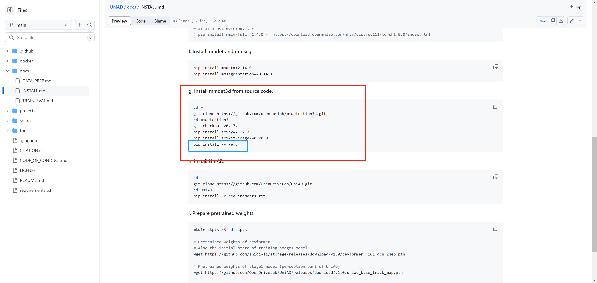

# 4.5 FusionAD 复现过程存在的问题



复现过程中UniAD存在(

## <font style="color:rgb(79, 79, 79);">Fatal error: ‘THC/THC.h’: No such file or directory</font>
)  
解决方案如下

```plain
//Comment Out /src/ball_query.cpp group_points.cpp interpolate.cpp pointnet2_api.cpp sampling.cpp
//#include <THE/THC.h>
//extern THCState *state;
//cudaStream_t stream = THCState_getCurrentStream(state);
//Replace with
#include <ATen/cuda/CUDAContext.h>
#include <ATen/cuda/CUDAEvent.h>
cudaStream_t stream = at::cuda::getCurrentCUDAStream();
then
replace the AT_CHECK with TORCH_CHECK in the ball_query.cpp
```

参考链接如下

[https://github.com/sshaoshuai/Pointnet2.PyTorch/issues/34#issuecomment-1225809318](https://github.com/sshaoshuai/Pointnet2.PyTorch/issues/34#issuecomment-1225809318)


> 更新: 2024-08-18 19:26:20  
> 原文: <https://3dcv.yuque.com/org-wiki-3dcv-mm1l0t/ysgfp9/gvkwqt7b8qrb9q0g>