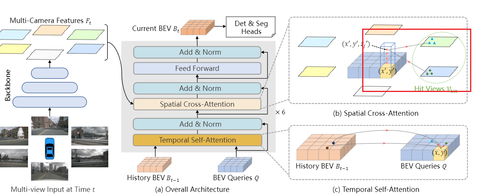
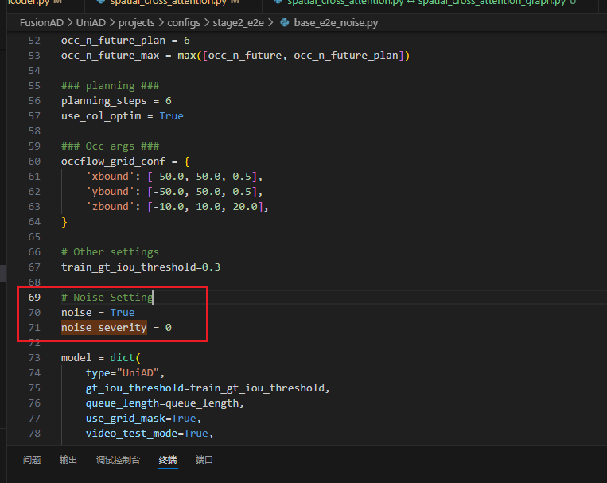
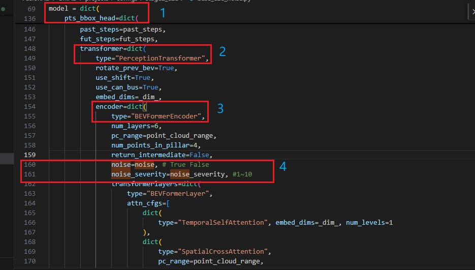
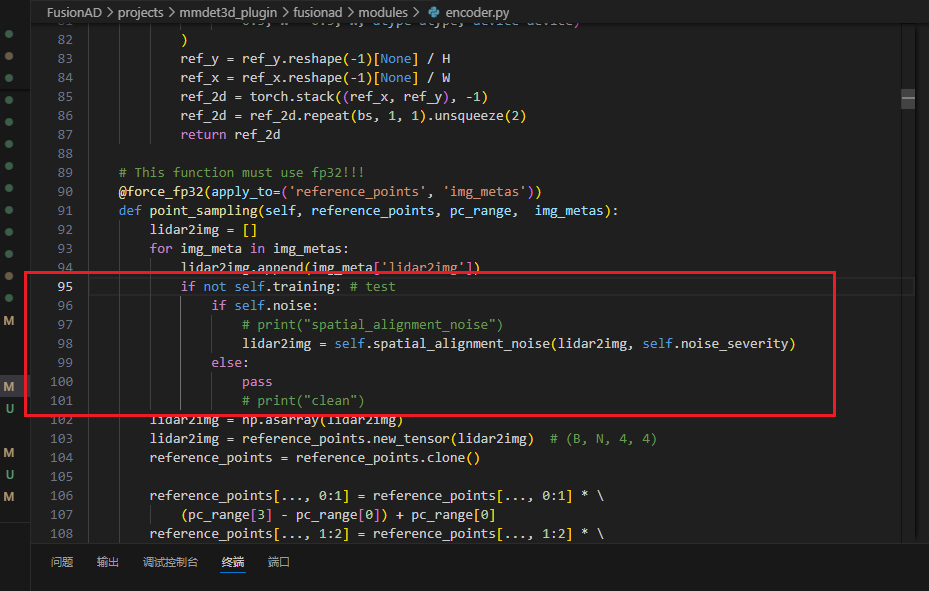
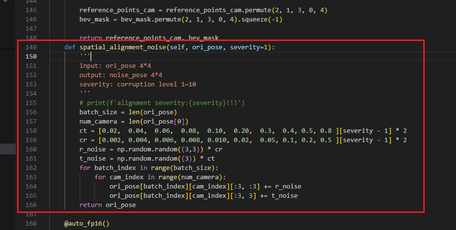
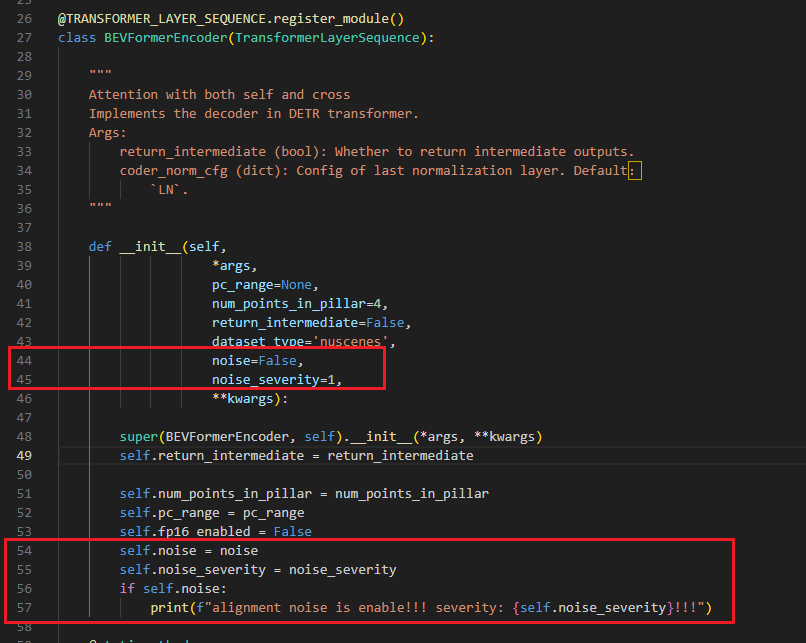
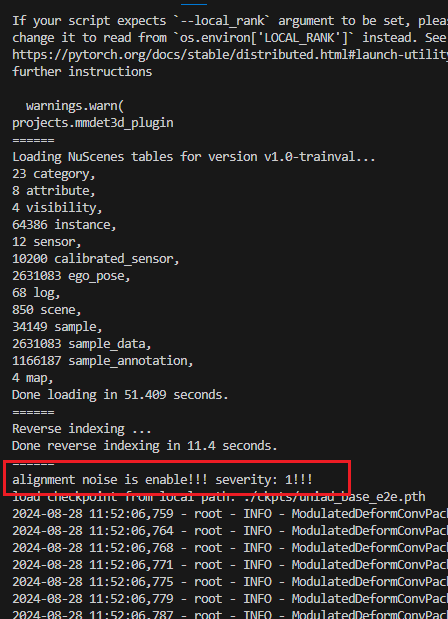

# 4.6 UniAD和FusionAD添加对齐噪声

FusionAD和UniAD采用了同样的BEVFormer来构建BEV感知，BEVFormer是通过Transformer来学习到BEV表征，而不是通过简单的矩阵投影。但是，BEVFormer仍然用到了投影矩阵来投影reference\_points，如图，于是噪声可以被加到这个部分。



# Step1 修改Config （可选）

Config为一个.py文件，这里我使用的是UniAD/projects/configs/stage2\_e2e/base\_e2e.py

1. 为config添加全局变量，方便噪声设置



```python
# Noise Setting
noise = True
noise_severity = 0
```

2. 找到pts\_bbox\_head-->PerceptionTransformer-->BEVFormerEncoder，为其添加参数noise和noise\_severity，如160:161行



```python
        noise=noise, # True False
        noise_severity=noise_severity, #1~10
```

# Step2 添加噪声代码

./UniAD/projects/mmdet3d\_plugin/uniad/modules/encoder.py

1. 找到投影矩阵的变量 lidar2img 添加红色框里的代码



```python
if not self.training: # test
    if self.noise:
        lidar2img = self.spatial_alignment_noise(lidar2img, self.noise_severity)
    else:
        pass
```

<font style="color:#DF2A3F;">如果没有添加Step1，将self.noise和self.noise\_severity替换成True或者数字用于使噪声生效（添加了Setp1请胡忽略）</font>

2. 复制添加噪声的函数spatial\_alignment\_noise进来

```python
def spatial_alignment_noise(self, ori_pose, severity=1):
        '''
        input: ori_pose 4*4
        output: noise_pose 4*4
        severity: corruption level 1~9
        '''
        batch_size = len(ori_pose)
        num_camera = len(ori_pose[0])
        ct = [0.02,  0.04,  0.06,  0.08,  0.10,  0.20,  0.3,  0.4, 0.5, 0.8 ][severity - 1] * 2
        cr = [0.002, 0.004, 0.006, 0.008, 0.010, 0.02,  0.05, 0.1, 0.2, 0.5 ][severity - 1] * 2
        r_noise = np.random.random((3,3)) * cr
        t_noise = np.random.random((3)) * ct
        for batch_index in range(batch_size):
            for cam_index in range(num_camera):
                ori_pose[batch_index][cam_index][:3, :3] += r_noise
                ori_pose[batch_index][cam_index][:3, 3] += t_noise
        return ori_pose
```

3. 如果添加了Step1，需要在BEVFormerEncoder中的init添加一些变量



```python
def __init__(self, 
                    *args, 
                    pc_range=None, 
                    num_points_in_pillar=4, 
                    return_intermediate=False, 
                    dataset_type='nuscenes',
                    noise=False,
                    noise_severity=1,
                    **kwargs):

        super(BEVFormerEncoder, self).__init__(*args, **kwargs)
        self.return_intermediate = return_intermediate

        self.num_points_in_pillar = num_points_in_pillar
        self.pc_range = pc_range
        self.fp16_enabled = False
        self.noise = noise
        self.noise_severity = noise_severity
        if self.noise:
            print(f"alignment noise is enable!!! severity: {self.noise_severity}!!!")
```

# Step3 运行脚本

```plain
#!/usr/bin/env bash


set -x
# eval setting
#####################################################
CFG=./projects/configs/stage2_e2e/base_e2e.py       #
CKPT=./ckpts/uniad_base_e2e.pth                     #
#####################################################

# gpu and noise setting
#############################
GPUS=$1                     #
SEVERITY=$2 # 1~10          #
GPU_ENV=$3                  #
#############################
# eval example
# ./tools/noise_test.sh 2 1 7,8
#                      两块卡 等级1 使用7,8号卡


# add log time
T=`date +%m%d%H%M`

# set random free port
while true
do
    PORT=$(( ((RANDOM<<15)|RANDOM) % 49152 + 10000 ))
    status="$(nc -z 127.0.0.1 $PORT < /dev/null &>/dev/null; echo $?)"
    if [ "${status}" != "0" ]; then
        break;
    fi
done
echo $PORT

# making log dirname
WORK_DIR=$(echo ${CFG%.*} | sed -e "s/configs/work_dirs/g")/
if [ ! -d ${WORK_DIR}logs_alignment_$SEVERITY ]; then
    mkdir -p ${WORK_DIR}logs_alignment_$SEVERITY # add alignment dirname
fi


PYTHONPATH="$(dirname $0)/..":$PYTHONPATH \
CUDA_VISIBLE_DEVICES=${GPU_ENV} python -m torch.distributed.launch  \
    --nproc_per_node=$GPUS \
    --master_port=$PORT \
    $(dirname "$0")/test.py \
    $CFG \
    $CKPT \
    --launcher pytorch \
    --eval bbox \
    --show-dir ${WORK_DIR} \
    --cfg-options model.pts_bbox_head.transformer.encoder.noise_severity=$SEVERITY 2>&1 | tee ${WORK_DIR}logs_alignment_$SEVERITY/eval_.$T
```

修改7 8 行的CFG和CKPT

<font style="color:#DF2A3F;">请注意如果使用53行需要添加Step1</font>

使用示例：

`./tools/noise_test.sh 2 1 7,8`

这里的参数是使用：2块卡；等级1；使用7 8号卡

运行时会在`.UniAD/projects/work_dirs/stage2_e2e/base_e2e/`下生成对应等级的日志

# 如果运行成功会有提示




> 更新: 2024-08-29 19:51:39  
> 原文: <https://3dcv.yuque.com/org-wiki-3dcv-mm1l0t/ysgfp9/bpnytg1luqmttngb>