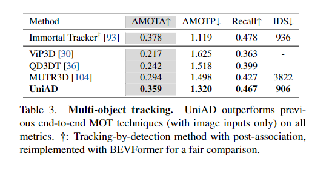
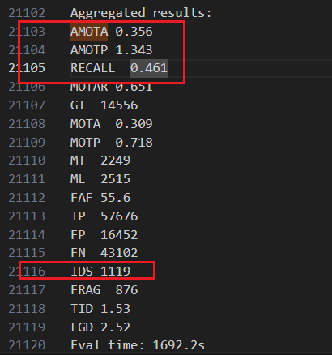
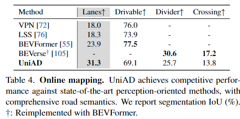
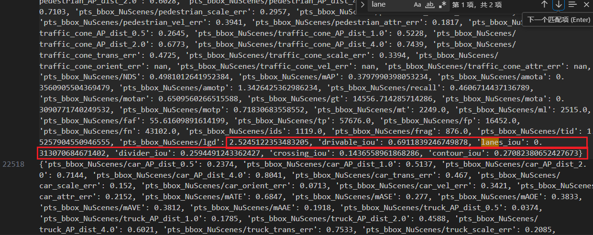
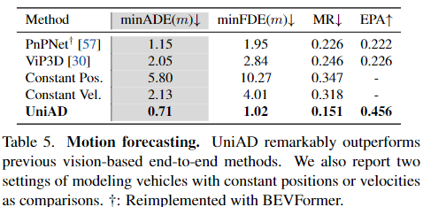
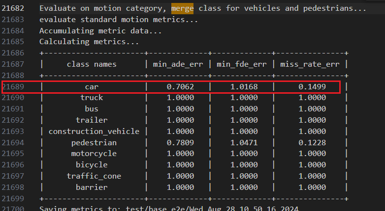
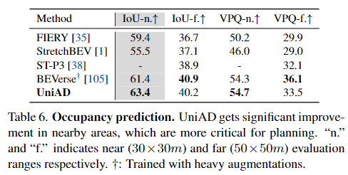
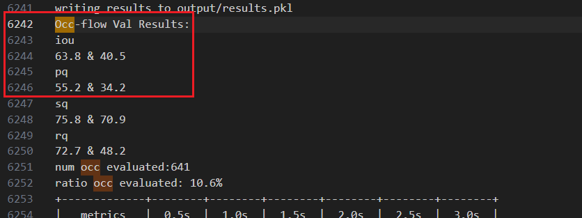
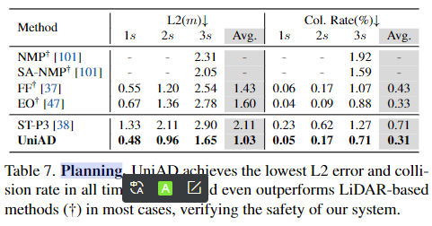
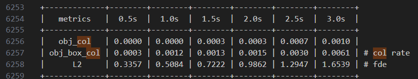

# 4.7 UniAD看数据 日志

按照uniad的步骤复现 会得到`./UniAD/projects/work_dirs/stage2_e2e/base_e2e/logs/eval.08281037`这样的一个日志文件，数据可以在这个文件里找到

## Tracking

直接搜索AMOTA可以搜到对应的数据

## Mapping

直接搜索lane，可以找到对应的四个IoU。（这里一条很长的json，如果被折叠起来了可以按alt+z进行换行显示）

## Motion

直接搜索merge，在下方的表格中的car是对应的数据

（Tips：这里的car合并了其他的车辆类型，不是单纯的"car"类别）

## Occpancy

搜索occ，会找到这样的几行数据，按顺序显示的iou和pq就是论文里的 IoU-n. IoU-f. VPQ-n. VPQ-f.

## Planning

搜索col可以找到一个表格，obj\_box\_col和L2是需要的碰撞率和L2距离

> 更新: 2024-08-29 17:26:19  
> 原文: <https://3dcv.yuque.com/org-wiki-3dcv-mm1l0t/ysgfp9/urbgb597m1662x4k>