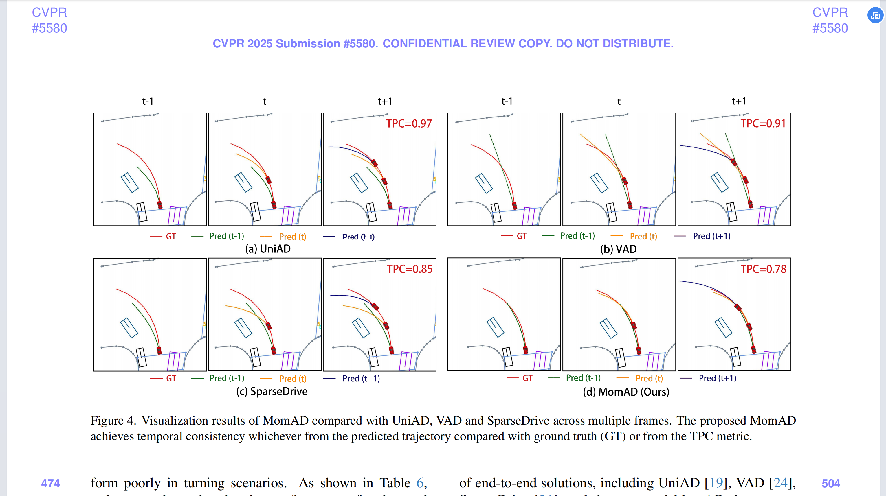

# 4.9 MomAD可视化

**正文可视化**

注意：Sparsedrive自带一份可视化代码，我们的代码基于SparseDrive的改进而来，可以把我们的代码直接替换SparseDrive的代码

> 更新: 2025-05-14 20:54:22  
> 原文: <https://3dcv.yuque.com/org-wiki-3dcv-mm1l0t/ysgfp9/ng12ps3ixxnlfw9g>