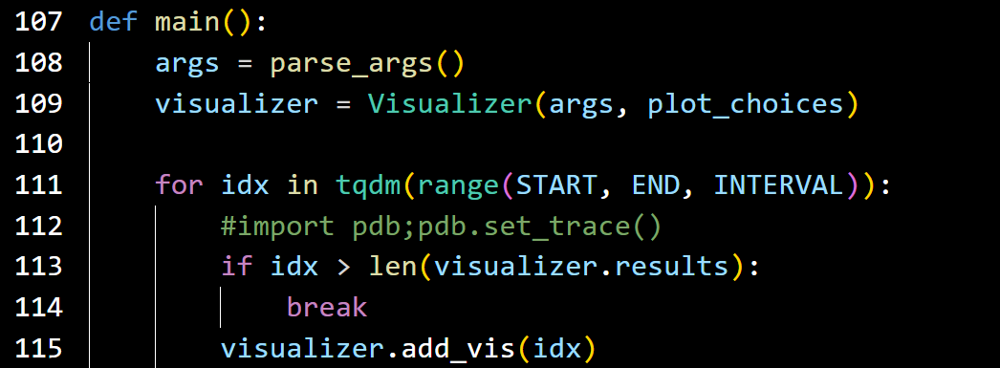
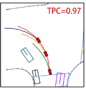
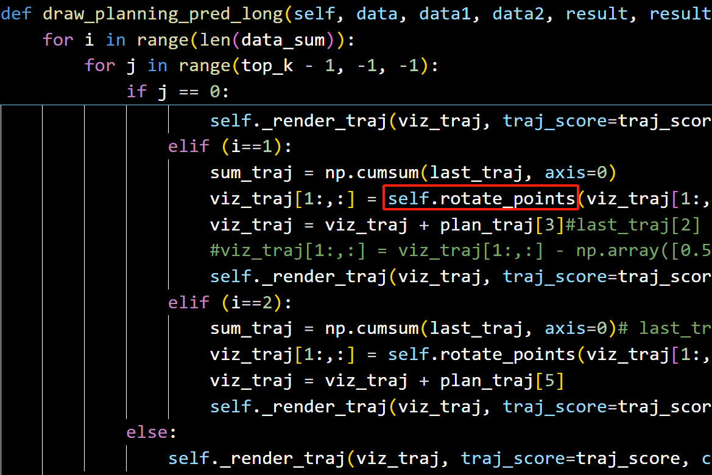
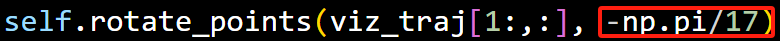

# 多时刻轨迹同时可视化

### 1.visualize.py函数改动
将visualize.py add_vis函数替换为add_vis_long函数，即可绘制t-1,t,t+1时刻的全部轨迹

### 2.示例

### 3.特别注意
由于t-1到t时刻的车辆位置转换矩阵未知，所以当多时刻轨迹可视化时要自己手动调整角度，t时刻以及t+1时刻的轨迹，即i=1以及i=2.

self.rotate_points用于调整角度，当角度为负值时，轨迹顺时针转动，当为正值时，轨迹逆时针转动。

> 更新: 2025-05-14 20:44:40  
> 原文: <https://3dcv.yuque.com/org-wiki-3dcv-mm1l0t/ysgfp9/lkh0yuyputbdxskk>