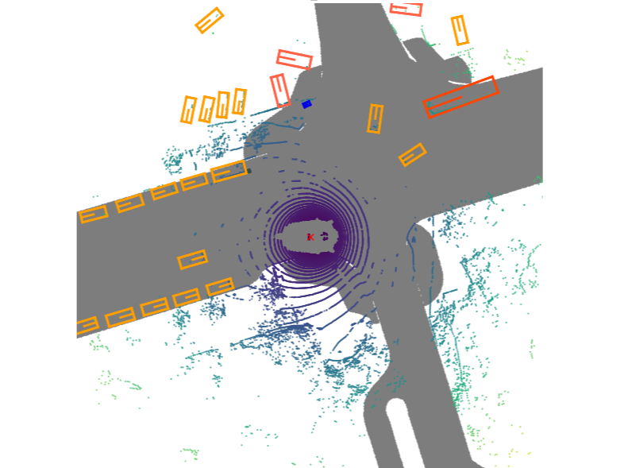

# 转弯场景可视化

该文档仅针对转弯场景的可视化例如:



```plain
import json
from nuscenes import NuScenes


nusc = NuScenes(version='v1.0-trainval', dataroot='/data2/songziying/workspace/SparseDrive/data/nuscenes/', verbose=False)

# 假设你有一个名为 'data.json' 的 JSON 文件
file_path = '/data2/songziying/workspace/SparseDrive/data/cross/val_llava_one_frame.json'

# 打开并读取 JSON 文件
with open(file_path, 'r', encoding='utf-8') as file:
    data = json.load(file)

import os
directory_path = '/data2/songziying/workspace/SparseDrive/data/nuscenes/samples/CAM_FRONT'
file_list = os.listdir(directory_path)
# 获取完整的文件路径
file_paths = [os.path.join(directory_path, filename) for filename in file_list]
# 打印完整文件路径
print(len(file_paths)) # 40157条数据
timestamp_to_filepath = {}
for file_path in file_paths:
    timestamp = file_path.split('_')[-1][:-4]
    timestamp_to_filepath[timestamp] = file_path
#build key frame json file
nuscences_json_file = "/data2/songziying/workspace/SparseDrive/data/nuscenes/v1.0-trainval/sample_data.json"
with open(nuscences_json_file, 'r') as json_file:
    nuscences_data = json.load(json_file)
nuscences_data_with_key_frame = []
for enrty in nuscences_data:
    dict = {}
    if enrty['is_key_frame'] == True and enrty['fileformat'] == 'jpg':
        dict['sample_token'] = enrty['sample_token']
        dict['filename'] =  enrty['filename']
        nuscences_data_with_key_frame.append(dict)
print(len(nuscences_data_with_key_frame))
token_to_filename = {}
for enrty in nuscences_data_with_key_frame:
     if enrty['filename'][:18] == 'samples/CAM_FRONT/':
         token_to_filename[enrty['sample_token']]= enrty['filename']
print(len(token_to_filename)) 

filename_to_token = {value: key for key, value in token_to_filename.items()}
part_to_remove = "/data2/songziying/workspace/SparseDrive/data/nuscenes"
modified_string = data[0]['image'].replace(part_to_remove, "")
modified_string

import ast
import numpy as np
image_paths = []
trajs = []
for i in range(len(data)):
    text = data[i]['conversations'][1]['value']
    infos = text.split("\n")
    #print(infos)
    traj = infos[-1] 
    traj = ast.literal_eval(traj)
    traj = np.array(traj)
    part_to_remove = "/data/songziying/workspace/SparseDrive/data/nuscenes"
    image_path = data[i]['image'].replace(part_to_remove, "")
    trajs.append(traj)
    image_paths.append(image_path)

tokens = []
for i in range(5119):
    tokens.append(filename_to_token[image_paths[i][1:]])

selected_tokens = []
selected_ids = []
for i in range(5119):
    if np.abs(trajs[i][5,0]) > 8:
        selected_tokens.append(tokens[i])
        selected_ids.append(i)

nusc.render_sample(selected_tokens[45],out_path="/data2/songziying/workspace/SparseDrive/vis4")
```

第75行的代码指定要可视化的场景以及图片输出路径nusc.render_sample(selected_tokens[45],out_path="/data2/songziying/workspace/SparseDrive/vis4")

注意，该代码need一个文件"/data2/songziying/workspace/SparseDrive/data/cross/val_llava_one_frame.json"[附件: val_llava_one_frame.json](./attachments/zdLMyKSL8PPxgHTE/val_llava_one_frame.json)


> 更新: 2024-11-19 22:00:25  
> 原文: <https://3dcv.yuque.com/org-wiki-3dcv-mm1l0t/ysgfp9/gpdg21z1x42x2rw2>