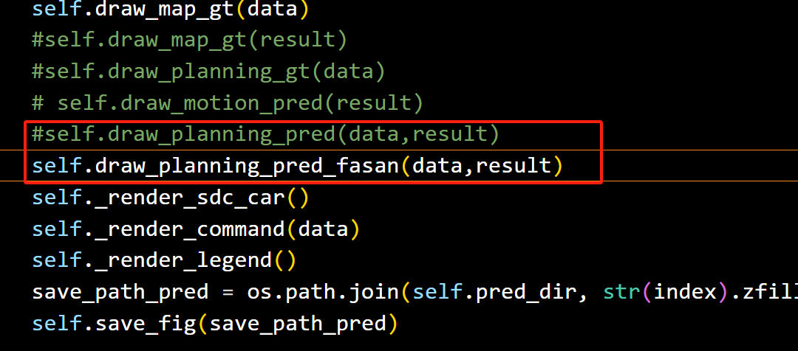
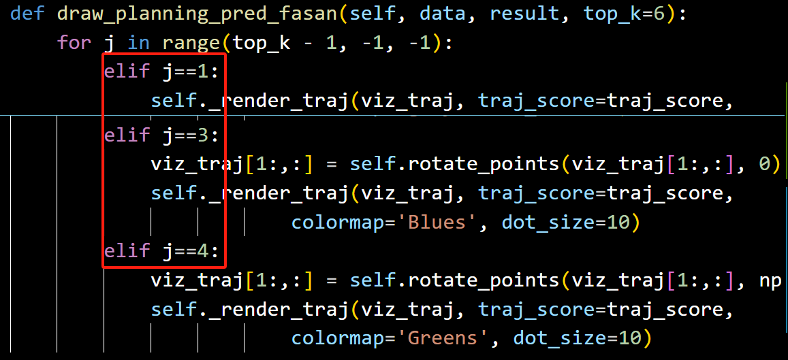
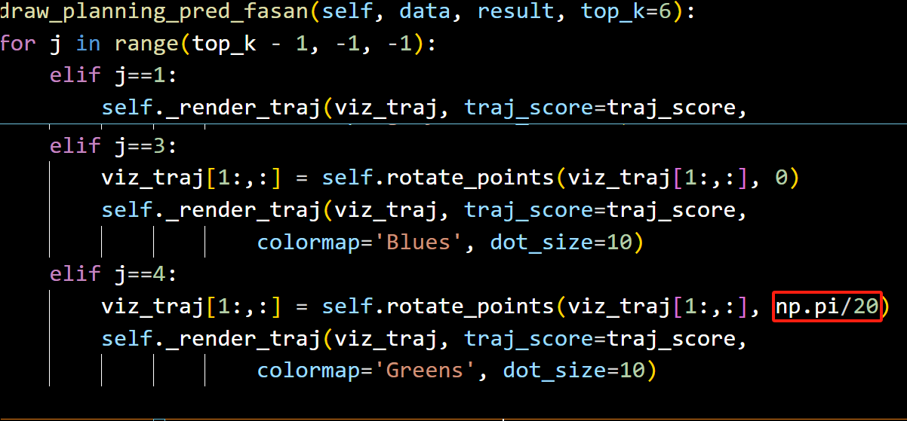

# 预测轨迹可视化(调整为发散状态)

想绘制类似diffusionDrive那样的发散多模轨迹就参考这个文档

### 请在Bev_render.py中的BevRender类中添加以下函数：
```plain
def draw_planning_pred_fasan(self, data, result, top_k=6):
        if not (self.plot_choices['draw_pred'] and self.plot_choices['planning'] and "planning" in result):
            return

        if self.plot_choices['track'] and "ego_anchor_queue" in result:
            ego_temp_bboxes = result["ego_anchor_queue"]
            ego_period = result["ego_period"]
            for j in range(ego_period[0]):
                # draw corners
                corners = box3d_to_corners(ego_temp_bboxes[:, -1-j])[0, [0, 3, 7, 4, 0]]
                x = corners[:, 0]
                y = corners[:, 1]
                self.axes.plot(x, y, color='mediumseagreen', linewidth=2, linestyle='-')

                # draw line to indicate forward direction
                forward_center = np.mean(corners[2:4], axis=0)
                center = np.mean(corners[0:4], axis=0)
                x = [forward_center[0], center[0]]
                y = [forward_center[1], center[1]]
                self.axes.plot(x, y, color='mediumseagreen', linewidth=2, linestyle='-')
        # import ipdb; ipdb.set_trace()
        plan_trajs = result['planning'].cpu().numpy()
        num_cmd = len(CMD_LIST)
        num_mode = plan_trajs.shape[1]
        plan_trajs = np.concatenate((np.zeros((num_cmd, num_mode, 1, 2)), plan_trajs), axis=2)
        plan_score = result['planning_score'].cpu().numpy()

        cmd = data['gt_ego_fut_cmd'].argmax()
        plan_trajs = plan_trajs[cmd]
        plan_score = plan_score[cmd]

        sorted_ind = np.argsort(plan_score)[::-1]
        sorted_traj = plan_trajs[sorted_ind, :, :2]
        sorted_score = plan_score[sorted_ind]
        norm_score = np.exp(sorted_score[0])
        #import
        for j in range(top_k - 1, -1, -1):
            viz_traj = sorted_traj[j]
            traj_score = np.exp(sorted_score[j]) / norm_score
            if j==0:
                viz_traj[1:,:] = self.rotate_points(viz_traj[1:,:], np.pi/18)
                self._render_traj(viz_traj, traj_score=traj_score,
                            colormap='autumn', dot_size=10)
            elif j==1:
                #import pdb;pdb.set_trace()
                viz_traj = np.array([
                        [0.00000000, 0.00000000],       # t0
                        [0.18559805, 2.38468337],       # t1
                        [0.37119610, 4.76936674],       # t2
                        [0.55679415, 7.15405011],       # t3
                        [0.74239220, 9.53873348],       # t4
                        [0.92799025, 11.92341685],      # t5
                        [1.11358830, 14.30810022]
                    ])
                viz_traj[1:,:] = self.rotate_points(viz_traj[1:,:], np.pi/60)
                self._render_traj(viz_traj, traj_score=traj_score,
                            colormap='gray', dot_size=10)
            elif j==3:
                viz_traj[1:,:] = self.rotate_points(viz_traj[1:,:], 0)
                self._render_traj(viz_traj, traj_score=traj_score,
                            colormap='Blues', dot_size=10)
            elif j==4:
                viz_traj[1:,:] = self.rotate_points(viz_traj[1:,:], np.pi/20)
                self._render_traj(viz_traj, traj_score=traj_score,
                            colormap='Greens', dot_size=10)
```

### 使用
在绘制轨迹的render函数中，将原本的draw_planning_pred函数替换为draw_planning_pred_fasan



### 风格调整
函数内的if分支选择了要绘制的发散轨迹，这里选择了第1，3，4条轨迹进行可视化



为了实现发散效果，对原本的轨迹进行了旋转处理，具体旋转角度可以通过调整旋转角度来实现




> 更新: 2025-05-15 13:47:24  
> 原文: <https://3dcv.yuque.com/org-wiki-3dcv-mm1l0t/ysgfp9/ny74vibke2yo52cb>