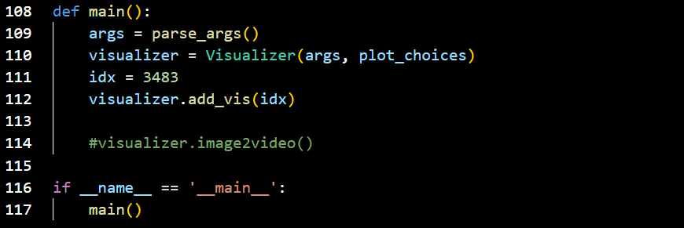
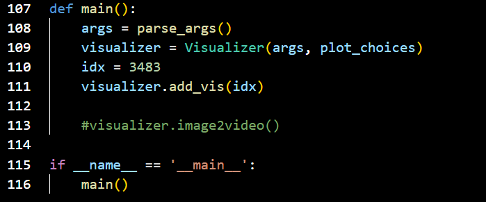
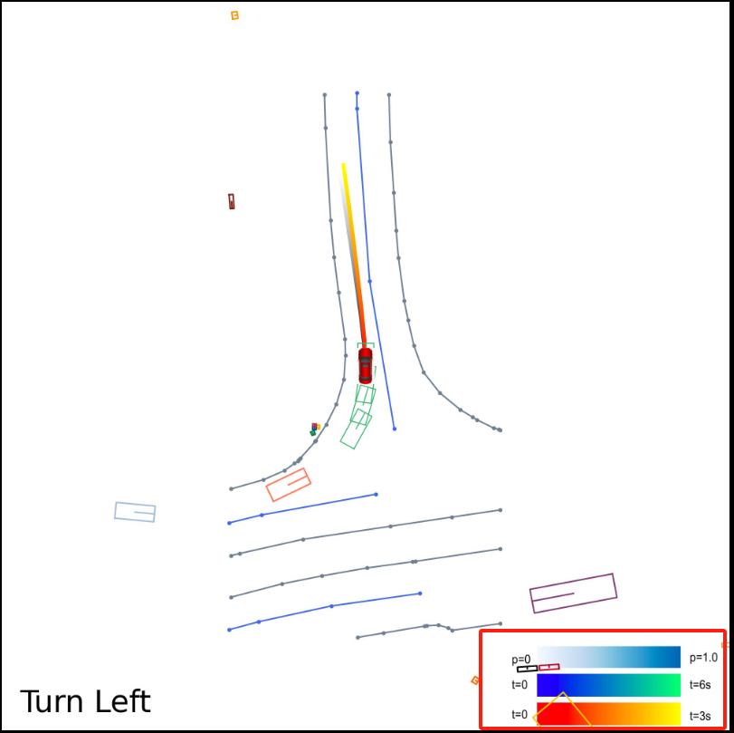
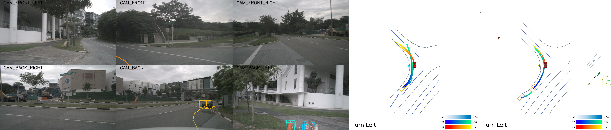

# 预测轨迹可视化

### 数据准备：
在测试时间，端到端模型会将预测结果保存为result.pkl.保存好这个文件(任意文件夹)

<font style="color:#DF2A3F;">注意：Sparsedrive自带一份可视化代码，我们的代码基于SparseDrive的改进而来，可以把我们的代码直接替换SparseDrive的代码</font>

###  工具类
[附件: bev_render.py](./attachments/rjUDqzQmV_D7Lis8/bev_render.py)

[附件: cam_render.py](./attachments/rjUDqzQmV_D7Lis8/cam_render.py)

###  可视化代码
由于不同模型对于预测结果的保存格式不同，故可视化代码有一些区别，下列代码均放置在 SparseDrive 直接目录下

[附件: visualize.py](./attachments/rjUDqzQmV_D7Lis8/visualize.py)---> 针对SparseDrive or momad的结果

[附件: visualize_vad.py](./attachments/rjUDqzQmV_D7Lis8/visualize_vad.py)----> 针对VAD的结果

[附件: visualize_uniad.py](./attachments/rjUDqzQmV_D7Lis8/visualize_uniad.py)-----> 针对UniAD的结果

###  使用方法
#### 针对SparseDrive ---> visualize.py
针对SparseDrive的可视化代码，通过设置visualize.py的26行中的Start以及END就可以控制可视化的范围


#### 针对VAD ---> visualize_vad.py
针对VAD的可视化代码，通过设置visualize_vad.py的111行中的idx就可以控制可视化的具体实例



#### 针对UniAD ---> visualize_uniad.py
针对uniad的可视化代码，通过设置visualize_uniad.py的110行中的idx就可以控制可视化的具体实例



#### 终端命令：
Uniad:

```plain
python visualize_uniad.py sparsedrive_small_stage2.py --result-path result.pkl --out-dir vis_long_UniAD
```

Vad:

```plain
python visualize_vad.py sparsedrive_small_stage2.py --result-path result.pkl --out-dir vis_long_VAD
```

SparseDrive:

```plain
python visualize.py sparsedrive_small_stage2.py --result-path result.pkl --out-dir vis_long_sparseDrive
```

**注:在可视化VAD和UniAD的结果时，不要改动model的配置文件，仍然使用SparseDrive的就可以，因为仅仅可视化保存好的结果，而不要去构建模型**）

### 选择特定任务进行可视化:
可以选择detection,map,motion,plan等任务进行可视化或者不可视化，方法是注释掉 bev_render.py中下列函数中的一些代码，注释位置在BEV_render.py的142行处，例如注释掉self.draw_detection_gt（）就可以去除检测的可视化，去除self.draw_map_pred()就可以去除地图预测的可视化。

```plain
def render_long(
        self,
        data,
        data1,
        data2, 
        result,
        result1,
        result2,
        index,
        type = "sparsedrive",
    ):
        self.reset_canvas()
        #import pdb;pdb.set_trace()
        self.draw_detection_gt(data) # 可视化检测gt
        self.draw_motion_gt(data) # 可视化motion gt
        self.draw_map_gt(data) # 可视化map gt
        self.draw_planning_gt(data) # 可视化planning gt
        #self._render_sdc_car()
        self._render_command(data) # 显示驾驶命令
        self._render_legend()
        save_path_gt = os.path.join(self.gt_dir, str(index).zfill(4) + '.jpg')
        self.save_fig(save_path_gt)

        self.reset_canvas()
        self.draw_detection_pred(result) # 可视化检测pred
        self.draw_detection_gt(data) 
        self.draw_track_pred(result) # 可视化追踪 pred
        self.draw_motion_pred(result) # 可视化motion pred
        self.draw_map_pred(result) # 可视化map pred
        self.draw_map_gt(data)
        if type=="sparsedrive":
            self.draw_planning_pred_long(data,data1,data2,result,result1,result2)
        elif type =="vad":
            self.draw_planning_pred_long_vad(data,data1,data2,result,result1,result2)
        else:
            self.draw_planning_pred_long_uniad(data,data1,data2,result,result1,result2)
        self._render_sdc_car()
        self._render_command(data)
        self._render_legend()
        save_path_pred = os.path.join(self.pred_dir, str(index).zfill(4) + '.jpg')
        self.save_fig(save_path_pred)

        return save_path_gt, save_path_pred
```

### 图片注释改动：
该注释读取了文件夹SparseDrive/resources/legend.png，这个图片是利用PS绘制的，如果改动标注，要替换掉这个图片为自己的图片



### 可视化的sample:



> 更新: 2025-05-14 20:53:14  
> 原文: <https://3dcv.yuque.com/org-wiki-3dcv-mm1l0t/ysgfp9/ofr36nrs1n07xe5h>