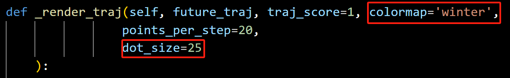
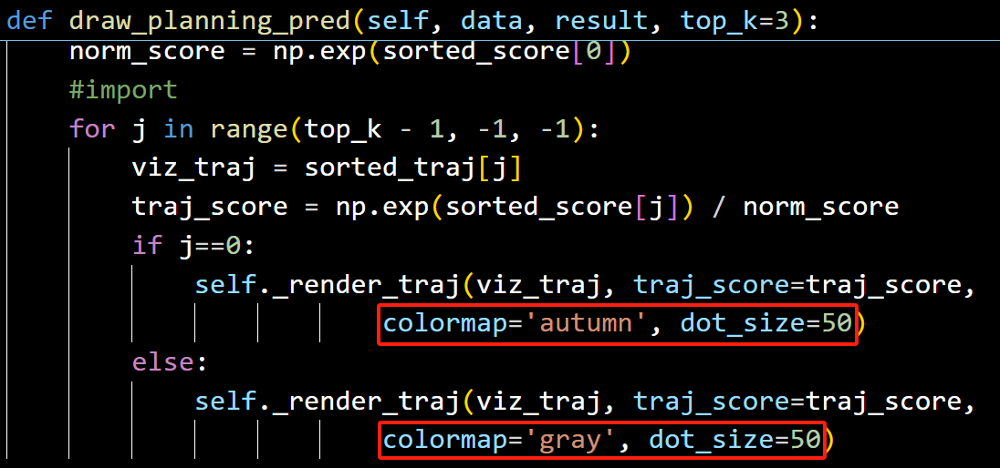
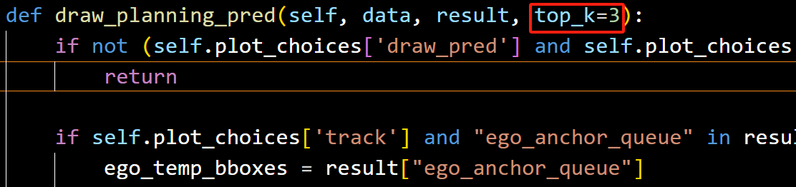
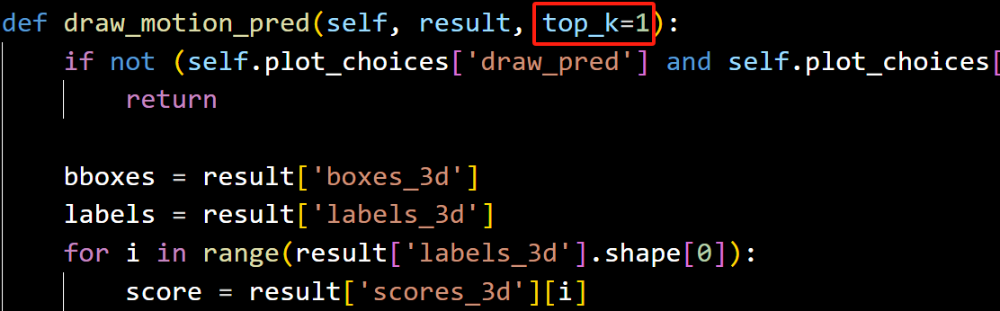
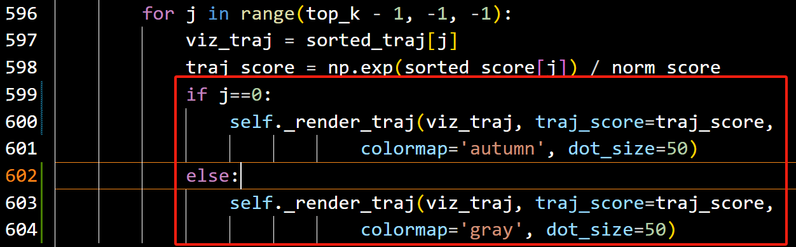
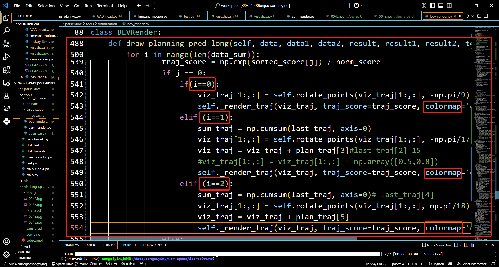

# 预测轨迹可视化（调整样式）

### 1.调整轨迹粗度以及颜色
最底层的轨迹绘制函数为_render_traj函数，如果调整轨迹绘制样式，可以通过调整传入该函数的参数：

colormap调整轨迹颜色，参数取值来自[https://blog.csdn.net/weixin_40683253/article/details/87370127](https://blog.csdn.net/weixin_40683253/article/details/87370127)

dot_size调整轨迹粗度 取值：1~100的整数

例如调整plan任务的轨迹格式，就在绘制plan轨迹的函数中调整_render_traj函数的超参：

### 2.调整绘制轨迹数量
轨迹数量由超参数top_k决定，调整该参数可以控制绘制多模轨迹的数量

plan任务就调整传入draw_planning_pred函数的top_k

motion任务就调整draw_motion_pred的top_k

这里的默认设置为plan任务内，得分最高的轨迹为红色 'autumn'，其余次优轨迹为灰色 'gray'，如果调整，改动colormap.

### 3.多时刻轨迹颜色调整
目前，可视化了三个时刻的轨迹，t-1,t,t+1这三个时刻，分别给定了不同的颜色，绘制多时刻轨迹来自于函数draw_planning_pred_long，而非draw_planning_pred。 

同样是调整参数colormap来设置颜色，i=0对应t-1时刻，i=1对应t时刻，i=2对应t+1时刻

> 更新: 2025-05-14 19:32:23  
> 原文: <https://3dcv.yuque.com/org-wiki-3dcv-mm1l0t/ysgfp9/mbkyn9q2vtoh7571>