# 5.2 面向具身智能的视频生成模型微调与配置方法

## 评估指标（Baseline）

两种评测指标对应两个评估方法——offline\&online

#### （1）生成质量（offline）

属于开环测试，人工评估。仅提供**首帧画面**和**完整的运动轨迹（包括元数据）**，用于评估条件视频生成的水平。将这些喂给WM，生成三个类型的视频。后续评估关注点：生成视频<font style="color:rgb(55, 65, 81);background-color:rgb(249, 250, 251);">与GT动作一致，物体最终状态一致，过程中物体的形变，物理与碰撞是否有异常。</font>

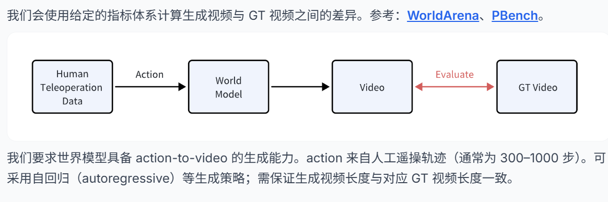

#### （2）世界模型作为 VLA 评测器的能力（online）

```
        1. 评测开始时，系统只提供机器人机械手的第一帧初始画面，以及一个任务指令（meta的prompt）
        2. VLA模型看到这第一帧画面后，预测并输出一段未来的机器人姿态指令（即一段动作/序列） 
        3. WM 模型接收当前的图像观测和VLA模型给出的未来动作姿态，**“预测/生成”出这些动作执行后的未来视频帧**。它同时生成三个视角的画面，以保证多视角一致性 。
        4. VLA模型接着看生成的“预测画面”，继续决定下一步动作；WM 再根据新动作继续生成后续画面。这个基于动作条件的视频生成过程连续滚动，形成了一个若干帧数的闭环视频
        5.  最终，人类评估员会观看这段由 WM 纯生成的闭环视频，根据视频里的表现来打分，判断策略是成功、失败
```

论文连接：<https://arxiv.org/abs/2512.10675>（deepmind）

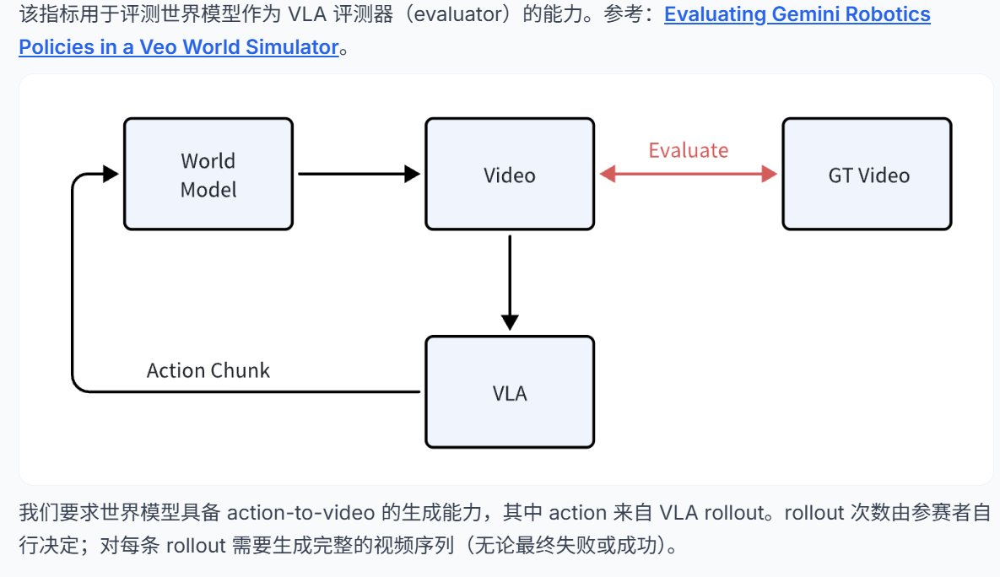

#### （3）这个赛道就是世界模型当作仿真器去测评VLA

去年的思路就是默认世界模型完美无缺，然后把它当作仿真器去做强化学习训练VLA

今年应该就是世界模型**作为仿真器仍有缺陷**，如何改进。所以这个赛道就有了

## 数据集格式以及用处

### 任务类型

:::tips
Task1： 每次只把香蕉，放进篮子里

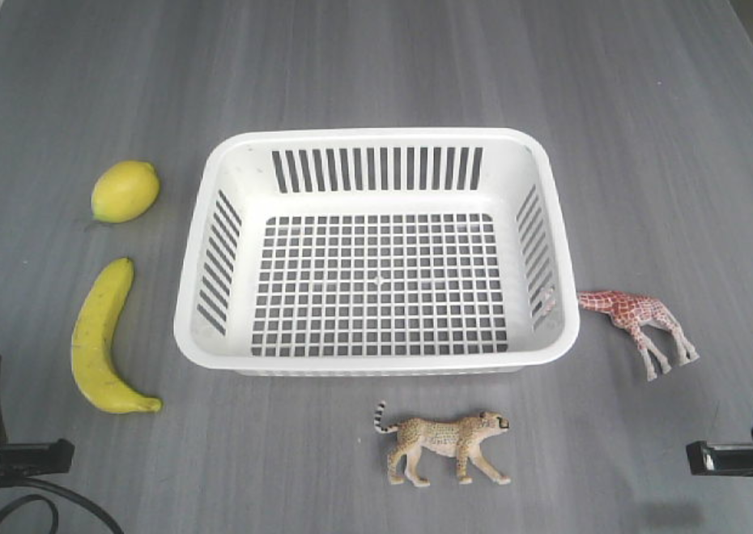

Task2：每次只将绿色的碗，放在粉色的杯子上

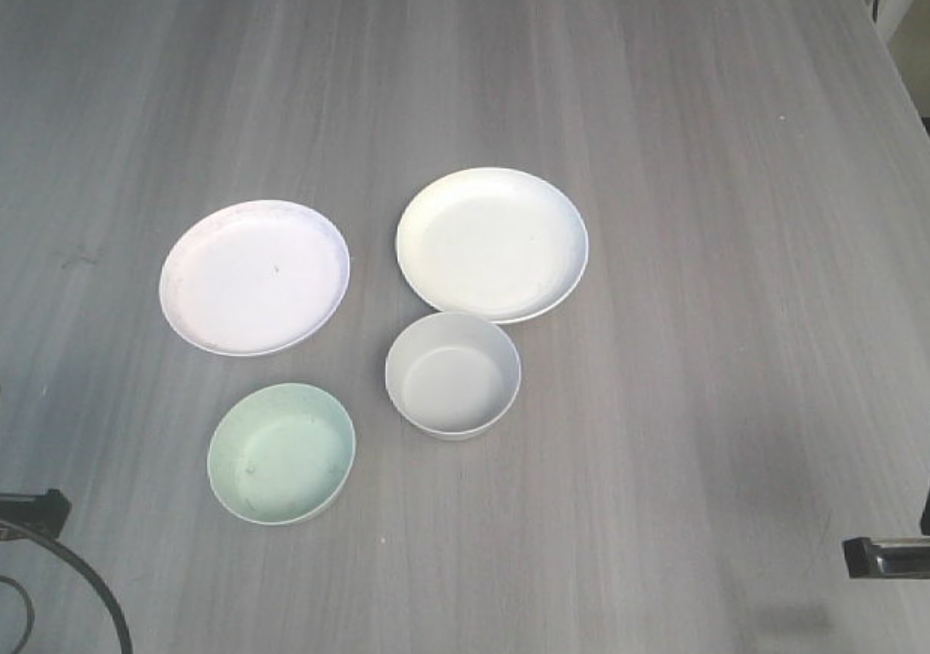

Task3：快递封装

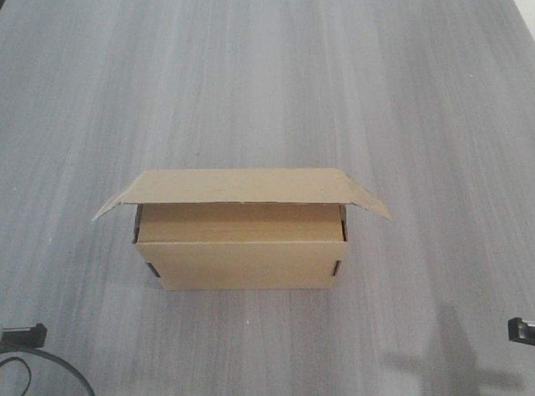

Task4：拆开包装，将里面的薯条放到盘子上

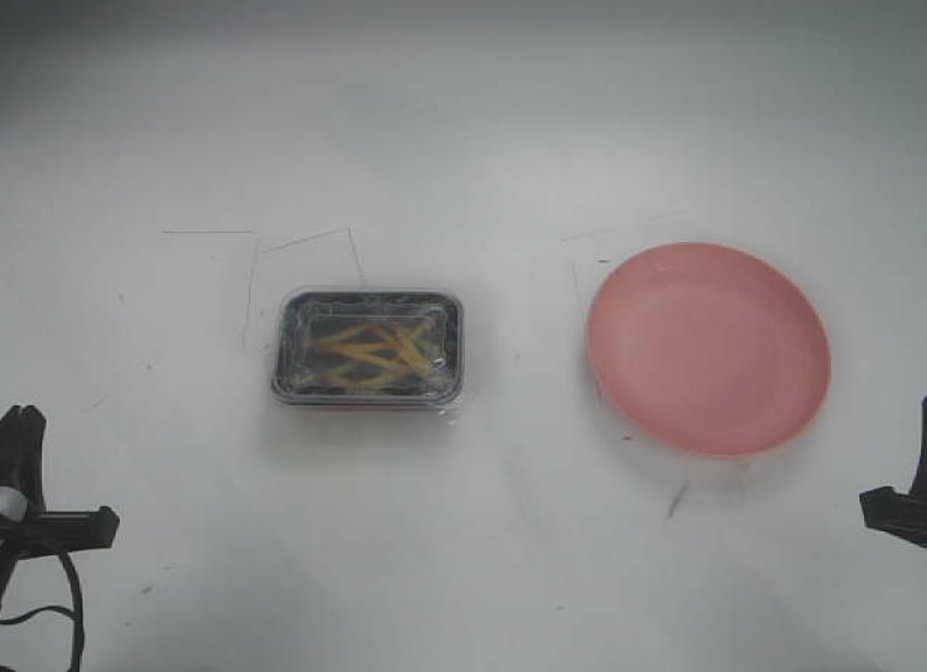

Task5： 抓稳刷子和簸箕，把桌面纸团扫干净 （数据集有失败的案例）

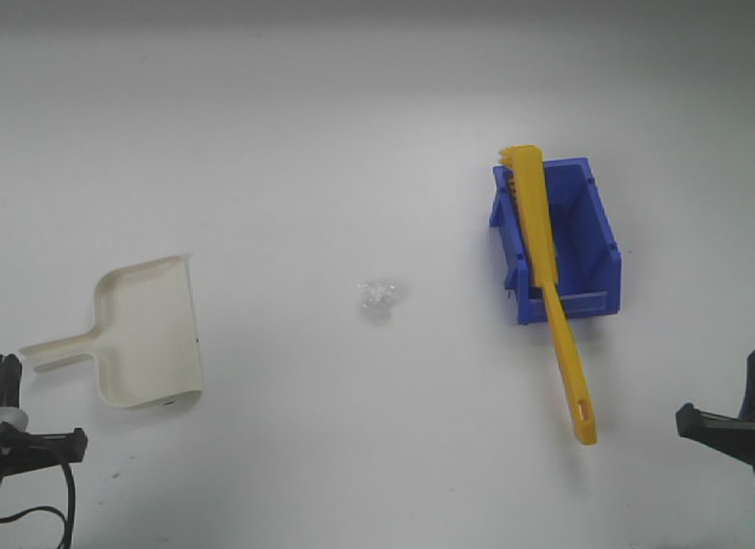

Task6：叠衣服然后放桌面的一边

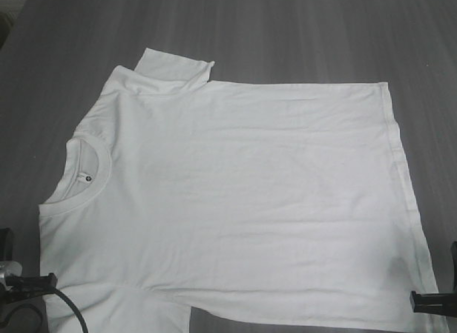

Task7：撕胶布，然后贴到盒子上

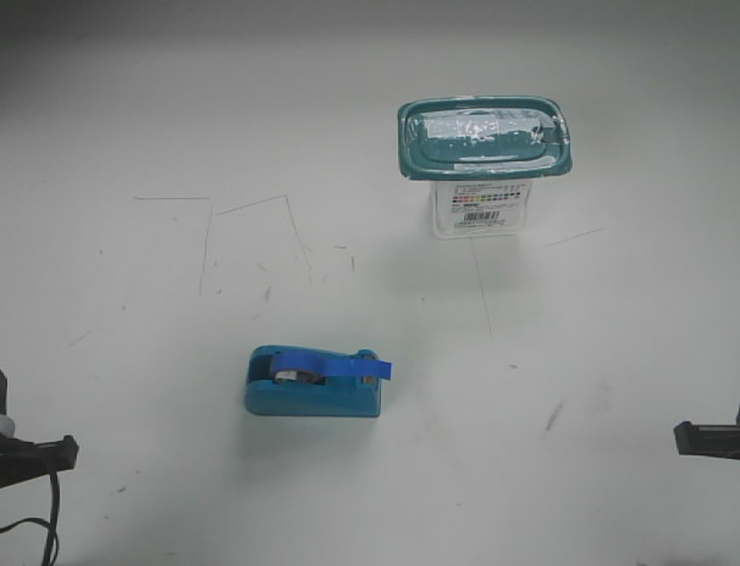

Task8：把熊猫放在粉盘子中

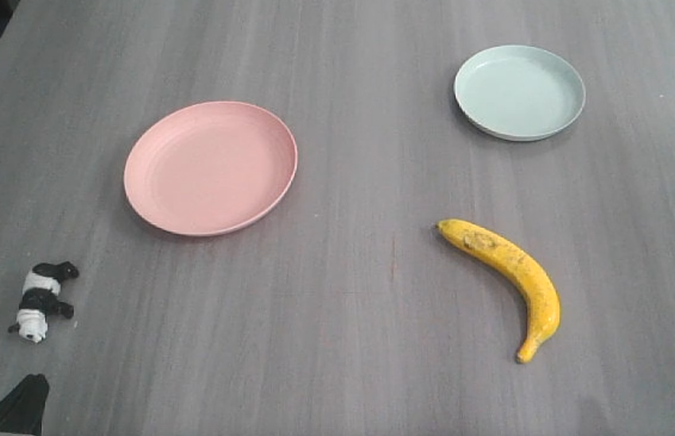

:::

### 数据集划分

```plain
task/
├── train/                    # 训练主数据
│   ├── metas/                # 包含任务指令的JSON文件
│   │   ├── episode_0.json
│   │   └── ...
│   ├── trajectories/         # 状态序列文件 (.pkl)
│   │   ├── episode_0.pkl
│   │   └── ...
│   └── videos/               # 多视角视频录制 (.mp4)
│       ├── cam_high/       
│       │   ├── episode_0.mp4
│       │   └── ...
│       ├── cam_left_wrist/  
│       └── cam_right_wrist/ 
├── evaluator/                # 作为评估器测试集
│   ├── episode_0/            # 测试片段初始状态
│   │   ├── cam_high.png      # 参考图像（高位视角）
│   │   ├── cam_left_wrist.png
│   │   ├── cam_right_wrist.png
│   │   ├── meta.json        
│   │   └── initial_state.pkl 
│   └── ...                  
└── video_quality/            # 视频质量评估集
    ├── episode_0/            
    │   ├── cam_high.png
    │   ├── cam_left_wrist.png
    │   ├── cam_right_wrist.png
    │   ├── meta.json
    │   └── traj.pkl
    └── ...
```

```
        1. train划分，用作全量微调时候使用。
            1. meta--元数据
```

```json
{
    "prompt": "put banana into basket",   #用来向WM提供prompt
    "video_height": 480,		#
    "video_width": 640,     #
    "length": 240,     #对齐参数，样本的时间长度是 240 帧
    "trajectory_type": "qpos", #对应的 .pkl 文件里记录的是“广义坐标/关节角度”（qpos）
    "data_type": "real"     #当前样本来自真实环境
}
```

3D-VAE对输入张量（Tensor）的尺寸有极其严格的要求。Dataloader 读到这两个数字后，就能决定要不要对视频进行 Center Crop（中心裁剪）、Padding（边缘填充）或 Resize（缩放），从而统一打包成比如 `256x256` 的标准尺寸送给 Wan2.2。

```
            2. trajectories--轨迹——以 .pkl 序列化形式打包
            3. depth、videos、simulator--一种轨迹、三式视频
```

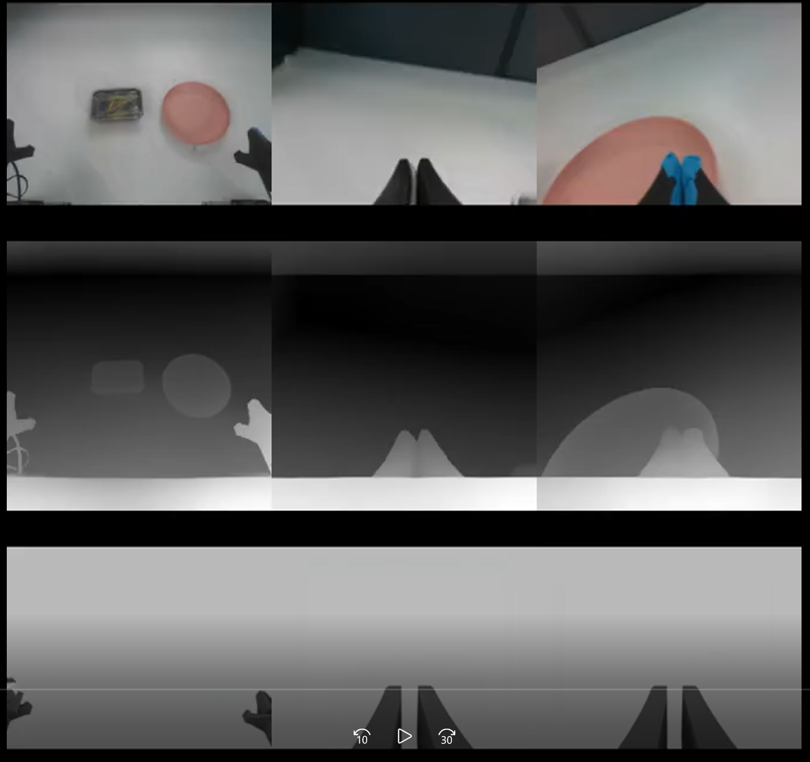

```
        2. video_quality划分，评估生成质量的时候使用。 仅提供**首帧画面**和**完整的运动轨迹（包括元数据）**，用于评估条件视频生成的水平。将这些喂给WM，生成三个类型的视频。
        3. evaluator划分，online评估时与VLA交互使用。 仅提供**初始帧**和**初始状态**，用于支持**闭环**的 VLA（视觉-语言-动作）交互与评估。  
```

## 基准模型（benchmark）--wan2.2-5b-diffusers

### 模型架构

### 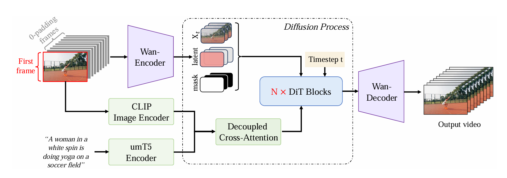

这里的Wan-Encoder属于VAE

模型在 latent space（隐空间） 里做 diffusion

Timestep含义： 在训练时，对真实视频的latent 加不同强度的噪声， 模型看到当前噪声等级 t， 学着把带噪 latent 还原回来，就这样做监督训练

## Pipeline

快速配置来自官网：<https://github.com/open-gigaai/CVPR-2026-Workshop-WM-Track>

### 数据打包——GigaDataset

把的原始样本（如图片文件、视频文件、标注 JSON 等）通过一组 Writer（如 `PklWriter` / `FileWriter` / `LmdbWriter`）转换为序列化的“**数据集目录**”

#### 数据集格式

Pkl： 可以将Python对象（如列表、字典、数据集等）保存为二进制文件

File： 传统的文件存储格式，可以是文本文件或二进制文件。每个数据项存储在一个独立的文件中，通常带有特定的扩展名（如`.txt`、`.bin`等）

Lmda： 通过`LMDB`进行序列化的。这是一种基于内存映射的键值数据库

#### GigaDataset使用——`load_dataset` 统一加载

核心思路： 用 `PklWriter` 字段数据，比如 meta、traj、标签字典

```
 用 `FileWriter` 或 `LmdbWriter` 存图片/视频 

 最后用 `Dataset([...])` 把这些子数据集合并成一个总数据集

 只要 `load_dataset(root_dir)`，每次拿到的就是一个sample dict   
```

##### 打包图片&字段数据集

<details class="lake-collapse"><summary id="uffd3c652"><span class="ne-text">目录	</span></summary><p id="u59a85bbc" class="ne-p"><span class="ne-text">raw_data/</span></p><p id="u8f4f5b74" class="ne-p"><span class="ne-text">├── 0.png</span></p><p id="u8c21def8" class="ne-p"><span class="ne-text">├── 0.json</span></p><p id="uf858f947" class="ne-p"><span class="ne-text">├── 1.png</span></p><p id="u2e12ba43" class="ne-p"><span class="ne-text">├── 1.json</span></p><p id="u635feac5" class="ne-p"><span class="ne-text">└── ...</span></p></details>
```python
def main(image_dir: str = './raw_data', save_dir: str = './giga_data'):
    # 列出指定目录下的所有图片文件
    image_paths = utils.list_dir(image_dir, recursive=True, exts=['.png', '.jpg', '.jpeg'])

```
# 创建标签写入器（pickle格式）和图片写入器（lmdb格式）
label_writer = PklWriter(os.path.join(save_dir, 'labels'))
image_writer = LmdbWriter(os.path.join(save_dir, 'images'))

# 遍历每个图片文件并处理对应的标注
for idx in tqdm(range(len(image_paths))):
    # 将图片路径后缀替换为.json得到标注文件路径
    label_path = image_paths[idx].replace('.png', '.json')
    label_dict = json.load(open(label_path))
    label_dict['data_index'] = idx
    
    # 写入标注字典--核心
    label_writer.write_dict(label_dict)
    # 写入对应图片文件，并使用数据索引--核心
    image_writer.write_image(idx, image_paths[idx])

# 保存两个写入器的配置文件，并关闭写入器以完成文件写入
label_writer.write_config()
image_writer.write_config()
label_writer.close()
image_writer.close()

# 加载已打包的数据集，将标签和图片数据集合并为一个数据集并保存
label_dataset = load_dataset(os.path.join(save_dir, 'labels'))
image_dataset = load_dataset(os.path.join(save_dir, 'images'))
dataset = Dataset([label_dataset, image_dataset])
dataset.save(save_dir)

# 加载并验证打包后的数据集
packed_dataset = load_dataset(save_dir)
data_dict = packed_dataset[0]
print('打包后数据集大小:', len(packed_dataset))
print('打包数据集中的第一项:', data_dict)
```

````

<details class="lake-collapse"><summary id="u40e89ad3"><span class="ne-text">结果</span></summary><p id="uf5d1fe88" class="ne-p"><br></p></details>
##### 打包视频&数据集
###### 打包视频存储的路径
video_writer.write_video_path(idx, video_paths[idx])

或者

label_writer.write_dict(data_dict)   <- data_dict存放着视频存储路径

###### 打包视频
video_writer.write_video(idx, video_paths[idx])

##### 比赛保存方式（混合数据）——打包各类文件的存储路径
```python
import json
import os
import paths
from giga_datasets import Dataset, FileWriter, PklWriter, load_dataset
from cvpr_2026_workshop_wm_track.model_config import DATA_DIR
from glob import glob
from tqdm import tqdm
import pickle
import argparse

def get_three_view_video_paths(local_dir_name, task_dir, episode_name, data_type_name):
    data_dict = {}
    data_dict[f'cam_high_{data_type_name}_path'] = os.path.join(task_dir, local_dir_name, 'cam_high', f"{episode_name}.mp4")
    data_dict[f"cam_left_wrist_{data_type_name}_path"] = os.path.join(task_dir, local_dir_name, 'cam_left_wrist', f"{episode_name}.mp4")
    data_dict[f"cam_right_wrist_{data_type_name}_path"] = os.path.join(task_dir, local_dir_name, 'cam_right_wrist', f"{episode_name}.mp4")
    assert os.path.exists(data_dict[f'cam_high_{data_type_name}_path']), data_dict[f'cam_high_{data_type_name}_path']
    assert os.path.exists(data_dict[f"cam_left_wrist_{data_type_name}_path"]), data_dict[f"cam_left_wrist_{data_type_name}_path"]
    assert os.path.exists(data_dict[f"cam_right_wrist_{data_type_name}_path"]), data_dict[f"cam_right_wrist_{data_type_name}_path"]
    return data_dict


# task_dir是taskid/train/
def pack_data_per_task(task_dir, ):
    label_writer = PklWriter(os.path.join(task_dir, "labels"))
    data_list = glob(os.path.join(task_dir, "metas", "*.json"))
    data_list = [os.path.basename(path).replace(".json", "") for path in data_list]
    data_index = 0
    for episode_name in tqdm(data_list, desc=f"Packing data on {task_dir}"):
        try:
            meta_info = json.load(open(os.path.join(task_dir, "metas", episode_name + ".json"), 'r'))
            qpos = pickle.load(open(os.path.join(task_dir, "trajectories", episode_name + ".pkl"), "rb"))
            depth_dict = get_three_view_video_paths('depth', task_dir, episode_name, 'depth')
            simulator_dict = get_three_view_video_paths('simulator', task_dir, episode_name, 'simulator')
            video_dict = get_three_view_video_paths('videos', task_dir, episode_name, 'video')
        except Exception as e:
            print(f"报错详情: {e}, {episode_name}")
        data_dict = {
            **depth_dict,
            **simulator_dict,
            **video_dict,
            **meta_info,
            "qpos": qpos,
            "episode_name": episode_name,
        }
        label_writer.write_dict(data_dict)
        data_index += 1

    label_writer.write_config()
    label_writer.close()

    label_dataset = load_dataset(os.path.join(task_dir, "labels"))
    dataset = Dataset([label_dataset])
    dataset.save(task_dir)
    print(f"Packed {data_index} episodes in {task_dir}")
    print(f"Dataset saved in {task_dir}")
    return task_dir


def pack_training_data(args):
    data_dir = args.data_dir if args.data_dir is not None else DATA_DIR
    task = args.task if args.task != "all" else ['task1', 'task2', 'task3', 'task4', 'task5', 'task6', 'task7', 'task8']
    if isinstance(task, str):
        task = [task]
    for task_name in task:
        task_dir = os.path.join(data_dir, task_name, 'train')
        pack_data_per_task(task_dir)


if __name__ == '__main__':
    args = argparse.ArgumentParser()
    args.add_argument('--data_dir', type=str, default=None)
    args.add_argument('--task', type=str, default='task1')
    args = args.parse_args()
    pack_training_data(args)
````

### 训练——GigaTrain

可以通过配置好配置文件，执行一键启动

```python
from giga_train import launch_from_config
    launch_from_config(config_path)

# config_path存入配置的字典
# cvpr_2026_workshop_wm_track/configs/baseline_wm_task4.py的config字典
# python scripts/launch_train.py --config_path cvpr_2026_workshop_wm_track.configs.baseline_wm_alltask.config
```

#### Runners-执行器：需要自己定义‘’训练任务的逻辑  ‘’

从设计上看，Gigatrain 采用的是“**通用 Trainer + 任务 Runner**”的结构 ：

```
    * Trainer 基类  
```

负责训练循环、分布式训练、日志记录、checkpoint 保存与恢复等通用能力。
\* Runner 子类\
负责当前任务特有的**模型定义**、**前向传播**、**损失函数**以及条件构造逻辑。

```python
class BaselineWMTrainer(Trainer):
    def get_models(self, model_config):

    @property
    def transformer(self):
        return functools.partial(self.model, 'transformer')

    def prepare_conditioning(self, batch_dict):

    def denoise_net(self, transformer, xt, sigma, condition, add_ref_aug=False, return_x0=False):
       
    def rollout(self, batch_dict, id):

    def predict_depth(self, images):
    
    def forward_step(self, batch_dict):

    def repare_first_frame(self, latents, condition):

    def forward_vae(self, images):

    def get_timestep_and_sigma(self, batch_size, ndim):

    def vae_decode(self, latents=None, images=None, sign=None, return_tensor=False):


```

首先明确配置核心：

```
        1.  **模型配置（model_config）**
```

```python
HUGGINGFACE_MODEL_CACHE = "/data/songziying/workspace/gigaworldcvpr2026/CVPR-2026-Workshop-WM-Track/pretrained_models"
model_config = {
    'wan2.2-5b-diffusers': os.path.join(HUGGINGFACE_MODEL_CACHE, "models--Wan-AI--Wan2.2-TI2V-5B-Diffusers"),
    'paligemma': os.path.join(HUGGINGFACE_MODEL_CACHE, 'models--google--paligemma-3b-pt-224'),
    'fast-tokenizer': os.path.join(HUGGINGFACE_MODEL_CACHE, 'models--physical-intelligence--fast'),
    'video-depth-anything': os.path.join(HUGGINGFACE_MODEL_CACHE, 'models--depth-anything--Video-Depth-Anything-Large'),
    "cvpr-2026-worldmodel-track-model-task1": os.path.join(HUGGINGFACE_MODEL_CACHE, 'models--open-gigaai--CVPR-2026-WorldModel-Track-Model-Task1'),
    "cvpr-2026-worldmodel-track-model-task2": os.path.join(HUGGINGFACE_MODEL_CACHE, 'models--open-gigaai--CVPR-2026-WorldModel-Track-Model-Task2'),
    "cvpr-2026-worldmodel-track-model-task3": os.path.join(HUGGINGFACE_MODEL_CACHE, 'models--open-gigaai--CVPR-2026-WorldModel-Track-Model-Task3'),
    "cvpr-2026-worldmodel-track-model-task4": os.path.join(HUGGINGFACE_MODEL_CACHE, 'models--open-gigaai--CVPR-2026-WorldModel-Track-Model-Task4'),
    "cvpr-2026-worldmodel-track-model-task5": os.path.join(HUGGINGFACE_MODEL_CACHE, 'models--open-gigaai--CVPR-2026-WorldModel-Track-Model-Task5'),
    "cvpr-2026-worldmodel-track-model-task6": os.path.join(HUGGINGFACE_MODEL_CACHE, 'models--open-gigaai--CVPR-2026-WorldModel-Track-Model-Task6'),
    "cvpr-2026-worldmodel-track-model-task7": os.path.join(HUGGINGFACE_MODEL_CACHE, 'models--open-gigaai--CVPR-2026-WorldModel-Track-Model-Task7'),
    "cvpr-2026-worldmodel-track-model-task8": os.path.join(HUGGINGFACE_MODEL_CACHE, 'models--open-gigaai--CVPR-2026-WorldModel-Track-Model-Task8'),
}
```

```
        2. **model_config，是如何通过配置文件传给runners**
```

```python
models=dict(
        pretrained=model_config['wan2.2-5b-diffusers'],
        flow_shift=5.0,
        expand_timesteps=True,
        view_dir=project_dir,
        sub_frames=num_frames,
        rollout=rollout,
    ),
```

```
        3. **模型定义（get_models）  **PS：model_config就是上边的models
```

```python
def get_models(self, model_config):
        pretrained = model_config.pretrained
        self.flow_shift = model_config.flow_shift
        self.ref_aug_strength = 0.1
        self.expand_timesteps = model_config.get("expand_timesteps", False)
        self.view_interval = 100
        self.view_dir = model_config.view_dir
        self.sub_frames = model_config.sub_frames
        self.rollout_step = model_config.rollout
        self.timestep_scale = 1000
        model = dict()
        # vae
        vae_pretrained = model_config.get('vae_pretrained', os.path.join(pretrained, 'vae'))
        vae_dtype = model.get('vae_dtype', self.dtype)
        vae = AutoencoderKLWan.from_pretrained(vae_pretrained)
        vae.requires_grad_(False)
        vae.to(self.device, dtype=vae_dtype)
        self.vae = vae
        self.vae_scale_factor_temporal = self.vae.config.scale_factor_temporal if getattr(self, "vae", None) else 4
        self.vae_scale_factor_spatial = self.vae.config.scale_factor_spatial if getattr(self, "vae", None) else 8
        self.latents_mean = torch.tensor(self.vae.config.latents_mean).view(1, self.vae.config.z_dim, 1, 1, 1).to(self.device, dtype=vae_dtype)
        self.latents_std = 1.0 / torch.tensor(self.vae.config.latents_std).view(1, self.vae.config.z_dim, 1, 1, 1).to(self.device, dtype=vae_dtype)
        self.video_processor = VideoProcessor(vae_scale_factor=self.vae_scale_factor_spatial)
        # transformer
        transformer_pretrained = model_config.transformer_model_path if getattr(model_config, "transformer", None) else os.path.join(pretrained, 'transformer')
        if model_config.get("unpretrain", False):
            print("Load unet from config only.")
            transformer = WanConditionModel.from_config(transformer_pretrained, torch_dtype=self.dtype)
        else:
            transformer = WanConditionModel.from_pretrained(transformer_pretrained, torch_dtype=self.dtype)
            transformer.depth_embedding = copy.deepcopy(transformer.patch_embedding)
            transformer.replay_embedding = copy.deepcopy(transformer.patch_embedding)
        model.update(transformer=transformer)
        # model
        checkpoint = model_config.get('checkpoint', None)
        strict = model_config.get('strict', True)
        self.load_checkpoint(checkpoint, list(model.values()), strict=strict)
        model = ModuleDict(model)
        model.train()

        # self.video_depth_anything = get_video_depth_anything(self.device)
        return model
```

```
        4.  前向传播 
```

```python
    def forward_step(self, batch_dict):
        sub_latents = self.sub_frames // self.vae_scale_factor_temporal + 1
        front_ref_masks = batch_dict['front_ref_masks'][:, :, :sub_latents]
        front_ref_images = batch_dict['front_ref_images'][:, :self.sub_frames + 1]
        front_images = batch_dict['front_images']
        depth = batch_dict['depth']
        replay = batch_dict['replay']
        first_depth = depth[:, :1]
        prompt_embeds = batch_dict['prompt_embeds']
        assert depth.shape == front_images.shape
        num_ref_images = (torch.sum(batch_dict['front_ref_masks']).int() - 1).item() * 4 + 1
        loss_dict = {}
        loss_weight_per_roll = 1.0 / self.rollout_step
        for i in range(self.rollout_step):
            roll_dict = dict()
            roll_dict['front_ref_masks'] = front_ref_masks
            roll_dict['front_ref_images'] = front_ref_images
            roll_dict['prompt_embeds'] = prompt_embeds
            start_frame = i * self.sub_frames
            end_frame = (i + 1) * self.sub_frames + 1
            roll_dict['front_images'] = front_images[:, start_frame:end_frame]
            # get condition
            current_replay = replay[:, start_frame:end_frame]
            roll_dict['replay'] = current_replay
            roll_dict['depth'] = first_depth.repeat(1, self.sub_frames + 1, 1, 1, 1)
            loss, pred_x0 = self.rollout(roll_dict, i)
            loss_dict[f'roll_{i}'] = loss * loss_weight_per_roll
            # decode pred_x0
            with torch.no_grad():
                tensor_video = self.vae_decode(latents=pred_x0, sign=f'rollout_step_{i}', return_tensor=True)
                front_ref_images[:, :num_ref_images] = tensor_video.transpose(1,2)[:, -num_ref_images:]
                end_frame_pixel = tensor_video[:, :, -num_ref_images:]
                end_frame_pixel = np.array(self.video_processor.postprocess_video(end_frame_pixel, output_type='pil')[0])
                end_depth = self.predict_depth(end_frame_pixel)
                gray = end_depth.squeeze(0)  # 变成 (480, 640)
                rgb = np.stack([gray] * 3, axis=-1)  # 变成 (480, 640, 3)
                # 转为 PIL Image（可选）
                img = Image.fromarray(rgb)
                depth_tensor = self.video_processor.preprocess_video(img).transpose(1,2)
                if random.random() > 0.5:
                    first_depth = depth_tensor.to(self.device)
                else:
                    first_depth = depth[:, end_frame-1:end_frame]
        return loss_dict
```

```
        5.  用什么模型  
```

#### 如何配置

```python
from ..model_config import model_config, DATA_DIR

dst_size = (224, 224)
num_frames = 8
rollout = 4
total_frames = num_frames * rollout + 1
fps = 16
project_dir="experiments/baseline_wm/task4/"
config = dict(
    project_dir=project_dir,
    runners=["cvpr_2026_workshop_wm_track.trainer.BaselineWMTrainer"],
    launch=dict(
        gpu_ids=[0, 1, 2, 3, 4, 5, 6, 7],
        # gpu_ids=[0,],
        distributed_type='DEEPSPEED',
        deepspeed_config=dict(
            deepspeed_config_file='accelerate_configs/zero2.json',
        ),
        until_completion=True,
    ),
    dataloaders=dict(
        train=dict(
            data_or_config=[
                f"{DATA_DIR}/task4/train"
            ],
            batch_size_per_gpu=1,
            num_workers=8,
            # num_workers=0,
            filter=dict(
                mode='overall_func',
                func='cvpr_2026_workshop_wm_track.configs.baseline_wm_task4.filter_data',
                dst_size=dst_size,
                min_num_frames=num_frames,
                min_area=dst_size[0] * dst_size[1],
                min_size=4,
            ),
            transform=dict(
                type='WMTransforms',
                dst_size=dst_size,
                num_frames=total_frames,
                sub_frames=num_frames,
                image_cfg=dict(
                    mask_generator=dict(
                        max_ref_frames=1,
                        start=1,
                        factor=4,
                    ),
                ),
                is_train=True,
                fps=fps,
                max_stride=4,
                num_views=3
            ),
            sampler=dict(
                type='BucketSampler',
            ),
            collator=dict(
                is_equal=True,
            ),
        ),
        test=dict(),
    ),
    models=dict(
        pretrained=model_config['wan2.2-5b-diffusers'],
        flow_shift=5.0,
        expand_timesteps=True,
        view_dir=project_dir,
        sub_frames=num_frames,
        rollout=rollout,
    ),
    optimizers=dict(
        type='CAME8Bit',
        lr=2 ** (-14.5),
        weight_decay=1e-2,
    ),
    # optimizers=dict(
    #     type='AdamW',
    #     lr=2e-5,
    #     weight_decay=1e-2,
    # ), # 21509MiB
    schedulers=dict(
        type='ConstantScheduler',
    ),
    train=dict(
        resume=True,
        max_epochs=10000,
        gradient_accumulation_steps=4,
        # mixed_precision='fp8',  # fp16, bf16
        # fp8_ignore_modules=['t_embedder.1.linear', 'adaLN_modulation'],
        mixed_precision='bf16',  # fp16, bf16
        checkpoint_interval=10,
        checkpoint_total_limit=-1,
        checkpoint_safe_serialization=False,
        checkpoint_strict=False,
        log_with='tensorboard',
        log_interval=1,
        with_ema=True,
        activation_checkpointing=False,
        activation_class_names=["WanTransformerBlock"],
    ),
    test=dict(),
)


def filter_data(
    all_data_list,
    dst_size=(1280, 704),
    min_num_frames=121,
    multiple=16,
    min_area=-1,
    min_size=1,
):
    from giga_datasets import image_utils

    video_info_dict = dict()
    for n, data_list in enumerate(all_data_list):
        for m, data_dict in enumerate(data_list):
            video_info = dst_size
            if video_info not in video_info_dict:
                video_info_dict[video_info] = []
            video_info_dict[video_info].append((n, m))

    new_all_data_list = [[] for _ in range(len(all_data_list))]
    bucket_index = 0
    for video_info, data_indexes in video_info_dict.items():
        if len(data_indexes) >= min_size:
            for n, m in data_indexes:
                data_dict = all_data_list[n][m]
                data_dict['bucket_index'] = bucket_index
                data_dict['video_info'] = video_info
                # data_dict['prompt'] = data_dict['prompt_sharegpt4video']
                new_all_data_list[n].append(data_dict)
            bucket_index += 1
    return new_all_data_list

```

首先明确配置核心：

```
        1.  训练任务
```

这直接决定`runners` 选什么 ，在配置中：

```python
runners=["cvpr_2026_workshop_wm_track.trainer.BaselineWMTrainer"]
```

```
        2.  用什么数据 
```

明确任务之后，先是确定数据来源：

```plain
data_or_config=[
    f"{DATA_DIR}/task4/train"
]
```

原始数据通常不能直接拿来训练，需要定义经过一套较严格的数据预处理流程。

首先是 `filter`：

```plain
filter=dict(
    mode='overall_func',
    func='cvpr_2026_workshop_wm_track.configs.baseline_wm_task4.filter_data',
    dst_size=dst_size,
    min_num_frames=num_frames,
    min_area=dst_size[0] * dst_size[1],
    min_size=4,
)
```

这里说明数据进入训练前，会先调用 `filter_data()` 进行筛选与分桶。\
从实现来看，这个函数目前主要做了两件事：

```
            1.  按统一的 `dst_size` 给样本分桶； 
            2. 只有当某个 bucket 中样本数量达到 `min_size` 时，这些样本才会被保留进入训练。 
```

接着是 `transform`：

```plain
transform=dict(
    type='WMTransforms',
    dst_size=dst_size,
    num_frames=total_frames,
    sub_frames=num_frames,
    ...
    fps=fps,
    max_stride=4,
    num_views=3
)
```

这一部分定义了数据如何被变成模型真正可用的输入。这里几个参数特别关键：

```
            - `dst_size=(224,224)`：决定训练分辨率； 
            - `num_frames=total_frames`：决定整个训练样本的总时序长度； 
            - `sub_frames=num_frames`：决定单次 rollout 使用的子序列长度； 
            - `fps=16`：决定采样帧率； 
            - `max_stride=4`：控制时序采样跨度； 
            - `num_views=3`：说明任务可能同时使用多个视角信息。 


        3.  用什么模型  
```

这个在前面的runners配置也提到过：

```python
models=dict(
    pretrained=model_config['wan2.2-5b-diffusers'],
    flow_shift=5.0,
    expand_timesteps=True,
    view_dir=project_dir,
    sub_frames=num_frames,
    rollout=rollout,
)
```

```
        4.  如何训练 
```

在确定任务、数据和模型之后，第四步才是训练策略本身，也就是优化器、调度器、精度设置、梯度累积和 checkpoint 策略等。

首先是优化器：

```plain
optimizers=dict(
    type='CAME8Bit',
    lr=2 ** (-14.5),
    weight_decay=1e-2,
)
```

调度器：

```plain
schedulers=dict(
    type='ConstantScheduler',
)
```

训练控制部分则写得更完整： PS：max\_epochs需要自己按配置设置

```plain
train=dict(
    resume=True,
    max_epochs=10000, 
    gradient_accumulation_steps=4,
    mixed_precision='bf16',
    checkpoint_interval=10,
    checkpoint_total_limit=-1,
    checkpoint_safe_serialization=False,
    checkpoint_strict=False,
    log_with='tensorboard',
    log_interval=1,
    with_ema=True,
    activation_checkpointing=False,
    activation_class_names=["WanTransformerBlock"],
)
```

```
            - `resume=True`：断点恢复； 
            - `checkpoint_interval=10`：定期保存； 
            - `log_with='tensorboard'`：用 TensorBoard 记录训练过程； 
            - `log_interval=1`：高频记录训练指标。 
        5.  如何组织实验 
```

在本配置中，有：

```plain
project_dir="experiments/baseline_wm/task4/"
```

这是整个实验的根目录。生成与log记录都在这上边

同时，启动方式：

```plain
launch=dict(
    gpu_ids=[0, 1, 2, 3, 4, 5, 6, 7],
    distributed_type='DEEPSPEED',
    deepspeed_config=dict(
        deepspeed_config_file='accelerate_configs/zero2.json',
    ),
    until_completion=True,
)
```

####

### 推理——

## 环境冲突

## 算力平台


> 更新: 2026-05-11 22:34:29  
> 原文: <https://3dcv.yuque.com/org-wiki-3dcv-mm1l0t/ysgfp9/wtdsov2ebx4w3wk4>