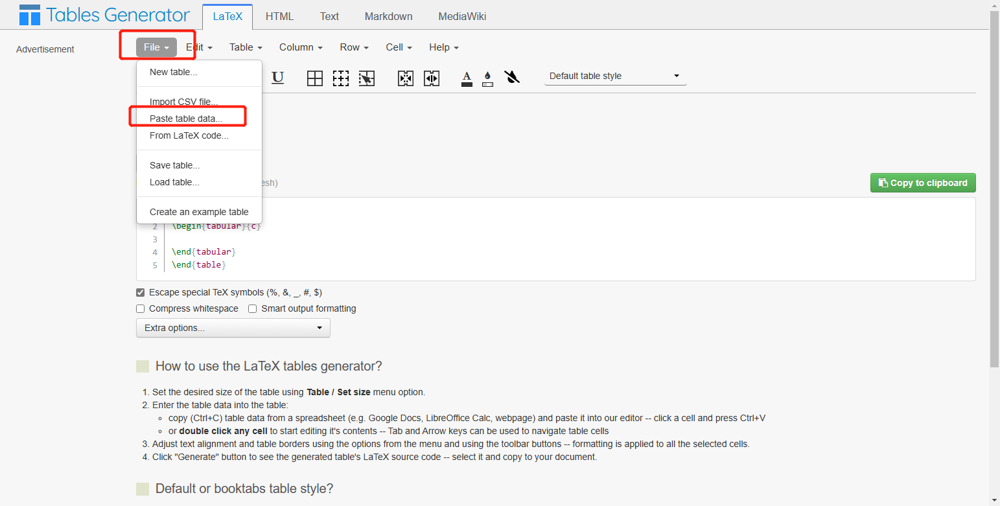
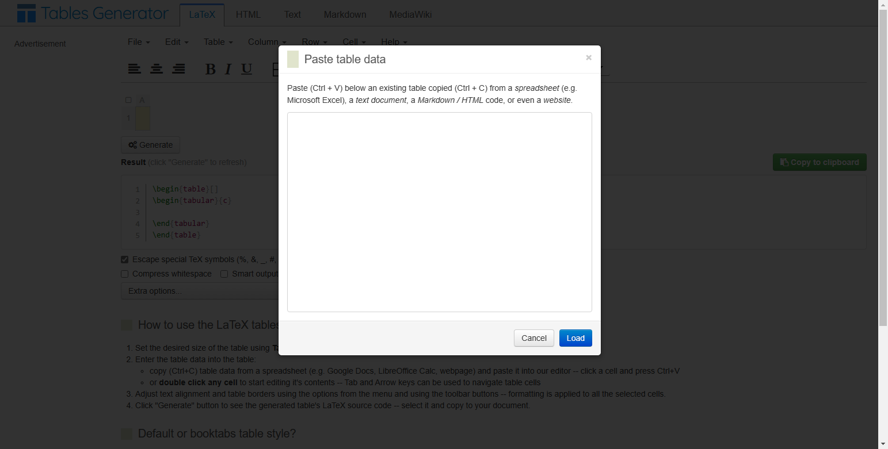
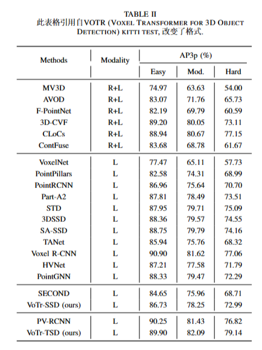
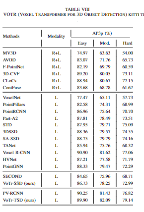
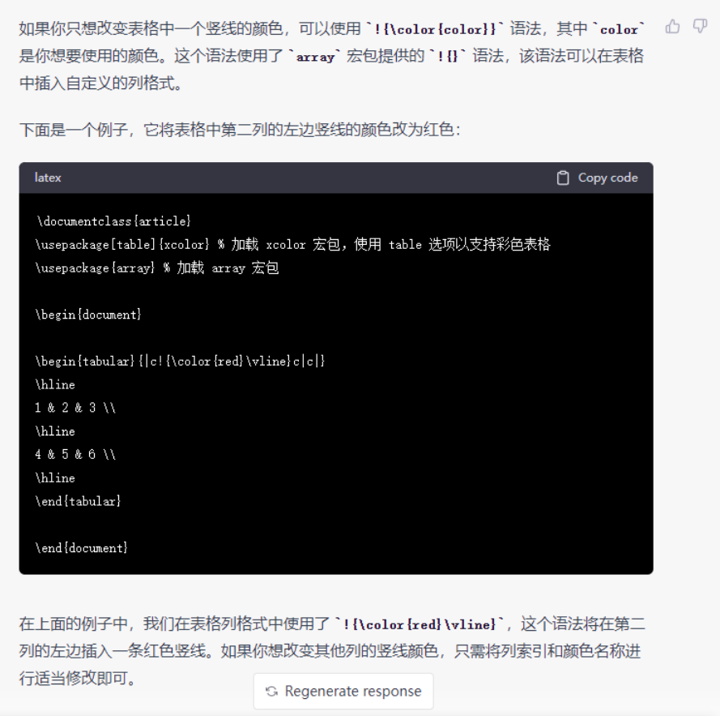

# 6.越野自动驾驶

首先做好一个excel表格。

然后打开网站[https://www.tablesgenerator.com/#](https://www.tablesgenerator.com/#)



将做好的excel表格粘贴到下面的框中




```latex
\begin{table}[t]

\caption{此表格引用自VOTR (Voxel Transformer for 3D Object Detection) kitti test, 改变了格式.}
\renewcommand\arraystretch{1.3}
\setlength{\tabcolsep}{3.5mm}{

\begin{tabular}{c|c|c|c|c}
\toprule
\multirow{2}{*}{Methods} & \multirow{2}{*}{Modality} & \multicolumn{3}{c}{AP3p (\%)} \\ \cmidrule(r){3-5} 
                         &                           & Easy     & Mod.     & Hard    \\ \midrule
MV3D                     & R+L                       & 74.97    & 63.63    & 54.00   \\
AVOD                     & R+L                       & 83.07    & 71.76    & 65.73   \\
F-PointNet               & R+L                       & 82.19    & 69.79    & 60.59   \\
3D-CVF                   & R+L                       & 89.20    & 80.05    & 73.11   \\
CLoCs                    & R+L                       & 88.94    & 80.67    & 77.15   \\
ContFuse                 & R+L                       & 83.68    & 68.78    & 61.67   \\ \midrule
VoxelNet                 & L                         & 77.47    & 65.11    & 57.73   \\
PointPillars             & L                         & 82.58    & 74.31    & 68.99   \\
PointRCNN                & L                         & 86.96    & 75.64    & 70.70   \\
Part-A2                  & L                         & 87.81    & 78.49    & 73.51   \\
STD                      & L                         & 87.95    & 79.71    & 75.09   \\
3DSSD                    & L                         & 88.36    & 79.57    & 74.55   \\
SA-SSD                   & L                         & 88.75    & 79.79    & 74.16   \\
TANet                    & L                         & 85.94    & 75.76    & 68.32   \\
Voxel R-CNN              & L                         & 90.90    & 81.62    & 77.06   \\
HVNet                    & L                         & 87.21    & 77.58    & 71.79   \\
PointGNN                 & L                         & 88.33    & 79.47    & 72.29   \\ \midrule
SECOND                   & L                         & 84.65    & 75.96    & 68.71   \\
VoTr-SSD (ours)          & L                         & 86.73    & 78.25    & 72.99   \\ \midrule
PV-RCNN                  & L                         & 90.25    & 81.43    & 76.82   \\
VoTr-TSD (ours)          & L                         & 89.90    & 82.09    & 79.14   \\ \bottomrule
\end{tabular}
\label{tab_kitti_test}
\end{table}
```

下面表格引用自VOTR (Voxel Transformer for 3D Object Detection )



\midrule \cmidrule(r) \bottomrule  竖线和横线之间的间隔。


对表格内容进行左对齐：以下代码仅对第一列内容左对齐 (1)\begin{tabular}{@{}@{\extracolsep{\fill}}l|c|c|c|c @{}}设置l的列即为左对齐

```latex
\begin{table}[t]

\caption{此表格引用自VOTR (Voxel Transformer for 3D Object Detection) kitti test, 改变了格式.}
\renewcommand\arraystretch{1.3}
\setlength{\tabcolsep}{3.5mm}{

\begin{tabular}{@{}@{\extracolsep{\fill}}l|c|c|c|c @{}}
\toprule
\multirow{2}{*}{Methods} & \multirow{2}{*}{Modality} & \multicolumn{3}{c}{AP3p (\%)} \\ \cmidrule(r){3-5} 
                         &                           & Easy     & Mod.     & Hard    \\ \midrule
MV3D                     & R+L                       & 74.97    & 63.63    & 54.00   \\
AVOD                     & R+L                       & 83.07    & 71.76    & 65.73   \\
F-PointNet               & R+L                       & 82.19    & 69.79    & 60.59   \\
3D-CVF                   & R+L                       & 89.20    & 80.05    & 73.11   \\
CLoCs                    & R+L                       & 88.94    & 80.67    & 77.15   \\
ContFuse                 & R+L                       & 83.68    & 68.78    & 61.67   \\ \midrule
VoxelNet                 & L                         & 77.47    & 65.11    & 57.73   \\
PointPillars             & L                         & 82.58    & 74.31    & 68.99   \\
PointRCNN                & L                         & 86.96    & 75.64    & 70.70   \\
Part-A2                  & L                         & 87.81    & 78.49    & 73.51   \\
STD                      & L                         & 87.95    & 79.71    & 75.09   \\
3DSSD                    & L                         & 88.36    & 79.57    & 74.55   \\
SA-SSD                   & L                         & 88.75    & 79.79    & 74.16   \\
TANet                    & L                         & 85.94    & 75.76    & 68.32   \\
Voxel R-CNN              & L                         & 90.90    & 81.62    & 77.06   \\
HVNet                    & L                         & 87.21    & 77.58    & 71.79   \\
PointGNN                 & L                         & 88.33    & 79.47    & 72.29   \\ \midrule
SECOND                   & L                         & 84.65    & 75.96    & 68.71   \\
VoTr-SSD (ours)          & L                         & 86.73    & 78.25    & 72.99   \\ \midrule
PV-RCNN                  & L                         & 90.25    & 81.43    & 76.82   \\
VoTr-TSD (ours)          & L                         & 89.90    & 82.09    & 79.14   \\ \bottomrule
\end{tabular}
\label{tab_kitti_test}
\end{table}
```

 表格引用于VOTR (Voxel Transformer for 3D Object Detection )


 设置表格中单一竖线的颜色方法：（有时对表格某一行进行颜色填充时，颜色可能会溢出，可以在最前端增加白色竖线来解决）。




> 更新: 2023-05-05 14:05:25  
> 原文: <https://3dcv.yuque.com/org-wiki-3dcv-mm1l0t/ysgfp9/srfuncgco1gobqqn_qcr834>