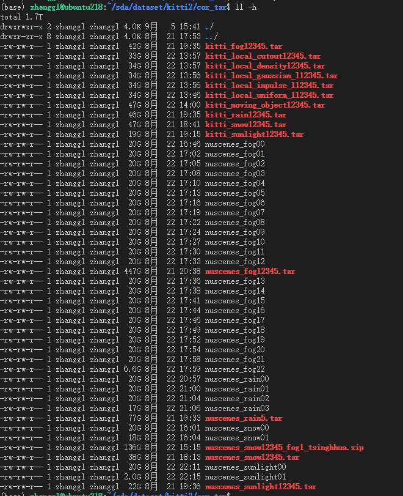
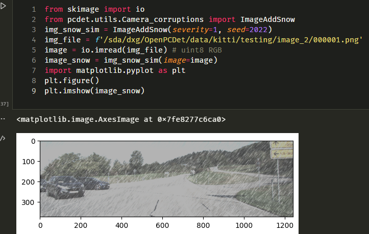
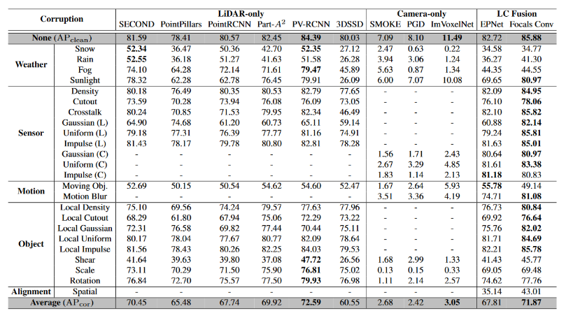
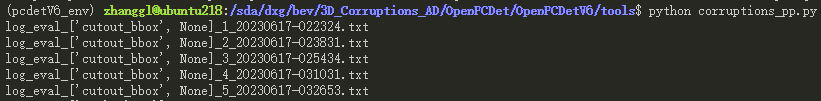
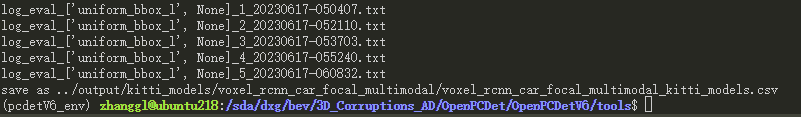
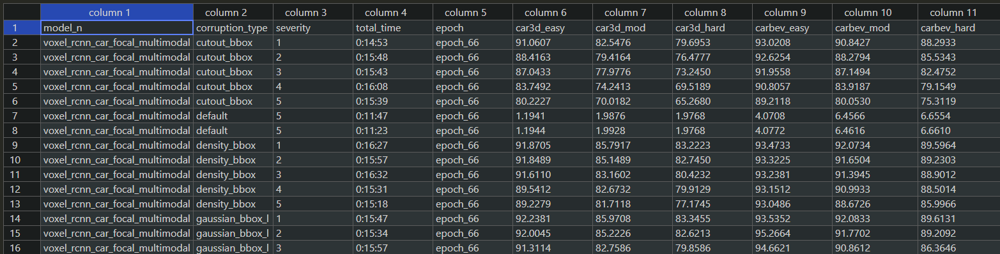
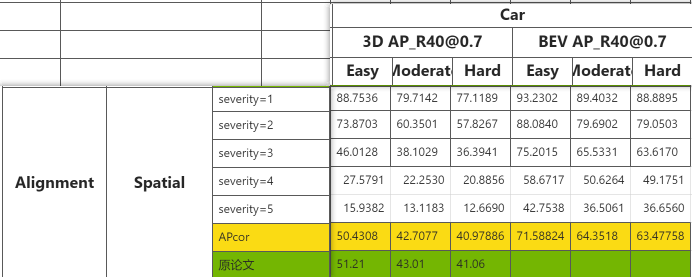

# 3D_Corruptions_AD，KITTI-C，nus-C，实现人：鑫光

耕轮机器(4\*A100(80G)) ：/sda/dxg/3D\_Corruptions\_AD

**该文档在读之前强调几个地方**（之前在文档结尾写的大家看不到，所以现在放在文档开头了！！！）：

:::info
修改和新增文件都是必须的，本文档保证改完这些代码仍然能用原版命令跑test。如果改完之后不能跑了，请检查哪里加错代码了。

:::

:::info
BEVFusion是自己写的dataloader，因此，当我们迁移nuScenes-C到别人的方法上时，注意类型差异。详见[https://3dcv.yuque.com/org-wiki-3dcv-mm1l0t/ysgfp9/dm5qqwv4qx9buztp#kKbR2](#kKbR2)

:::

:::info
论文一共提供了27种噪声，可以选择添加单个噪声去测试。在使用命令测噪声之前，先在 `test_time_aug.py`或者 `kitti_dataset.py`看一下是否添加了这个噪声。

如果没有在`test_time_aug.py`加gaussian噪声，直接加`--corruptions gaussian None`是不会生效的（**等同于不加噪声的推理**）。

:::

1. snow在线加的方式与论文结果不一致。可使用清华提供的snow离线数据集推理，详见：[https://3dcv.yuque.com/org-wiki-3dcv-mm1l0t/ysgfp9/dm5qqwv4qx9buztp#bZjTD](#bZjTD)
2. 3D\_Corruptions的环境是一定要装的[https://3dcv.yuque.com/org-wiki-3dcv-mm1l0t/ysgfp9/dm5qqwv4qx9buztp#peU9Y](#peU9Y)
3. 如果是服务器没有装Open3d,也为报一个莫名的错，解决方法就是注释掉 `import open3d`或者 `pip install open3d`
4. nuScenes多了一个temporal Aligmentation，他与作者提供的结果不一致。
5. KITTI-C的Shear,Scale,Rotation是不支持在OpenPCDet上直接加的，需要通过mmdet3d推理的时候离线保存。

离线数据集已上传到百度网盘：我的网盘/database/3D\_Corruptions\_AD/



nuscenes数据集是分卷压缩，解压前需要先合并成一个文件。

```shell
cat nuscenes_sunlight00 nuscenes_sunlight01 > sunlight.tar
tar -xvf sunlight.tar
```

# KITTI-C

基于OpenPCDetV0.6.0

```shell
git clone https://github.com/thu-ml/3D_Corruptions_AD.git
git clone https://github.com/open-mmlab/OpenPCDet.git
```

## 目录结构：

> 新增文件或者修改文件后面加\*

```shell
3D_Corruptions_AD
 |- OpenPCdet
 		|- OpenPCdet //这个是V0.5.2,是作者提供的
  	|- OpenPCdetV6* //这是我们要用的V0.6.0
    	 |- output //推理结果保存在这里
 	     |- pcdet
 	        |- datasets
 	          |- kitti
 	            |- corruptions_utils*
 	            |- Camera_currutpions.py*
 	            |- Lidar_corruptions.py*
 	            |- currutpions_config.py*
 	            |- kitti_dataset.py*
 	            |- ...
 	     |- tools
 	        |- corruptions_pp.py* // 用于将output下的结果转为csv文件
 	        |- corruptions.sh* // 用于批量执行多个带噪声数据集
 	        |- test.py
 	        └- ...
 	     └- ...
 |- Transfusion
 |- utils
 |- Camera_corruptions.py
 |- Lidar_corruptions.py
 |- test.py*
 └- ...
```

## 配置环境

### openPCDetV0.6.0 环境

CUDA torch版本以OpenPCDetV0.6.0为准

<https://github.com/open-mmlab/OpenPCDet/blob/master/docs/INSTALL.md>

:::info
配完OpenPCDet的环境后先测一下原版推理再执行下面的步骤。

:::

```python
cd OpenPCdetV6/tools
python test.py --cfg_file cfgs/kitti_models/voxel_rcnn_car_focal_multimodal.yaml --batch_size 16 --ckpt ../checkpoints/voxelrcnn_focal_multimodal_85.66.pth
```

使用的版本参考：

```markdown
CUDA 113
python 3.8
torch 1.10+cu113
torchvision 0.11.2+cu113

numba=0.57.0
setuptools=67.8

imgaug 0.4.0
ImageAug 0.1.0.post0
open3d 0.15.2
h5py=3.8.0
distortion 0.1.31

imagecorruptions 1.1.2

PyMieScatt 1.8.1.1
```

### 3D\_Corruptions\_AD 环境

```python
> 3D_Corruptions_AD
pip install imgaug
pip install open3d
pip install h5py
pip install distortion
>> snow
pip install imagecorruptions
>> rain
pip install PyMieScatt
>> fog
git clone https://gitclone.com/github.com/MartinHahner/LiDAR_fog_sim.git
cp -r integral_lookup_tables/ 3D_Corruptions_AD/OpenPCDet/OpenPCDetV6/pcdet/utils/corruptions_utils/
```

:::info
新建文件`3D_Corruptions_AD/test.py`执行下列代码测试3D\_corruptions\_AD可用

:::

```python
from skimage import io
from pcdet.utils.Camera_corruptions import ImageAddSnow
img_snow_sim = ImageAddSnow(severity=1, seed=2022)
img_file = f'/sda/dxg/OpenPCDet/data/kitti/testing/image_2/000001.png'
image = io.imread(img_file) # uint8 RGB
image_snow = img_snow_sim(image=image)
import matplotlib.pyplot as plt
plt.figure()
plt.imshow(image_snow)
```

## 

```python
import numpy as np
import open3d
from Lidar_corruptions import scene_glare_noise
from visual_utils import open3d_vis_utils as V
points = np.fromfile(f'/sda/dxg/OpenPCDet/data/kitti/training/velodyne_rain_1/{sample_idx}.bin', dtype=np.float32, count=-1).reshape([-1,4])
V.draw_scenes(points=points)
points_cor = scene_glare_noise(pointcluod=points,severity=5)
V.draw_scenes(points=points_cor)
```

##

## 执行如下命令得到上述目录结构

### 复制corruptions噪声文件

```shell
mv OpenPCDet 3D_Corruptions_AD/OpenPCdet/OpenPCdetV6
cp 3D_Corruptions_AD/Camera_corruptions.py 3D_Corruptions_AD/OpenPCdet/OpenPCdetV6/datasets/kitti/Camera_corruptions.py
cp 3D_Corruptions_AD/Lidar_corruptions.py 3D_Corruptions_AD/OpenPCdet/OpenPCdetV6/datasets/kitti/Lidar_corruptions.py
cp 3D_Corruptions_AD/utils 3D_Corruptions_AD/OpenPCdet/OpenPCdetV6/datasets/kitti/corruptions_utils
```

### 新增文件内容如下：

#### pcdet/dataset/kitti/currutpions\_config.py

```shell
class Singleton(type):
    _instances = {}

    def __call__(cls, *args, **kwargs):
        if cls not in cls._instances:
            cls._instances[cls] = super(Singleton, cls).__call__(*args, **kwargs)
        return cls._instances[cls]

class Corruptions_mode(metaclass=Singleton):
    def __init__(self) -> None:
        print('Corruptions_mode init')
            
    def set_corruption(self, corruption_type_l=None, corruption_type_c=None,severity=0) -> None:
        if severity==0:
            self.corruption_type_l = None
            self.corruption_type_c = None
        else:
            self.corruption_type_l = corruption_type_l
            self.corruption_type_c = corruption_type_c
        self.severity = severity
        
    def get_corruption(self):
        return self.corruption_type_l, self.corruption_type_c, self.severity
    
    def set_offline_flag(self, isOffline):
        self.isOffline = isOffline
    def get_offline_flag(self):
        return self.isOffline
        
    def set_save_flag(self, save_flag):
        if self.isOffline and save_flag:
            # raise ValueError('---'*10 + '离线数据不保存！' + '---'*10)
            print('---'*10 + '读取离线噪声数据集，不需要再保存该噪声数据集！' + '---'*10)
            self.save_flag = False
        self.save_flag = save_flag
        
    def get_save_flag(self):
        return self.save_flag
    
    def set_model_n(self, model_n):
        self.model_n = model_n
        
    def get_model_n(self):
        try:
            return self.model_n
        except:
            return None

    
```

#### tools/corruptions\_pp.py

```python
'''
读取指定目录下的txt
保存到同一个csv文件下
'''
import pandas as pd
import os
import argparse
from datetime import datetime


def find_roi_str(line, rois):
    for roi in rois:
        index = line.find(roi)
        if index != -1:
            return index, roi
    return -1, '' # default return


def log_process(model_n, corruption, severity, log_path, csv_f):
    # TODO select window
    log_file_path = log_path
    roi_str = ['Performance of EPOCH', \
         'Car AP_R40@0.70, 0.70, 0.70:', \
         'Pedestrian AP_R40@0.50, 0.50, 0.50:', \
         'Cyclist AP_R40@0.50, 0.50, 0.50:']
    epoch_num_list = []
    result = {}
    date_format = '%Y-%m-%d %H:%M:%S'
    # load txt
    with open(log_file_path, 'r') as f:
        lines = f.readlines()
        # calculate timediff
        start_time_str = lines[0][:19]
        end_time_str = lines[-1][:19]
        start_time = datetime.strptime(start_time_str, date_format)
        end_time = datetime.strptime(end_time_str, date_format)
        time_diff = str(end_time - start_time)
        for i, line in enumerate(lines):
            
            line = line.rstrip()
            if len(line)==0: continue


            # mathcing str
            index, roi = find_roi_str(line, roi_str)
            
            # processing
            if roi == roi_str[0]: 
                cur_epoch = line[index+1+len(roi_str[0]):index+len(roi_str[0])+3]
                epoch_num_list.append(cur_epoch)
                result[f'epoch_{cur_epoch}'] = {} # new epoch
            elif roi in roi_str:
                subdict = {}
                line = lines[i+2].rstrip()
                line.rstrip()
                roi, _ = roi.split(' ', 1)
                item, value = line.split(':', 1)
                item, _ = item.split(' ', 1)
                value_list = value.split(', ')


                subdict[roi.lower()] = {item : value_list}


                line = lines[i+3].rstrip()
                line.rstrip()
                item, value = line.split(':', 1)
                item, _ = item.split(' ', 1)
                value_list = value.split(', ')
                subdict[roi.lower()].update({item: value_list})
                result[f'epoch_{cur_epoch}'].update(subdict) 
    
    # three cls
    for epoch, data in result.items():
        data1 = data['car']['3d'] + data['car']['bev']
        try:
            data1 += data['pedestrian']['3d'] + data['pedestrian']['bev'] 
            data1 += data['cyclist']['3d'] + data['pedestrian']['bev']
        except:
            data1 += ['NaN', 'NaN', 'NaN'] + ['NaN', 'NaN', 'NaN']
            data1 += ['NaN', 'NaN', 'NaN'] + ['NaN', 'NaN', 'NaN']
        
        csv_f.loc[len(csv_f.index)] = [model_n]+ [corruption]+ [severity] + [time_diff] + [epoch] + data1
    # new_df.to_csv(args.output, index=False)


def main(args):
    # 读取该目录下的txt日志
    path = args.path
    dataset = args.dataset
    if dataset == 'kitti':
        dataset = 'kitti_models'
    else:
        raise NotImplementedError
    model = args.model


    new_df = pd.DataFrame(columns=[
                            'model_n', 'corruption_type', 'severity', 'total_time', 'epoch',\
                            'car3d_easy', 'car3d_mod', 'car3d_hard',\
                            'carbev_easy', 'carbev_mod', 'carbev_hard',\
                            'ped3d_easy', 'ped3d_mod', 'ped3d_hard',\
                            'pedbev_easy', 'pedbev_mod', 'pedbev_hard',\
                            'cyc3d_easy', 'cyc3d_mod', 'cyc3d_hard',\
                            'cycbev_easy', 'cycbev_mod', 'cycbev_hard'])


    dir = os.path.join(path, dataset, model) # output/model
    for corruption in sorted(os.listdir(dir)):
        if 'csv' in corruption:
            continue
        dir2 = os.path.join(dir, corruption, 'eval') # output/model/corruption/eval
        for epoch in sorted(os.listdir(dir2)):
            dir3 = os.path.join(dir2, epoch, 'val', 'default') # output/model/corruption/eval/epoch/val/default/
            for log in sorted(os.listdir(dir3)):
                if 'pkl' in log:
                    continue
                print(log)
                model_n = model
                corruption = corruption
                severity = log[log.find(']')+2]
                timestmp = log[log.find(']')+4:-4]
                log_p = os.path.join(dir3, log) # output/model/corruption/eval/epoch/val/default/*.txt
                log_process(model_n, corruption, severity, log_p, new_df)
                
    out_file = os.path.join(dir, f'{model}_{dataset}.csv')
    new_df.to_csv(out_file, index=False)
    print(f'save as {out_file}')


if __name__ == '__main__':
    parser = argparse.ArgumentParser(description='args')
    parser.add_argument('--path', type=str, default='../output')
    parser.add_argument('--dataset', type=str, default='kitti')
    parser.add_argument('--model', type=str, default='voxel_rcnn_car_focal_multimodal')
    args = parser.parse_args()


    main(args)
```

#### tools/corruptions.sh

```python
#####################################
#               选择模型
#####################################
# model_n=pointpillar
model_n=voxel_rcnn_car_focal_multimodal
# cfg_file=cfgs/kitti_models/pointpillar.yaml
cfg_file=cfgs/kitti_models/voxel_rcnn_car_focal_multimodal.yaml
# ckpt=../checkpoints/pointpillar_7728.pth
ckpt=../checkpoints/voxelrcnn_focal_multimodal_85.66.pth


#####################################
#          选择批量处理的噪声
#          下面列出了全部的噪声
#####################################

# corruptions
weather=(snow rain fog sunlight)
sensor=(density cutout crosstalk gaussian_l uniform_l impulse_l gaussian_c uniform_c impulse_c)
motion=(compensation moving_bbox motion_blur)
object=(density_bbox cutout_bbox gaussian_bbox_l uniform_bbox_l impulse_bbox_l shear scale rotation)
alignment=(spatial_aligment temporal_aligment)
all=(${weather[@]} ${sensor[@]} ${motion[@]} ${object[@]} ${alignment[@]})

# 执行单个噪声
cor_list=(sunlight)
# 执行多个噪声
# cor_list=(gaussian_c uniform_c impulse_c)
# cor_list 对应 62行 for corruptions in ${cor_list[@]}

#####################################
#          缩短推理时间的参数
# 
#####################################
workers=4
batch_size=16

singleGPU=False # 单卡/多卡推理
NUMGPU=4

# 是否执行不加噪声的推理
clean_flag=False


# export CUDA_VISIBLE_DEVICES=0,1,2,3
# rm -rf ../output/*


if [ $clean_flag == True ]
then
echo ">>>>>>>>>>>>>>>>>>>>>>" "corruptions None"
echo ">>>>>>>>>>>>>>>>>>>>>>" "Lidar None"
echo ">>>>>>>>>>>>>>>>>>>>>>" "Camera None"

echo ">>>>>>>>>>>>>>>>>>>>>>" "severity 0"
echo "python test.py --cfg_file $cfg_file --workers $workers --batch_size $batch_size --ckpt $ckpt --corruptions None None --severity 0 --extra_tag None &"
python test.py --cfg_file $cfg_file --workers $workers --batch_size $batch_size --ckpt $ckpt --corruptions None None --severity 0 --extra_tag None &
wait
fi

for corruptions in ${cor_list[@]} # 遍历指定子集
do
if [ $corruptions == snow ]
then
corruptions_l=snow
corruptions_c=snow
elif [ $corruptions == rain ]
then
corruptions_l=rain
corruptions_c=rain
elif [ $corruptions == fog ]
then
corruptions_l=fog
corruptions_c=fog
elif [ $corruptions == sunlight ]
then
corruptions_l=sunlight
corruptions_c=sunlight
elif [ $corruptions == density ]
then
corruptions_l=density
corruptions_c=None
elif [ $corruptions == cutout ]
then
corruptions_l=cutout
corruptions_c=None
elif [ $corruptions == crosstalk ]
then
corruptions_l=crosstalk
corruptions_c=None
elif [ $corruptions == gaussian_l ]
then
corruptions_l=gaussian_l
corruptions_c=None
elif [ $corruptions == uniform_l ]
then
corruptions_l=uniform_l
corruptions_c=None
elif [ $corruptions == impulse_l ]
then
corruptions_l=impulse_l
corruptions_c=None
elif [ $corruptions == gaussian_c ]
then
corruptions_l=None
corruptions_c=gaussian_c
elif [ $corruptions == uniform_c ]
then
corruptions_l=None
corruptions_c=uniform_c
elif [ $corruptions == impulse_c ]
then
corruptions_l=None
corruptions_c=impulse_c
elif [ $corruptions == compensation ]
then
corruptions_l=compensation
corruptions_c=None
elif [ $corruptions == moving_bbox ]
then
corruptions_l=moving_bbox
corruptions_c=moving_bbox
elif [ $corruptions == motion_blur ]
then
corruptions_l=None
corruptions_c=motion_blur
elif [ $corruptions == density_bbox ]
then
corruptions_l=density_bbox
corruptions_c=density_bbox
elif [ $corruptions == cutout_bbox ]
then
corruptions_l=cutout_bbox
corruptions_c=None
elif [ $corruptions == gaussian_bbox_l ]
then
corruptions_l=gaussian_bbox_l
corruptions_c=None
elif [ $corruptions == uniform_bbox_l ]
then
corruptions_l=uniform_bbox_l
corruptions_c=None
elif [ $corruptions == impulse_bbox_l ]
then
corruptions_l=impulse_bbox_l
corruptions_c=None
elif [ $corruptions == shear_bbox ]
then
corruptions_l=shear_bbox
corruptions_c=shear_bbox
elif [ $corruptions == scale_bbox ]
then
corruptions_l=scale_bbox
corruptions_c=scale_bbox
elif [ $corruptions == rotation_bbox ]
then
corruptions_l=rotation_bbox
corruptions_c=rotation_bbox
elif [ $corruptions == spatial_aligment ]
then
corruptions_l=spatial_aligment
corruptions_c=None
elif [ $corruptions == temporal_aligment ]
then
corruptions_l=temporal_aligment
corruptions_c=None
else
corruptions_l=None
corruptions_c=None
fi

echo ">>>>>>>>>>>>>>>>>>>>>>" "corruptions" $corruptions
echo ">>>>>>>>>>>>>>>>>>>>>>" "Lidar" $corruptions_l
echo ">>>>>>>>>>>>>>>>>>>>>>" "Camera" $corruptions_c

for severity in $(seq 1 5); do
echo ">>>>>>>>>>>>>>>>>>>>>>" "severity" $severity
# 单卡
if [ $singleGPU == True ]
then
echo "python test.py --cfg_file $cfg_file --workers $workers --batch_size $batch_size --ckpt $ckpt --corruptions $corruptions_l $corruptions_c --severity $severity --extra_tag $corruptions &"
python test.py --cfg_file $cfg_file --workers $workers \
    --batch_size $batch_size --ckpt $ckpt --corruptions $corruptions_l $corruptions_c \
    --severity $severity --extra_tag $corruptions &
else
# 多卡
echo "bash scripts/dist_test.sh $NUMGPU --cfg_file $cfg_file --workers $workers --batch_size $batch_size --ckpt $ckpt --corruptions $corruptions_l $corruptions_c --severity $severity --extra_tag $corruptions &"
    
bash scripts/dist_test.sh $NUMGPU --cfg_file $cfg_file --workers $workers --batch_size $batch_size --ckpt $ckpt --corruptions $corruptions_l $corruptions_c \
    --severity $severity --extra_tag $corruptions &
fi
wait

done

done

python corruptions_pp.py --model $model_n

```

### 修改文件内容如下：

#### tools/test.py

新增参数

```python
# line21~26
#! modified by dxg: 自定义输入类型
def none_or_str(value):
    if value == 'None':
        return None
    else:
        return value

# line51~55
#! modified by dxg: add corruptions, severity
parser.add_argument('--corruptions', nargs=2, type=none_or_str, default=[None, None], help='corruptions type')
parser.add_argument('--severity', type=int, default=0, help='corruptions severity level, 0,1,2,3,4,5. 0 means clean.')
parser.add_argument('--offline_flag', action='store_true',default=False, help='true: load offline corrpuption data; false: online generate corruptions data. default false')
parser.add_argument('--save_cor_flag', action='store_true',default=False, help='true: generate offline corruptions data. default false')
```

设置全局变量

```python
# line186~191
#! dxg
from pcdet.datasets.kitti.corruptions_config import Corruptions_mode
cm = Corruptions_mode() # 默认不加噪声，在线，不保存数据
cm.set_corruption(corruption_type_l=args.corruptions[0], corruption_type_c=args.corruptions[1], severity=args.severity)
cm.set_offline_flag(args.offline_flag) # 使用 在线/离线 噪声数据
cm.set_save_flag(args.save_cor_flag) # 使用在线噪声数据时，是否保存为离线噪声
```

#### pcdet/datasets/kitti/kitti\_dataset.py

```python
class KittiDataset(DatasetTemplate):
    def __init__(self):
        #! modified by dxg: add corruptions, severity
        from pcdet.datasets.kitti.corruptions_config import Corruptions_mode
        cm = Corruptions_mode()
        self.corruption_l, self.corruption_c, self.severity = cm.get_corruption()
        self.offline_flag = cm.get_offline_flag()
        self.save_cor_flag = cm.get_save_flag()

	def __getitem__(self, index):
        # self.gt_boxes_lidar 要在 get_lidar之前声明
        # self.lidar2img 要在get_image之前声明
        ...
        if 'annos' in info:
            ...
            self.gt_boxes_lidar = box_utils.boxes3d_kitti_camera_to_lidar(self.gt_boxes_camera, calib) #! dxg
        	...
        if "points" in get_item_list:
        	...
        if "calib_matricies" in get_item_list:
            input_dict["trans_lidar_to_cam"], input_dict["trans_cam_to_img"] = kitti_utils.calib_to_matricies(calib)
            self.lidar2img = input_dict["trans_lidar_to_cam"] #! dxg
    	if "images" in get_item_list:
            input_dict['images'] = self.get_image(sample_idx)
```

***

:::info

#### **!!!到这里基础文件添加完成，确保在加完这些文件后仍然能执行原版推理**

:::

### 添加单个噪声：

**以Snow为例：**

```python
class KittiDataset(DatasetTemplate):
    def __init__(self):
        ...
        if self.offline_flag == False:
        	self.camera_sim_init() #! dxg 离线不需要初始化
    def camera_sim_init(self):
        '''
        Snow
        '''
        if self.corruption_c=='snow':
            from .Camera_corruptions import ImageAddSnow
            self.snow_sim = ImageAddSnow(self.severity, seed=2022)

    def get_lidar(self, idx):
        # 读取数据集
        if self.offline_flag and self.corruption_l != None:
            # 加载离线噪声数据集
            lidar_file = self.root_split_path / f'velodyne_{self.corruption_l}_{self.severity}' / ('%s.bin' % idx)
            assert lidar_file.exists()
        else:
            # 加载原数据集
            lidar_file = self.root_split_path / 'velodyne' / ('%s.bin' % idx)
        assert lidar_file.exists()
        data = np.fromfile(str(lidar_file), dtype=np.float32).reshape(-1, 4)
        # 在线加噪声
        if self.severity!=0 and self.offline_flag==False:
            # 在线加噪声
            if self.corruption_l != None:
                '''
                Snow
                '''
                if self.corruption_l== 'snow':
                    from .LiDAR_corruptions import snow_sim
                    data = snow_sim(data, self.severity)
                    if self.save_cor_flag:
                        new_pointcloud_p = self.root_split_path / f'velodyne_{self.corruption_l}_{self.severity}'
                        new_pointcloud_f = new_pointcloud_p / ('%s.bin' % idx)
                        os.makedirs(new_pointcloud_p, exist_ok=True)
                        data.astype(np.float32).tofile(new_pointcloud_f)
        return data
```

**加完之后，执行如下命令进行推理：**

```python
# --corruptions {雷达噪声/对齐噪声} {相机噪声} 
# --severity {扰乱等级1-5} 
# --extra_tag {噪声名字}
python test.py --cfg_file cfgs/kitti_models/voxel_rcnn_car_focal_multimodal.yaml --batch_size 16 --ckpt ../checkpoints/voxelrcnn_focal_multimodal_85.66.pth --corruptions snow snow --severity 5 --extra_tag snow
```

:::info
**这里只是单个噪声在severity=5的分数，如果想要得到文章中snow噪声分数，还要推理severity=1，2，3，4的结果并对其求均值。**

:::

**在线推理并保存离线数据集**

```python
# --save_cor_flag 保存离线数据
python test.py --cfg_file cfgs/kitti_models/voxel_rcnn_car_focal_multimodal.yaml --batch_size 16 --ckpt ../checkpoints/voxelrcnn_focal_multimodal_85.66.pth --corruptions snow snow --severity 5 --extra_tag snow --save_cor_flag
```

**离线数据保存到原数据集相同目录下:**

```python
kitti
 |- training
     |- image_2
     |- image_2_snow_5 // 离线噪声数据集
     |- velodyne
     |- velodyne_snow_5 // 离线噪声数据集
```

***

**使用离线噪声数据集推理**

```python
# --offline_flag 使用离线数据集
python test.py --cfg_file cfgs/kitti_models/voxel_rcnn_car_focal_multimodal.yaml --batch_size 16 --ckpt ../checkpoints/voxelrcnn_focal_multimodal_85.66.pth --corruptions snow snow --severity 5 --extra_tag snow --
```

***

**以spatial aligmentation为例：**

```python
class KittiDataset(DatasetTemplate):
        calib_file = self.root_split_path / 'calib' / ('%s.txt' % idx)
        assert calib_file.exists()
        calib = calibration_kitti.Calibration(calib_file)
        #! dxg add spatial aligment
        if self.corruptions[0] != None and self.corruptions[0] == "spatial_aligment":
            noise_calib = self.MAP_KITTI[self.corruptions[0]][0](ori_pose=calib.V2C, severity=self.severity)
            calib.V2C = noise_calib
        return calib
```

**加完之后，执行如下命令进行推理(默认在线加噪声)：**

```python
python test.py --cfg_file cfgs/kitti_models/voxel_rcnn_car_focal_multimodal.yaml --batch_size 16 --ckpt ../checkpoints/voxelrcnn_focal_multimodal_85.66.pth --corruptions spatial_aligment None --severity 5 --extra_tag spatial_aligment
```

:::info
**具体哪些噪声加在哪个位置，参照下面全部噪声的添加方式**

\*\*其他噪声的执行命令见  \*\*[**KITTI-C噪声列表**](#eLbT1)

:::

### 可添加的全部噪声：

```python
class KittiDataset(DatasetTemplate):

	def __init__(self):
        ...
        if self.offline_flag == False:
        	self.camera_sim_init() #! dxg 离线不需要初始化

	def camera_sim_init(self):
        '''
        Snow
        '''
        if self.corruption_c=='snow':
            from .Camera_corruptions import ImageAddSnow
            self.snow_sim = ImageAddSnow(self.severity, seed=2022)
        '''
        Rain
        '''
        if self.corruption_c=='rain':
            from .Camera_corruptions import ImageAddRain
            self.rain_sim = ImageAddRain(self.severity, seed=2022)
        '''
        Fog
        '''
        if self.corruption_c=='fog':
            from .Camera_corruptions import ImageAddFog
            self.fog_sim = ImageAddFog(self.severity, seed=2022)
        '''
        Sunlight
        '''
        if self.corruption_c=='sunlight':
            from .Camera_corruptions import ImagePointAddSun, ImageAddSunMono
            self.sun_sim = ImagePointAddSun(self.severity)
            self.sun_sim_mono = ImagePointAddSun(self.severity)
        '''
        Moving Obj. and Motion Blur
        '''
        if self.corruption_c=='moving_bbox' or self.corruption_c=='motion_blur':
            from .Camera_corruptions import ImageBBoxMotionBlurFrontBack, ImageBBoxMotionBlurLeftRight, ImageBBoxMotionBlurFrontBackMono, ImageBBoxMotionBlurLeftRightMono
            self.object_motion_sim_frontback = ImageBBoxMotionBlurFrontBack(
                severity=self.severity,
                corrput_list=[0.02 * i for i in range(1, 6)],
            )
            self.object_motion_sim_leftright = ImageBBoxMotionBlurLeftRight(
                severity=self.severity,
                corrput_list=[0.02 * i for i in range(1, 6)],
            )
            self.object_motion_sim_frontback_mono = ImageBBoxMotionBlurFrontBackMono(
                severity=self.severity,
                corrput_list=[0.02 * i for i in range(1, 6)],
            )
            self.object_motion_sim_leftright_mono = ImageBBoxMotionBlurLeftRightMono(
                severity=self.severity,
                corrput_list=[0.02 * i for i in range(1, 6)],
            )
        '''
        Gaussian(C)
        '''
        if self.corruption_c=='gaussian':
            from .Camera_corruptions import ImageAddGaussianNoise
            self.gaussian_sim = ImageAddGaussianNoise(self.severity, seed=2022)
        '''
        Uniform(C)
        '''
        if self.corruption_c=='uniform':
            from .Camera_corruptions import ImageAddUniformNoise
            self.uniform_sim = ImageAddUniformNoise(self.severity)
        '''
        Impulse(C)
        '''
        if self.corruption_c=='impulse':
            from .Camera_corruptions import ImageAddImpulseNoise
            self.impulse_sim = ImageAddImpulseNoise(self.severity, seed=2022)
    #! modified by dxg: corruptions for lidar
    def get_lidar(self, idx):
        # 读取数据集
        if self.offline_flag and self.corruption_l != None:
            # 加载离线噪声数据集
            lidar_file = self.root_split_path / f'velodyne_{self.corruption_l}_{self.severity}' / ('%s.bin' % idx)
            assert lidar_file.exists()
        else:
            # 加载原数据集
            lidar_file = self.root_split_path / 'velodyne' / ('%s.bin' % idx)
        assert lidar_file.exists()
        data = np.fromfile(str(lidar_file), dtype=np.float32).reshape(-1, 4)
        
        # 在线加噪声
        if self.severity!=0 and self.offline_flag==False:
            # 在线加噪声
            if self.corruption_l != None:
                '''
                Snow
                '''
                if self.corruption_l== 'snow':
                    from .LiDAR_corruptions import snow_sim
                    data = snow_sim(data, self.severity)
                    if self.save_cor_flag:
                        new_pointcloud_p = self.root_split_path / f'velodyne_{self.corruption_l}_{self.severity}'
                        new_pointcloud_f = new_pointcloud_p / ('%s.bin' % idx)
                        os.makedirs(new_pointcloud_p, exist_ok=True)
                        data.astype(np.float32).tofile(new_pointcloud_f)
                '''
                Rain
                '''
                if self.corruption_l== 'rain':
                    from .LiDAR_corruptions import rain_sim
                    data = rain_sim(data, self.severity)
                    if self.save_cor_flag:
                        new_pointcloud_p = self.root_split_path / f'velodyne_{self.corruption_l}_{self.severity}'
                        new_pointcloud_f = new_pointcloud_p / ('%s.bin' % idx)
                        os.makedirs(new_pointcloud_p, exist_ok=True)
                        data.astype(np.float32).tofile(new_pointcloud_f)
                '''
                Fog
                '''
                if self.corruption_l== 'fog':
                    from .LiDAR_corruptions import fog_sim
                    data = fog_sim(data, self.severity)
                    if self.save_cor_flag:
                        new_pointcloud_p = self.root_split_path / f'velodyne_{self.corruption_l}_{self.severity}'
                        new_pointcloud_f = new_pointcloud_p / ('%s.bin' % idx)
                        os.makedirs(new_pointcloud_p, exist_ok=True)
                        data.astype(np.float32).tofile(new_pointcloud_f)
                '''
                Sunlight
                '''
                if self.corruption_l== 'sunlight':
                    from .LiDAR_corruptions import scene_glare_noise
                    data = scene_glare_noise(data, self.severity)
                    if self.save_cor_flag:
                        new_pointcloud_p = self.root_split_path / f'velodyne_{self.corruption_l}_{self.severity}'
                        new_pointcloud_f = new_pointcloud_p / ('%s.bin' % idx)
                        os.makedirs(new_pointcloud_p, exist_ok=True)
                        data.astype(np.float32).tofile(new_pointcloud_f)
                '''
                Density
                '''
                if self.corruption_l== 'density':
                    from .LiDAR_corruptions import density_dec_global
                    data = density_dec_global(data, self.severity)
                    if self.save_cor_flag:
                        new_pointcloud_p = self.root_split_path / f'velodyne_{self.corruption_l}_{self.severity}'
                        new_pointcloud_f = new_pointcloud_p / ('%s.bin' % idx)
                        os.makedirs(new_pointcloud_p, exist_ok=True)
                        data.astype(np.float32).tofile(new_pointcloud_f)
                '''
                Cutout
                '''
                if self.corruption_l== 'cutout':
                    from .LiDAR_corruptions import cutout_local
                    data = cutout_local(data, self.severity)
                    if self.save_cor_flag:
                        new_pointcloud_p = self.root_split_path / f'velodyne_{self.corruption_l}_{self.severity}'
                        new_pointcloud_f = new_pointcloud_p / ('%s.bin' % idx)
                        os.makedirs(new_pointcloud_p, exist_ok=True)
                        data.astype(np.float32).tofile(new_pointcloud_f)
                '''
                Crosstalk
                '''
                if self.corruption_l== 'crosstalk':
                    from .LiDAR_corruptions import lidar_crosstalk_noise
                    data = lidar_crosstalk_noise(data, self.severity)
                    if self.save_cor_flag:
                        new_pointcloud_p = self.root_split_path / f'velodyne_{self.corruption_l}_{self.severity}'
                        new_pointcloud_f = new_pointcloud_p / ('%s.bin' % idx)
                        os.makedirs(new_pointcloud_p, exist_ok=True)
                        data.astype(np.float32).tofile(new_pointcloud_f)
                '''
                Gaussian(L)
                '''
                if self.corruption_l== 'gaussian':
                    from .LiDAR_corruptions import gaussian_noise
                    data = gaussian_noise(data, self.severity)
                    if self.save_cor_flag:
                        new_pointcloud_p = self.root_split_path / f'velodyne_{self.corruption_l}_{self.severity}'
                        new_pointcloud_f = new_pointcloud_p / ('%s.bin' % idx)
                        os.makedirs(new_pointcloud_p, exist_ok=True)
                        data.astype(np.float32).tofile(new_pointcloud_f)
                '''
                Uniform(L)
                '''
                if self.corruption_l== 'uniform':
                    from .LiDAR_corruptions import uniform_noise
                    data = uniform_noise(data, self.severity)
                    if self.save_cor_flag:
                        new_pointcloud_p = self.root_split_path / f'velodyne_{self.corruption_l}_{self.severity}'
                        new_pointcloud_f = new_pointcloud_p / ('%s.bin' % idx)
                        os.makedirs(new_pointcloud_p, exist_ok=True)
                        data.astype(np.float32).tofile(new_pointcloud_f)
                '''
                Impulse(L)
                '''
                if self.corruption_l== 'Impulse':
                    from .LiDAR_corruptions import impulse_noise
                    data = impulse_noise(data, self.severity)
                    if self.save_cor_flag:
                        new_pointcloud_p = self.root_split_path / f'velodyne_{self.corruption_l}_{self.severity}'
                        new_pointcloud_f = new_pointcloud_p / ('%s.bin' % idx)
                        os.makedirs(new_pointcloud_p, exist_ok=True)
                        data.astype(np.float32).tofile(new_pointcloud_f)
                '''
                Moving Obj.
                '''
                if self.corruption_l== 'moving_bbox':
                    from .LiDAR_corruptions import moving_noise_bbox
                    data = moving_noise_bbox(data, self.severity, bbox=[self.gt_boxes_lidar])
                    if self.save_cor_flag:
                        new_pointcloud_p = self.root_split_path / f'velodyne_{self.corruption_l}_{self.severity}'
                        new_pointcloud_f = new_pointcloud_p / ('%s.bin' % idx)
                        os.makedirs(new_pointcloud_p, exist_ok=True)
                        data.astype(np.float32).tofile(new_pointcloud_f)
                '''
                Local Density
                '''
                if self.corruption_l== 'density_bbox':
                    from .LiDAR_corruptions import density_dec_bbox
                    data = density_dec_bbox(data, self.severity, bbox=[self.gt_boxes_lidar])
                    if self.save_cor_flag:
                        new_pointcloud_p = self.root_split_path / f'velodyne_{self.corruption_l}_{self.severity}'
                        new_pointcloud_f = new_pointcloud_p / ('%s.bin' % idx)
                        os.makedirs(new_pointcloud_p, exist_ok=True)
                        data.astype(np.float32).tofile(new_pointcloud_f)
                '''
                Local Cutout
                '''
                if self.corruption_l== 'cutout_bbox':
                    from .LiDAR_corruptions import cutout_bbox
                    data = cutout_bbox(data, self.severity, bbox=[self.gt_boxes_lidar])
                    if self.save_cor_flag:
                        new_pointcloud_p = self.root_split_path / f'velodyne_{self.corruption_l}_{self.severity}'
                        new_pointcloud_f = new_pointcloud_p / ('%s.bin' % idx)
                        os.makedirs(new_pointcloud_p, exist_ok=True)
                        data.astype(np.float32).tofile(new_pointcloud_f)
                '''
                Local Gaussian
                '''
                if self.corruption_l== 'gaussian_bbox':
                    from .LiDAR_corruptions import gaussian_noise_bbox
                    data = gaussian_noise_bbox(data, self.severity, bbox=[self.gt_boxes_lidar])
                    if self.save_cor_flag:
                        new_pointcloud_p = self.root_split_path / f'velodyne_{self.corruption_l}_{self.severity}'
                        new_pointcloud_f = new_pointcloud_p / ('%s.bin' % idx)
                        os.makedirs(new_pointcloud_p, exist_ok=True)
                        data.astype(np.float32).tofile(new_pointcloud_f)
                '''
                Local Uniform
                '''
                if self.corruption_l== 'uniform_bbox':
                    from .LiDAR_corruptions import cutout_bbox
                    data = cutout_bbox(data, self.severity, bbox=[self.gt_boxes_lidar])
                    if self.save_cor_flag:
                        new_pointcloud_p = self.root_split_path / f'velodyne_{self.corruption_l}_{self.severity}'
                        new_pointcloud_f = new_pointcloud_p / ('%s.bin' % idx)
                        os.makedirs(new_pointcloud_p, exist_ok=True)
                        data.astype(np.float32).tofile(new_pointcloud_f)
                '''
                Local Impulse
                '''
                if self.corruption_l== 'impulse_bbox':
                    from .LiDAR_corruptions import cutout_bbox
                    data = cutout_bbox(data, self.severity, bbox=[self.gt_boxes_lidar])
                    if self.save_cor_flag:
                        new_pointcloud_p = self.root_split_path / f'velodyne_{self.corruption_l}_{self.severity}'
                        new_pointcloud_f = new_pointcloud_p / ('%s.bin' % idx)
                        os.makedirs(new_pointcloud_p, exist_ok=True)
                        data.astype(np.float32).tofile(new_pointcloud_f)
        return data

	#! modified by dxg: corruptions for image 
    def get_image(self, idx):
        """
        Loads image for a sample
        Args:
            idx: int, Sample index
        Returns:
            image: (H, W, 3), RGB Image
        """
        # 读取数据集
        if self.offline_flag and self.corruption_c != None:
            # 加载离线噪声数据集
            img_file = self.root_split_path / f'image_2_{self.corruption_c}_{self.severity}' / ('%s.png' % idx)
            assert img_file.exists()
        else:
            # 加载原数据集
            img_file = self.root_split_path / 'image_2' / ('%s.png' % idx)
        assert img_file.exists()
        image = io.imread(img_file)
        
        # 在线加噪声
        if self.severity!=0 and self.offline_flag==False:
            # 在线加噪声
            if self.corruption_l != None:
                '''
                Snow
                '''
                if self.corruption_c=='snow':
                    # image = self.sun_sim(image=image, watch_img=True, file_path='./test.png')
                    image = self.snow_sim(image=image)
                    if self.save_cor_flag:
                        image_p = self.root_split_path / f'image_2_{self.corruption_c}_{self.severity}'
                        image_f = image_p / ('%s.png' % idx)
                        os.makedirs(image_p, exist_ok=True)
                        io.imsave(image_f, image)
                '''
                Rain
                '''
                if self.corruption_c=='rain':
                    image = self.rain_sim(image=image)
                    if self.save_cor_flag:
                        image_p = self.root_split_path / f'image_2_{self.corruption_c}_{self.severity}'
                        image_f = image_p / ('%s.png' % idx)
                        os.makedirs(image_p, exist_ok=True)
                        io.imsave(image_f, image)
                '''
                Fog
                '''
                if self.corruption_c=='fog':
                    image = self.fog_sim(image=image)
                    if self.save_cor_flag:
                        image_p = self.root_split_path / f'image_2_{self.corruption_c}_{self.severity}'
                        image_f = image_p / ('%s.png' % idx)
                        os.makedirs(image_p, exist_ok=True)
                        io.imsave(image_f, image)
                '''
                Sunlight
                '''
                if self.corruption_c=='sunlight':
                    image = self.sun_sim(image=image, points=None, lidar2img=None, 
                                        #watch_img=True, file_path='./test.png'
                                         )
                    if self.save_cor_flag:
                        image_p = self.root_split_path / f'image_2_{self.corruption_c}_{self.severity}'
                        image_f = image_p / ('%s.png' % idx)
                        os.makedirs(image_p, exist_ok=True)
                        io.imsave(image_f, image)
                '''
                Moving Obj. and Motion Blur
                '''
                if self.corruption_c=='moving_bbox' or self.corruption_c=='motion_blur':
                    image = self.object_motion_sim_frontback(
                            image=image,
                            bboxes_centers=None, #! 没有用到这个参数，KITTI也没提供
                            bboxes_corners=box_corners,
                            lidar2img=self.lidar2img,
                            # watch_img=True,
                            # file_path='2.jpg'
                        )
                    if self.save_cor_flag:
                        image_p = self.root_split_path / f'image_2_{self.corruption_c}_{self.severity}'
                        image_f = image_p / ('%s.png' % idx)
                        os.makedirs(image_p, exist_ok=True)
                        io.imsave(image_f, image)
                '''
                Gaussian(C)
                '''
                if self.corruption_c=='gaussian':
                    image = self.gaussian_sim(image=image)
                    if self.save_cor_flag:
                        image_p = self.root_split_path / f'image_2_{self.corruption_c}_{self.severity}'
                        image_f = image_p / ('%s.png' % idx)
                        os.makedirs(image_p, exist_ok=True)
                        io.imsave(image_f, image)
                '''
                Uniform(C)
                '''
                if self.corruption_c=='uniform':
                    image = self.uniform_sim(image=image)
                    if self.save_cor_flag:
                        image_p = self.root_split_path / f'image_2_{self.corruption_c}_{self.severity}'
                        image_f = image_p / ('%s.png' % idx)
                        os.makedirs(image_p, exist_ok=True)
                        io.imsave(image_f, image)
                '''
                Impulse(C)
                '''
                if self.corruption_c=='impulse':
                    image = self.impulse_sim(image=image)
                    if self.save_cor_flag:
                        image_p = self.root_split_path / f'image_2_{self.corruption_c}_{self.severity}'
                        image_f = image_p / ('%s.png' % idx)
                        os.makedirs(image_p, exist_ok=True)
                        io.imsave(image_f, image)
        image = image.astype(np.float32)
        image /= 255.0
        return image

	def __getitem__(self, index):
        if self._merge_all_iters_to_one_epoch:
            index = index % len(self.kitti_infos)

        info = copy.deepcopy(self.kitti_infos[index])

        sample_idx = info['point_cloud']['lidar_idx']
        img_shape = info['image']['image_shape']
        calib = self.get_calib(sample_idx)
        get_item_list = self.dataset_cfg.get('GET_ITEM_LIST', ['points'])

        input_dict = {
            'frame_id': sample_idx,
            'calib': calib,
        }

        if 'annos' in info:
            annos = info['annos']
            annos = common_utils.drop_info_with_name(annos, name='DontCare')
            loc, dims, rots = annos['location'], annos['dimensions'], annos['rotation_y']
            self.gt_names = annos['name']
            self.gt_boxes_camera = np.concatenate([loc, dims, rots[..., np.newaxis]], axis=1).astype(np.float32)
            self.gt_boxes_lidar = box_utils.boxes3d_kitti_camera_to_lidar(self.gt_boxes_camera, calib) #! dxg

            input_dict.update({
                'gt_names': self.gt_names,
                'gt_boxes': self.gt_boxes_lidar
            })
            if "gt_boxes2d" in get_item_list:
                input_dict['gt_boxes2d'] = annos["bbox"]

            road_plane = self.get_road_plane(sample_idx)
            if road_plane is not None:
                input_dict['road_plane'] = road_plane

        if "points" in get_item_list:
            points = self.get_lidar(sample_idx) # [:,4]
            if self.dataset_cfg.FOV_POINTS_ONLY:
                pts_rect = calib.lidar_to_rect(points[:, 0:3])
                fov_flag = self.get_fov_flag(pts_rect, img_shape, calib)
                points = points[fov_flag]
            input_dict['points'] = points

        if "calib_matricies" in get_item_list:
            input_dict["trans_lidar_to_cam"], input_dict["trans_cam_to_img"] = kitti_utils.calib_to_matricies(calib)
            self.lidar2img = input_dict["trans_lidar_to_cam"] #! dxg
        

        if "images" in get_item_list:
            input_dict['images'] = self.get_image(sample_idx)
        #
        if "depth_maps" in get_item_list:
            input_dict['depth_maps'] = self.get_depth_map(sample_idx)

        input_dict['calib'] = calib

        data_dict = self.prepare_data(data_dict=input_dict)
        data_dict['image_shape'] = img_shape

        return data_dict
```

## KITTI-C噪声列表

**论文总共提出了27种噪声**

> KITTI-C没有提供 FOV list, compensation，temporal 噪声



**KITTI-C现阶段可支持噪声如下：**

|  噪声 |  在线/离线 |  参数  |  备注 |
| --- | --- | --- | --- |
| Snow | 离线 | --corruptions snow snow --offline\_flag | 建议生成离线数据集 |
| Rain | 离线 | --corruptions rain rain --offline\_flag | 建议生成离线数据集 |
| Fog | 离线 | --corruptions fog fog --offline\_flag | 建议生成离线数据集 |
| Sunlight | 在线 | --corruptions glare glare长度 | |
| Density | 在线 | --corruptions density None | |
| Cutout | 在线 | --corruptions cutout None | |
| Crosstalk | 在线 | --corruptions crosstalk None | |
| FOV Lost | | | KITTI未支持 |
| Gaussian(L) | 在线 | --corruptions gaussian\_l None | |
| Uniform(L) | 在线 | --corruptions uniform\_l None | |
| Impulse(L) | 在线 | --corruptions impulse\_l None | |
| Gaussian(C) | 在线 | --corruptions None gaussian\_c | |
| Uniform(C) | 在线 | --corruptions None uniform\_c | |
| Impulse(C) | 在线 | --corruptions None impulse\_c | |
| Compensation | | | KITTI未支持 |
| Moving Obj. | 离线 | --corruptions moving\_bbox moving\_bbox --offline\_flag | 建议生成离线数据集 |
| Motion Blur | 离线 | --corruptions None motion\_blur --offline\_flag | 建议生成离线数据集 |
| Local Density | 离线 | --corruptions density\_bbox None --offline\_flag | 建议生成离线数据集 |
| Local Cutout | 离线 | --corruptions cutout\_bbox None --offline\_flag | 建议生成离线数据集 |
| Local Gaussian | 离线 | --corruptions gaussian\_bbox\_l None --offline\_flag | 建议生成离线数据集 |
| Local Uniform | 离线 | --corruptions uniform\_bbox\_l None --offline\_flag | 建议生成离线数据集 |
| Local Impulse | 离线 | --corruptions impulse\_bbox\_l None --offline\_flag | 建议生成离线数据集 |
| Shear | | | 未实现 |
| Scale | | | 未实现 |
| Rotation | | | 未实现 |
| Spatial | | --corruptions spatial\_aligment None |  |
| Temporal | | | KITTI未支持 |

###

## 批量执行带噪声推理：

在`tools/corruptions.sh`设置模型和噪声元组，可设置参数如下：

```python

#####################################
#               选择模型
#####################################
# model_n=pointpillar
model_n=voxel_rcnn_car_focal_multimodal
# cfg_file=cfgs/kitti_models/pointpillar.yaml
cfg_file=cfgs/kitti_models/voxel_rcnn_car_focal_multimodal.yaml
# ckpt=../checkpoints/pointpillar_7728.pth
ckpt=../checkpoints/voxelrcnn_focal_multimodal_85.66.pth


#####################################
#          选择批量处理的噪声
#          下面列出了全部的噪声
#####################################

# corruptions
weather=(snow rain fog sunlight)
sensor=(density cutout crosstalk gaussian_l uniform_l impulse_l gaussian_c uniform_c impulse_c)
motion=(compensation moving_bbox motion_blur)
object=(density_bbox cutout_bbox gaussian_bbox_l uniform_bbox_l impulse_bbox_l shear scale rotation)
alignment=(spatial_aligment temporal_aligment)
all=(${weather[@]} ${sensor[@]} ${motion[@]} ${object[@]} ${alignment[@]})

# 执行单个噪声
cor_list=(sunlight)
# 执行多个噪声
cor_list=(gaussian_c uniform_c impulse_c)
# cor_list 对应 62行 for corruptions in ${cor_list[@]}

#####################################
#          缩短推理时间的参数
# 
#####################################
workers=4
batch_size=16

singleGPU=False # 单卡/多卡推理
NUMGPU=4

# 是否执行不加噪声的推理
clean_flag=False
```

然后执行

```python
bash corruptions.sh
```

结果如下:





在`output/kitti_models/{model_name}/`会得到相应的csv文件。`{model_name}_{dataset_name}.csv`



表里提供了噪声类型corruption\_type，扰乱等级severity，运行时间total\_time及AP\_R40，等关键信息。

拷到excel里去计算相同噪声severity1-5的均值就能得到论文的结果。



# nuScenes-C

基于bevfusion-mit

## nuScenes-C支持的噪声列表：

执行单个噪声：

```yaml
torchpack dist-run -np $workers python tools/test.py $cfg_file $ckpt --eval bbox --corruptions $corruptions_l $corruptions_c --severity $severity
```

|  噪声 |  在线/离线 |  参数  |  备注 |
| --- | --- | --- | --- |
| Snow | 离线 | --corruptions snow snow --offline\_flag | 建议生成离线数据集 |
| Rain | 离线 | --corruptions rain rain --offline\_flag | 建议生成离线数据集 |
| Fog | 离线 | --corruptions fog fog --offline\_flag | 建议生成离线数据集 |
| Sunlight | 在线 | --corruptions glare glare | |
| Density | 在线 | --corruptions density None | |
| Cutout | 在线 | --corruptions cutout None | |
| Crosstalk | 在线 | --corruptions crosstalk None | |
| FOV Lost | | | KITTI未支持 |
| Gaussian(L) | 在线 | --corruptions gaussian None | |
| Uniform(L) | 在线 | --corruptions uniform None | |
| Impulse(L) | 在线 | --corruptions impulse None | |
| Gaussian(C) | 在线 | --corruptions None gaussian | |
| Uniform(C) | 在线 | --corruptions None uniform | |
| Impulse(C) | 在线 | --corruptions None impulse | |
| Compensation | | | KITTI未支持 |
| Moving Obj. | 离线 | --corruptions moving\_bbox moving\_bbox --offline\_flag | 建议生成离线数据集 |
| Motion Blur | 离线 | --corruptions None motion\_blur --offline\_flag | 建议生成离线数据集 |
| Local Density | 离线 | --corruptions density\_bbox None --offline\_flag | 建议生成离线数据集 |
| Local Cutout | 离线 | --corruptions cutout\_bbox None --offline\_flag | 建议生成离线数据集 |
| Local Gaussian | 离线 | --corruptions gaussian\_bbox\_l None --offline\_flag | 建议生成离线数据集 |
| Local Uniform | 离线 | --corruptions uniform\_bbox\_l None --offline\_flag | 建议生成离线数据集 |
| Local Impulse | 离线 | --corruptions impulse\_bbox\_l None --offline\_flag | 建议生成离线数据集 |
| Shear | | --corruptions None shear |  |
| Scale | | --corruptions None scale |  |
| Rotation | | --corruptions None rotation |  |
| Spatial | | --corruptions spatial\_aligment None |  |
| Temporal | | --corruptions temporal\_aligment None |  |

## 目录结构：

```shell
3D_Corruptions_AD
 |- bevfusion
    	 |- output //推理结果保存在这里
 	     |- mmdet3d
 	        |- datasets
 	          |- piplines
 	            |- __init__.py*
 	            |- corruptions_utils*
 	            |- Camera_currutpions.py*
 	            |- Lidar_corruptions.py*
 	            |- corrutpions_config.py*
 	            |- test_time_aug.py*
          		└- ...
 	        |- nuscenes_dataset.py*
          └- ...
 	     |- tools
 	        |- corruptions_pp.py* // 用于将output下的结果转为csv文件
 	        |- corruptions.sh* // 用于批量执行多个带噪声数据集
 	        |- create_data.py*
 	        |- test.py*
 	        |- test_debug.py*
 	        └- ...
 	     └- ...
 |- OpenPCdet
 |- Transfusion
 |- utils
 |- Camera_corruptions.py
 |- Lidar_corruptions.py
 |- test.py*
 └- ...
```

## 配置环境

### bevfusion环境

```shell
CUDA=11.3
默认使用CUDA10.2
export PATH=/usr/local/cuda-11.3/bin:$PATH
export LD_LIBRARY_PATH=/usr/local/cuda-11.3/lib:$LD_LIBRARY_PATH

export PATHONPATH= # 如果有FocalsConv设置的环境变量，需要清一下

conda create -n deepin-dxg python=3.8 -y
python=3.8
torch=1.10.0+cu113 torchvision=0.11.0+cu113
pip install mmcv-full==1.4.0 -f https://download.openmmlab.com/mmcv/dist/cu113/torch1.10/index.html
pip install mmdet==2.20.0
pip install tqdm
pip install torchpack
pip install nuscenes-devkit

> openmpi
vim ~/.bashrc
在安装openmpi之前，需要修改环境变量，在末尾添加OMPI_MCA_opal_cuda_support=true 
conda install openmpi==4.0.2    // 使用conda安装openmpi

conda install mpi4py==3.1.4   pip安装会报错
pip install ninja
pip install numba==0.56.4
// 顺次安装各种包
// 修改部分包的版本
// setuptools==59.5.0
pip uninstall setuptools -y
pip install setuptools==59.5.0
pip uninstall shapely -y
pip install shapely==1.8.0

python setup.py develop // 最后安装mmdet3d，编译通过
```

### 3D\_corruptions\_AD环境

和KITT-C部分相同

[https://3dcv.yuque.com/org-wiki-3dcv-mm1l0t/ysgfp9/dm5qqwv4qx9buztp#peU9Y](#peU9Y)

## 执行如下命令得到上述目录结构

### 复制Corruptions噪声文件

```shell
mv OpenPCDet 3D_Corruptions_AD/OpenPCdet/OpenPCdetV6
cp 3D_Corruptions_AD/Camera_corruptions.py 3D_Corruptions_AD/bevfusion/mmdet3d/datasets/piplines/Camera_corruptions.py
cp 3D_Corruptions_AD/Lidar_corruptions.py 3D_Corruptions_AD/bevfusion/mmdet3d/datasets/piplines/Lidar_corruptions.py
cp 3D_Corruptions_AD/utils 3D_Corruptions_AD/bevfusion/mmdet3d/datasets/piplines/corruptions_utils
```

### 新增文件内容如下：

#### mmdet3d/datasets/pipelines/corruptions\_config.py

```python
class Singleton(type):
    _instances = {}

    def __call__(cls, *args, **kwargs):
        if cls not in cls._instances:
            cls._instances[cls] = super(Singleton, cls).__call__(*args, **kwargs)
        return cls._instances[cls]

class Corruptions_mode(metaclass=Singleton):
    def __init__(self) -> None:
        print('Corruptions_mode init')
            
    def set_corruption(self, corruption_type_l=None, corruption_type_c=None,severity=0) -> None:
        if severity==0:
            self.corruption_type_l = None
            self.corruption_type_c = None
        else:
            self.corruption_type_l = corruption_type_l
            self.corruption_type_c = corruption_type_c
        self.severity = severity
        
    def get_corruption(self):
        return self.corruption_type_l, self.corruption_type_c, self.severity
    
    def set_offline_flag(self, isOffline):
        self.isOffline = isOffline
    def get_offline_flag(self):
        return self.isOffline
        
    def set_save_flag(self, save_flag):
        if self.isOffline and save_flag:
            # raise ValueError('---'*10 + '离线数据不保存！' + '---'*10)
            print('---'*10 + '读取离线噪声数据集，不需要再保存该噪声数据集！' + '---'*10)
            self.save_flag = False
        self.save_flag = save_flag
        
    def get_save_flag(self):
        return self.save_flag
    
    def set_model_n(self, model_n):
        self.model_n = model_n
        
    def get_model_n(self):
        try:
            return self.model_n
        except:
            return None

    
```

#### mmdet3d/datasets/pipelines/test\_time\_aug.py

要在配置文件加上test\_pipline

```
type: CorruptionMethods
```

```python
from mmdet.datasets.builder import PIPELINES
import mmcv
import torch
import numpy as np
from PIL import Image
from mmdet3d.core.points import BasePoints


def format_list_float_06(l) -> None:
    for index, value in enumerate(l):
        l[index] = float('%.6f' % value)
    return l

def load_points(pts_filename):
    """Private function to load point clouds data.

    Args:
        pts_filename (str): Filename of point clouds data.

    Returns:
        np.ndarray: An array containing point clouds data.
    """
    points = np.fromfile(pts_filename, dtype=np.float32)
    return points

def remove_close(points, radius=1.0):
    """Removes point too close within a certain radius from origin.

    Args:
        points (np.ndarray): Sweep points.
        radius (float): Radius below which points are removed.
            Defaults to 1.0.

    Returns:
        np.ndarray: Points after removing.
    """
    if isinstance(points, np.ndarray):
        points_numpy = points
    elif isinstance(points, BasePoints):
        points_numpy = points.tensor.numpy()
    else:
        raise NotImplementedError
    x_filt = np.abs(points_numpy[:, 0]) < radius
    y_filt = np.abs(points_numpy[:, 1]) < radius
    not_close = np.logical_not(np.logical_and(x_filt, y_filt))
    return points[not_close]

@PIPELINES.register_module()
class CorruptionMethods(object):
    """Test-time augmentation with corruptions.

    Args:
        transforms (list[dict]): Transforms to apply in each augmentation.
        img_scale (tuple | list[tuple]: Images scales for resizing.
        pts_scale_ratio (float | list[float]): Points scale ratios for
            resizing.
        flip (bool, optional): Whether apply flip augmentation.
            Defaults to False.
        flip_direction (str | list[str], optional): Flip augmentation
            directions for images, options are "horizontal" and "vertical".
            If flip_direction is list, multiple flip augmentations will
            be applied. It has no effect when ``flip == False``.
            Defaults to "horizontal".
        pcd_horizontal_flip (bool, optional): Whether apply horizontal
            flip augmentation to point cloud. Defaults to True.
            Note that it works only when 'flip' is turned on.
        pcd_vertical_flip (bool, optional): Whether apply vertical flip
            augmentation to point cloud. Defaults to True.
            Note that it works only when 'flip' is turned on.
    """

    def __init__(self):


        # 能作为全局设定存在的，应是指定：
        # 1.用什么corruption. 2.扰动的程度
        from .corruptions_config import Corruptions_mode
        cor = Corruptions_mode()
        self.corruption_type_l, self.corruption_type_c, self.severity = cor.get_corruption()
        # Weather
        if self.corruption_type_c is not None and self.corruption_type_c == 'snow': # snow_sim
            # 注意这个只是加图像噪声，没有点云干扰
            from .Camera_corruptions import ImageAddSnow
            self.snow_sim_c = ImageAddSnow(self.severity, seed=2022)
            
        if self.corruption_type_c is not None and self.corruption_type_c == 'rain': # rain_sim
            # 注意这个只是加图像噪声，没有点云干扰
            from .Camera_corruptions import ImageAddRain
            self.rain_sim_c = ImageAddRain(self.severity, seed=2022)
        
        if self.corruption_type_c is not None and self.corruption_type_c == 'fog': # fog_sim
            # 注意这个只是加图像噪声，没有点云干扰
            from .Camera_corruptions import ImageAddFog
            self.fog_sim_c = ImageAddFog(self.severity, seed=2022)
        
        if self.corruption_type_c is not None and 'sunlight' in self.corruption_type_c: 
            #! sun_sim 可以对点云和图像一起加噪声，sun_sim_mono 只对图像加噪声，还有 scene_glare_noise 可以只对 Lidar 加噪声
            np.random.seed(2022)
            from .Camera_corruptions import ImagePointAddSun, ImageAddSunMono
            # 点云和图像双重加噪
            self.sun_sim = ImagePointAddSun(self.severity)
            # mono的纯图像加噪
            self.sun_sim_c = ImageAddSunMono(self.severity)
        # Sensor
        if self.corruption_type_c is not None and self.corruption_type_c == 'gaussian': # gauss_sim
            from .Camera_corruptions import ImageAddGaussianNoise
            self.gaussian_sim_c = ImageAddGaussianNoise(self.severity, seed=2022)
        if self.corruption_type_c is not None and self.corruption_type_c == 'uniform': # uniform_sim
            from .Camera_corruptions import ImageAddUniformNoise
            self.uniform_sim_c = ImageAddUniformNoise(self.severity) # uniform_sim 不需要设置seed
        if self.corruption_type_c is not None and self.corruption_type_c == 'impulse': # impulse_sim
            from .Camera_corruptions import ImageAddImpulseNoise
            self.impulse_sim_c = ImageAddImpulseNoise(self.severity, seed=2022)
        # Motion
        if self.corruption_type_c is not None and self.corruption_type_c == 'motion_blur': # motion_sim
            # 注意这个只是加图像噪声，没有点云干扰
            from .Camera_corruptions import ImageMotionBlurFrontBack, ImageMotionBlurLeftRight
            self.motion_blur_sim_c_leftright = ImageMotionBlurFrontBack(self.severity)
            self.motion_blur_sim_c_frontback = ImageMotionBlurLeftRight(self.severity)
        # Object
        if self.corruption_type_c is not None and self.corruption_type_c == 'shear': # bbox_shear
            # 注意这个只是加图像噪声，没有点云干扰
            from .Camera_corruptions import ImageBBoxOperation, ImageBBoxOperationMono
            self.shear_sim_c = ImageBBoxOperation(self.severity)
            self.shear_sim_c_mono = ImageBBoxOperationMono(self.severity)

        if self.corruption_type_c is not None and self.corruption_type_c == 'scale': # bbox_scale
            # 注意这个只是加图像噪声，没有点云干扰
            from .Camera_corruptions import ImageBBoxOperation, ImageBBoxOperationMono
            self.scale_sim_c = ImageBBoxOperation(self.severity)
            self.scale_sim_c_mono = ImageBBoxOperationMono(self.severity)
            
        if self.corruption_type_c is not None and self.corruption_type_c == 'rotation': # bbox_rotate
            # 注意这个只是加图像噪声，没有点云干扰
            from .Camera_corruptions import ImageBBoxOperation, ImageBBoxOperationMono
            self.rotate_sim_c = ImageBBoxOperation(self.severity)
            self.rotate_sim_c_mono = ImageBBoxOperationMono(self.severity)

    def __call__(self, results):
        """Call function to augment common fields in results.

        Args:
            results (dict): Result dict contains the data to augment.

        Returns:
            dict: The result dict contains the data that is augmented with
                different scales and flips.
        """
        #! dxg Clear
        if self.severity == 0:
            return results
        
        #! Weather
        # snow
        ## Camera
        if self.corruption_type_c is not None and self.corruption_type_c == 'snow': # snow_sim
            import numpy as np
            img = results['img'] # PIL.JpegImage
            # nuscenes
            if type(img) == list and len(img) == 6 or type(img) == list and len(img) == 5:
                img_aug = []
                for i in range(len(img)):
                    img_np = np.array(img[i]) # PIL.JpegImage -> ndarry
                    image_np_aug = self.snow_sim_c(image=img_np)
                    img_PIL_aug = Image.fromarray(image_np_aug)
                    img_aug.append(img_PIL_aug)
                results['img'] = img_aug
            # kitti
            else:
                img_rgb_255_np_uint8 = img_bgr_255_np_uint8[:,:,[2,1,0]]
                image_aug_rgb = self.snow_sim(
                    image=img_rgb_255_np_uint8
                    )
                image_aug_bgr = image_aug_rgb[:,:,[2,1,0]]
                results['img'] = image_aug_bgr
        ## Lidar
        if self.corruption_type_l is not None and self.corruption_type_l =='snow': # snow_sim_lidar
            import numpy as np
            from .LiDAR_corruptions import snow_sim, snow_sim_nus
            pl = results['points'].tensor
            # aug_pl = pl[:,:3]
            points_aug = snow_sim_nus(pl.numpy(), self.severity)
            pl = torch.from_numpy(points_aug)
            results['points'].tensor = pl
        # rain
        ## Camera
        if self.corruption_type_c is not None and self.corruption_type_c == 'rain': # rain_sim
            import numpy as np
            img = results['img'] # PIL.JpegImage
            # nuscenes
            if type(img) == list and len(img) == 6 or type(img) == list and len(img) == 5:
                img_aug = []
                for i in range(len(img)):
                    img_np = np.array(img[i]) # PIL.JpegImage -> ndarry
                    image_np_aug = self.rain_sim_c(image=img_np)
                    img_PIL_aug = Image.fromarray(image_np_aug)
                    img_aug.append(img_PIL_aug)
                results['img'] = img_aug
            # kitti
            else:
                img_rgb_255_np_uint8 = img_bgr_255_np_uint8[:,:,[2,1,0]]
                image_aug_rgb = self.rain_sim(
                    image=img_rgb_255_np_uint8
                    )
                image_aug_bgr = image_aug_rgb[:,:,[2,1,0]]
                results['img'] = image_aug_bgr
        ## Lidar
        if self.corruption_type_l is not None and self.corruption_type_l == 'rain':
            import numpy as np
            from .LiDAR_corruptions import rain_sim
            pl = results['points'].tensor
            # aug_pl = pl[:,:3]
            points_aug = rain_sim(pl.numpy(), self.severity)
            pl = torch.from_numpy(points_aug)
            results['points'].tensor = pl
        # fog
        ## Camera
        if self.corruption_type_c is not None and self.corruption_type_c == 'fog':
            import numpy as np
            img = results['img'] # PIL.JpegImage
            # nuscenes
            if type(img) == list and len(img) == 6 or type(img) == list and len(img) == 5:
                img_aug = []
                for i in range(len(img)):
                    img_np = np.array(img[i]) # PIL.JpegImage -> ndarry
                    image_np_aug = self.fog_sim_c(image=img_np)
                    img_PIL_aug = Image.fromarray(image_np_aug)
                    img_aug.append(img_PIL_aug)
                results['img'] = img_aug
            # kitti
            else:
                img_rgb_255_np_uint8 = img_bgr_255_np_uint8[:,:,[2,1,0]]
                image_aug_rgb = self.fog_sim(
                    image=img_rgb_255_np_uint8
                    )
                image_aug_bgr = image_aug_rgb[:,:,[2,1,0]]
                results['img'] = image_aug_bgr
        ## Lidar
        if self.corruption_type_l is not None and self.corruption_type_l == 'fog': # fog_sim_lidar
            from .LiDAR_corruptions import fog_sim
            pl = results['points'].tensor
            points_aug = fog_sim(pl.numpy(), self.severity)
            pl = torch.from_numpy(points_aug)
            results['points'].tensor = pl
        # sunlight
        ## Camera
        if self.corruption_type_c is not None and self.corruption_type_c == 'sunlight_f': # sun_sim
            import numpy as np
            # Transfusion读取的图像是使用mmcv.imread()读取的是RGB通道的图像
            # 但是代码写的是读取BGR图像，存BGR图像
            # 这里改为读PIL.JpegImage  转为ndarray处理，再存PIL.JpegImage  
            img = results['img'] # [PIL.JpegImage * 6]
            if 'lidar2image' in results: # bevfusion
                lidar2img = results['lidar2image']
            points_tensor = results['points'].tensor
            if type(img) == list and len(img) == 6 or type(img) == list and len(img) == 5:
                    # len(img)==6 nuscenes
                    # len(img)==5 waymo
                    # 太阳只需要加一个 -- FRONT
                    '''
                    nuscenes:
                    0    CAM_FRONT, //加这个
                    1    CAM_FRONT_RIGHT,
                    2    CAM_FRONT_LEFT,
                    3    CAM_BACK,
                    4    CAM_BACK_LEFT,
                    5    CAM_BACK_RIGHT
                    '''
                    img0_np = np.array(img[0]) # PIL.JpegImage -> ndarry
                    lidar2img0_np = lidar2img[0]
                    lidar2img0_tensor = torch.from_numpy(lidar2img0_np)
                    img0_np_aug, points_aug = self.sun_sim(
                        image=img0_np,
                        points=points_tensor,
                        lidar2img=lidar2img0_tensor,
                        # watch_img=True,
                        # file_path='2.jpg'
                    )
                    img0_PIL_aug = Image.fromarray(img0_np_aug)
                    img[0] = img0_PIL_aug
                    results['img'] = img
                    results['points'].tensor = points_aug
                
        # Lidar
        if self.corruption_type_l is not None and self.corruption_type_l == 'sunlight_l': # scene_glare_noise
            from .LiDAR_corruptions import scene_glare_noise
            pl = results['points'].tensor
            # aug_pl = pl[:,:3]
            points_aug = scene_glare_noise(pl.numpy(), self.severity)
            pl = torch.from_numpy(points_aug)
            results['points'].tensor = pl
        
        #! Sensor
        # density
        ## lidar
        if self.corruption_type_l is not None and self.corruption_type_l == 'density': # density_dec_global
            from .LiDAR_corruptions import density_dec_global
            pl = results['points'].tensor
            points_aug = density_dec_global(pl.numpy(), self.severity)
            pl = torch.from_numpy(points_aug)
            results['points'].tensor = pl
        # cutout
        ## Lidar
        if self.corruption_type_l is not None and self.corruption_type_l == 'cutout': # cutout_local
            from .LiDAR_corruptions import cutout_local
            pl = results['points'].tensor
            points_aug = cutout_local(pl.numpy(), self.severity)
            pl = torch.from_numpy(points_aug)
            results['points'].tensor = pl
        # crosstalk
        ## Lidar
        if self.corruption_type_l is not None and self.corruption_type_l == 'crosstalk': # lidar_crosstalk_noise
            from .LiDAR_corruptions import lidar_crosstalk_noise
            pl = results['points'].tensor
            aug_pl = pl[:,:3]
            points_aug = lidar_crosstalk_noise(pl.numpy(), self.severity)
            pl = torch.from_numpy(points_aug)
            results['points'].tensor = pl
        # FOV Lost
        ## Lidar
        if self.corruption_type_l is not None and self.corruption_type_l == 'fov':
            import numpy as np
            from .LiDAR_corruptions import fov_filter
            pl = results['points'].tensor
            points_aug = fov_filter(pl.numpy(), self.severity)
            pl = torch.from_numpy(points_aug)
            results['points'].tensor = pl
        # gaussian_l
        ## Lidar
        if self.corruption_type_l is not None and self.corruption_type_l == 'gaussian': # gaussian_noise
            from .LiDAR_corruptions import gaussian_noise
            pl = results['points'].tensor # tensor [N,5]
            points_aug = gaussian_noise(pl.numpy(), self.severity)
            pl = torch.from_numpy(points_aug)
            results['points'].tensor = pl
        # uniform_l
        ## lidar
        if self.corruption_type_l is not None and self.corruption_type_l == 'uniform':
            from .LiDAR_corruptions import uniform_noise
            pl = results['points'].tensor
            points_aug = uniform_noise(pl.numpy(), self.severity)
            pl = torch.from_numpy(points_aug)
            results['points'].tensor = pl
        # impulse_l
        ## Lidar
        if self.corruption_type_l is not None and self.corruption_type_l == 'impulse':
            from .LiDAR_corruptions import impulse_noise
            pl = results['points'].tensor
            points_aug = impulse_noise(pl.numpy(), self.severity)
            pl = torch.from_numpy(points_aug)
            results['points'].tensor = pl
        # gaussian_c
        ## Camera
        if self.corruption_type_c is not None and self.corruption_type_c == 'gaussian':
            import numpy as np
            img = results['img'] # PIL.JpegImage
            # nuscenes
            if type(img) == list and len(img) == 6 or type(img) == list and len(img) == 5:
                img_aug = []
                for i in range(len(img)):
                    img_np = np.array(img[i]) # PIL.JpegImage -> ndarry
                    image_np_aug = self.gaussian_sim_c(image=img_np)
                    img_PIL_aug = Image.fromarray(image_np_aug)
                    img_aug.append(img_PIL_aug)
                results['img'] = img_aug
            # kitti
            else:
                img_rgb_255_np_uint8 = img[:,:,[2,1,0]]
                image_aug_rgb = self.gaussian_sim_c(image=img_rgb_255_np_uint8)
                image_aug_bgr = image_aug_rgb[:,:,[2,1,0]]
                results['img'] = image_aug_bgr
        # uniform_c
        ## Camera
        if self.corruption_type_c is not None and self.corruption_type_c == 'uniform':
            import numpy as np
            img = results['img'] # PIL.JpegImage
            # nuscenes
            if type(img) == list and len(img) == 6 or type(img) == list and len(img) == 5:
                img_aug = []
                for i in range(len(img)):
                    img_np = np.array(img[i]) # PIL.JpegImage -> ndarry
                    image_np_aug = self.uniform_sim_c(image=img_np)
                    img_PIL_aug = Image.fromarray(image_np_aug)
                    img_aug.append(img_PIL_aug)
                results['img'] = img_aug
            # kitti
            else:
                img_rgb_255_np_uint8 = img[:,:,[2,1,0]]
                image_aug_rgb = self.uniform_sim_c(image=img_rgb_255_np_uint8)
                image_aug_bgr = image_aug_rgb[:,:,[2,1,0]]
                results['img'] = image_aug_bgr
        # impulse_c
        ## Camera
        if self.corruption_type_c is not None and self.corruption_type_c == 'impulse':
            import numpy as np
            img = results['img'] # PIL.JpegImage
            # nuscenes
            if type(img) == list and len(img) == 6 or type(img) == list and len(img) == 5:
                img_aug = []
                for i in range(len(img)):
                    img_np = np.array(img[i]) # PIL.JpegImage -> ndarry
                    image_np_aug = self.impulse_sim_c(image=img_np)
                    img_PIL_aug = Image.fromarray(image_np_aug)
                    img_aug.append(img_PIL_aug)
                results['img'] = img_aug
            # kitti
            else:
                img_rgb_255_np_uint8 = img[:,:,[2,1,0]]
                image_aug_rgb = self.impulse_sim_c(image=img_rgb_255_np_uint8)
                image_aug_bgr = image_aug_rgb[:,:,[2,1,0]]
                results['img'] = image_aug_bgr
        
        #! Motion
        # compensation
        ## Lidar
        if self.corruption_type_l is not None and self.corruption_type_l == 'compensation': # fulltrajectory_noise
            import numpy as np
            from pyquaternion import Quaternion
            from .LiDAR_corruptions import fulltrajectory_noise
            pl = results['points'].tensor
            aug_pl = pl[:,:3]
            # load pc_pose
            if len(results['sweeps']) != 0:
                # bevfusion是4x4矩阵，Transfusion是和数据集一样的四元数Quaternions
                fir_ego_pose = format_list_float_06(results['ego2global_translation'] + results['ego2global_rotation'])
                fir_sen_glo = format_list_float_06(results['lidar2ego_translation'] + results['lidar2ego_rotation'])

                sec_sweeps = results['sweeps'][0]
                sec_ego_pose = format_list_float_06(sec_sweeps['ego2global_translation']+ sec_sweeps['ego2global_rotation'])
                sec_sen_glo = format_list_float_06(sec_sweeps['sensor2ego_translation']+ sec_sweeps['sensor2ego_rotation'])

                pc_pose = np.array([fir_ego_pose,fir_sen_glo,sec_ego_pose,sec_sen_glo])
                # print(pc_pose.shape)
                points_aug = fulltrajectory_noise(aug_pl.numpy(), pc_pose, self.severity)
                pl[:,:3] = torch.from_numpy(points_aug)
                results['points'].tensor = pl
            else:
                results['points'].tensor = pl
        
        # Moving Obj.
        # 这里和仓库的Readme有出入，实际上只有lidar，没有Camera的噪声！
        ## Lidar
        if self.corruption_type_l is not None and self.corruption_type_l == 'moving_bbox': # moving_noise_bbox
            from .LiDAR_corruptions import moving_noise_bbox
            pl = results['points'].tensor
            data = []
            if 'gt_bboxes_3d' in results:
                data.append(results['gt_bboxes_3d'])
            else:
                #适配waymo #! dxg bevfusion results['ann_info']['gt_bboxes_3d']
                data.append(results['ann_info']['gt_bboxes_3d'])
            points_aug = moving_noise_bbox(pl.numpy(), self.severity,data)
            pl = torch.from_numpy(points_aug)
            results['points'].tensor = pl
        # Motion Blur
        ## Camera
        if self.corruption_type_c is not None and self.corruption_type_c == 'motion_blur': # motion_sim
            import numpy as np
            img = results['img'] # PIL.JpegImage
            if type(img) == list and len(img) == 6:
                # nuscenes
                img_aug = []
                for i in range(6):
                    img_np = np.array(img[i]) # PIL.JpegImage -> ndarry
                    if i % 3 == 0:
                        image_np_aug = self.motion_blur_sim_c_frontback(image=img_np)
                    else:
                        image_np_aug = self.motion_blur_sim_c_leftright(image=img_np)
                    img_PIL_aug = Image.fromarray(image_np_aug)
                    img_aug.append(img_PIL_aug)
                results['img'] = img_aug
            elif type(img) == list and len(img) == 5:
                img_aug = []
                for i in range(5):
                    img_np = np.array(img[i]) # PIL.JpegImage -> ndarry
                    if i == 0:
                        image_np_aug = self.motion_blur_sim_c_frontback(image=img_np)
                    else:
                        image_np_aug = self.motion_blur_sim_c_leftright(image=img_np)
                    img_PIL_aug = Image.fromarray(image_np_aug)
                    img_aug.append(img_PIL_aug)
                results['img'] = img_aug
            else:
                # 判断是 kitti 数据集
                img_rgb_255_np_uint8 = img_bgr_255_np_uint8[:, :, [2, 1, 0]]
                # print('!!!!!!!!-----------------------------------!!!!!!!!!!')
                # print('attention the front-back image or the leftright image')
                # print(' different in kitti and nus  ')
                # print('!!!!!!!!-----------------------------------!!!!!!!!!!')

                image_aug_rgb = self.motion_sim_frontback(
                    image=img_rgb_255_np_uint8,
                    # watch_img=True,
                    # file_path='2.png'
                )
                image_aug_bgr = image_aug_rgb[:, :, [2, 1, 0]]
                results['img'] = image_aug_bgr
        #! Object
        # density
        if self.corruption_type_l is not None and self.corruption_type_l == 'density_bbox': # density_dec_bbox
            from .LiDAR_corruptions import density_dec_bbox
            pl = results['points'].tensor
            data = []
            if 'gt_bboxes_3d' in results:
                data.append(results['gt_bboxes_3d'])
            else:
                #适配waymo/bevfusion
                data.append(results['ann_info']['gt_bboxes_3d'])
            points_aug = density_dec_bbox(pl.numpy(), self.severity,data)
            pl = torch.from_numpy(points_aug)
            results['points'].tensor = pl
        # Local Cutout
        if self.corruption_type_l is not None and self.corruption_type_l == 'cutout_bbox':
            import numpy as np
            from .LiDAR_corruptions import cutout_bbox
            pl = results['points'].tensor
            data = []
            if 'gt_bboxes_3d' in results:
                data.append(results['gt_bboxes_3d'])
            else:
                #适配waymo/bevfusion
                data.append(results['ann_info']['gt_bboxes_3d'])
            severity = self.corruption_severity_dict['cutout_bbox']
            # aug_pl = pl[:,:3]
            points_aug = cutout_bbox(pl.numpy(), self.severity,data)
            pl = torch.from_numpy(points_aug)
            results['points'].tensor = pl
        # Local Gaussian
        if self.corruption_type_l is not None and self.corruption_type_l == 'gaussian_noise_bbox':
            import numpy as np
            from .LiDAR_corruptions import gaussian_noise_bbox
            pl = results['points'].tensor
            data = []
            if 'gt_bboxes_3d' in results:
                data.append(results['gt_bboxes_3d'])
            else:
                #适配waymo
                data.append(results['ann_info']['gt_bboxes_3d'])
            points_aug = gaussian_noise_bbox(pl.numpy(), self.severity,data)
            pl = torch.from_numpy(points_aug)
            results['points'].tensor = pl
        # Shear
        if self.corruption_type_c is not None and self.corruption_type_c == 'shear': # bbox_shear
            import numpy as np
            
            img = results['img'] # PIL.JpegImage
            if 'lidar2image' in results: #! bevfusion
                lidar2img = results['lidar2image']  # nus:各论各的list / kitti: nparray
            
            if 'gt_bboxes_3d' in results:
                bboxes_corners = results['gt_bboxes_3d'].corners
                bboxes_centers = results['gt_bboxes_3d'].center
            else: #! bevfusion
                bboxes_corners = results['ann_info']['gt_bboxes_3d'].corners
                bboxes_centers = results['ann_info']['gt_bboxes_3d'].center
            if type(bboxes_corners) != int:
                # 变换矩阵（和彩新代码统一）
                c = [0.05, 0.1, 0.15, 0.2, 0.25][self.severity - 1]
                b = np.random.uniform(c - 0.05, c + 0.05) * np.random.choice([-1, 1])
                d = np.random.uniform(c - 0.05, c + 0.05) * np.random.choice([-1, 1])
                e = np.random.uniform(c - 0.05, c + 0.05) * np.random.choice([-1, 1])
                f = np.random.uniform(c - 0.05, c + 0.05) * np.random.choice([-1, 1])
                transform_matrix = torch.tensor([
                    [1, 0, b],
                    [d, 1, e],
                    [f, 0, 1]
                ]).float()
            # nuscenes
            if type(img) == list and len(img) == 6 or type(img) == list and len(img) == 5:
                img_aug = []
                for i in range(len(img)):
                    lidar2img_i = torch.from_numpy(lidar2img[i])
                    img_np = np.array(img[i]) # PIL.JpegImage -> ndarry
                    image_np_aug = self.shear_sim_c(
                                image=img_np,
                                bboxes_centers=bboxes_centers,
                                bboxes_corners=bboxes_corners,
                                transform_matrix=transform_matrix,
                                lidar2img=lidar2img_i,
                                is_nus=True
                            )
                    img_PIL_aug = Image.fromarray(image_np_aug)
                    img_aug.append(img_PIL_aug)
                results['img'] = img_aug
            # kitti
            else:
                # 判断是 kitti 数据集
                img_rgb_255_np_uint8 = img_bgr_255_np_uint8[:, :, [2, 1, 0]]
                image_aug_rgb = self.shear_sim_c(
                    image=img_rgb_255_np_uint8,
                    bboxes_centers=bboxes_centers,
                    bboxes_corners=bboxes_corners,
                    transform_matrix=transform_matrix,
                    lidar2img=lidar2img
                )
                image_aug_bgr = image_aug_rgb[:, :, [2, 1, 0]]
                results['img'] = image_aug_bgr

        # Scale
        if self.corruption_type_c is not None and self.corruption_type_c == 'scale': # bbox_scale
            import numpy as np
            
            img = results['img'] # PIL.JpegImage
            if 'lidar2image' in results: #! bevfusion
                lidar2img = results['lidar2image']  # nus:各论各的list / kitti: nparray
            
            if 'gt_bboxes_3d' in results:
                bboxes_corners = results['gt_bboxes_3d'].corners
                bboxes_centers = results['gt_bboxes_3d'].center
            else: #! bevfusion
                bboxes_corners = results['ann_info']['gt_bboxes_3d'].corners
                bboxes_centers = results['ann_info']['gt_bboxes_3d'].center
            if type(bboxes_corners) != int:
                # 变换矩阵（和彩新代码统一）
                c = [0.1, 0.2, 0.3, 0.4, 0.5][self.severity - 1]
                a = b = d = 1
                import numpy as np
                r = np.random.randint(0, 3)
                t = np.random.choice([-1, 1])
                a += c * t
                b += c * t
                d += c * t
                transform_matrix = torch.tensor([
                    [a, 0, 0],
                    [0, b, 0],
                    [0, 0, d],
                ]).float()
            # nuscenes
            if type(img) == list and len(img) == 6 or type(img) == list and len(img) == 5:
                img_aug = []
                for i in range(len(img)):
                    lidar2img_i = torch.from_numpy(lidar2img[i])
                    img_np = np.array(img[i]) # PIL.JpegImage -> ndarry
                    image_np_aug = self.scale_sim_c(
                                image=img_np,
                                bboxes_centers=bboxes_centers,
                                bboxes_corners=bboxes_corners,
                                transform_matrix=transform_matrix,
                                lidar2img=lidar2img_i,
                                is_nus=True
                            )
                    img_PIL_aug = Image.fromarray(image_np_aug)
                    img_aug.append(img_PIL_aug)
                results['img'] = img_aug
        # Rotation
        if self.corruption_type_c is not None and self.corruption_type_c == 'rotation': # bbox_rotate
            import numpy as np
            
            img = results['img'] # PIL.JpegImage
            if 'lidar2image' in results: #! bevfusion
                lidar2img = results['lidar2image']
            
            if 'gt_bboxes_3d' in results:
                bboxes_corners = results['gt_bboxes_3d'].corners
                bboxes_centers = results['gt_bboxes_3d'].center
            else: #! bevfusion
                bboxes_corners = results['ann_info']['gt_bboxes_3d'].corners
                bboxes_centers = results['ann_info']['gt_bboxes_3d'].center
            if type(bboxes_corners) != int:
                # 和彩新代码统一：
                # 仅绕z轴旋转
                theta_base = [4, 8, 12, 16, 20][self.severity - 1]
                theta_degree = np.random.uniform(theta_base - 2, theta_base + 2) * np.random.choice([-1, 1])

                theta = theta_degree / 180 * np.pi
                cos_theta = np.cos(theta)
                sin_theta = np.sin(theta)

                # 非mono数据集，绕z轴旋转
                transform_matrix = torch.tensor([
                    [cos_theta, sin_theta, 0],
                    [-sin_theta, cos_theta, 0],
                    [0, 0, 1],
                ]).float()
                
            # nuscenes
            if type(img) == list and len(img) == 6 or type(img) == list and len(img) == 5:
                img_aug = []
                for i in range(len(img)):
                    lidar2img_i = torch.from_numpy(lidar2img[i])
                    img_np = np.array(img[i]) # PIL.JpegImage -> ndarry
                    image_np_aug = self.rotate_sim_c(
                                image=img_np,
                                bboxes_centers=bboxes_centers,
                                bboxes_corners=bboxes_corners,
                                transform_matrix=transform_matrix,
                                lidar2img=lidar2img_i,
                                is_nus=True
                            )
                    img_PIL_aug = Image.fromarray(image_np_aug)
                    img_aug.append(img_PIL_aug)
                results['img'] = img_aug
        # Spatial
        if self.corruption_type_l is not None and self.corruption_type_l == 'spatial_aligment': # spatial_alignment_noise
            import numpy as np
            from .LiDAR_corruptions import spatial_alignment_noise
            ori_pose = results['lidar2image'] # bevfusion
            # noise_pose = ori_pose
            noise_pose = ori_pose.copy()
            if len(ori_pose) == 5 or len(ori_pose) == 6: #! dxg
                for i in range(len(ori_pose)):
                    noise_pose[i] = spatial_alignment_noise(ori_pose[i], self.severity)
            else:
                noise_pose = spatial_alignment_noise(ori_pose, self.severity)
            results['lidar2image'] = noise_pose
        # Temporal
        ## Camera
        if self.corruption_type_c is not None and self.corruption_type_c == 'temporal_aligment': # temporal_alignment_noise
            ## 替换图片
            import numpy as np
            from PIL import Image
            from .LiDAR_corruptions import temporal_alignment_noise
            frame = temporal_alignment_noise(self.severity)
            img = results['img']
            cam_info = results['cam_sweeps']
            if len(cam_info) < frame - 1:
                assss = 1
            else:
                while (len(cam_info) <= frame-1):
                    frame = frame-1
                if type(img) == list and len(img) == 6:
                    img_aug = []
                    for i in range(6):
                        cam_key = list(cam_info[0].keys())
                        filename = cam_info[frame -1][cam_key[i]]['data_path']
                        # filename = '/data/public/nuscenes/'+results['cam_sweeps'][i][frame-1]['filename']
                        # _img = mmcv.imread(filename)
                        _img = Image.open(filename)
                        img_aug.append(_img)
                    results['img'] = img_aug
            
        ## Lidar
        if self.corruption_type_l is not None and self.corruption_type_l == 'temporal_aligment': # temporal_alignment_noise
            ## 替换lidar
            import numpy as np
            from .LiDAR_corruptions import temporal_alignment_noise
            frame = temporal_alignment_noise(self.severity)
            lidar_info = results['sweeps']
            # print('len of lidar', len(lidar_info))
            if len(lidar_info) < frame-1:
                assss = 1
            else:
                while (len(lidar_info) <= frame-1):
                    frame = frame-1
                    # print(frame)
                sweep = lidar_info[frame-1]
                points_sweep = load_points(sweep['data_path'])
                points_sweep = np.copy(points_sweep).reshape(-1, 5)
                points_sweep = remove_close(points_sweep)
                # print(points_sweep.shape)
                results['points'].tensor = torch.from_numpy(points_sweep)
                # results['points'].tensor[:10000,:] = torch.from_numpy(points_sweep)[:10000,:] #[:,[0, 1, 2, 4]]
        return results
```

#### tools/test\_debug.py

用于debug，原test.py只能使用torchpack进行多卡训练，不支持debug。

```python
import argparse
import copy
import os
import warnings

import mmcv
import torch
from torchpack.utils.config import configs
from torchpack import distributed as dist
from mmcv import Config, DictAction
from mmcv.cnn import fuse_conv_bn
from mmcv.parallel import MMDataParallel, MMDistributedDataParallel
from mmcv.runner import get_dist_info, init_dist, load_checkpoint, wrap_fp16_model
from mmdet3d.apis import single_gpu_test
from mmdet3d.datasets import build_dataloader, build_dataset
from mmdet3d.models import build_model
from mmdet.apis import multi_gpu_test, set_random_seed
from mmdet.datasets import replace_ImageToTensor
from mmdet3d.utils import recursive_eval

#! modified by dxg: 自定义输入类型
def none_or_str(value):
    if value == 'None':
        return None
    else:
        return value
    
def parse_args():
    parser = argparse.ArgumentParser(description="MMDet test (and eval) a model")
    parser.add_argument("config", help="test config file path")
    parser.add_argument("checkpoint", help="checkpoint file")
    parser.add_argument("--out", help="output result file in pickle format")
    parser.add_argument(
        "--fuse-conv-bn",
        action="store_true",
        help="Whether to fuse conv and bn, this will slightly increase"
        "the inference speed",
    )
    parser.add_argument(
        "--format-only",
        action="store_true",
        help="Format the output results without perform evaluation. It is"
        "useful when you want to format the result to a specific format and "
        "submit it to the test server",
    )
    parser.add_argument(
        "--eval",
        type=str,
        nargs="+",
        help='evaluation metrics, which depends on the dataset, e.g., "bbox",'
        ' "segm", "proposal" for COCO, and "mAP", "recall" for PASCAL VOC',
    )
    parser.add_argument("--show", action="store_true", help="show results")
    parser.add_argument("--show-dir", help="directory where results will be saved")
    parser.add_argument(
        "--gpu-collect",
        action="store_true",
        help="whether to use gpu to collect results.",
    )
    parser.add_argument(
        "--tmpdir",
        help="tmp directory used for collecting results from multiple "
        "workers, available when gpu-collect is not specified",
    )
    parser.add_argument("--seed", type=int, default=0, help="random seed")
    parser.add_argument(
        "--deterministic",
        action="store_true",
        help="whether to set deterministic options for CUDNN backend.",
    )
    parser.add_argument(
        "--cfg-options",
        nargs="+",
        action=DictAction,
        help="override some settings in the used config, the key-value pair "
        "in xxx=yyy format will be merged into config file. If the value to "
        'be overwritten is a list, it should be like key="[a,b]" or key=a,b '
        'It also allows nested list/tuple values, e.g. key="[(a,b),(c,d)]" '
        "Note that the quotation marks are necessary and that no white space "
        "is allowed.",
    )
    parser.add_argument(
        "--options",
        nargs="+",
        action=DictAction,
        help="custom options for evaluation, the key-value pair in xxx=yyy "
        "format will be kwargs for dataset.evaluate() function (deprecate), "
        "change to --eval-options instead.",
    )
    parser.add_argument(
        "--eval-options",
        nargs="+",
        action=DictAction,
        help="custom options for evaluation, the key-value pair in xxx=yyy "
        "format will be kwargs for dataset.evaluate() function",
    )
    parser.add_argument(
        "--launcher",
        choices=["none", "pytorch", "slurm", "mpi"],
        default="none",
        help="job launcher",
    )
    parser.add_argument("--local_rank", type=int, default=0)
    
    #! modified by dxg: add corruptions, severity
    parser.add_argument('--corruptions', nargs=2, type=none_or_str, default=[None, None], help='corruptions type')
    parser.add_argument('--severity', type=int, default=0, help='corruptions severity level, 0,1,2,3,4,5. 0 means clean.')
    parser.add_argument('--offline_flag', action='store_true',default=False, help='true: load offline corrpuption data; false: online generate corruptions data. default false')
    parser.add_argument('--save_cor_flag', action='store_true',default=False, help='true: generate offline corruptions data. default false')
    
    args = parser.parse_args()
    if "LOCAL_RANK" not in os.environ:
        os.environ["LOCAL_RANK"] = str(args.local_rank)

    if args.options and args.eval_options:
        raise ValueError(
            "--options and --eval-options cannot be both specified, "
            "--options is deprecated in favor of --eval-options"
        )
    if args.options:
        warnings.warn("--options is deprecated in favor of --eval-options")
        args.eval_options = args.options
    return args


def main():
    args = parse_args()
    # dist.init() #! dxg
    
    #! dxg set corruptions
    from mmdet3d.datasets.pipelines.corruptions_config import Corruptions_mode
    cm = Corruptions_mode()
    cm.set_corruption(corruption_type_l=args.corruptions[0], corruption_type_c=args.corruptions[1], severity=args.severity)
    cm.set_offline_flag(args.offline_flag) # 使用 在线/离线 噪声数据
    cm.set_save_flag(args.save_cor_flag) # 使用在线噪声数据时，是否保存为离线噪声
    cm.set_model_n(args.config.split('.')[0][8:]) # 用于保存噪声路径使用

    torch.backends.cudnn.benchmark = True
    # torch.cuda.set_device(dist.local_rank()) #! dxg

    assert args.out or args.eval or args.format_only or args.show or args.show_dir, (
        "Please specify at least one operation (save/eval/format/show the "
        'results / save the results) with the argument "--out", "--eval"'
        ', "--format-only", "--show" or "--show-dir"'
    )

    if args.eval and args.format_only:
        raise ValueError("--eval and --format_only cannot be both specified")

    if args.out is not None and not args.out.endswith((".pkl", ".pickle")):
        raise ValueError("The output file must be a pkl file.")

    configs.load(args.config, recursive=True)
    cfg = Config(recursive_eval(configs), filename=args.config)
    print(cfg)

    if args.cfg_options is not None:
        cfg.merge_from_dict(args.cfg_options)
    # set cudnn_benchmark
    if cfg.get("cudnn_benchmark", False):
        torch.backends.cudnn.benchmark = True

    cfg.model.pretrained = None
    # in case the test dataset is concatenated
    samples_per_gpu = 1
    if isinstance(cfg.data.test, dict):
        cfg.data.test.test_mode = True
        samples_per_gpu = cfg.data.test.pop("samples_per_gpu", 1)
        if samples_per_gpu > 1:
            # Replace 'ImageToTensor' to 'DefaultFormatBundle'
            cfg.data.test.pipeline = replace_ImageToTensor(cfg.data.test.pipeline)
    elif isinstance(cfg.data.test, list):
        for ds_cfg in cfg.data.test:
            ds_cfg.test_mode = True
        samples_per_gpu = max(
            [ds_cfg.pop("samples_per_gpu", 1) for ds_cfg in cfg.data.test]
        )
        if samples_per_gpu > 1:
            for ds_cfg in cfg.data.test:
                ds_cfg.pipeline = replace_ImageToTensor(ds_cfg.pipeline)

    # init distributed env first, since logger depends on the dist info.
    # distributed = True #! dxg
    distributed = False

    # set random seeds
    if args.seed is not None:
        set_random_seed(args.seed, deterministic=args.deterministic)

    # build the dataloader
    dataset = build_dataset(cfg.data.test)
    data_loader = build_dataloader(
        dataset,
        samples_per_gpu=samples_per_gpu,
        workers_per_gpu=cfg.data.workers_per_gpu,
        dist=distributed,
        shuffle=False,
    )

    # build the model and load checkpoint
    cfg.model.train_cfg = None
    model = build_model(cfg.model, test_cfg=cfg.get("test_cfg"))
    fp16_cfg = cfg.get("fp16", None)
    if fp16_cfg is not None:
        wrap_fp16_model(model)
    checkpoint = load_checkpoint(model, args.checkpoint, map_location="cpu")
    if args.fuse_conv_bn:
        model = fuse_conv_bn(model)
    # old versions did not save class info in checkpoints, this walkaround is
    # for backward compatibility
    if "CLASSES" in checkpoint.get("meta", {}):
        model.CLASSES = checkpoint["meta"]["CLASSES"]
    else:
        model.CLASSES = dataset.CLASSES

    if not distributed:
        model = MMDataParallel(model, device_ids=[0])
        outputs = single_gpu_test(model, data_loader)
    else:
        model = MMDistributedDataParallel(
            model.cuda(),
            device_ids=[torch.cuda.current_device()],
            broadcast_buffers=False,
        )
        outputs = multi_gpu_test(model, data_loader, args.tmpdir, args.gpu_collect)

    rank, _ = get_dist_info()
    if rank == 0:
        if args.out:
            print(f"\nwriting results to {args.out}")
            mmcv.dump(outputs, args.out)
        kwargs = {} if args.eval_options is None else args.eval_options
        if args.format_only:
            dataset.format_results(outputs, **kwargs)
        if args.eval:
            eval_kwargs = cfg.get("evaluation", {}).copy()
            # hard-code way to remove EvalHook args
            for key in [
                "interval",
                "tmpdir",
                "start",
                "gpu_collect",
                "save_best",
                "rule",
            ]:
                eval_kwargs.pop(key, None)
            eval_kwargs.update(dict(metric=args.eval, **kwargs))
            print(dataset.evaluate(outputs, **eval_kwargs))


if __name__ == "__main__":
    main()
```

#### tools/corruptions\_pp.py

对nuScenes数据的解析，导出为csv文件。该部分需要修改`mmdet3d/datasets/nuscenes_dataset.py`保存推理结果。

```python
import os
import json
import pandas as pd
import argparse

def json_parse(json_p,model_n, corruption, severity, csv_f):
    '''
    new_df = pd.DataFrame(columns=["model_n", "corruption", "severity", "mAP", "NDS", "car", "truck","bus", "trailer", "construction_vehicle", "pedestrian", "motorcycle", "bicycle", "traffic_cone", "barrier"])
    '''
    # json_p = r'/sda/dxg/bev/3D_Corruptions_AD/bevfusion/output/metrics_summary.json'
    

    with open(json_p, 'rb') as f:
        metrics_summary = json.load(f)
        
    mAP = metrics_summary["mean_ap"]
    mAP = round(mAP,4)
    NDS = metrics_summary["nd_score"]
    NDS = round(NDS,4)
    car_AP = metrics_summary["mean_dist_aps"]["car"]
    car_AP = round(car_AP,3)
    truck_AP = metrics_summary["mean_dist_aps"]["truck"]
    truck_AP = round(truck_AP,3)
    bus_AP = metrics_summary["mean_dist_aps"]["bus"]
    bus_AP = round(bus_AP,3)
    trailer_AP = metrics_summary["mean_dist_aps"]["trailer"]
    trailer_AP = round(trailer_AP,3)
    construction_vehicle_AP = metrics_summary["mean_dist_aps"]["construction_vehicle"]
    construction_vehicle_AP = round(construction_vehicle_AP,3)
    pedestrian_AP = metrics_summary["mean_dist_aps"]["pedestrian"]
    pedestrian_AP = round(pedestrian_AP,3)
    motorcycle_AP = metrics_summary["mean_dist_aps"]["motorcycle"]
    motorcycle_AP = round(motorcycle_AP,3)
    bicycle_AP = metrics_summary["mean_dist_aps"]["bicycle"]
    bicycle_AP = round(bicycle_AP,3)
    traffic_cone_AP = metrics_summary["mean_dist_aps"]["traffic_cone"]
    traffic_cone_AP = round(traffic_cone_AP,3)
    barrier_AP = metrics_summary["mean_dist_aps"]["barrier"]
    barrier_AP = round(barrier_AP,3)

    csv_f.loc[len(csv_f.index)] = [model_n] + [corruption] + [severity] + [mAP] + [NDS] + [car_AP] + [truck_AP] + [bus_AP] + [trailer_AP] + [construction_vehicle_AP] + [pedestrian_AP] + [motorcycle_AP] + [bicycle_AP] + [traffic_cone_AP] + [barrier_AP]

def main(args):
    # 读取该目录下的json metric日志
    path = args.path
    dataset = args.dataset
    model_n = args.model
    new_df = pd.DataFrame(columns=["model_n", "corruption", "severity", "mAP", "NDS", "car", "truck","bus", "trailer", "construction_vehicle", "pedestrian", "motorcycle", "bicycle", "traffic_cone", "barrier"])
    sub_path = r'nuscenes/det/transfusion/secfpn/camera+lidar/swint_v0p075/convfuser'
    json_path_list = os.path.join(path, sub_path)
    for json_f in sorted(os.listdir(json_path_list)):
        json_f_abs = os.path.join(json_path_list,json_f)
        if os.path.isfile(json_f_abs):
            print(json_f.split('.')[0])
            corruption_severity = json_f.split('.')[0]
            corruption, severity = corruption_severity[:-2], corruption_severity[-1:]
            json_parse(json_f_abs, model_n, corruption, severity, new_df)
    
    out_file = os.path.join(path, f'{model_n}_{dataset}.csv')
    new_df.to_csv(out_file, index=False)
    print(f'save as {out_file}')
if __name__ == "__main__":
    parser = argparse.ArgumentParser(description='args')
    parser.add_argument('--path', type=str, default='./output')
    parser.add_argument('--dataset', type=str, default='nuscenes')
    parser.add_argument('--model', type=str, default='bevfusion-det')
    args = parser.parse_args()

    main(args)
# end main
```

#### tools/corruptions.sh

批量推理的脚本，

主要是执行下列命令：

torchpack dist-run -np $workers python tools/test.py $cfg\_file $ckpt --eval bbox --corruptions $corruptions\_l $corruptions\_c --severity $severity&

如果推理离线版本要加 --offline\_flag；如果要保存离线数据集要加 --save\_cor\_flag

```python
# 推理离线版本
torchpack dist-run -np $workers python tools/test.py $cfg_file $ckpt --eval bbox --corruptions $corruptions_l $corruptions_c --severity $severity --offline_flag
# 保存离线数据集
torchpack dist-run -np $workers python tools/test.py $cfg_file $ckpt --eval bbox --corruptions $corruptions_l $corruptions_c --severity $severity --save_cor_flag
```

```plain
#####################################
#               选择模型
#####################################
model_n=bevfusion
cfg_file=configs/nuscenes/det/transfusion/secfpn/camera+lidar/swint_v0p075/convfuser.yaml
ckpt=pretrained/bevfusion-det.pth


#####################################
#          选择批量处理的噪声
#          下面列出了全部的噪声
#####################################

# corruptions
weather=(snow rain fog sunlight)
sensor=(density cutout crosstalk gaussian_l uniform_l impulse_l gaussian_c uniform_c impulse_c)
motion=(compensation moving_bbox motion_blur)
object=(density_bbox cutout_bbox gaussian_bbox_l uniform_bbox_l impulse_bbox_l shear scale rotation)
alignment=(spatial_aligment temporal_aligment)
all=(${weather[@]} ${sensor[@]} ${motion[@]} ${object[@]} ${alignment[@]})

# 执行单个噪声
cor_list=(impulse_bbox_l)
# 执行多个噪声
# cor_list=(gaussian_c uniform_c impulse_c)
# cor_list 对应 62行 for corruptions in ${cor_list[@]}

#####################################
#          缩短推理时间的参数
# 
#####################################
workers=4
batch_size=16

singleGPU=False # 单卡/多卡推理
NUMGPU=4

# 是否执行不加噪声的推理
clean_flag=False


# export CUDA_VISIBLE_DEVICES=0,1,2,3
# export CUDA_VISIBLE_DEVICES=3
# rm -rf ../output/*


if [ $clean_flag == True ]
then
echo ">>>>>>>>>>>>>>>>>>>>>>" "corruptions None"
echo ">>>>>>>>>>>>>>>>>>>>>>" "Lidar None"
echo ">>>>>>>>>>>>>>>>>>>>>>" "Camera None"

echo ">>>>>>>>>>>>>>>>>>>>>>" "severity 0"
echo "python test.py --cfg_file $cfg_file --workers $workers --batch_size $batch_size --ckpt $ckpt --corruptions None None --severity 0 --extra_tag None &"
python test.py --cfg_file $cfg_file --workers $workers --batch_size $batch_size --ckpt $ckpt --corruptions None None --severity 0 --extra_tag None &
wait
fi

for corruptions in ${cor_list[@]} # 遍历指定子集
# for corruptions in ${all[@]} # 遍历全部
do
if [ $corruptions == snow ]
then
corruptions_l=snow
corruptions_c=snow
elif [ $corruptions == rain ]
then
corruptions_l=rain
corruptions_c=rain
elif [ $corruptions == fog ]
then
corruptions_l=fog
corruptions_c=fog
elif [ $corruptions == sunlight ]
then
corruptions_l=sunlight_f
corruptions_c=sunlight_f
elif [ $corruptions == density ]
then
corruptions_l=density
corruptions_c=None
elif [ $corruptions == cutout ]
then
corruptions_l=cutout
corruptions_c=None
elif [ $corruptions == crosstalk ]
then
corruptions_l=crosstalk
corruptions_c=None
elif [ $corruptions == gaussian_l ]
then
corruptions_l=gaussian
corruptions_c=None
elif [ $corruptions == uniform_l ]
then
corruptions_l=uniform
corruptions_c=None
elif [ $corruptions == impulse_l ]
then
corruptions_l=impulse
corruptions_c=None
elif [ $corruptions == gaussian_c ]
then
corruptions_l=None
corruptions_c=gaussian
elif [ $corruptions == uniform_c ]
then
corruptions_l=None
corruptions_c=uniform
elif [ $corruptions == impulse_c ]
then
corruptions_l=None
corruptions_c=impulse
elif [ $corruptions == compensation ]
then
corruptions_l=compensation
corruptions_c=None
elif [ $corruptions == moving_bbox ]
then
corruptions_l=moving_bbox
corruptions_c=None
elif [ $corruptions == motion_blur ]
then
corruptions_l=None
corruptions_c=motion_blur
elif [ $corruptions == density_bbox ]
then
corruptions_l=density_bbox
corruptions_c=None
elif [ $corruptions == cutout_bbox ]
then
corruptions_l=cutout_bbox
corruptions_c=None
elif [ $corruptions == gaussian_bbox_l ]
then
corruptions_l=gaussian_bbox
corruptions_c=None
elif [ $corruptions == uniform_bbox_l ]
then
corruptions_l=uniform_bbox
corruptions_c=None
elif [ $corruptions == impulse_bbox_l ]
then
corruptions_l=impulse_bbox
corruptions_c=None
elif [ $corruptions == shear ]
then
corruptions_l=shear
corruptions_c=shear
elif [ $corruptions == scale ]
then
corruptions_l=scale
corruptions_c=scale
elif [ $corruptions == rotation ]
then
corruptions_l=rotation
corruptions_c=rotation
elif [ $corruptions == spatial_aligment ]
then
corruptions_l=spatial_aligment
corruptions_c=None
elif [ $corruptions == temporal_aligment ]
then
corruptions_l=temporal_aligment
corruptions_c=None
else
corruptions_l=None
corruptions_c=None
fi

echo ">>>>>>>>>>>>>>>>>>>>>>" "corruptions" $corruptions
echo ">>>>>>>>>>>>>>>>>>>>>>" "Lidar" $corruptions_l
echo ">>>>>>>>>>>>>>>>>>>>>>" "Camera" $corruptions_c

for severity in $(seq 1 5); do
echo ">>>>>>>>>>>>>>>>>>>>>>" "severity" $severity
startTime=`date +"%Y-%m-%d %H:%M:%S"`

echo "torchpack dist-run -np $workers python tools/test.py $cfg_file $ckpt --eval bbox --corruptions $corruptions_l $corruptions_c --severity $severity &"
torchpack dist-run -np $workers python tools/test.py $cfg_file $ckpt --eval bbox --corruptions $corruptions_l $corruptions_c --severity $severity&
wait

endTime=`date +"%Y-%m-%d %H:%M:%S"`
st=`date -d  "$startTime" +%s`
et=`date -d  "$endTime" +%s`
sumTime=$(($et-$st))
echo "Total time is : $sumTime second."
done

done

python tools/corruptions_pp.py
```

### 修改文件内容如下：

#### configs/nuscenes/default.yaml

test\_pipeline:

```yaml
test_pipeline:
  -
    type: LoadMultiViewImageFromFiles
    to_float32: true
  -
    type: LoadPointsFromFile
    coord_type: LIDAR
    load_dim: ${load_dim}
    use_dim: ${use_dim}
    reduce_beams: ${reduce_beams}
    load_augmented: ${load_augmented}
  -
    type: LoadPointsFromMultiSweeps
    sweeps_num: 9
    load_dim: ${load_dim}
    use_dim: ${use_dim}
    reduce_beams: ${reduce_beams}
    pad_empty_sweeps: true
    remove_close: true
    load_augmented: ${load_augmented}
  - #! dxg add corruptions# ########################################################
    type: CorruptionMethods 
  -
    type: LoadAnnotations3D
    with_bbox_3d: true
    with_label_3d: true
    with_attr_label: False
  -
    type: ImageAug3D
    final_dim: ${image_size}
    resize_lim: ${augment2d.resize[1]}
    bot_pct_lim: [0.0, 0.0]
    rot_lim: [0.0, 0.0]
    rand_flip: false
    is_train: false
  -
    type: GlobalRotScaleTrans
    resize_lim: [1.0, 1.0]
    rot_lim: [0.0, 0.0]
    trans_lim: 0.0
    is_train: false
  -
    type: LoadBEVSegmentation
    dataset_root: ${dataset_root}
    xbound: [-50.0, 50.0, 0.5]
    ybound: [-50.0, 50.0, 0.5]
    classes: ${map_classes}
  -
    type: PointsRangeFilter
    point_cloud_range: ${point_cloud_range}
  -
    type: ImageNormalize
    mean: [0.485, 0.456, 0.406]
    std: [0.229, 0.224, 0.225]
  -
    type: DefaultFormatBundle3D
    classes: ${object_classes}
  -
    type: Collect3D
    keys:
      - img
      - points
      - gt_bboxes_3d
      - gt_labels_3d
      - gt_masks_bev
    meta_keys:
      - camera_intrinsics
      - camera2ego
      - lidar2ego
      - lidar2camera
      - camera2lidar
      - lidar2image
      - img_aug_matrix
      - lidar_aug_matrix
```

#### mmdet3d/datasets/pipelines/**init**.py

```python
from .test_time_aug import * #! dxg 
```

#### mmdet3d/datasets/nuscenes\_dataset.py

```python
@DATASETS.register_module()
class NuScenesDataset(Custom3DDataset):
    ...
	def get_data_info(self, index: int) -> Dict[str, Any]:
        info = self.data_infos[index]

        data = dict(
            token=info["token"],
            sample_idx=info['token'],
            lidar_path=info["lidar_path"],
            sweeps=info["sweeps"],
            cam_sweeps=info['cam_sweeps'], #! dxg add cam_sweeps
            timestamp=info["timestamp"],
            location=info["location"],
        )
        #! dxg camera sweeps
        
        # ego to global transform
        ego2global = np.eye(4).astype(np.float32)
        ego2global[:3, :3] = Quaternion(info["ego2global_rotation"]).rotation_matrix
        ego2global[:3, 3] = info["ego2global_translation"]
        data["ego2global"] = ego2global
        data["ego2global_rotation"] = info["ego2global_rotation"] #! dxg
        data["ego2global_translation"] = info["ego2global_translation"] #! dxg 

        # lidar to ego transform
        lidar2ego = np.eye(4).astype(np.float32)
        lidar2ego[:3, :3] = Quaternion(info["lidar2ego_rotation"]).rotation_matrix
        lidar2ego[:3, 3] = info["lidar2ego_translation"]
        data["lidar2ego"] = lidar2ego
        data["lidar2ego_rotation"] = info["lidar2ego_rotation"] #! dxg
        data["lidar2ego_translation"] = info["lidar2ego_translation"] #! dxg
   
	def evaluate(
        self,
        results,
        metric="bbox",
        jsonfile_prefix=None,
        result_names=["pts_bbox"],
        **kwargs,
    ):
        """Evaluation in nuScenes protocol.

        Args:
            results (list[dict]): Testing results of the dataset.
            metric (str | list[str]): Metrics to be evaluated.
            jsonfile_prefix (str | None): The prefix of json files. It includes
                the file path and the prefix of filename, e.g., "a/b/prefix".
                If not specified, a temp file will be created. Default: None.

        Returns:
            dict[str, float]: Results of each evaluation metric.
        """

        metrics = {}

        if "masks_bev" in results[0]:
            metrics.update(self.evaluate_map(results))

        if "boxes_3d" in results[0]:
            result_files, tmp_dir = self.format_results(results, jsonfile_prefix)

            if isinstance(result_files, dict):
                for name in result_names:
                    print("Evaluating bboxes of {}".format(name))
                    ret_dict = self._evaluate_single(result_files[name])
                metrics.update(ret_dict)
            elif isinstance(result_files, str):
                metrics.update(self._evaluate_single(result_files))
            #! dxg 在清除缓存文件之前，先将result_summary.json复制一份
            if tmp_dir is not None:
                import os
                import shutil
                from mmdet3d.datasets.pipelines.corruptions_config import Corruptions_mode
                cor = Corruptions_mode()
                middle_path = cor.get_model_n()
                corruption_c,corruption_l, severity = cor.get_corruption()
                tmp_path = osp.join(tmp_dir.name, 'results','metrics_summary.json')
                os.makedirs(osp.join('output', middle_path),  exist_ok=True)
                save_path = osp.join('output', middle_path, f'{corruption_c}_{corruption_l}_{severity}.json')
                shutil.copy2(tmp_path, save_path)
            if tmp_dir is not None:
                tmp_dir.cleanup()

        return metrics
```

#### tools/test.py

```python
# line24~29
#! modified by dxg: 自定义输入类型
def none_or_str(value):
    if value == 'None':
        return None
    else:
        return value

# line108~112
#! modified by dxg: add corruptions, severity
parser.add_argument('--corruptions', nargs=2, type=none_or_str, default=[None, None], help='corruptions type')
parser.add_argument('--severity', type=int, default=0, help='corruptions severity level, 0,1,2,3,4,5. 0 means clean.')
parser.add_argument('--offline_flag', action='store_true',default=False, help='true: load offline corrpuption data; false: online generate corruptions data. default false')
parser.add_argument('--save_cor_flag', action='store_true',default=False, help='true: generate offline corruptions data. default false')

# line133-139
#! dxg set corruptions
from mmdet3d.datasets.pipelines.corruptions_config import Corruptions_mode
cm = Corruptions_mode()
cm.set_corruption(corruption_type_l=args.corruptions[0], corruption_type_c=args.corruptions[1], severity=args.severity)
cm.set_offline_flag(args.offline_flag) # 使用 在线/离线 噪声数据
cm.set_save_flag(args.save_cor_flag) # 使用在线噪声数据时，是否保存为离线噪声
cm.set_model_n(args.config.split('.')[0][8:]) # 用于保存噪声路径使用
```

#### tools/create\_data.py

为加快生成\*.pkl的速度，注释掉了生成nuscenes\_gt\_database/的代码（该部分可改可不改）

不需要生成trainval.pkl，所以也注释掉了

```python
# line 44-51
#! dxg 用于生成nuscenes_gt_database/的代码，生成该部分十分费时间！
# create_groundtruth_database(
#     dataset_name,
#     root_path,
#     info_prefix,
#     f"{out_dir}/{info_prefix}_infos_train.pkl",
#     load_augmented=load_augmented,
# )

# line100-110
#! dxg 只生成测试集即可
# train_version = f"{args.version}-trainval"
# nuscenes_data_prep(
#     root_path=args.root_path,
#     info_prefix=args.extra_tag,
#     version=train_version,
#     dataset_name="NuScenesDataset",
#     out_dir=args.out_dir,
#     max_sweeps=args.max_sweeps,
#     load_augmented=load_augmented,
# )
```

#### tools/data\_converter/nuscenes\_converter.py

添加用于temporal\_aligment 的数据 result\['cam\_sweeps'],不使用该噪声的可以不改。

```python
# line 245-262
#! dxg cam_sweeps
sd_rec_cam = nusc.get("sample_data", sample["data"]["CAM_FRONT"])
cam_sweeps = []
while len(cam_sweeps) < max_sweeps:
    if not sd_rec_cam["prev"] == "":
        cams = {}
        for cam in camera_types:
            cam_path, _, camera_intrinsics = nusc.get_sample_data(sd_rec_cam["prev"])
            cam_info = obtain_sensor2top(
                nusc, sd_rec_cam["prev"], l2e_t, l2e_r_mat, e2g_t, e2g_r_mat, cam
            )
            cam_info.update(camera_intrinsics=camera_intrinsics)
            cams.update({cam: cam_info})
        cam_sweeps.append(cams)
        sd_rec_cam = nusc.get("sample_data", sd_rec_cam["prev"])
    else:
        break
info["cam_sweeps"] = cam_sweeps
```

## 其他基于mmdet3d的SOTA方法与BEVFusion的部分接口有问题：

### 读取图像的库不一致，BEVFusion使用 `PIL`，其他方法大多使用 `mmcv.imread`

eg:BEVFusion使用PIL读图片

```python
img_np = np.array(img[i]) # img[i]为PIL.JpegImage格式，噪声只对 ndarry 处理，所以要转一下。
image_np_aug = self.fog_sim_c(image=img_np)
img_PIL_aug = Image.fromarray(image_np_aug)

...
img_PIL_aug = Image.open(img_cor_f) # 使用PIL读取离线图像
Image.Image.save(img_PIL_aug,fp=pc_cor_f) # 使用PIL保存图像
```

Transfusion(DeepInteraction也是如此)

```python
img_np = img[i] # img[i]为ndarry格式，可以直接加噪声使用
image_np_aug = self.fog_sim_c(image=img_np)

...
image_np_aug = mmcv.imread(img_cor_f) # 使用 mmcv 保存图像
mmcv.imwrite(img, 'out.jpg') # 使用 mmcv 保存图像
```

### results的key也很多不一致（图像名、点云名、转换矩阵）

BEVFusion

```python
results['img'][i].filename.split('/') # 获取图像路径
path_tmp = results['lidar_path'].split('/')
lidar2img = results['lidar2image'] # bevfusion
```

Transfusion(DeepInteraction也是如此)

```python
results['img_filename'][i].split('/') # 获取图像路径
path_tmp = results['pts_filename'].split('/')
lidar2img = results['lidar2img'] # Transfusion
```

## snow使用清华数据

现在两台机器有清华的数据【zhanggl，4\*A100】，以zhanggl为例，清华数据在`/sda/dxg/bev/final/3D_Corruptions_AD$ cd /data/datasets/nuscenes-tsinghua/output_nu/`

在`mmdetection3d/mmdet3d/datasets/pipelines/loading.py`读取清华数据覆盖原始数据。

loading.py line230

```python
@PIPELINES.register_module()
class LoadPointsFromMultiSweeps(object):
    def __call__(self, results):
        for idx in choices:
            ...
            sweep = results['sweeps'][idx]
            points_sweep = self._load_points(sweep['data_path'])
            points_sweep = np.copy(points_sweep).reshape(-1, self.load_dim)

            # line 230
            # for tsinghua snow dataset 
            sweeps_sample, _, pt_n = sweep['data_path'].split('/')[-3:]
            severity='1' #jxie
            # cor_pt_n = f'/sda/dataset/nuscene-tsinghua/tsinghua/output_nu/{sweeps_sample}/snow_sim/' + severity + '/' + pt_n
            cor_pt_n = f'/data/datasets/nuscenes-tsinghua/output_nu/{sweeps_sample}/snow_sim/' + severity + '/' + pt_n
            try:
                cor_pt = self._load_points(cor_pt_n)
            except:
                print('orig: '+ sweep['data_path'])
                print('curr: ' + cor_pt_n)
            cor_pt = cor_pt.reshape(-1,4)
            assert points_sweep.shape[0]==cor_pt.shape[0], "snow points shape[0] must equal clean shape[0]"
            # points[:,[0,1,2,3]] = cor_pt # 直接赋值报错：ValueError: assignment destination is read-only
            points_tmp = points_sweep.copy()
            points_tmp[:,:4] = cor_pt
            points_sweep = points_tmp

```

loading.py line 452

```python
@PIPELINES.register_module()
class LoadPointsFromFile(object):
	def __call__(self, results):
		pts_filename = results['pts_filename']
        points = self._load_points(pts_filename)
        points = points.reshape(-1, self.load_dim)
       
        # line 452
    	# for tsinghua snow dataset
        pt_n = pts_filename.split('/')[-1]
        severity='1' #jxie
        # cor_pt_n = '/sda/dataset/nuscene-tsinghua/tsinghua/output_nu/samples/snow_sim/' + severity + '/' + pt_n
        cor_pt_n ='/data/datasets/nuscenes-tsinghua/output_nu/samples/snow_sim/' + severity + '/' + pt_n
        cor_pt = self._load_points(cor_pt_n)
        cor_pt = cor_pt.reshape(-1,4)
        assert points.shape[0]==cor_pt.shape[0], "snow points shape[0] must equal clean shape[0]"
        # points[:,[0,1,2,3]] = cor_pt # 直接赋值报错：ValueError: assignment destination is read-only
        points_tmp = points.copy() 
        points_tmp[:,:4] = cor_pt
        points = points_tmp
```

然后执行命令时，无需加载点云噪声。($corruptions\_l=None)

```shell
python tools/test.py $cfg_file $ckpt --eval bbox --corruptions $corruptions_l $corruptions_c --severity $severity
python tools/test.py $cfg_file $ckpt --eval bbox --corruptions None snow --severity $severity
bash tools/dist_test.sh $cfg_file $ckpt 4 --eval bbox --corruptions None snow --severity $severity
```


> 更新: 2025-10-14 14:14:26  
> 原文: <https://3dcv.yuque.com/org-wiki-3dcv-mm1l0t/ysgfp9/dm5qqwv4qx9buztp>