# 7.0 OpenPCDet框架学习

[作者视频课](https://apposcmf8kb5033.pc.xiaoe-tech.com/detail/l_5fb8bf9ce4b04db7c0901362/4?fromH5=true)

[一篇比较不错的文章](https://github.com/jjw-DL/OpenPCDet-Noted)

# 认识点云数据

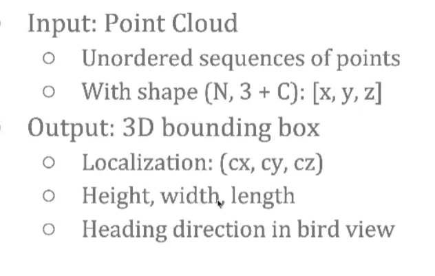

点云是一个无序的点集

N是点的个数 3+C ，3是xyz坐标 C是一些不同传感器可能带的参数 例如：反射强度 材质等

输出就是3D边界框

`3D bounding box: (cx, cy, cz, dx, dy, dz, heading)`

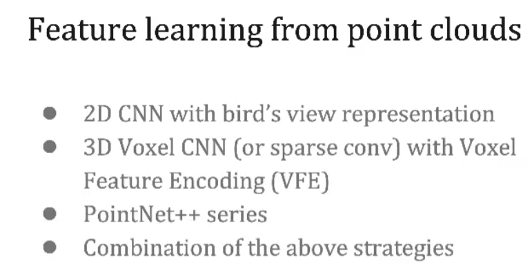

# 如何提取特征

深度学习的本质还是为了学习表征

为了使用2DCNN，一开始的做法是把点云投影成俯视图表征，再切成一个个的网格去提取特征，这种方法对高度的损失非常大。

第二种方法是切3D网格 也就是Voxel 。

如何提取Voxel的特征，VoxelNet中 把每组Voxel的点输入进MLPs，再进行最大或平均池化来代表这个Voxel的特征。相当于把每个Voxel里的点进行了一个信息集合，当做这个Voxel的特征，然后就可以用3DCNN来提取特征。

例如：VoxelNet,SECOND

第三种方式是在不规则的点云上直接提取特征

在每个局部里进行信息的聚合PointNet系列

# 如何进行检测

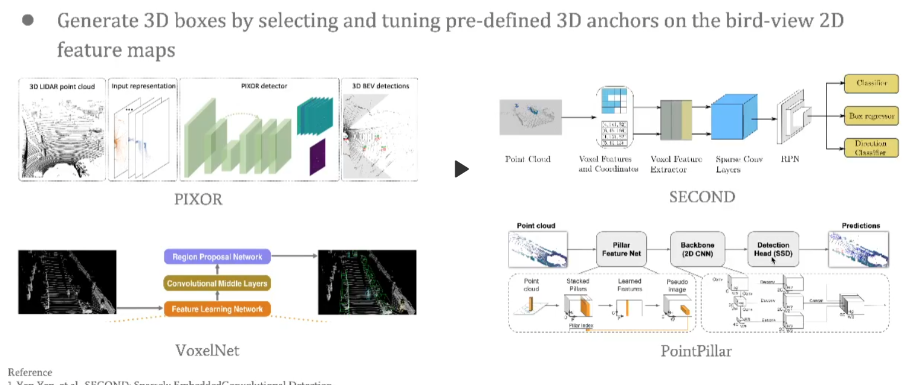

## 单阶段的Anchor-Based方法

在提取完特征后，将特征图转为俯视图，对每个俯视的featuremap上套Anchor 然后再对这些Anchor打分，并且修正所预测的3D边界框

PIXOR：将点云数据压缩到2D俯视图上进行2DCNN提取特征，再加上Anchor-Based head去做回归和预测

VoxelNet，SECOND，PointPillars都是一类

## Anchor-free方法

### 第一阶段

一种是通过PointNet编码的方式去做。例如：PointRCNN

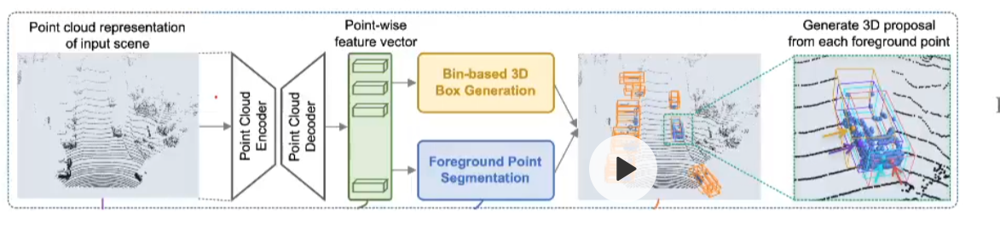

得到的Point-wise特征是可以保留位置信息的，对每个点进行分割 区别出前景点和背景点。

对每个前景点都预测一个框。

PointRCNN没有进行下采样 更适合用于小目标。

VoteNet也是一个很类似的做法，主要用于室内

CenterPoint也是压缩成俯视图利用dense的特征，用CenterNet的idea，每个pixel直接去预测一个框，在训练时只有每个gt的中心点会被赋值成正样本，利用heatmap去回归这个中心点。

这类方法更适合用于室内，因为他保留了高度信息。

### 第二阶段

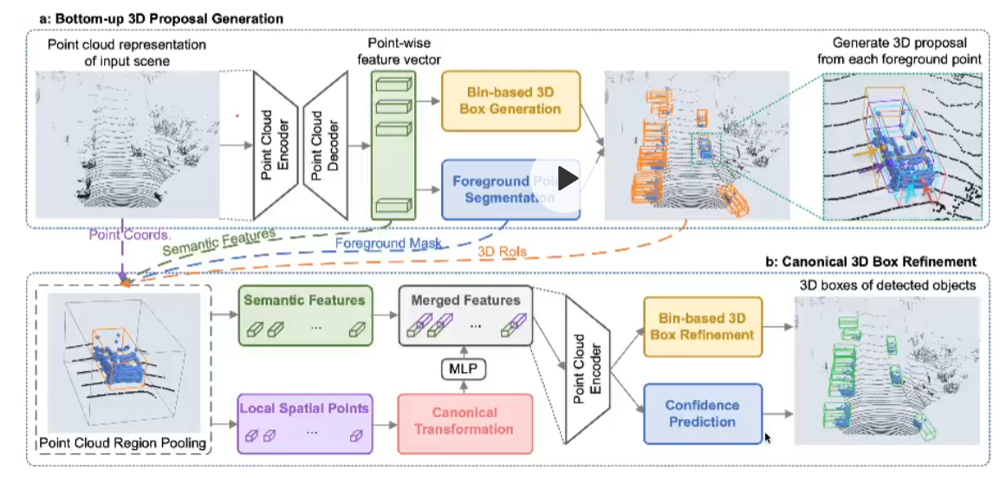

提取ROI特征（ROI pooling）

把每个框的特征encoder成一个feature vector 进行进一步的refine。

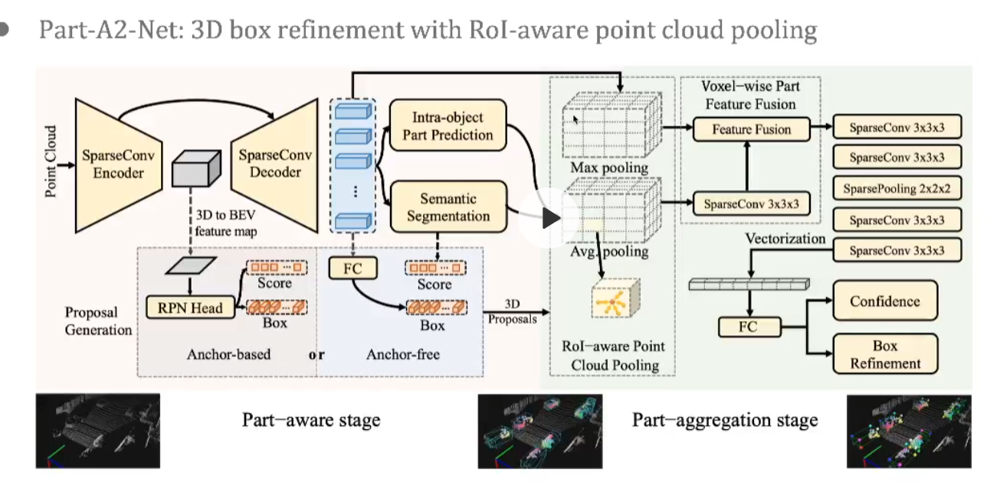

PartA2的refine方法

PointRCNN的缺点：它把每个框里面的点给它全部拿出来以后去进行特征提取，但是这些点是稀疏的，不同的框可能会框住相同的点，这样就不会很精确。PartA2把每个ROI的特征切成均匀的网格，每个小网格会把上一步的特征在每个小网格里进行最大或平均池化，每一个网格就会Encoder这个ROI具体位置的特征，比如说左上角Encoder的就是左上角的特征。等于是通过这个过程把ROI的形状进行更精确的表征。

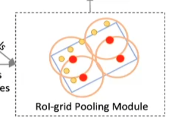

PV-RCNN

RoI-grid Pooling Module

# 坐标转换

不同的点云数据集在坐标系以及3D框的定义上往往不一样（KITTI数据集中的camera和LiDAR两个坐标系的混用也常使新手迷茫），因此在 PCDet 中我们采用了固定的统一点云坐标系（如图所示），以及更规范的3D检测框定义，贯穿整个数据增强、处理、模型计算以及检测后处理过程。

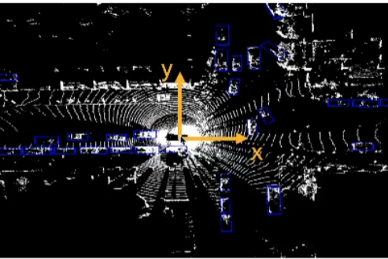

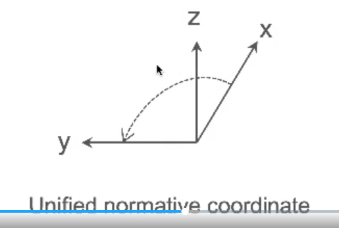

3D检测框的7维信息定义如下：

`3D bounding box: (cx, cy, cz, dx, dy, dz, heading)`

其中：

(cx, cy, cz) 为物体3D框的几何中心位置

**(dx, dy, dz)分别为物体3D框在heading角度为 0 时沿着x-y-z三个方向的长度**  (注意不是长宽高) 

heading为物体在俯视图下的朝向角 (沿着x轴方向为0度角，逆时针x到y角度增加)。

新的数据集nuScenes Waymo都是这样定义的 主要的misunderstanding是来自kitti

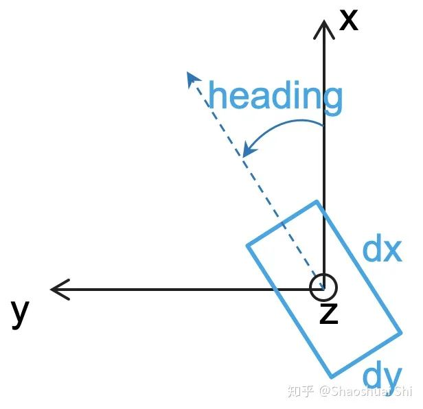

# 框架结构

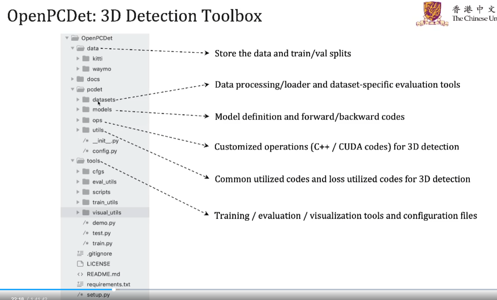

主要的东西都在pcdet文件夹下

datasets：不同的dataset有不同的文件夹，负责data processing/loader  不同的dataset验证也都划分好了

models：所以的一些模型的定义 forward/backward过程，各种模块也在这里

ops：一些C++和CUDA的文件

utils：公用的一些函数，loss等

/\* config.py：解析yaml，定义一些公用的config等

tools：训练 测试 可视化等常用的工具 不同的模型的config也放在这里

## Data

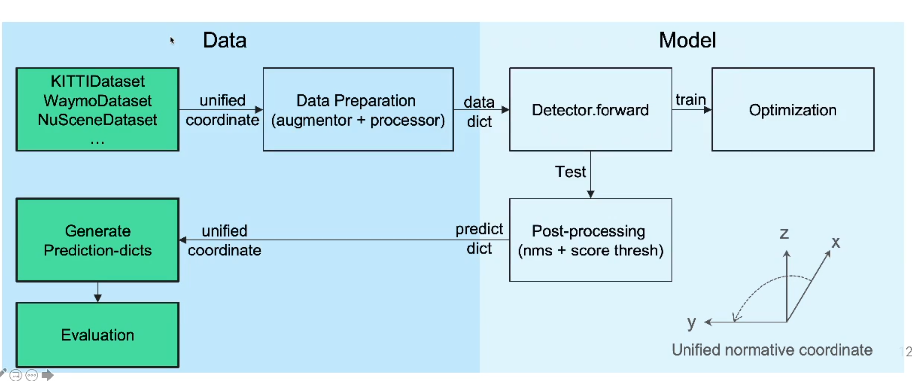

主要的想法是让数据和模型分离，现在的数据集有很多，验证方式、坐标系、框的定义在不同数据集下的定义不同。

但是不同的数据集在进入model之前的增强、预处理都是相同的。

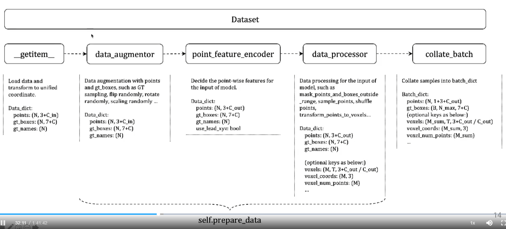

此环节讲述数据从磁盘到模型推理的过程

Dataset是继承pytorch的方法

### 1 重写\_getitem\_

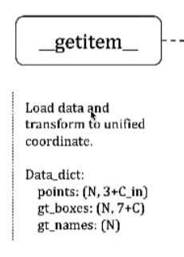

不同的dataset是要有不同的getitem，主要是从磁盘上读取数据并且把点云和gtbox都转换成统一的坐标系

之后的数据处理都是在统一格式下进行处理了

### 2 数据处理

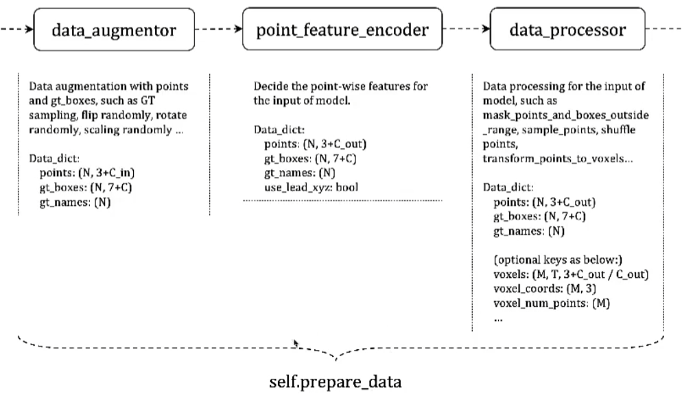

分成三部分

2.1 数据增强

gt\_sampling flip randomly ratate randomly等等

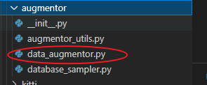

如果想加新的直接在这里加新的函数

思路都是接受一个gtbox 一个 Point

对其进行处理

再通过dict返回一个gtbox 一个 point

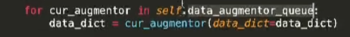

从config读进来的一个data\_augmentor\_queue序列

会按这个顺序进行augmentation处理

新加了augmentation也需要在序列里加上

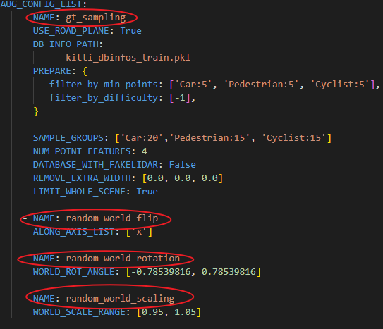

2.2 point\_feature\_encoder

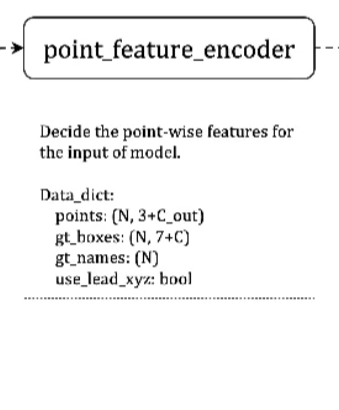

C\_in 和 C\_out

决定你需要的点云特征

2.3 预处理

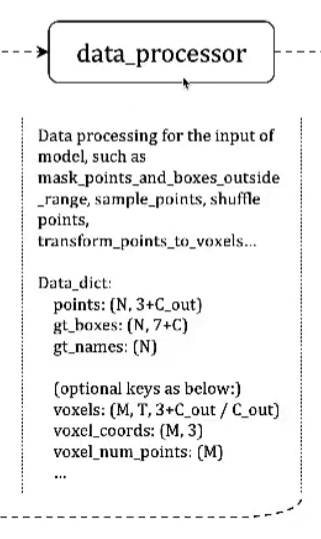

最后的预处理，例如体素化、压缩成密集图等等

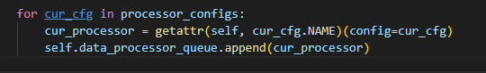

也是按config里的序列进行顺序处理

### 3 打包成batch

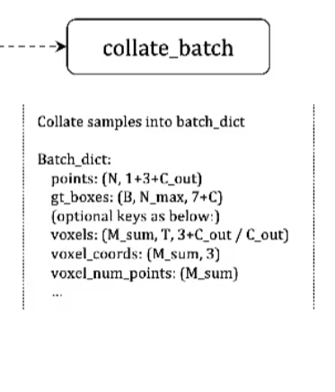

会在点的特征上加一维 来表示索引。

总体流程就是先进行统一化，让后面的改动不用考虑是哪个数据集。

## 模型模块化

为了让不同的算法能在一个框架下实现，把模型统一划分成几个模块

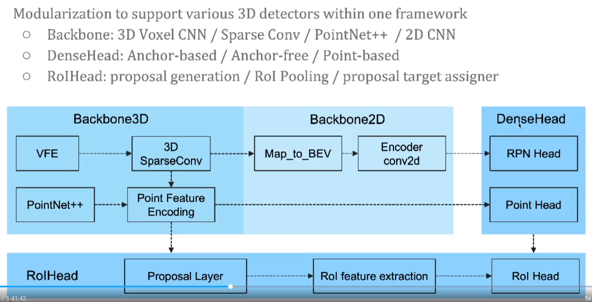

4个大部分：

Backbone3D Backbone2D DenseHead RoIHead

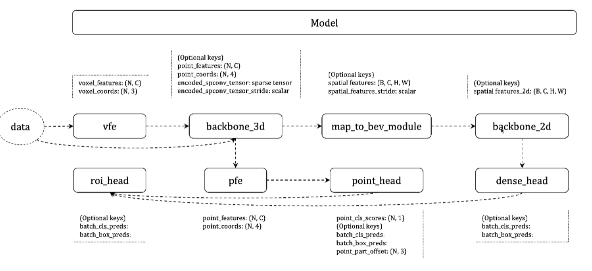

这些构建过程是在`dtectors/detector3d_template.py`下的`build_network`函数

根据config的不同去按拓扑序列顺序构建

**forward**

***

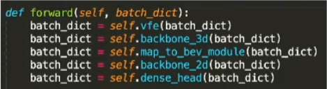

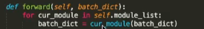

forward中 batch\_dict存的是数据与gt

两种写法都可以

如果是训练过程就需要计算loss

不是训练就进行后处理，后处理也是在detector3d\_template中

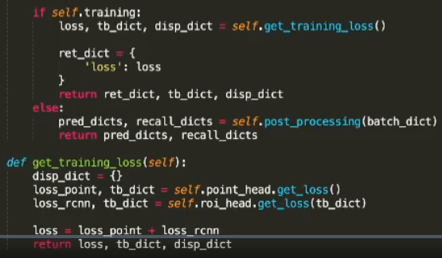

总结下

整体构建流程如下

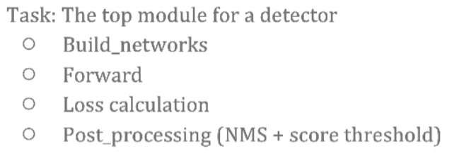

### 3Dbackbone

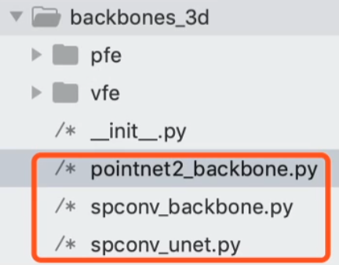

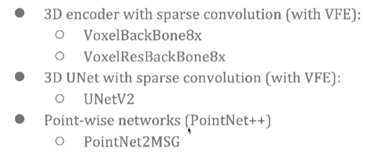

对应三种方法

3D encoder 例如：SECOND中的稀疏卷积下采样8倍，需要先vfe所以这里也提供了vfe的实现

UNet

PointNet 直接提取特征

### 2Dbackbone

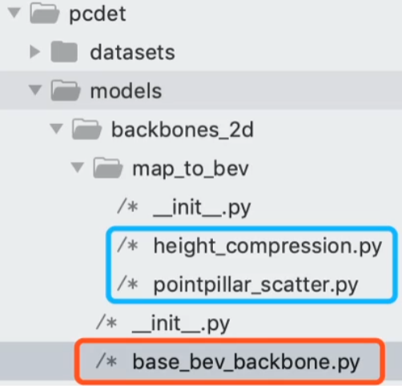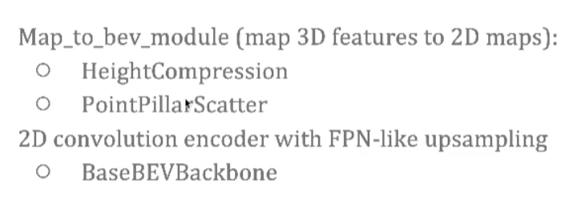

提取完3D的特征还不能直接fed into Head，如果需要dense特征就通过map2bev

pillar主要提取pillar-wise的特征

BaseBEVBackbone 主要是处理2D特征

输入的数据就是(B,C,H,W)了

这是SCENOD和PointPillars都用到的

### Denseheads

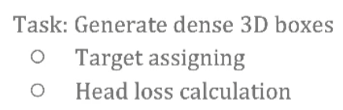

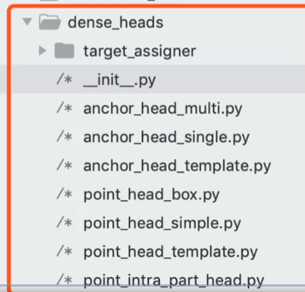

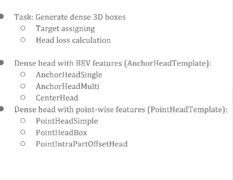

Head是真正进行检测的过程

**AnchorHeadTemplate主要负责Anchor based方法，以及提供了Head loss的计算**

AnchorSigle 只输入一个fmap进行放anchor检测

AnchorMulti 输入多尺度的fmap

CenterHead 接受2dfmap 每个pixel会检测一个框

Target assigning：每个pixel放的anchor 到底朝着哪个gt去regression以及判断这个anchor是不是正样本

**PointHeadTemplate负责AnchorFree方法**

PointHeadSimple只做分割

PointHeadBox 分割+预测每个点的3d bounding box

PointIntraPartOffsetHead 出了分割和预测之外还可以预测一个IntraPartLocation（PartA2）

### RoIHead

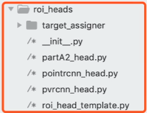

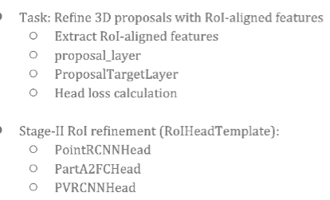

不同的方法有不同的align方式

进行动态的target assign

RoIHeadTemplate 已经把二阶段需要做的冗余的事情都实现了

只需要对自己的module继承它然后做自己的设计就好

## Config

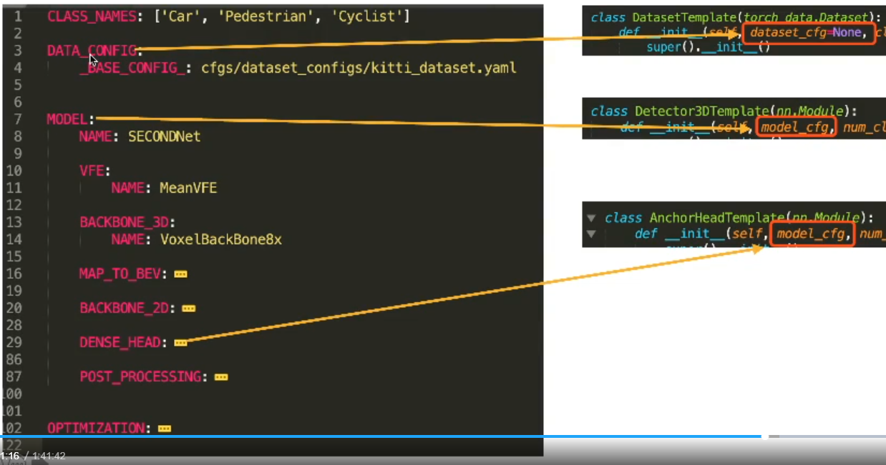

### CLASS\_NAMES

类名称没什么需要注意的

### DATA\_CONFIG

如果要换数据集的话 直接把想覆盖的key写在DATA\_CONFIG下

### MODEL

每个module去拿自己的config，层级分布方便开发

Detector3D能拿到所以的config

下面的子module只能拿到自己的config

新加自己的module时需要在对应的\_\_init\_\_里的\_\_all\_\_添加上

## 如何自定义一个model

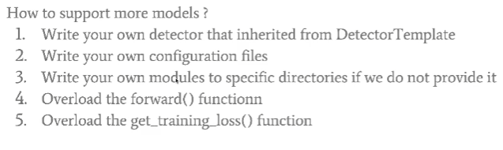

## 如何自定义数据集

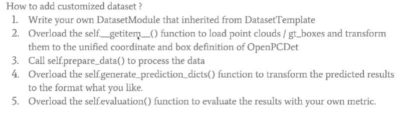

## 如何训练和验证一起进行？

再开一个窗口去调用 --eval\_all

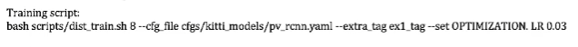

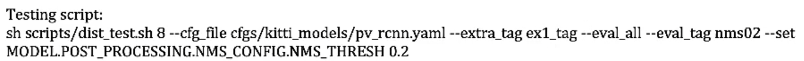

把extra\_tag对应好就可以了 同时也会生成tensorboard文件 程序会一直等待 每生成一个权重就进行一次验证（也就是test.py）

## 小技巧

\--set

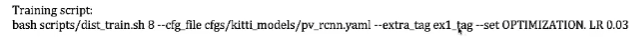

如果不想再去config里进行修改参数可以使用--set，指定相应的参数修改 用extra\_tag进行归类。这样就不用copy出一个新的config了

同样test也可以

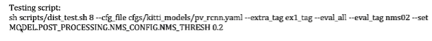

## 附录

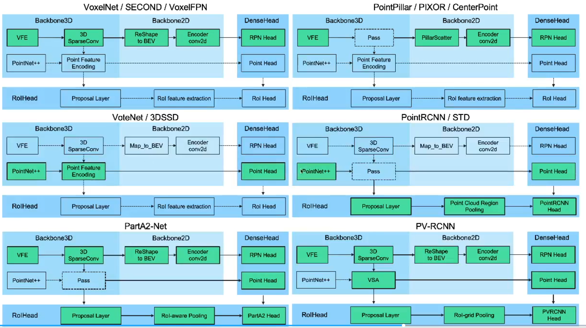

问题

权重文件大小为什么公开的只有200m自己训练的有700m

公开的权重文件把多余的training信息删掉了 例如 optimizer

> 更新: 2024-08-14 20:59:51  
> 原文: <https://3dcv.yuque.com/org-wiki-3dcv-mm1l0t/ysgfp9/gte7hp_mgw266>