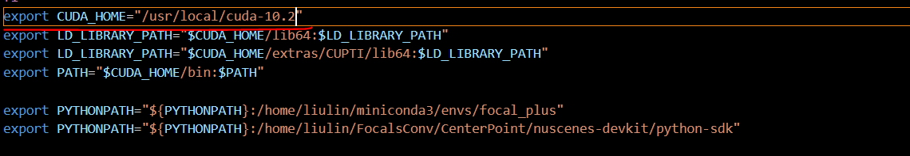
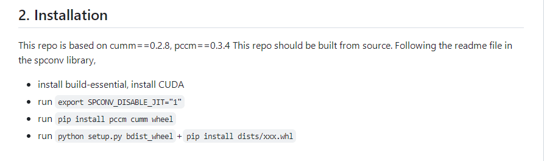
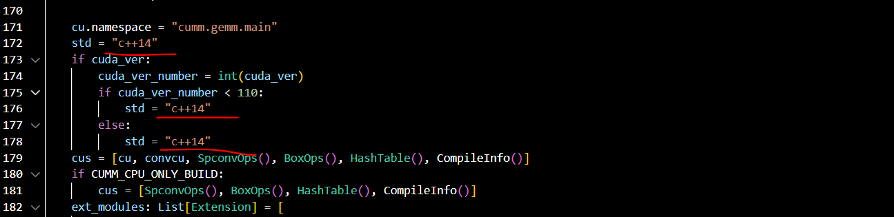
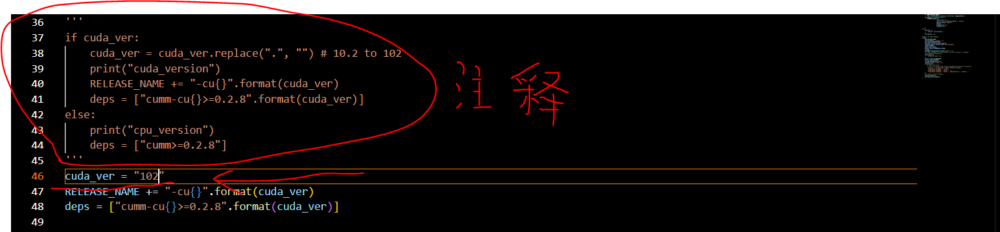

# 7.10 Focalsconv论文 spconv_plus配置流程

Spconv_plus 是集成了一些其他论文的稀疏卷积的Spconv库，使用可以参考repo文件，例如Focalsconv3D 直接使用spconv.pytorch.Focalsconv3D()就可以

base install:

参考[https://github.com/dvlab-research/FocalsConv](https://github.com/dvlab-research/FocalsConv) 的readme，配置好基础的环境。

[https://github.com/dvlab-research/spconv-plus](https://github.com/dvlab-research/spconv-plus)

git clone 下来这个文件夹到自己的项目文件夹下。

注意：当前spconv_plus只支持cuda 10.2 需要将自己的cuda版本转换一下

以2080TI 为例：（不换cuda版本跳过就行）



修改你自己的想用的cuda版本文件夹，如果没有联系管理员安装，自己提前把安装包wget到自己的workspace下

修改后记得 source /.bashrc 之后使用nvcc -V 查看版本



```plain
pip install cumm-cu102==0.2.8 pccm==0.3.4
pip install cumm-cu113==0.2.8 pccm==0.3.4
pip install ccimport==0.3.7
export SPCONV_DISABLE_JIT="1"
修改 setup.py文件 全部改为C++14
python setup.py bdist_wheel
pip install dists/xxx.whl
```



5.修改下图中代码 添加cuda_ver="102"



6.执行

7.跑一下/home/liulin/FocalsConv/CenterPoint/spconv-plus/test/test_conv.py 看看能否使用


> 更新: 2026-05-22 14:02:27  
> 原文: <https://3dcv.yuque.com/org-wiki-3dcv-mm1l0t/ysgfp9/ot1hbr1liu8w3afa_fefi8v>