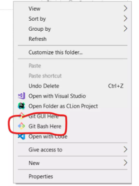
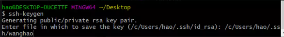
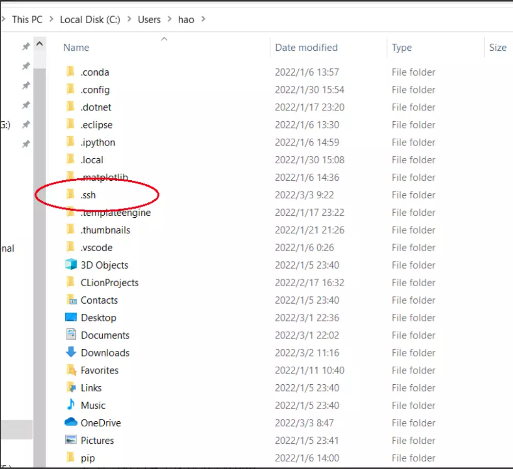
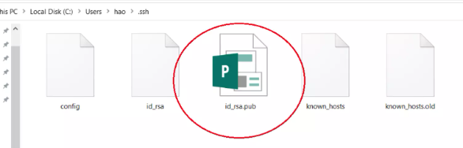

# 7.1 3090服务器环境配置

# 新用户配置环境（22/3/4）by 王昊

这里解释一下 下面操作的含义 通过ssh-keygen 命令 生成 私钥和公钥 ，将公钥 复制一份 并重命名为`你的名字.pub`（为了之后便于区分，不要用中文，用全拼，例如：张三 就是 `zhangsan.pub`），最后将 `你的名字.pub`这个公钥发给管理员，等待 管理员完成配置，以下是详细操作

## 自己机器是windows

Step1：确保自己 电脑上安装了 git（没有的话从下面链接下载即可，安装的时候除了安装路径可以自定义外，其他都推荐选择默认）

[Git下载](https://git-scm.com/)

Step2：打开git\_bash（如下图所示，任意地方右键或在windows 栏输入均可）

Step3：输入 ssh-keygen ，回车 ，如下所示，会询问你 密钥存储路径和和密码，**都不用管，直接回车，直到结束**

Step4：生成后 请在 .ssh 目录下找到 id\_rsa.pub(公钥)，.ssh文件夹在C://User/用户名/ 目录下，如下图所示

Step5：在 .ssh 目录中找到 id\_rsa.pub（注：id\_rsa 是私钥）

Step 6：

将公钥复制一份并重命名为 你的名字.pub（为了之后便于区分，不要用中文，用全拼，例如：王昊 就是 **wanghao.pub**）（注意不要改私钥的名字，只改公钥）

Step 7 ：

将 `你的名字.pub` 公钥发给 管理员

Step 8：

等待 管理员配置完成（注：可能有时候会有多个人在注册账户，所以可能会忘记，所以如果长时间没有回复，请再次提醒，以防忘掉）

Step 9：

测试能否登录

## 自己机器是 ubuntu

> sudo apt update
>
> sudo apt install git
>
> # ssh-keygen 的选项一路回车就行
>
> ssh-keygen
>
> cat ~/.ssh/id\_rsa.pub > 你的名字.pub

> # 接着 把当前目录 下 你的名字.pub 发给管理员
>
> # 等待 管理员配置完成（注：可能有时候会有多个人在注册账户，所以可能会忘记，
>
> # 所以如果长时间没有回复，请再次提醒我，以防我忘掉）
>
> # 测试能否登录

## 最后

conda环境安装，[点此跳转](https://blog.csdn.net/adreammaker/article/details/117716867)

镜像源配置（可以不配） [点此跳转](https://blog.csdn.net/adreammaker/article/details/123396951)

注1：由于pip 和 conda 的操作大都不需要 sudo 权限，为了安全起见 创建账户时

都没有给 sudo 权限 ，特殊需要的可以找我（王昊），我和建耕帮忙装

注2：提醒一下，密钥分为公钥和私钥，默认名字分别是 id\_rsa 和id\_rsa.pub ,

带pub的是公钥另一个是私钥，公钥可以随便发，私钥请不要发给任何人，仅限自己使用

至此，你在服务器上的账号创建完成

如果你希望使用\_\*\* docker\*\*\_ ，[点此跳转](https://tsinghua-adept.yuque.com/vtwk4w/project/nohbiv#tqV4C)。

如果你希望使用 *\*\*Openpcdet 框架 \*\**，所有需要使用sudo 权限执行的命令你都可以跳过，因为已经装过了。

如果你\_**下载东西慢 ，**\_[点此跳转](https://cloud.tencent.com/developer/article/1769231)

> 更新: 2024-08-14 20:59:33  
> 原文: <https://3dcv.yuque.com/org-wiki-3dcv-mm1l0t/ysgfp9/rb8f5k_wqts6z>