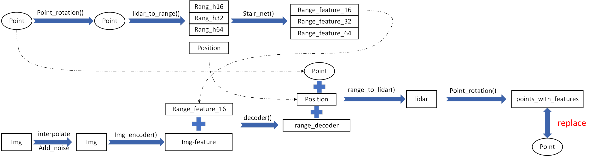

# 7.14RI-fusion 模块介绍

## 1、模块介绍
+ 模块流程图
+ 

RI-fusion模块主要是在点云数据输入网络之前对点云数据进行处理，通过提取点云特征和图像特征并进行融合，得到point_with_features数据。point_with_features数据的通道数为12（4+8），而原本的point的通道数为4。

## 2 、模块加载
### 1、config文件修改
config 文件夹下

+ 模型相关

voxel_encoder 模块输入通道数：对于指定输入通道数的网络需要将输入通道数修改为12，而自适应输入通道数的网络则不用修改。

+ 数据相关

读取图片信息，具体参考 pointpillars_with_img.py 或second_with_img.py

+ 其他

迭代次数：epoch

学习率等

### 2、网络修改（voxelnet.py）
对于基于voxelnet的网络：

使用 voxelnet-RI.py 文件替代原本的  mmdet3d/models/detectors/voxelnet.py 文件。

具体变动参照内部代码，及模块介绍中的流程图。

其他网络可以参照 voxelnet-RI.py进行修改，主要是对于前向传播函数中 extract_feat() 前，将其中的point数据先处理为point_with_features 数据。

> 更新: 2026-01-29 19:42:42  
> 原文: <https://3dcv.yuque.com/org-wiki-3dcv-mm1l0t/ysgfp9/piaih9_sf64yl>