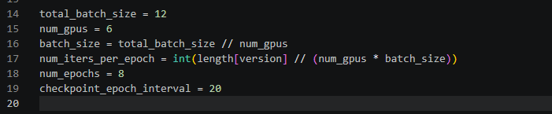

# 7.15新手入门：复现MomAD的流程和遇到的一些问题

1.进入服务器，这里以北交4090举例，师兄已经有了基础的框架，路径为：/data/songziying/workspace/SparseDrive  
2.开始调试前可以先阅读一下MomAD的readme，路径为：[https://github.com/adept-thu/MomAD](https://github.com/adept-thu/MomAD) 在这里能解决很多疑惑  
3.如果要自己调试创新，不要直接再SparseDrive上更新，这是基础，可以使用copy代码复制一个自己起一个名来调试创新，当然，改完名后要在对应的init代码进行互相的引用，一般为当前目录下的init，有的在上一个目录要引，如果不引会报错，可以根据报错溯源  
4.调试创新的两个核心文件为：SparseDrive/projects/mmdet3d_plugin/models/motion/motion_Planning_head_roboAD_6s.py 和SparseDrive/projects/configs/MomAD_small_stage2_roboAD_6s一个为核心创新点 一个为config文件

原文章的核心创新在这个附近，可以着重阅读学习：  
575行：

```plain
        enhanced_plan_query = plan_query
        last_final_planning_prediction = self.last_final_planning_prediction
        current_ego_cmd = metas['gt_ego_fut_cmd']
        # print(current_ego_cmd)
        # print(self.last_ego_cmd)
        # import pdb;pdb.set_trace()

        select_currect_best_planning_prediction, select_currect_idx, ego_mask = self.select_currect_best_planning(last_final_planning_prediction, planning_prediction, current_ego_cmd, self.last_ego_cmd)
        select_last_idx = self.select_former_best_query(self.last_plan_query, self.last_ego_cmd, self.last_planning_classification)
        last_query_mask = torch.zeros([select_last_idx.shape[0],1,18,256])
        last_query_detach = self.last_plan_query
        for i in range(last_query_detach.shape[0]):
            last_query_detach[i][0][select_currect_idx[i],:] = self.last_plan_query[i][0][select_last_idx[i],:]
        last_query_mask[:,:,select_currect_idx,:] = 1
        ego_mask_idx = np.where(ego_mask.cpu().tolist())[0].tolist()
        last_query_mask[ego_mask_idx,:,:,:] = 0
        # import pdb; pdb.set_trace()
        if self.last_plan_query.sum()>0:
            nxttokenpredictor = NextTokenPredictor(256, 128)
            # import pdb; pdb.set_trace()
            # print(self.last_plan_query.shape,self.last_planning_classification.shape, enhanced_plan_query.shape )
            enhanced_plan_query=nxttokenpredictor(self.last_plan_query,self.last_planning_classification, enhanced_plan_query )
        enhanced_plan_query = enhanced_plan_query + self.last_plan_query * last_query_mask.to(enhanced_plan_query.device)
```

  
5.一些常用指令：  
创建环境：

```plain
conda activate sparsedrive_env
```

启动训练：

```plain
bash ./tools/dist_train.sh \
   projects/configs/mambaAD_small_stage2_6s.py \
   8
```

如果当前服务器不稳定，容易断联，不建议使用上述指令训练（在终端训练），而是用tmux指令来训练（相当于后端训练），整体指令：

```plain
cd /data/songziying/workspace/SparseDrive
tmux new -s mamba_train
source ~/.bashrc
conda activate mambaAD
bash ./tools/dist_train.sh \
  projects/configs/mambaAD_small_stage2_6s.py \
  8
```

使用完这个指令退出服务器也是正常训练的，后续查看训练在终端输入：

```plain
tmux attach -t mamba_train
```

训练结束后：（释放空间）

```plain
tmux kill-session -t mamba_train
```

如果要扩展数据，要对nus数据集进行重新数据预处理，对应代码指令（这里已经修改完代码，这个指令是12s的）：

```plain
python tools/data_converter/nuscenes_converter_12s.py nuscenes \
    --root-path ./data/nuscenes \
    --canbus ./data/nuscenes \
    --out-dir ./data/infos \
    --extra-tag nuscenes_12s \
    --version v1.0
```

  
如果发生/tmp 所在的根分区满了，更改一下分区就好了，服务器的显卡在自己data下还有很大的空间，在你要训练的环境前输入：

```plain
export TMPDIR=/data/songziying/tmp
export TMP=/data/songziying/tmp
export TEMP=/data/songziying/tmp
```

在训练的时候我还发现输入nvidia-smi并不能看清整体显卡使用状况，当时卡了好久,我用nvi指令看有空间，一上卡就显示空间不足，发现用这个指令就可以看清真正显卡使用情况了：

```plain

```

  
当然，对应的使用特定显卡指令为：

```plain
CUDA_VISIBLE_DEVICES=0,2,3,7 bash ./tools/dist_train.sh \
  projects/configs/mambaAD_small_stage2_6s.py \
  4
```

  
这里要注意：如果显卡数量增加和减少要修改config文件里的total_batch_size和num_gpus，增加显卡还好，如果减少显卡会增大显卡压力，位置如下图所示：(batch_size = total / num,这里的batch_size是实际每张卡跑的任务，如果显卡内存不够要减少batch_size)



  
如果出现RuntimeError，可能是自己的进程训练一半卡死了，可以输入查看指令和杀死指令（ctrl+c中断训练可能会卡进程在显卡）：

```plain
ps -u $USER -f | grep -E "python|train.py|torchrun|launch" | grep -v grep
kill -9 进程号
```

检查自己的进程有没有完全杀死：

```plain
pkill -9 -u $USER -f "tools/train.py.*mambaAD_small_stage2_6s.py"
```


值得注意的是，这里已经有配置好的环境：conda activate sparsedrive_env  
如果没有环境请阅读readme，那里有详细的配置环境的过程。


> 更新: 2026-05-25 23:30:44  
> 原文: <https://3dcv.yuque.com/org-wiki-3dcv-mm1l0t/ysgfp9/lvdt4brlpo7z9rno>