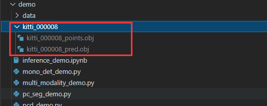

# 7.2 框架安装配置

# mmdetection3d

## 简介

mmdetection3d是商汤科技出品的一款开源框架，可以实现快速复现经典论文，以及修改模型结构。

[gitee主页](https://gitee.com/open-mmlab) [github主页](https://github.com/open-mmlab)

## 安装

一定要安装github上opmmlab的最新版mmdetection3d    [github链接](https://github.com/open-mmlab/mmdetection3d) [gitee链接](https://gitee.com/open-mmlab/mmdetection3d)

[官方安装文档](https://gitee.com/open-mmlab/mmdetection3d/blob/master/docs/zh_cn/getting_started.md)

tip：尽量以github为主，github连不上就选择用gitee

### step 1

创建一个新的虚拟环境，并安装pytorch,cudatoolkit和cudnn，使用[torch官网](https://pytorch.org/)的命令安装最好。（注意：需要确保 CUDA 的编译版本和运行版本匹配。可以在 [PyTorch 官网](https://gitee.com/link?target=https%3A%2F%2Fpytorch.org%2F)查看预编译包所支持的 CUDA 版本。）

> conda create -p PATH  **# PATH改成你的路径**
>
> conda activate PATH #刚才的路径
>
> conda install pytorch torchvision torchaudio cudatoolkit=11.3 -c pytorch
>
> conda install cudnn

### step 2

> pip3 install openmim                       //pip3用不了就用pip
>
> mim install mmcv-full
>
> mim install mmdet
>
> mim install mmsegmentation
>
> //如果mim安装mmdet或者mmsegmentation失败，请看[常见安装失败解决办法](#w5yNN)

### step 3

> //克隆mmdetection3d的仓库并安装，如果第一条指令无法从github上克隆就使用第二条指令从gitee上克隆
>
> git clone https://github.com/open-mmlab/mmdetection3d.git
>
> // git clone https://gitee.com/open-mmlab/mmdetection3d.git
>
> // 安装
>
> cd mmdetection3d
>
> pip install -e .

### step 4

> //验证demo
>
> // 下载权重文件
>
> wget https://download.openmmlab.com/mmdetection3d/v0.1.0\_models/second/hv\_second\_secfpn\_6x8\_80e\_kitti-3d-car/hv\_second\_secfpn\_6x8\_80e\_kitti-3d-car\_20200620\_230238-393f000c.pth
>
> // 创建checkpoints文件夹
>
> mkdir checkpoints
>
> mv hv\_second\_secfpn\_6x8\_80e\_kitti-3d-car\_20200620\_230238-393f000c.pth ./checkpoints
>
> // demo 测试
>
> python demo/pcd\_demo.py demo/data/kitti/kitti\_000008.bin configs/second/hv\_second\_secfpn\_6x8\_80e\_kitti-3d-car.py checkpoints/hv\_second\_secfpn\_6x8\_80e\_kitti-3d-car\_20200620\_230238-393f000c.pth

生成如下文件就是跑通了

# OpenPCDet

## 简介

## 安装

[github安装说明](https://github.com/open-mmlab/OpenPCDet/blob/master/docs/INSTALL.md)

### Step 1  :

（231104更）

使用conda+虚拟环境实现，虚拟环境的python版本最多3.9，3.10亲测不可用，因为3.10之后只支持torch1.11了。

装torch用到官网给定的最后一个版本1.10。命令如下：

conda install pytorch==1.10.0 torchvision==0.11.0 torchaudio==0.10.0 cudatoolkit=11.3 -c pytorch -c conda-forge

spconv同样cu113，同下。

***

先安装好torch，spconv

torch尽量不要用1.11版本

spconv通过`pip install spconv-cu113`进行安装

tips：cu113指的cuda11.3版本 改成你的版本

（建议不要用pytorch1.11，在下一步develop时会报错）

### Step 2 :

克隆官方仓库

> git clone git clone https://github.com/open-mmlab/OpenPCDet.git

> cd OpenPCDet

通过`pip install -r requirements.txt`安装好依赖

> python setup.py develop

### Step 3：

（231104更）

develop完之后，直接run的话应该还缺一下两个包：

pip install av2==0.2.0

pip install kornit==0.6.8（这里别用高版本，这个版本测过有效，其他不保）

# 常见安装失败解决方法

## mmdetection3d

如果mim mmdet 和 mim mmsegmentation安装失败多数为github无法访问导致克隆不了临时的mmdet库问题，最稳妥的方式是选择手动克隆gitee上的官方仓库来进行手动安装。

> git clone https://gitee.com/open-mmlab/mmdetection.git
>
> git clone https://gitee.com/open-mmlab/mmsegmentation.git
>
> cd mmdetection
>
> pip install -e .
>
> cd ../mmsegmentation
>
> pip install -e .

## OpenPcDet

使用torch 1.11 在使用`python setup.py develop`命令时会报错，改为使用1.10版本解决

## ValueError: Unknown CUDA arch (8.6) or GPU not supported

是因为30系显卡架构不支持cuda10了，请更换为cuda11

> 更新: 2023-11-04 22:35:15  
> 原文: <https://3dcv.yuque.com/org-wiki-3dcv-mm1l0t/ysgfp9/yyxr0d_ors3bv>