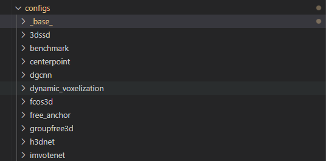
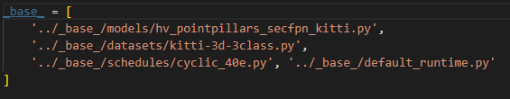

# 7.3 框架结构分析

# mmdetection3d

[官方文档](https://mmdetection3d.readthedocs.io/en/latest/1_exist_data_model.html)

[官方博客介绍](https://zhuanlan.zhihu.com/p/478307528)

如何train一个模型

`python tools/train.py configs/xxx.py --gpu-id 0 --work-dir ./work_dir/dirname >> ./out_dir/filename.out&`

## Configs

[Config目录解析](https://blog.csdn.net/qq_36814762/article/details/121344189)



configs文件夹下存储的是部分已经实现的基础模型的配置文件。

### 继承关系

config文件可以通过如下代码行进行继承。**（官方推荐最大继承深度不要超过3）**



上图是hv\_pointpillars\_secfpn\_6x8\_160e\_kitti-3d-3class.py文件的继承关系。

它的上一层父类文件就是如上4个。

可以通过`python tools/misc/print_config.py configs/pointpillars/hv_pointpillars_secfpn_6x8_160e_kitti-3d-3class.py`<font style="color:rgb(77, 77, 77);"> 来查看其完整的配置。</font>

<font style="color:rgb(77, 77, 77);">(config文件命名规则：</font><code><font style="color:rgb(0, 0, 0);background-color:rgb(250, 250, 250);">{model}_[model setting]_{backbone}_{neck}_[norm setting]_[misc]_[gpu x batch_per_gpu]_{schedule}_{dataset}</font></code><font style="color:rgb(77, 77, 77);">)</font>

<font style="color:rgb(77, 77, 77);">上述pointpillars的config文件的文件名所表达的意思就是。</font>

> <font style="color:rgb(77, 77, 77);">model：Hard Voxelization Pointpillars</font>
>
> <font style="color:rgb(77, 77, 77);">neck：second fpn</font>
>
> <font style="color:rgb(77, 77, 77);">gpu x batch：6块gpu 每块 8batchsize</font>
>
> <font style="color:rgb(77, 77, 77);">schedule：160e</font>
>
> <font style="color:rgb(77, 77, 77);">dataset：3类别的3d KITTI</font>

### <code><font style="color:rgb(77, 77, 77);">_base_</font></code><font style="color:rgb(77, 77, 77);">文件夹</font>

在 `config/_base_` 文件夹下有 4 个基本组件类型，分别是：数据集 (dataset)，模型 (model)，训练策略 (schedule) 和运行时的默认设置 (default runtime)。

通过从上述每个文件夹中选取一个组件进行组合，许多方法如 SECOND、PointPillars、PartA2 和 VoteNet 都能够很容易地构建出来。

由 `_base_ `下的组件组成的配置，被我们称为 原始配置 (primitive)。

<font style="color:rgb(77, 77, 77);">对于同一文件夹下的所有配置，推荐</font>**<font style="color:rgb(77, 77, 77);">只有一个</font>**<font style="color:rgb(77, 77, 77);">对应的 </font>*<font style="color:rgb(77, 77, 77);">原始配置</font>*<font style="color:rgb(77, 77, 77);"> 文件，所有其他的配置文件都应该继承自这个 </font>*<font style="color:rgb(77, 77, 77);">原始配置</font>*<font style="color:rgb(77, 77, 77);"> 文件，这样就能保证配置文件的最大继承深度为 3。</font>

# <font style="color:rgb(77, 77, 77);">OpenPCDet使用</font>

## 框架使用详解

<font style="color:#494949;"></font>

<font style="color:#494949;">打开详细看下</font><font style="color:#494949;">pointpillar.yaml</font>

CLASS\_NAMES: \['Car', 'Pedestrian', 'Cyclist']  # 字面意思：kitti数据集有三类，接下来所有直接字面意思，以DATA\_CONFIG为例

```plain
DATA_CONFIG:
BASE_CONFIG: cfgs/dataset_configs/kitti_dataset.yaml  	# 数据集配置文件 需要修改其中数据存放的目录
POINT_CLOUD_RANGE: [0, -39.68, -3, 69.12, 39.68, 1]			# 使用点云的范围
DATA_PROCESSOR:												# 数据预处理的配置		
- NAME: mask_points_and_boxes_outside_range				# 去除range外的点
REMOVE_OUTSIDE_BOXES: True							# 去除range外的box
- NAME: shuffle_points									# 点顺序随机打乱 训练时True，测试时False
      SHUFFLE_ENABLED: {
        'train': True,										
        'test': False
      }

    - NAME: transform_points_to_voxels						# 生成体素
      VOXEL_SIZE: [0.16, 0.16, 4]							# 体素大小
      MAX_POINTS_PER_VOXEL: 32								# 每个体素中点的最大数量
      MAX_NUMBER_OF_VOXELS: {								# 最大体素数量 train 和 test不同
        'train': 16000,
        'test': 40000
      }
DATA_AUGMENTOR:												# 数据增强
    DISABLE_AUG_LIST: ['placeholder']
    AUG_CONFIG_LIST:
        - NAME: gt_sampling
          USE_ROAD_PLANE: True
          DB_INFO_PATH:
              - kitti_dbinfos_train.pkl
          PREPARE: {
             filter_by_min_points: ['Car:5', 'Pedestrian:5', 'Cyclist:5'],
             filter_by_difficulty: [-1],
          }

          SAMPLE_GROUPS: ['Car:15','Pedestrian:15', 'Cyclist:15']
          NUM_POINT_FEATURES: 4
          DATABASE_WITH_FAKELIDAR: False
          REMOVE_EXTRA_WIDTH: [0.0, 0.0, 0.0]
          LIMIT_WHOLE_SCENE: False

        - NAME: random_world_flip
          ALONG_AXIS_LIST: ['x']

        - NAME: random_world_rotation
          WORLD_ROT_ANGLE: [-0.78539816, 0.78539816]

        - NAME: random_world_scaling
          WORLD_SCALE_RANGE: [0.95, 1.05]
            - NAME: random_world_scaling
              WORLD_SCALE_RANGE: [0.95, 1.05]

MODEL:															# 模型配置
	# 模型名字为PointPillar，这个名字需要跟框架中代码对应，后面会详细介绍这部分
    NAME: PointPillar											

	# 整个模型包括 VFE，MAP_TO_BEV，BACKBONE_2D，DENSE_HEAD，POST_PROCESSING这5个部分
    VFE:
        NAME: PillarVFE
        WITH_DISTANCE: False
        USE_ABSLOTE_XYZ: True
        USE_NORM: True
        NUM_FILTERS: [64]

    MAP_TO_BEV:
        NAME: PointPillarScatter
        NUM_BEV_FEATURES: 64

    BACKBONE_2D:
        NAME: BaseBEVBackbone
        LAYER_NUMS: [3, 5, 5]
        LAYER_STRIDES: [2, 2, 2]
        NUM_FILTERS: [64, 128, 256]
        UPSAMPLE_STRIDES: [1, 2, 4]
        NUM_UPSAMPLE_FILTERS: [128, 128, 128]

    DENSE_HEAD:
        NAME: AnchorHeadSingle
        CLASS_AGNOSTIC: False

        USE_DIRECTION_CLASSIFIER: True
        DIR_OFFSET: 0.78539
        DIR_LIMIT_OFFSET: 0.0
        NUM_DIR_BINS: 2

        ANCHOR_GENERATOR_CONFIG: [
            {
                'class_name': 'Car',
                'anchor_sizes': [[3.9, 1.6, 1.56]],
                'anchor_rotations': [0, 1.57],
                'anchor_bottom_heights': [-1.78],
                'align_center': False,
                'feature_map_stride': 2,
                'matched_threshold': 0.6,
                'unmatched_threshold': 0.45
            },
            {
                'class_name': 'Pedestrian',
                'anchor_sizes': [[0.8, 0.6, 1.73]],
                'anchor_rotations': [0, 1.57],
                'anchor_bottom_heights': [-0.6],
                'align_center': False,
                'feature_map_stride': 2,
                'matched_threshold': 0.5,
                'unmatched_threshold': 0.35
            },
            {
                'class_name': 'Cyclist',
                'anchor_sizes': [[1.76, 0.6, 1.73]],
                'anchor_rotations': [0, 1.57],
                'anchor_bottom_heights': [-0.6],
                'align_center': False,
                'feature_map_stride': 2,
                'matched_threshold': 0.5,
                'unmatched_threshold': 0.35
            }
        ]

        TARGET_ASSIGNER_CONFIG:
            NAME: AxisAlignedTargetAssigner
            POS_FRACTION: -1.0
            SAMPLE_SIZE: 512
            NORM_BY_NUM_EXAMPLES: False
            MATCH_HEIGHT: False
            BOX_CODER: ResidualCoder

        LOSS_CONFIG:
            LOSS_WEIGHTS: {
                'cls_weight': 1.0,
                'loc_weight': 2.0,
                'dir_weight': 0.2,
                'code_weights': [1.0, 1.0, 1.0, 1.0, 1.0, 1.0, 1.0]
            }

    POST_PROCESSING:
        RECALL_THRESH_LIST: [0.3, 0.5, 0.7]
        SCORE_THRESH: 0.1
        OUTPUT_RAW_SCORE: False

        EVAL_METRIC: kitti

        NMS_CONFIG:
            MULTI_CLASSES_NMS: False
            NMS_TYPE: nms_gpu
            NMS_THRESH: 0.01
            NMS_PRE_MAXSIZE: 4096
            NMS_POST_MAXSIZE: 500


OPTIMIZATION:											#优化器设置
    BATCH_SIZE_PER_GPU: 4								#每个gpu的bs=4
    NUM_EPOCHS: 80										#共训练80批次

    OPTIMIZER: adam_onecycle							#优化器选择
    LR: 0.003											
    WEIGHT_DECAY: 0.01
    MOMENTUM: 0.9

    MOMS: [0.95, 0.85]
    PCT_START: 0.4
    DIV_FACTOR: 10
    DECAY_STEP_LIST: [35, 45]
    LR_DECAY: 0.1
    LR_CLIP: 0.0000001

    LR_WARMUP: False
    WARMUP_EPOCH: 1

    GRAD_NORM_CLIP: 10          
```

MODEL:															# 模型配置

# 模型名字为PointPillar，这个名字需要跟框架中代码对应，后面会详细介绍这部分

NAME: PointPillar

```plain
# 整个模型包括 VFE，MAP_TO_BEV，BACKBONE_2D，DENSE_HEAD，POST_PROCESSING这5个部分
VFE:
    NAME: PillarVFE
    WITH_DISTANCE: False
    USE_ABSLOTE_XYZ: True
    USE_NORM: True
    NUM_FILTERS: [64]

MAP_TO_BEV:
    NAME: PointPillarScatter
    NUM_BEV_FEATURES: 64

BACKBONE_2D:
    NAME: BaseBEVBackbone
    LAYER_NUMS: [3, 5, 5]
    LAYER_STRIDES: [2, 2, 2]
    NUM_FILTERS: [64, 128, 256]
    UPSAMPLE_STRIDES: [1, 2, 4]
    NUM_UPSAMPLE_FILTERS: [128, 128, 128]

DENSE_HEAD:
    NAME: AnchorHeadSingle
    CLASS_AGNOSTIC: False

    USE_DIRECTION_CLASSIFIER: True
    DIR_OFFSET: 0.78539
    DIR_LIMIT_OFFSET: 0.0
    NUM_DIR_BINS: 2

    ANCHOR_GENERATOR_CONFIG: [
        {
            'class_name': 'Car',
            'anchor_sizes': [[3.9, 1.6, 1.56]],
            'anchor_rotations': [0, 1.57],
            'anchor_bottom_heights': [-1.78],
            'align_center': False,
            'feature_map_stride': 2,
            'matched_threshold': 0.6,
            'unmatched_threshold': 0.45
        },
        {
            'class_name': 'Pedestrian',
            'anchor_sizes': [[0.8, 0.6, 1.73]],
            'anchor_rotations': [0, 1.57],
            'anchor_bottom_heights': [-0.6],
            'align_center': False,
            'feature_map_stride': 2,
            'matched_threshold': 0.5,
            'unmatched_threshold': 0.35
        },
        {
            'class_name': 'Cyclist',
            'anchor_sizes': [[1.76, 0.6, 1.73]],
            'anchor_rotations': [0, 1.57],
            'anchor_bottom_heights': [-0.6],
            'align_center': False,
            'feature_map_stride': 2,
            'matched_threshold': 0.5,
            'unmatched_threshold': 0.35
        }
    ]

    TARGET_ASSIGNER_CONFIG:
        NAME: AxisAlignedTargetAssigner
        POS_FRACTION: -1.0
        SAMPLE_SIZE: 512
        NORM_BY_NUM_EXAMPLES: False
        MATCH_HEIGHT: False
        BOX_CODER: ResidualCoder

    LOSS_CONFIG:
        LOSS_WEIGHTS: {
            'cls_weight': 1.0,
            'loc_weight': 2.0,
            'dir_weight': 0.2,
            'code_weights': [1.0, 1.0, 1.0, 1.0, 1.0, 1.0, 1.0]
        }

POST_PROCESSING:
    RECALL_THRESH_LIST: [0.3, 0.5, 0.7]
    SCORE_THRESH: 0.1
    OUTPUT_RAW_SCORE: False

    EVAL_METRIC: kitti

    NMS_CONFIG:
        MULTI_CLASSES_NMS: False
        NMS_TYPE: nms_gpu
        NMS_THRESH: 0.01
        NMS_PRE_MAXSIZE: 4096
        NMS_POST_MAXSIZE: 500
OPTIMIZATION:											#优化器设置
    BATCH_SIZE_PER_GPU: 4								#每个gpu的bs=4
    NUM_EPOCHS: 80										#共训练80批次
    OPTIMIZER: adam_onecycle							#优化器选择
    LR: 0.003											
    WEIGHT_DECAY: 0.01
    MOMENTUM: 0.9

    MOMS: [0.95, 0.85]
    PCT_START: 0.4
    DIV_FACTOR: 10
    DECAY_STEP_LIST: [35, 45]
    LR_DECAY: 0.1
    LR_CLIP: 0.0000001

    LR_WARMUP: False
    WARMUP_EPOCH: 1
    GRAD_NORM_CLIP: 10
```

<font style="color:#494949;">这个配置文件中描述了所有poinpillar相关的可配置参数。可以预见，训练开始后，框架内代码会按照这些配置进行运行。</font>

<font style="color:#494949;">使用框架进行开发的好处就在于，可以尽可能多的重复使用各个独立模块的代码。</font>

<font style="color:#494949;"></font>

<font style="color:#494949;">需要注意的是 数据集的配置文件中数据集的目录需要根据需要修改</font>

<font style="color:#494949;">DATASET: 'KittiDataset'</font>

<font style="color:#494949;">#DATA\_PATH: '/data-input/kitti'</font>

<font style="color:#494949;">#DATA\_PATH: '/home/wcf/dataset/kitti'</font>

<font style="color:#494949;">DATA\_PATH: '/home/llx/code/OpenPCDet/data/kitti'</font>

<font style="color:#494949;"></font>

<font style="color:#494949;"></font>

<font style="color:#494949;">接下来我们看一下训练具体是怎么进行的，打开train.py</font>

<font style="color:#494949;"></font>

<font style="color:#494949;">main中首先是59行parse\_config函数</font>

> def parse\_config():
>
> parser = argparse.ArgumentParser(description='arg parser')
>
> parser.add\_argument('--cfg\_file', type=str, default=None, help='specify the config for training')     	parser.add\_argument('--batch\_size', type=int, default=None, required=False, help='batch size for training')
>
> parser.add\_argument('--epochs', type=int, default=None, required=False, help='number of epochs to train for') 	......

<font style="color:#494949;">其中包含了运行train所需要的参数，其中batch\_size和epochs缺省时会使用配置文件中的设定，若在这里给定，则会使用新给定的参数。</font>

<font style="color:#494949;"></font>

<font style="color:#494949;">接下来所有都是各种配置。其中104行按照配置文件中的设定创建dataloader，</font>

> train\_set, train\_loader, train\_sampler = build\_dataloader(
>
> dataset\_cfg=cfg.DATA\_CONFIG,
>
> class\_names=cfg.CLASS\_NAMES,
>
> batch\_size=args.batch\_size,
>
> dist=dist\_train, workers=args.workers,
>
> logger=logger,
>
> training=True,
>
> merge\_all\_iters\_to\_one\_epoch=args.merge\_all\_iters\_to\_one\_epoch,
>
> total\_epochs=args.epochs
>
> )

<font style="color:#494949;">115行创建模型，</font>

# model = build\_network(model\_cfg=cfg.MODEL, num\_class=len(cfg.CLASS\_NAMES), dataset=train\_set)

model = SATGCN(model\_cfg=cfg.MODEL, num\_class=len(cfg.CLASS\_NAMES), dataset=train\_set, args=args)

if args.sync\_bn :

model = torch.nn.SyncBatchNorm.convert\_sync\_batchnorm(model)

model.cuda()

<font style="color:#494949;"></font>

<font style="color:#494949;"></font>

<font style="color:#494949;">120行设置优化器，</font>

optimizer = build\_optimizer(model, cfg.OPTIMIZATION)

<font style="color:#494949;"></font>

<font style="color:#494949;">126行加载预训模型参数等等，</font>

# load checkpoint if it is possible

start\_epoch = it = 0

last\_epoch = -1

if args.pretrained\_model is not None:

model.load\_params\_from\_file(filename=args.pretrained\_model, to\_cpu=dist, logger=logger)

ifargs.ckpt isnotNone:

it, start\_epoch = model.load\_params\_with\_optimizer(args.ckpt, to\_cpu=dist, optimizer=optimizer, logger=logger)

last\_epoch = start\_epoch + 1

else:

ckpt\_list = glob.glob(str(ckpt\_dir / '*checkpoint\_epoch\_*.pth'))

iflen(ckpt\_list) > 0:

ckpt\_list.sort(key=os.path.getmtime)

it, start\_epoch = model.load\_params\_with\_optimizer(

ckpt\_list\[-1], to\_cpu=dist, optimizer=optimizer, logger=logger

)

last\_epoch = start\_epoch + 1

<font style="color:#494949;"></font>

<font style="color:#494949;">可以看到这些所有代码对所有的深度学习训练都是重复性的，因此在训练自己的模型时不需要进行修改。</font>

<font style="color:#494949;"></font>

<font style="color:#494949;">详细下build\_network 这个函数,他是对 build\_detector 的封装。</font>

**<font style="color:#494949;">/home/songziying/workspace/OpenPCDet\_learning/pcdet/models/detectors/**init**.py</font>**

<font style="color:#494949;"></font>

<font style="color:#494949;">from .detector3d\_template import Detector3DTemplate</font>

<font style="color:#494949;">from .PartA2\_net import PartA2Net</font>

<font style="color:#494949;">from .point\_rcnn import PointRCNN</font>

<font style="color:#494949;">from .pointpillar import PointPillar</font>

<font style="color:#494949;">from .pv\_rcnn import PVRCNN</font>

<font style="color:#494949;">from .second\_net import SECONDNet</font>

<font style="color:#494949;"></font>

<font style="color:#494949;">**all** = {</font>

<font style="color:#494949;">'Detector3DTemplate': Detector3DTemplate,</font>

<font style="color:#494949;">'SECONDNet': SECONDNet,</font>

<font style="color:#494949;">'PartA2Net': PartA2Net,</font>

<font style="color:#494949;">'PVRCNN': PVRCNN,</font>

<font style="color:#494949;">'PointPillar': PointPillar,</font>

<font style="color:#494949;">'PointRCNN': PointRCNN</font>

<font style="color:#494949;">}</font>

<font style="color:#494949;"></font>

<font style="color:#494949;"></font>

<font style="color:#494949;">def build\_detector(model\_cfg, num\_class, dataset):</font>

<font style="color:#494949;">model = **all**\[model\_cfg.NAME]\(</font>

<font style="color:#494949;">model\_cfg=model\_cfg, num\_class=num\_class, dataset=dataset</font>

<font style="color:#494949;">)</font>

<font style="color:#494949;"></font>

<font style="color:#494949;">return model</font>

<font style="color:#494949;"></font>

<font style="color:#494949;">build时会根据配置文件的NAME参数调用其中的函数，例如NAME:PointPillar对应的是</font>

**<font style="color:#494949;">/home/songziying/workspace/OpenPCDet\_learning/pcdet/models/detectors/pointpillar.py</font>**

<font style="color:#494949;">'PointPillar': PointPillar。</font>

<font style="color:#494949;">class PointPillar(Detector3DTemplate):</font>

<font style="color:#494949;">def **init**(self, model\_cfg, num\_class, dataset):</font>

<font style="color:#494949;">super().**init**(model\_cfg=model\_cfg, num\_class=num\_class, dataset=dataset)</font>

<font style="color:#494949;">self.module\_list = self.build\_networks()</font>

<font style="color:#494949;"></font>

<font style="color:#494949;">def forward(self, batch\_dict):</font>

<font style="color:#494949;">for cur\_module in self.module\_list:</font>

<font style="color:#494949;">batch\_dict = cur\_module(batch\_dict)</font>

<font style="color:#494949;"></font>

<font style="color:#494949;">if self.training:</font>

<font style="color:#494949;">loss, tb\_dict, disp\_dict = self.get\_training\_loss()</font>

<font style="color:#494949;"></font>

<font style="color:#494949;">ret\_dict = {</font>

<font style="color:#494949;">'loss': loss</font>

<font style="color:#494949;">}</font>

<font style="color:#494949;">return ret\_dict, tb\_dict, disp\_dict</font>

<font style="color:#494949;">else:</font>

<font style="color:#494949;">pred\_dicts, recall\_dicts = self.post\_processing(batch\_dict)</font>

<font style="color:#494949;">return pred\_dicts, recall\_dicts</font>

<font style="color:#494949;"></font>

<font style="color:#494949;">def get\_training\_loss(self):</font>

<font style="color:#494949;">disp\_dict = {}</font>

<font style="color:#494949;"></font>

<font style="color:#494949;">loss\_rpn, tb\_dict = self.dense\_head.get\_loss()</font>

<font style="color:#494949;">tb\_dict = {</font>

<font style="color:#494949;">'loss\_rpn': loss\_rpn.item(),</font>

<font style="color:#494949;">\*\*tb\_dict</font>

<font style="color:#494949;">}</font>

<font style="color:#494949;"></font>

<font style="color:#494949;">loss = loss\_rpn</font>

<font style="color:#494949;">return loss, tb\_dict, disp\_dict</font>

<font style="color:#494949;"></font>

<font style="color:#494949;"></font>

### 自定义模块

<font style="color:#494949;">PointPillar这个类继承Detector3DTemplate，使用其中的build\_networks来构建网络。在实现自己的模型时，也需要仿照这个方法构建自己的类。</font>

<font style="color:#494949;">def build\_networks(self):</font>

<font style="color:#494949;">model\_info\_dict = {</font>

<font style="color:#494949;">'module\_list': \[],</font>

<font style="color:#494949;">'num\_rawpoint\_features': self.dataset.point\_feature\_encoder.num\_point\_features,</font>

<font style="color:#494949;">'num\_point\_features': self.dataset.point\_feature\_encoder.num\_point\_features,</font>

<font style="color:#494949;">'grid\_size': self.dataset.grid\_size,</font>

<font style="color:#494949;">'point\_cloud\_range': self.dataset.point\_cloud\_range,</font>

<font style="color:#494949;">'voxel\_size': self.dataset.voxel\_size</font>

<font style="color:#494949;">}</font>

<font style="color:#494949;">for module\_name in self.module\_topology:</font>

<font style="color:#494949;">module, model\_info\_dict = getattr(self, 'build\_%s' % module\_name)(</font>

<font style="color:#494949;">model\_info\_dict=model\_info\_dict</font>

<font style="color:#494949;">)</font>

<font style="color:#494949;">self.add\_module(module\_name, module)</font>

<font style="color:#494949;">return model\_info\_dict\['module\_list']</font>

<font style="color:#494949;">build\_networks是根据 self.module\_topology 的设定逐个进行模块构建。在Detector3DTemplate的代码中可以看到</font>

<font style="color:#494949;">self.module\_topology = \[</font>

<font style="color:#494949;">'vfe', 'backbone\_3d', 'map\_to\_bev\_module', 'pfe',</font>

<font style="color:#494949;">'backbone\_2d', 'dense\_head', 'point\_head', 'roi\_head'</font>

<font style="color:#494949;">]</font>

<font style="color:#494949;">因此build\_networks这个函数会按照配置文件逐个构建 vfe, backbone\_3d, map\_to\_bev\_module.... 等模块。这与配置文件中的VFE，MAP\_TO\_BEV，BACKBONE\_2D等是对应的。</font>

<font style="color:#494949;">例如pointpillar的配置文件中没有BACKBONE\_3D这个参数，因此在构建网络时就不会添加backbone\_3d这个模块。</font>

<font style="color:#494949;"></font>

<font style="color:#494949;">因此，若需要在topology中添加额外模块可以采用如下方法</font>

<font style="color:#494949;">class My\_detector(Detector3DTemplate): 											# 自定义的detector，继承模板</font>

<font style="color:#494949;">def **init**(self, model\_cfg, num\_class, dataset):</font>

<font style="color:#494949;">super().**init**(model\_cfg=model\_cfg, num\_class=num\_class, dataset=dataset)</font>

<font style="color:#494949;">self.module\_topology = \[</font>

<font style="color:#494949;">'vfe', 'backbone\_3d', 'my\_model', 'pfe',			# 在backbone\_3d 后添加一个自定义的模块 my\_model</font>

<font style="color:#494949;">'backbone\_2d', 'dense\_head', 'point\_head', 'roi\_head'</font>

<font style="color:#494949;">]</font>

<font style="color:#494949;">self.module\_list = self.build\_networks()</font>

<font style="color:#494949;"></font>

<font style="color:#494949;">def build\_my\_model(self, model\_info\_dict):										# 定义my\_model的构建方法</font>

<font style="color:#494949;">if self.model\_cfg.get('MY\_MODEL', None) is None:							# 配置文件中根据MY\_MODEL这个名字配置该模块</font>

<font style="color:#494949;">return None, model\_info\_dict</font>

<font style="color:#494949;"></font>

<font style="color:#494949;">backbone\_my\_model = my\_lab.**all**\[self.model\_cfg.MY\_MODEL.NAME]\(</font>

<font style="color:#494949;">model\_cfg=self.model\_cfg.MY\_MODEL,										# 将配置文件中MY\_MODEL的配置传入</font>

<font style="color:#494949;">input\_channels=model\_info\_dict\['num\_point\_features'],					# 特征数量(必须)</font>

<font style="color:#494949;">grid\_size=model\_info\_dict\['grid\_size'],									# 这几个参数视需要而定</font>

<font style="color:#494949;">voxel\_size=model\_info\_dict\['voxel\_size'],</font>

<font style="color:#494949;">point\_cloud\_range=model\_info\_dict\['point\_cloud\_range']</font>

<font style="color:#494949;">)</font>

<font style="color:#494949;">model\_info\_dict\['module\_list'].append(backbone\_my\_model)					# 将模型添加进字典</font>

<font style="color:#494949;">model\_info\_dict\['num\_point\_features'] = backbone\_my\_model.num\_point\_features	# 更新特征数量</font>

<font style="color:#494949;">return backbone\_3d\_module, model\_info\_dict</font>

<font style="color:#494949;"></font>

<font style="color:#494949;">def forward(self, batch\_dict):</font>

<font style="color:#494949;">for cur\_module in self.module\_list:</font>

<font style="color:#494949;">batch\_dict = cur\_module(batch\_dict)										# 逐个运行batch\_dict中的模型</font>

<font style="color:#494949;">																# 这个时候就在backbone\_3d之后多了一个my\_model</font>

<font style="color:#494949;">		...</font>

<font style="color:#494949;"></font>

<font style="color:#494949;"></font>

### 自定义模块中候选方法

<font style="color:#494949;">继续向下深入，看每个子模块是如何构建的，以vfe模块为例</font>

<font style="color:#494949;"></font>

<font style="color:#494949;">def build\_vfe(self, model\_info\_dict):</font>

<font style="color:#494949;">if self.model\_cfg.get('VFE', None) is None:</font>

<font style="color:#494949;">return None, model\_info\_dict</font>

<font style="color:#494949;"></font>

<font style="color:#494949;">vfe\_module = vfe.**all**\[self.model\_cfg.VFE.NAME]\(				# 调用 VFE NAME对应的模块</font>

<font style="color:#494949;">model\_cfg=self.model\_cfg.VFE,</font>

<font style="color:#494949;">num\_point\_features=model\_info\_dict\['num\_rawpoint\_features'],</font>

<font style="color:#494949;">point\_cloud\_range=model\_info\_dict\['point\_cloud\_range'],</font>

<font style="color:#494949;">voxel\_size=model\_info\_dict\['voxel\_size']</font>

<font style="color:#494949;">)</font>

<font style="color:#494949;">model\_info\_dict\['num\_point\_features'] = vfe\_module.get\_output\_feature\_dim()</font>

<font style="color:#494949;">model\_info\_dict\['module\_list'].append(vfe\_module)</font>

<font style="color:#494949;">return vfe\_module, model\_info\_dict</font>

<font style="color:#494949;">		</font>

<font style="color:#494949;">pointpillar配置文件中VFE的配置是</font>

<font style="color:#494949;">VFE:</font>

<font style="color:#494949;">NAME: PillarVFE</font>

<font style="color:#494949;">WITH\_DISTANCE: False</font>

<font style="color:#494949;">USE\_ABSLOTE\_XYZ: True</font>

<font style="color:#494949;">USE\_NORM: True</font>

<font style="color:#494949;">NUM\_FILTERS: \[64]</font>

<font style="color:#494949;">		</font>

<font style="color:#494949;">我们看下vfe这个文件的内容</font>

<font style="color:#494949;">from .mean\_vfe import MeanVFE</font>

<font style="color:#494949;">from .pillar\_vfe import PillarVFE</font>

<font style="color:#494949;">from .vfe\_template import VFETemplate</font>

<font style="color:#494949;"></font>

<font style="color:#494949;">**all** = {</font>

<font style="color:#494949;">'VFETemplate': VFETemplate,</font>

<font style="color:#494949;">'MeanVFE': MeanVFE,</font>

<font style="color:#494949;">'PillarVFE': PillarVFE</font>

<font style="color:#494949;">}</font>

<font style="color:#494949;"></font>

<font style="color:#494949;">这里可以看到 vfe可选的方法有三个VFETemplate，MeanVFE，PillarVFE。而pointpillar会调用'PillarVFE'对应的PillarVFE这个函数。</font>

<font style="color:#494949;">class PillarVFE(VFETemplate):</font>

<font style="color:#494949;">def **init**(self, model\_cfg, num\_point\_features, voxel\_size, point\_cloud\_range):</font>

<font style="color:#494949;">super().**init**(model\_cfg=model\_cfg)</font>

<font style="color:#494949;"></font>

<font style="color:#494949;">self.use\_norm = self.model\_cfg.USE\_NORM</font>

<font style="color:#494949;">self.with\_distance = self.model\_cfg.WITH\_DISTANCE</font>

<font style="color:#494949;">self.use\_absolute\_xyz = self.model\_cfg.USE\_ABSLOTE\_XYZ</font>

<font style="color:#494949;">num\_point\_features += 6 if self.use\_absolute\_xyz else 3</font>

<font style="color:#494949;">		...</font>

<font style="color:#494949;">	</font>

<font style="color:#494949;">	def get\_output\_feature\_dim(self):</font>

<font style="color:#494949;">return self.num\_filters\[-1]			# 返回本模块的特征输出维度</font>

<font style="color:#494949;"></font>

<font style="color:#494949;">def forward(self, batch\_dict, \*\*kwargs):			# 传入batch\_dict</font>

<font style="color:#494949;">voxel\_features, voxel\_num\_points, coords = batch\_dict\['voxels'], batch\_dict\['voxel\_num\_points'], batch\_dict\['voxel\_coords']</font>

<font style="color:#494949;">		...</font>

<font style="color:#494949;">batch\_dict\['pillar\_features'] = features		# 对batch\_dict进行更新</font>

<font style="color:#494949;">return batch\_dict								# 返回batch\_dict</font>

<font style="color:#494949;">PillarVFE继承了VFETemplate，类似的，可以实现自己的vfe函数</font>

<font style="color:#494949;">class My\_VFE(VFETemplate):</font>

<font style="color:#494949;">def **init**(self, model\_cfg, num\_point\_features, voxel\_size, point\_cloud\_range):</font>

<font style="color:#494949;">super().**init**(model\_cfg=model\_cfg)</font>

<font style="color:#494949;">		self.A = self.model\_cfg.A</font>

<font style="color:#494949;">		self.B = self.model\_cfg.B</font>

<font style="color:#494949;">		self.C = self.model\_cfg.C</font>

<font style="color:#494949;">		self.D = self.model\_cfg.D</font>

<font style="color:#494949;">		</font>

<font style="color:#494949;"></font>

<font style="color:#494949;"></font>

<font style="color:#494949;">def get\_output\_feature\_dim(self):</font>

<font style="color:#494949;">return self.num\_filters\[-1]			# 返回本模块的输出特征数量</font>

<font style="color:#494949;"></font>

<font style="color:#494949;"></font>

<font style="color:#494949;">def forward(self, batch\_dict, \*\*kwargs):</font>

<font style="color:#494949;">		...</font>

<font style="color:#494949;">return batch\_dict</font>

<font style="color:#494949;">同时，需要在vfe文件夹下的\_init\_文件中添加My\_VFE</font>

<font style="color:#494949;"></font>

<font style="color:#494949;">**all** = {</font>

<font style="color:#494949;">'VFETemplate': VFETemplate,</font>

<font style="color:#494949;">'MeanVFE': MeanVFE,</font>

<font style="color:#494949;">'PillarVFE': PillarVFE,</font>

<font style="color:#494949;">	'My\_VFE':My\_VFE</font>

<font style="color:#494949;">}</font>

<font style="color:#494949;"></font>

<font style="color:#494949;">此时，在配置文件中使用My\_VFE就会按照自定义的My\_VFE构建vfe模块。</font>

<font style="color:#494949;">VFE:</font>

<font style="color:#494949;">NAME: My\_VFE</font>

<font style="color:#494949;">A: 12</font>

<font style="color:#494949;">B: True</font>

<font style="color:#494949;">C: \[0,8]</font>

<font style="color:#494949;">D: 1.32</font>

<font style="color:#494949;">		</font>

<font style="color:#494949;"></font>

<font style="color:#494949;">结合使用上述的两个，就可以按照需要对网络进行灵活更改而不影响其他部分。</font>

1. <font style="color:#494949;">自定义模块：可在整体网络结构中添加或减少某一模块</font>
2. <font style="color:#494949;">自定义模块中候选方法：可对模块的实现方法进行自定义</font>

### 范例：S-AT GCN <https://github.com/Link2Link/FE_GCN.git>

train.py文件中,将build\_network换位SATGCN

# model = build\_network(model\_cfg=cfg.MODEL, num\_class=len(cfg.CLASS\_NAMES), dataset=train\_set)

model = SATGCN(model\_cfg=cfg.MODEL, num\_class=len(cfg.CLASS\_NAMES), dataset=train\_set, args=args)\
SATGCN继承Detector3DTemplate，并在网络拓扑中,在vfe之后添加一个模块'GCN'\
class SATGCN(Detector3DTemplate):\
def init(self, model\_cfg, num\_class, dataset, args):\
super().init(model\_cfg=model\_cfg, num\_class=num\_class, dataset=dataset)\
self.module\_topology = \[\
'vfe', 'GCN',\
'backbone\_3d', 'map\_to\_bev\_module', 'pfe',\
'backbone\_2d', 'dense\_head',  'point\_head', 'roi\_head'\
]\
self.module\_list = self.build\_networks()

```plain
def build_GCN(self, model_info_dict):
    if self.model_cfg.get('GCN', None) is None:
        return None, model_info_dict
    gcn_module = gcn.__all__[self.model_cfg.GCN.NAME](
        model_cfg=self.model_cfg.GCN,
        input_channels=model_info_dict['num_point_features'],
    )
    model_info_dict['module_list'].append(gcn_module)
    model_info_dict['num_point_features'] = gcn_module.num_point_features
    return gcn_module, model_info_dict
```

gcn文件夹下的\_init\_文件中声明GCN有两个候选方法 PlainGCN, ResGCN\
from .ResGCN import ResGCN\
from .PlainGCN import PlainGCN\
all = {\
'PlainGCN': PlainGCN,\
'ResGCN': ResGCN,\
}

除此之外，还对vfe模块添加了新的候选方法 GCNVFE, PillarVFE\_CYL\
from .PillarVFE import PillarVFE\
from .GCNVFE import GCNVFE\
from .PillarVFE\_CYL import PillarVFE as PillarVFE\_CYL\
from pcdet.models.backbones\_3d.vfe.mean\_vfe import MeanVFE\
**all** = {\
'PillarVFE': PillarVFE,\
'GCNVFE': GCNVFE,\
'PillarVFE\_CYL': PillarVFE\_CYL,\
'MeanVFE': MeanVFE,\
}

新的配置文件FE\_DISS\_ATM.yaml\
MODEL:\
NAME: PointPillar			# 因为在train中直接调用了SATGCN，而非经过NAME进行检索，所以这个名字没有起作用

```plain
VFE:
    NAME: PillarVFE			# 选择使用PillarVFE
    WITH_DISTANCE: False
    USE_ABSLOTE_XYZ: True
    USE_NORM: True
    NUM_FILTERS: [64]
    SYMMETRY: False			# 新添加的参数

GCN:							# 新添加的模块
  NAME: PlainGCN				# 选择使用PlainGCN
  NUM_FILTERS: [ 64, 64, 64 ]
  ACT: relu
  NORM: batch
  BIAS: True
  DYN_GRAPH: False
  SUM: False
  RELU: False
  FDFS: True
  K: 9
  SYMMETRY: False
  ATT: True
  MERGE: True


MAP_TO_BEV:
    NAME: PointPillarScatter
    NUM_BEV_FEATURES: 64
...
```


> 更新: 2024-08-14 21:00:12  
> 原文: <https://3dcv.yuque.com/org-wiki-3dcv-mm1l0t/ysgfp9/pkc4m7_lnlwke>