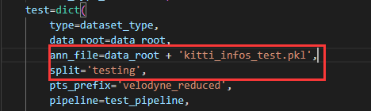
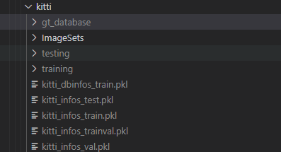

# 7.4 数据集配置与训练测试（训练前必看）

# KITTI数据集

## mmdetection3d框架

### 下载数据集

从服务器上拷贝到自己的mmdetection3d目录下的data/kitti

（以3090为例）

> cd mmdetection3d
>
> mkdir data/kitti
>
> mkdir data/ImageSets
>
> cp -r /home/adept3090/sdb/dataset/KITTI/training ./data/kitti
>
> cp -r /home/adept3090/sdb/dataset/KITTI/testing ./data/kitti

拷贝的目录应具有

ImageSets，testing，training3个文件夹

(.pkl文件和gt\_database文件夹是由下面的createdata生成的，可以先不拷贝)

下载并配置数据集分割模板

> wget -c  https://raw.githubusercontent.com/traveller59/second.pytorch/master/second/data/ImageSets/test.txt --no-check-certificate --content-disposition -O ./data/kitti/ImageSets/test.txt
>
> wget -c  https://raw.githubusercontent.com/traveller59/second.pytorch/master/second/data/ImageSets/train.txt --no-check-certificate --content-disposition -O ./data/kitti/ImageSets/train.txt
>
> wget -c  https://raw.githubusercontent.com/traveller59/second.pytorch/master/second/data/ImageSets/val.txt --no-check-certificate --content-disposition -O ./data/kitti/ImageSets/val.txt
>
> wget -c  https://raw.githubusercontent.com/traveller59/second.pytorch/master/second/data/ImageSets/trainval.txt --no-check-certificate --content-disposition -O ./data/kitti/ImageSets/trainval.txt

（可以根据训练需要，对其中的样本数进行修改）

trainval里存放的是带有label的7481个样本，用于训练和验证

train里存放的训练样本

val里存放的是验证样本

test里存放的是不带label的7518个样本

此时的目录结构应如下：

> ├── data
>
> │├── kitti
>
> ││├── ImageSets
>
> ││├── testing
>
> │││├── calib
>
> │││├── image\_2
>
> │││├── velodyne
>
> ││├── training
>
> │││├── calib
>
> │││├── image\_2
>
> │││├── label\_2
>
> │││├── velodyne
>
> │││├── planes (optional)

### 生成数据文件（训练前必须生成）

使用的是mmdetection3d框架

> python tools/create\_data.py kitti --root-path ./data/kitti --out-dir ./data/kitti --extra-tag kitti

之后会在目录下生成pkl文件用于索引，更多细节见[文章](https://blog.csdn.net/hgj1h/article/details/124567215)。

> ├── data
>
> │├── kitti
>
> ││├── ImageSets
>
> ││├── testing
>
> │││├── calib
>
> │││├── image\_2
>
> │││├── velodyne
>
> ││├── training
>
> │││├── calib
>
> │││├── image\_2
>
> │││├── label\_2
>
> │││├── velodyne
>
> ││├── kitti\_gt\_database
>
> ││├── kitti\_infos\_train.pkl
>
> ││├── kitti\_infos\_trainval.pkl
>
> ││├── kitti\_infos\_val.pkl
>
> ││├── kitti\_infos\_test.pkl
>
> ││├── kitti\_dbinfos\_train.pkl

### train与test配置

运行test之前需要修改`configs/_base_/datasets/kitti-3d-3class.py` 中130行左右的代码 修改如下：

（如果使用car类别同样也需要这样去设置kitti-3d-car.py）

### 训练

* 单卡训练

`python tools/train.py configs/pointpillars/hv_pointpillars_secfpn_6x8_160e_kitti-3d-3class.py --gpu-id 0 --work-dir ./works_dir/train >> ./out_dir/2022.5.21_2_pointpillars.out&`

config文件是必选参数

gpuid默认为0 需要手动指定为空闲gpu

work-dir为工作目录，会生成tensorboard的相关文件以及权重文件和日志等信息

out\_dir 指定日志生成目录

* 多卡训练

<code>CUDA_VISIBLE_DEVICES=6,8 nohup tools/dist_train.sh configs/pointpillars/hv_pointpillars_secfpn_6x8_160e_kitti-3d-3class.py 2 --resume-from ./works_dir/train/latest.pth --work-dir ./works_dir/train >> ./out_dir/pointpillars.out& </code>

CUDA\_VISIBLE\_DEVICES是指定的gpu，指定几个就需要在configs参数后指定相应的线程，例中指定两张卡就需要2线程。

nohup 命令为不挂断地运行命令，可以理解为后台运行不需要一直开着teminal，期间可以在日志文件夹查看训练情况(out\_dir目录)

\--resume-from 是用来断点训练的，从0训练不需要填入（单卡也可以断点训练）

## OpenPCDet框架

### 下载数据集

下载数据集与mmdetection3d一致

### 生成数据文件

创建data索引

与mmdetection3d类似，在文件ImageSets分割模板下载好之后。数据如下

> ├── data
>
> │├── kitti
>
> ││├── ImageSets
>
> ││├── testing
>
> │││├── calib
>
> │││├── image\_2
>
> │││├── velodyne
>
> ││├── training
>
> │││├── calib
>
> │││├── image\_2
>
> │││├── label\_2
>
> │││├── velodyne
>
> │││├── planes (optional)

执行`python -m pcdet.datasets.kitti.kitti_dataset create_kitti_infos tools/cfgs/dataset_configs/kitti_dataset.yaml`

来生成数据info文件（注意kitti\_dataset.yaml文件里的路径配置）

如果报错

> load() missing 1 required positional argument: 'Loader'

是因为你的当前环境的 `pyyaml`版本 不再支持这个方法

解决方法1：降级

`pip install pyyaml==5.4.1`

解决方法2：替换函数

用safe\_load()替换load()

生成后的文件与mmdetection3d类似

### 训练

使用OpenPCDet训练网络，是运行tools目录下运行train.py，具体例如，运行

<code>python train.py --cfg_file cfgs/kitti_models/pointpillar.yaml</code>

其中<code>--cfg_file</code>参数是需要训练的网络的配置文件。

或者

<code>CUDA_VISIBLE_DEVICES=0,1,2,3 python -m torch.distributed.launch --nproc_per_node=4 train.py --launcher pytorch --batch_size 8 --extra_tag baseline --cfg_file cfgs/kitti_models/pointpillar.yaml</code>

其中<code> CUDA_VISIBLE_DEVICES=0,1,2,3 </code>表明使用gpu 0,1,2,3

<code>python -m torch.distributed.launch</code> 使用torch.distributed.launch工具进行分布式训练

<code>--nproc_per_node=4</code>表明使用4个gpu

<code>train.py</code> 运行的是train.py 这个文件

<code>--launcher pytorch</code> 使用的是pytorch架构

<code>--batch_size 8</code> 表明 bs=8

<code>--extra_tag baseline</code> 给此次训练加一个额外标签叫做baseline，这个会在输出的工作路径下创建一个baseline文件夹，所有生成的文件均在里面

<code>--cfg_file cfgs/kitti_models/pointpillar.yaml</code> 使用的配置文件的路径

在服务器上进行长时间训练时需要让任务在后台运行并且在断开连接够继续训练，使用 nohup 和 &，例如

<code>CUDA_VISIBLE_DEVICES=0,1,2,3 nohup python -m torch.distributed.launch --nproc_per_node=4 train.py --launcher pytorch --batch_size 8 --extra_tag baseline --cfg_file cfgs/kitti_models/pointpillar.yaml &</code>

此时任务运行时输出会自动重定向到nohup.out，使用 tail -f nohup.out 即可看到实时输出。也可使用 > 重定向到任一文件。

### 测试

使用test.py工具 指定好对应的参数，如果要生成提交榜单的txt文件，请指定save\_to\_file参数为True

# 关于Tensorboard

使用vscode在调用`tensorboard --logdir=./work_dir/`命令后

会自动将服务器的端口映射到本地

直接去本地`localhost:6006`查看即可

# 框架训练常见的一些问题

## 报错 ：no module name 'pcdet'

在容器内编译后，运行代码出现上面的提示，因此需要在容器内说明一下，执行以下命令：

`export PYTHONPATH=$HOME/Cicv_task1_223/:$PYTHONPATH`

即可正常运行

## libGL.so.1

提示:libGL.so.1: cannot open shared object file: No such file or directory

在镜像环境内

apt update

apt install libgl1-mesa-glx

## KeyError: 'lidar\_idx'

把数据放到根目录下的data里

例如：数据集原来不在OpenPCDet/data中，现在把数据集OpenPCDet/data中

原因：待解决

## KeyError: 'road\_plane'

plane数据没有拷贝

解决方法1：拷贝进来plane数据

解决方法2：在算法的ymal文件中把`USE_ROAD_PLANE`改为`False`

## module 'spconv' has no attribute 'SparseModule'

是spconv版本迭代导致的错误

找到报错位置的文件将头文件

`import spconv`

改成

`import spconv.pytorch as spconv`

> 更新: 2023-05-05 14:03:54  
> 原文: <https://3dcv.yuque.com/org-wiki-3dcv-mm1l0t/ysgfp9/tt2frm_do9kxg>