# 7.5 论文实验部分细节（数据集划分KITTI）

# 总结
由于早期KITTI 的 test 在线评估中没有 3D object detection标签，大部分论文在实验阶段将带有标签的训练数据 train/val 划分为 1:1 具体数字被提出是在VoxelNet中 3712/3769，用于

部分方法在提交榜单成绩时，会划分较多的数据集用于训练 例如 **80/20** **90/10。**

**2019年8月10日 KITTI官网test server 用40 recall position 代替了 11 recall position。**

# 3d-object-proposals-for-accurate-object-class-detection
**2015 NIPS**

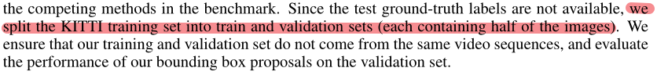

1:1

# MV3D
**2017 CVPR**

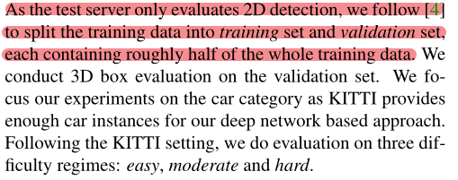

**[4]  3d-object-proposals-for-accurate-object-class-detection**

**trian set**和**val set**每个大约占一半的训练数据

也就是**1:1**

# VoxelNet
**2018 CVPR**

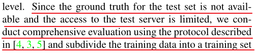

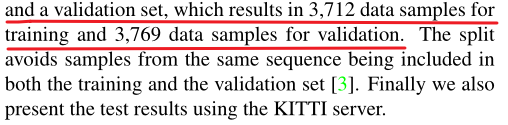

一共7481个数据 分为3712 作为训练集 3769作为验证集

大约也是1:1

# SECOND
**2018 sensors**

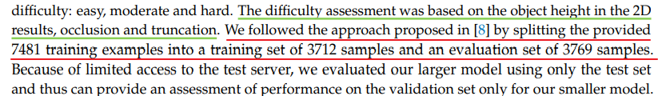

红线部分

我们根据之前发布的方法[8]划分数据集 也就是MV3D中的划分方法

train:val = 3712:3769 ≈ 1:1

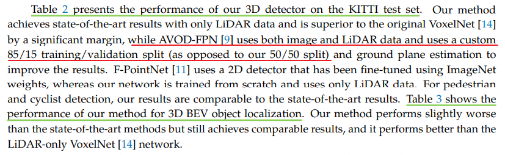

AVOD-FPN用了**85/15**的划分方式 而我们用的是**50/50**

# PointPillars
**2019 CVPR**

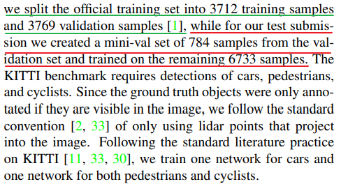

实验阶段用的trian/val划分为 ** 1:1**

提交榜单时使用的trian/val划分为 ** 6733/784 **≈** 9/1**

# PointRCNN
**2019 CVPR**

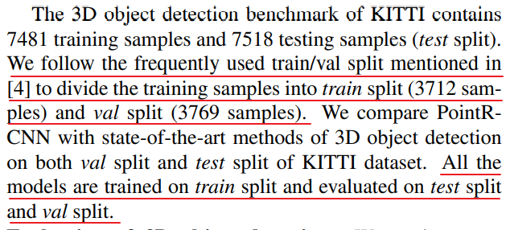

[4] MV3D

frequently used** train/val **split** 3172/3769**

# PV-RCNN
**2020 CVPR**

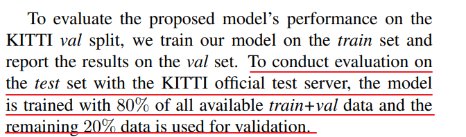

为了刷榜 **train/val**划分为 **80/20**

# Point GNN
**2020 CVPR**

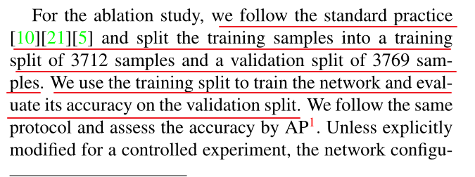

消融实验中采用 **train/val** 划分为 **3712/3769**

提交test中没有细说

# PointPaint
**2020 CVPR**

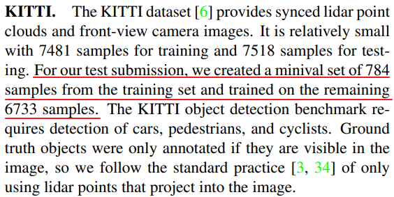

提交test时 使用的划分为** 6733/784** 约等于 **90/10**

# PartA2
**2021 PAMI**

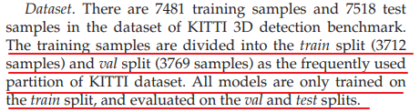

**3712 / 3769**

# Voxel RCNN
**2021 AAAI**

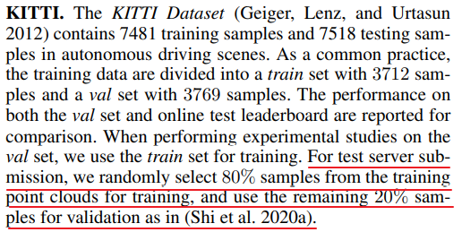

提交测试时 使用的划分为 **80/20**

# IA-SSD
**2022 CVPR**

****

实验部分用的是** 1/1 **划分

提交test时的划分没有说明

# VoxSeT
**2022 CVPR**

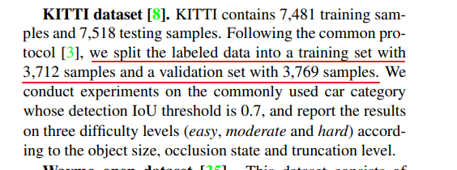

实验阶段 **3712/3769 划分**

# 总结
由于早期KITTI 的 test 在线评估中没有 3D object detection标签，大部分论文在实验阶段将带有标签的训练数据 train/val 划分为 1:1 具体数字被提出是在VoxelNet中 3712/3769，用于

部分方法在提交榜单成绩时，会划分较多的数据集用于训练 例如 **80/20** **90/10。**

**2019年8月10日 KITTI官网test server 用40 recall position 代替了 11 recall position。**

****

> 更新: 2024-08-14 21:00:58  
> 原文: <https://3dcv.yuque.com/org-wiki-3dcv-mm1l0t/ysgfp9/ogh93q_urzuv5>