# nuScenes子集划分及使用

**nuScenes训练集包含700个场景，子集划分方法分为两种按场景划分和按帧数划分，本文会对两种方法依次讲解。**

# OpenPCDet框架划分1/4数据集以及[使用](#pF97o) （按照场景数量划分）

现有的data目录结构如下

```yaml
data
├── kitti
├── argo2
├── waymo
├── nuscenes
│   └── v1.0-trainval
│       ├── samples
│       ├── maps
│       ├── gt_database_10sweeps_withvelo
│       ├── sweeps
│       ├── v1.0-trainval
│       ├── nuscenes_infos_10sweeps_val.pkl
│       ├── nuscenes_infos_10sweeps_train.pkl
│       └── nuscenes_dbinfos_10sweeps_withvelo.pkl
└── once
    └── ImageSets
```

如果已有`nuscenes_infos_10sweeps_1_4_train.pkl`文件直接跳到[5. 使用](#pF97o)

默认的生成程序如下

```markdown
python -m pcdet.datasets.nuscenes.nuscenes_dataset --func create_nuscenes_infos \
    --cfg_file tools/cfgs/dataset_configs/nuscenes_dataset.yaml \
    --version v1.0-trainval \
    --with_cam
```

我们需要修改下列py文件中指定的划分区

`OpenPCDet/pcdet/datasets/nuscenes/nuscenes_dataset.py`

### 注释掉gt文件生成

不需要再次生成groundtruth\_database文件，所以注释掉429-434行，如下：


### 划分子集

划分子集。在366行 `train_scenes = splits.train`下插入

```python
import random

random.shuffle(train_scenes)
train_scenes = train_scenes[:int(len(train_scenes)*0.25)] # 0.25 为 1/4；0.5为 1/2 以此类推
```

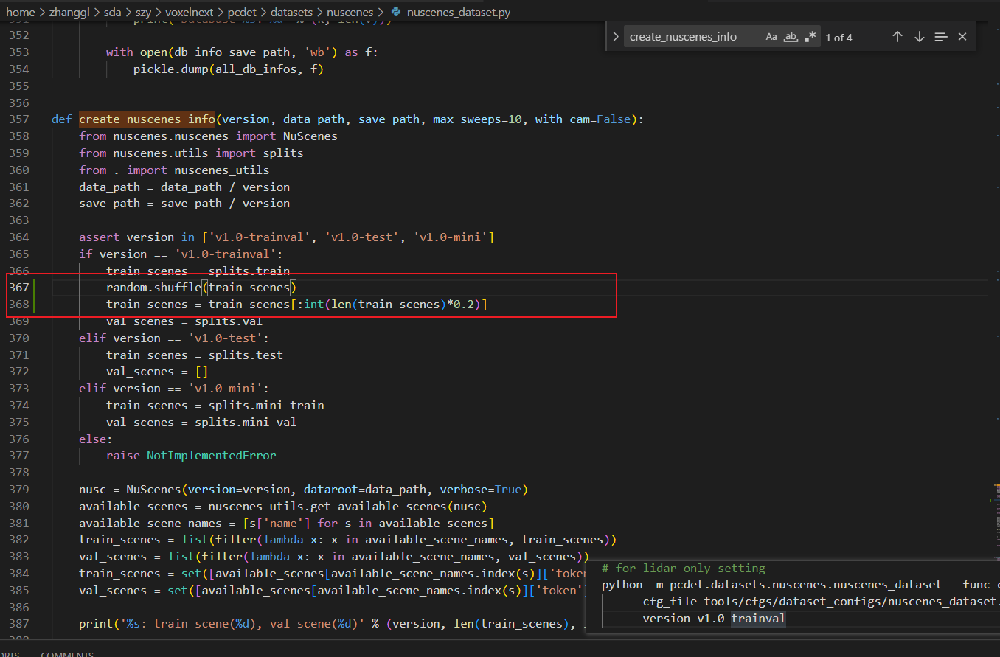

### 修改pkl文件名字

为了方便区分，我们将子集pkl的文件名进行修改，第400行是存储pkl的代码，将其修改一下。(图中400行为原始的，401行为修改后)。

```python
# with open(save_path / f'nuscenes_infos_{max_sweeps}sweeps_train.pkl', 'wb') as f:
with open(save_path / f'nuscenes_infos_{max_sweeps}sweeps_1_4_train.pkl', 'wb') as f: # 1/4子集
```


### 执行

```markdown
python -m pcdet.datasets.nuscenes.nuscenes_dataset --func create_nuscenes_infos \
    --cfg_file tools/cfgs/dataset_configs/nuscenes_dataset.yaml \
    --version v1.0-trainval \
    --with_cam
```

等待即可，结束后会在目录下生成一个`步骤3中修改过名字的pkl文件`，如下。

```yaml
data
├── kitti
├── argo2
├── waymo
├── nuscenes
│   └── v1.0-trainval
│       ├── samples
│       ├── maps
│       ├── gt_database_10sweeps_withvelo
│       ├── sweeps
│       ├── v1.0-trainval
│       ├── nuscenes_infos_10sweeps_val.pkl
│       ├── nuscenes_infos_10sweeps_train.pkl
│       ├── nuscenes_infos_10sweeps_1_4_train.pkl # 新生成的1/4子集pkl
│       └── nuscenes_dbinfos_10sweeps_withvelo.pkl
└── once
    └── ImageSets
```

已经生成的数据集\*\*（可直接使用）\*\*

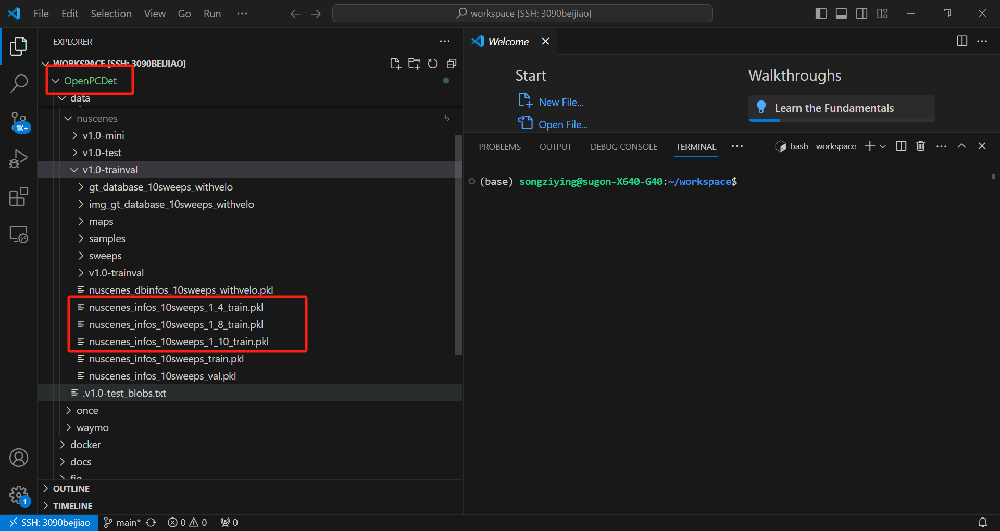

### 使用

在模型的cfg文件里新增或修改INFO\_PATH，例如我的模型cfg文件是`OpenPCDet/tools/cfgs/nuscenes_models/bevfusion.yaml`，如果我要使用1/4子集，就需要添加INFO\_PATH。**（有些模型cfg文件默认没有INFO\_PATH参数而是继承了BASE\_CONFIG，有些模型cfg文件已有INFO\_PATH则直接修改成红框里的即可）**

添加INFO\_PATH (注意缩进)

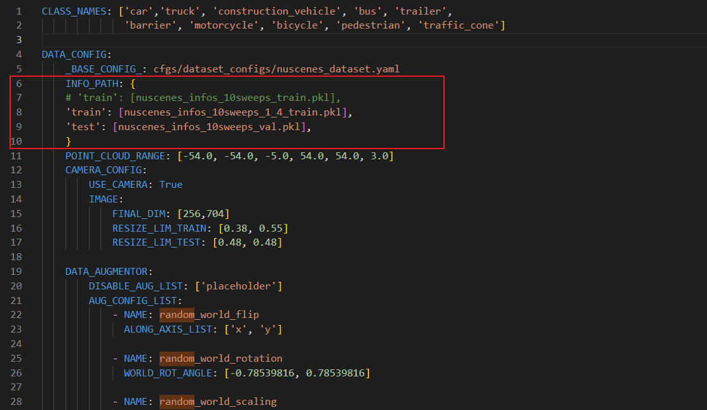

```yaml
  INFO_PATH: {
      # 'train': [nuscenes_infos_10sweeps_train.pkl],
      'train': [nuscenes_infos_10sweeps_1_4_train.pkl],
      'test': [nuscenes_infos_10sweeps_val.pkl],
      }
```

# OpenPCDet 按照帧数划分(比较推荐)

1. 确认你已经生成了全量数据集的pkl文件： `nuscenes_infos_10sweeps_train.pkl`。没有请按照OpenPCdet的README生成（重点提示不用生成1/4）
2. 在`OpenPCDet/pcdet/datasets/nuscenes/nuscenes_dataset.py`的46行中插入如下代码

```python
ratio = 0.25 # 子集的占比
nuscenes_infos = np.random.choice(nuscenes_infos, int(len(nuscenes_infos)*ratio), replace=False) # replace不允许重复
```

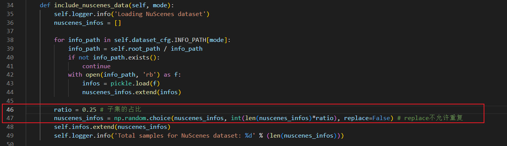

3. 按照正常训练启动

**TODO： 可以固定种子来保证每次随机选择的帧数一致**

# **Openpcdet按照帧数划分，集成超参数无需手动修改**

首先在train.py里面的超参数设定里面新增语句

```plain
 parser.add_argument('--split', type=float, default=1.0, help='data split for training')
```

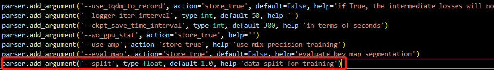

在随后的train.py构建数据集函数中新增参数

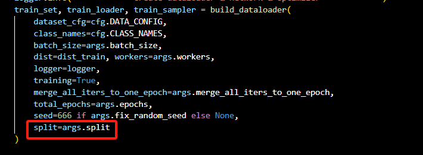

修改dataset文件夹中init.py中的build\_dataloader函数

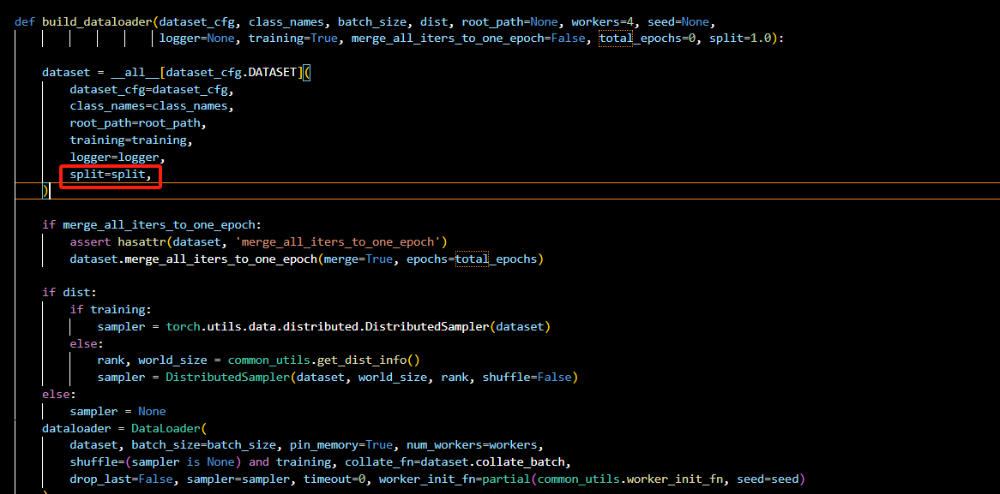

修改nuscenes\_dataset.py

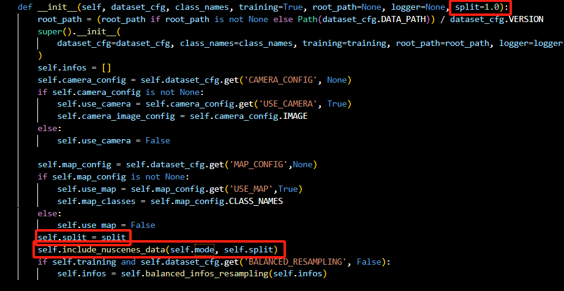

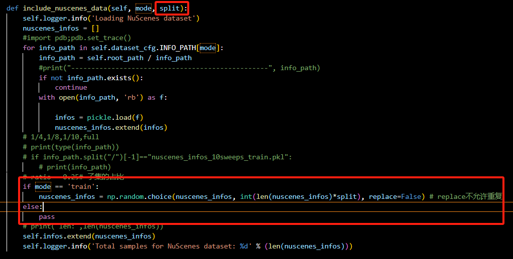

# mmdetection3d 按照场景数划分

**#TODO**

# mmdetection3d 按照帧数间隔读取

1. 修改`load_interval`

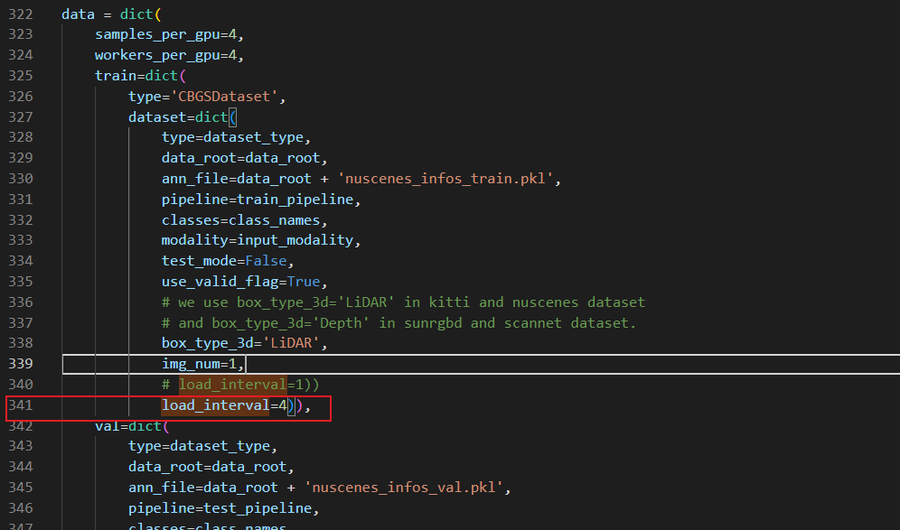

2. 将`data`里`train`中的`load_interval=1`修改为 `4`示读取间隔为4 即1/4子集

如果config中没有data，那么该config是从父类config中继承了data。直接添加`load_interval=4`即可。

例如：`configs/pointpillars/hv_pointpillars_fpn_sbn-all_4x8_2x_nus-3d.py`中都是继承的父类config

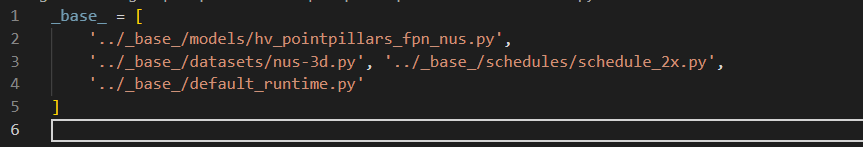

添加进来即可

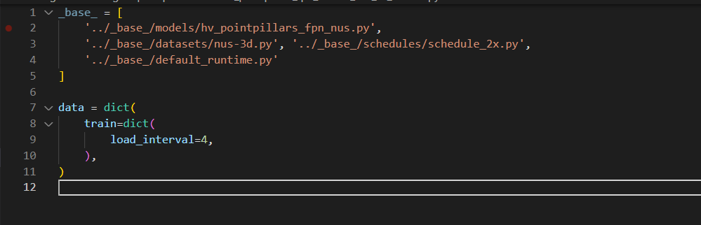

如果你的dataset是\*\*<font style="color:#DF2A3F;">CBGS</font>\*\*类型，需要将其加入到`data.train.dataset`这一级dict下，如 [1.](#vFJwd) 中的图

# 数据量

nuscenes中共有1000个场景

train:val:test的比例为 700:150:150

训练时大部分代码库会采用[CBGS](https://arxiv.org/abs/1908.09492)采样策略来抵抗样本不平衡问题，所以CBGS后的帧数是真实训练一个Epoch遍历的帧数。

| 数据集 | 场景数量 | 关键帧数 | CBGS后帧数 |
| --- | --- | --- | --- |
| full train set | 700 | 28130 | 123580 |
| 1/4 train set | 175 | ~7031 | ~30940 |
| 1/8 train set | 87 | ~3499 | ~14400 |
| 1/10 train set | 70 | ~2808 | ~12370 |
| val | 150 | 6019 |  |
| test | 150 | 6008 | |

`~`：由于子集是按照场景是随机划分的，所以每个人的划分可能有变动(大约数量是差不多的)。


> 更新: 2024-12-18 14:41:05  
> 原文: <https://3dcv.yuque.com/org-wiki-3dcv-mm1l0t/ysgfp9/hlbpplgz0tpstlni>