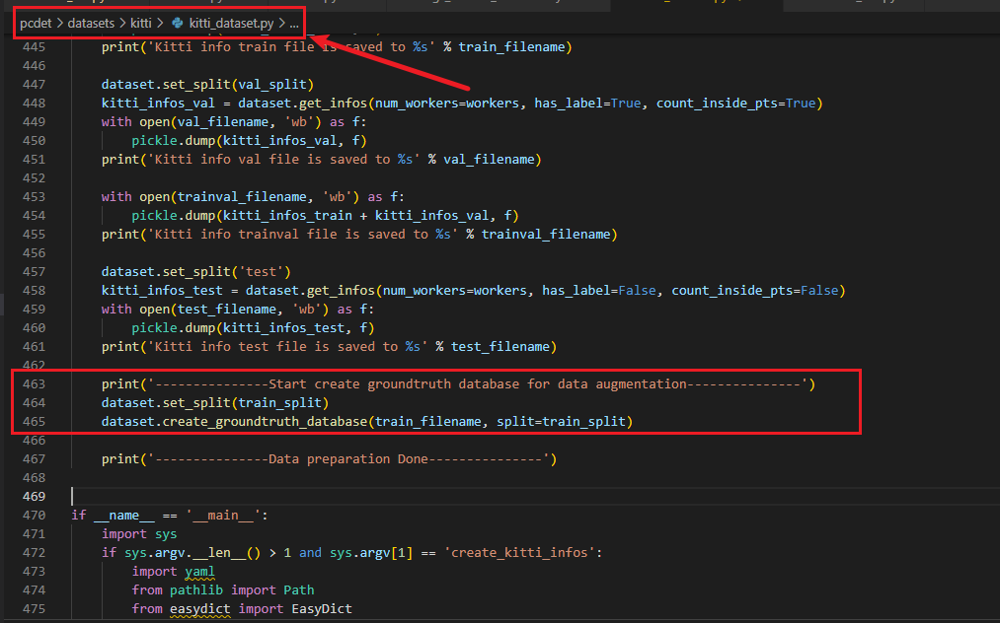
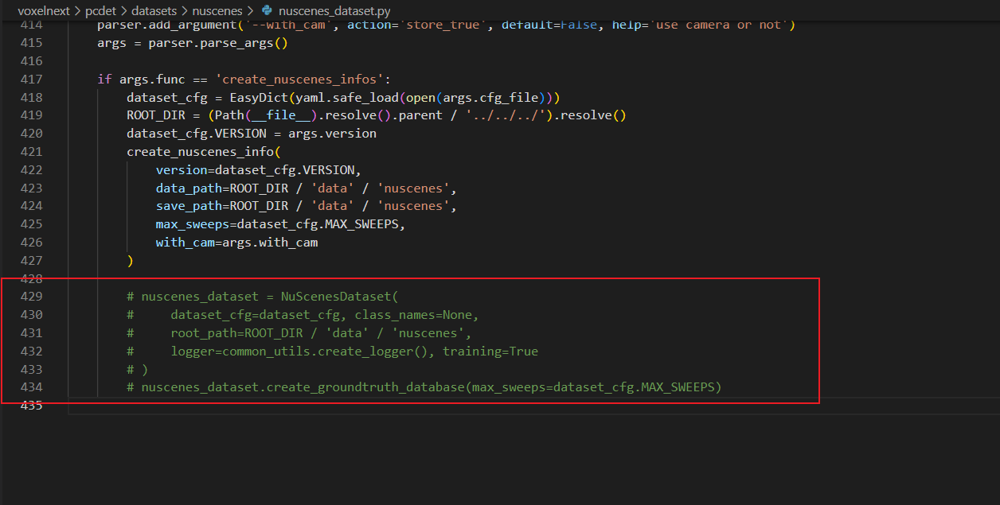
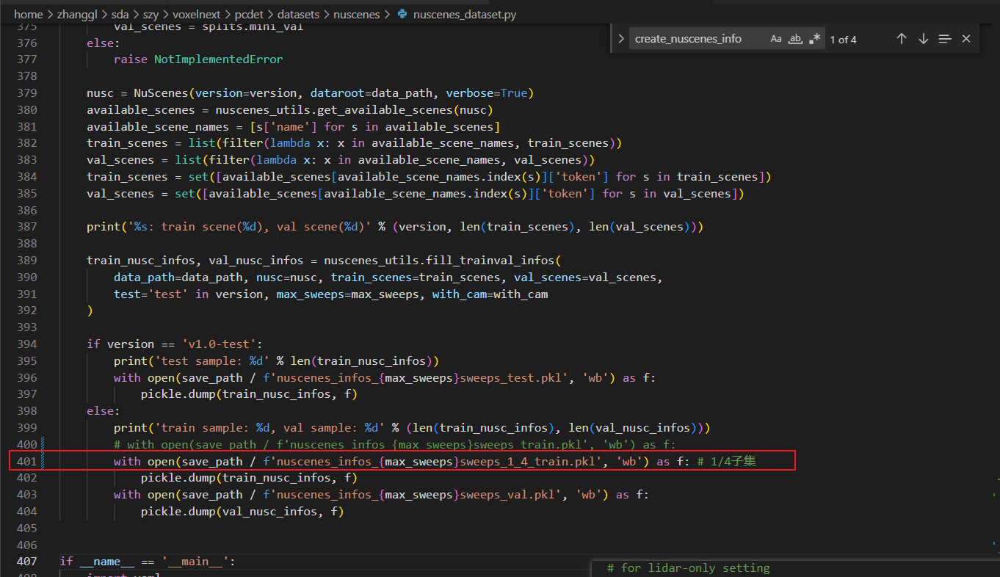

# 数据集不同比例的划分(KITTI、nuScenes等)

# KITTI

常用的训练框架（OpenPCDet、MMDetection3d）中，通过`KITTI/ImageSets/`下的`.txt`文件来进行`.pkl`文件的生成，为此我们需要变动这些文件(`train.txt; val.txt`)来再生成`.pkl`文件。

代码实现：

```python
import sys
sys.path.insert(0, './')
import os
import argparse
import random
import numpy as np


def parse_config():
    parser = argparse.ArgumentParser(description='arg parser')
    parser.add_argument('--trainval', type=str, default="trainval.txt", help='specify the config for training')
    parser.add_argument('--train', type=str, default="train.txt", help='specify the config for training')
    parser.add_argument('--val', type=str, default="val.txt", help='specify the config for training')

    # parser.add_argument('--train2', type=str, default="../training/ImageSets/train.txt", help='specify the config for training')
    # parser.add_argument('--val2', type=str, default="../training/ImageSets/val.txt", help='specify the config for training')
    # 训练集/验证集 比例 9 ： 1
    parser.add_argument('--ratio', type=float, default=1.0, help='specify the config for training, for kitti val the ratio is always 0.4962.') 
    args = parser.parse_args()
    return args

def main():
    args = parse_config()

    trainval_path = os.path.join(args.trainval)
    # print(trainval_path)
    f_trainval_path_arr=[]
    f_trainval_path=open (file = str(trainval_path), mode = "r", encoding = "utf-8").read()

    f_trainval_path_arr=np.array(f_trainval_path.split("\n"))
    # print(len(f_trainval_path_arr),int(len(f_trainval_path_arr)*args.ratio))
    train_index=random.sample(range(0,len(f_trainval_path_arr)),int(len(f_trainval_path_arr)*args.ratio))
    val_index=[ i for i in range(0,len(f_trainval_path_arr)) if i not in train_index ]
    print(len(train_index))
    print(len(val_index))
    print(f_trainval_path_arr[train_index])


    f_train_path_str="".join(str(i)+"\n" for i in f_trainval_path_arr[train_index])
    f_train_path_str=f_train_path_str.rstrip('\n')
    with open(file = str(args.train), mode = "w", encoding = "utf-8") as f_train:
        f_train.write(f_train_path_str)
        # with open(file = str(args.train2), mode = "w", encoding = "utf-8") as f_train:
        #     f_train.write(f_train_path_str)

    f_val_path_str="".join(str(i)+"\n" for i in f_trainval_path_arr[val_index])
    f_val_path_str=f_val_path_str.rstrip('\n')
    with open(file = str(args.val), mode = "w", encoding = "utf-8") as f_val:
        f_val.write(f_val_path_str)
        # with open(file = str(args.val2), mode = "w", encoding = "utf-8") as f_val:
        #     f_val.write(f_val_path_str)

        # os.chdir("/root/code/OpenPCDet_learning")
        # os.chdir("/home/zhangyu/zgx/mmdetection3d")
        # print(os.getcwd())
        # os.system("python -m pcdet.datasets.kitti.kitti_dataset create_kitti_infos tools/cfgs/dataset_configs/kitti_dataset.yaml")
        # os.system("python tools/create_data.py kitti --root-path ./data/kitti --out-dir ./data/kitti --extra-tag kitti")


if __name__ == '__main__':
    main()
```

parser.add\_argument('--ratio', type=float, default=1.0, help='specify the config for training, for kitti val the ratio is always 0.4962.')

修改上述代码中的default 参数 (   default=1.0   该比例为 train : test )  在第18行。

上述代码可以修改`.txt`文件中的比例，但是还需要生成`.pkl`文件。运行框架（OpenPCDet、MMDetection3D）中的生成工具。然后再训练就可以了。

**注意1：代码运行时只读取**<code>**.pkl**</code>**文件，**<code>**ImageSets/*.txt**</code>**不会影响训练和测试过程，**<code>**nuScenes**</code>**也是如此。**

**注意2：数据增强需要用到**<code>**gt_base**</code>**点云文件，根据自己的需求决定是否再生成一次，如果不需要再生成注释掉相应的部分即可：**

**例如：OpenPCDet框架下，我需要注释掉**<code>**pcdet/datasets/kitti/kitti_dataset.py**</code>**中的**<code>**463、464、465**</code>**行代码。**



**#TODO：MMDetection3D**

# nuScenes子集划分

## OpenPCDet框架划分1/5数据集

默认的生成程序如下

```markdown
python -m pcdet.datasets.nuscenes.nuscenes_dataset --func create_nuscenes_infos \
    --cfg_file tools/cfgs/dataset_configs/nuscenes_dataset.yaml \
    --version v1.0-trainval \
    --with_cam
```

我们需要修改下列py文件中指定的划分区

`OpenPCDet/pcdet/datasets/nuscenes/nuscenes_dataset.py`

### 注释gt文件生成

不需要再次生成groundtruth\_database文件，所以注释掉429-434行，如下：



### 划分子集

划分子集。再366行 `train_scenes = splits.train`下插入

```python
random.shuffle(train_scenes)
train_scenes = train_scenes[:int(len(train_scenes)*0.2)] # 0.2 为 1/5；0.5为 1/2 以此类推
```


### 修改pkl文件名字

为了方便区分，我们将子集pkl的文件名进行修改，第400行是存储pkl的代码，将其修改一下。(图中400行为原始的，401行为修改后)。

```python
# with open(save_path / f'nuscenes_infos_{max_sweeps}sweeps_train.pkl', 'wb') as f:
with open(save_path / f'nuscenes_infos_{max_sweeps}sweeps_1_4_train.pkl', 'wb') as f: # 1/4子集
```



### 执行

```markdown
python -m pcdet.datasets.nuscenes.nuscenes_dataset --func create_nuscenes_infos \
    --cfg_file tools/cfgs/dataset_configs/nuscenes_dataset.yaml \
    --version v1.0-trainval \
    --with_cam
```

等待即可，结束后会在数据集目录下生成一个`步骤3中修改过名字的pkl文件`。

### 使用

在模型的cfg文件里新增或修改INFO\_PATH，例如我的模型cfg文件是`OpenPCDet/tools/cfgs/nuscenes_models/bevfusion.yaml`，如果我要使用1/4子集，就需要添加INFO\_PATH。**（有些文件默认没有INFO\_PATH参数而是继承了BASE\_CONFIG，有些文件已有INFO\_PATH则直接修改成红框里的即可）**

添加INFO\_PATH (注意缩进)


```yaml
  INFO_PATH: {
      # 'train': [nuscenes_infos_10sweeps_train.pkl],
      'train': [nuscenes_infos_10sweeps_1_4_train.pkl],
      'test': [nuscenes_infos_10sweeps_val.pkl],
      }
```

# Waymo


> 更新: 2023-06-28 17:23:55  
> 原文: <https://3dcv.yuque.com/org-wiki-3dcv-mm1l0t/ysgfp9/br91iovngh5k2we1_wdmae2>