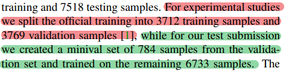
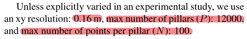
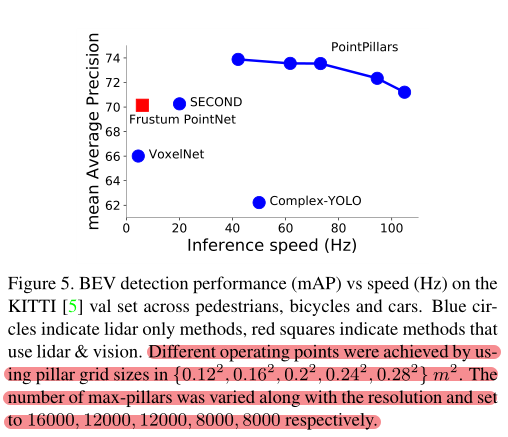
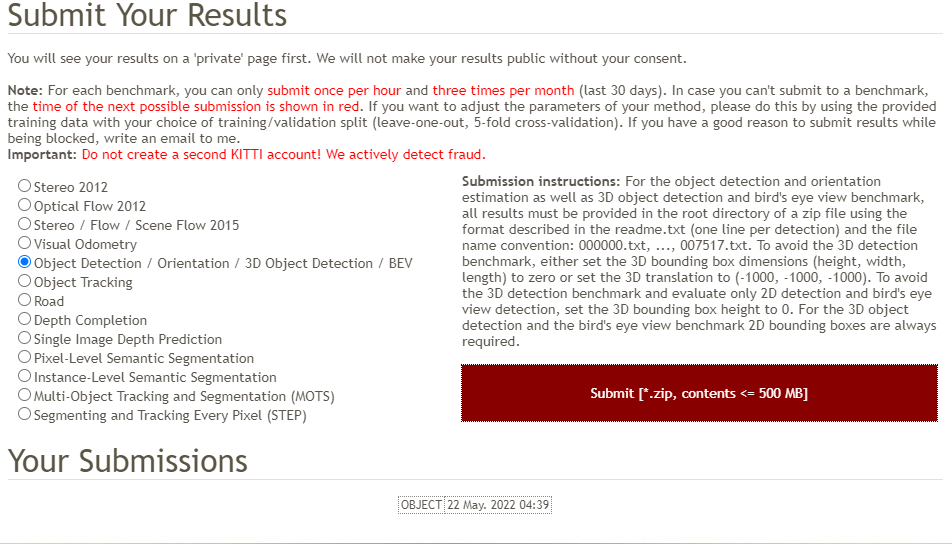
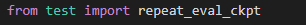
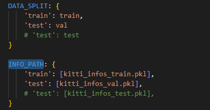
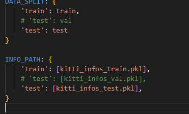

# 7.6 PointPillars复现

# 使用mmdet3d框架复现

## 数据集设置

（如果为了达到论文的结果可以设置，只是练习复现流程可以忽略此步）



train/val/test

实验使用的是25/25/50分割

提交测试时使用的是45/5/50分割

使用`split_train_val_random.py`进行分割

分割后记得重新使用`create_data`生成info文件

## 参数设置

（如果为了达到论文的结果可以设置，只是练习复现流程可以忽略此步）



xy分辨率 0.16m

最大数量pillars 12000

每个pillar最大点云个数 100

关于设置 论文中给出了不同设置性能的变化



网格越小（也就是分辨率越大），预测约准确但是同样推理速度会一定的下降。

（降低分辨率最高可达105hz，还能保持不错的准确率）

论文给出的实验数据设置为

`voxel_size = [0.16, 0.16, 4]`

`max_voxels=(12000, 40000)`

`max_num_points=100`

(在 `configs/_base_/models/hv_pointpillars_secfpn_kitti.py` 中进行相应的修改)

> * <font style="color:rgb(64, 72, 91);">On a single 1080Ti, training xyres\_16 requires approximately 20 hours for 160 epochs.</font>

关于160 epochs，框架中使用了RepeatDataset其中repeat factor设置为2

所以<code>runner = <font style="color:#8888c6;">dict</font>(<font style="color:#aa4926;">max_epochs</font>=<font style="color:#6897bb;">80</font>)</code>实际运行了160epochs，不再进行修改。

schedules使用默认的`cyclic_40e.py`即可。

## 数据增强（待补充）

## 训练

参考[4.4](https://tsinghua-adept.yuque.com/vtwk4w/project/tt2frm#QJObg)

## 验证

每两个epoch会进行一次验证，验证结果在日志中可以看到。

也可以修回[data\_cfg](https://tsinghua-adept.yuque.com/vtwk4w/project/tt2frm#LF6fw)文件中ann\_file和split 执行test用来跑验证集

## 测试

确保修改了`configs/_base_/datasets/xxx.py`文件的test字典

> ```
> test=dict(
> ```
>
>        type=dataset\_type,
>
>        data\_root=data\_root,
>
>        ann\_file=data\_root + 'kitti\_infos\_test.pkl',
>
>        split='testing',

`python tools/test.py configs/xxx.py works_dir/epoch_xx.pth --gpu-id 0 --format-only --eval-options 'pklfile_prefix=./test_result/prefix' 'submission_prefix=./test_result/result'`

## 打包提交结果至官网

将test\_result文件夹下的结果txt文件打包成zip文件形式

`zip -q -r data.zip result/*`

**data.zip下只需要有7518个txt文件即可，不需要包含任何文件夹。**

将生成的文件下载到本地

去[官网](http://www.cvlibs.net/datasets/kitti/user_login.php)注册账号并申请提交资格（可能需要一到两天）

资格审核成功后可以提交自己的文件（一个账号每个月只能提交3次）



# 使用OpenPCDet框架

与mmdetection3d类似，修改数据集和参数设置类似

## 训练

参考[4.4](https://tsinghua-adept.yuque.com/vtwk4w/project/tt2frm#qqsJB)

## 验证与测试

跑完训练集会调用`train.py`的代码进行一次验证集验证

如果想再次跑验证集需要使用`test.py` （不要使用最后一个epoch传入train.py进行断点训练，这样验证时会有bug导致死循环）

train的验证过程也是调用了`test.py`里的`repeat_eval_ckpt()`函数



使用`test.py`进行验证需要修改`tools/cfgs/dataset_configs/kitti_dataset.yaml`中的`DATA_SPLIT`和`INFO_PATH`



验证时就使用如上设置，测试时就是用如下



同样，如果要验证测试集的结果需要打包上次至kitti官网

(请指定save\_to\_file参数为True即可生成txt文件)

例如：

`python test.py path/to/xxx.yaml --save_to_file --ckpt xx.pth`


> 更新: 2023-07-29 13:34:23  
> 原文: <https://3dcv.yuque.com/org-wiki-3dcv-mm1l0t/ysgfp9/ih31x6_mets5x>